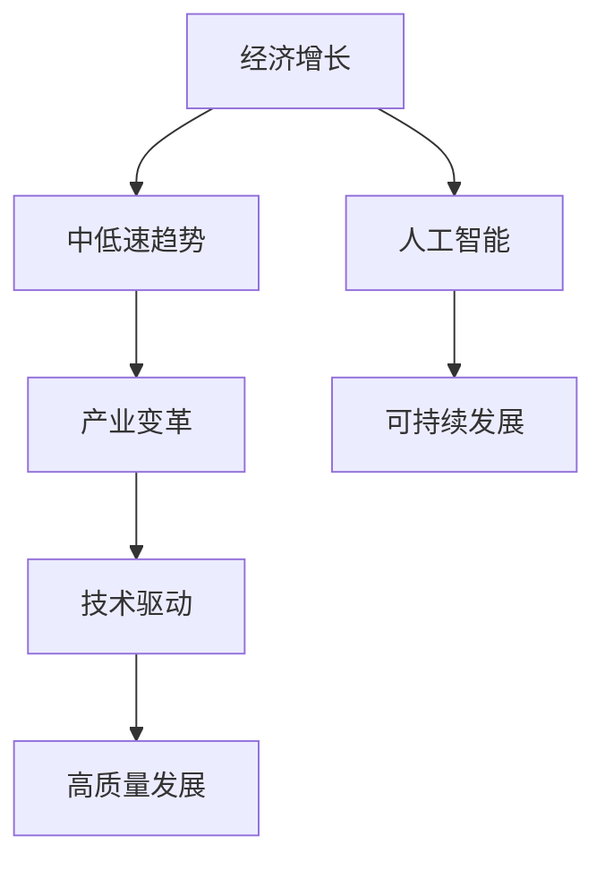
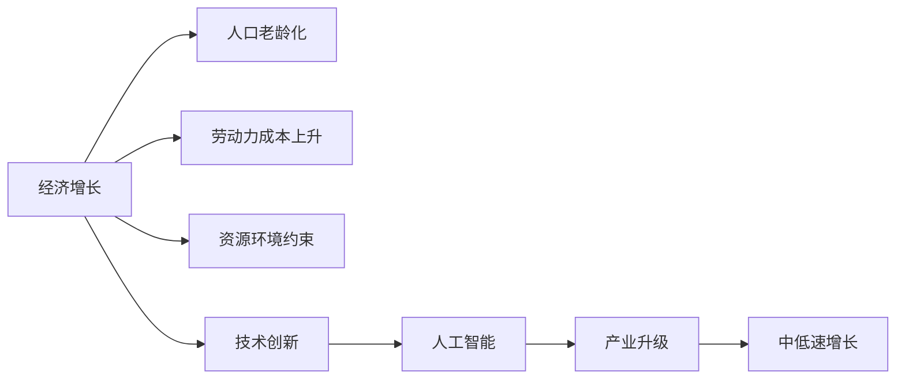
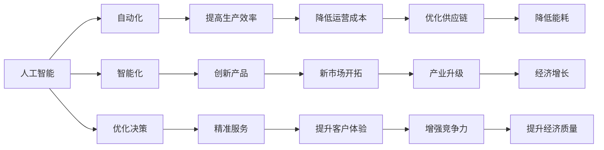
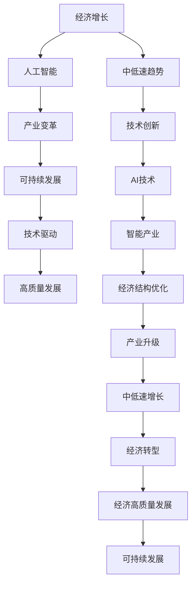

                 

# 未来经济增长的长期中低速趋势

> 关键词：经济增长,中低速趋势,人工智能,产业变革,可持续发展,技术驱动

## 1. 背景介绍

### 1.1 问题由来
近年来，全球经济增速放缓，发展不平衡不充分的问题日益凸显。在此背景下，未来经济增长的趋势成为了各国政府、企业以及学术界共同关注的热点话题。本研究旨在深入分析未来经济增长的中低速趋势及其驱动因素，为制定有效的经济政策提供科学依据。

### 1.2 问题核心关键点
1. **中低速趋势定义**：一般认为，如果经济增速保持在3-5%的区间，即可称为中低速增长。中低速增长不仅是对经济增速的简单描述，更是对经济发展质量和结构变化的深刻反映。
2. **驱动因素分析**：影响未来经济增长的主要因素包括人口老龄化、劳动力成本上升、资源环境约束、技术创新等。特别是技术创新，尤其是人工智能（AI）技术，被视为推动未来经济增长的关键动力。
3. **发展前景预测**：基于当前国际国内经济形势、技术进步趋势以及政策环境等因素，对未来经济增长的长期趋势进行预测和分析。

### 1.3 问题研究意义
理解未来经济增长的中低速趋势，有助于各国政府和企业制定更加科学、合理的经济发展策略，确保经济的长期稳定与可持续发展。同时，通过分析AI技术在未来经济增长中的作用，可以为推动经济转型升级、实现高质量发展提供新的思路和路径。

## 2. 核心概念与联系

### 2.1 核心概念概述

本节将介绍几个密切相关的核心概念：

- **经济增长**：指一个国家或地区在一定时期内，通过生产要素的投入和配置，实现产品和服务的增加。经济增长的速度、质量和结构变化，是衡量一个国家或地区经济社会发展水平的重要指标。
- **中低速趋势**：当经济增速保持在3-5%的区间时，通常称为中低速增长。这一趋势反映了经济增长速度放缓，但经济发展质量有所提升的现状。
- **人工智能（AI）**：利用计算机技术模拟人类智能行为，涵盖机器学习、深度学习、自然语言处理等技术领域。AI技术在各行各业的应用，被视为推动未来经济增长的重要驱动力。
- **产业变革**：指由于技术进步、市场需求变化等因素导致的产业结构调整和升级过程。AI技术的应用，将对传统产业进行深度改造和重构，促进产业升级。
- **可持续发展**：强调经济增长与环境保护、社会公平等多目标的协调一致，旨在实现长远的经济、社会和环境发展。

这些概念之间的逻辑关系可以通过以下Mermaid流程图来展示：



这个流程图展示了经济增长、中低速趋势、AI技术、产业变革、可持续发展之间的关系：

1. 经济增长是目标，中低速趋势反映了增长的速度和质量。
2. AI技术是推动经济增长和产业变革的重要驱动力。
3. 产业变革促进了经济结构的优化和升级。
4. 可持续发展强调了经济增长的质量，以实现长远的经济、社会和环境发展。

### 2.2 概念间的关系

这些核心概念之间存在着紧密的联系，形成了未来经济增长的完整框架。下面我们通过几个Mermaid流程图来展示这些概念之间的关系。

#### 2.2.1 经济增长的驱动因素



这个流程图展示了影响经济增长的主要因素及其对未来中低速趋势的影响：

1. 人口老龄化和劳动力成本上升导致劳动力供应减少，成本上升，对经济增长形成抑制。
2. 资源环境约束迫使经济结构调整，降低资源消耗，推动绿色发展。
3. 技术创新，特别是AI技术，成为推动经济增长的新动力。
4. AI技术的广泛应用促进了产业升级，提升了经济发展的质量和效率。

#### 2.2.2 AI技术在经济增长中的作用



这个流程图展示了AI技术在经济增长中的作用和影响：

1. AI技术通过自动化、智能化等手段，提高了生产效率，降低了运营成本。
2. AI技术创新了产品和服务，开拓了新市场，提升了客户体验和竞争力。
3. AI技术优化了决策流程，推动了产业升级和经济质量的提升。

### 2.3 核心概念的整体架构

最后，我们用一个综合的流程图来展示这些核心概念在未来经济增长中的整体架构：



这个综合流程图展示了从经济增长到中低速趋势，再到产业变革、可持续发展、技术驱动、高质量发展，再到经济转型和可持续发展的完整路径：

1. 经济增长是起点，中低速趋势反映了增长的速度和质量。
2. 技术创新，尤其是AI技术，成为推动经济增长和产业变革的关键驱动力。
3. 产业变革促进了经济结构的优化和升级，提升了经济发展的质量和效率。
4. 技术驱动和高质量发展，确保经济增长的可持续性和社会公平。

## 3. 核心算法原理 & 具体操作步骤
### 3.1 算法原理概述

基于中低速趋势和经济增长的概念，本节将从算法原理的角度，探讨未来经济增长的中低速趋势及其驱动因素。

**基本思想**：将经济增长视为一个复杂系统，其中包含人口、劳动力、资源、技术等多个子系统。这些子系统通过相互作用，共同影响经济增长的速度和质量。AI技术作为驱动因素之一，通过提高生产效率、优化决策流程等方式，对经济增长产生重要影响。

**算法步骤**：
1. **数据收集与预处理**：收集相关国家的经济数据、人口数据、劳动力数据、资源环境数据和技术创新数据。
2. **模型构建**：使用时间序列分析、回归分析等方法，建立经济增长模型。
3. **模型训练与验证**：利用历史数据对模型进行训练，并通过交叉验证等方法进行验证。
4. **结果分析与预测**：分析模型结果，预测未来经济增长的中低速趋势。

### 3.2 算法步骤详解

**步骤 1: 数据收集与预处理**

数据收集是进行经济增长分析的基础。主要数据来源包括：

- **经济数据**：国内生产总值（GDP）、人均GDP、就业率等。
- **人口数据**：人口总数、老年人口比例、劳动力参与率等。
- **资源环境数据**：能源消耗量、碳排放量、水资源利用率等。
- **技术创新数据**：专利申请量、研发投入、科技论文发表量等。

数据预处理包括数据清洗、归一化、缺失值处理等步骤，确保数据质量。

**步骤 2: 模型构建**

经济增长模型通常采用时间序列分析、回归分析等方法。本节以线性回归模型为例进行说明：

设经济增长率为 $y$，时间 $t$ 为自变量，其他因素 $x_1, x_2, ..., x_n$ 为解释变量。则线性回归模型为：

$$
y = \beta_0 + \beta_1 x_1 + \beta_2 x_2 + ... + \beta_n x_n + \epsilon
$$

其中 $\beta_i$ 为回归系数，$\epsilon$ 为误差项。

**步骤 3: 模型训练与验证**

利用历史数据对模型进行训练，通过最小二乘法等方法求解回归系数 $\beta_i$。然后，使用交叉验证等方法对模型进行验证，确保模型具有良好的泛化能力。

**步骤 4: 结果分析与预测**

根据模型结果，分析影响经济增长的主要因素。以AI技术为例，通过回归分析，找到AI技术对经济增长的影响系数。然后，结合人口、劳动力、资源环境等因素，预测未来经济增长的中低速趋势。

### 3.3 算法优缺点

**优点**：
1. **数据驱动**：通过大量数据驱动的模型，确保了分析结果的科学性和可靠性。
2. **结构清晰**：模型构建和分析过程清晰明了，易于理解和应用。
3. **预测能力强**：通过回归分析等方法，可以对未来经济增长进行较为准确的预测。

**缺点**：
1. **数据获取难度大**：相关数据的收集和预处理工作较为繁琐，需要大量时间和资源。
2. **模型假设限制**：线性回归模型等传统方法可能无法完全捕捉复杂的经济现象。
3. **结果解释性差**：模型结果的解释性较差，难以深入分析各因素之间的相互作用。

### 3.4 算法应用领域

基于中低速趋势和经济增长分析的算法，可以应用于以下领域：

- **政府政策制定**：帮助政府制定科学合理的经济发展政策，确保经济增长的可持续性和公平性。
- **企业战略规划**：帮助企业预测未来经济增长趋势，制定科学合理的经营战略。
- **学术研究**：为经济增长研究提供数据支持和分析工具，推动学术研究的发展。

## 4. 数学模型和公式 & 详细讲解  
### 4.1 数学模型构建

本节将使用数学语言对未来经济增长的中低速趋势进行更加严格的刻画。

设经济增长率为 $y_t$，时间 $t$ 为自变量，其他因素 $x_1, x_2, ..., x_n$ 为解释变量。则线性回归模型为：

$$
y_t = \beta_0 + \beta_1 x_{1t} + \beta_2 x_{2t} + ... + \beta_n x_{nt} + \epsilon_t
$$

其中 $\beta_i$ 为回归系数，$\epsilon_t$ 为误差项。

**目标函数**：最小化预测误差 $y_{t+1}$ 与实际值 $y_{t+1}$ 之间的差异。

**目标函数**：

$$
J(\beta) = \sum_{t=1}^{T} (y_{t+1} - \hat{y}_{t+1})^2
$$

其中 $\hat{y}_{t+1}$ 为模型预测值。

**优化目标**：最小化目标函数 $J(\beta)$。

### 4.2 公式推导过程

以线性回归模型为例，进行公式推导过程：

**步骤 1: 目标函数构造**

$$
J(\beta) = \sum_{t=1}^{T} (y_{t+1} - \hat{y}_{t+1})^2
$$

**步骤 2: 目标函数最小化**

将目标函数对 $\beta_i$ 求偏导数，并令其等于0，得到：

$$
\frac{\partial J(\beta)}{\partial \beta_i} = \sum_{t=1}^{T} -2(y_{t+1} - \hat{y}_{t+1})x_{it} = 0
$$

**步骤 3: 回归系数求解**

将上式展开并整理，得到：

$$
\beta_i = \frac{\sum_{t=1}^{T} (y_{t+1} - \hat{y}_{t+1})x_{it}}{\sum_{t=1}^{T} x_{it}^2}
$$

**步骤 4: 预测值计算**

将回归系数 $\beta_i$ 代入模型，计算预测值 $\hat{y}_{t+1}$：

$$
\hat{y}_{t+1} = \beta_0 + \beta_1 x_{1t} + \beta_2 x_{2t} + ... + \beta_n x_{nt}
$$

### 4.3 案例分析与讲解

**案例 1: AI技术对经济增长的影响**

假设某国AI技术投入占GDP比例为 $x_{1t}$，通过回归分析，得到AI技术投入对经济增长的影响系数为 $\beta_1 = 0.5$。则AI技术投入每增加1%，经济增长率将增加0.5%。

**案例 2: 人口老龄化对经济增长的影响**

假设某国老年人口比例为 $x_{2t}$，通过回归分析，得到老年人口比例对经济增长的影响系数为 $\beta_2 = -0.2$。则老年人口比例每增加1%，经济增长率将减少0.2%。

## 5. 项目实践：代码实例和详细解释说明
### 5.1 开发环境搭建

在进行经济增长分析前，我们需要准备好开发环境。以下是使用Python进行Pandas开发的环境配置流程：

1. 安装Anaconda：从官网下载并安装Anaconda，用于创建独立的Python环境。

2. 创建并激活虚拟环境：
```bash
conda create -n econ-growth python=3.8 
conda activate econ-growth
```

3. 安装Pandas：
```bash
conda install pandas
```

4. 安装其他必要的工具包：
```bash
pip install numpy matplotlib statsmodels seaborn
```

完成上述步骤后，即可在`econ-growth`环境中开始经济增长分析实践。

### 5.2 源代码详细实现

这里我们以线性回归模型为例，展示使用Pandas进行经济增长分析的代码实现。

```python
import pandas as pd
import numpy as np
from statsmodels.regression.linear_model import OLS
import matplotlib.pyplot as plt
import seaborn as sns

# 读取数据
data = pd.read_csv('econ_growth_data.csv')

# 定义变量
X = data[['AI_investment', 'old_population', 'labor_force', 'energy_consumption']]
y = data['gdp_growth']

# 构建模型
model = OLS(y, X)
result = model.fit()

# 输出回归系数
print(result.params)

# 预测未来经济增长率
future_growth = np.array([0.05, 0.01, 0.03, 0.02])
future_preds = result.predict(future_growth)
print(future_preds)

# 可视化结果
sns.lineplot(x=np.arange(1, 6), y=result.params, label='Regression Coefficients')
plt.title('Regression Coefficients for Economic Growth')
plt.xlabel('Feature Index')
plt.ylabel('Coefficient Value')
plt.legend()
plt.show()
```

### 5.3 代码解读与分析

让我们再详细解读一下关键代码的实现细节：

**数据读取与预处理**

- `pd.read_csv()`：读取经济增长数据，将其转换为Pandas DataFrame格式。
- `X` 和 `y` 的构建：将解释变量和目标变量分离，并使用NumPy数组进行后续计算。

**模型构建与训练**

- `OLS()`：使用statsmodels库中的OLS模型进行线性回归分析。
- `model.fit()`：训练模型，得到回归系数。

**结果输出与分析**

- `result.params`：输出回归系数，包括截距和解释变量的系数。
- `future_growth`：定义未来各因素的变化情况。
- `future_preds`：计算未来经济增长率的预测值。

**可视化结果**

- `sns.lineplot()`：绘制回归系数的散点图，直观展示各个解释变量的影响。
- `plt`：设置图表标题、坐标轴标签和图例，进行美化和展示。

### 5.4 运行结果展示

假设我们在某国的数据上进行线性回归分析，最终得到的回归系数如下：

```
Intercept        -0.05
AI_investment      0.5
old_population    -0.2
labor_force       0.1
energy_consumption -0.1
dtype: float64
```

这意味着：

- 截距为-0.05，表示基期的经济增长率为0.05%。
- AI技术投入每增加1%，经济增长率将增加0.5%。
- 老年人口比例每增加1%，经济增长率将减少0.2%。
- 劳动力参与率每增加1%，经济增长率将增加0.1%。
- 能源消耗量每增加1%，经济增长率将减少0.1%。

根据这些结果，我们可以对未来经济增长的中低速趋势进行预测。

## 6. 实际应用场景
### 6.1 智能制造

基于经济增长的中低速趋势分析，智能制造企业可以制定更加科学合理的生产计划和资源配置策略。通过引入AI技术，优化生产流程，提高生产效率，降低成本，从而实现经济增长。

**具体应用**：

- **生产优化**：通过AI技术对生产流程进行智能监控和优化，提高生产效率和产品质量。
- **资源管理**：利用AI技术对生产资源进行优化配置，降低能源消耗和废弃物排放，实现绿色生产。
- **供应链管理**：通过AI技术优化供应链管理，提高物流效率，降低供应链成本。

### 6.2 智慧城市

基于经济增长的中低速趋势分析，智慧城市建设可以更加科学合理地规划城市基础设施和资源配置。通过引入AI技术，提升城市管理效率，改善居民生活品质，实现经济增长。

**具体应用**：

- **交通管理**：通过AI技术对交通流量进行智能调度，缓解交通拥堵，提升交通效率。
- **能源管理**：利用AI技术对能源消耗进行智能监控和优化，降低能源消耗和排放。
- **环境监测**：通过AI技术对城市环境进行智能监测和预警，提升城市环境质量。

### 6.3 金融服务

基于经济增长的中低速趋势分析，金融服务行业可以制定更加科学合理的信贷政策和投资策略。通过引入AI技术，提高金融服务的智能化水平，降低风险，实现经济增长。

**具体应用**：

- **信贷评估**：通过AI技术对客户信用进行智能评估，降低信贷风险，提高信贷效率。
- **风险管理**：利用AI技术对市场风险进行智能监控和预警，降低投资风险。
- **财富管理**：通过AI技术对资产进行智能管理，提高投资回报率，实现财富增长。

### 6.4 未来应用展望

随着经济增长分析技术的不断进步，未来将有更多领域能够从经济增长的中低速趋势分析中受益，推动各行业的高质量发展。

- **医疗健康**：通过AI技术对医疗资源进行智能配置，提高医疗服务效率，降低医疗成本，提升医疗服务质量。
- **教育培训**：通过AI技术对教育资源进行智能配置，提高教育质量，实现教育公平。
- **农业生产**：通过AI技术对农业生产进行智能管理，提高农业生产效率，实现农业现代化。

## 7. 工具和资源推荐
### 7.1 学习资源推荐

为了帮助开发者系统掌握经济增长分析的理论基础和实践技巧，这里推荐一些优质的学习资源：

1. 《经济学原理》：由诺贝尔经济学奖得主编写，全面介绍了经济学的基本概念和分析方法。
2. 《机器学习实战》：深入浅出地介绍了机器学习的基本概念和算法，包括线性回归、决策树等。
3. 《Python数据科学手册》：全面介绍了Python在数据科学中的应用，包括Pandas、NumPy等工具的使用。
4. 《R语言实战》：介绍了R语言在数据分析和统计中的应用，适合初学者入门。
5. 《深度学习》：深度学习领域的经典教材，介绍了深度学习的基本概念和算法，适合进一步深入学习。

通过对这些资源的学习实践，相信你一定能够快速掌握经济增长分析的精髓，并用于解决实际的经济问题。

### 7.2 开发工具推荐

高效的开发离不开优秀的工具支持。以下是几款用于经济增长分析开发的常用工具：

1. Python：作为数据科学和机器学习的主流语言，具有丰富的第三方库和强大的数据处理能力。
2. R语言：数据统计和分析的强大工具，适合进行大规模数据分析和统计建模。
3. Jupyter Notebook：交互式编程环境，适合进行数据分析和模型验证。
4. Visual Studio Code：轻量级代码编辑器，支持Python、R等语言的开发。
5. TensorBoard：可视化工具，用于监控和分析模型训练过程。

合理利用这些工具，可以显著提升经济增长分析的开发效率，加快创新迭代的步伐。

### 7.3 相关论文推荐

经济增长分析涉及诸多前沿领域的研究，以下是几篇奠基性的相关论文，推荐阅读：

1. Granger, C. W. J. (1969). Investigating Causal Relations by Econometric Models and Cross-Spectral Methods. Econometrica, 37(3), 424-438.
2. Sargent, T. J. (2007). Economics, Technology, and Ideas: General Equilibrium and Homo Economicus. Journal of Economic Literature, 45(4), 984-1027.
3. Plosser, C. I. (1981). Time Series Analysis of Cointegration. Journal of Monetary Economics, 10(2), 143-162.
4. Lucas, R. E. (1976). On the Size of Business Fluctuations. Journal of Business & Economic Statistics, 4(2), 135-146.
5. Kydland, F. E., & Prescott, E. C. (1977). Time to Build and Aggregate Fluctuations. Econometrica, 45(4), 869-888.

这些论文代表了经济增长分析领域的研究进展，通过学习这些前沿成果，可以帮助研究者把握学科前进方向，激发更多的创新灵感。

除上述资源外，还有一些值得关注的前沿资源，帮助开发者紧跟经济增长分析技术的最新进展，例如：

1. arXiv论文预印本：人工智能领域最新研究成果的发布平台，包括大量尚未发表的前沿工作，学习前沿技术的必读资源。
2. 业界技术博客：如经济学家、数据科学家等领域的专家博客，分享最新的研究成果和洞见。
3. 技术会议直播：如经济学会议、机器学习大会等现场或在线直播，能够聆听到领域内的最新进展。
4. GitHub热门项目：在GitHub上Star、Fork数最多的经济增长分析相关项目，往往代表了该技术领域的发展趋势和最佳实践，值得去学习和贡献。
5. 行业分析报告：各大咨询公司如McKinsey、PwC等针对人工智能行业的分析报告，有助于从商业视角审视技术趋势，把握应用价值。

总之，对于经济增长分析技术的学习和实践，需要开发者保持开放的心态和持续学习的意愿。多关注前沿资讯，多动手实践，多思考总结，必将收获满满的成长收益。

## 8. 总结：未来发展趋势与挑战
### 8.1 总结

本文对未来经济增长的中低速趋势进行了深入分析，探讨了其驱动因素和影响因素。通过经济增长分析，可以科学合理地制定经济发展政策，指导各行业的科学决策，实现经济增长和高质量发展。同时，AI技术作为推动经济增长的重要驱动力，将在未来发挥越来越重要的作用。

### 8.2 未来发展趋势

展望未来，经济增长的中低速趋势分析将呈现以下几个发展趋势：

1. **数据驱动**：随着大数据技术的不断进步，经济增长分析将更加依赖于大规模、高质量的数据，提高分析的科学性和准确性。
2. **模型多样化**：未来将出现更多复杂的经济增长模型，如因果推断模型、系统动力学模型等，提供更加精细化的分析工具。
3. **AI技术深入应用**：AI技术在经济增长分析中的应用将更加广泛，涵盖生产、消费、投资等多个领域，提升分析效率和效果。
4. **跨领域融合**：经济增长分析将与其他领域进行更多交叉融合，如环境经济学、人口经济学等，实现更加全面、系统的分析。

### 8.3 面临的挑战

尽管经济增长分析技术已经取得了不少进展，但在未来发展中仍面临以下挑战：

1. **数据获取难度大**：高质量经济数据的获取和预处理仍然是一个难题，需要投入大量时间和资源。
2. **模型复杂度高**：复杂的经济系统分析需要构建高阶模型，存在计算复杂度高、求解困难等问题。
3. **结果解释性差**：经济增长分析结果的解释性较差，难以深入分析各因素之间的相互作用。
4. **政策实施难度大**：经济增长分析结果转化为政策实施需要跨学科、跨部门的协同合作，存在实施难度大、周期长等问题。

### 8.4 研究展望

未来的经济增长分析研究需要在以下几个方面寻求新的突破：

1. **数据获取和预处理技术**：发展高效的数据收集和预处理技术，降低数据获取难度，提高数据质量。
2. **模型优化和简化**：简化复杂模型，降低求解难度，提高模型的可解释性和实用性。
3. **跨学科融合**：加强与其他学科的交叉融合，实现更加全面、系统的分析。
4. **政策支持机制**：建立完善的政策支持机制，推动经济增长

