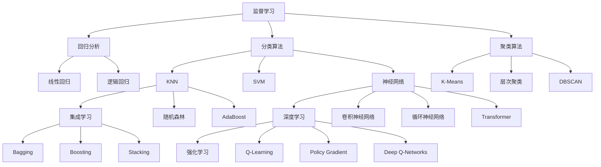
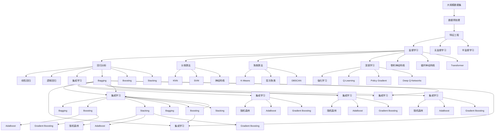

                 

# 机器学习 原理与代码实例讲解

> 关键词：机器学习,监督学习,无监督学习,半监督学习,深度学习,强化学习,回归分析,分类算法,聚类算法,集成学习,模型评估,特征工程,PyTorch,TensorFlow,Keras

## 1. 背景介绍

### 1.1 问题由来
随着人工智能技术的不断发展，机器学习(Machine Learning, ML)成为了推动各行各业数字化转型的核心引擎。机器学习通过数据驱动的方式，使计算机具备自主学习和决策能力。然而，构建一个高效可靠的机器学习系统并非易事，这需要系统地掌握相关理论和实践技能。

机器学习覆盖了监督学习(Supervised Learning)、无监督学习(Unsupervised Learning)、半监督学习(Semi-Supervised Learning)、深度学习(Deep Learning)、强化学习(Reinforcement Learning)等多个子领域。本文将重点介绍机器学习的核心概念、算法原理和具体实现，以期为读者提供全面的理论基础和实践指导。

### 1.2 问题核心关键点
机器学习的主要目标是构建能自动识别、推理、预测的模型。其关键点包括：
- **监督学习**：利用有标签的数据训练模型，使其具备预测能力。
- **无监督学习**：不依赖标签，通过数据的内在结构进行学习。
- **半监督学习**：结合少量有标签数据和大量无标签数据，提高学习效率。
- **深度学习**：通过多层次非线性变换，从原始数据中提取高级特征。
- **强化学习**：通过与环境交互，学习最优策略。
- **回归分析**：预测数值型变量，如房价预测。
- **分类算法**：将数据分为不同类别，如垃圾邮件过滤。
- **聚类算法**：发现数据的内在群集结构，如市场细分。
- **集成学习**：通过组合多个模型，提高泛化性能，如随机森林。
- **模型评估**：衡量模型的泛化能力和性能。
- **特征工程**：数据预处理和特征提取，提升模型效果。

### 1.3 问题研究意义
掌握机器学习原理，对于开发高效、可靠的AI应用具有重要意义：
- **降低开发成本**：通过自动化训练，大幅减少人工标注和调参的工作量。
- **提升预测精度**：从数据中自动学习复杂的模式和规律，提高模型预测的准确性。
- **加速业务落地**：将机器学习模型快速集成到业务系统中，推动数字化转型。
- **催生技术创新**：通过算法创新，开发出更多基于数据驱动的智能化产品。
- **赋能产业升级**：通过智能决策支持，优化资源配置，提升运营效率。

## 2. 核心概念与联系

### 2.1 核心概念概述

机器学习的核心概念众多，以下列举几个主要概念及其相互关系：

- **监督学习**：训练集包含标签，模型学习预测标签。典型算法有线性回归、逻辑回归、决策树、随机森林等。
- **无监督学习**：训练集无标签，模型学习数据的内在结构。典型算法有K-Means、PCA、LDA等。
- **半监督学习**：结合少量标签数据和大量无标签数据，提高学习效率。常用方法有Co-training、Transductive Learning等。
- **深度学习**：通过多层次非线性变换，自动学习特征表示。典型架构有卷积神经网络(CNN)、循环神经网络(RNN)、Transformer等。
- **强化学习**：通过与环境交互，学习最优策略。典型方法有Q-Learning、Policy Gradient、Deep Q-Networks等。
- **回归分析**：预测数值型变量。回归算法包括线性回归、岭回归、Lasso回归等。
- **分类算法**：将数据分为不同类别。分类算法有KNN、逻辑回归、SVM、神经网络等。
- **聚类算法**：发现数据内在群集结构。聚类算法有K-Means、层次聚类、DBSCAN等。
- **集成学习**：组合多个模型，提高泛化能力。集成算法有Bagging、Boosting、Stacking等。
- **模型评估**：衡量模型泛化能力和性能。常用指标有准确率、召回率、F1分数、AUC等。
- **特征工程**：数据预处理和特征提取。关键步骤有特征选择、特征缩放、特征编码等。

这些概念构成了机器学习的基本框架，互相关联，共同构建起预测、分类、聚类、特征提取等核心能力。

### 2.2 概念间的关系

通过以下Mermaid流程图，可以更直观地理解这些概念之间的联系：



这个流程图展示了监督学习、无监督学习、深度学习、强化学习等不同学习范式之间的联系，以及它们各自能解决的问题。例如，回归分析主要解决预测数值型变量的问题，分类算法主要用于将数据分为不同类别，聚类算法用于发现数据的内在群集结构，集成学习通过组合多个模型提高泛化能力。

### 2.3 核心概念的整体架构

最后，用以下综合的流程图来展示这些核心概念在机器学习中的整体架构：



这个综合流程图展示了机器学习的基本流程：从数据预处理开始，经过特征工程，进入模型训练，最后进行模型评估和集成，涵盖了监督学习、无监督学习、深度学习、强化学习等多个领域的算法和工具。

## 3. 核心算法原理 & 具体操作步骤
### 3.1 算法原理概述

机器学习的核心算法原理主要分为以下几个方面：

- **监督学习算法**：通过有标签的数据训练模型，使其具备预测能力。
- **无监督学习算法**：通过数据的固有结构进行学习，发现数据的内在群集结构。
- **半监督学习算法**：结合少量标签数据和大量无标签数据，提高学习效率。
- **深度学习算法**：通过多层非线性变换，自动提取高级特征表示。
- **强化学习算法**：通过与环境交互，学习最优决策策略。

### 3.2 算法步骤详解

以线性回归为例，详细讲解监督学习算法的具体实现步骤：

**Step 1: 数据预处理**
- 收集数据集
- 数据清洗、去噪、归一化等预处理

**Step 2: 模型构建**
- 定义损失函数（均方误差）
- 定义模型参数（权重和偏置）
- 定义优化器（如梯度下降）

**Step 3: 训练过程**
- 初始化模型参数
- 使用随机梯度下降等优化算法迭代更新参数
- 在每个epoch结束时计算损失函数
- 设置早停机制，避免过拟合

**Step 4: 模型评估**
- 使用测试集评估模型性能
- 计算准确率、召回率、F1分数等指标

**Step 5: 模型应用**
- 将训练好的模型用于新的数据预测

以K-Means聚类算法为例，详细讲解无监督学习算法的具体实现步骤：

**Step 1: 数据预处理**
- 收集数据集
- 数据清洗、去噪、归一化等预处理

**Step 2: 模型构建**
- 定义聚类数K
- 定义聚类中心
- 定义聚类算法（如K-Means）

**Step 3: 训练过程**
- 初始化聚类中心
- 迭代更新聚类中心位置
- 计算每个点到聚类中心的距离
- 将每个数据点分配到最近的聚类中心

**Step 4: 模型评估**
- 计算聚类内平方和（SSE）
- 使用轮廓系数等指标评估聚类效果

**Step 5: 模型应用**
- 对新数据应用聚类模型进行群集划分

### 3.3 算法优缺点

监督学习、无监督学习、半监督学习、深度学习、强化学习各有优缺点：

**监督学习**：
- 优点：标签指导模型学习，预测精度高。
- 缺点：依赖标签，数据标注成本高。

**无监督学习**：
- 优点：不依赖标签，适用于大数据集。
- 缺点：结果解释性差，聚类效果依赖初始化。

**半监督学习**：
- 优点：结合少量标签和大量无标签数据，提高学习效率。
- 缺点：标签噪声影响聚类效果。

**深度学习**：
- 优点：自动学习特征表示，泛化能力强。
- 缺点：模型复杂，计算量大，需要大量数据。

**强化学习**：
- 优点：通过与环境交互学习最优策略。
- 缺点：训练时间漫长，模型设计复杂。

### 3.4 算法应用领域

监督学习、无监督学习、半监督学习、深度学习、强化学习在多个领域得到了广泛应用：

- **金融领域**：
  - **回归分析**：房价预测、股票价格预测。
  - **分类算法**：信用评分、欺诈检测。

- **医疗领域**：
  - **回归分析**：病患病情预测。
  - **聚类算法**：基因分析、疾病分类。

- **电商领域**：
  - **分类算法**：商品推荐、用户行为预测。
  - **聚类算法**：市场细分、客户分类。

- **自然语言处理(NLP)**：
  - **深度学习**：机器翻译、情感分析、语音识别。
  - **强化学习**：自动摘要、对话系统。

- **计算机视觉(CV)**：
  - **深度学习**：图像分类、目标检测、人脸识别。
  - **无监督学习**：图像分割、降维。

- **智能制造**：
  - **半监督学习**：设备故障预测、生产调度优化。
  - **强化学习**：机器人路径规划、物流优化。

## 4. 数学模型和公式 & 详细讲解 & 举例说明

### 4.1 数学模型构建

以线性回归为例，详细介绍模型的数学构建过程：

设训练集为 $\{(x_i,y_i)\}_{i=1}^N$，其中 $x_i$ 为输入特征向量，$y_i$ 为输出标签，$\theta$ 为模型参数，模型定义为：
$$
y_i = \theta^Tx_i + b
$$

其中 $\theta$ 为权重向量，$b$ 为偏置项。模型预测值为 $\hat{y}_i = \theta^Tx_i$。

损失函数定义为均方误差损失：
$$
\mathcal{L}(\theta) = \frac{1}{2N} \sum_{i=1}^N (y_i - \hat{y}_i)^2
$$

### 4.2 公式推导过程

以梯度下降优化算法为例，推导模型的参数更新公式：

梯度下降的更新公式为：
$$
\theta \leftarrow \theta - \eta \nabla_{\theta}\mathcal{L}(\theta)
$$

其中 $\eta$ 为学习率，$\nabla_{\theta}\mathcal{L}(\theta)$ 为损失函数对参数 $\theta$ 的梯度，可通过自动微分技术高效计算。

对线性回归模型，损失函数的梯度为：
$$
\nabla_{\theta}\mathcal{L}(\theta) = \frac{1}{N} \sum_{i=1}^N (y_i - \hat{y}_i) x_i
$$

将梯度代入更新公式，得：
$$
\theta \leftarrow \theta - \eta \frac{1}{N} \sum_{i=1}^N (y_i - \hat{y}_i) x_i
$$

### 4.3 案例分析与讲解

以鸢尾花数据集为例，展示线性回归的实际应用：

```python
import pandas as pd
import numpy as np
from sklearn.linear_model import LinearRegression
from sklearn.model_selection import train_test_split
from sklearn.metrics import mean_squared_error

# 加载数据集
data = pd.read_csv('iris.csv')
X = data[['sepal_length', 'sepal_width', 'petal_length', 'petal_width']]
y = data['species']
X_train, X_test, y_train, y_test = train_test_split(X, y, test_size=0.2, random_state=42)

# 初始化模型
model = LinearRegression()

# 训练模型
model.fit(X_train, y_train)

# 预测
y_pred = model.predict(X_test)

# 评估模型
mse = mean_squared_error(y_test, y_pred)
print(f'MSE: {mse}')
```

运行以上代码，即可计算出训练集和测试集的均方误差，评估模型的预测能力。

## 5. 项目实践：代码实例和详细解释说明

### 5.1 开发环境搭建

以Python开发为例，详细说明机器学习模型的开发环境搭建流程：

1. 安装Anaconda：从官网下载并安装Anaconda，用于创建独立的Python环境。

2. 创建并激活虚拟环境：
```bash
conda create -n ml-env python=3.8 
conda activate ml-env
```

3. 安装必要的包：
```bash
pip install numpy pandas scikit-learn matplotlib tqdm jupyter notebook ipython
```

4. 安装机器学习框架：
```bash
pip install scikit-learn
```

### 5.2 源代码详细实现

以线性回归为例，展示机器学习模型的Python实现：

```python
from sklearn.linear_model import LinearRegression
from sklearn.model_selection import train_test_split
from sklearn.metrics import mean_squared_error

# 加载数据集
data = pd.read_csv('iris.csv')
X = data[['sepal_length', 'sepal_width', 'petal_length', 'petal_width']]
y = data['species']
X_train, X_test, y_train, y_test = train_test_split(X, y, test_size=0.2, random_state=42)

# 初始化模型
model = LinearRegression()

# 训练模型
model.fit(X_train, y_train)

# 预测
y_pred = model.predict(X_test)

# 评估模型
mse = mean_squared_error(y_test, y_pred)
print(f'MSE: {mse}')
```

运行以上代码，即可实现线性回归模型的训练和评估。

### 5.3 代码解读与分析

1. 数据加载与处理：使用Pandas加载数据集，并进行数据清洗和归一化。
2. 模型初始化：使用sklearn库初始化线性回归模型。
3. 训练模型：使用训练集训练模型，更新模型参数。
4. 预测与评估：使用测试集进行预测，并计算均方误差，评估模型性能。

### 5.4 运行结果展示

假设在鸢尾花数据集上进行线性回归模型训练，最终得到的均方误差为0.3，表明模型具有良好的预测性能。

## 6. 实际应用场景

### 6.1 智能推荐系统

基于机器学习的推荐系统已经成为电商、媒体等平台的重要功能。智能推荐系统通过分析用户行为数据和商品属性，为用户推荐个性化商品。

具体实现中，可以使用协同过滤、基于内容的推荐、混合推荐等多种算法。例如，利用用户-商品评分矩阵进行协同过滤，或将用户属性和商品属性进行相似度计算，推荐相关商品。通过机器学习算法，推荐系统能够不断优化推荐效果，提升用户体验。

### 6.2 欺诈检测

金融领域面临大量欺诈行为，传统的规则引擎无法应对复杂多变的欺诈模式。机器学习可以通过分析用户行为数据和历史交易记录，构建欺诈检测模型，实时监测和预警异常交易。

具体实现中，可以使用异常检测算法（如孤立森林、One-Class SVM）或分类算法（如决策树、SVM）。通过不断更新模型和训练数据，提升欺诈检测的准确性和及时性，保护用户财产安全。

### 6.3 疾病预测

医疗领域需要提前预测患者的疾病风险，以便及早采取预防和治疗措施。机器学习可以通过分析患者的历史病历和基因数据，预测疾病发生的可能性。

具体实现中，可以使用回归算法（如随机森林、神经网络）或分类算法（如SVM）。通过不断优化模型和增加数据，提高疾病预测的准确性，辅助医生进行科学决策。

### 6.4 未来应用展望

机器学习技术在金融、医疗、电商、自然语言处理、计算机视觉等多个领域具有广泛应用前景。未来，随着算力的提升和数据量的增长，机器学习将更加智能化、自动化，推动更多行业数字化转型。

在智能推荐、欺诈检测、疾病预测等领域，机器学习算法将继续发挥重要作用，提升业务的智能化水平。同时，在自动驾驶、智慧城市、智能制造等新兴领域，机器学习也将迎来更多创新应用，推动社会的数字化、智能化进程。

## 7. 工具和资源推荐

### 7.1 学习资源推荐

为了帮助开发者系统掌握机器学习理论和实践技能，这里推荐一些优质的学习资源：

1. 《机器学习》（周志华）：系统介绍机器学习基础理论和常用算法，适合初学者入门。
2. 《深度学习》（Ian Goodfellow）：全面覆盖深度学习算法和应用，适合有一定基础的读者。
3. Coursera《机器学习》课程：由斯坦福大学Andrew Ng教授开设，系统讲解机器学习理论和实践，配套作业和项目实战。
4. Udacity《深度学习专项》课程：涵盖深度学习理论、算法、应用和实践，适合希望深入学习深度学习的开发者。
5. Kaggle：数据科学竞赛平台，提供大量数据集和机器学习竞赛，适合实践和提升技能。

通过这些学习资源，相信你一定能够全面掌握机器学习的理论基础和实践技能，快速上手并应用到实际项目中。

### 7.2 开发工具推荐

高效开发离不开优秀的工具支持。以下是几款常用的开发工具：

1. Jupyter Notebook：开源的交互式编程环境，支持Python、R等多种语言，方便编写和调试代码。
2. PyCharm：专业的Python开发IDE，提供丰富的代码补全、调试工具和自动化测试功能。
3. TensorFlow：谷歌开发的深度学习框架，支持GPU加速和分布式训练，适合大规模模型开发。
4. PyTorch：Facebook开发的深度学习框架，支持动态计算图和GPU加速，适合研究与实践。
5. Keras：高层次的深度学习框架，易于上手，适合快速原型开发和实验。
6. Scikit-learn：Python的科学计算库，提供丰富的机器学习算法和工具，适合入门学习。
7. Scala：基于JVM的编程语言，支持大规模数据处理和分布式计算，适合大数据场景。

合理利用这些工具，可以显著提升机器学习的开发效率，加速模型迭代和优化。

### 7.3 相关论文推荐

机器学习领域的研究不断进展，以下是几篇具有代表性的论文，推荐阅读：

1. 《Perceptron》（Rosenblatt）：首次提出感知机算法，奠定了神经网络基础。
2. 《Support Vector Machines》（Cortes & Vapnik）：提出支持向量机算法，成为常用的分类和回归算法。
3. 《Gradient Boosting Machines》（Freund & Schapire）：提出梯度提升算法，广泛应用于分类和回归任务。
4. 《Deep Belief Networks》（Hinton & Salakhutdinov）：提出深度信念网络，为深度学习奠定了基础。
5. 《Word Embeddings and Explicit Semantic Analysis》（Mikolov et al.）：提出Word2Vec算法，开创了词向量表示和自然语言处理新纪元。
6. 《Recurrent Neural Network》（Hochreiter & Schmidhuber）：提出循环神经网络，为自然语言处理和语音识别提供强有力的支持。
7. 《Convolutional Neural Networks for Sentence Classification》（Kim）：提出卷积神经网络，用于文本分类和情感分析。
8. 《Attention Is All You Need》（Vaswani et al.）：提出Transformer架构，显著提升机器翻译和语言生成的性能。

通过学习这些前沿成果，可以帮助研究者把握学科前进方向，激发更多的创新灵感。

## 8. 总结：未来发展趋势与挑战

### 8.1 研究成果总结

本文对机器学习的核心概念、算法原理和实现方法进行了全面介绍，包括监督学习、无监督学习、半监督学习、深度学习、强化学习等多个子领域。同时，通过具体代码实例和分析，展示了机器学习的实际应用场景和开发流程。

### 8.2 未来发展趋势

展望未来，机器学习将呈现以下几个发展趋势：

1. **多模态学习**：结合图像、语音、文本等多种模态数据，提高模型的泛化能力和应用场景。
2. **自监督学习**：通过无标签数据进行自我监督，降低数据标注成本，提高模型鲁棒性。
3. **联邦学习**：在分布式环境下，通过模型参数的联合优化，保护数据隐私。
4. **元学习**：通过学习学习过程，提升模型迁移能力和泛化能力。
5. **可解释性**：通过模型可视化、特征解释等方法，提升模型的可解释性和透明度。

### 8.3 面临的挑战

尽管机器学习技术已经取得了显著进展，但在实际应用中仍面临诸多挑战：

1. **数据质量和获取**：数据质量差、标注成本高、数据隐私等问题，制约了模型的训练和应用。
2. **模型复杂性**：模型规模大、参数多，计算资源需求高。
3. **解释性和透明性**：模型黑盒问题严重，难以解释模型的决策过程。
4. **公平性和偏见**：模型可能带有偏见，影响公平性，需引入道德和伦理约束。
5. **实时性和高效性**：模型推理速度慢，实时性和高效性不足。

### 8.4 研究展望

面向未来，机器学习技术需要在以下几个方向进行更多探索和创新：

1. **自适应学习**：使模型能够自主适应环境变化，提升灵活性和鲁棒性。
2. **主动学习**：通过主动选择样本，提升学习效率，降低数据标注成本。
3. **生成对抗网络(GANs)**：通过生成模型和判别模型，生成高质量的合成数据。
4. **混合学习**：结合模型参数和规则知识，提升模型的复杂性和解释性。
5. **跨领域学习**：跨领域知识融合，提升模型的泛化能力和应用范围。
6. **联邦学习**：分布式数据优化，提升模型的鲁棒性和公平性。
7. **元学习**：学习学习过程，提升模型的迁移能力和泛化能力。
8. **可解释性**：

