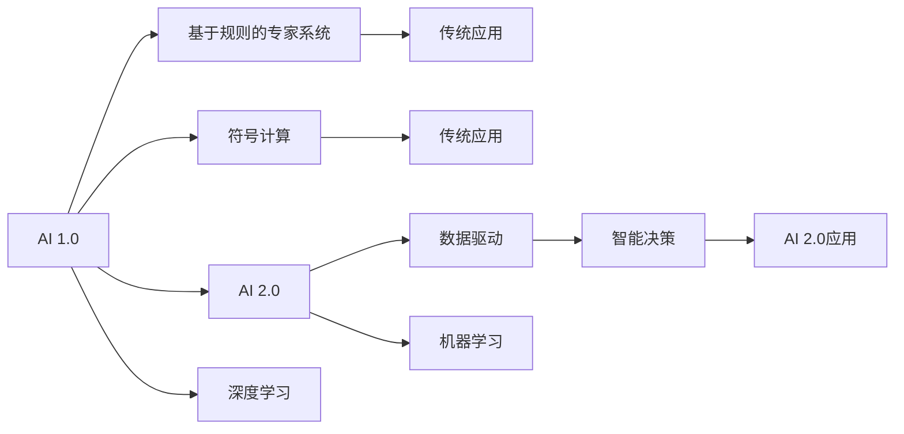
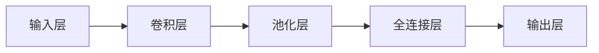

                 

# 李开复：AI 2.0 时代的产业

## 1. 背景介绍

人工智能（AI）已经成为当今科技发展的重要方向，对社会各个方面产生了深远的影响。作为业界领袖，李开复在最近的一场演讲中，提出了“AI 2.0”的概念，并探讨了其对产业发展的影响。AI 2.0 不仅限于技术，更是涉及到更广泛的经济、社会和文化层面。本文将围绕李开复的演讲，深入探讨 AI 2.0 时代的产业变化及其影响。

## 2. 核心概念与联系

### 2.1 核心概念概述

为了更好地理解 AI 2.0 的含义及其对产业发展的影响，我们首先需要明确几个关键概念：

- **AI 1.0**: 指的是基于规则和符号计算的传统人工智能，主要依赖于专家系统和知识工程。
- **AI 2.0**: 是指基于数据驱动、机器学习和深度学习的现代人工智能，具有更强的泛化能力和自适应性。
- **AI 3.0**: 预示着未来的人工智能将更加人性化、交互性和普及化，人工智能将融入到人类生活和工作的方方面面。

### 2.2 核心概念间的关系

AI 2.0 时代的关键特征是数据驱动、深度学习和云计算的融合，形成了强大的计算能力、数据处理能力和智能化决策能力。这些能力推动了产业的全面变革，从制造业到医疗，从金融到教育，都在经历着深刻的转型。



## 3. 核心算法原理 & 具体操作步骤

### 3.1 算法原理概述

AI 2.0 的核心算法包括深度学习、强化学习、自然语言处理等。深度学习通过多层次的神经网络，自动从数据中学习特征表示，并在分类、预测、生成等任务上取得了显著效果。强化学习通过智能体与环境的互动，不断优化策略，实现复杂决策问题的高效解决。自然语言处理则通过语言模型、序列模型等技术，实现自然语言的理解、生成和推理。

### 3.2 算法步骤详解

AI 2.0 的算法步骤一般包括以下几个关键步骤：

1. **数据获取与预处理**: 收集和清洗数据，进行特征工程，准备用于模型训练的样本。
2. **模型训练与调优**: 选择合适的模型架构和损失函数，使用梯度下降等优化算法训练模型，并根据验证集的表现调整超参数。
3. **模型评估与部署**: 在测试集上评估模型性能，调整模型结构或参数，并将模型部署到实际应用中。
4. **持续优化与迭代**: 通过实时数据反馈和用户反馈，不断优化模型性能，更新模型参数。

### 3.3 算法优缺点

AI 2.0 算法具有以下优点：

- **高效学习**: 能够从大量数据中自动学习特征表示，无需手动设计和调整特征。
- **泛化能力强**: 具有较强的泛化能力，能够在新的数据上表现良好。
- **自动化决策**: 通过学习复杂的决策模式，实现自动化的决策过程。

然而，这些算法也存在一些缺点：

- **数据依赖**: 对数据质量和数量有较高的要求，数据偏差可能导致模型不公平或误判。
- **计算资源需求高**: 需要大量的计算资源进行模型训练和优化。
- **模型复杂度高**: 模型结构复杂，难以解释和理解。

### 3.4 算法应用领域

AI 2.0 算法在多个领域得到了广泛应用，包括但不限于：

- **金融**: 通过机器学习算法进行风险评估、信用评分、算法交易等。
- **医疗**: 利用深度学习进行疾病诊断、药物研发、健康监测等。
- **制造业**: 采用强化学习优化生产流程、预测维护、智能调度等。
- **零售**: 利用自然语言处理进行客户情感分析、推荐系统、个性化营销等。

## 4. 数学模型和公式 & 详细讲解

### 4.1 数学模型构建

AI 2.0 的数学模型通常基于深度学习架构，如卷积神经网络（CNN）、循环神经网络（RNN）、变分自编码器（VAE）等。以卷积神经网络为例，其结构如图：



### 4.2 公式推导过程

以深度学习中的反向传播算法为例，其公式推导如下：

设 $y$ 为模型的输出，$J$ 为损失函数，则反向传播的公式为：

$$
\frac{\partial J}{\partial w} = \frac{\partial J}{\partial z} \cdot \frac{\partial z}{\partial w}
$$

其中 $w$ 为模型权重，$z$ 为模型中间层的输出。

### 4.3 案例分析与讲解

以图像分类为例，通过深度学习模型可以从大量图像数据中自动学习特征，并通过分类层实现对图像的分类预测。具体步骤如下：

1. **数据准备**: 收集和预处理图像数据集，进行数据增强。
2. **模型构建**: 使用卷积神经网络作为模型架构，添加多个卷积层和池化层进行特征提取。
3. **模型训练**: 使用随机梯度下降（SGD）算法，将模型在训练集上进行训练。
4. **模型评估**: 在测试集上评估模型性能，调整模型参数。
5. **模型部署**: 将模型部署到实际应用中，进行图像分类预测。

## 5. 项目实践：代码实例和详细解释说明

### 5.1 开发环境搭建

为了进行深度学习模型开发，需要以下环境：

1. **Python 环境**: 安装 Python 3.7+ 版本。
2. **深度学习框架**: 安装 TensorFlow、PyTorch 等深度学习框架。
3. **数据集**: 下载和处理图像、文本等数据集。

### 5.2 源代码详细实现

以下是一个简单的图像分类模型代码示例：

```python
import tensorflow as tf
from tensorflow.keras import layers, models

# 构建模型
model = models.Sequential([
    layers.Conv2D(32, (3,3), activation='relu', input_shape=(28,28,1)),
    layers.MaxPooling2D((2,2)),
    layers.Conv2D(64, (3,3), activation='relu'),
    layers.MaxPooling2D((2,2)),
    layers.Conv2D(64, (3,3), activation='relu'),
    layers.Flatten(),
    layers.Dense(64, activation='relu'),
    layers.Dense(10, activation='softmax')
])

# 编译模型
model.compile(optimizer='adam',
              loss='categorical_crossentropy',
              metrics=['accuracy'])

# 训练模型
model.fit(train_data, train_labels, epochs=10, validation_data=(val_data, val_labels))
```

### 5.3 代码解读与分析

在上述代码中，我们首先使用 `Sequential` 模型构建了一个简单的卷积神经网络。其中，卷积层通过卷积核对输入图像进行特征提取，池化层进行降维处理，全连接层进行特征融合，输出层进行分类预测。

在模型编译和训练过程中，我们使用了 Adam 优化算法和交叉熵损失函数，并在训练过程中进行了验证集评估。

### 5.4 运行结果展示

在训练结束后，我们通过测试集评估模型的性能，例如：

```python
test_loss, test_acc = model.evaluate(test_data, test_labels)
print('Test accuracy:', test_acc)
```

这将输出模型的测试集准确率。

## 6. 实际应用场景

### 6.1 金融领域

AI 2.0 在金融领域的应用包括风险评估、信用评分、算法交易等。通过机器学习模型，金融机构可以分析客户历史行为数据，预测其未来行为和信用风险，从而进行精准的贷款审批和风险管理。

### 6.2 医疗领域

AI 2.0 在医疗领域的应用包括疾病诊断、药物研发、健康监测等。通过深度学习模型，医疗机构可以分析大量医疗数据，辅助医生进行疾病诊断和治疗方案选择。

### 6.3 制造业

AI 2.0 在制造业的应用包括生产优化、预测维护、智能调度等。通过强化学习模型，制造企业可以优化生产流程，预测设备故障，实现智能化的生产管理。

### 6.4 零售领域

AI 2.0 在零售领域的应用包括客户情感分析、推荐系统、个性化营销等。通过自然语言处理模型，零售企业可以分析客户反馈，优化产品推荐和营销策略，提升客户满意度。

## 7. 工具和资源推荐

### 7.1 学习资源推荐

为了深入了解 AI 2.0 技术，推荐以下学习资源：

1. **Coursera 课程**: 提供机器学习、深度学习、自然语言处理等相关课程。
2. **TensorFlow 官方文档**: 提供深度学习框架的详细文档和教程。
3. **《深度学习》书籍**: Ian Goodfellow 的《深度学习》是深度学习领域的经典教材。
4. **Kaggle**: 提供大量数据集和竞赛，帮助学习者进行实践和实验。

### 7.2 开发工具推荐

AI 2.0 开发常用的工具包括：

1. **TensorFlow**: 提供丰富的深度学习框架和工具。
2. **PyTorch**: 提供灵活的动态图计算和高效的模型训练。
3. **Jupyter Notebook**: 提供交互式的代码编写和结果展示环境。

### 7.3 相关论文推荐

以下是一些 AI 2.0 领域的经典论文：

1. **AlexNet**: 深度学习领域的开创性工作。
2. **ResNet**: 通过残差连接解决深度网络退化问题。
3. **BERT**: 利用Transformer结构实现语言模型的预训练。
4. **AlphaGo**: 通过强化学习实现围棋等复杂游戏的智能对抗。

## 8. 总结：未来发展趋势与挑战

### 8.1 研究成果总结

AI 2.0 在多个领域取得了显著进展，但仍面临数据、计算资源和模型解释性等方面的挑战。未来需要进一步推动技术突破，优化模型性能和效率，拓展应用场景。

### 8.2 未来发展趋势

未来 AI 2.0 的发展趋势包括：

- **多模态学习**: 结合图像、语音、文本等多模态数据，提升模型的综合能力。
- **模型压缩与优化**: 优化模型结构，减少计算资源需求。
- **迁移学习**: 通过知识迁移，实现模型在不同领域的快速适应。
- **联邦学习**: 实现分布式数据训练，保护数据隐私。

### 8.3 面临的挑战

AI 2.0 面临的主要挑战包括：

- **数据隐私和安全**: 保护数据隐私，避免数据泄露。
- **模型透明性与可解释性**: 提升模型的可解释性，增强用户信任。
- **计算资源限制**: 提高模型的计算效率，降低计算成本。
- **伦理与社会问题**: 避免技术滥用，保护社会公平。

### 8.4 研究展望

未来 AI 2.0 的研究方向包括：

- **公平性与伦理**: 确保算法的公平性，避免偏见和歧视。
- **跨领域应用**: 推动 AI 技术在更多领域的应用，提升社会效率和福利。
- **技术融合**: 推动 AI 技术与传统产业的深度融合，实现创新突破。
- **人才培养**: 培养跨学科的 AI 人才，推动技术发展。

## 9. 附录：常见问题与解答

**Q1: AI 2.0 与 AI 1.0 的区别是什么？**

A: AI 2.0 相比 AI 1.0，更加依赖数据驱动和机器学习，具有更强的泛化能力和自适应性。AI 2.0 能够从大量数据中自动学习特征表示，实现高效的分类、预测、生成等任务。

**Q2: AI 2.0 应用场景有哪些？**

A: AI 2.0 应用场景包括金融、医疗、制造业、零售等。AI 2.0 通过机器学习、深度学习等技术，帮助各行业提升效率、优化决策、改善服务。

**Q3: 如何优化 AI 2.0 模型的性能？**

A: 优化 AI 2.0 模型性能的方法包括：增加数据量、调整模型结构、优化超参数、使用正则化等。

**Q4: AI 2.0 面临的挑战有哪些？**

A: AI 2.0 面临的主要挑战包括数据隐私和安全、模型透明性与可解释性、计算资源限制、伦理与社会问题等。

**Q5: AI 2.0 的未来发展趋势是什么？**

A: AI 2.0 的未来发展趋势包括多模态学习、模型压缩与优化、迁移学习、联邦学习等。

---

作者：禅与计算机程序设计艺术 / Zen and the Art of Computer Programming

