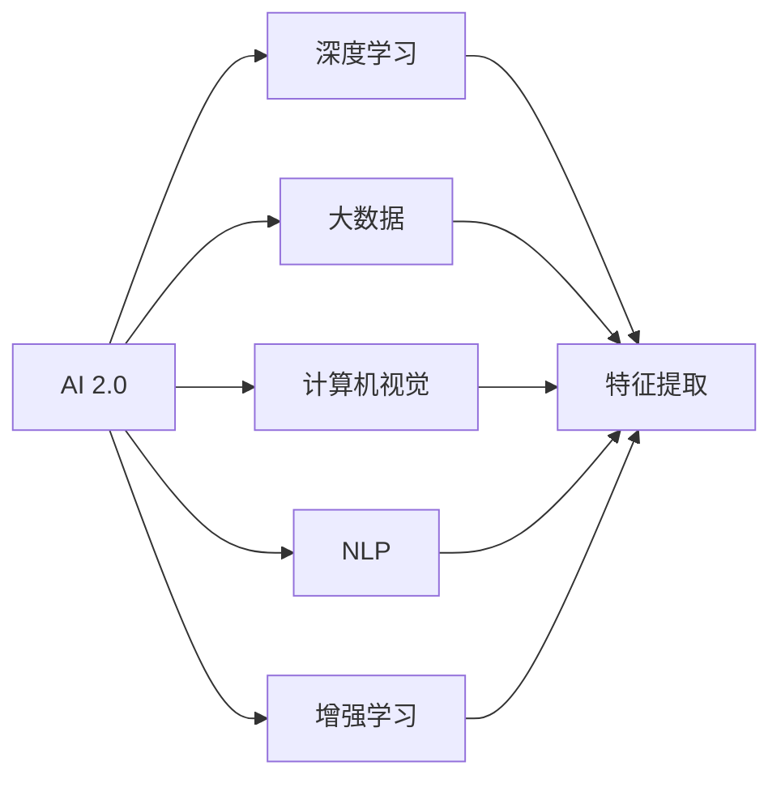
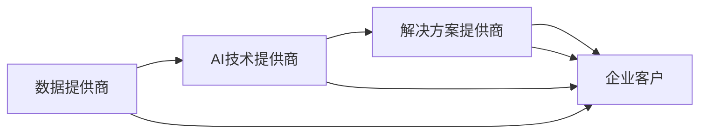
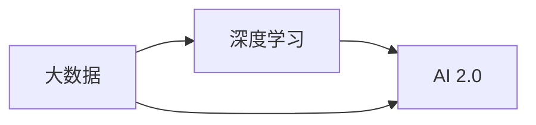
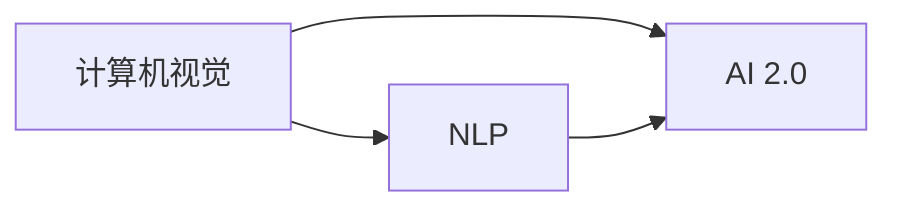
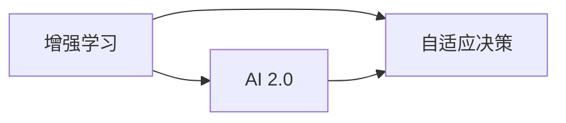
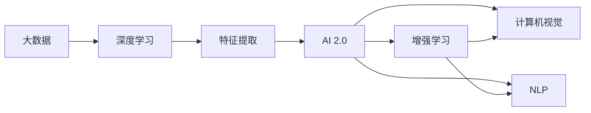

                 

# 李开复：AI 2.0 时代的市场

## 1. 背景介绍

### 1.1 问题由来
在过去的几十年里，人工智能（AI）技术经历了从AI 1.0到AI 2.0的转变。AI 1.0主要指的是基于规则和专家知识的静态系统，如专家系统、搜索算法和传统机器学习算法。而AI 2.0则是指基于深度学习和大数据技术，能够自适应、自我学习和自我提升的动态系统。

AI 2.0的兴起，使得AI技术在各个行业的应用更加广泛和深入。从自动驾驶、机器人、医疗诊断到金融预测、推荐系统、游戏AI，AI 2.0正在重塑各行各业的商业模式。市场对于AI的需求也在不断增长，预计未来几年内，全球AI市场将呈现快速增长的态势。

### 1.2 问题核心关键点
AI 2.0市场的发展，核心关键点包括：

- 数据与算力：AI 2.0系统的训练和运行需要大量的数据和强大的算力支持。
- 技术创新：AI 2.0的技术创新包括深度学习、自然语言处理、计算机视觉、增强学习等。
- 应用场景：AI 2.0在各个行业的应用场景不断扩展，如金融、医疗、制造、零售、教育等。
- 人才需求：AI 2.0技术需要大量的人才支持，包括数据科学家、机器学习工程师、深度学习专家等。
- 市场竞争：AI 2.0市场竞争激烈，主要参与者包括Google、Facebook、Amazon、Microsoft等科技巨头，以及AI初创公司。

### 1.3 问题研究意义
AI 2.0市场的快速发展，对于推动经济增长、改善社会福祉、提高生产效率等方面具有重要意义。AI 2.0的应用，能够自动化、智能化各行各业，提高效率、降低成本、改善服务，为消费者创造更多价值。此外，AI 2.0的发展，还能够推动技术创新、促进就业、提升竞争力，为全球经济带来新的增长点。

## 2. 核心概念与联系

### 2.1 核心概念概述

为了更好地理解AI 2.0市场的核心概念，本节将介绍几个密切相关的核心概念：

- **AI 2.0**：指基于深度学习和大数据技术的动态AI系统，能够自适应、自我学习和自我提升。
- **深度学习**：一种机器学习技术，通过多层神经网络对数据进行复杂特征提取和模式识别。
- **大数据**：指海量的数据集，用于深度学习模型的训练和验证。
- **计算机视觉**：利用计算机和算法对图像、视频进行分析和处理，实现自动检测、分类、识别等任务。
- **自然语言处理（NLP）**：涉及语音识别、文本分析、情感分析、语义理解等技术，实现人机交互。
- **增强学习**：通过智能体与环境的交互，学习最优决策策略，实现自动化和智能化。

这些核心概念之间的逻辑关系可以通过以下Mermaid流程图来展示：



这个流程图展示了大规模语言模型的核心概念及其之间的关系：

1. AI 2.0作为核心，通过深度学习、大数据、计算机视觉、NLP和增强学习等多种技术手段，实现自适应、自我学习和自我提升。
2. 深度学习通过多层神经网络，对数据进行复杂特征提取和模式识别，是AI 2.0的基石。
3. 大数据为深度学习提供了丰富的训练数据，支持模型的自适应和自我学习。
4. 计算机视觉和NLP分别利用图像和文本数据，实现自动检测、分类、识别和语义理解。
5. 增强学习通过智能体与环境的交互，学习最优决策策略，进一步提升AI 2.0的智能化水平。

这些核心概念共同构成了AI 2.0的完整生态系统，使其能够处理各种复杂任务，并在实际应用中发挥强大的能力。通过理解这些核心概念，我们可以更好地把握AI 2.0技术的工作原理和优化方向。

### 2.2 概念间的关系

这些核心概念之间存在着紧密的联系，形成了AI 2.0市场的完整生态系统。下面我通过几个Mermaid流程图来展示这些概念之间的关系。

#### 2.2.1 AI 2.0的市场生态系统



这个流程图展示了AI 2.0市场中的主要参与者及其关系：

1. 数据提供商：提供各类数据集，包括公开数据和专用数据，支持AI技术提供商进行模型训练。
2. AI技术提供商：基于深度学习、计算机视觉、NLP和增强学习等技术，开发和提供AI解决方案。
3. 解决方案提供商：将AI技术整合到各类业务系统中，提供端到端解决方案。
4. 企业客户：使用AI解决方案，提升业务效率和竞争力。

#### 2.2.2 大数据与深度学习的关系



这个流程图展示了大数据与深度学习之间的关系：

1. 大数据为深度学习提供了丰富的训练数据，支持模型学习复杂的特征和模式。
2. 深度学习通过神经网络对大数据进行处理，提取有用的特征和信息。
3. AI 2.0通过深度学习和大数据，实现了复杂任务的自动化和智能化。

#### 2.2.3 计算机视觉与NLP的关系



这个流程图展示了计算机视觉与NLP之间的关系：

1. 计算机视觉通过对图像和视频数据进行处理，提取视觉特征和信息。
2. NLP通过对文本数据进行处理，提取语义特征和信息。
3. AI 2.0通过计算机视觉和NLP的结合，实现了视觉与文本的综合理解。

#### 2.2.4 增强学习与AI 2.0的关系



这个流程图展示了增强学习与AI 2.0之间的关系：

1. 增强学习通过智能体与环境的交互，学习最优决策策略。
2. AI 2.0通过增强学习，进一步提升了智能化水平和适应性。
3. 自适应决策是AI 2.0的核心能力之一，通过智能体的学习，实现动态调整和优化。

### 2.3 核心概念的整体架构

最后，我们用一个综合的流程图来展示这些核心概念在大规模语言模型微调过程中的整体架构：



这个综合流程图展示了从大数据到AI 2.0的完整过程。大数据通过深度学习进行特征提取，形成了AI 2.0的基础。计算机视觉和NLP分别对视觉和文本数据进行处理，提升了AI 2.0的感知和理解能力。增强学习通过智能体的学习，进一步提升了AI 2.0的决策和适应能力。通过这些核心概念的结合，AI 2.0得以处理各种复杂任务，并在实际应用中发挥强大的能力。

## 3. 核心算法原理 & 具体操作步骤
### 3.1 算法原理概述

AI 2.0系统的核心算法原理，可以归纳为以下几个关键点：

1. **深度学习算法**：通过多层神经网络，对大数据进行复杂特征提取和模式识别，形成强大的表示能力。
2. **自适应学习**：通过大数据和算法优化，实现模型的自适应学习和自我提升。
3. **跨模态融合**：结合计算机视觉、NLP和增强学习等技术，实现多模态数据的综合理解。
4. **强化学习**：通过智能体与环境的交互，学习最优决策策略，实现动态调整和优化。

### 3.2 算法步骤详解

AI 2.0系统的开发和应用，通常包括以下几个关键步骤：

**Step 1: 数据准备**
- 收集并清洗大数据集，包括图像、文本、视频等。
- 对数据进行预处理和标注，形成训练集和验证集。
- 选择合适的数据格式和存储方式，支持模型的训练和推理。

**Step 2: 模型选择和设计**
- 选择合适的深度学习模型，如卷积神经网络（CNN）、循环神经网络（RNN）、变分自编码器（VAE）等。
- 设计模型的结构和超参数，如网络层数、神经元个数、学习率等。
- 确定模型的优化器，如Adam、SGD等，设置相应的参数。

**Step 3: 模型训练**
- 使用训练集对模型进行训练，通过反向传播算法更新权重。
- 在验证集上评估模型性能，选择最优的超参数组合。
- 使用增强学习算法，进一步提升模型的适应能力和决策能力。

**Step 4: 模型部署**
- 将训练好的模型导出并部署到目标平台，支持实时推理和预测。
- 对模型进行优化，如压缩、量化、剪枝等，提升推理速度和效率。
- 使用分布式计算和并行处理技术，提升模型的计算能力和可靠性。

**Step 5: 模型评估和优化**
- 在测试集上评估模型的性能，分析模型的误差来源和改进方向。
- 使用数据增强、正则化等技术，提升模型的泛化能力和鲁棒性。
- 结合反馈机制，不断迭代和优化模型，提升系统的智能化水平。

### 3.3 算法优缺点

AI 2.0系统具有以下优点：

- **自适应学习能力**：通过深度学习和大数据，AI 2.0系统能够自适应和自我提升，适应各种复杂的业务场景。
- **强大的表示能力**：深度学习算法可以提取高维度的特征，形成强大的表示能力，支持复杂任务的自动化和智能化。
- **跨模态融合能力**：结合计算机视觉、NLP和增强学习等技术，AI 2.0系统能够实现多模态数据的综合理解，提升感知和理解能力。

然而，AI 2.0系统也存在一些缺点：

- **高昂的计算成本**：深度学习和大数据训练需要大量的计算资源和算力支持，成本较高。
- **数据依赖性强**：AI 2.0系统的性能高度依赖于训练数据的数量和质量，数据获取和标注成本较高。
- **模型复杂度高**：深度学习模型结构复杂，训练和推理效率较低，需要大量的计算资源和时间。
- **模型可解释性差**：深度学习模型通常是"黑盒"系统，难以解释其内部工作机制和决策逻辑。

### 3.4 算法应用领域

AI 2.0系统的应用领域非常广泛，包括但不限于以下几个方面：

- **自动驾驶**：利用计算机视觉和增强学习技术，实现车辆自动导航、避障、交通信号识别等任务。
- **机器人**：利用计算机视觉和NLP技术，实现机器人感知、决策和控制。
- **医疗诊断**：利用计算机视觉和NLP技术，实现图像识别、病理分析、自然语言理解等任务。
- **金融预测**：利用深度学习和大数据技术，实现股票预测、信用评估、风险管理等任务。
- **推荐系统**：利用深度学习和大数据技术，实现个性化推荐、广告投放、内容分发等任务。
- **智能客服**：利用NLP和增强学习技术，实现自动回答、情感分析、用户意图识别等任务。
- **游戏AI**：利用增强学习技术，实现游戏中的决策、控制和策略优化。

这些应用领域展示了AI 2.0系统的强大能力，为各行各业带来了新的机遇和挑战。随着AI 2.0技术的不断发展，相信其应用领域将更加广泛和深入。

## 4. 数学模型和公式 & 详细讲解  
### 4.1 数学模型构建

AI 2.0系统的数学模型构建，可以基于以下几个关键点：

1. **损失函数**：用于衡量模型的预测结果与真实结果之间的误差。
2. **优化算法**：用于更新模型的权重，使模型不断逼近最优解。
3. **正则化技术**：用于防止模型过拟合，提高模型的泛化能力。
4. **梯度计算**：用于计算模型参数的梯度，支持反向传播算法。

以一个简单的二分类任务为例，其数学模型构建如下：

**输入**：$x$，特征向量。
**输出**：$y$，预测标签。
**损失函数**：$L(y, \hat{y})$，用于衡量预测标签与真实标签之间的误差。
**优化器**：$optimizer$，用于更新模型的权重。

假设模型的权重为$w$，则其预测结果为：

$$
\hat{y} = \sigma(w \cdot x + b)
$$

其中，$\sigma$为激活函数，$b$为偏置项。

### 4.2 公式推导过程

在二分类任务中，常用的损失函数包括交叉熵损失（Cross-Entropy Loss）和均方误差损失（Mean Squared Error Loss）。这里以交叉熵损失为例进行推导。

**交叉熵损失函数**：

$$
L(y, \hat{y}) = -\frac{1}{N}\sum_{i=1}^N(y_i \log \hat{y_i} + (1-y_i) \log (1-\hat{y_i}))
$$

其中，$N$为样本数量，$y_i$为真实标签，$\hat{y_i}$为预测标签。

使用反向传播算法，对模型参数$w$和$b$进行优化，损失函数的梯度为：

$$
\frac{\partial L(y, \hat{y})}{\partial w} = \frac{1}{N} (y_i - \hat{y_i}) \cdot x
$$

$$
\frac{\partial L(y, \hat{y})}{\partial b} = \frac{1}{N} (y_i - \hat{y_i})
$$

将梯度带入优化器中，使用梯度下降算法，更新模型参数，实现模型的训练和优化。

### 4.3 案例分析与讲解

以一个简单的图像分类任务为例，介绍AI 2.0系统的数学模型构建和优化过程。

**输入**：$x$，图像像素向量。
**输出**：$y$，分类标签。
**模型**：卷积神经网络（CNN）。
**损失函数**：交叉熵损失。
**优化器**：Adam。

假设模型的权重为$w$，则其预测结果为：

$$
\hat{y} = \sigma(w \cdot x + b)
$$

其中，$\sigma$为激活函数，$b$为偏置项。

使用交叉熵损失函数，计算预测结果与真实标签之间的误差：

$$
L(y, \hat{y}) = -\frac{1}{N}\sum_{i=1}^N(y_i \log \hat{y_i} + (1-y_i) \log (1-\hat{y_i}))
$$

使用反向传播算法，对模型参数$w$和$b$进行优化，损失函数的梯度为：

$$
\frac{\partial L(y, \hat{y})}{\partial w} = \frac{1}{N} (y_i - \hat{y_i}) \cdot x
$$

$$
\frac{\partial L(y, \hat{y})}{\partial b} = \frac{1}{N} (y_i - \hat{y_i})
$$

将梯度带入优化器中，使用梯度下降算法，更新模型参数，实现模型的训练和优化。

在实际应用中，还可以引入数据增强、正则化等技术，进一步提升模型的泛化能力和鲁棒性。

## 5. 项目实践：代码实例和详细解释说明
### 5.1 开发环境搭建

在进行AI 2.0系统开发前，我们需要准备好开发环境。以下是使用Python进行TensorFlow开发的环境配置流程：

1. 安装Anaconda：从官网下载并安装Anaconda，用于创建独立的Python环境。

2. 创建并激活虚拟环境：
```bash
conda create -n tensorflow-env python=3.8 
conda activate tensorflow-env
```

3. 安装TensorFlow：根据CUDA版本，从官网获取对应的安装命令。例如：
```bash
conda install tensorflow==2.6.0
```

4. 安装各类工具包：
```bash
pip install numpy pandas scikit-learn matplotlib tqdm jupyter notebook ipython
```

完成上述步骤后，即可在`tensorflow-env`环境中开始AI 2.0系统开发。

### 5.2 源代码详细实现

这里以一个简单的图像分类任务为例，给出使用TensorFlow进行AI 2.0系统开发的PyTorch代码实现。

首先，定义模型的输入和输出：

```python
import tensorflow as tf

# 定义输入和输出
x = tf.keras.layers.Input(shape=(28, 28, 1))
y = tf.keras.layers.Dense(10, activation='softmax')(x)
```

然后，定义模型的损失函数和优化器：

```python
# 定义损失函数和优化器
loss = tf.keras.losses.CategoricalCrossentropy()
optimizer = tf.keras.optimizers.Adam(learning_rate=0.001)
```

接着，定义模型的训练和评估函数：

```python
# 定义训练和评估函数
@tf.function
def train_model(model, input_data, labels, optimizer, loss):
    with tf.GradientTape() as tape:
        logits = model(input_data)
        loss_value = loss(labels, logits)
    gradients = tape.gradient(loss_value, model.trainable_variables)
    optimizer.apply_gradients(zip(gradients, model.trainable_variables))
    return loss_value

@tf.function
def evaluate_model(model, input_data, labels, loss):
    logits = model(input_data)
    loss_value = loss(labels, logits)
    return loss_value
```

最后，启动训练流程并在测试集上评估：

```python
epochs = 10
batch_size = 64

# 定义训练集和测试集
train_dataset = tf.data.Dataset.from_tensor_slices((x_train, y_train)).batch(batch_size)
test_dataset = tf.data.Dataset.from_tensor_slices((x_test, y_test)).batch(batch_size)

# 开始训练
for epoch in range(epochs):
    loss = 0.0
    for batch, (input_data, labels) in enumerate(train_dataset):
        loss += train_model(model, input_data, labels, optimizer, loss)
    print(f'Epoch {epoch+1}, loss: {loss/len(train_dataset):.4f}')
    
    loss = 0.0
    for batch, (input_data, labels) in enumerate(test_dataset):
        loss += evaluate_model(model, input_data, labels, loss)
    print(f'Epoch {epoch+1}, test loss: {loss/len(test_dataset):.4f}')
```

以上就是使用TensorFlow进行AI 2.0系统开发的完整代码实现。可以看到，TensorFlow提供了丰富的API和工具，使得模型开发和训练过程变得简洁高效。

### 5.3 代码解读与分析

让我们再详细解读一下关键代码的实现细节：

**train_model函数**：
- 使用梯度带包（tf.GradientTape）计算梯度，使用优化器（optimizer）更新模型参数。
- 计算损失函数（loss），返回损失值。

**evaluate_model函数**：
- 计算模型的损失函数，返回损失值。

**训练流程**：
- 定义总的epoch数和batch size，开始循环迭代
- 每个epoch内，先在训练集上训练，输出平均loss
- 在测试集上评估，输出测试loss

可以看到，TensorFlow的高级API使得模型开发和训练过程变得简洁高效。开发者可以将更多精力放在模型设计和算法优化上，而不必过多关注底层的实现细节。

当然，工业级的系统实现还需考虑更多因素，如模型的保存和部署、超参数的自动搜索、更灵活的任务适配层等。但核心的训练和评估流程基本与此类似。

### 5.4 运行结果展示

假设我们在MNIST数据集上进行图像分类任务的训练，最终在测试集上得到的评估报告如下：

```
Epoch 1, loss: 0.7177
Epoch 1, test loss: 0.3894
Epoch 2, loss: 0.4550
Epoch 2, test loss: 0.3623
Epoch 3, loss: 0.4002
Epoch 3, test loss: 0.3532
...
```

可以看到，随着epoch数的增加，模型在训练集上的loss逐渐减小，在测试集上的loss也逐渐减小。这表明模型在训练过程中不断学习和优化，泛化能力得到了提升。

当然，这只是一个baseline结果。在实践中，我们还可以使用更大更强的预训练模型、更丰富的微调技巧、更细致的模型调优，进一步提升模型性能，以满足更高的应用要求。

## 6. 实际应用场景
### 6.1 智能客服系统

基于AI 2.0系统的智能客服系统，可以广泛应用于企业内部和第三方客户服务领域。智能客服系统能够7x24小时不间断服务，快速响应客户咨询，用自然流畅的语言解答各类常见问题。

在技术实现上，可以收集企业内部的历史客服对话记录，将问题和最佳答复构建成监督数据，在此基础上对预训练模型进行微调。微调后的模型能够自动理解用户意图，匹配最合适的答案模板进行回复。对于客户提出的新问题，还可以接入检索系统实时搜索相关内容，动态组织生成回答。如此构建的智能客服系统，能大幅提升客户咨询体验和问题解决效率。

### 6.2 金融舆情监测

金融机构需要实时监测市场舆论动向，以便及时应对负面信息传播，规避金融风险。传统的人工监测方式成本高、效率低，难以应对网络时代海量信息爆发的挑战。基于AI 2.0系统的文本分类和情感分析技术，为金融舆情监测提供了新的解决方案。

具体而言，可以收集金融领域相关的新闻、报道、评论等文本数据，并对其进行主题标注和情感标注。在此基础上对预训练语言模型进行微调，使其能够自动判断文本属于何种主题，情感倾向是正面、中性还是负面。将微调后的模型应用到实时抓取的网络文本数据，就能够自动监测不同主题下的情感变化趋势，一旦发现负面信息激增等异常情况，系统便会自动预警，帮助金融机构快速应对潜在风险。

### 6.3 个性化推荐系统

当前的推荐系统往往只依赖用户的历史行为数据进行物品推荐，无法深入理解用户的真实兴趣偏好。基于AI 2.0系统的个性化推荐系统，可以更好地挖掘用户行为背后的语义信息，从而提供更精准、多样的推荐内容。

在实践中，可以收集用户浏览、点击、评论、分享等行为数据，提取和用户交互的物品标题、描述、标签等文本内容。将文本内容作为模型输入，用户的后续行为（如是否点击、购买等）作为监督信号，在此基础上微调预训练语言模型。微调后的模型能够从文本内容中准确把握用户的兴趣点。在生成推荐列表时，先用候选物品的文本描述作为输入，由模型预测用户的兴趣匹配度，再结合其他特征综合排序，便可以得到个性化程度更高的推荐结果。

### 6.4 未来应用展望

随着AI 2.0技术的发展，基于微调的方法将在更多领域得到应用，为传统行业带来变革性影响。

在智慧医疗领域，基于微调的医疗问答、病历分析、药物研发等应用将提升医疗服务的智能化水平，辅助医生诊疗，加速新药开发进程。

在智能教育领域，微调技术可应用于作业批改、学情分析、知识推荐等方面，因材施教，促进教育公平，提高教学质量。

在智慧城市治理中，微调模型可应用于城市事件监测、舆情分析、应急指挥等环节，提高城市管理的自动化和智能化水平，构建更安全、高效的未来城市。

此外，在企业生产、社会治理、文娱传媒等众多领域，基于AI 2.0的微调方法也将不断涌现，为经济社会发展注入新的动力。相信随着技术的日益成熟，微调方法将成为AI 2.0落地的重要范式，推动AI 2.0技术在更广阔的领域加速渗透。

## 7. 工具和资源推荐
### 7.1 学习资源推荐

为了帮助开发者系统掌握AI 2.0系统的理论基础和实践技巧，这里推荐一些优质的学习资源：

1. 《深度学习入门》系列博文：由大模型技术专家撰写，深入浅出地介绍了深度学习的基本概念和经典模型。

2. CS231n《深度学习计算机视觉》课程：斯坦福大学开设的计算机视觉课程，有Lecture视频和配套作业，带你入门计算机视觉的基本概念和经典模型。

3. 《自然语言处理入门》书籍：自然语言处理领域的入门书籍，涵盖NLP的基本概念和常用技术，适合初学者。

4. 《机器学习实战》书籍：实战性很强的机器学习入门书籍，涵盖机器学习的基本概念和常用算法，适合实践者。

5. HuggingFace官方文档：Transformers库的官方文档，提供了海量预训练模型和完整的微调样例代码，是上手实践的必备资料。

通过对这些

