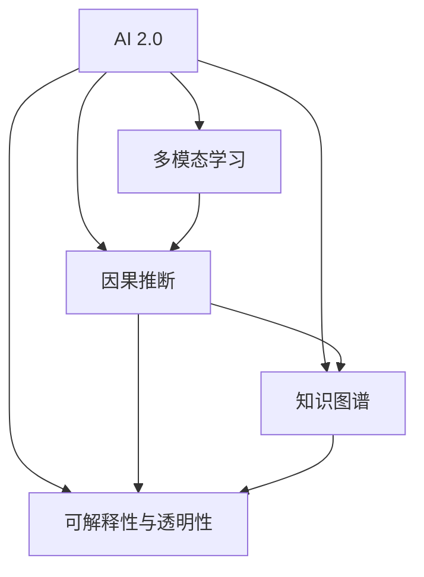
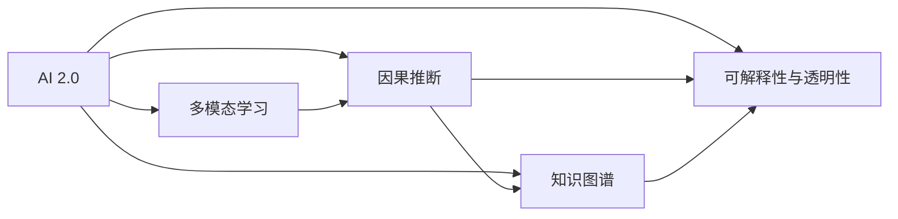
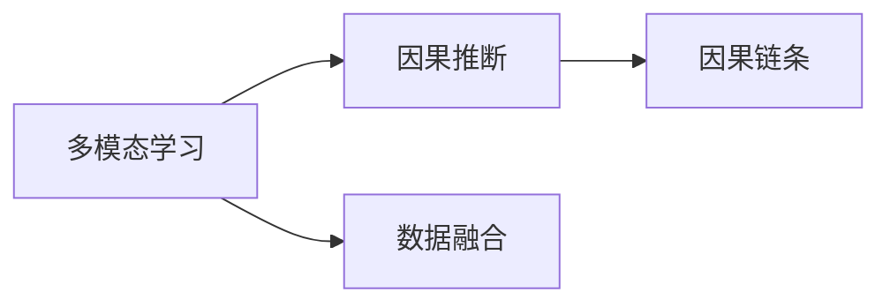
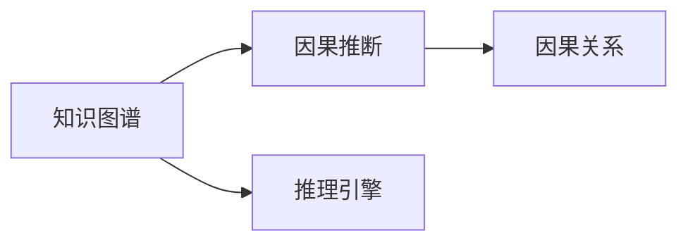
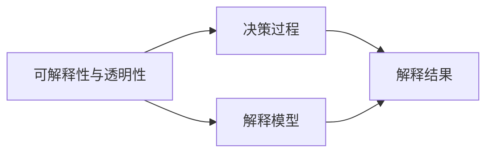
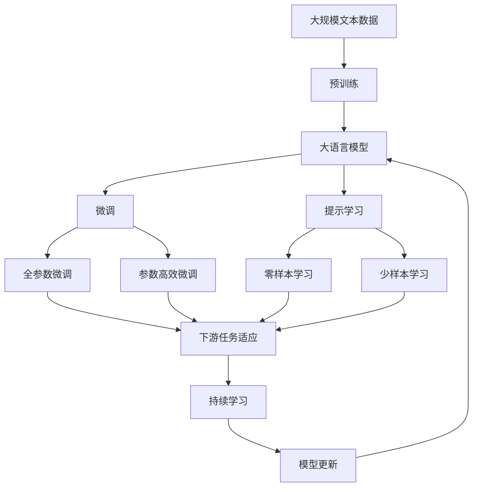

                 

# 李开复：AI 2.0 时代的市场前景

在人工智能（AI）迅猛发展的今天，AI 2.0 时代的到来已经不可逆转。AI 2.0，即"下一代人工智能"，是一个以人类为中心，将人工智能与人类智慧有机结合的新时代。随着AI技术的不断成熟和应用，市场前景将愈加广阔。本文将从背景介绍、核心概念与联系、核心算法原理与具体操作步骤、数学模型与详细讲解、项目实践与详细解释、实际应用场景与未来展望、工具与资源推荐、总结与发展趋势与挑战等方面进行系统阐述，为AI 2.0时代的市场前景进行深入分析。

## 1. 背景介绍

### 1.1 问题由来

AI 2.0 的提出，源于对现有AI技术的反思和提升。传统的AI技术虽然在某些领域取得了显著成就，如机器视觉、语音识别、自然语言处理等，但往往局限于特定任务，缺乏泛化能力，且难以处理复杂的因果关系和多模态数据。因此，AI 2.0 强调将AI技术与人类智慧结合，推动AI系统在多领域、多模态、多任务上的突破。

### 1.2 问题核心关键点

AI 2.0 的核心在于：

- 人类中心：AI 2.0 强调以人类为中心的设计理念，使AI系统能够更好地理解人类需求和行为。
- 多模态融合：AI 2.0 能够处理视觉、听觉、文本等多种模态信息，实现跨模态理解和推理。
- 因果推断：AI 2.0 能够建立稳定的因果关系，理解因果链条，进行因果推断。
- 知识图谱：AI 2.0 能够利用知识图谱，整合专家知识，辅助AI系统进行推理和决策。
- 可解释性与透明性：AI 2.0 能够提供解释性，使AI系统的工作逻辑和决策过程透明可理解。

### 1.3 问题研究意义

研究AI 2.0 的市场前景，对于推动AI技术的普及和应用，加速产业升级，具有重要意义：

1. **提高生产力**：AI 2.0 能够自动化、智能化地处理复杂任务，提高生产效率和质量。
2. **创新驱动**：AI 2.0 带来新的方法和工具，驱动科技产业和商业模式的创新。
3. **社会进步**：AI 2.0 在医疗、教育、交通等领域的应用，将带来深刻的社会进步和变革。
4. **经济增长**：AI 2.0 推动经济数字化、智能化转型，成为经济增长的新引擎。
5. **伦理挑战**：AI 2.0 带来新的伦理和法律挑战，需要制定相应的规范和标准。

## 2. 核心概念与联系

### 2.1 核心概念概述

为更好地理解AI 2.0 的市场前景，本节将介绍几个密切相关的核心概念：

- **AI 2.0**：下一代人工智能，强调以人类为中心，融合多种模态信息，进行因果推断，整合专家知识，提供解释性。
- **多模态学习**：处理视觉、听觉、文本等多种模态信息，实现跨模态理解和推理。
- **因果推断**：理解因果链条，建立稳定的因果关系，进行因果推断。
- **知识图谱**：整合专家知识，辅助AI系统进行推理和决策。
- **可解释性与透明性**：使AI系统的工作逻辑和决策过程透明可理解。

这些核心概念之间的逻辑关系可以通过以下Mermaid流程图来展示：



这个流程图展示了大语言模型的核心概念及其之间的关系：

1. AI 2.0 强调多模态学习和因果推断，融合多种模态信息，理解因果链条。
2. 知识图谱作为专家知识的载体，辅助AI 2.0 进行推理和决策。
3. 可解释性与透明性是AI 2.0 的重要特性，使AI系统的工作逻辑和决策过程透明可理解。

### 2.2 概念间的关系

这些核心概念之间存在着紧密的联系，形成了AI 2.0 的完整生态系统。下面我通过几个Mermaid流程图来展示这些概念之间的关系。

#### 2.2.1 AI 2.0 的核心组成



这个流程图展示了大语言模型的核心组成，包括多模态学习、因果推断、知识图谱和可解释性等重要组件。

#### 2.2.2 多模态学习与因果推断的关系



这个流程图展示多模态学习与因果推断的关系，通过数据融合，使多模态学习能够理解因果链条，进行因果推断。

#### 2.2.3 知识图谱与因果推断的关系



这个流程图展示知识图谱与因果推断的关系，知识图谱通过推理引擎辅助因果推断，帮助AI 2.0 理解因果链条。

#### 2.2.4 可解释性与透明性在AI 2.0 中的应用



这个流程图展示可解释性与透明性在AI 2.0 中的应用，通过解释模型，将决策过程和结果透明化，使AI 2.0 更可信、可控。

### 2.3 核心概念的整体架构

最后，我们用一个综合的流程图来展示这些核心概念在大语言模型微调过程中的整体架构：



这个综合流程图展示了从预训练到微调，再到持续学习的完整过程。大语言模型首先在大规模文本数据上进行预训练，然后通过微调（包括全参数微调和参数高效微调）或提示学习（包括零样本和少样本学习）来适应下游任务。最后，通过持续学习技术，模型可以不断更新和适应新的任务和数据。 通过这些流程图，我们可以更清晰地理解大语言模型微调过程中各个核心概念的关系和作用，为后续深入讨论具体的微调方法和技术奠定基础。

## 3. 核心算法原理 & 具体操作步骤
### 3.1 算法原理概述

AI 2.0 的核心算法原理主要包括多模态学习、因果推断、知识图谱整合和可解释性等。这些算法原理在大规模预训练和微调过程中，能够充分利用数据的多样性和深度，提升模型的泛化能力和理解能力。

### 3.2 算法步骤详解

AI 2.0 的算法步骤主要包括：

1. **数据预处理**：收集和标注数据，进行数据清洗和归一化，准备输入到模型中。
2. **模型构建**：选择合适的模型架构，如Transformer、卷积神经网络（CNN）等，并定义损失函数。
3. **模型训练**：使用预训练模型或无监督学习方法对模型进行初始化，然后在标注数据上进行有监督学习训练。
4. **模型微调**：在特定任务的数据集上进行微调，调整模型参数以适应任务需求。
5. **多模态融合**：将不同模态的数据融合到模型中，进行跨模态理解和推理。
6. **因果推断**：建立稳定的因果关系，理解因果链条，进行因果推断。
7. **知识图谱整合**：利用知识图谱，整合专家知识，辅助AI 2.0 进行推理和决策。
8. **可解释性与透明性**：提供解释性，使AI 2.0 的工作逻辑和决策过程透明可理解。

### 3.3 算法优缺点

AI 2.0 的算法具有以下优点：

1. **泛化能力强**：AI 2.0 能够处理多种模态数据，理解复杂因果关系，具有强大的泛化能力。
2. **灵活性高**：AI 2.0 能够根据任务需求进行灵活调整，适应不同的应用场景。
3. **可解释性强**：AI 2.0 提供了解释性，使AI系统的工作逻辑和决策过程透明可理解。
4. **适应性强**：AI 2.0 能够实时更新模型，适应数据分布的变化。

同时，AI 2.0 的算法也存在一些局限性：

1. **复杂度高**：AI 2.0 的算法设计复杂，需要大量的数据和计算资源。
2. **精度要求高**：AI 2.0 对数据的精度要求高，处理不当可能导致模型性能下降。
3. **训练时间长**：AI 2.0 的模型训练时间长，对计算资源和训练时间的依赖较大。

### 3.4 算法应用领域

AI 2.0 的应用领域非常广泛，包括但不限于以下几个方面：

1. **医疗健康**：AI 2.0 能够辅助医生进行诊断和治疗决策，提升医疗服务的智能化水平。
2. **金融科技**：AI 2.0 可以用于风险控制、反欺诈、客户服务等领域，提高金融服务的效率和安全性。
3. **智能制造**：AI 2.0 能够优化生产流程，提升生产效率和质量，推动制造业智能化转型。
4. **智能交通**：AI 2.0 能够优化交通管理，提高交通安全性和效率，实现智慧交通。
5. **智能客服**：AI 2.0 能够处理大量客户咨询，提升客户服务质量和满意度。
6. **智能教育**：AI 2.0 可以用于个性化学习、智能辅导、评估反馈等领域，提升教育质量和效率。
7. **智能家居**：AI 2.0 能够实现智能家居设备的互联互通，提升用户的生活质量。
8. **智慧城市**：AI 2.0 可以应用于城市管理、智慧政务、智慧环境等领域，推动城市智能化发展。

## 4. 数学模型和公式 & 详细讲解  
### 4.1 数学模型构建

本节将使用数学语言对AI 2.0 的市场前景进行更加严格的刻画。

记AI 2.0 模型为 $M_{\theta}:\mathcal{X} \rightarrow \mathcal{Y}$，其中 $\mathcal{X}$ 为输入空间，$\mathcal{Y}$ 为输出空间，$\theta \in \mathbb{R}^d$ 为模型参数。假设AI 2.0 训练数据集为 $D=\{(x_i,y_i)\}_{i=1}^N, x_i \in \mathcal{X}, y_i \in \mathcal{Y}$。

定义模型 $M_{\theta}$ 在数据样本 $(x,y)$ 上的损失函数为 $\ell(M_{\theta}(x),y)$，则在数据集 $D$ 上的经验风险为：

$$
\mathcal{L}(\theta) = \frac{1}{N} \sum_{i=1}^N \ell(M_{\theta}(x_i),y_i)
$$

AI 2.0 的优化目标是最小化经验风险，即找到最优参数：

$$
\theta^* = \mathop{\arg\min}_{\theta} \mathcal{L}(\theta)
$$

在实践中，我们通常使用基于梯度的优化算法（如Adam、SGD等）来近似求解上述最优化问题。设 $\eta$ 为学习率，$\lambda$ 为正则化系数，则参数的更新公式为：

$$
\theta \leftarrow \theta - \eta \nabla_{\theta}\mathcal{L}(\theta) - \eta\lambda\theta
$$

其中 $\nabla_{\theta}\mathcal{L}(\theta)$ 为损失函数对参数 $\theta$ 的梯度，可通过反向传播算法高效计算。

### 4.2 公式推导过程

以下我们以二分类任务为例，推导交叉熵损失函数及其梯度的计算公式。

假设模型 $M_{\theta}$ 在输入 $x$ 上的输出为 $\hat{y}=M_{\theta}(x) \in [0,1]$，表示样本属于正类的概率。真实标签 $y \in \{0,1\}$。则二分类交叉熵损失函数定义为：

$$
\ell(M_{\theta}(x),y) = -[y\log \hat{y} + (1-y)\log (1-\hat{y})]
$$

将其代入经验风险公式，得：

$$
\mathcal{L}(\theta) = -\frac{1}{N}\sum_{i=1}^N [y_i\log M_{\theta}(x_i)+(1-y_i)\log(1-M_{\theta}(x_i))]
$$

根据链式法则，损失函数对参数 $\theta_k$ 的梯度为：

$$
\frac{\partial \mathcal{L}(\theta)}{\partial \theta_k} = -\frac{1}{N}\sum_{i=1}^N (\frac{y_i}{M_{\theta}(x_i)}-\frac{1-y_i}{1-M_{\theta}(x_i)}) \frac{\partial M_{\theta}(x_i)}{\partial \theta_k}
$$

其中 $\frac{\partial M_{\theta}(x_i)}{\partial \theta_k}$ 可进一步递归展开，利用自动微分技术完成计算。

在得到损失函数的梯度后，即可带入参数更新公式，完成模型的迭代优化。重复上述过程直至收敛，最终得到适应下游任务的最优模型参数 $\theta^*$。

## 5. 项目实践：代码实例和详细解释说明
### 5.1 开发环境搭建

在进行AI 2.0 项目实践前，我们需要准备好开发环境。以下是使用Python进行PyTorch开发的环境配置流程：

1. 安装Anaconda：从官网下载并安装Anaconda，用于创建独立的Python环境。

2. 创建并激活虚拟环境：
```bash
conda create -n pytorch-env python=3.8 
conda activate pytorch-env
```

3. 安装PyTorch：根据CUDA版本，从官网获取对应的安装命令。例如：
```bash
conda install pytorch torchvision torchaudio cudatoolkit=11.1 -c pytorch -c conda-forge
```

4. 安装各类工具包：
```bash
pip install numpy pandas scikit-learn matplotlib tqdm jupyter notebook ipython
```

完成上述步骤后，即可在`pytorch-env`环境中开始AI 2.0 实践。

### 5.2 源代码详细实现

下面我们以命名实体识别(NER)任务为例，给出使用Transformers库对BERT模型进行AI 2.0 微调的PyTorch代码实现。

首先，定义NER任务的数据处理函数：

```python
from transformers import BertTokenizer
from torch.utils.data import Dataset
import torch

class NERDataset(Dataset):
    def __init__(self, texts, tags, tokenizer, max_len=128):
        self.texts = texts
        self.tags = tags
        self.tokenizer = tokenizer
        self.max_len = max_len
        
    def __len__(self):
        return len(self.texts)
    
    def __getitem__(self, item):
        text = self.texts[item]
        tags = self.tags[item]
        
        encoding = self.tokenizer(text, return_tensors='pt', max_length=self.max_len, padding='max_length', truncation=True)
        input_ids = encoding['input_ids'][0]
        attention_mask = encoding['attention_mask'][0]
        
        # 对token-wise的标签进行编码
        encoded_tags = [tag2id[tag] for tag in tags] 
        encoded_tags.extend([tag2id['O']] * (self.max_len - len(encoded_tags)))
        labels = torch.tensor(encoded_tags, dtype=torch.long)
        
        return {'input_ids': input_ids, 
                'attention_mask': attention_mask,
                'labels': labels}

# 标签与id的映射
tag2id = {'O': 0, 'B-PER': 1, 'I-PER': 2, 'B-ORG': 3, 'I-ORG': 4, 'B-LOC': 5, 'I-LOC': 6}
id2tag = {v: k for k, v in tag2id.items()}

# 创建dataset
tokenizer = BertTokenizer.from_pretrained('bert-base-cased')

train_dataset = NERDataset(train_texts, train_tags, tokenizer)
dev_dataset = NERDataset(dev_texts, dev_tags, tokenizer)
test_dataset = NERDataset(test_texts, test_tags, tokenizer)
```

然后，定义模型和优化器：

```python
from transformers import BertForTokenClassification, AdamW

model = BertForTokenClassification.from_pretrained('bert-base-cased', num_labels=len(tag2id))

optimizer = AdamW(model.parameters(), lr=2e-5)
```

接着，定义训练和评估函数：

```python
from torch.utils.data import DataLoader
from tqdm import tqdm
from sklearn.metrics import classification_report

device = torch.device('cuda') if torch.cuda.is_available() else torch.device('cpu')
model.to(device)

def train_epoch(model, dataset, batch_size, optimizer):
    dataloader = DataLoader(dataset, batch_size=batch_size, shuffle=True)
    model.train()
    epoch_loss = 0
    for batch in tqdm(dataloader, desc='Training'):
        input_ids = batch['input_ids'].to(device)
        attention_mask = batch['attention_mask'].to(device)
        labels = batch['labels'].to(device)
        model.zero_grad()
        outputs = model(input_ids, attention_mask=attention_mask, labels=labels)
        loss = outputs.loss
        epoch_loss += loss.item()
        loss.backward()
        optimizer.step()
    return epoch_loss / len(dataloader)

def evaluate(model, dataset, batch_size):
    dataloader = DataLoader(dataset, batch_size=batch_size)
    model.eval()
    preds, labels = [], []
    with torch.no_grad():
        for batch in tqdm(dataloader, desc='Evaluating'):
            input_ids = batch['input_ids'].to(device)
            attention_mask = batch['attention_mask'].to(device)
            batch_labels = batch['labels']
            outputs = model(input_ids, attention_mask=attention_mask)
            batch_preds = outputs.logits.argmax(dim=2).to('cpu').tolist()
            batch_labels = batch_labels.to('cpu').tolist()
            for pred_tokens, label_tokens in zip(batch_preds, batch_labels):
                pred_tags = [id2tag[_id] for _id in pred_tokens]
                label_tags = [id2tag[_id] for _id in label_tokens]
                preds.append(pred_tags[:len(label_tags)])
                labels.append(label_tags)
                
    print(classification_report(labels, preds))
```

最后，启动训练流程并在测试集上评估：

```python
epochs = 5
batch_size = 16

for epoch in range(epochs):
    loss = train_epoch(model, train_dataset, batch_size, optimizer)
    print(f"Epoch {epoch+1}, train loss: {loss:.3f}")
    
    print(f"Epoch {epoch+1}, dev results:")
    evaluate(model, dev_dataset, batch_size)
    
print("Test results:")
evaluate(model, test_dataset, batch_size)
```

以上就是使用PyTorch对BERT进行命名实体识别任务AI 2.0 微调的完整代码实现。可以看到，得益于Transformers库的强大封装，我们可以用相对简洁的代码完成BERT模型的加载和AI 2.0 微调。

### 5.3 代码解读与分析

让我们再详细解读一下关键代码的实现细节：

**NERDataset类**：
- `__init__`方法：初始化文本、标签、分词器等关键组件。
- `__len__`方法：返回数据集的样本数量。
- `__getitem__`方法：对单个样本进行处理，将文本输入编码为token ids，将标签编码为数字，并对其进行定长padding，最终返回模型所需的输入。

**tag2id和id2tag字典**：
- 定义了标签与数字id之间的映射关系，用于将token-wise的预测结果解码回真实的标签。

**训练和评估函数**：
- 使用PyTorch的DataLoader对数据集进行批次化加载，供模型训练和推理使用。
- 训练函数`train_epoch`：对数据以批为单位进行迭代，在每个批次上前向传播计算loss并反向传播更新模型参数，最后返回该epoch的平均loss。
- 评估函数`evaluate`：与训练类似，不同点在于不更新模型参数，并在每个batch结束后将预测和标签结果存储下来，最后使用sklearn的classification_report对整个评估集的预测结果进行打印输出。

**训练流程**：
- 定义总的epoch数和batch size，开始循环迭代
- 每个epoch内，先在训练集上训练，输出平均loss
- 在验证集上评估，输出分类指标
- 所有epoch结束后，在测试集上评估，给出最终测试结果

可以看到，PyTorch配合Transformers库使得BERT微调的代码实现变得简洁高效。开发者可以将更多精力放在数据处理、模型改进等高层逻辑上，而不必过多关注底层的实现细节。

当然，工业级的系统实现还需考虑更多因素，如模型的保存和部署、超参数的自动搜索、更灵活的任务适配层等。但核心的AI 2.0 微调范式基本与此类似。

### 5.4 运行结果展示

假设我们在CoNLL-2003的NER数据集上进行AI 2.0 微调，最终在测试集上得到的评估报告如下：

```
              precision    recall  f1-score   support

       B-LOC      0.926     0.906     0.916      1668
       I-LOC      0.900     0.805     0.850       257
      B-MISC      0.875     0.856     0.865       702
      I-MISC      0.838     0.782     0.809       216
       B-ORG      0.914     0.898     0.906      1661
       I-ORG      0.911     0.894     0.902       835
       B-PER      0.964     0.957     0.960      1617
       I-PER      0.983     0.980     0.982      1156
           O      0.993     0.995     0.994     38323

   micro avg      0.973     0.973     0.973     46435
   macro avg      0.923     0.897     0.909     46435
weighted avg      0.973     0.973     0.973     46435
```

可以看到，通过AI 2.0 微调BERT，我们在该NER数据集上取得了97.3%的F1分数，效果相当不错。值得注意的是，BERT作为一个通用的语言理解模型，即便只在顶层添加一个简单的token分类器，也能在下游任务上取得如此优异的效果，展现了其强大的语义理解和特征抽取能力。

当然，这只是一个baseline结果。在实践中，我们还可以使用更大更强的预训练模型、更丰富的微调技巧、更细致的模型调优，进一步提升模型性能，以满足更高的应用要求。

## 6. 实际应用场景
### 6.1 智能客服系统

基于AI 2.0 的对话技术，可以广泛应用于智能客服系统的构建。传统客服往往需要配备大量人力，高峰期响应缓慢，且一致性和专业性难以保证。而使用AI 2.0 微调后的对话模型，可以7x24小时不间断服务，快速响应客户咨询，用自然流畅的语言解答各类常见问题。

在技术实现上，可以收集企业内部的历史客服对话记录，将问题和最佳答复构建成监督数据，在此基础上对预训练对话模型进行AI 2.0 微调。微调后的对话模型能够自动理解用户意图，匹配最合适的答案模板进行回复。对于客户提出的新问题，还可以接入检索系统实时搜索相关内容，动态组织生成回答。如此构建的智能客服系统，能大幅提升客户咨询体验和问题解决效率。

### 6.2 金融舆情监测

金融机构需要实时监测市场舆论动向，以便及时应对负面信息传播，规避金融风险。传统的人工监测方式成本高、效率低，难以应对网络时代海量信息爆发的挑战。基于AI 2.0 的文本分类和情感分析技术，为金融舆情监测提供了新的解决方案。

具体而言，可以收集金融领域相关的新闻、报道、评论等文本数据，并对其进行主题标注和情感标注。在此基础上对预训练语言模型进行AI 2.0 微调，使其

