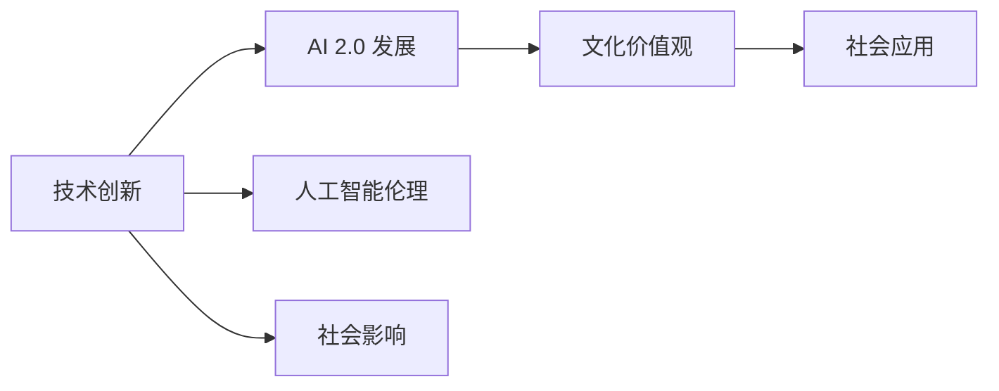

                 

# 李开复：AI 2.0 时代的文化价值

人工智能(AI)正在以前所未有的速度改变世界。从自动驾驶汽车到医疗诊断，从智能客服到个性化推荐，AI 的应用无所不在，其对社会的影响也日益深远。但在这背后，AI 技术的演进与创新，不仅仅是技术层面上的突破，更是一场涉及文化价值观的深刻变革。在AI 2.0时代，我们必须重新审视和塑造我们的文化价值观，以确保AI技术的健康发展。本文将探讨AI 2.0时代的文化价值，以及我们如何通过AI技术的创新与应用，推动人类社会的进步与发展。

## 1. 背景介绍

### 1.1 AI 的发展历程

AI的发展历程可以追溯到1950年代的早期计算机科学。早期的AI研究主要集中在逻辑推理和知识表示等领域，但受限于计算资源的限制，进展缓慢。1980年代，随着专家系统（Expert Systems）的兴起，AI在医疗诊断、法律咨询等领域取得了显著的成果。然而，90年代AI的发展受阻，研究重点转向机器学习，特别是统计学习方法。

进入21世纪，随着互联网和大数据的发展，AI技术迎来了新的高峰。深度学习、自然语言处理、计算机视觉等领域取得了突破性进展，AI开始大规模应用于各行各业。近年来，AI技术进一步演进，形成了以深度神经网络为核心的AI 2.0时代。

### 1.2 AI 2.0 时代的特征

AI 2.0 时代，AI技术更加普及、强大、可解释性更高，且能够适应更多的应用场景。其特征包括：

- **多模态融合**：AI 2.0 不仅处理文本数据，还能处理图像、音频、视频等多模态数据，提高了AI系统的综合能力。
- **自监督学习**：AI 2.0 能够从自身生成大量数据，无需大规模标注数据，降低了数据标注成本。
- **分布式训练**：AI 2.0 能够在大规模分布式计算环境中进行训练，提高了训练效率。
- **迁移学习**：AI 2.0 能够在不同任务之间迁移知识，提高了模型的泛化能力。
- **交互式学习**：AI 2.0 能够通过交互学习不断提升自身能力，提高了AI系统的适应性。

## 2. 核心概念与联系

### 2.1 核心概念概述

为了更好地理解AI 2.0时代的文化价值，我们首先需要理解几个关键概念：

- **AI 2.0**：指的是新一代的AI技术，基于深度学习和大数据，能够处理复杂的多模态数据，适应各种应用场景，并具备高度的自主学习能力。
- **文化价值**：指的是在AI 2.0时代，人们对于AI技术的伦理、道德、社会影响等价值观和信念。
- **技术创新**：指的是通过技术手段，不断改进和优化AI系统，使其具备更强的能力，同时提升用户体验。

### 2.2 核心概念之间的联系

AI 2.0 时代的文化价值和技术创新之间有着密切的联系。技术创新不仅推动了AI 2.0 的发展，也带来了新的文化价值观挑战。反过来，文化价值观的塑造，也决定了AI 2.0 的发展方向和应用范围。这种相互影响的关系，使得我们在AI 2.0 时代，需要更全面地考虑技术、伦理和社会因素，以确保AI技术的发展符合人类的利益和价值观。

以下是一个简单的Mermaid流程图，展示了AI 2.0 时代的技术创新和文化价值观之间的关系：



这个流程图展示了技术创新如何推动AI 2.0 的发展，并进一步影响社会应用和文化价值观的形成。同时，社会应用和文化价值观也会反过来影响技术创新的方向和速度。

## 3. 核心算法原理 & 具体操作步骤

### 3.1 算法原理概述

AI 2.0 时代的文化价值和技术创新，可以通过以下几个核心算法原理来理解：

- **深度神经网络**：AI 2.0 的核心算法，能够处理复杂的多模态数据，具备自监督学习和迁移学习的能力。
- **迁移学习**：将在一个任务上学习到的知识，迁移到另一个任务上，提高了模型的泛化能力。
- **自监督学习**：利用自身生成的数据，无需大规模标注数据，提高了训练效率。
- **强化学习**：通过与环境的交互，不断提升AI系统的能力，提高了系统的适应性和鲁棒性。

### 3.2 算法步骤详解

下面是AI 2.0 时代核心算法的操作步骤：

1. **数据收集与预处理**：收集多模态数据，并进行预处理，去除噪声和无用信息。
2. **深度神经网络构建**：构建深度神经网络，选择适当的模型结构，如卷积神经网络（CNN）、循环神经网络（RNN）、变分自编码器（VAE）等。
3. **模型训练与优化**：使用自监督或迁移学习方法，训练模型，并进行超参数调优，提高模型的准确性和泛化能力。
4. **模型评估与验证**：在测试集上评估模型的性能，并根据评估结果调整模型参数，优化模型。
5. **模型部署与应用**：将模型部署到实际应用场景中，并进行性能监控和优化。

### 3.3 算法优缺点

AI 2.0 时代的核心算法具有以下优点：

- **高效性**：自监督学习和大规模分布式训练提高了算法的训练效率。
- **泛化能力**：迁移学习提高了模型的泛化能力，适应性更强。
- **鲁棒性**：强化学习提高了模型的鲁棒性，能够适应复杂和多变的环境。

然而，这些算法也存在一些缺点：

- **数据依赖**：自监督学习和迁移学习需要大量数据，获取高质量数据成本高。
- **模型复杂度**：深度神经网络模型参数量大，训练和推理复杂。
- **可解释性**：复杂的深度神经网络缺乏可解释性，难以理解和调试。

### 3.4 算法应用领域

AI 2.0 时代的核心算法已经广泛应用于多个领域，包括：

- **计算机视觉**：图像识别、目标检测、图像生成等。
- **自然语言处理**：语言模型、机器翻译、文本生成等。
- **语音识别**：语音识别、语音合成等。
- **医疗诊断**：疾病诊断、影像分析等。
- **自动驾驶**：视觉感知、路径规划等。

## 4. 数学模型和公式 & 详细讲解

### 4.1 数学模型构建

在AI 2.0时代，数学模型通常基于深度神经网络和自监督学习构建。以下是一个简单的神经网络数学模型：

- **输入层**：将多模态数据（如图像、文本）转化为向量形式，输入神经网络。
- **隐藏层**：由多个神经元组成，进行特征提取和数据变换。
- **输出层**：根据任务需求，输出最终结果。

### 4.2 公式推导过程

以下是一个简单的卷积神经网络（CNN）的公式推导过程：

- **前向传播**：将输入数据通过多个卷积层和池化层，得到特征图。
- **损失函数**：使用交叉熵损失函数，计算预测输出与真实标签之间的差异。
- **反向传播**：使用梯度下降算法，计算损失函数对各层参数的梯度，更新参数。

### 4.3 案例分析与讲解

以图像识别为例，CNN 模型可以通过多层卷积和池化操作，提取图像中的特征，并在全连接层中进行分类。以下是一个简单的CNN模型：

```
Conv2D(3, 32, 3x3, activation=relu)  # 输入为RGB图像，输出为32个特征图
MaxPooling(2x2)                     # 池化操作
Conv2D(32, 64, 3x3, activation=relu) # 32个特征图卷积为64个特征图
MaxPooling(2x2)                     # 池化操作
Conv2D(64, 128, 3x3, activation=relu) # 64个特征图卷积为128个特征图
MaxPooling(2x2)                     # 池化操作
Flatten()                           # 将特征图展开为一维向量
Dense(128, activation=relu)         # 全连接层，输出128个特征
Dropout(0.5)                        # 防止过拟合
Dense(10, activation=softmax)       # 输出10个类别的概率
```

## 5. 项目实践：代码实例和详细解释说明

### 5.1 开发环境搭建

进行AI 2.0项目的开发，需要准备好Python和TensorFlow等开发环境。以下是一个简单的Python开发环境搭建流程：

1. 安装Python：从官网下载并安装Python 3.7及以上版本。
2. 安装TensorFlow：使用pip安装TensorFlow 2.x版本。
3. 安装PyTorch：使用conda安装PyTorch 1.6及以上版本。
4. 安装相关库：使用pip安装numpy、scikit-learn、matplotlib等库。

### 5.2 源代码详细实现

以下是一个简单的图像分类项目的Python代码实现：

```python
import tensorflow as tf
from tensorflow import keras
import numpy as np
import matplotlib.pyplot as plt

# 加载数据集
(train_images, train_labels), (test_images, test_labels) = keras.datasets.mnist.load_data()

# 数据预处理
train_images = train_images.reshape(-1, 28, 28, 1).astype('float32') / 255
test_images = test_images.reshape(-1, 28, 28, 1).astype('float32') / 255

# 定义模型
model = keras.Sequential([
    keras.layers.Conv2D(32, 3, activation='relu'),
    keras.layers.MaxPooling2D(2),
    keras.layers.Conv2D(64, 3, activation='relu'),
    keras.layers.MaxPooling2D(2),
    keras.layers.Flatten(),
    keras.layers.Dense(10, activation='softmax')
])

# 编译模型
model.compile(optimizer='adam', loss='sparse_categorical_crossentropy', metrics=['accuracy'])

# 训练模型
model.fit(train_images, train_labels, epochs=5, validation_data=(test_images, test_labels))

# 评估模型
test_loss, test_acc = model.evaluate(test_images, test_labels)
print('Test accuracy:', test_acc)

# 可视化模型
keras.utils.plot_model(model, show_shapes=True)
plt.show()
```

### 5.3 代码解读与分析

以上代码实现了一个简单的CNN模型，用于对MNIST数据集进行图像分类。代码中包含了数据加载、预处理、模型定义、编译、训练、评估等关键步骤。

- `train_images`和`train_labels`是从`mnist.load_data()`加载的训练数据集。
- `train_images`和`test_images`需要进行预处理，将其转化为模型所需的张量形式，并进行归一化处理。
- `model`是定义好的CNN模型，包含多个卷积层和全连接层。
- `model.compile()`方法用于配置模型的优化器、损失函数和评估指标。
- `model.fit()`方法用于训练模型，`epochs`参数控制训练轮数，`validation_data`参数指定验证数据集。
- `model.evaluate()`方法用于评估模型在测试集上的表现。
- `keras.utils.plot_model()`方法用于可视化模型的结构和参数配置。

## 6. 实际应用场景

### 6.1 智能医疗

AI 2.0 技术在智能医疗领域有着广泛的应用，如疾病诊断、影像分析等。以下是一个简单的医疗影像分析项目：

1. **数据收集**：收集大量医疗影像数据，并进行标注。
2. **数据预处理**：对影像数据进行预处理，如归一化、增强等。
3. **模型训练**：使用自监督学习或迁移学习方法，训练医疗影像分类模型。
4. **模型应用**：将模型应用于新的医疗影像数据，进行疾病诊断和影像分析。

### 6.2 智能客服

智能客服系统利用AI 2.0 技术，能够自动理解客户意图，并提供准确的答案。以下是一个简单的智能客服项目：

1. **数据收集**：收集客户对话记录，并进行标注。
2. **数据预处理**：对对话数据进行预处理，如去除噪声、分词等。
3. **模型训练**：使用迁移学习方法，训练对话生成模型。
4. **模型应用**：将模型应用于新的客户对话数据，生成自然流畅的回复。

### 6.3 自动驾驶

自动驾驶系统利用AI 2.0 技术，能够实现车辆自主导航和避障等功能。以下是一个简单的自动驾驶项目：

1. **数据收集**：收集大量道路数据，并进行标注。
2. **数据预处理**：对道路数据进行预处理，如去噪、增强等。
3. **模型训练**：使用自监督学习或迁移学习方法，训练车辆导航模型。
4. **模型应用**：将模型应用于实际道路环境，进行车辆路径规划和避障。

## 7. 工具和资源推荐

### 7.1 学习资源推荐

以下是几个推荐的学习资源，帮助开发者深入理解AI 2.0 技术的原理和应用：

- **深度学习与TensorFlow官方文档**：提供了丰富的TensorFlow资源和教程，适合初学者和进阶开发者。
- **PyTorch官方文档**：提供了PyTorch的教程和文档，适合使用PyTorch进行AI开发的项目。
- **Coursera深度学习课程**：由斯坦福大学和深度学习专家吴恩达教授的深度学习课程，涵盖了深度神经网络、卷积神经网络、循环神经网络等核心概念。
- **Fast.ai课程**：由Jeremy Howard和Rachel Thomas开发的深度学习课程，注重实战和项目导向，适合有实际项目需求的开发者。

### 7.2 开发工具推荐

以下是几个推荐的开发工具，帮助开发者高效实现AI 2.0 项目：

- **TensorFlow**：谷歌开源的深度学习框架，支持分布式训练和GPU加速。
- **PyTorch**：Facebook开源的深度学习框架，灵活高效，适合动态图和静态图计算。
- **TensorBoard**：谷歌开源的可视化工具，可以实时监控模型训练状态，生成可视化图表。
- **Keras**：高层次深度学习框架，提供了简单易用的API，适合初学者和快速原型开发。
- **Jupyter Notebook**：开源的交互式开发环境，支持Python、R等多种语言，适合快速迭代和共享代码。

### 7.3 相关论文推荐

以下是几个推荐的相关论文，帮助开发者深入理解AI 2.0 技术的最新进展：

- **ImageNet大规模视觉识别挑战赛（ILSVRC）**：展示了AI 2.0 技术在计算机视觉领域的最新进展。
- **自然语言处理综述**：综述了自然语言处理领域的最新进展，涵盖了语言模型、机器翻译、文本生成等核心技术。
- **AlphaGo**：展示了AI 2.0 技术在棋类游戏领域的突破性进展，代表了AI 2.0 在决策制定和策略优化方面的潜力。

## 8. 总结：未来发展趋势与挑战

### 8.1 研究成果总结

AI 2.0 技术的不断发展，带来了诸多创新和突破，也为文化价值的塑造带来了新的挑战。本文总结了AI 2.0 技术的主要进展，包括深度神经网络、自监督学习、迁移学习、强化学习等核心算法。

### 8.2 未来发展趋势

AI 2.0 技术的未来发展趋势包括：

- **多模态融合**：AI 2.0 能够处理更多种类的数据，提升模型的综合能力。
- **自监督学习**：利用自身生成的数据进行训练，降低数据标注成本。
- **分布式训练**：利用大规模分布式计算环境，提高训练效率。
- **迁移学习**：在不同任务之间迁移知识，提高模型的泛化能力。
- **强化学习**：通过与环境的交互，提升AI系统的适应性和鲁棒性。

### 8.3 面临的挑战

AI 2.0 技术面临的挑战包括：

- **数据依赖**：自监督学习和迁移学习需要大量数据，获取高质量数据成本高。
- **模型复杂度**：深度神经网络模型参数量大，训练和推理复杂。
- **可解释性**：复杂的深度神经网络缺乏可解释性，难以理解和调试。
- **伦理和道德**：AI 2.0 技术的应用带来了诸多伦理和道德问题，如隐私保护、偏见和歧视等。
- **安全性**：AI 2.0 技术的应用需要保障数据和模型的安全性。

### 8.4 研究展望

未来AI 2.0技术的研究展望包括：

- **多模态融合**：探索更多种类的数据融合方法，提升模型的综合能力。
- **自监督学习**：研究更多自监督学习算法，降低数据标注成本。
- **分布式训练**：研究更高效的分布式训练算法，提高训练效率。
- **迁移学习**：研究更多迁移学习算法，提高模型的泛化能力。
- **强化学习**：研究更高效的强化学习算法，提高AI系统的适应性和鲁棒性。
- **可解释性**：研究AI系统的可解释性，提升模型的透明性和可信度。
- **伦理和道德**：研究AI系统的伦理和道德约束，确保AI技术的应用符合人类价值观。
- **安全性**：研究AI系统的安全性，保障数据和模型的安全。

## 9. 附录：常见问题与解答

### Q1: AI 2.0 技术是否会取代人类？

A: AI 2.0 技术虽然强大，但目前仍无法完全取代人类。AI 2.0 技术擅长处理大规模数据和复杂任务，但在创造力、情感理解和道德判断等方面，人类仍然具有无可替代的优势。

### Q2: AI 2.0 技术的应用范围有哪些？

A: AI 2.0 技术的应用范围非常广泛，包括医疗、金融、制造、教育、娱乐等领域。AI 2.0 技术可以用于疾病诊断、智能客服、自动驾驶、金融分析等，为各行各业带来新的突破和创新。

### Q3: 如何避免AI 2.0 技术的偏见和歧视？

A: 避免AI 2.0 技术的偏见和歧视，需要从数据、模型和算法等多个层面进行综合考虑。在数据层面，需要确保数据的多样性和公平性；在模型层面，需要引入公平性和偏见检测算法；在算法层面，需要设计和优化公平性和偏见检测算法。

### Q4: AI 2.0 技术在实际应用中需要注意哪些问题？

A: AI 2.0 技术在实际应用中需要注意以下问题：
- **数据隐私**：确保数据隐私和安全，避免数据泄露和滥用。
- **模型透明性**：确保模型的透明性和可解释性，方便用户理解和调试。
- **伦理和道德**：确保AI 2.0 技术的应用符合人类价值观和伦理道德。
- **安全性**：确保AI 2.0 技术的应用安全可靠，避免恶意攻击和滥用。

### Q5: 如何培养AI 2.0 技术的开发者和应用者？

A: 培养AI 2.0 技术的开发者和应用者，需要从以下几个方面入手：
- **教育培训**：提供系统的AI 2.0 教育培训，培养AI技术人才。
- **实践项目**：通过实际项目和案例研究，提升AI技术开发者的实践能力。
- **学术研究**：鼓励学术界和产业界合作，推动AI 2.0 技术的学术研究和应用开发。

总之，AI 2.0 技术在未来的发展中，需要我们在技术、伦理和社会等多个层面进行综合考虑，确保AI技术的发展符合人类的利益和价值观。通过技术创新和人文关怀，我们可以更好地利用AI 2.0 技术，推动人类社会的进步和发展。

