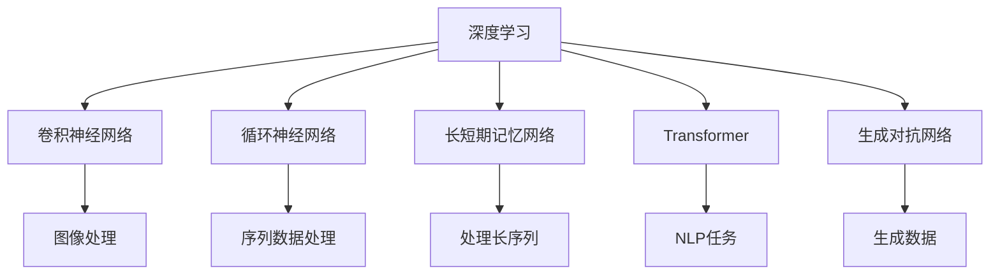

                 

# 李开复：AI 2.0 时代的未来

> 关键词：人工智能, AI 2.0, 深度学习, 计算机视觉, 自然语言处理, 自动驾驶, 机器人, 大数据, 云计算

## 1. 背景介绍

人工智能（Artificial Intelligence, AI）是计算机科学领域的重大突破，其核心在于赋予机器学习、理解、应用人类智能的能力。自1950年代阿兰·图灵提出图灵测试以来，AI已经历了多次重大变革，从专家系统到机器学习，再到深度学习和强化学习。当前，我们正处在AI 2.0时代，AI正迅速渗透到各个行业，从医疗、教育、金融到交通、制造，改变着我们的生活和工作方式。

### 1.1 AI 2.0 的崛起

AI 2.0标志着AI技术的成熟与广泛应用，其特点在于：

- **数据驱动**：利用大数据进行模型训练，不断提升模型性能。
- **深度学习**：通过深度神经网络模拟人脑的认知过程，实现端到端的学习。
- **自动化**：自动化建模、自动化调参，降低开发门槛，加速AI应用的落地。
- **泛化性强**：深度学习模型能够处理复杂多变的数据，具有较强的泛化能力。

AI 2.0时代，AI技术已经成为各行各业的基础设施，推动着创新和效率的提升。李开复博士作为人工智能领域的先驱，在其畅销书《AI 2.0：人工智能的未来》中，深入探讨了AI 2.0的崛起及其对未来的影响。

### 1.2 AI 2.0 的核心技术

AI 2.0的核心技术包括：

- **深度学习**：通过多层次神经网络学习数据的高级抽象特征。
- **计算机视觉**：使计算机能够“看”懂图像和视频。
- **自然语言处理（NLP）**：使计算机能够“理解”和“生成”人类语言。
- **自动驾驶**：实现无人驾驶汽车的安全、高效运行。
- **机器人**：使机器人在复杂环境中自主执行任务。

这些技术的融合与应用，将极大提升生产力，重塑人类社会的未来。

## 2. 核心概念与联系

### 2.1 核心概念概述

AI 2.0时代，核心概念主要包括以下几部分：

- **深度学习**：通过多层神经网络学习数据的高维特征表示。
- **卷积神经网络（CNN）**：特别适用于图像处理任务。
- **循环神经网络（RNN）**：适合处理序列数据，如时间序列和自然语言。
- **长短期记忆网络（LSTM）**：解决了传统RNN在处理长序列时的梯度消失问题。
- **Transformer**：实现了序列数据的端到端处理，提升了自然语言处理的效果。
- **生成对抗网络（GAN）**：通过两个神经网络之间的对抗，生成逼真的图像或数据。

这些技术之间相互关联，共同构成AI 2.0的技术栈。

### 2.2 核心概念之间的联系

这些核心概念之间的联系可以通过以下Mermaid流程图来展示：



这个流程图展示了深度学习技术在不同领域的应用：

- 卷积神经网络（CNN）主要用于图像处理任务，如图像分类、目标检测等。
- 循环神经网络（RNN）和长短期记忆网络（LSTM）主要用于序列数据处理，如语音识别、文本生成等。
- Transformer主要用于自然语言处理任务，如机器翻译、情感分析等。
- 生成对抗网络（GAN）主要用于生成任务，如图像生成、文本生成等。

这些技术共同构成了AI 2.0时代的核心技术框架，支持了各类AI应用的实现。

## 3. 核心算法原理 & 具体操作步骤

### 3.1 算法原理概述

AI 2.0时代，深度学习成为核心算法。深度学习的核心在于多层神经网络的构建和训练。以卷积神经网络（CNN）为例，其原理如下：

- **卷积层**：提取图像中的局部特征。
- **池化层**：减少特征图的大小，保留主要信息。
- **全连接层**：将特征图映射到输出类别。

其训练过程主要通过反向传播算法，优化网络参数以最小化损失函数。

### 3.2 算法步骤详解

以下是深度学习算法的主要步骤：

1. **数据预处理**：将原始数据转化为适合模型训练的格式。
2. **模型构建**：定义神经网络的结构，包括卷积层、池化层、全连接层等。
3. **模型训练**：通过反向传播算法，优化模型参数。
4. **模型评估**：在验证集上评估模型性能，调整超参数。
5. **模型应用**：将训练好的模型应用于实际场景中。

### 3.3 算法优缺点

深度学习的优点在于：

- **强大的表达能力**：多层网络可以学习到复杂的数据表示。
- **自适应学习**：能够自动调整模型参数以适应数据。

缺点在于：

- **计算资源需求高**：需要大量GPU资源进行训练。
- **模型复杂度高**：模型过于复杂可能导致过拟合。
- **解释性不足**：模型内部机制难以解释。

### 3.4 算法应用领域

深度学习在多个领域得到了广泛应用，包括：

- **计算机视觉**：图像分类、目标检测、人脸识别等。
- **自然语言处理**：机器翻译、文本生成、情感分析等。
- **语音识别**：语音合成、语音翻译等。
- **推荐系统**：个性化推荐、广告推荐等。
- **自动驾驶**：无人驾驶汽车、自动驾驶无人机等。

## 4. 数学模型和公式 & 详细讲解

### 4.1 数学模型构建

以卷积神经网络（CNN）为例，其数学模型构建如下：

- **输入**：图像像素矩阵 $X \in \mathbb{R}^{m \times n \times c}$，$m$、$n$ 为图像尺寸，$c$ 为通道数。
- **卷积层**：卷积核 $K \in \mathbb{R}^{k \times k \times c \times o}$，$m'$、$n'$ 为卷积层输出尺寸，$o$ 为输出通道数。卷积操作定义为：

$$
Y_{i,j} = \sum_{k=0}^{c-1} \sum_{l=0}^{c-1} X_{i-k,j-l,k} * K_{i,j,l}
$$

- **池化层**：最大池化、平均池化等。
- **全连接层**：输出 $Z \in \mathbb{R}^{1 \times 1 \times o \times s}$，$s$ 为输出类别数。全连接操作定义为：

$$
Z = W^T * Y + b
$$

### 4.2 公式推导过程

卷积神经网络的推导过程如下：

- **卷积层**：通过滑动卷积核进行特征提取，计算输出矩阵 $Y$。

$$
Y_{i,j} = \sum_{k=0}^{c-1} \sum_{l=0}^{c-1} X_{i-k,j-l,k} * K_{i,j,l}
$$

- **池化层**：对输出矩阵进行池化操作，得到下一层的输入。

$$
Y'_{i,j} = max(Y_{i,j})
$$

- **全连接层**：将池化层输出转化为类别概率。

$$
Z = W^T * Y' + b
$$

其中，$W$ 和 $b$ 为全连接层的权重和偏置项。

### 4.3 案例分析与讲解

以图像分类为例，假设有一个包含狗和猫的图像分类任务，使用卷积神经网络进行训练。训练过程如下：

1. **数据预处理**：将原始图像转化为适合卷积神经网络处理的张量形式。
2. **模型构建**：定义卷积层、池化层、全连接层等。
3. **模型训练**：使用反向传播算法，最小化损失函数。
4. **模型评估**：在验证集上评估模型性能，调整超参数。
5. **模型应用**：将训练好的模型应用于新图像的分类任务中。

## 5. 项目实践：代码实例和详细解释说明

### 5.1 开发环境搭建

AI 2.0的开发环境搭建包括：

- **Python**：深度学习的主流编程语言。
- **PyTorch**：深度学习框架，支持GPU加速。
- **TensorFlow**：谷歌的深度学习框架，支持分布式训练。
- **Jupyter Notebook**：交互式编程环境，方便调试和共享代码。

### 5.2 源代码详细实现

以图像分类为例，使用PyTorch实现卷积神经网络。

```python
import torch
import torch.nn as nn
import torch.optim as optim
import torchvision
import torchvision.transforms as transforms

# 数据预处理
transform = transforms.Compose(
    [transforms.ToTensor(),
     transforms.Normalize((0.5, 0.5, 0.5), (0.5, 0.5, 0.5))])

trainset = torchvision.datasets.CIFAR10(root='./data', train=True,
                                        download=True, transform=transform)
trainloader = torch.utils.data.DataLoader(trainset, batch_size=4,
                                          shuffle=True, num_workers=2)

testset = torchvision.datasets.CIFAR10(root='./data', train=False,
                                       download=True, transform=transform)
testloader = torch.utils.data.DataLoader(testset, batch_size=4,
                                         shuffle=False, num_workers=2)

# 模型构建
class Net(nn.Module):
    def __init__(self):
        super(Net, self).__init__()
        self.conv1 = nn.Conv2d(3, 6, 5)
        self.pool = nn.MaxPool2d(2, 2)
        self.conv2 = nn.Conv2d(6, 16, 5)
        self.fc1 = nn.Linear(16 * 5 * 5, 120)
        self.fc2 = nn.Linear(120, 84)
        self.fc3 = nn.Linear(84, 10)

    def forward(self, x):
        x = self.pool(F.relu(self.conv1(x)))
        x = self.pool(F.relu(self.conv2(x)))
        x = x.view(-1, 16 * 5 * 5)
        x = F.relu(self.fc1(x))
        x = F.relu(self.fc2(x))
        x = self.fc3(x)
        return x

net = Net()

# 模型训练
criterion = nn.CrossEntropyLoss()
optimizer = optim.SGD(net.parameters(), lr=0.001, momentum=0.9)

for epoch in range(2):
    running_loss = 0.0
    for i, data in enumerate(trainloader, 0):
        inputs, labels = data
        optimizer.zero_grad()
        outputs = net(inputs)
        loss = criterion(outputs, labels)
        loss.backward()
        optimizer.step()
        running_loss += loss.item()
        if i % 2000 == 1999:
            print('[%d, %5d] loss: %.3f' %
                  (epoch + 1, i + 1, running_loss / 2000))
            running_loss = 0.0

print('Finished Training')
```

### 5.3 代码解读与分析

该代码实现了卷积神经网络的训练过程。其主要步骤如下：

1. **数据预处理**：将原始图像转化为张量形式，并进行归一化。
2. **模型构建**：定义卷积层、池化层、全连接层等。
3. **模型训练**：使用SGD优化器进行训练，最小化交叉熵损失。
4. **模型评估**：在测试集上评估模型性能。

## 6. 实际应用场景

### 6.1 计算机视觉

计算机视觉在AI 2.0时代得到了广泛应用，包括：

- **图像分类**：将图像分为不同的类别。
- **目标检测**：检测图像中的物体及其位置。
- **人脸识别**：识别图像中的人脸及其属性。
- **图像生成**：生成逼真的图像或图像修复。

### 6.2 自然语言处理

自然语言处理是AI 2.0时代的另一重要领域，包括：

- **机器翻译**：将一种语言翻译成另一种语言。
- **文本生成**：生成高质量的自然语言文本。
- **情感分析**：分析文本中的情感倾向。
- **问答系统**：回答用户的问题。

### 6.3 自动驾驶

自动驾驶是AI 2.0时代的重要应用场景，包括：

- **视觉感知**：通过摄像头、激光雷达等感知环境。
- **路径规划**：规划最优的行驶路径。
- **决策执行**：根据环境信息做出决策并执行。

### 6.4 机器人

机器人技术在AI 2.0时代得到了长足发展，包括：

- **移动导航**：通过SLAM等技术实现自主导航。
- **物体抓取**：通过深度学习技术实现物体的精确抓取。
- **人机交互**：实现自然语言理解和语音交互。

## 7. 工具和资源推荐

### 7.1 学习资源推荐

AI 2.0时代的学习资源包括：

- **《Deep Learning》**：Ian Goodfellow等人合著的经典书籍，全面介绍了深度学习的理论和实践。
- **Coursera**：提供各类AI相关课程，包括深度学习、计算机视觉等。
- **Udacity**：提供深度学习、自动驾驶等领域的专项课程。

### 7.2 开发工具推荐

AI 2.0的开发工具包括：

- **PyTorch**：深度学习框架，支持GPU加速。
- **TensorFlow**：谷歌的深度学习框架，支持分布式训练。
- **Keras**：高层API，方便搭建深度学习模型。
- **Jupyter Notebook**：交互式编程环境，方便调试和共享代码。

### 7.3 相关论文推荐

AI 2.0时代的相关论文包括：

- **ImageNet Classification with Deep Convolutional Neural Networks**：Alex Krizhevsky等人提出的卷积神经网络在ImageNet数据集上的应用。
- **Natural Language Processing with Transformers**：Jacob Devlin等人提出的Transformer模型在自然语言处理中的应用。
- **Unsupervised Representation Learning with Deep Convolutional Generative Adversarial Networks**：Ian Goodfellow等人提出的生成对抗网络在图像生成中的应用。

## 8. 总结：未来发展趋势与挑战

### 8.1 未来发展趋势

AI 2.0时代的未来发展趋势包括：

- **数据驱动**：更多高质量、多样化数据的出现将推动AI技术的进步。
- **多模态融合**：将文本、图像、语音等多种模态数据结合，提升AI的泛化能力。
- **联邦学习**：在分布式环境中训练模型，保护数据隐私。
- **AI伦理**：在AI技术应用中考虑伦理和社会责任。

### 8.2 未来挑战

AI 2.0时代的未来挑战包括：

- **数据隐私**：如何保护用户数据隐私，防止数据泄露。
- **模型可解释性**：如何解释AI模型的决策过程，增强透明度。
- **技术伦理**：如何平衡技术进步和伦理道德，避免技术滥用。
- **计算资源**：如何在资源有限的条件下，提升AI模型的性能。

### 8.3 研究展望

AI 2.0时代的未来研究展望包括：

- **零样本学习**：在无需任何标注数据的情况下，实现对新任务的适应。
- **迁移学习**：将预训练模型应用于不同领域，提升模型泛化能力。
- **AI与实体经济结合**：将AI技术应用到各个领域，推动经济社会发展。

## 9. 附录：常见问题与解答

### Q1: AI 2.0和AI 1.0有什么区别？

**A1: AI 1.0是指基于规则和知识的专家系统，需要大量专家知识库的支持。AI 2.0是指基于数据和深度学习的自动化学习系统，能够自动从数据中学习规律和知识。**

### Q2: 深度学习在AI 2.0时代有哪些优势？

**A2: 深度学习具有强大的表达能力，能够学习复杂的数据表示；自适应学习能力强，能够自动调整模型参数；泛化性强，能够处理复杂多变的数据。**

### Q3: AI 2.0的主要应用场景有哪些？

**A3: AI 2.0的主要应用场景包括计算机视觉、自然语言处理、自动驾驶、机器人等。**

### Q4: AI 2.0时代的数据驱动策略有哪些？

**A4: 数据驱动策略包括数据预处理、数据增强、数据清洗等。**

### Q5: 如何保护数据隐私？

**A5: 保护数据隐私的策略包括数据加密、差分隐私、联邦学习等。**

---

作者：禅与计算机程序设计艺术 / Zen and the Art of Computer Programming

