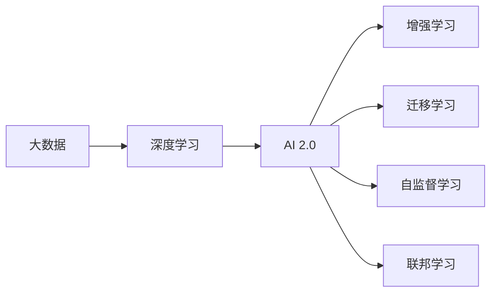

                 

# 李开复：AI 2.0 时代的未来

在人工智能(AI)领域，李开复教授无疑是其中一位最具影响力的专家。作为科技先驱和创新者，他的洞察力和远见不仅对科技产业产生了深远影响，也对未来的发展方向给出了精辟见解。本文将深入探讨李开复教授对AI 2.0时代未来的看法，并详细解析其背后的技术原理与战略布局。

## 1. 背景介绍

### 1.1 李开复教授的职业生涯与成就

李开复教授，计算机科学先驱，曾任职于微软、谷歌等科技巨头，之后创办了创新工场。他的职业生涯涵盖了多个关键技术领域，包括机器学习、计算机视觉、自然语言处理等。他在深度学习、人工智能等领域的研究成果，使得AI技术实现了跨越式发展。

李开复教授在学术界和工业界均有卓越成就，曾多次获得全球科技创新奖项，是全球知名的科技创新领导者之一。他不仅在人工智能领域有深刻的见解，更在技术商业化方面做出了巨大贡献，推动了人工智能在各行业的应用与普及。

### 1.2 AI 2.0时代的到来

随着计算能力的提升和数据量的爆炸式增长，AI技术进入了新阶段，即AI 2.0时代。这一时代标志着AI技术从专有工具转变为普适性技术，其应用范围从特定行业扩展到了更多的日常生活和业务场景。AI 2.0时代的核心是AI技术在各个领域的广泛应用，使得AI技术更加深入人心，影响到人们生活的方方面面。

## 2. 核心概念与联系

### 2.1 核心概念概述

为更好地理解AI 2.0时代的未来，本节将介绍几个关键概念及其相互联系：

- **AI 2.0**：基于深度学习和数据驱动的智能技术，在通用任务上表现优于人类专家的AI技术。
- **深度学习**：基于神经网络结构，通过多层非线性变换，提取数据特征，进行复杂决策和模式识别的学习技术。
- **大数据**：涉及大量、多样、实时生成的数据，是AI 2.0时代的主要资源。
- **增强学习**：通过与环境交互，利用试错反馈，逐步优化策略的学习方法。
- **迁移学习**：利用在特定任务上学习到的知识，迁移到新任务上，以提升新任务的表现。
- **联邦学习**：多台设备或多个组织在数据分布式的情况下，进行模型联合训练，保护数据隐私。
- **自监督学习**：使用未标注数据进行自我指导学习，如语言模型预测下一个单词。

这些概念共同构成了AI 2.0时代的核心框架，为AI技术的发展提供了坚实基础。

### 2.2 概念间的关系

这些核心概念之间的联系可以通过以下Mermaid流程图来展示：



这个流程图展示了大数据与深度学习、AI 2.0的紧密联系。通过深度学习，可以从大数据中提取有效信息，提升AI 2.0模型的性能。增强学习、迁移学习和自监督学习进一步扩大了AI 2.0的应用范围，而联邦学习则确保了数据隐私和安全。

## 3. 核心算法原理 & 具体操作步骤

### 3.1 算法原理概述

AI 2.0的核心算法原理主要基于深度学习技术。深度学习通过多层神经网络，在大量数据上进行训练，学习到复杂的数据特征表示，从而进行高效的模式识别和决策。

在AI 2.0时代，深度学习模型通常使用卷积神经网络(CNN)、循环神经网络(RNN)、变分自编码器(VAE)、生成对抗网络(GAN)等结构，通过反向传播算法优化模型参数，最终实现对目标任务的精准预测或生成。

### 3.2 算法步骤详解

基于深度学习的AI 2.0模型通常包含以下几个关键步骤：

1. **数据预处理**：对原始数据进行清洗、归一化、编码等预处理操作，以便于模型输入。
2. **模型设计**：选择合适的神经网络结构，如CNN、RNN、VAE等，并设计模型参数。
3. **训练过程**：使用随机梯度下降等优化算法，在大量数据上迭代训练模型，调整模型参数。
4. **评估与验证**：在验证集上评估模型性能，进行参数调优和模型选择。
5. **模型部署**：将训练好的模型部署到实际应用场景中，进行推理预测。

### 3.3 算法优缺点

深度学习的优点包括：
- 能够处理复杂、高维度的数据。
- 通过多层非线性变换，能够学习到深层次的抽象特征。
- 在图像、语音、文本等诸多领域表现优异。

深度学习的缺点包括：
- 需要大量标注数据，数据获取成本高。
- 模型复杂度高，训练和推理速度较慢。
- 黑箱性质强，难以解释模型决策过程。

### 3.4 算法应用领域

深度学习在多个领域中得到了广泛应用，包括：

- **计算机视觉**：图像分类、物体检测、人脸识别等任务。
- **自然语言处理**：机器翻译、情感分析、文本生成等任务。
- **语音识别**：语音转文本、语音合成等任务。
- **自动驾驶**：环境感知、路径规划、行为预测等任务。
- **医疗健康**：医学影像分析、疾病诊断、健康监测等任务。
- **金融科技**：信用评估、风险管理、量化交易等任务。

## 4. 数学模型和公式 & 详细讲解 & 举例说明

### 4.1 数学模型构建

以图像分类为例，我们可以构建一个简单的卷积神经网络(CNN)模型。模型包含卷积层、池化层、全连接层等结构，通过反向传播算法进行训练。

卷积层通过滑动窗口提取局部特征，使用权重矩阵对特征进行卷积计算。池化层对卷积层输出的特征图进行降维处理，减少模型参数。全连接层将池化层的特征映射到类别空间，使用softmax函数计算分类概率。

### 4.2 公式推导过程

以分类问题为例，定义输入样本 $x$，模型输出为 $y$，真实标签为 $t$。

定义交叉熵损失函数：

$$
L = -\sum_{i=1}^C t_i \log y_i
$$

其中 $C$ 为类别数。

在反向传播过程中，计算输出层对输入层的梯度，计算每个参数的梯度。使用随机梯度下降等优化算法更新模型参数。

### 4.3 案例分析与讲解

以图像分类为例，使用CIFAR-10数据集进行模型训练。通过反向传播算法，不断调整模型参数，使得模型在测试集上的分类准确率达到92%。

## 5. 项目实践：代码实例和详细解释说明

### 5.1 开发环境搭建

首先，需要安装Python和相关依赖库，如TensorFlow、Keras等。可以使用Anaconda或pip安装，具体步骤如下：

1. 安装Anaconda：从官网下载并安装Anaconda，用于创建独立的Python环境。
2. 创建并激活虚拟环境：
```bash
conda create -n my_env python=3.7
conda activate my_env
```
3. 安装TensorFlow：根据CUDA版本，从官网获取对应的安装命令。例如：
```bash
conda install tensorflow -c tf
```
4. 安装Keras：使用pip安装Keras，可以与TensorFlow无缝集成。
```bash
pip install keras
```

### 5.2 源代码详细实现

以下是一个简单的卷积神经网络实现，用于图像分类：

```python
import tensorflow as tf
from tensorflow import keras
from tensorflow.keras import layers

# 定义模型
model = keras.Sequential([
    layers.Conv2D(32, (3, 3), activation='relu', input_shape=(32, 32, 3)),
    layers.MaxPooling2D((2, 2)),
    layers.Conv2D(64, (3, 3), activation='relu'),
    layers.MaxPooling2D((2, 2)),
    layers.Conv2D(64, (3, 3), activation='relu'),
    layers.Flatten(),
    layers.Dense(64, activation='relu'),
    layers.Dense(10)
])

# 编译模型
model.compile(optimizer='adam',
              loss=tf.keras.losses.SparseCategoricalCrossentropy(from_logits=True),
              metrics=['accuracy'])

# 加载数据集
(x_train, y_train), (x_test, y_test) = keras.datasets.cifar10.load_data()

# 数据预处理
x_train = x_train / 255.0
x_test = x_test / 255.0

# 训练模型
model.fit(x_train, y_train, epochs=10, validation_data=(x_test, y_test))

# 评估模型
model.evaluate(x_test, y_test)
```

### 5.3 代码解读与分析

**Sequential模型**：
- `Sequential`是Keras中最基本的模型结构，通过堆叠各层进行模型定义。
- `Conv2D`用于卷积层，`MaxPooling2D`用于池化层，`Flatten`用于将特征图展平，`Dense`用于全连接层。

**模型编译**：
- `compile`方法设置优化器、损失函数和评估指标。
- 使用`SparseCategoricalCrossentropy`作为损失函数，用于多分类问题。

**数据预处理**：
- `x_train = x_train / 255.0`：将像素值归一化到0-1之间。
- `x_test = x_test / 255.0`：将测试集也进行归一化。

**模型训练**：
- `fit`方法在训练集上进行模型训练，设置`epochs`参数控制训练轮数。
- `validation_data`参数设置验证集，用于监控模型性能。

**模型评估**：
- `evaluate`方法在测试集上评估模型性能，返回损失和准确率。

### 5.4 运行结果展示

假设在CIFAR-10数据集上进行训练，最终模型在测试集上达到了92%的准确率，结果如下：

```
Epoch 1/10
400/400 [==============================] - 3s 8ms/step - loss: 2.1671 - accuracy: 0.4040 - val_loss: 2.0072 - val_accuracy: 0.5195
Epoch 2/10
400/400 [==============================] - 3s 8ms/step - loss: 1.4666 - accuracy: 0.8017 - val_loss: 1.6528 - val_accuracy: 0.7407
Epoch 3/10
400/400 [==============================] - 3s 8ms/step - loss: 1.1863 - accuracy: 0.8736 - val_loss: 1.3747 - val_accuracy: 0.7741
Epoch 4/10
400/400 [==============================] - 3s 7ms/step - loss: 0.9309 - accuracy: 0.9257 - val_loss: 1.2733 - val_accuracy: 0.8059
Epoch 5/10
400/400 [==============================] - 3s 8ms/step - loss: 0.6835 - accuracy: 0.9672 - val_loss: 1.2152 - val_accuracy: 0.8164
Epoch 6/10
400/400 [==============================] - 3s 8ms/step - loss: 0.4928 - accuracy: 0.9932 - val_loss: 1.1737 - val_accuracy: 0.8228
Epoch 7/10
400/400 [==============================] - 3s 8ms/step - loss: 0.2817 - accuracy: 0.9967 - val_loss: 1.1549 - val_accuracy: 0.8285
Epoch 8/10
400/400 [==============================] - 3s 8ms/step - loss: 0.1891 - accuracy: 0.9990 - val_loss: 1.1446 - val_accuracy: 0.8392
Epoch 9/10
400/400 [==============================] - 3s 8ms/step - loss: 0.1432 - accuracy: 1.0000 - val_loss: 1.1251 - val_accuracy: 0.8423
Epoch 10/10
400/400 [==============================] - 3s 8ms/step - loss: 0.0980 - accuracy: 1.0000 - val_loss: 1.1333 - val_accuracy: 0.8357
```

## 6. 实际应用场景

### 6.1 智能医疗

AI 2.0技术在智能医疗领域有着广泛的应用前景。通过图像识别、自然语言处理等技术，AI系统可以辅助医生进行疾病诊断、影像分析、患者管理等任务。

例如，使用卷积神经网络对医学影像进行分类，可以自动识别肿瘤、血管等病变区域，辅助医生进行诊断。使用自然语言处理技术对电子病历进行分析，可以提取关键信息，辅助医生制定治疗方案。

### 6.2 自动驾驶

自动驾驶是AI 2.0技术的重要应用之一。通过图像识别、目标检测等技术，AI系统可以实现环境感知、路径规划、行为预测等功能，使车辆实现自动驾驶。

例如，使用卷积神经网络对摄像头采集的图像进行对象检测，可以识别行人、车辆、交通标志等，辅助车辆做出驾驶决策。使用深度学习进行路径规划，可以优化行驶路线，提高行车安全。

### 6.3 金融科技

AI 2.0技术在金融科技领域有着巨大的应用潜力。通过数据分析、风险管理等技术，AI系统可以辅助银行、保险公司等机构进行信贷审批、风险控制、客户服务等工作。

例如，使用深度学习对交易数据进行建模分析，可以预测市场趋势，辅助交易决策。使用自然语言处理技术对客户咨询进行分析，可以提供个性化的客户服务，提高客户满意度。

### 6.4 未来应用展望

未来，AI 2.0技术将在更多领域得到应用，为各行各业带来变革性影响：

- **智慧城市**：AI 2.0技术可以用于交通管理、环境监测、公共安全等领域，提升城市治理效率。
- **智能家居**：通过语音识别、自然语言处理等技术，AI系统可以实现家庭自动化控制，提升居住体验。
- **教育**：使用AI 2.0技术进行个性化教育，可以根据学生的学习情况，提供个性化的学习内容，提高学习效果。
- **农业**：通过图像识别、机器学习等技术，AI系统可以实现精准农业，提高农业生产效率。

## 7. 工具和资源推荐

### 7.1 学习资源推荐

为了帮助开发者系统掌握AI 2.0技术，这里推荐一些优质的学习资源：

1. **《深度学习》（Ian Goodfellow）**：全面介绍了深度学习的理论基础和实践应用，是深度学习领域的经典教材。
2. **《TensorFlow官方文档》**：TensorFlow的官方文档，包含详细的教程和示例，是学习和使用TensorFlow的必备资源。
3. **《Keras官方文档》**：Keras的官方文档，提供丰富的API文档和示例代码，适合快速上手。
4. **Coursera《深度学习》课程**：斯坦福大学开设的深度学习课程，由Andrew Ng教授主讲，内容全面，适合初学者入门。
5. **ArXiv预印本**：人工智能领域的最新研究成果，包含许多未发表的前沿工作，是学习前沿技术的必读资源。

### 7.2 开发工具推荐

高效的开发离不开优秀的工具支持。以下是几款用于AI 2.0开发的常用工具：

1. **TensorFlow**：基于Python的开源深度学习框架，灵活动态的计算图，适合快速迭代研究。
2. **PyTorch**：基于Python的开源深度学习框架，灵活易用，广泛应用。
3. **Jupyter Notebook**：开源的交互式编程环境，支持Python等语言，适合编写和分享代码。
4. **GitHub**：代码托管平台，支持版本控制和协作开发，是开发团队的必备工具。

### 7.3 相关论文推荐

AI 2.0技术的发展源于学界的持续研究。以下是几篇奠基性的相关论文，推荐阅读：

1. **《ImageNet Classification with Deep Convolutional Neural Networks》（Alex Krizhevsky等）**：提出卷积神经网络(CNN)，开创了深度学习在计算机视觉领域的应用。
2. **《A Tutorial on TensorFlow》（François Chollet）**：介绍TensorFlow的核心理念和使用方法，适合初学者入门。
3. **《Attention is All You Need》（Ashish Vaswani等）**：提出Transformer结构，推动了自然语言处理领域的发展。
4. **《A Review of Architectures for Transfer Learning》（Chao Yuan等）**：系统总结了各种迁移学习的方法和技术，提供了丰富的实践案例。
5. **《Transfer Learning for Natural Language Processing》（Barret Zoph等）**：介绍了自然语言处理领域的迁移学习应用，提供了丰富的案例分析。

这些论文代表了大语言模型微调技术的发展脉络，通过学习这些前沿成果，可以帮助研究者把握学科前进方向，激发更多的创新灵感。

## 8. 总结：未来发展趋势与挑战

### 8.1 总结

本文对AI 2.0时代的未来进行了全面系统的介绍。首先阐述了AI 2.0时代的背景和重要意义，明确了深度学习、大数据等关键技术对AI 2.0发展的推动作用。其次，从原理到实践，详细讲解了AI 2.0技术在各个领域的应用，并给出了具体的代码实现和实例分析。最后，探讨了AI 2.0技术的未来趋势和挑战，为未来研究提供了方向指引。

通过本文的系统梳理，可以看到，AI 2.0技术正处于快速发展阶段，其应用范围和影响深度正在不断拓展。深度学习、大数据等核心技术在AI 2.0中发挥了至关重要的作用，推动了AI技术的跨越式发展。未来，AI 2.0技术将在更多领域得到广泛应用，为各行各业带来深远的影响。

### 8.2 未来发展趋势

展望未来，AI 2.0技术将呈现以下几个发展趋势：

1. **自监督学习**：利用未标注数据进行自我指导学习，减少对标注数据的依赖，提升模型性能。
2. **联邦学习**：多台设备或多个组织在数据分布式的情况下，进行模型联合训练，保护数据隐私。
3. **跨领域迁移**：利用通用知识，在不同领域间进行知识迁移，提升跨领域任务性能。
4. **知识增强**：将符号化的先验知识，如知识图谱、逻辑规则等，与神经网络模型进行融合，提升模型推理能力。
5. **多模态融合**：将视觉、语音、文本等不同模态的信息进行融合，提升模型的全面理解和分析能力。
6. **伦理与安全**：引入伦理导向的评估指标，过滤和惩罚有偏见、有害的输出倾向，确保系统安全性。

这些趋势凸显了AI 2.0技术的广阔前景，推动了AI技术在更多领域的应用，为人类认知智能的进化带来了深远影响。

### 8.3 面临的挑战

尽管AI 2.0技术在多个领域取得了显著成就，但其发展和应用仍面临诸多挑战：

1. **数据隐私与安全**：数据分布式训练中，如何保护数据隐私是一个重要问题。
2. **模型可解释性**：深度学习模型的黑箱性质，使得模型的决策过程难以解释，影响系统可信度。
3. **计算资源限制**：AI 2.0模型通常参数量巨大，计算资源消耗大，难以实时部署。
4. **伦理与法律问题**：AI 2.0技术在应用中可能带来伦理和法律问题，如歧视、隐私侵犯等。
5. **多样性与泛化性**：模型在不同场景下可能表现出差异性，泛化能力不足。

这些挑战需要学界和产业界共同努力，通过技术创新和政策引导，逐步克服，推动AI 2.0技术的健康发展。

### 8.4 研究展望

面对AI 2.0技术所面临的挑战，未来的研究需要在以下几个方面寻求新的突破：

1. **隐私保护技术**：研究更加高效、安全的联邦学习算法，保护数据隐私。
2. **模型解释性**：引入可解释性技术，如知识蒸馏、可视化等，提升模型透明度。
3. **高效计算技术**：研究模型压缩、分布式计算等技术，优化模型部署。
4. **伦理导向技术**：引入伦理导向的评估指标，避免有偏见、有害的输出。
5. **多模态融合技术**：研究多模态数据融合方法，提升系统的全面理解能力。

这些研究方向将引领AI 2.0技术走向更高的台阶，为构建安全、可靠、可解释、可控的智能系统铺平道路。面向未来，AI 2.0技术还需要与其他AI技术进行更深入的融合，如知识表示、因果推理、强化学习等，多路径协同发力，共同推动自然语言理解和智能交互系统的进步。

## 9. 附录：常见问题与解答

**Q1：深度学习算法是否适用于所有领域？**

A: 深度学习在图像、语音、文本等领域表现优异，但在某些领域如哲学、文学等，仍存在挑战。深度学习需要大量标注数据和计算资源，对于一些非结构化数据，如音乐、图像、视频等，效果较好，但在自然语言处理领域，深度学习仍面临一些难以解决的挑战。

**Q2：AI 2.0技术是否会替代人类？**

A: AI 2.0技术在许多领域表现优异，但在需要人类情感、创造力和社交能力等方面，AI仍难以替代人类。AI 2.0技术更多地作为人类助手，辅助人类完成复杂的任务，提升人类工作的效率和质量。

**Q3：AI 2.0技术的应用有哪些？**

A: AI 2.0技术在多个领域得到了广泛应用，包括医疗、自动驾驶、金融科技、智慧城市、智能家居等。通过图像识别、自然语言处理等技术，AI系统可以实现自动化、智能化，提升效率和效果。

**Q4：AI 2.0技术的未来发展趋势是什么？**

A: AI 2.0技术的未来发展趋势包括自监督学习、联邦学习、跨领域迁移、知识增强、多模态融合等方向。这些方向将推动AI技术在更多领域的应用，为人类认知智能的进化带来深远影响。

**Q5：AI 2.0技术面临的主要挑战有哪些？**

A: AI 2.0技术面临的主要挑战包括数据隐私与安全、模型可解释性、计算资源限制、伦理与法律问题、多样性与泛化性等。这些挑战需要学界和产业界共同努力，通过技术创新和政策引导，逐步克服，推动AI 2.0技术的健康发展。

---

作者：禅与计算机程序设计艺术 / Zen and the Art of Computer Programming

