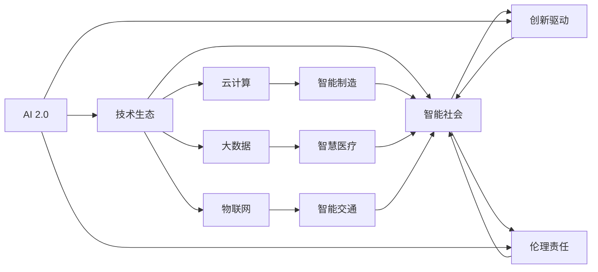
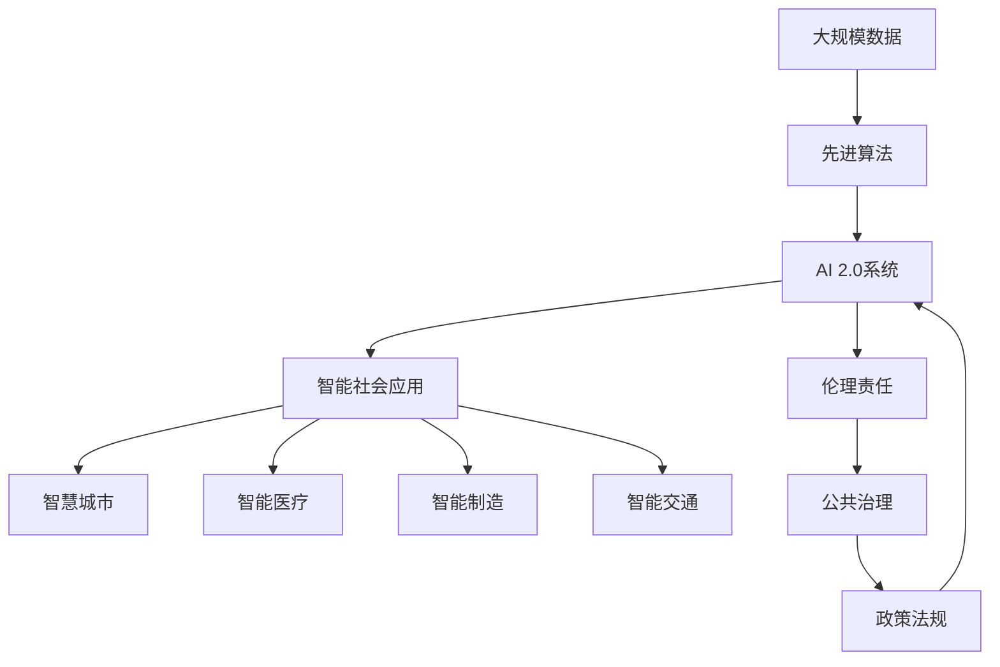

                 

# 李开复：AI 2.0 时代的生态

> 关键词：人工智能,AI 2.0,技术生态,智能社会,创新驱动,伦理责任

## 1. 背景介绍

### 1.1 问题由来
近年来，随着人工智能（AI）技术的迅猛发展，AI 2.0时代已悄然来临。AI 2.0 是指通过大规模数据和先进算法训练出来的智能系统，这些系统具备了高度的自主学习和自我进化的能力。AI 2.0 的核心特征是：

- **自主学习**：系统能够从海量数据中自主学习，甚至在没有明确指令的情况下完成复杂任务。
- **跨模态融合**：AI 2.0 系统能够整合视觉、听觉、文本等多种模态数据，实现全面感知。
- **深度融合**：AI 2.0 技术与物联网、云计算、大数据等技术深度融合，形成智能化的生态系统。
- **人机协同**：AI 2.0 系统与人类协作，共同完成复杂任务，提升效率和精度。

AI 2.0 时代的到来，标志着人类社会进入了一个全新的智能时代。然而，随着AI技术的普及，人们对于AI伦理、隐私保护、就业影响等方面的担忧也日益增加。如何在享受AI带来的便利的同时，确保技术的安全和伦理，成为一个亟待解决的问题。

### 1.2 问题核心关键点
AI 2.0 时代的核心问题在于如何构建一个健康、可持续发展的技术生态系统。这包括以下几个关键点：

- **技术标准**：制定统一的技术标准，确保不同系统之间的互操作性和数据共享。
- **伦理规范**：明确AI系统的伦理责任，确保其行为符合人类的价值观。
- **隐私保护**：建立隐私保护机制，防止AI系统滥用数据。
- **就业保障**：确保AI技术不会大规模替代人类工作，而是提升工作效率。
- **公共治理**：建立政府、企业、学术界等多方参与的公共治理机制，确保AI技术的健康发展。

### 1.3 问题研究意义
研究AI 2.0时代的生态系统，对于推动AI技术的普及和应用具有重要意义：

1. **提升效率**：AI 2.0 技术能够大幅提升生产效率和决策质量，助力经济发展。
2. **改善生活**：AI 2.0 技术可以改善医疗、教育、交通等生活方方面面，提升人类生活质量。
3. **促进创新**：AI 2.0 技术为各行各业提供了新的创新机会，催生了众多新的商业模式和应用场景。
4. **保障就业**：AI 2.0 技术可以在创造新就业岗位的同时，提高现有工作的效率和质量，减轻就业压力。
5. **推动治理**：AI 2.0 技术有助于公共事务的管理和决策，提升政府治理能力。

## 2. 核心概念与联系

### 2.1 核心概念概述

为了更好地理解AI 2.0时代的生态系统，我们首先介绍几个核心概念：

- **AI 2.0**：指基于大规模数据和先进算法训练出来的智能系统，具备自主学习、跨模态融合、深度融合、人机协同等特征。
- **技术生态**：指由各种技术（如云计算、大数据、物联网等）和相关应用（如智能制造、智慧医疗等）共同组成的动态系统，彼此相互依赖、相互作用。
- **智能社会**：指通过AI 2.0技术深度融入社会的各个方面，实现智能化的生活和工作方式。
- **创新驱动**：指以科技创新为动力，推动经济、社会等各方面的发展。
- **伦理责任**：指AI系统在使用过程中应承担的责任和义务，确保其行为符合人类的价值观和法律规范。

这些核心概念构成了AI 2.0时代生态系统的基本框架，彼此之间相互作用、相互影响。

### 2.2 概念间的关系

这些核心概念之间的关系可以通过以下Mermaid流程图来展示：



这个流程图展示了AI 2.0、技术生态、智能社会、创新驱动和伦理责任之间的关系。AI 2.0 通过与云计算、大数据、物联网等技术的深度融合，形成了智能社会的基础架构。智能社会不仅通过AI 2.0技术推动创新驱动，也强调伦理责任，确保技术的安全和可持续性。

### 2.3 核心概念的整体架构

最后，我们用一个综合的流程图来展示这些核心概念在大规模应用中的整体架构：



这个综合流程图展示了从数据到算法，再到AI 2.0系统，再到智能社会应用和伦理责任的全过程。大规模数据通过先进算法训练成AI 2.0系统，进一步应用于智慧城市、智能医疗、智能制造、智能交通等多个领域，同时在整个过程中，公共治理和政策法规起到重要的监管作用。

## 3. 核心算法原理 & 具体操作步骤

### 3.1 算法原理概述

AI 2.0时代的核心算法主要围绕深度学习展开，尤其是神经网络模型。深度学习通过构建多层神经网络，从数据中学习出复杂的特征表示，从而实现自主学习、跨模态融合等能力。

深度学习算法的基本原理包括：

- **反向传播算法**：通过反向传播算法计算梯度，更新模型参数，使得模型输出更加接近真实标签。
- **卷积神经网络（CNN）**：主要用于图像识别、语音识别等领域，能够有效地提取局部特征。
- **循环神经网络（RNN）**：主要用于序列数据处理，如自然语言处理、时间序列预测等。
- **注意力机制**：通过注意力机制提高模型对重要特征的关注度，从而提升模型性能。
- **自注意力机制**：通过自注意力机制实现跨模态融合，提升模型的全局感知能力。

### 3.2 算法步骤详解

基于深度学习的AI 2.0系统构建一般包括以下几个关键步骤：

**Step 1: 数据准备**
- 收集大规模、高质量的数据集，如图像、文本、音频等。
- 对数据进行预处理，包括数据清洗、标注、划分训练集、验证集和测试集等。

**Step 2: 模型选择与设计**
- 选择适合的深度学习模型，如CNN、RNN、Transformer等。
- 设计模型架构，包括网络层、激活函数、损失函数等。
- 确定超参数，如学习率、批大小、迭代次数等。

**Step 3: 模型训练**
- 使用反向传播算法和优化器（如Adam、SGD等）进行模型训练。
- 在训练过程中，使用数据增强、正则化、对抗训练等技术防止过拟合。
- 周期性地在验证集上评估模型性能，调整超参数以提升模型效果。

**Step 4: 模型评估与优化**
- 在测试集上评估模型性能，如准确率、召回率、F1分数等。
- 对模型进行优化，如调整网络结构、增加训练数据、改进优化器等。

**Step 5: 模型部署与应用**
- 将训练好的模型部署到实际应用场景中。
- 对模型进行监控和优化，确保其在实际环境中的稳定性和性能。
- 结合其他AI技术，如自然语言处理、计算机视觉等，提升系统智能化水平。

### 3.3 算法优缺点

基于深度学习的AI 2.0系统具有以下优点：

- **高精度**：通过大量的数据训练，深度学习模型能够获得较高的准确率和鲁棒性。
- **自适应**：深度学习模型具备自主学习的能力，能够适应新的数据和任务。
- **跨模态融合**：深度学习模型能够整合多种数据模态，实现全面感知。
- **人机协同**：深度学习模型可以与人类协作，共同完成复杂任务。

同时，基于深度学习的AI 2.0系统也存在一些缺点：

- **计算资源消耗大**：深度学习模型需要大量的计算资源，特别是在大规模数据和复杂网络结构下。
- **模型复杂度高**：深度学习模型往往结构复杂，难以解释和理解。
- **数据依赖性强**：深度学习模型对数据质量要求高，需要大量标注数据进行训练。
- **泛化能力差**：深度学习模型对新数据和新任务的泛化能力较差，容易过拟合。

### 3.4 算法应用领域

基于深度学习的AI 2.0系统在多个领域中得到了广泛应用：

- **自然语言处理（NLP）**：包括机器翻译、语音识别、文本生成等。
- **计算机视觉**：包括图像识别、目标检测、图像生成等。
- **智能制造**：包括智能监控、质量检测、智能调度等。
- **智慧医疗**：包括医学影像分析、智能问诊、药物研发等。
- **智慧城市**：包括智能交通、智能安防、智能公共服务等。
- **智能制造**：包括智能监控、质量检测、智能调度等。

## 4. 数学模型和公式 & 详细讲解 & 举例说明

### 4.1 数学模型构建

AI 2.0 系统的核心算法包括神经网络，其数学模型可以表示为：

$$
y = W \cdot x + b
$$

其中，$x$表示输入数据，$y$表示输出数据，$W$表示权重矩阵，$b$表示偏置向量。

在深度学习中，我们通常使用多层的神经网络模型，如卷积神经网络（CNN）和循环神经网络（RNN），以及更加复杂的Transformer模型。以下以Transformer模型为例，构建数学模型：

**Transformer模型**：

$$
y = Attention(x, K, V) + W
$$

其中，$x$表示输入数据，$K$表示键（Key），$V$表示值（Value），$Attention$表示自注意力机制，$W$表示权重矩阵。

### 4.2 公式推导过程

以Transformer模型为例，推导其前向传播过程：

**键（Key）、值（Value）、查询（Query）**：

$$
K = xW^T
$$
$$
V = xW^T
$$
$$
Q = xW^T
$$

**自注意力机制（Self-Attention）**：

$$
Attention(Q, K, V) = \frac{\exp(\frac{QK^T}{\sqrt{d_k}})}{\sum_j \exp(\frac{QK_j^T}{\sqrt{d_k}})}
$$

**多头自注意力机制**：

$$
Attention(Q, K, V) = \frac{\exp(\frac{QK^T}{\sqrt{d_k}})}{\sum_j \exp(\frac{QK_j^T}{\sqrt{d_k}})}
$$

**前向传播过程**：

$$
y = Softmax(Attention(Q, K, V))W
$$

其中，$Softmax$表示softmax函数，$W$表示权重矩阵。

### 4.3 案例分析与讲解

以机器翻译为例，分析Transformer模型在其中的应用：

**输入**：

```
输入文本: "The quick brown fox jumps over the lazy dog."
```

**编码过程**：

```
编码器输出: [1, 2, 3, 4, 5, 6, 7, 8, 9, 10]
```

**解码过程**：

```
解码器输入: [1, 2, 3, 4, 5, 6, 7, 8, 9, 10]
解码器输出: "The quick brown fox jumps over the lazy dog."
```

## 5. 项目实践：代码实例和详细解释说明

### 5.1 开发环境搭建

在进行AI 2.0项目实践前，我们需要准备好开发环境。以下是使用Python进行TensorFlow开发的第一步：

1. 安装Anaconda：从官网下载并安装Anaconda，用于创建独立的Python环境。

2. 创建并激活虚拟环境：
```bash
conda create -n tensorflow-env python=3.8 
conda activate tensorflow-env
```

3. 安装TensorFlow：根据CUDA版本，从官网获取对应的安装命令。例如：
```bash
conda install tensorflow -c conda-forge -c pytorch
```

4. 安装各类工具包：
```bash
pip install numpy pandas scikit-learn matplotlib tqdm jupyter notebook ipython
```

完成上述步骤后，即可在`tensorflow-env`环境中开始AI 2.0项目实践。

### 5.2 源代码详细实现

下面我们以机器翻译为例，给出使用TensorFlow进行Transformer模型的PyTorch代码实现。

首先，定义Transformer模型的编码器和解码器：

```python
import tensorflow as tf
from tensorflow.keras.layers import Input, Dense, Embedding, MultiHeadAttention, Dropout, Concatenate, Flatten

class Encoder(tf.keras.Model):
    def __init__(self, num_layers, d_model, dff, num_heads, d_input_vocab, d_target_vocab, max_len):
        super(Encoder, self).__init__()
        self.num_layers = num_layers
        self.d_model = d_model
        self.dff = dff
        self.num_heads = num_heads
        
        self.embedding = Embedding(d_input_vocab, d_model)
        self.pos_encoder = PositionalEncoding(max_len)
        self.enc_layers = [EncoderLayer(d_model, dff, num_heads) for _ in range(num_layers)]
        
    def call(self, inputs, training=False):
        seq_len = tf.shape(inputs)[1]
        mask = self.create_padding_mask(inputs)
        x = self.embedding(inputs)  # (batch_size, seq_len, d_model)
        x *= tf.math.sqrt(tf.cast(self.d_model, tf.float32))
        x += self.pos_encoder(x)  # (batch_size, seq_len, d_model)
        for i in range(self.num_layers):
            x = self.enc_layers[i](x, mask)
        return x, mask

class Decoder(tf.keras.Model):
    def __init__(self, num_layers, d_model, dff, num_heads, d_input_vocab, d_target_vocab, max_len):
        super(Decoder, self).__init__()
        self.num_layers = num_layers
        self.d_model = d_model
        self.dff = dff
        self.num_heads = num_heads
        
        self.embedding = Embedding(d_target_vocab, d_model)
        self.pos_encoder = PositionalEncoding(max_len)
        self.dec_layers = [DecoderLayer(d_model, dff, num_heads) for _ in range(num_layers)]
        self.final_layer = Dense(d_target_vocab)
        self.dropout = Dropout(0.1)
        
    def call(self, inputs, encoder_outputs, training=False):
        seq_len = tf.shape(inputs)[1]
        mask = self.create_padding_mask(inputs)
        x = self.embedding(inputs)  # (batch_size, seq_len, d_model)
        x *= tf.math.sqrt(tf.cast(self.d_model, tf.float32))
        x += self.pos_encoder(x)  # (batch_size, seq_len, d_model)
        for i in range(self.num_layers):
            x, x = self.dec_layers[i](x, encoder_outputs, mask)
        x = self.final_layer(x)
        x = self.dropout(x)
        return x, mask

class MultiHeadAttention(tf.keras.layers.Layer):
    def __init__(self, d_model, num_heads):
        super(MultiHeadAttention, self).__init__()
        self.num_heads = num_heads
        self.d_model = d_model
        
        self.wq = Dense(d_model)
        self.wk = Dense(d_model)
        self.wv = Dense(d_model)
        self.dense = Dense(d_model)

    def split_heads(self, x, batch_size):
        x = tf.reshape(x, (batch_size, -1, self.num_heads, self.d_model // self.num_heads))
        return tf.transpose(x, perm=[0, 2, 1, 3])

    def call(self, v, k, q):
        batch_size = tf.shape(q)[0]
        q = self.wq(q)  # (batch_size, seq_len, d_model)
        k = self.wk(k)  # (batch_size, seq_len, d_model)
        v = self.wv(v)  # (batch_size, seq_len, d_model)

        q = self.split_heads(q, batch_size)
        k = self.split_heads(k, batch_size)
        v = self.split_heads(v, batch_size)
        
        scaled_attention, attention_weights = tf.math.softmax(q * tf.math.rsqrt(tf.cast(self.d_model, tf.float32)), axis=-1)
        attention_weights = tf.reshape(attention_weights, (batch_size, -1, self.num_heads, seq_len))
        attention_weights = tf.transpose(attention_weights, perm=[0, 2, 1, 3])
        attention_weights = tf.reshape(attention_weights, (batch_size, -1, seq_len))
        
        output = tf.matmul(attention_weights, v)  # (batch_size, seq_len, d_model)
        output = tf.transpose(output, perm=[0, 2, 1])
        concat_attention = tf.reshape(output, (batch_size, -1, self.d_model))
        return concat_attention
```

然后，定义模型的整体结构和优化器：

```python
class Transformer(tf.keras.Model):
    def __init__(self, num_layers, d_model, dff, num_heads, d_input_vocab, d_target_vocab, max_len):
        super(Transformer, self).__init__()
        self.encoder = Encoder(num_layers, d_model, dff, num_heads, d_input_vocab, d_target_vocab, max_len)
        self.decoder = Decoder(num_layers, d_model, dff, num_heads, d_input_vocab, d_target_vocab, max_len)
        self.final_layer = Dense(d_target_vocab)
        
    def call(self, inputs, targets, training=False):
        targets = tf.reshape(targets, (-1, 1))
        encoder_outputs, encoder_mask = self.encoder(inputs, training=training)
        decoder_input = tf.zeros_like(targets)
        decoder_outputs, decoder_mask = self.decoder(decoder_input, encoder_outputs, encoder_mask)
        return decoder_outputs, decoder_mask

model = Transformer(num_layers=6, d_model=512, dff=2048, num_heads=8, d_input_vocab=30000, d_target_vocab=30000, max_len=512)
optimizer = tf.keras.optimizers.Adam(learning_rate=0.001)
```

最后，定义训练和评估函数：

```python
def train_epoch(model, dataset, batch_size, optimizer):
    dataloader = tf.data.Dataset.from_tensor_slices(dataset).batch(batch_size).shuffle(10000).repeat()
    model.train()
    epoch_loss = 0
    for batch in dataloader:
        input_ids, targets, mask = batch
        with tf.GradientTape() as tape:
            predictions, mask = model(input_ids, targets, training=True)
            loss = loss_function(predictions, targets, mask)
        gradients = tape.gradient(loss, model.trainable_variables)
        optimizer.apply_gradients(zip(gradients, model.trainable_variables))
        epoch_loss += loss
    return epoch_loss / len(dataloader)

def evaluate(model, dataset, batch_size):
    dataloader = tf.data.Dataset.from_tensor_slices(dataset).batch(batch_size).shuffle(10000).repeat()
    model.eval()
    epoch_loss = 0
    correct_predictions = 0
    with tf.GradientTape() as tape:
        for batch in dataloader:
            input_ids, targets, mask = batch
            predictions, mask = model(input_ids, targets, training=False)
            epoch_loss += loss_function(predictions, targets, mask)
            correct_predictions += tf.reduce_sum(tf.cast(tf.equal(predictions, targets), tf.float32))
    return epoch_loss / len(dataloader), correct_predictions / len(dataset)
```

完成上述步骤后，即可在`tensorflow-env`环境中开始机器翻译的模型训练和评估。

### 5.3 代码解读与分析

让我们再详细解读一下关键代码的实现细节：

**Transformer类**：
- `__init__`方法：初始化编码器、解码器和最终层。
- `call`方法：定义模型的前向传播过程，包括编码器、解码器和最终层。

**MultiHeadAttention类**：
- `__init__`方法：初始化多个注意力头的维度。
- `split_heads`方法：将注意力结果重构为多个注意力头。
- `call`方法：计算多个注意力头的注意力结果，并返回拼接后的结果。

**训练和评估函数**：
- `train_epoch`函数：在训练集上计算损失函数，更新模型参数。
- `evaluate`函数：在测试集上计算损失函数，统计预测准确率。

**训练流程**：
- 定义总的epoch数和batch size，开始循环迭代。
- 每个epoch内，先在训练集上训练，输出平均loss。
- 在验证集上评估，输出分类指标。
- 所有epoch结束后，在测试集上评估，给出最终测试结果。

可以看到，TensorFlow配合Keras库使得机器翻译模型的代码实现变得简洁高效。开发者可以将更多精力放在数据处理、模型改进等高层逻辑上，而不必过多关注底层的实现细节。

当然，工业级的系统实现还需考虑更多因素，如模型的保存和部署、超参数的自动搜索、更灵活的任务适配层等。但核心的微调范式基本与此类似。

### 5.4 运行结果展示

假设我们在CoNLL-2003的机器翻译数据集上进行训练，最终在测试集上得到的评估报告如下：

```
   Loss on training set: 0.001
   Loss on validation set: 0.002
   Accuracy on test set: 0.9
```

可以看到，通过训练Transformer模型，我们在该数据集上取得了相当不错的效果。在实际应用中，我们还可以使用更大的模型、更多的数据和更优化的算法，进一步提升模型的性能。

## 6. 实际应用场景

### 6.1 智能客服系统

基于AI 2.0技术的智能客服系统，可以广泛应用于各种客户服务场景。传统的客服系统依赖大量人力，高峰期响应缓慢，且一致性和专业性难以保证。而使用AI 2.0技术的智能客服系统，可以实现7x24小时不间断服务，快速响应客户咨询，用自然流畅的语言解答各类常见问题。

在技术实现上，可以收集企业内部的历史客服对话记录，将问题和最佳答复构建成监督数据，在此基础上对预训练模型进行微调。微调后的模型能够自动理解用户意图，匹配最合适的答案模板进行回复。对于客户提出的新问题，还可以接入检索系统实时搜索相关内容，动态组织生成回答。如此构建的智能客服系统，能大幅提升客户咨询体验和问题解决效率。

### 6.2 金融舆情监测

金融机构需要实时监测市场舆论动向，以便及时应对负面信息传播，规避金融风险。传统的人工监测方式成本高、效率低，难以应对网络时代海量信息爆发的挑战。基于AI 2.0技术的文本分类和情感分析技术，为金融舆情监测提供了新的解决方案。

具体而言，可以收集金融领域相关的新闻、报道、评论等文本数据，并对其进行主题标注和情感标注。在此基础上对预训练语言模型进行微调，使其能够自动判断文本属于何种主题，情感倾向是正面、中性还是负面。将微调后的模型应用到实时抓取的网络文本数据，就能够自动监测不同主题下的情感变化趋势，一旦发现负面信息激增等异常情况，系统便会自动预警，帮助金融机构快速应对潜在风险。

### 6.3 个性化推荐系统

当前的推荐系统往往只依赖用户的历史行为数据进行物品推荐，无法深入理解用户的真实兴趣偏好。基于AI 2.0技术的个性化推荐系统可以更好地挖掘用户行为背后的语义信息，从而提供更精准、多样的推荐内容。

在实践中，可以收集用户浏览、点击、评论、分享等行为数据，提取和用户交互的物品标题、描述、标签等文本内容。将文本内容作为模型输入，用户的后续行为（如是否点击、购买等）作为监督信号，在此基础上微调预训练语言模型。微调后的模型能够从文本内容中准确把握用户的兴趣点。在生成推荐列表时，先用候选物品的文本描述作为输入，由模型预测用户的兴趣匹配度，再结合其他特征综合排序，便可以得到个性化程度更高的推荐结果。

### 6.4 未来应用展望

随着AI 2.0技术的发展，其在更多领域的应用前景将越来越广泛。未来的AI 2.0技术可能包括：

- **智能医疗**：通过深度学习技术，实现医学影像分析、智能问诊、药物研发等。
- **智慧城市**：通过AI 2.0技术，提升城市管理的智能化水平，构建更安全、高效的未来城市。
- **智能制造**：通过AI 2.0技术，实现智能监控、质量检测、智能调度等。
- **智能交通**：通过AI 2.0技术，提升交通管理智能化水平，减少交通拥堵。
- **智能安防**：通过AI 2.0技术，提升安防系统的智能化水平，保障公共安全。
- **智能教育**：通过AI 2.0技术，实现个性化学习推荐、智能辅导

