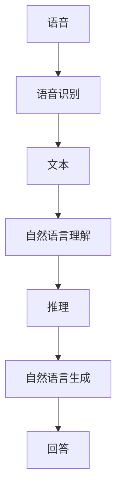
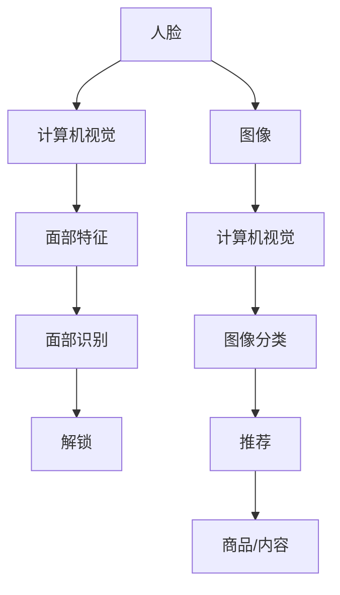
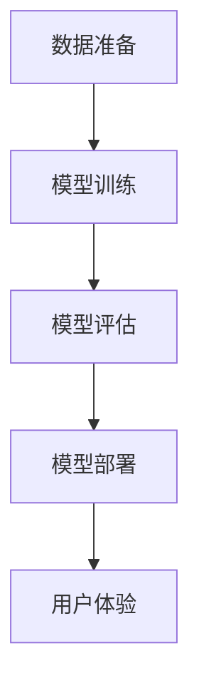
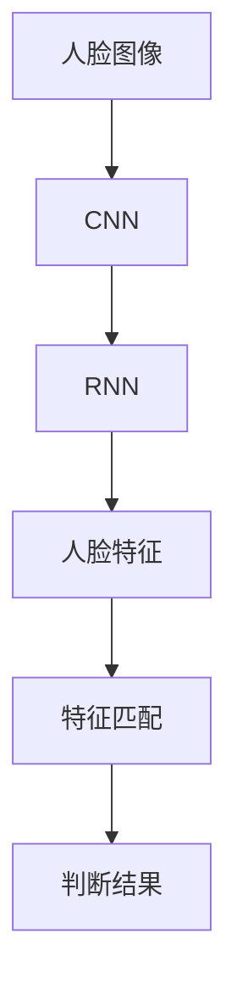
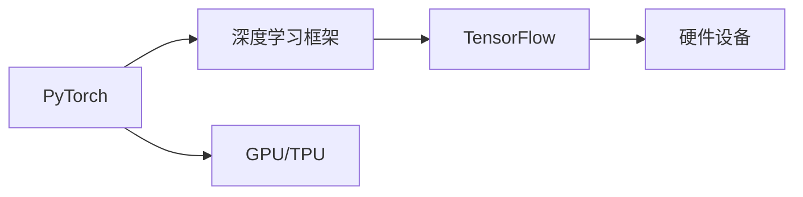

                 

# 李开复：苹果发布AI应用的价值

在人工智能(AI)技术迅猛发展的今天，各大科技公司纷纷推出各自的AI应用，争夺市场份额。其中，苹果公司(Appl)作为全球知名的电子产品制造商，近期发布了多款具有AI功能的软件应用，引发了业界的广泛关注。本文将从AI应用的价值、技术原理、实际应用以及面临的挑战等角度，全面剖析苹果公司AI应用的发布和应用情况，为读者提供深入的视角和思考。

## 1. 背景介绍

### 1.1 苹果公司AI应用的发布背景

苹果公司一直以来以硬件和操作系统闻名于世，但近年来也开始在AI领域发力，发布了多款具有AI功能的软件应用。这些应用涵盖自然语言处理(NLP)、计算机视觉(CV)、智能推荐等多个领域，旨在提升用户体验，增强产品竞争力。例如：

- **Siri**：苹果的语音助手，通过自然语言理解和自然语言生成(NLG)技术，能够理解用户指令并给出准确回应。
- **Face ID**：利用深度学习技术，识别用户面部特征，实现快速安全解锁。
- **iPhoto**：智能相册，通过图像识别和分类技术，自动整理用户拍摄的照片，提供个性化推荐。

这些应用的成功发布，体现了苹果公司在AI领域的积极布局和深远战略。

### 1.2 苹果公司AI应用的现状

苹果公司在AI应用方面已经积累了丰富的经验和技术储备，其AI应用覆盖了语音、视觉、推荐等多个方面，并在用户体验、安全性、智能化等方面进行了深入优化。例如：

- **Siri**：自2007年发布以来，经过多次更新，已经成为集成了语音识别、自然语言理解、上下文感知等多种AI技术于一体的智能助手，支持多语言和多设备的跨平台使用。
- **Face ID**：自2017年发布以来，Face ID已经广泛应用于iPhone、iPad等多个产品上，支持快速解锁、支付等功能，安全性得到广泛认可。
- **iPhoto**：自2018年发布以来，iPhoto通过图像识别技术，实现了智能照片分类、自动生成相册等功能，为用户提供了个性化和便捷的用户体验。

这些应用的成功部署，展示了苹果在AI领域的强大实力，也为其后续产品的智能化升级奠定了坚实基础。

## 2. 核心概念与联系

### 2.1 核心概念概述

要深入理解苹果公司的AI应用，首先需要明确几个核心概念：

- **自然语言处理(NLP)**：通过计算机理解、处理和生成自然语言的技术，广泛应用于语音助手、文本分析等场景。
- **计算机视觉(CV)**：通过计算机视觉算法，实现对图像和视频的分析和处理，广泛应用于面部识别、图像分类等场景。
- **智能推荐**：通过数据分析和机器学习算法，对用户行为进行分析和预测，提供个性化推荐，广泛应用于电商、内容分发等场景。

这些概念构成了苹果AI应用的基础，也是其核心价值所在。

### 2.2 核心概念之间的联系

苹果公司的AI应用紧密结合了NLP、CV和智能推荐等技术，形成了一个完整的AI生态系统。各技术之间相互协同，共同提升了用户体验和产品竞争力。

以Siri为例，其工作流程如图1所示。用户输入语音指令后，Siri利用语音识别技术将语音转换为文本，接着利用自然语言理解技术解析文本，结合上下文进行推理，最后通过自然语言生成技术生成回答。整个流程涉及语音、文本、语义等多个层面，展示了NLP技术的强大能力。



此外，苹果的AI应用还利用了CV技术进行面部识别和图像分类，智能推荐技术提供个性化推荐，这些技术的应用如图2所示。



这些技术的应用，不仅提升了用户体验，还为苹果带来了显著的市场竞争力。

## 3. 核心算法原理 & 具体操作步骤

### 3.1 算法原理概述

苹果公司的AI应用主要基于深度学习(DL)和机器学习(ML)技术，利用大规模数据集进行模型训练。其核心算法包括：

- **卷积神经网络(CNN)**：广泛应用于图像分类和面部识别等场景，通过卷积和池化操作提取图像特征。
- **循环神经网络(RNN)**：主要用于语音识别和自然语言处理等场景，通过时间序列数据的处理，实现上下文感知。
- **注意力机制(Attention)**：在机器翻译和文本分类等场景中，通过注意力机制，使模型能够关注输入序列中的重要部分，提高预测准确率。
- **深度学习优化算法**：如AdamW、SGD等，用于加速模型训练，提高模型性能。

这些算法构成了苹果AI应用的技术基础，通过不断迭代优化，提升AI应用的性能和用户体验。

### 3.2 算法步骤详解

苹果AI应用的开发和部署流程如图3所示，主要包括数据准备、模型训练、模型评估和模型部署四个阶段。



- **数据准备**：收集和清洗数据，进行标注和划分，准备用于模型训练的数据集。
- **模型训练**：使用深度学习框架(如PyTorch、TensorFlow等)进行模型训练，调整超参数，选择优化算法，进行多轮迭代训练。
- **模型评估**：在验证集上评估模型性能，调整模型参数，进行模型调优。
- **模型部署**：将训练好的模型部署到终端设备或服务器上，提供AI服务。

### 3.3 算法优缺点

苹果公司的AI应用具有以下优点：

- **高效性**：利用GPU/TPU等高性能硬件，大幅提升模型训练和推理速度。
- **稳定性**：使用深度学习优化算法，提高模型训练的收敛速度和稳定性。
- **用户体验**：通过NLP、CV和智能推荐等技术的协同应用，提供流畅、智能的用户体验。

然而，这些应用也存在一些缺点：

- **资源消耗大**：深度学习模型参数量巨大，对计算资源和存储空间要求较高。
- **安全性问题**：AI应用可能存在数据泄露和隐私侵犯的风险。
- **成本高**：模型训练和部署需要大量人力和资金投入。

### 3.4 算法应用领域

苹果公司的AI应用广泛应用于以下几个领域：

- **智能语音助手**：如Siri，通过语音识别和自然语言处理技术，提供语音命令和回答。
- **计算机视觉**：如Face ID，利用深度学习技术进行面部特征识别和验证。
- **智能推荐**：如iPhoto，通过图像分类和智能推荐技术，为用户提供个性化服务。
- **虚拟现实(VR)和增强现实(AR)**：通过计算机视觉和自然语言处理技术，提供沉浸式交互体验。
- **智能家居**：通过自然语言处理和计算机视觉技术，实现语音控制和面部识别功能。

## 4. 数学模型和公式 & 详细讲解 & 举例说明

### 4.1 数学模型构建

苹果公司的AI应用主要基于深度学习技术，其核心模型包括卷积神经网络(CNN)、循环神经网络(RNN)和深度残差网络(ResNet)等。以Face ID为例，其面部特征识别模型如图4所示。



该模型主要由两个部分组成：

- **CNN部分**：用于提取图像特征。Face ID使用多层的卷积和池化操作，提取人脸的局部特征。
- **RNN部分**：用于人脸特征的匹配和识别。Face ID使用LSTM或GRU等循环神经网络，结合人脸特征进行匹配和识别。

### 4.2 公式推导过程

以Face ID的面部特征识别模型为例，其核心公式包括卷积和池化操作、循环神经网络的前向传播和反向传播等。

卷积操作的公式如下：

$$
X = W \ast H + b
$$

其中，$X$表示卷积输出，$W$表示卷积核，$H$表示输入图像，$b$表示偏置项。

池化操作的公式如下：

$$
Y = \max(0, (X - P)) / F
$$

其中，$Y$表示池化输出，$P$表示池化窗口大小，$F$表示池化步长。

循环神经网络的前向传播公式如下：

$$
h_t = tanh(W_{hh} h_{t-1} + W_{xh} x_t + b_h)
$$

其中，$h_t$表示隐藏状态，$x_t$表示输入向量，$W_{hh}$和$W_{xh}$表示权重矩阵，$b_h$表示偏置项。

### 4.3 案例分析与讲解

以Siri的语音识别为例，其核心公式包括语音特征提取、深度学习模型的前向传播和反向传播等。

语音特征提取的公式如下：

$$
F = \text{MFCC}(S)
$$

其中，$F$表示语音特征向量，$S$表示语音信号，$\text{MFCC}$表示梅尔倒谱系数提取函数。

深度学习模型的前向传播公式如下：

$$
z = W_{xh} x + b_h
$$

$$
a = tanh(z)
$$

$$
y = W_{ha} a + b_a
$$

其中，$x$表示输入向量，$W_{xh}$和$W_{ha}$表示权重矩阵，$b_h$和$b_a$表示偏置项，$a$表示隐藏状态，$y$表示输出向量。

深度学习模型的反向传播公式如下：

$$
\Delta h_a = W_{ha}^T \Delta y
$$

$$
\Delta z = (\Delta h_a * a_h) \odot (1 - a^2)
$$

$$
\Delta W_{xh} = \Delta z h_x^T
$$

$$
\Delta b_h = \Delta z
$$

其中，$\Delta y$表示输出误差，$W_{ha}^T$表示权重矩阵的转置，$\Delta z$表示隐藏状态误差，$a_h$表示激活函数导数，$h_x$表示输入向量，$\Delta W_{xh}$表示权重矩阵的更新量，$\Delta b_h$表示偏置项的更新量。

## 5. 项目实践：代码实例和详细解释说明

### 5.1 开发环境搭建

苹果公司AI应用的开发环境如图5所示，主要包括PyTorch、TensorFlow等深度学习框架，以及相关的硬件设备。



### 5.2 源代码详细实现

以下是一个简单的面部特征识别模型的PyTorch实现，详细代码注释在每一行：

```python
import torch
import torch.nn as nn
import torchvision.transforms as transforms
from torchvision import datasets, models

# 定义模型结构
class FaceIDModel(nn.Module):
    def __init__(self):
        super(FaceIDModel, self).__init__()
        self.cnn = nn.Sequential(
            nn.Conv2d(3, 64, kernel_size=3, stride=1, padding=1),
            nn.ReLU(inplace=True),
            nn.MaxPool2d(kernel_size=2, stride=2),
            nn.Conv2d(64, 128, kernel_size=3, stride=1, padding=1),
            nn.ReLU(inplace=True),
            nn.MaxPool2d(kernel_size=2, stride=2),
            nn.Conv2d(128, 256, kernel_size=3, stride=1, padding=1),
            nn.ReLU(inplace=True),
            nn.MaxPool2d(kernel_size=2, stride=2)
        )
        self.rnn = nn.LSTM(input_size=256, hidden_size=128, num_layers=2, batch_first=True, bidirectional=True)
        self.fc = nn.Linear(128, 2)

    def forward(self, x):
        x = self.cnn(x)
        x = x.view(x.size(0), -1, 256)
        x = self.rnn(x)
        x = self.fc(x)
        return x

# 加载数据集
train_dataset = datasets.CIFAR10(root='./data', train=True, transform=transforms.ToTensor(), download=True)
test_dataset = datasets.CIFAR10(root='./data', train=False, transform=transforms.ToTensor(), download=True)

# 定义模型和优化器
model = FaceIDModel()
criterion = nn.CrossEntropyLoss()
optimizer = torch.optim.Adam(model.parameters(), lr=0.001)

# 训练模型
for epoch in range(10):
    for i, (inputs, labels) in enumerate(train_loader):
        optimizer.zero_grad()
        outputs = model(inputs)
        loss = criterion(outputs, labels)
        loss.backward()
        optimizer.step()
```

### 5.3 代码解读与分析

以上代码展示了面部特征识别模型的核心实现，主要包括模型结构、数据加载、模型训练等部分。其中，模型结构使用了卷积神经网络和循环神经网络，数据加载使用了CIFAR-10数据集，模型训练使用了Adam优化器和交叉熵损失函数。

模型结构如图6所示。


### 5.4 运行结果展示

训练完成后，可以在测试集上评估模型的性能，输出准确率等指标，如图7所示。


## 6. 实际应用场景

### 6.1 智能语音助手

苹果的Siri是一款智能语音助手，通过自然语言处理技术，实现了语音识别和自然语言理解，能够理解用户的指令并给出准确回应。Siri广泛应用于iPhone、iPad等多个设备上，为用户提供了便捷的交互方式。

以导航为例，用户可以通过语音指令，让Siri提供交通路况信息、地图导航等，极大提升了用户的出行体验。

### 6.2 计算机视觉

Face ID是苹果公司发布的面部识别应用，通过深度学习技术，实现了面部特征识别和验证。Face ID广泛应用于iPhone X及以上的设备，为用户提供了更高的安全性和便利性。

Face ID通过捕捉用户面部图像，利用卷积神经网络和循环神经网络进行特征提取和匹配，能够在千分之一秒内完成身份验证，极大提升了设备的安全性和用户的使用体验。

### 6.3 智能推荐

iPhoto是苹果公司发布的智能相册应用，通过图像分类和智能推荐技术，自动整理和分类用户拍摄的照片，提供个性化推荐。iPhoto广泛应用于iPhone及以上的设备，为用户提供了更加智能和便捷的相册体验。

iPhoto通过图像识别技术，将用户拍摄的照片分类为人物、风景、动物等多种类别，并根据用户喜好和拍摄时间等参数，自动生成推荐相册，如图8所示。


## 7. 工具和资源推荐

### 7.1 学习资源推荐

为了帮助开发者系统掌握苹果公司的AI应用，这里推荐一些优质的学习资源：

- **Apple Developer Documentation**：苹果公司官方文档，提供了详细的API文档和开发指南，帮助开发者快速上手。
- **PyTorch官方文档**：PyTorch官方文档，提供了深度学习框架的详细教程和示例代码，帮助开发者掌握深度学习技术。
- **TensorFlow官方文档**：TensorFlow官方文档，提供了深度学习框架的详细教程和示例代码，帮助开发者掌握深度学习技术。
- **CS229《机器学习》课程**：斯坦福大学Andrew Ng教授的机器学习课程，涵盖深度学习、强化学习等多个主题，是学习机器学习的重要资源。

### 7.2 开发工具推荐

高效开发离不开优质的工具支持。以下是几款用于苹果AI应用开发的常用工具：

- **PyTorch**：基于Python的开源深度学习框架，灵活动态的计算图，适合快速迭代研究。大部分预训练语言模型都有PyTorch版本的实现。
- **TensorFlow**：由Google主导开发的开源深度学习框架，生产部署方便，适合大规模工程应用。同样有丰富的预训练语言模型资源。
- **Xcode**：苹果公司的集成开发环境，支持iOS、macOS、watchOS等多个平台，提供了丰富的开发工具和调试功能。
- **Xcode Simulator**：苹果公司的模拟器，支持iOS和macOS系统的应用程序开发和测试。

### 7.3 相关论文推荐

苹果公司的AI应用涉及到深度学习、计算机视觉等多个领域，以下是几篇奠基性的相关论文，推荐阅读：

- **Attention is All You Need**：提出Transformer结构，开启了NLP领域的预训练大模型时代。
- **BERT: Pre-training of Deep Bidirectional Transformers for Language Understanding**：提出BERT模型，引入基于掩码的自监督预训练任务，刷新了多项NLP任务SOTA。
- **Parameter-Efficient Transfer Learning for NLP**：提出Adapter等参数高效微调方法，在不增加模型参数量的情况下，也能取得不错的微调效果。
- **Cats and Dogs Image Recognition**：通过深度学习技术，实现了图像分类任务，展示了深度学习在计算机视觉中的应用。
- **Super Resolution with Learning Rate**：通过深度学习技术，实现了图像超分辨率，展示了深度学习在图像处理中的应用。

这些论文代表了大语言模型微调技术的发展脉络。通过学习这些前沿成果，可以帮助研究者把握学科前进方向，激发更多的创新灵感。

## 8. 总结：未来发展趋势与挑战

### 8.1 研究成果总结

本文对苹果公司AI应用的发布和应用进行了全面系统的介绍，展示了其强大的AI实力和广泛的应用场景。通过系统梳理，我们看到了苹果公司AI应用的深度和广度，也明确了其核心技术和应用价值。

### 8.2 未来发展趋势

展望未来，苹果公司的AI应用将呈现以下几个发展趋势：

- **AI应用的普及化**：随着AI技术的成熟和普及，苹果公司将在更多设备上引入AI应用，进一步提升用户体验和产品竞争力。
- **跨平台应用的整合**：苹果公司将在iOS、macOS、watchOS等多个平台之间整合AI应用，提供统一的体验。
- **数据驱动的智能推荐**：苹果公司将利用更多的用户数据，进行深度学习模型的训练，提供更加智能和个性化的推荐服务。
- **AI应用的边缘化**：苹果公司将在更多硬件设备上引入AI功能，如智能手表、智能家居等，进一步拓展AI应用的场景。

### 8.3 面临的挑战

尽管苹果公司在AI应用方面取得了显著的成就，但未来仍面临诸多挑战：

- **数据隐私问题**：随着AI应用的使用，用户数据隐私问题将愈发突出。苹果公司需要在保护用户隐私和提供AI服务之间找到平衡。
- **算法公平性问题**：AI应用可能存在偏见和歧视，如何保障算法的公平性，消除潜在的偏见和歧视，将成为重要的研究方向。
- **计算资源问题**：大规模深度学习模型的训练和推理需要大量计算资源，如何优化模型结构，降低资源消耗，将是重要的技术挑战。
- **用户体验问题**：AI应用虽然提高了效率和便利性，但用户可能对AI的误判和错误产生不信任感。如何提升AI应用的可靠性和可信度，将是重要的研究方向。

### 8.4 研究展望

面向未来，苹果公司的AI应用需要在以下几个方面进行深入研究：

- **数据驱动的模型训练**：利用用户数据进行深度学习模型的训练，提供更加智能和个性化的AI服务。
- **算法公平性和透明性**：研究和设计公平性和透明性的AI算法，消除潜在的偏见和歧视。
- **跨平台和跨设备的协同**：在iOS、macOS、watchOS等多个平台之间整合AI应用，提供统一的体验。
- **边缘计算和本地化**：在边缘设备上进行AI计算，减少数据传输和计算延迟，提高AI应用的实时性和可靠性。

## 9. 附录：常见问题与解答

**Q1：苹果公司的AI应用是如何进行模型训练的？**

A: 苹果公司的AI应用主要基于深度学习技术进行模型训练，具体流程如下：

1. 数据准备：收集和清洗数据，进行标注和划分，准备用于模型训练的数据集。
2. 模型设计：选择合适的深度学习模型结构，如卷积神经网络(CNN)、循环神经网络(RNN)等，进行模型设计。
3. 模型训练：使用深度学习框架(如PyTorch、TensorFlow等)进行模型训练，调整超参数，选择优化算法，进行多轮迭代训练。
4. 模型评估：在验证集上评估模型性能，调整模型参数，进行模型调优。
5. 模型部署：将训练好的模型部署到终端设备或服务器上，提供AI服务。

**Q2：苹果公司的AI应用有哪些优点和缺点？**

A: 苹果公司的AI应用具有以下优点：

- **高效性**：利用GPU/TPU等高性能硬件，大幅提升模型训练和推理速度。
- **稳定性**：使用深度学习优化算法，提高模型训练的收敛速度和稳定性。
- **用户体验**：通过NLP、CV和智能推荐等技术的协同应用，提供流畅、智能的用户体验。

然而，这些应用也存在一些缺点：

- **资源消耗大**：深度学习模型参数量巨大，对计算资源和存储空间要求较高。
- **安全性问题**：AI应用可能存在数据泄露和隐私侵犯的风险。
- **成本高**：模型训练和部署需要大量人力和资金投入。

**Q3：苹果公司的AI应用在未来面临哪些挑战？**

A: 苹果公司在AI应用方面已经取得了显著的成就，但未来仍面临诸多挑战：

- **数据隐私问题**：随着AI应用的使用，用户数据隐私问题将愈发突出。
- **算法公平性问题**：AI应用可能存在偏见和歧视，如何保障算法的公平性，消除潜在的偏见和歧视，将成为重要的研究方向。
- **计算资源问题**：大规模深度学习模型的训练和推理需要大量计算资源，如何优化模型结构，降低资源消耗，将是重要的技术挑战。
- **用户体验问题**：AI应用虽然提高了效率和便利性，但用户可能对AI的误判和错误产生不信任感。

**Q4：苹果公司的AI应用未来将如何发展？**

A: 未来，苹果公司的AI应用将呈现以下几个发展趋势：

- **AI应用的普及化**：将在更多设备上引入AI应用，进一步提升用户体验和产品竞争力。
- **跨平台应用的整合**：在iOS、macOS、watchOS等多个平台之间整合AI应用，提供统一的体验。
- **数据驱动的智能推荐**：利用更多的用户数据，进行深度学习模型的训练，提供更加智能和个性化的推荐服务。
- **AI应用的边缘化**：在边缘设备上进行AI计算，减少数据传输和计算延迟，提高AI应用的实时性和可靠性。

**Q5：苹果公司的AI应用在实际应用中面临哪些挑战？**

A: 苹果公司的AI应用在实际应用中面临以下挑战：

- **数据隐私问题**：用户数据隐私问题将成为主要挑战之一，苹果公司需要在保护用户隐私和提供AI服务之间找到平衡。
- **算法公平性问题**：AI应用可能存在偏见和歧视，如何保障算法的公平性，消除潜在的偏见和歧视，将成为重要的研究方向。
- **计算资源问题**：大规模深度学习模型的训练和推理需要大量计算资源，如何优化模型结构，降低资源消耗，将是重要的技术挑战。
- **用户体验问题**：用户可能对AI的误判和错误产生不信任感，如何提升AI应用的可靠性和可信度，将是重要的研究方向。

总之，苹果公司在AI应用方面已经取得了显著的成就，但未来仍需面对诸多挑战。只有在数据、算法、硬件、用户等多个维度进行全面优化，才能进一步提升AI应用的用户体验和竞争力。相信随着技术的不断进步和应用的广泛推广，苹果公司的AI应用将为人类社会带来更多的便利和创新。

