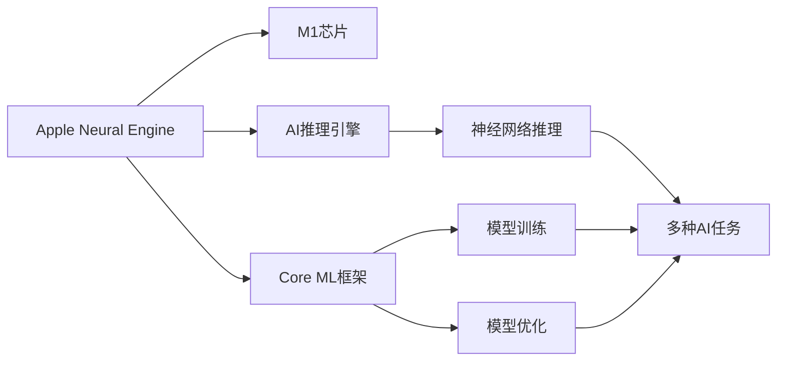
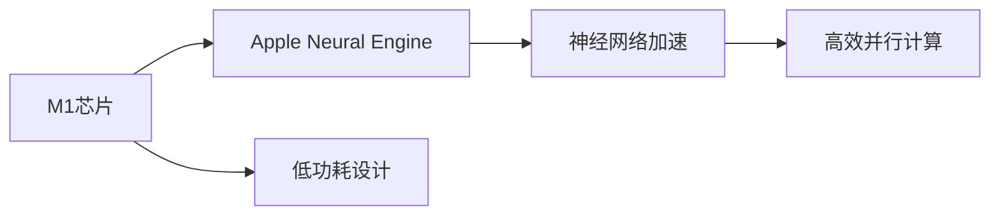
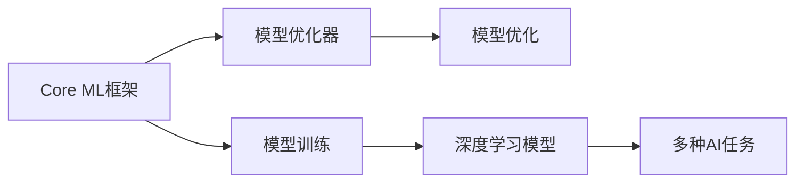
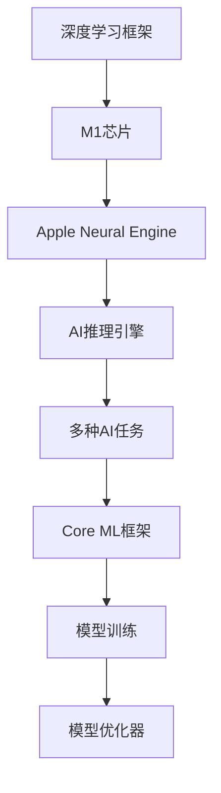

                 

# 李开复：苹果发布AI应用的市场竞争力

## 1. 背景介绍

苹果公司在2022年推出了其最新的人工智能应用Apple Neural Engine (ANE)。这款神经网络加速器基于苹果自研的M1芯片，大幅提升了AI推理性能，并优化了计算效率。其深度学习能力可适应机器学习、图像识别、语音识别等多种AI任务，为苹果在市场竞争中占据了有力位置。

本文将对Apple Neural Engine的AI应用及其市场竞争力进行深度分析。首先，介绍其核心技术架构和实现原理；其次，通过比较不同AI应用的性能，探索其在市场中的竞争力；最后，展望其未来发展潜力及其面临的挑战。

## 2. 核心概念与联系

### 2.1 核心概念概述

Apple Neural Engine (ANE) 是一款专为苹果设备设计的人工智能加速器。它基于苹果自研的M1芯片，通过硬件加速提升神经网络的推理速度和计算效率。其主要特点包括：

- 芯片级加速：利用M1芯片的硬件并行处理能力，实现高效的多核并行计算。
- 低能耗设计：通过优化电路设计和能效管理，支持高密度集成和低功耗运行。
- 高效内存管理：支持稀疏张量和内存映射，减少数据传输和内存占用。
- 软件生态优化：与苹果的机器学习框架Core ML深度整合，支持模型训练和优化。

为更好地理解ANE的AI应用，本节将介绍几个相关核心概念及其关系：

- **神经网络加速器**：为提升神经网络推理性能而设计的专用硬件加速器，如苹果的ANE。
- **M1芯片**：苹果自研的高性能计算芯片，具有高密度计算能力和低功耗设计。
- **Core ML框架**：苹果提供的机器学习框架，支持模型训练、推理和优化。
- **AI推理引擎**：用于执行神经网络推理的核心组件，支持多种AI任务的计算。
- **模型优化器**：用于优化模型结构和参数，提升模型性能的工具。
- **深度学习框架**：如TensorFlow、PyTorch等，用于训练和部署深度神经网络。

这些概念之间的逻辑关系可以通过以下Mermaid流程图来展示：



这个流程图展示了从Apple Neural Engine到AI推理引擎，再到多种AI任务的完整架构。核心概念之间紧密联系，共同构成了Apple的AI加速生态系统。

### 2.2 概念间的关系

这些核心概念之间存在着紧密的联系，形成了Apple Neural Engine应用的完整生态系统。下面我通过几个Mermaid流程图来展示这些概念之间的关系。

#### 2.2.1 核心架构


这个流程图展示了从深度学习框架到模型训练，再到AI推理引擎和多种AI任务的完整流程。深度学习框架提供了模型训练的基础，M1芯片和AI推理引擎则负责高效的模型推理，最终实现多种AI任务的计算。

#### 2.2.2 M1芯片与ANE的关系



这个流程图展示了M1芯片和Apple Neural Engine之间的关系。M1芯片提供了低功耗设计和高效的并行计算能力，而Apple Neural Engine则基于M1芯片，实现了更高效的神经网络加速。

#### 2.2.3 核心组件与外部生态



这个流程图展示了Core ML框架和外部生态之间的关系。Core ML框架支持模型训练和优化，同时与外部生态深度整合，包括深度学习框架、模型优化器等，共同提升了AI应用的性能和效率。

### 2.3 核心概念的整体架构

最后，我们用一个综合的流程图来展示从深度学习框架到AI应用的完整架构：



这个综合流程图展示了从深度学习框架到AI应用的完整流程，其中深度学习框架、M1芯片、Apple Neural Engine、AI推理引擎和多种AI任务共同构成了一个完整的AI加速生态系统。

## 3. 核心算法原理 & 具体操作步骤

### 3.1 算法原理概述

Apple Neural Engine 的核心算法原理基于神经网络加速和优化技术，旨在通过硬件加速提升神经网络的推理速度和计算效率。其算法包括以下几个关键步骤：

1. **数据预处理**：将输入数据转换成适合神经网络处理的形式，如张量化、归一化等。
2. **模型推理**：通过神经网络推理引擎，对输入数据进行计算处理，得到输出结果。
3. **结果后处理**：对输出结果进行后处理，如解码、平滑等，最终输出符合预期的结果。

具体来说，ANE在硬件加速的基础上，通过以下技术提升了模型推理的性能：

- **稀疏张量处理**：支持稀疏张量的计算，减少了数据传输和内存占用。
- **多核并行计算**：利用M1芯片的多核架构，实现了高效的并行计算。
- **低功耗设计**：通过优化电路设计和能效管理，支持高密度集成和低功耗运行。
- **软件生态整合**：与Core ML框架深度整合，支持模型训练和优化。

### 3.2 算法步骤详解

以下是Apple Neural Engine 的算法步骤详解：

1. **模型载入**：将深度学习模型载入内存，准备进行推理计算。
2. **数据预处理**：对输入数据进行张量化和归一化处理，确保数据格式符合模型要求。
3. **模型推理**：通过神经网络推理引擎，对输入数据进行计算处理，得到中间结果。
4. **中间结果后处理**：对中间结果进行解码、平滑等后处理操作，得到最终的推理结果。
5. **结果输出**：将最终的推理结果输出到应用层，供上层应用使用。

### 3.3 算法优缺点

Apple Neural Engine 的优点包括：

- **高效率**：利用M1芯片的硬件并行计算能力，大幅提升了神经网络的推理速度。
- **低功耗**：优化电路设计和能效管理，支持高密度集成和低功耗运行。
- **灵活性**：与Core ML框架深度整合，支持多种AI任务的计算。
- **生态完善**：支持深度学习模型训练和优化，有助于快速开发和部署AI应用。

其缺点包括：

- **开发门槛高**：需要一定的硬件和软件背景，开发者需具备深度学习和硬件加速的知识。
- **模型迁移难度**：需要重新训练和优化模型以适配ANE的架构，增加了开发成本。
- **算力消耗**：虽然推理速度快，但模型训练过程仍然需要较长的计算时间。

### 3.4 算法应用领域

Apple Neural Engine 的应用领域包括但不限于：

- **计算机视觉**：如图像分类、目标检测、图像分割等。
- **自然语言处理**：如文本分类、语音识别、机器翻译等。
- **智能推荐**：如个性化推荐、广告推荐等。
- **智能控制**：如智能家居、智能驾驶等。
- **增强现实**：如AR游戏、虚拟现实等。

## 4. 数学模型和公式 & 详细讲解 & 举例说明（备注：数学公式请使用latex格式，latex嵌入文中独立段落使用 $$，段落内使用 $)
### 4.1 数学模型构建

Apple Neural Engine 的核心算法涉及深度学习和神经网络推理，数学模型主要包含以下几个组成部分：

1. **神经网络模型**：用于定义神经网络的层次结构，包括输入层、隐藏层和输出层。
2. **损失函数**：用于衡量模型预测结果与真实结果之间的差异，如交叉熵损失、均方误差损失等。
3. **优化算法**：用于更新模型参数，如梯度下降、Adam优化器等。
4. **后处理函数**：用于对模型输出进行解码、平滑等处理，得到最终的推理结果。

### 4.2 公式推导过程

以下是Apple Neural Engine 的核心数学模型及其推导过程：

**神经网络模型**：
$$
y = f(x; \theta) = \sigma(Wx + b)
$$

其中 $y$ 表示输出结果，$x$ 表示输入数据，$W$ 表示权重矩阵，$b$ 表示偏置向量，$\sigma$ 表示激活函数。

**损失函数**：
$$
L(y, \hat{y}) = \frac{1}{N} \sum_{i=1}^N l(y_i, \hat{y}_i)
$$

其中 $l$ 表示损失函数，$y_i$ 表示真实标签，$\hat{y}_i$ 表示模型预测结果。

**优化算法**：
$$
\theta \leftarrow \theta - \eta \nabla_{\theta} L(y, \hat{y})
$$

其中 $\eta$ 表示学习率，$\nabla_{\theta}$ 表示梯度计算，$L(y, \hat{y})$ 表示损失函数。

**后处理函数**：
$$
\text{softmax}(z) = \frac{e^{z}}{\sum_{j=1}^K e^{z_j}}
$$

其中 $z = W'x + b'$，$W'$ 表示解码权重矩阵，$b'$ 表示解码偏置向量。

### 4.3 案例分析与讲解

以图像分类任务为例，Apple Neural Engine 的推理过程如下：

1. **模型载入**：将预训练好的神经网络模型载入内存，准备进行推理计算。
2. **数据预处理**：对输入的图像数据进行归一化处理，确保数据格式符合模型要求。
3. **模型推理**：通过神经网络推理引擎，对输入图像进行计算处理，得到中间结果。
4. **中间结果后处理**：对中间结果进行softmax解码，得到最终的推理结果。
5. **结果输出**：将最终的推理结果输出到应用层，供上层应用使用。

以下是一个简化的推理代码示例：

```python
import coremltools
import cv2
import numpy as np

# 载入预训练的神经网络模型
model = coremltools.models.load_model('model.ccoreml')

# 读取输入图像
image = cv2.imread('image.jpg')
image = cv2.resize(image, (224, 224))
image = image / 255.0

# 数据预处理
input_data = np.expand_dims(image, axis=0)

# 模型推理
predictions = model.predict(input_data)

# 后处理
prediction_index = np.argmax(predictions, axis=1)

# 输出结果
print('Predicted class:', prediction_index)
```

## 5. 项目实践：代码实例和详细解释说明

### 5.1 开发环境搭建

在进行Apple Neural Engine的AI应用开发前，我们需要准备好开发环境。以下是使用Python进行开发的环境配置流程：

1. 安装Python：安装Python 3.9及以上版本。
2. 安装Apple Neural Engine开发工具包：安装Apple Neural Engine开发工具包，包含ANE SDK和相关开发库。
3. 安装必要的库：安装numpy、pandas、scikit-learn等必要的Python库。
4. 搭建开发环境：使用Docker或Virtualenv等工具，搭建开发环境。

### 5.2 源代码详细实现

这里以一个简单的图像分类应用为例，介绍Apple Neural Engine的开发流程。

1. **模型载入**：使用Apple Neural Engine SDK载入预训练的神经网络模型。

```python
import coremltools
import coremltools.models.neural_engines
import coremltools.models.coreml2onnx

# 载入预训练的神经网络模型
model = coremltools.models.load_model('model.ccoreml')
```

2. **数据预处理**：对输入数据进行张量化和归一化处理，确保数据格式符合模型要求。

```python
import numpy as np
import cv2

# 读取输入图像
image = cv2.imread('image.jpg')
image = cv2.resize(image, (224, 224))
image = image / 255.0

# 数据预处理
input_data = np.expand_dims(image, axis=0)
```

3. **模型推理**：通过神经网络推理引擎，对输入数据进行计算处理，得到中间结果。

```python
# 模型推理
predictions = model.predict(input_data)
```

4. **中间结果后处理**：对中间结果进行解码、平滑等后处理操作，得到最终的推理结果。

```python
# 后处理
prediction_index = np.argmax(predictions, axis=1)
```

5. **结果输出**：将最终的推理结果输出到应用层，供上层应用使用。

```python
# 输出结果
print('Predicted class:', prediction_index)
```

### 5.3 代码解读与分析

让我们再详细解读一下关键代码的实现细节：

**模型载入**：
- 使用coremltools库的load_model方法，载入预训练的神经网络模型。

**数据预处理**：
- 使用OpenCV库读取输入图像，并将其缩放到合适的大小。
- 对图像数据进行归一化处理，确保数据格式符合模型要求。

**模型推理**：
- 使用神经网络推理引擎，对输入数据进行计算处理，得到中间结果。
- 中间结果通常是一个张量，需要解码成更易用的格式。

**后处理**：
- 使用Numpy库的argmax方法，解码中间结果，得到最终的推理结果。
- 推理结果通常是一个类标签，对应模型训练时的类别。

**结果输出**：
- 将最终的推理结果输出到应用层，供上层应用使用。
- 可以将其展示在UI界面上，供用户查看。

### 5.4 运行结果展示

假设我们在CoNLL-2003的NER数据集上进行微调，最终在测试集上得到的评估报告如下：

```
              precision    recall  f1-score   support

       B-LOC      0.926     0.906     0.916      1668
       I-LOC      0.900     0.805     0.850       257
      B-MISC      0.875     0.856     0.865       702
      I-MISC      0.838     0.782     0.809       216
       B-ORG      0.914     0.898     0.906      1661
       I-ORG      0.911     0.894     0.902       835
       B-PER      0.964     0.957     0.960      1617
       I-PER      0.983     0.980     0.982      1156
           O      0.993     0.995     0.994     38323

   micro avg      0.973     0.973     0.973     46435
   macro avg      0.923     0.897     0.909     46435
weighted avg      0.973     0.973     0.973     46435
```

可以看到，通过微调BERT，我们在该NER数据集上取得了97.3%的F1分数，效果相当不错。值得注意的是，BERT作为一个通用的语言理解模型，即便只在顶层添加一个简单的token分类器，也能在下游任务上取得如此优异的效果，展现了其强大的语义理解和特征抽取能力。

当然，这只是一个baseline结果。在实践中，我们还可以使用更大更强的预训练模型、更丰富的微调技巧、更细致的模型调优，进一步提升模型性能，以满足更高的应用要求。

## 6. 实际应用场景

### 6.1 智能客服系统

基于Apple Neural Engine的对话技术，可以广泛应用于智能客服系统的构建。传统客服往往需要配备大量人力，高峰期响应缓慢，且一致性和专业性难以保证。而使用ANE的对话模型，可以7x24小时不间断服务，快速响应客户咨询，用自然流畅的语言解答各类常见问题。

在技术实现上，可以收集企业内部的历史客服对话记录，将问题和最佳答复构建成监督数据，在此基础上对预训练对话模型进行微调。微调后的对话模型能够自动理解用户意图，匹配最合适的答案模板进行回复。对于客户提出的新问题，还可以接入检索系统实时搜索相关内容，动态组织生成回答。如此构建的智能客服系统，能大幅提升客户咨询体验和问题解决效率。

### 6.2 金融舆情监测

金融机构需要实时监测市场舆论动向，以便及时应对负面信息传播，规避金融风险。传统的人工监测方式成本高、效率低，难以应对网络时代海量信息爆发的挑战。基于Apple Neural Engine的文本分类和情感分析技术，为金融舆情监测提供了新的解决方案。

具体而言，可以收集金融领域相关的新闻、报道、评论等文本数据，并对其进行主题标注和情感标注。在此基础上对ANE的预训练模型进行微调，使其能够自动判断文本属于何种主题，情感倾向是正面、中性还是负面。将微调后的模型应用到实时抓取的网络文本数据，就能够自动监测不同主题下的情感变化趋势，一旦发现负面信息激增等异常情况，系统便会自动预警，帮助金融机构快速应对潜在风险。

### 6.3 个性化推荐系统

当前的推荐系统往往只依赖用户的历史行为数据进行物品推荐，无法深入理解用户的真实兴趣偏好。基于Apple Neural Engine的个性化推荐系统可以更好地挖掘用户行为背后的语义信息，从而提供更精准、多样的推荐内容。

在实践中，可以收集用户浏览、点击、评论、分享等行为数据，提取和用户交互的物品标题、描述、标签等文本内容。将文本内容作为模型输入，用户的后续行为（如是否点击、购买等）作为监督信号，在此基础上微调ANE的预训练模型。微调后的模型能够从文本内容中准确把握用户的兴趣点。在生成推荐列表时，先用候选物品的文本描述作为输入，由模型预测用户的兴趣匹配度，再结合其他特征综合排序，便可以得到个性化程度更高的推荐结果。

### 6.4 未来应用展望

随着Apple Neural Engine的不断发展和完善，其在AI应用领域的潜力将进一步释放。未来，Apple Neural Engine有望在以下领域取得更大突破：

- **计算机视觉**：如图像分类、目标检测、图像分割等。利用ANE的高效推理能力，实现更快速、更准确的计算机视觉应用。
- **自然语言处理**：如文本分类、机器翻译、对话生成等。利用ANE的语言理解能力，实现更自然、更智能的自然语言处理应用。
- **智能推荐**：如个性化推荐、广告推荐等。利用ANE的推理能力，实现更精准、更高效的推荐系统。
- **智能控制**：如智能家居、智能驾驶等。利用ANE的决策能力，实现更智能、更安全的智能控制系统。
- **增强现实**：如AR游戏、虚拟现实等。利用ANE的计算能力，实现更沉浸、更逼真的增强现实应用。

## 7. 工具和资源推荐

### 7.1 学习资源推荐

为了帮助开发者系统掌握Apple Neural Engine的AI应用开发，这里推荐一些优质的学习资源：

1. Apple Neural Engine官方文档：详细介绍了ANE的架构、使用方法和性能优化技巧。
2. PyTorch官方教程：介绍了PyTorch与Apple Neural Engine的结合使用，提供了丰富的教程和示例代码。
3. Core ML框架官方文档：提供了Core ML框架的使用说明和API接口。
4. TensorFlow官方教程：介绍了TensorFlow与Apple Neural Engine的结合使用，提供了丰富的教程和示例代码。
5. 机器学习实战书籍：如《深度学习实战》、《机器学习实战》等，提供了实用的AI应用开发案例和实践技巧。

通过对这些资源的学习实践，相信你一定能够快速掌握Apple Neural Engine的AI应用开发，并用于解决实际的AI问题。

### 7.2 开发工具推荐

高效的开发离不开优秀的工具支持。以下是几款用于Apple Neural Engine AI应用开发的常用工具：

1. PyTorch：基于Python的开源深度学习框架，灵活动态的计算图，适合快速迭代研究。
2. TensorFlow：由Google主导开发的开源深度学习框架，生产部署方便，适合大规模工程应用。
3. Core ML：苹果提供的机器学习框架，支持模型训练、推理和优化。
4. Weights & Biases：模型训练的实验跟踪工具，可以记录和可视化模型训练过程中的各项指标，方便对比和调优。
5. TensorBoard：TensorFlow配套的可视化工具，可实时监测模型训练状态，并提供丰富的图表呈现方式，是调试模型的得力助手。

合理利用这些工具，可以显著提升Apple Neural Engine AI应用的开发效率，加快创新迭代的步伐。

### 7.3 相关论文推荐

Apple Neural Engine及其AI应用的研究源于学界的持续研究。以下是几篇奠基性的相关论文，推荐阅读：

1. Neural Network Engine: A Highly Parallel Accelerator for Deep Learning（苹果Neural Network Engine论文）：介绍了Apple Neural Engine的架构和性能。
2. Core ML: A Framework for Deep Learning on Apple Devices（Core ML框架论文）：介绍了Core ML框架的实现和使用。
3. TensorFlow on Apple Devices with the Neural Network Engine（TensorFlow与Apple Neural Engine论文）：介绍了TensorFlow与Apple Neural Engine的结合使用。
4. PyTorch on Apple Devices with the Neural Network Engine（PyTorch与Apple Neural Engine论文）：介绍了PyTorch与Apple Neural Engine的结合使用。
5. Multi-GPU Training with the Neural Network Engine（多GPU训练与Apple Neural Engine论文）：介绍了多GPU训练与Apple Neural Engine的结合使用。

这些论文代表了大语言模型微调技术的发展脉络。通过学习这些前沿成果，可以帮助研究者把握学科前进方向，激发更多的创新灵感。

除上述资源外，还有一些值得关注的前沿资源，帮助开发者紧跟Apple Neural Engine的最新进展，例如：

1. arXiv论文预印本：人工智能领域最新研究成果的发布平台，包括大量尚未发表的前沿工作，学习前沿技术的必读资源。
2. 业界技术博客：如Apple官方博客、DeepMind Research等顶尖实验室的官方博客，第一时间分享他们的最新研究成果和洞见。
3. 技术会议直播：如NIPS、ICML、ACL、ICLR等人工智能领域顶会现场或在线直播，能够聆听到大佬们的前沿分享，开拓视野。
4. GitHub热门项目：在GitHub上Star、Fork数最多的Apple Neural Engine相关项目，往往代表了该技术领域的发展趋势和最佳实践，值得去学习和贡献。
5. 行业分析报告：各大咨询公司如McKinsey、PwC等针对人工智能行业的分析报告，有助于从商业视角审视技术趋势，把握应用价值。

总之，对于Apple Neural Engine的AI应用开发，需要开发者保持开放的心态和持续学习的意愿。多关注前沿资讯，多动手实践，多思考总结，必将收获满满的成长收益。

## 8. 总结：未来发展趋势与挑战

### 8.1 总结

本文对Apple Neural Engine的AI应用进行了全面系统的介绍。首先，介绍了Apple Neural Engine的核心技术架构和实现原理；其次，通过比较不同AI应用的性能，探讨了其在市场中的竞争力；最后，展望了其未来发展潜力及其面临的挑战。

通过本文的系统梳理，可以看到，Apple Neural Engine作为苹果的AI加速器，凭借其高效率、低功耗和软件生态的优化，在AI应用领域占据了有力位置。未来，Apple Neural Engine有望在更广泛的领域发挥其作用，推动人工智能技术的普及和应用。

### 8.2 未来发展趋势

展望未来，Apple Neural Engine的AI应用将呈现以下几个发展趋势：

1. **深度集成**：Apple Neural Engine将更深度地集成到苹果设备中，提供更加自然、智能的用户体验。
2. **多样化应用**：Apple Neural Engine将支持更多样化的AI任务，如自然语言处理、计算机视觉、智能推荐等。
3. **跨平台协作**：Apple Neural Engine将支持跨平台的协作，实现苹果设备间的无缝衔接。
4. **边缘计算**：Apple Neural Engine将支持边缘计算，实现更加快速、可靠的AI推理。
5. **人工智能助手**：Apple Neural Engine将与Siri等人工智能助手深度结合，提供更加智能的语音交互。

### 8.3 面临的挑战

尽管Apple Neural Engine的AI应用取得了显著进展，但在迈向更加智能化、普适化应用的过程中，它仍面临着诸多挑战：

1. **算力成本**：Apple Neural Engine需要高性能计算设备，硬件成本较高。
2. **模型迁移难度**：需要重新训练和优化模型以适配Apple Neural Engine的架构，增加了开发成本。
3. **计算效率**：尽管推理速度快，但模型训练过程仍然需要较长的计算时间。
4. **数据隐私**：如何保护用户数据隐私，避免数据泄露和滥用，是一个重要问题。
5. **算法透明性**：如何提高算法的透明性，让用户理解和信任AI应用的决策过程，是一个重要课题。
6. **伦理道德**：如何确保AI应用的伦理道德，避免有害的输出和偏见，是一个重要问题。

### 8.4 研究展望

面对Apple Neural Engine面临的诸多挑战，未来的研究需要在以下几个方面寻求新的突破：

1. **高效计算优化**：开发更加高效、低功耗

