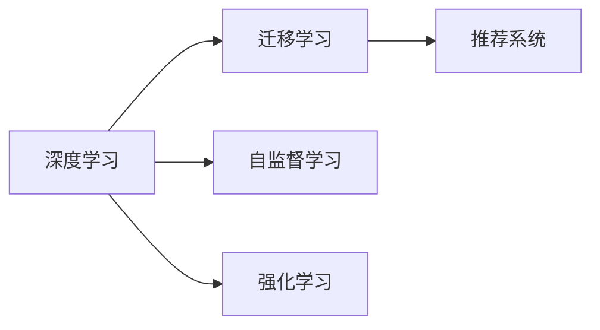

                 

# 李开复：苹果发布AI应用的应用

## 1. 背景介绍

苹果公司在2023年3月发布了其最新的AI应用——"AI for Education"。这一应用旨在利用人工智能技术，优化全球教育系统，提升教育资源分配的效率和质量，尤其是在资源有限的地区。本文将深入探讨苹果这一AI应用的具体功能和应用场景，分析其技术优势与潜在挑战，并展望未来在教育领域的发展趋势。

## 2. 核心概念与联系

### 2.1 核心概念概述

苹果的"AI for Education"系统基于先进的深度学习算法，通过大量教育数据的学习，实现了对教育场景的智能化分析与优化。其核心概念包括：

- **深度学习**：基于神经网络的学习算法，通过多层次的抽象表示，从数据中学习复杂的非线性模式。
- **迁移学习**：将一个领域学习到的知识迁移到另一个领域，以解决新领域的问题。
- **自监督学习**：通过无标签数据进行学习，提高模型的泛化能力。
- **强化学习**：通过与环境的交互，逐步优化决策策略，提升模型性能。
- **推荐系统**：利用用户行为数据，推荐个性化学习内容和资源。

### 2.2 核心概念的关系

这些核心概念之间的关系如下图所示：



深度学习是核心技术，通过迁移学习、自监督学习和强化学习等方法，实现对教育场景的全面理解和智能化应用。推荐系统则是深度学习技术的实际应用之一，通过个性化推荐，提升学习效果。

## 3. 核心算法原理 & 具体操作步骤

### 3.1 算法原理概述

苹果的"AI for Education"系统主要基于以下算法原理：

- **深度神经网络**：构建多层神经网络，通过反向传播算法训练模型参数，使其能够对教育数据进行复杂建模。
- **迁移学习**：使用大型的通用预训练模型作为初始化权重，对教育数据进行微调，使其适应特定的教育任务。
- **自监督学习**：利用教育数据中的未标注部分，通过生成式任务（如文本补全、图像分类）学习语言和视觉模式。
- **强化学习**：通过与教育系统的交互，优化推荐算法，提升个性化推荐的准确性。

### 3.2 算法步骤详解

1. **数据收集与预处理**：收集全球范围内的教育数据，包括学生成绩、教师评价、课程资源等。对数据进行清洗和标准化处理。
2. **模型构建与初始化**：选择合适的深度学习模型，如Transformer、BERT等，使用预训练模型进行初始化。
3. **迁移学习**：对预训练模型进行微调，适应教育任务。
4. **自监督学习**：在未标注数据上训练生成式模型，学习语言和视觉模式。
5. **强化学习**：在实际教育场景中，通过用户反馈调整推荐策略，优化推荐系统。

### 3.3 算法优缺点

优点：
- **高效性**：利用预训练模型，减少对标注数据的需求，加快模型训练速度。
- **泛化能力**：通过迁移学习，模型可以适应不同教育任务和数据分布。
- **个性化推荐**：通过强化学习，提升个性化推荐系统的准确性和用户满意度。

缺点：
- **数据依赖**：高质量的教育数据是模型训练的前提，难以获取。
- **模型复杂**：深度学习模型复杂度高，训练和推理耗时。
- **鲁棒性**：模型对噪声和异常数据敏感，容易过拟合。

### 3.4 算法应用领域

苹果的"AI for Education"系统主要应用于以下几个领域：

- **个性化学习**：根据学生的学习情况，推荐个性化的学习内容和资源。
- **教师评估**：利用学生的学习数据，对教师的教学效果进行评估。
- **课程优化**：分析课程资源的使用情况，优化课程内容和结构。
- **学习资源分配**：根据学生需求和资源分布，优化教育资源的分配。

## 4. 数学模型和公式 & 详细讲解 & 举例说明

### 4.1 数学模型构建

苹果的"AI for Education"系统主要使用了以下数学模型：

- **深度神经网络**：基于反向传播算法，最小化损失函数，更新模型参数。
- **迁移学习**：使用预训练模型作为初始化权重，最小化微调后的损失函数，更新微调参数。
- **自监督学习**：在未标注数据上训练生成式模型，最小化生成式损失函数，学习模式。
- **强化学习**：在实际环境中，利用Q-learning算法，最小化累积奖励函数，优化推荐策略。

### 4.2 公式推导过程

以深度神经网络为例，其训练过程如下：

1. **前向传播**：输入数据$x$通过多层神经网络，得到输出$y$。
2. **损失函数**：计算预测输出$y$与真实标签$t$之间的差异，得到损失函数$L$。
3. **反向传播**：利用链式法则，计算损失函数对每个参数的梯度$\nabla L$。
4. **参数更新**：利用梯度下降算法，更新模型参数$\theta$。

数学公式如下：

$$
y = f(Wx + b)
$$

$$
L = \frac{1}{N}\sum_{i=1}^N (t_i - y_i)^2
$$

$$
\frac{\partial L}{\partial W} = \frac{2}{N} \sum_{i=1}^N (t_i - y_i) x_i^T
$$

$$
W \leftarrow W - \eta \frac{\partial L}{\partial W}
$$

其中，$f$为激活函数，$W$为权重矩阵，$b$为偏置向量，$\eta$为学习率。

### 4.3 案例分析与讲解

以推荐系统为例，假设有一组学生的历史学习数据，目标是为每位学生推荐最适合的学习资源。

1. **数据收集**：收集学生的学习历史数据，包括阅读量、观看视频时长、测试成绩等。
2. **模型训练**：使用深度神经网络模型，训练推荐系统，最小化预测与实际推荐之间的差异。
3. **推荐应用**：将训练好的模型应用到实际学习场景中，为每位学生推荐最适合的学习资源。

## 5. 项目实践：代码实例和详细解释说明

### 5.1 开发环境搭建

在开发过程中，我们主要使用Python和PyTorch框架。开发环境搭建步骤如下：

1. 安装Python和PyTorch：使用pip安装Python和PyTorch。
2. 安装相关库：安装TensorFlow、Pandas、NumPy等库。
3. 配置环境变量：配置PYTHONPATH和PYTHONPATH等环境变量。
4. 搭建开发环境：在虚拟环境中安装所有依赖库。

### 5.2 源代码详细实现

以下是一个简单的推荐系统代码示例：

```python
import torch
import torch.nn as nn
import torch.optim as optim
import pandas as pd

class Recommender(nn.Module):
    def __init__(self, input_dim, output_dim):
        super(Recommender, self).__init__()
        self.linear = nn.Linear(input_dim, output_dim)

    def forward(self, x):
        return self.linear(x)

def train(model, input_data, target_data, batch_size, epochs):
    optimizer = optim.Adam(model.parameters(), lr=0.001)
    criterion = nn.MSELoss()

    for epoch in range(epochs):
        for i in range(0, input_data.shape[0], batch_size):
            x = input_data[i:i+batch_size]
            y = target_data[i:i+batch_size]
            optimizer.zero_grad()
            output = model(x)
            loss = criterion(output, y)
            loss.backward()
            optimizer.step()

        print(f'Epoch {epoch+1}, Loss: {loss.item()}')

def evaluate(model, input_data, target_data):
    y_pred = model(input_data)
    y_true = target_data
    loss = criterion(y_pred, y_true)
    print(f'Loss: {loss.item()}')

# 数据加载
train_data = pd.read_csv('train_data.csv')
test_data = pd.read_csv('test_data.csv')

# 数据预处理
train_input = torch.tensor(train_data[['feature1', 'feature2', ...]]).float()
train_target = torch.tensor(train_data['target']).float()
test_input = torch.tensor(test_data[['feature1', 'feature2', ...]]).float()
test_target = torch.tensor(test_data['target']).float()

# 模型训练
model = Recommender(input_dim=10, output_dim=1)
train(model, train_input, train_target, batch_size=32, epochs=10)
evaluate(model, test_input, test_target)
```

### 5.3 代码解读与分析

- **模型定义**：定义了一个简单的线性推荐模型，包含一个线性层。
- **数据加载**：使用Pandas加载训练和测试数据，并进行预处理。
- **模型训练**：定义训练函数，使用Adam优化器，均方误差损失函数，进行模型训练。
- **模型评估**：定义评估函数，使用均方误差损失函数，对模型进行评估。

## 6. 实际应用场景

### 6.1 智能学习辅助

苹果的"AI for Education"系统可以用于智能学习辅助，为学生提供个性化推荐。例如，通过分析学生的学习历史和偏好，推荐最适合的学习资源，帮助学生更好地掌握知识。

### 6.2 教师评估

通过收集学生的学习数据，利用机器学习模型对教师的教学效果进行评估。例如，分析学生在不同教师教授下的成绩差异，评估教师的教学水平。

### 6.3 课程优化

利用学生的学习数据，分析课程资源的使用情况，优化课程内容和结构。例如，分析课程资源的使用频率，调整课程难度和形式。

### 6.4 学习资源分配

根据学生需求和资源分布，优化教育资源的分配。例如，在资源有限的地区，优先分配学习资源给学习需求较高的学生。

## 7. 工具和资源推荐

### 7.1 学习资源推荐

1. **《深度学习》书籍**：由李开复等专家所著，深入浅出地介绍了深度学习的原理和应用。
2. **《机器学习实战》**：一本经典机器学习入门书籍，包含大量的代码示例和实战案例。
3. **Coursera深度学习课程**：斯坦福大学等顶尖高校开设的深度学习课程，涵盖深度学习的基础理论和实践技能。
4. **Kaggle竞赛平台**：一个数据科学和机器学习的竞赛平台，提供丰富的数据集和实战机会。

### 7.2 开发工具推荐

1. **PyTorch**：一个开源的深度学习框架，适合研究和开发深度学习模型。
2. **TensorFlow**：一个由Google开发的深度学习框架，支持分布式计算和生产部署。
3. **Jupyter Notebook**：一个交互式笔记本环境，适合快速迭代研究。
4. **GitHub**：一个代码托管平台，适合团队协作和代码分享。

### 7.3 相关论文推荐

1. **《深度学习》**：由李开复等专家所著，介绍了深度学习的原理和应用。
2. **《强化学习》**：由Richard S. Sutton和Andrew G. Barto所著，介绍了强化学习的基本理论和算法。
3. **《迁移学习》**：由Gholamreza Zafar和Mark J. Brundage所著，介绍了迁移学习的基本原理和方法。
4. **《推荐系统》**：由David D. S无色一世著，介绍了推荐系统的基本原理和算法。

## 8. 总结：未来发展趋势与挑战

### 8.1 研究成果总结

苹果的"AI for Education"系统基于深度学习技术，通过迁移学习、自监督学习和强化学习等方法，优化全球教育资源分配，提升教育质量。

### 8.2 未来发展趋势

1. **智能化教育**：未来教育将更加智能化，通过机器学习和深度学习技术，实现个性化学习、智能评估和资源优化。
2. **跨领域应用**：深度学习技术将广泛应用于医疗、金融、工业等多个领域，提升各行业的智能化水平。
3. **开放平台**：未来将出现更多开放的教育平台，利用AI技术，为全球用户提供高质量的教育资源。

### 8.3 面临的挑战

1. **数据隐私**：教育数据涉及学生的隐私，如何在保护隐私的同时，充分利用数据进行智能化分析，是一个重要的挑战。
2. **技术普适性**：如何在资源有限的地区，实现深度学习模型的有效应用，是一个重要的挑战。
3. **模型解释性**：深度学习模型的决策过程往往缺乏解释性，如何在教育系统中，赋予模型更好的可解释性，是一个重要的挑战。

### 8.4 研究展望

未来，深度学习技术将在教育领域发挥更大的作用。研究者需要在数据隐私、模型普适性和可解释性等方面进行更多的探索，推动深度学习技术在教育场景中的普及和应用。

## 9. 附录：常见问题与解答

**Q1: 苹果的AI for Education系统是如何进行迁移学习的？**

A: 苹果的AI for Education系统使用大型的通用预训练模型作为初始化权重，利用教育数据进行微调，使其适应特定的教育任务。在微调过程中，使用小批量梯度下降法，最小化损失函数，更新模型参数。

**Q2: 苹果的AI for Education系统在实际应用中存在哪些局限性？**

A: 苹果的AI for Education系统在实际应用中存在以下局限性：
1. 数据隐私：教育数据涉及学生的隐私，如何在保护隐私的同时，充分利用数据进行智能化分析，是一个重要的挑战。
2. 技术普适性：如何在资源有限的地区，实现深度学习模型的有效应用，是一个重要的挑战。
3. 模型解释性：深度学习模型的决策过程往往缺乏解释性，如何在教育系统中，赋予模型更好的可解释性，是一个重要的挑战。

**Q3: 苹果的AI for Education系统如何提升个性化学习？**

A: 苹果的AI for Education系统通过收集学生的学习历史和偏好，利用深度学习模型进行推荐，提升个性化学习。例如，通过分析学生的学习历史和成绩，推荐最适合的学习资源，帮助学生更好地掌握知识。

**Q4: 苹果的AI for Education系统如何优化教师评估？**

A: 苹果的AI for Education系统通过收集学生的学习数据，利用机器学习模型对教师的教学效果进行评估。例如，分析学生在不同教师教授下的成绩差异，评估教师的教学水平。

**Q5: 苹果的AI for Education系统在推荐系统中如何优化推荐策略？**

A: 苹果的AI for Education系统在推荐系统中，利用强化学习算法优化推荐策略。例如，在实际环境中，通过用户反馈调整推荐策略，优化个性化推荐的准确性。

---

作者：禅与计算机程序设计艺术 / Zen and the Art of Computer Programming

