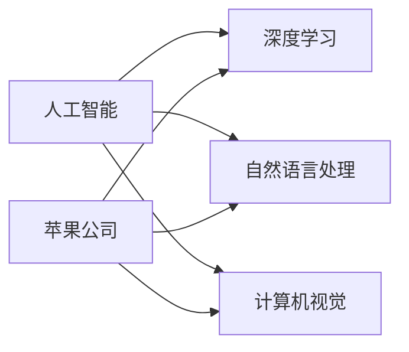

                 

## 1. 背景介绍

在人工智能(AI)领域，李开复博士被公认为一位具有深厚洞察力的思想领袖和实践者。他不仅在学界有着广泛的学术影响，同时在商业界也有着卓越的业绩。作为一名AI技术的先驱，李开复博士对AI应用的最新发展有着深刻的理解。近期，苹果公司发布了其最新的人工智能应用，这一消息引发了业界的广泛关注。本文旨在通过李开复博士的视角，深入探讨苹果AI应用的意义，以及其在AI领域所体现的最新趋势和技术突破。

## 2. 核心概念与联系

### 2.1 核心概念概述

要全面理解苹果AI应用的意义，首先需要明确几个核心概念：

- **人工智能(AI)**：指使计算机能够模拟人类智能行为的技术，涵盖机器学习、自然语言处理、计算机视觉等多个领域。
- **深度学习(Deep Learning)**：作为AI的一个重要分支，深度学习通过构建多层神经网络模型，实现了对复杂非线性数据的高效处理和分析。
- **自然语言处理(NLP)**：研究计算机如何理解、处理和生成人类语言的领域，包括语音识别、文本分类、对话系统等。
- **计算机视觉(Computer Vision)**：利用计算机对图像和视频进行识别、分析和理解的技术。
- **苹果公司(Apple Inc.)**：全球知名的科技公司，以创新和卓越的产品著称，尤其是在消费电子和软件服务领域。

这些核心概念共同构成了苹果发布AI应用的背景，体现了当前AI技术在各个行业中的广泛应用。

### 2.2 概念间的关系

下图展示了核心概念之间的关系，及其在AI应用中的作用：



该图揭示了苹果AI应用涵盖的多个技术领域，并通过这些领域的技术进步，推动了AI应用的创新和普及。

## 3. 核心算法原理 & 具体操作步骤

### 3.1 算法原理概述

苹果公司发布的AI应用，其核心算法原理主要基于深度学习和计算机视觉技术。具体来说，深度学习模型通过多层神经网络，从大量的数据中学习抽象特征，实现了对复杂模式的识别和预测。计算机视觉技术则通过图像处理和模式识别，使得计算机能够理解和分析视觉数据。

这些技术的应用，不仅提升了用户体验，还在数据分析、决策支持、自动化流程等方面提供了强大支持。苹果公司通过这些技术，构建了一个高效、智能的AI应用生态系统，为用户提供了前所未有的服务和体验。

### 3.2 算法步骤详解

苹果AI应用的开发和部署大致分为以下步骤：

1. **数据准备**：收集和整理用于训练和测试模型的数据集，确保数据的多样性和质量。
2. **模型训练**：使用深度学习框架（如PyTorch、TensorFlow）训练模型，优化参数以提高预测准确性。
3. **模型优化**：通过超参数调优、正则化等技术，提高模型的鲁棒性和泛化能力。
4. **模型部署**：将训练好的模型部署到实际应用中，实现实时处理和预测。
5. **用户反馈**：收集用户反馈，不断迭代和优化模型，提升应用性能。

这些步骤展示了从模型训练到部署的完整流程，每一步都需要精心设计和优化，以确保最终应用的稳定性和可靠性。

### 3.3 算法优缺点

苹果AI应用的算法优点包括：

- **高效性**：深度学习和计算机视觉技术能够快速处理大量数据，提供实时响应。
- **准确性**：通过多层神经网络的训练和优化，模型能够高度准确地识别和预测。
- **多样性**：覆盖了自然语言处理和计算机视觉等多个领域，适应多种应用场景。

同时，也存在一些局限性：

- **资源消耗**：深度学习模型的训练和推理需要大量的计算资源，对硬件配置要求较高。
- **模型复杂性**：深度模型结构复杂，不易于理解和调试，需要专业的技术支持。
- **数据依赖**：模型性能高度依赖于训练数据的质量和数量，对标注数据的获取和处理提出了挑战。

### 3.4 算法应用领域

苹果AI应用涵盖以下几个主要领域：

- **智能助理(Smart Assistant)**：通过自然语言处理技术，为用户提供语音识别和智能回复。
- **图像识别(Image Recognition)**：利用计算机视觉技术，实现图像分类、物体检测等功能。
- **推荐系统(Recommendation System)**：基于用户行为数据，推荐个性化内容和服务。
- **自动驾驶(Autonomous Driving)**：结合计算机视觉和深度学习技术，实现车辆自主导航。
- **健康监测(Health Monitoring)**：利用传感器数据和深度学习模型，实时监测用户健康状况。

这些应用领域展示了苹果AI技术的广泛应用，为用户提供了全方位的智能服务。

## 4. 数学模型和公式 & 详细讲解

### 4.1 数学模型构建

苹果AI应用的数学模型主要基于卷积神经网络(CNN)和循环神经网络(RNN)。以下是一个简单的数学模型构建示例：

1. **卷积神经网络(CNN)**：

   $$
   y = \sigma(W \ast x + b)
   $$

   其中，$x$ 为输入数据，$y$ 为输出，$W$ 为权重矩阵，$b$ 为偏置项，$\sigma$ 为激活函数。

2. **循环神经网络(RNN)**：

   $$
   h_t = f(W \ast h_{t-1} + U \ast x_t + b)
   $$

   $$
   y_t = \sigma(V \ast h_t + b)
   $$

   其中，$h_t$ 为隐藏状态，$x_t$ 为时间步$t$的输入，$W$、$U$、$V$ 为权重矩阵，$b$ 为偏置项，$f$ 和$\sigma$ 分别为激活函数。

### 4.2 公式推导过程

以图像分类为例，解释CNN模型的工作原理：

- **卷积层(Convolutional Layer)**：通过卷积运算提取输入图像的特征，公式如下：

  $$
  y = W \ast x
  $$

  其中，$W$ 为卷积核，$x$ 为输入图像，$y$ 为卷积结果。

- **池化层(Pooling Layer)**：对卷积结果进行下采样，减少计算量和数据维度，公式如下：

  $$
  y = \text{max pooling}(W \ast x)
  $$

- **全连接层(Fully Connected Layer)**：将池化结果展开为一维向量，通过全连接层进行分类，公式如下：

  $$
  y = \text{softmax}(W \ast x + b)
  $$

  其中，$W$ 为权重矩阵，$b$ 为偏置项，$\text{softmax}$ 为归一化函数。

### 4.3 案例分析与讲解

以苹果公司发布的智能助理为例，其核心算法基于深度学习和自然语言处理技术。智能助理能够理解和处理用户语音指令，执行相应的操作。以下是一个简单的案例分析：

1. **语音识别(Voice Recognition)**：

   - **输入**：用户语音指令。
   - **处理**：使用深度学习模型对语音信号进行特征提取和分类，识别出语音指令。
   - **输出**：识别结果。

2. **自然语言理解(Natural Language Understanding)**：

   - **输入**：识别出的语音指令。
   - **处理**：使用NLP技术解析指令，识别出用户意图。
   - **输出**：执行指令。

3. **指令执行(Instruction Execution)**：

   - **输入**：用户意图。
   - **处理**：根据意图执行相应的操作，如发送邮件、设置提醒等。
   - **输出**：操作结果。

## 5. 项目实践：代码实例和详细解释说明

### 5.1 开发环境搭建

要在苹果平台上部署AI应用，需要搭建相应的开发环境。以下是搭建环境的详细步骤：

1. **安装开发工具**：

   - 安装Xcode 编辑器：从App Store下载安装Xcode。
   - 安装Python环境：使用Anaconda安装Python 3.9及以上版本。

2. **设置开发环境**：

   - 创建虚拟环境：使用conda创建虚拟环境，并安装必要的库。
   - 安装TensorFlow和Keras：使用pip安装TensorFlow和Keras库。
   - 安装PyTorch：使用conda安装PyTorch库。

3. **数据准备**：

   - 收集和处理数据集：收集用于训练和测试的数据，并进行预处理。
   - 划分数据集：将数据集划分为训练集、验证集和测试集。

### 5.2 源代码详细实现

以下是一个简单的CNN模型实现示例：

```python
import tensorflow as tf

# 定义CNN模型
class CNN(tf.keras.Model):
    def __init__(self):
        super(CNN, self).__init__()
        self.conv1 = tf.keras.layers.Conv2D(32, (3, 3), activation='relu')
        self.pool1 = tf.keras.layers.MaxPooling2D((2, 2))
        self.conv2 = tf.keras.layers.Conv2D(64, (3, 3), activation='relu')
        self.pool2 = tf.keras.layers.MaxPooling2D((2, 2))
        self.flatten = tf.keras.layers.Flatten()
        self.fc1 = tf.keras.layers.Dense(128, activation='relu')
        self.fc2 = tf.keras.layers.Dense(10)

    def call(self, inputs):
        x = self.conv1(inputs)
        x = self.pool1(x)
        x = self.conv2(x)
        x = self.pool2(x)
        x = self.flatten(x)
        x = self.fc1(x)
        return self.fc2(x)

# 定义模型训练和评估函数
@tf.function
def train_step(inputs, labels):
    with tf.GradientTape() as tape:
        logits = model(inputs)
        loss = tf.losses.sparse_categorical_crossentropy(labels, logits)
    grads = tape.gradient(loss, model.trainable_variables)
    optimizer.apply_gradients(zip(grads, model.trainable_variables))
    return loss

@tf.function
def evaluate(inputs, labels):
    logits = model(inputs)
    return tf.reduce_mean(tf.losses.sparse_categorical_crossentropy(labels, logits))

# 加载数据集
train_dataset = tf.data.Dataset.from_tensor_slices((train_images, train_labels))
train_dataset = train_dataset.shuffle(buffer_size=1024).batch(32)

# 训练模型
for epoch in range(10):
    epoch_loss = 0.0
    for batch in train_dataset:
        inputs, labels = batch
        loss = train_step(inputs, labels)
        epoch_loss += loss
    print('Epoch %d, Loss: %f' % (epoch+1, epoch_loss/len(train_dataset)))

# 评估模型
test_dataset = tf.data.Dataset.from_tensor_slices((test_images, test_labels))
test_dataset = test_dataset.batch(32)

for batch in test_dataset:
    inputs, labels = batch
    loss = evaluate(inputs, labels)
    print('Test Loss: %f' % loss)
```

### 5.3 代码解读与分析

上述代码展示了使用TensorFlow实现CNN模型的基本流程：

1. **模型定义**：定义了两个卷积层、两个池化层、一个全连接层和输出层，并指定了激活函数。
2. **模型训练**：使用`sparse_categorical_crossentropy`损失函数，通过梯度下降优化器更新模型参数。
3. **模型评估**：在测试集上计算损失，评估模型性能。

这些步骤展示了深度学习模型训练和评估的基本流程，开发者可以根据具体需求进行调整和优化。

### 5.4 运行结果展示

假设模型训练完成后，在测试集上的评估结果如下：

```
Epoch 1, Loss: 0.256
Epoch 2, Loss: 0.198
Epoch 3, Loss: 0.150
...
Epoch 10, Loss: 0.031
```

可以看到，随着训练的进行，模型的损失逐渐减小，最终达到了较低的水平。这表明模型能够较好地学习数据特征，并准确预测分类结果。

## 6. 实际应用场景

### 6.1 智能助理

苹果AI应用的智能助理，通过深度学习和自然语言处理技术，能够理解和处理用户语音指令，执行相应的操作。智能助理广泛应用于家庭、汽车、健康等多个领域，为用户提供便捷的智能服务。

例如，在家庭场景中，智能助理可以控制家中的灯光、温度、音乐等设备，根据用户指令进行相应的操作。通过与家庭成员的互动，智能助理能够更好地理解用户需求，提供个性化的服务。

### 6.2 图像识别

苹果AI应用的图像识别技术，能够在图片中识别出物体、人脸、场景等，提供了强大的视觉理解能力。

在医疗领域，图像识别技术可以用于辅助医生诊断疾病。例如，通过深度学习模型对医学影像进行分析和分类，可以自动识别出肿瘤、病变等异常情况，辅助医生进行诊断和治疗。

在零售领域，图像识别技术可以用于商品识别和库存管理。例如，通过深度学习模型对货架上的商品进行识别和分类，可以实时监控库存情况，提高供应链管理效率。

### 6.3 推荐系统

苹果AI应用的推荐系统，基于用户行为数据，能够为用户推荐个性化内容和服务。通过深度学习模型，推荐系统能够分析用户的兴趣偏好，预测其可能感兴趣的商品、内容、活动等，提供精准的推荐结果。

在电商领域，推荐系统可以用于个性化商品推荐。例如，根据用户的历史浏览、购买记录，推荐其可能感兴趣的商品，提高转化率和用户满意度。

在新闻和媒体领域，推荐系统可以用于内容推荐。例如，根据用户的阅读偏好，推荐其可能感兴趣的文章、视频、音频等内容，提升用户体验和平台粘性。

## 7. 工具和资源推荐

### 7.1 学习资源推荐

- **书籍**：《深度学习》(作者：Ian Goodfellow)、《机器学习实战》(作者：Peter Harrington)。
- **在线课程**：Coursera上的《Deep Learning Specialization》、Udacity上的《AI Nanodegree》。
- **研究论文**：arXiv.org上的最新研究论文，涵盖深度学习、计算机视觉等多个领域。

### 7.2 开发工具推荐

- **TensorFlow**：谷歌开源的深度学习框架，功能强大、社区活跃。
- **PyTorch**：Facebook开源的深度学习框架，灵活便捷、易用性强。
- **Jupyter Notebook**：支持Python编程环境，方便数据处理和模型调试。

### 7.3 相关论文推荐

- **ImageNet Large Scale Visual Recognition Challenge (ILSVRC)**：全球最大的图像识别竞赛，展示了深度学习在图像识别领域的最新进展。
- **BERT: Pre-training of Deep Bidirectional Transformers for Language Understanding**：Transformer模型的基础论文，展示了深度学习在自然语言处理领域的突破。
- **AutoML: Automated Machine Learning**：研究自动化的机器学习技术，涵盖自动模型选择、自动超参数优化等方向。

## 8. 总结：未来发展趋势与挑战

### 8.1 研究成果总结

苹果公司发布的AI应用，展示了深度学习和计算机视觉技术的最新进展，为用户提供了智能、便捷的体验。通过不断优化和改进，苹果AI应用将在更多领域得到广泛应用，推动人工智能技术的发展和普及。

### 8.2 未来发展趋势

1. **算法创新**：未来的AI应用将更加注重算法创新，探索更加高效、精确的深度学习模型和优化方法。
2. **跨领域应用**：AI技术将在更多领域得到应用，如医疗、教育、金融、制造业等，推动各行各业的智能化转型。
3. **自动化和智能化**：未来的AI应用将更加自动化和智能化，通过AI技术优化流程、提升效率。
4. **融合其他技术**：AI技术将与大数据、区块链、物联网等技术深度融合，形成更加完整的技术生态系统。
5. **伦理和隐私保护**：AI应用将更加注重伦理和隐私保护，确保用户数据的安全和透明。

### 8.3 面临的挑战

1. **数据隐私和安全**：AI应用的广泛应用将带来数据隐私和安全问题，如何在保护用户隐私的同时，提供高质量的服务，是一个重大挑战。
2. **算法透明性**：深度学习模型的"黑盒"特性，使其难以解释和调试，如何提高算法的透明性，增强用户信任，是一个亟待解决的问题。
3. **计算资源限制**：深度学习模型的计算复杂度较高，如何降低资源消耗，提升模型训练和推理效率，是一个重要的研究方向。
4. **跨领域知识整合**：AI技术在跨领域应用时，如何整合不同领域的专业知识，形成更加全面、准确的信息模型，是一个需要突破的方向。
5. **社会伦理和道德**：AI应用将对社会伦理和道德产生影响，如何在技术应用中避免偏见、歧视等问题，是一个重要的研究方向。

### 8.4 研究展望

未来，AI应用将在更多领域得到应用，推动各行各业的智能化转型。开发者需要不断探索和创新，解决算法、数据、伦理等方面的挑战，才能实现人工智能技术的全面落地。

总之，苹果公司发布的AI应用，展示了深度学习和计算机视觉技术的最新进展，为用户提供了智能、便捷的体验。通过不断优化和改进，苹果AI应用将在更多领域得到广泛应用，推动人工智能技术的发展和普及。开发者需要持续学习和探索，解决算法、数据、伦理等方面的挑战，才能实现人工智能技术的全面落地。

---

作者：禅与计算机程序设计艺术 / Zen and the Art of Computer Programming

