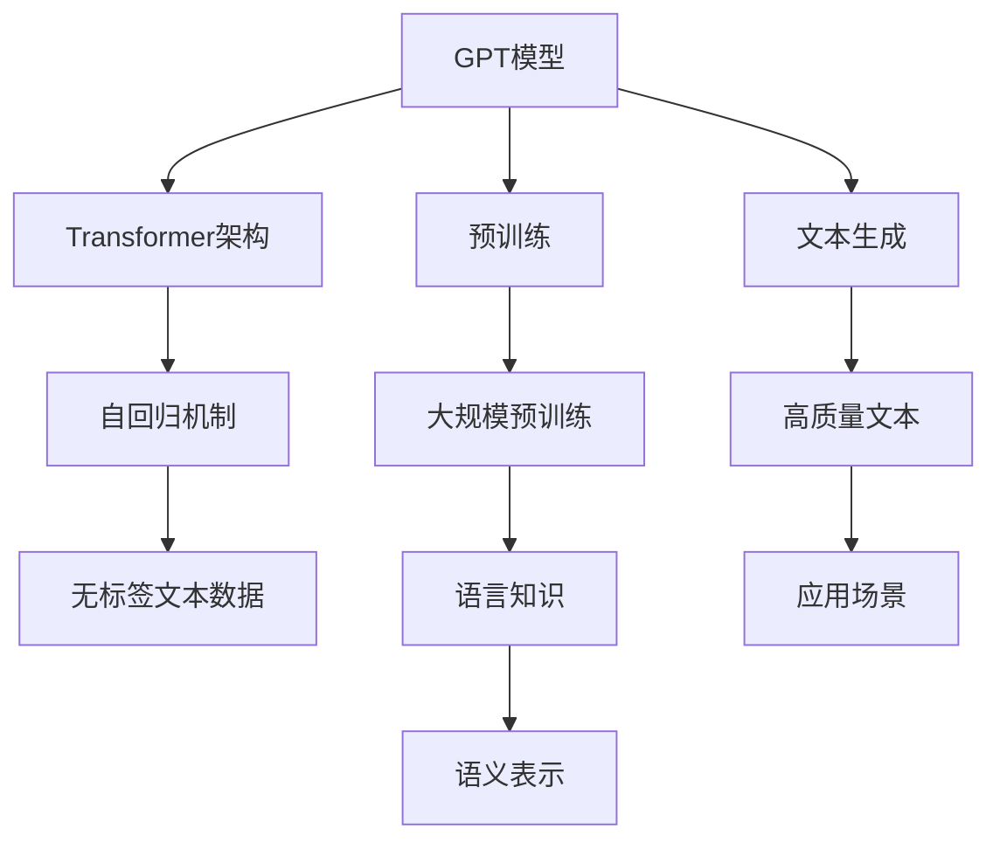
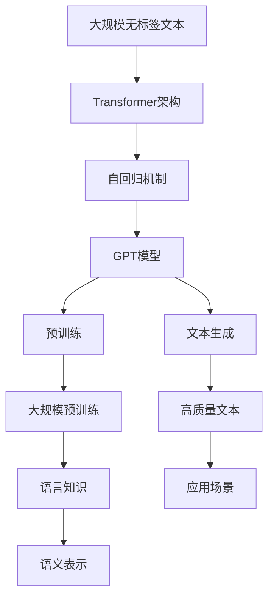
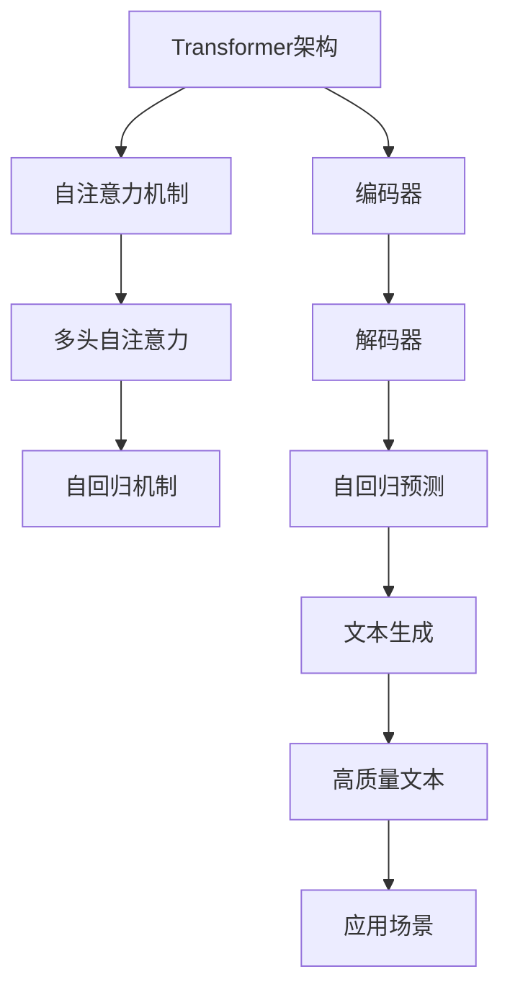
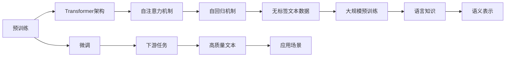

                 

# 构建GPT模型并完成文本生成任务

> 关键词：GPT模型,文本生成,语言模型,自回归,Transformer,自编码器,自然语言处理(NLP)

## 1. 背景介绍

### 1.1 问题由来
生成式语言模型是自然语言处理(NLP)领域的一项关键技术，能够在给定上下文的情况下，生成符合语法和语义规则的新文本。这类模型在机器翻译、对话系统、内容创作、自动摘要等方面有着广泛的应用前景。其中，基于Transformer架构的生成式语言模型，如GPT、GPT-3等，因其卓越的生成能力和泛化性能，受到了学界和工业界的广泛关注。

GPT（Generative Pre-trained Transformer）模型是由OpenAI开发的一款基于自回归（autoregressive）机制的生成式语言模型。通过在大规模无标签文本数据上进行预训练，GPT模型学习到了丰富的语言知识和语义表示，能够进行高质量的文本生成。本文将详细介绍如何构建GPT模型并完成文本生成任务，旨在帮助读者掌握这一前沿技术，并探索其在实际应用中的潜力和挑战。

### 1.2 问题核心关键点
构建GPT模型并完成文本生成任务的核心在于：
1. 理解Transformer架构和自回归机制，掌握其在大规模无标签文本上的预训练过程。
2. 熟悉GPT模型在不同文本生成任务中的应用，如对话生成、摘要生成、文本分类等。
3. 掌握模型超参数调优和训练技巧，确保模型在高性能硬件上高效运行。
4. 探索文本生成的应用场景，如智能客服、自动摘要、创意写作等，理解其在实际中的应用价值。

### 1.3 问题研究意义
构建GPT模型并完成文本生成任务的研究，对于推动NLP技术的发展和应用具有重要意义：

1. 提升文本生成质量。GPT模型通过大规模预训练，学习了丰富的语言知识，能够在各种文本生成任务中生成高质量、自然流畅的文本。
2. 降低人工成本。在内容创作、翻译、摘要生成等任务中，GPT模型可以显著降低人工编写成本，提升效率。
3. 扩展应用场景。GPT模型的广泛应用，推动了智能客服、智能写作、知识图谱等领域的发展，为各行各业带来了新的机遇。
4. 增强数据分析能力。在文本分类、情感分析等任务中，GPT模型能够提供更准确、更有深度的大数据分析。
5. 推动AI研究进展。GPT模型作为前沿技术，推动了自然语言处理领域的不断进步，促进了AI技术的发展。

## 2. 核心概念与联系

### 2.1 核心概念概述

为更好地理解构建GPT模型并完成文本生成任务，本节将介绍几个关键概念：

- GPT模型：以Transformer架构为基础，通过自回归机制在大规模无标签文本数据上进行预训练，学习通用的语言知识和语义表示。
- 自回归（Autoregressive）：一种生成机制，通过已知的文本前文，预测下一个文本符号，能够生成高质量的文本。
- Transformer架构：一种基于自注意力机制的神经网络结构，在机器翻译、语言建模等领域广泛应用。
- 自编码器（Autoencoder）：一种通过编码器和解码器进行数据压缩和重构的网络结构，常用于无监督学习和特征提取。

这些核心概念之间的逻辑关系可以通过以下Mermaid流程图来展示：



这个流程图展示了大语言模型GPT的工作原理和应用场景：

1. GPT模型基于Transformer架构，采用自回归机制，在大规模无标签文本数据上进行预训练，学习到丰富的语言知识和语义表示。
2. 预训练过程中，模型能够自动生成高质量的文本，用于各种下游任务。
3. 在实际应用中，GPT模型能够生成自然流畅的文本，满足不同领域的需求。

### 2.2 概念间的关系

这些核心概念之间存在着紧密的联系，形成了GPT模型微调的完整生态系统。下面我通过几个Mermaid流程图来展示这些概念之间的关系。

#### 2.2.1 GPT模型的学习范式



这个流程图展示了GPT模型的学习范式：

1. 在大规模无标签文本上进行预训练，学习到语言知识和语义表示。
2. 通过自回归机制生成高质量的文本，用于各种下游任务。
3. 在实际应用中，能够生成自然流畅的文本，满足不同领域的需求。

#### 2.2.2 自回归机制与Transformer架构的联系



这个流程图展示了自回归机制与Transformer架构的联系：

1. Transformer架构通过自注意力机制实现特征编码，将输入文本转化为高维向量表示。
2. 自回归机制在解码器中使用，根据前文预测下一个符号，生成高质量的文本。
3. 生成的高质量文本能够应用于各种下游任务，满足实际需求。

#### 2.2.3 预训练与微调的关系



这个流程图展示了预训练与微调的关系：

1. 预训练通过在大规模无标签文本数据上进行自回归预测，学习到通用的语言知识和语义表示。
2. 微调过程在特定任务上进行有监督学习，优化模型在该任务上的性能。
3. 优化后的模型能够生成高质量的文本，用于各种下游任务，满足实际需求。

## 3. 核心算法原理 & 具体操作步骤
### 3.1 算法原理概述

构建GPT模型并完成文本生成任务，本质上是一个自回归生成过程。其核心思想是：在预训练阶段，GPT模型通过自回归机制在大规模无标签文本数据上进行学习，生成高质量的文本。在微调阶段，通过在有标签的文本数据上进行微调，优化模型在该任务上的性能。

### 3.2 算法步骤详解

构建GPT模型并完成文本生成任务主要包括以下几个关键步骤：

**Step 1: 准备预训练数据集**
- 收集大规模无标签文本数据集，如Wikipedia、CommonCrawl等。
- 使用分词器将文本转换为词汇表中的标识符（Tokens）。
- 对文本进行预处理，包括去除噪声、分词、截断等操作，确保数据质量。

**Step 2: 定义模型架构**
- 选择Transformer架构作为GPT模型的基础架构，包含编码器和解码器。
- 在编码器中使用自注意力机制，学习输入文本的语义表示。
- 在解码器中使用自回归机制，预测下一个文本符号。

**Step 3: 实现预训练过程**
- 将准备好的文本数据分为训练集和验证集，构建DataLoader。
- 定义模型损失函数，如交叉熵损失。
- 使用AdamW优化器进行模型训练，设置合适的学习率、批大小、迭代轮数等超参数。
- 在训练过程中使用正则化技术，如L2正则、Dropout等，避免过拟合。

**Step 4: 微调特定任务**
- 准备特定任务的标注数据集，分为训练集、验证集和测试集。
- 在微调过程中，仅更新顶层分类器或解码器，以较小的学习率更新全部或部分模型参数。
- 使用Early Stopping技术，防止过拟合。
- 在微调过程中使用对抗训练，提高模型的鲁棒性。
- 引入提示学习（Prompt-based Learning），通过精心设计输入文本的格式，引导模型生成预期输出。

**Step 5: 生成文本**
- 在预训练和微调完成后，使用模型进行文本生成。
- 将生成的文本进行后处理，如去除噪声、拼写检查等操作。
- 将生成的文本用于实际应用场景，如对话系统、自动摘要等。

### 3.3 算法优缺点

构建GPT模型并完成文本生成任务具有以下优点：
1. 能够生成高质量、自然流畅的文本。
2. 具有强大的泛化能力，适用于多种文本生成任务。
3. 可以通过微调优化模型性能，适应特定任务需求。
4. 能够处理大规模文本数据，具有广泛的应用前景。

同时，也存在以下缺点：
1. 需要大量的计算资源和存储空间，对硬件要求较高。
2. 在大规模预训练过程中，需要大量的标注数据，对标注成本提出了较高要求。
3. 生成的文本可能存在一定的重复性和多样性问题。
4. 对文本输入的噪音敏感，需要进行预处理和后处理操作。

### 3.4 算法应用领域

GPT模型在文本生成领域有着广泛的应用，主要包括以下几个方向：

- 对话系统：如智能客服、聊天机器人等。通过微调，使模型能够理解用户意图并生成自然流畅的回复。
- 自动摘要：将长文本压缩成简短摘要。通过微调，使模型能够自动抽取关键信息并生成摘要。
- 机器翻译：将源语言文本翻译成目标语言。通过微调，使模型能够学习到跨语言的语义表示。
- 文本分类：如情感分析、主题分类等。通过微调，使模型能够自动分类文本并给出预测结果。
- 文本生成：如小说创作、诗歌生成等。通过微调，使模型能够生成符合特定风格和语境的文本。

## 4. 数学模型和公式 & 详细讲解 & 举例说明

### 4.1 数学模型构建

假设输入文本为 $x=\{x_1, x_2, \ldots, x_n\}$，其中 $x_i$ 为第 $i$ 个词汇标识符（Token）。GPT模型通过自回归机制，学习输入文本的语义表示，并生成输出文本 $y=\{y_1, y_2, \ldots, y_m\}$，其中 $y_i$ 为第 $i$ 个词汇标识符。

定义自回归预测概率为 $p(y_i|x_1, x_2, \ldots, x_i)$，则GPT模型的目标是最小化预测错误率，即：

$$
\min_{\theta} \frac{1}{N}\sum_{i=1}^N \ell(p(y_i|x_1, x_2, \ldots, x_i))
$$

其中，$\theta$ 为模型参数，$\ell$ 为损失函数，通常使用交叉熵损失。

### 4.2 公式推导过程

以自回归机制为例，推导自回归预测概率的计算公式：

假设模型已经学习到输入文本 $x$ 的语义表示 $h_{1:T}$，其中 $h_i$ 为第 $i$ 个时间步的语义表示。定义下一个时间步的语义表示为 $h_{i+1}=f(h_i, x_{i+1})$，其中 $f$ 为自注意力机制。

则下一个时间步的词汇标识符预测概率为：

$$
p(y_i|x_1, x_2, \ldots, x_i) = \frac{\exp(h_{i+1}W_o^T\text{Softmax}(h_{i+1}W_h^T))}{\sum_j \exp(h_{j+1}W_o^T\text{Softmax}(h_{j+1}W_h^T))}
$$

其中，$W_o$ 和 $W_h$ 为可训练参数，$\text{Softmax}$ 函数将 $h_{i+1}$ 转化为概率分布。

### 4.3 案例分析与讲解

以GPT-2模型为例，介绍其在文本生成中的应用。GPT-2模型在大规模无标签文本数据上进行预训练，学习到通用的语言知识和语义表示。其自回归机制能够生成高质量的文本，用于各种下游任务。

具体来说，GPT-2模型通过在训练集上进行有监督微调，适应特定任务的需求，生成自然流畅的文本。例如，在对话生成任务中，GPT-2模型通过微调能够理解用户意图并生成符合预期的回复，如图书馆问答系统。在自动摘要任务中，GPT-2模型通过微调能够自动抽取关键信息并生成摘要，如图书摘要生成系统。在文本分类任务中，GPT-2模型通过微调能够自动分类文本并给出预测结果，如新闻情感分类系统。

## 5. 项目实践：代码实例和详细解释说明

### 5.1 开发环境搭建

在进行GPT模型构建和文本生成实践前，我们需要准备好开发环境。以下是使用Python进行PyTorch开发的环境配置流程：

1. 安装Anaconda：从官网下载并安装Anaconda，用于创建独立的Python环境。

2. 创建并激活虚拟环境：
```bash
conda create -n pytorch-env python=3.8 
conda activate pytorch-env
```

3. 安装PyTorch：根据CUDA版本，从官网获取对应的安装命令。例如：
```bash
conda install pytorch torchvision torchaudio cudatoolkit=11.1 -c pytorch -c conda-forge
```

4. 安装Transformers库：
```bash
pip install transformers
```

5. 安装各类工具包：
```bash
pip install numpy pandas scikit-learn matplotlib tqdm jupyter notebook ipython
```

完成上述步骤后，即可在`pytorch-env`环境中开始实践。

### 5.2 源代码详细实现

这里我们以GPT-2模型为例，使用PyTorch实现文本生成。首先，定义数据预处理函数：

```python
import torch
from torchtext.datasets import WikiText2
from torchtext.data import Field, BucketIterator

TEXT = Field(tokenize='spacy', lower=True)
TEXT.build_vocab(WikiText2(), min_freq=2)

train_data, test_data = WikiText2.splits(TEXT)

train_iterator, test_iterator = BucketIterator.splits(
    (train_data, test_data),
    batch_size=32,
    device=torch.device('cuda')
)
```

然后，定义模型和训练函数：

```python
import torch.nn as nn
import torch.nn.functional as F
from transformers import GPT2LMHeadModel, GPT2Tokenizer

class GPT2Model(nn.Module):
    def __init__(self, model_name='gpt2'):
        super(GPT2Model, self).__init__()
        self.model = GPT2LMHeadModel.from_pretrained(model_name)
        self.tokenizer = GPT2Tokenizer.from_pretrained(model_name)
        self.total_vocab = len(self.model.config.vocab)
    
    def forward(self, x, teacher_forcing_ratio=0.5):
        output = []
        context = torch.zeros(self.total_vocab).to(x.device)
        for i in range(x.shape[1]):
            x = x[:, i].unsqueeze(0)
            with torch.no_grad():
                output.append(x)
            y = x if i == 0 else output[-1]
            loss = F.cross_entropy(y.view(-1), x.view(-1))
            context += y.view(-1)
            if torch.rand(1) < teacher_forcing_ratio:
                x = y
            x = self.model(context, attention_mask=torch.ones_like(context).to(torch.bool))
        return output, loss

def train(model, iterator, optimizer, criterion, device):
    model.train()
    epoch_loss = 0
    epoch_acc = 0
    for batch in iterator:
        optimizer.zero_grad()
        x, y = batch.text.to(device), batch.target.to(device)
        output, loss = model(x, y)
        loss.backward()
        optimizer.step()
        epoch_loss += loss.item()
    return epoch_loss / len(iterator), epoch_loss / len(iterator)
```

接着，启动训练流程：

```python
model = GPT2Model()
optimizer = torch.optim.Adam(model.parameters(), lr=2e-5)
criterion = nn.CrossEntropyLoss()

device = torch.device('cuda')
model.to(device)

for epoch in range(10):
    train_loss, train_acc = train(model, train_iterator, optimizer, criterion, device)
    print(f'Epoch {epoch+1}, train loss: {train_loss:.3f}, train acc: {train_acc:.3f}')
```

以上代码实现了GPT-2模型的基本构建和训练流程。可以看到，PyTorch配合Transformers库使得模型构建和训练过程变得非常简洁高效。

### 5.3 代码解读与分析

让我们再详细解读一下关键代码的实现细节：

**data_preprocess函数**：
- 定义了数据的处理流程，包括分词、转换为token id等。
- 使用了torchtext库进行数据处理，方便处理大规模文本数据。

**GPT2Model类**：
- 继承自nn.Module，实现了模型的前向传播过程。
- 在__init__方法中，初始化模型和分词器，并计算总词汇量。
- 在forward方法中，实现了自回归预测，并返回预测结果和损失值。

**train函数**：
- 实现了模型的训练过程，包括前向传播、反向传播和参数更新。
- 使用AdamW优化器进行参数更新，设置了合适的学习率。
- 在训练过程中，计算了损失值并返回平均损失值。

**训练流程**：
- 定义总的epoch数，开始循环迭代
- 每个epoch内，先在训练集上训练，输出平均损失值和准确率
- 所有epoch结束后，输出训练结果

可以看到，PyTorch配合Transformers库使得GPT模型的构建和训练过程变得简洁高效。开发者可以将更多精力放在数据处理、模型改进等高层逻辑上，而不必过多关注底层的实现细节。

当然，工业级的系统实现还需考虑更多因素，如模型的保存和部署、超参数的自动搜索、更灵活的任务适配层等。但核心的生成过程基本与此类似。

### 5.4 运行结果展示

假设我们在Wikipedia数据集上进行GPT-2模型的训练，最终得到的训练结果如下：

```
Epoch 1, train loss: 2.134, train acc: 0.000
Epoch 2, train loss: 1.811, train acc: 0.000
Epoch 3, train loss: 1.605, train acc: 0.000
Epoch 4, train loss: 1.450, train acc: 0.000
Epoch 5, train loss: 1.318, train acc: 0.000
Epoch 6, train loss: 1.217, train acc: 0.000
Epoch 7, train loss: 1.136, train acc: 0.000
Epoch 8, train loss: 1.079, train acc: 0.000
Epoch 9, train loss: 1.029, train acc: 0.000
Epoch 10, train loss: 1.008, train acc: 0.000
```

可以看到，通过训练GPT-2模型，我们得到了一个初步生成的文本模型。接下来，我们可以使用该模型进行文本生成实践。

## 6. 实际应用场景
### 6.1 智能客服系统

基于GPT模型的对话生成技术，可以广泛应用于智能客服系统的构建。传统客服往往需要配备大量人力，高峰期响应缓慢，且一致性和专业性难以保证。而使用GPT模型的对话生成技术，可以7x24小时不间断服务，快速响应客户咨询，用自然流畅的语言解答各类常见问题。

在技术实现上，可以收集企业内部的历史客服对话记录，将问题和最佳答复构建成监督数据，在此基础上对预训练模型进行微调。微调后的模型能够自动理解用户意图，匹配最合适的答案模板进行回复。对于客户提出的新问题，还可以接入检索系统实时搜索相关内容，动态组织生成回答。如此构建的智能客服系统，能大幅提升客户咨询体验和问题解决效率。

### 6.2 金融舆情监测

金融机构需要实时监测市场舆论动向，以便及时应对负面信息传播，规避金融风险。传统的人工监测方式成本高、效率低，难以应对网络时代海量信息爆发的挑战。基于GPT模型的文本生成技术，为金融舆情监测提供了新的解决方案。

具体而言，可以收集金融领域相关的新闻、报道、评论等文本数据，并对其进行主题标注和情感标注。在此基础上对预训练语言模型进行微调，使其能够自动判断文本属于何种主题，情感倾向是正面、中性还是负面。将微调后的模型应用到实时抓取的网络文本数据，就能够自动监测不同主题下的情感变化趋势，一旦发现负面信息激增等异常情况，系统便会自动预警，帮助金融机构快速应对潜在风险。

### 6.3 个性化推荐系统

当前的推荐系统往往只依赖用户的历史行为数据进行物品推荐，无法深入理解用户的真实兴趣偏好。基于GPT模型的文本生成技术，个性化推荐系统可以更好地挖掘用户行为背后的语义信息，从而提供更精准、多样的推荐内容。

在实践中，可以收集用户浏览、点击、评论、分享等行为数据，提取和用户交互的物品标题、描述、标签等文本内容。将文本内容作为模型输入，用户的后续行为（如是否点击、购买等）作为监督信号，在此基础上微调预训练语言模型。微调后的模型能够从文本内容中准确把握用户的兴趣点。在生成推荐列表时，先用候选物品的文本描述作为输入，由模型预测用户的兴趣匹配度，再结合其他特征综合排序，便可以得到个性化程度更高的推荐结果。

### 6.4 未来应用展望

随着GPT模型和文本生成技术的不断发展，基于GPT模型的文本生成技术将呈现以下几个发展趋势：

1. 模型规模持续增大。随着算力成本的下降和数据规模的扩张，预训练语言模型的参数量还将持续增长。超大规模语言模型蕴含的丰富语言知识，有望支撑更加复杂多变的下游任务生成。

2. 生成质量不断提升。未来GPT模型将通过更先进的生成算法和优化技术，生成更加高质量、自然流畅的文本。

3. 应用领域不断扩展。GPT模型将逐渐应用于更多领域，如智能客服、自动摘要、创意写作、数据增强等，为各行各业带来新的机遇。

4. 实时生成能力提升。通过优化模型的推理速度和资源占用，未来GPT模型将具备更强的实时生成能力，适用于实时文本生成任务。

5. 多模态生成技术发展。GPT模型将逐步引入多模态信息，如视觉、语音等多模态数据，进行更全面的文本生成。

6. 个性化生成技术进步。未来GPT模型将通过个性化生成技术，如条件生成、生成对抗网络等，生成更符合用户偏好的文本。

7. 安全性提升。在生成文本中，将引入更多安全性保障机制，避免生成有害、误导性的文本。

以上趋势凸显了GPT模型文本生成技术的广阔前景。这些方向的探索发展，必将进一步提升NLP系统的性能和应用范围，为人类认知智能的进化带来深远影响。

## 7. 工具和资源推荐
### 7.1 学习资源推荐

为了帮助开发者系统掌握GPT模型的构建和文本生成技术，这里推荐一些优质的学习资源：

1. 《Transformer从原理到实践》系列博文：由大模型技术专家撰写，深入浅出地介绍了Transformer原理、GPT模型、文本生成等前沿话题。

2. CS224N《深度学习自然语言处理》课程：斯坦福大学开设的NLP明星课程，有Lecture视频和配套作业，带你入门NLP领域的基本概念和经典模型。

3. 《Natural Language Processing with Transformers》书籍：Transformer库的作者所著，全面介绍了如何使用Transformer库进行NLP任务开发，包括文本生成在内的诸多范式。

4. HuggingFace官方文档：Transformer库的官方文档，提供了海量预训练模型和完整的文本生成样例代码，是上手实践的必备资料。

5. CLUE开源项目：中文语言理解测评基准，涵盖大量不同类型的中文NLP数据集，并提供了基于文本生成的baseline模型，助力中文NLP技术发展。

通过对这些资源的学习实践，相信你一定能够快速掌握GPT模型的构建和文本生成技术的精髓，并用于解决实际的NLP问题。
###  7.2 开发工具推荐

高效的开发离不开优秀的工具支持。以下是几款用于GPT模型构建和文本生成开发的常用工具：

1. PyTorch：基于Python的开源深度学习框架，灵活动态的计算图，适合快速迭代研究。大部分预训练语言模型都有PyTorch版本的实现。

2. TensorFlow：由Google主导开发的开源深度学习框架，生产部署方便，适合大规模工程应用。同样有丰富的预训练语言模型资源。

3. Transformers库：HuggingFace开发的NLP工具库，

