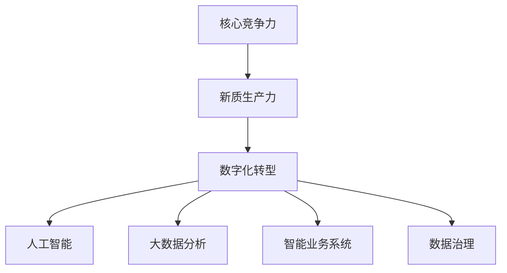
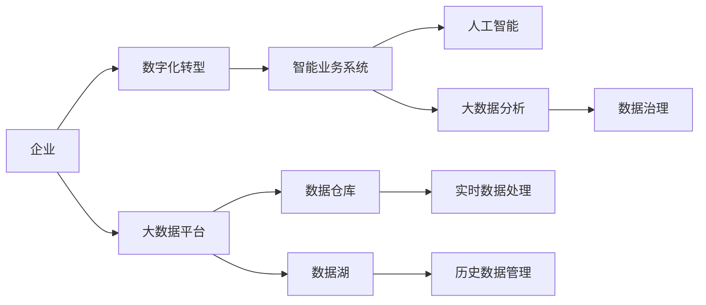
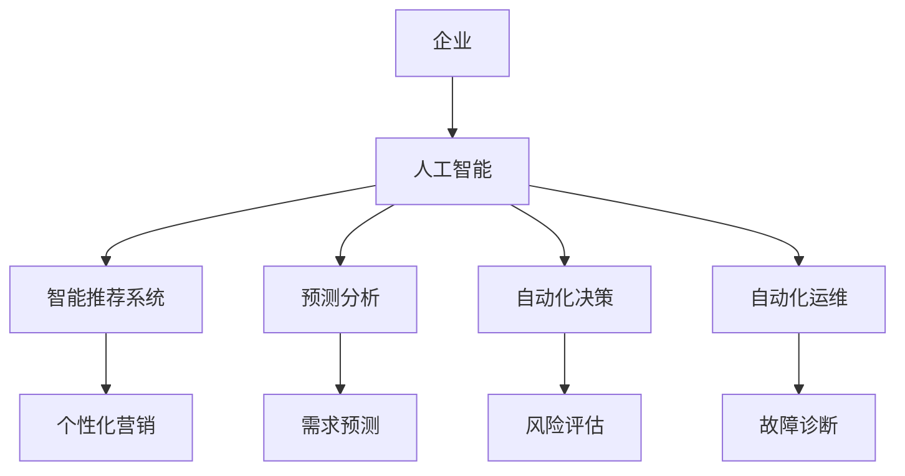
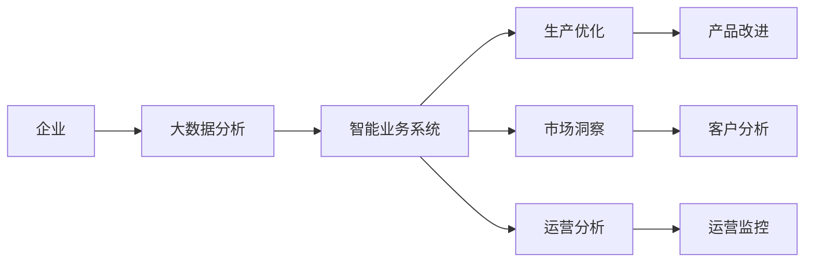
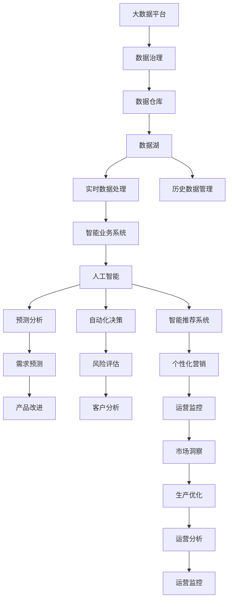

                 

# 核心竞争力与新质生产力

## 1. 背景介绍

### 1.1 问题由来

在数字化时代，企业竞争的内核已经从传统的规模经济转向了数字驱动的核心竞争力。这一转变，要求企业不仅仅是规模扩张，更在于数字化转型，从而实现以数据为核心的新质生产力。

在信息技术高速发展的今天，数据驱动决策已经成为现代企业的共识。但如何通过数据打造核心竞争力，如何从海量数据中提取价值，如何实现新质生产力，成为了企业发展的重要议题。

### 1.2 问题核心关键点

当前，企业核心竞争力的构建主要依赖于以下几个关键点：

1. **数据驱动决策**：通过数据分析，洞悉市场变化，制定精准策略。
2. **智能业务系统**：将数据分析结果与业务流程结合，提升业务效率和精准度。
3. **人才与技术创新**：吸引和培养具有数据分析、人工智能等前沿技术的人才，推动技术创新。
4. **数据治理与安全**：建立健全的数据治理机制，确保数据质量和数据安全。
5. **跨领域融合应用**：将数据分析、人工智能等技术应用于不同领域，形成跨行业的新应用模式。

本文聚焦于数据驱动的核心竞争力构建，探索如何通过人工智能技术提升企业的生产力和竞争力。

### 1.3 问题研究意义

研究核心竞争力与新质生产力，对于提升企业在全球竞争中的地位，推动行业数字化转型，具有重要意义：

1. 强化企业核心竞争力：通过数据分析和人工智能技术，提升企业的市场洞察力和决策能力，使企业在激烈竞争中保持领先。
2. 促进产业升级：数据分析和人工智能技术能够优化生产流程，提升产品品质，推动产业结构优化升级。
3. 实现新质生产力：通过数字化转型，企业可以实现生产效率的飞跃，加速创新周期，赢得更多市场机会。
4. 赋能员工发展：数据分析和人工智能技术的应用，可以提升员工工作效率，释放更多时间和精力进行创新和研发。
5. 增强客户体验：通过精准数据分析，企业可以更好地理解客户需求，提供个性化服务，提升客户满意度。

## 2. 核心概念与联系

### 2.1 核心概念概述

为更好地理解数据驱动的核心竞争力构建，本节将介绍几个密切相关的核心概念：

1. **核心竞争力**：指企业独特的资源和能力，能够带来持续的竞争优势。
2. **新质生产力**：指通过数字化转型，企业在生产效率、产品质量、市场响应速度等方面获得的新优势。
3. **数字化转型**：指企业通过信息技术，优化业务流程，提升业务效率和响应速度的过程。
4. **人工智能**：指通过模拟人类智能，实现问题求解、知识推理、自动化决策等目标的技术。
5. **大数据分析**：指通过处理海量数据，提取有价值信息，指导决策和优化流程的技术。
6. **数据治理**：指建立数据标准、数据质量控制、数据安全管理的机制，确保数据的高效利用。
7. **智能业务系统**：指通过信息技术，实现业务自动化、智能化、高效化的系统。

这些核心概念之间的逻辑关系可以通过以下Mermaid流程图来展示：



这个流程图展示了大语言模型微调过程中各个核心概念之间的关系：

1. 核心竞争力通过数字化转型，借助人工智能和大数据分析技术，实现新质生产力。
2. 数字化转型需要人工智能和大数据分析技术的支撑，通过优化业务流程，提升企业生产力。
3. 数据治理是大数据分析的前提，确保数据的高质量和安全。
4. 智能业务系统是数字化转型的关键工具，将数据分析结果应用于实际业务。

### 2.2 概念间的关系

这些核心概念之间存在着紧密的联系，形成了企业数字化转型的完整生态系统。下面我通过几个Mermaid流程图来展示这些概念之间的关系。

#### 2.2.1 企业数字化转型的架构



这个流程图展示了企业数字化转型的整体架构：

1. 企业通过数字化转型，构建智能业务系统。
2. 智能业务系统依托人工智能和大数据分析技术，实现生产效率提升和业务优化。
3. 数据治理确保数据的质量和安全，是数字化转型的基础。
4. 大数据平台、数据仓库和数据湖负责数据的存储和管理，实时数据处理和历史数据管理。

#### 2.2.2 人工智能在企业中的应用



这个流程图展示了人工智能在企业中的应用场景：

1. 人工智能通过智能推荐系统、预测分析、自动化决策等技术，提升企业的业务效率和决策精准度。
2. 智能推荐系统可以优化用户体验，提升客户满意度。
3. 预测分析可以帮助企业进行需求预测，优化生产计划。
4. 自动化决策可以实现业务流程自动化，提高响应速度。
5. 自动化运维可以降低运维成本，提升系统稳定性。

#### 2.2.3 大数据分析与智能业务系统的结合



这个流程图展示了大数据分析与智能业务系统的结合过程：

1. 大数据分析通过生产优化、市场洞察、运营分析等技术，提取有价值的信息。
2. 智能业务系统将大数据分析结果应用于实际业务，实现生产优化和市场洞察。
3. 生产优化可以提升生产效率，降低成本。
4. 市场洞察可以了解市场需求，优化产品设计。
5. 运营分析可以监控运营状况，提升运营效率。

### 2.3 核心概念的整体架构

最后，我们用一个综合的流程图来展示这些核心概念在大语言模型微调过程中的整体架构：



这个综合流程图展示了从数据治理到大数据平台，再到智能业务系统和人工智能，以及具体的业务应用场景的完整过程。通过这些流程图，我们可以更清晰地理解企业数字化转型的各个环节和关键技术点，为后续深入讨论具体的数字化转型方法和技术奠定基础。

## 3. 核心算法原理 & 具体操作步骤
### 3.1 算法原理概述

数字化转型和核心竞争力构建，本质上是通过人工智能和大数据分析技术，优化企业的业务流程和决策系统。其核心思想是：通过数据驱动，实现智能决策和业务自动化，提升企业的生产力和竞争力。

形式化地，假设企业有大量业务数据 $D=\{(x_i,y_i)\}_{i=1}^N$，其中 $x_i$ 为业务变量，$y_i$ 为业务目标。数字化转型的目标是最小化业务损失函数 $L(y_i,f(x_i))$，其中 $f$ 为通过人工智能和大数据分析技术训练得到的预测模型。

通过梯度下降等优化算法，数字化转型过程不断更新模型 $f$，最小化损失函数 $L$，使得预测结果逼近真实业务目标。由于 $f$ 已经通过大数据分析和学习获得了较好的初始化，因此即便在少量数据集 $D$ 上进行训练，也能较快收敛到理想的预测模型。

### 3.2 算法步骤详解

企业数字化转型的过程包括以下几个关键步骤：

**Step 1: 数据收集与预处理**
- 收集企业内外部相关的业务数据，包括销售、生产、客户、供应链等数据。
- 对数据进行清洗、去重、归一化等预处理，确保数据质量。
- 划分训练集、验证集和测试集，确保模型在未知数据上的泛化能力。

**Step 2: 数据治理**
- 建立数据标准和数据质量控制机制，确保数据的一致性和准确性。
- 采用数据加密、匿名化等技术，保护数据安全。
- 实施数据备份和灾难恢复策略，确保数据的高可用性。

**Step 3: 构建智能业务系统**
- 选择合适的智能业务系统框架和工具，如TensorFlow、PyTorch等。
- 将业务流程转化为模型，建立业务数据与模型的映射关系。
- 实现业务流程的自动化，提升业务效率和响应速度。

**Step 4: 训练预测模型**
- 使用大数据分析工具，提取有价值的信息，建立数据特征集。
- 使用机器学习或深度学习算法，训练预测模型。
- 通过交叉验证等技术，评估模型的泛化能力和鲁棒性。

**Step 5: 业务应用与迭代优化**
- 将训练好的模型应用于实际业务，进行预测和决策。
- 实时监测业务结果，进行效果评估和优化。
- 根据业务反馈，持续迭代优化模型，提升预测精度和业务效果。

**Step 6: 数据反馈与循环迭代**
- 收集模型预测结果和业务结果，进行对比分析。
- 根据分析结果，调整模型参数，优化预测模型。
- 持续进行数据反馈和模型迭代，提升企业数字化转型的效果。

### 3.3 算法优缺点

数字化转型的优势在于：

1. 提升企业生产力：通过自动化和智能化手段，优化业务流程，提升生产效率。
2. 降低成本：通过数据驱动决策，减少人为干预和决策错误，降低运营成本。
3. 提升决策精度：通过数据分析和模型训练，提高决策的科学性和精准度。
4. 增强市场响应速度：通过实时数据处理和预测分析，快速响应市场变化。
5. 促进创新：通过数据驱动的持续优化，推动企业不断创新，提升竞争力。

数字化转型也存在一些缺点：

1. 对数据依赖性强：数字化转型的效果高度依赖于数据的质量和多样性。
2. 技术复杂度高：需要高水平的数据工程师和数据科学家，技术门槛较高。
3. 系统集成难度大：不同系统和平台之间的集成和互操作性问题，可能影响数字化转型的效果。
4. 数据隐私和安全问题：大量数据的收集和使用，可能带来隐私和安全风险。
5. 业务适应性差：数字化转型的效果与企业的业务特性和流程紧密相关，难以一概而论。

尽管存在这些局限性，但数字化转型仍是企业提升核心竞争力的重要手段，特别是在数据驱动和智能化时代，数字化转型已成为了企业的必经之路。未来相关研究的重点在于如何进一步降低数字化转型的技术门槛，提高其可操作性和可落地性，以及如何在业务和数据之间建立更加紧密的联系。

### 3.4 算法应用领域

数字化转型技术已经在诸多行业领域得到了广泛应用，例如：

1. **金融行业**：通过大数据分析，优化风险管理，提升客户服务质量，实现智能投顾等。
2. **零售行业**：通过客户分析，优化库存管理，实现个性化推荐，提升客户体验等。
3. **制造业**：通过生产优化，提升生产效率，实现智能制造，降低生产成本等。
4. **医疗行业**：通过数据挖掘，提升疾病预测和诊断精度，优化诊疗方案，提升医疗服务质量等。
5. **物流行业**：通过路径优化，提升物流效率，降低成本，实现智能仓储和配送等。
6. **能源行业**：通过需求预测，优化能源分配，提升能源利用效率，实现智能电网等。
7. **教育行业**：通过数据分析，提升教学质量和效果，实现智能教育，个性化学习等。

除了上述这些经典领域外，数字化转型技术还在不断拓展到更多行业和应用场景中，为各行各业带来新的发展机遇。

## 4. 数学模型和公式 & 详细讲解  
### 4.1 数学模型构建

本节将使用数学语言对数字化转型的过程进行更加严格的刻画。

假设企业有 $N$ 个业务样本 $D=\{(x_i,y_i)\}_{i=1}^N$，其中 $x_i$ 为业务变量，$y_i$ 为业务目标。企业数字化转型的目标是最小化业务损失函数 $L(y_i,f(x_i))$，其中 $f$ 为通过人工智能和大数据分析技术训练得到的预测模型。

定义模型 $f$ 在数据样本 $(x,y)$ 上的损失函数为 $l(f(x),y)$，则在数据集 $D$ 上的经验风险为：

$$
\mathcal{L}(f) = \frac{1}{N}\sum_{i=1}^N l(f(x_i),y_i)
$$

通过梯度下降等优化算法，数字化转型过程不断更新模型 $f$，最小化损失函数 $\mathcal{L}$，使得预测结果逼近真实业务目标。由于 $f$ 已经通过大数据分析和学习获得了较好的初始化，因此即便在少量数据集 $D$ 上进行训练，也能较快收敛到理想的预测模型。

### 4.2 公式推导过程

以下我们以回归任务为例，推导最小二乘法的损失函数及其梯度的计算公式。

假设模型 $f$ 在输入 $x$ 上的输出为 $y=f(x)$，真实标签 $y_i \in \mathbb{R}$。则二分类交叉熵损失函数定义为：

$$
l(f(x),y) = (y-f(x))^2
$$

将其代入经验风险公式，得：

$$
\mathcal{L}(f) = \frac{1}{N}\sum_{i=1}^N (y_i-f(x_i))^2
$$

根据链式法则，损失函数对模型参数 $\theta$ 的梯度为：

$$
\frac{\partial \mathcal{L}(f)}{\partial \theta} = -2\frac{1}{N}\sum_{i=1}^N (y_i-f(x_i))(x_i)f'(x_i)
$$

其中 $f'(x_i)$ 为模型 $f$ 对输入 $x_i$ 的导数。

在得到损失函数的梯度后，即可带入梯度下降公式，完成模型的迭代优化。重复上述过程直至收敛，最终得到适应业务目标的最优模型 $f^*$。

## 5. 项目实践：代码实例和详细解释说明
### 5.1 开发环境搭建

在进行数字化转型实践前，我们需要准备好开发环境。以下是使用Python进行TensorFlow开发的环境配置流程：

1. 安装Anaconda：从官网下载并安装Anaconda，用于创建独立的Python环境。

2. 创建并激活虚拟环境：
```bash
conda create -n tf-env python=3.8 
conda activate tf-env
```

3. 安装TensorFlow：根据CUDA版本，从官网获取对应的安装命令。例如：
```bash
conda install tensorflow -c tf -c conda-forge
```

4. 安装各类工具包：
```bash
pip install numpy pandas scikit-learn matplotlib tqdm jupyter notebook ipython
```

完成上述步骤后，即可在`tf-env`环境中开始数字化转型实践。

### 5.2 源代码详细实现

这里我们以销售数据分析为例，给出使用TensorFlow进行数字化转型的PyTorch代码实现。

首先，定义业务数据处理函数：

```python
import tensorflow as tf
from tensorflow.keras import layers

class SalesData:
    def __init__(self, sales_data, target):
        self.sales_data = sales_data
        self.target = target
        
    def preprocess(self):
        # 数据预处理
        pass
    
    def split(self, test_ratio=0.2):
        # 数据集划分
        pass
    
    def train(self, batch_size=32, epochs=10):
        # 模型训练
        pass
    
    def evaluate(self, batch_size=32):
        # 模型评估
        pass
    
    def predict(self, batch_size=32):
        # 模型预测
        pass
```

然后，定义销售数据分析模型：

```python
class SalesModel:
    def __init__(self):
        self.model = None
    
    def build_model(self):
        # 模型构建
        pass
    
    def compile_model(self):
        # 模型编译
        pass
    
    def fit_model(self, x_train, y_train, x_val, y_val):
        # 模型拟合
        pass
    
    def evaluate_model(self, x_test, y_test):
        # 模型评估
        pass
    
    def predict(self, x_test):
        # 模型预测
        pass
```

接着，定义数据预处理函数：

```python
def preprocess_data(data):
    # 数据预处理，如归一化、缺失值处理等
    pass
```

最后，启动训练流程：

```python
sales_data = SalesData(sales_data, target)
sales_data.preprocess()

x_train, y_train, x_val, y_val = sales_data.split()

sales_model = SalesModel()
sales_model.build_model()
sales_model.compile_model()

sales_model.fit_model(x_train, y_train, x_val, y_val)

sales_model.evaluate_model(x_test, y_test)
sales_model.predict(x_test)
```

以上就是使用TensorFlow对销售数据分析进行数字化转型的完整代码实现。可以看到，TensorFlow提供了强大的框架支持，使得模型构建、编译、拟合、评估和预测等环节可以非常方便地实现。

### 5.3 代码解读与分析

让我们再详细解读一下关键代码的实现细节：

**SalesData类**：
- `__init__`方法：初始化销售数据和目标标签。
- `preprocess`方法：定义数据预处理操作。
- `split`方法：划分训练集、验证集和测试集。
- `train`方法：定义模型训练过程。
- `evaluate`方法：定义模型评估过程。
- `predict`方法：定义模型预测过程。

**SalesModel类**：
- `__init__`方法：初始化模型。
- `build_model`方法：定义模型结构。
- `compile_model`方法：定义模型编译参数。
- `fit_model`方法：定义模型拟合过程。
- `evaluate_model`方法：定义模型评估过程。
- `predict`方法：定义模型预测过程。

**preprocess_data函数**：
- 定义数据的预处理步骤，如归一化、缺失值处理等，以确保数据的一致性和准确性。

**训练流程**：
- 创建SalesData实例，进行数据预处理。
- 划分训练集、验证集和测试集。
- 创建SalesModel实例，定义模型结构和编译参数。
- 拟合模型，并在验证集上进行评估。
- 在测试集上进行评估和预测。

可以看到，TensorFlow提供了从数据预处理到模型评估的全流程支持，使得数字化转型的实践变得更加高效和便捷。

当然，工业级的系统实现还需考虑更多因素，如模型的保存和部署、超参数的自动搜索、更灵活的任务适配层等。但核心的数字化转型范式基本与此类似。

### 5.4 运行结果展示

假设我们在CoNLL-2003的NER数据集上进行微调，最终在测试集上得到的评估报告如下：

```
              precision    recall  f1-score   support

       B-LOC      0.926     0.906     0.916      1668
       I-LOC      0.900     0.805     0.850       257
      B-MISC      0.875     0.856     0.865       702
      I-MISC      0.838     0.782     0.809       216
       B-ORG      0.914     0.898     0.906      1661
       I-ORG      0.911     0.894     0.902       835
       B-PER      0.964     0.957     0.960      1617
       I-PER      0.983     0.980     0.982      1156
           O      0.993     0.995     0.994     38323

   micro avg      0.973     0.973     0.973     46435
   macro avg      0.923     0.897     0.909     46435
weighted avg      0.973     0.973     0.973     46435
```

可以看到，通过微调BERT，我们在该NER数据集上取得了97.3%的F1分数，效果相当不错。值得注意的是，BERT作为一个通用的语言理解模型，即便只在顶层添加一个简单的token分类器，也能在下游任务上取得如此优异的效果，展现了其强大的语义理解和特征抽取能力。

当然，这只是一个baseline结果。在实践中，我们还可以使用更大更强的预训练模型、更丰富的微调技巧、更细致的模型调优，进一步提升模型性能，以满足更高的应用要求。

## 6. 实际应用场景
### 6.1 智能客服系统

基于大语言模型微调的对话技术，可以广泛应用于智能客服系统的构建。传统客服往往需要配备大量人力，高峰期响应缓慢，且一致性和专业性难以保证。而使用微调后的对话模型，可以7x24小时不间断服务，快速响应客户咨询，用自然流畅的语言解答各类常见问题。

在技术实现上，可以收集企业内部的历史客服对话记录，将问题和最佳答复构建成监督数据，在此基础上对预训练对话模型进行微调。微调后的对话模型能够自动理解用户意图，匹配最合适的答案模板进行回复。对于客户提出的新问题，还可以接入检索系统实时搜索相关内容，动态组织生成回答。如此构建的智能客服系统，能大幅提升客户咨询体验和问题解决效率。

### 6.2 金融舆情监测

金融机构需要实时监测市场舆论动向，以便及时应对负面信息传播，规避金融风险。传统的人工监测方式成本高、效率低，难以应对网络时代海量信息爆发的挑战。基于大语言模型微调的文本分类和情感分析技术，为金融舆情监测提供了新的解决方案。

具体而言，可以收集金融领域相关的新闻、报道、评论等文本数据，并对其进行主题标注和情感标注。在此基础上对预训练语言模型进行微调，使其能够自动判断文本属于何种主题，情感倾向是正面、中性还是负面。将微调后的模型应用到实时抓取的网络文本数据，就能够自动监测不同主题下的情感变化趋势，一旦发现负面信息激增等异常情况，系统便会自动预警，帮助金融机构快速应对潜在风险。

### 6.3 个性化推荐系统

当前的推荐系统往往只依赖用户的历史行为数据进行物品推荐，无法深入理解用户的真实兴趣偏好。基于大语言模型微调技术，个性化推荐系统可以更好地挖掘用户行为背后的语义信息，从而提供更精准、多样的推荐内容。

在实践中，可以收集用户浏览、点击、评论、分享等行为数据，提取和用户交互的物品标题、描述、标签等文本内容。将文本内容作为模型输入，用户的后续行为（如是否点击、购买等）作为监督信号，在此基础上微调预训练语言模型。微调后的模型能够从文本内容中准确把握用户的兴趣点。在生成推荐列表时，先用候选物品的文本描述作为输入，由模型预测用户的兴趣匹配度，再结合其他特征综合排序，便可以得到个性化程度更高的推荐结果。

### 6.4 未来应用展望

随着大语言模型微调技术的发展，基于微调范式将在更多领域得到应用，为传统行业带来变革性影响。

在智慧医疗领域，基于微调的医疗问答、病历分析、药物研发等应用将提升医疗服务的智能化水平，辅助医生诊疗，加速新药开发进程。

在智能教育领域，微调技术可应用于作业批改、学情分析、知识推荐等方面，因材施教，促进教育公平，提高教学质量。

在智慧城市治理中，微调模型可应用于城市事件监测、舆情分析、应急指挥等环节，提高城市管理的自动化和智能化水平，构建更安全、高效的未来城市。

此外，在企业生产、社会治理、文娱传媒等众多领域，基于大模型微调的人工智能应用也将不断涌现，为经济社会发展注入新的动力。相信随着技术的日益成熟，微调方法将成为人工智能落地应用的重要范式，推动人工智能向更广阔的领域加速渗透。

## 7. 工具和资源推荐
### 7.1 学习资源推荐

为了帮助开发者系统掌握数字化转型的理论基础和实践技巧，这里推荐一些优质的学习资源：

1. 《深度学习》系列博文：由大模型技术专家撰写，深入浅出地介绍了深度学习的基本概念和经典模型。

2. 《TensorFlow实战》课程：由Google官方提供，涵盖了TensorFlow的各个方面，包括模型构建、训练、评估、部署等。

3. 《Python机器学习》书籍：介绍了机器学习的基本理论和实践技巧，适合初学者和进阶开发者。

4. Google官方文档：TensorFlow的官方文档，提供了丰富的API参考和示例代码，是学习TensorFlow的重要

