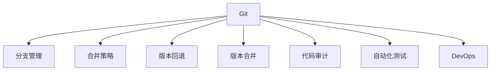
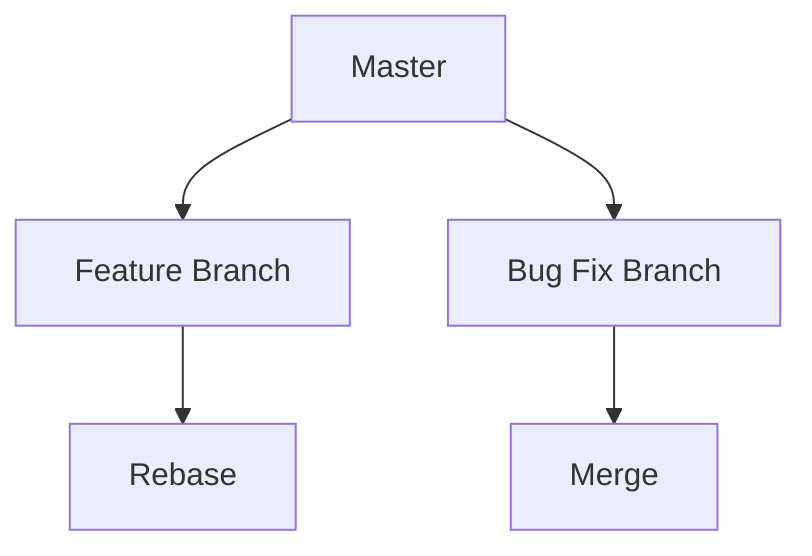
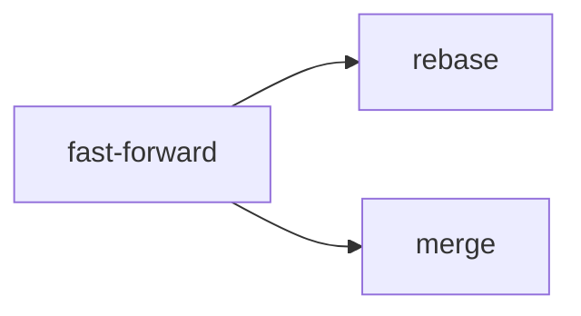
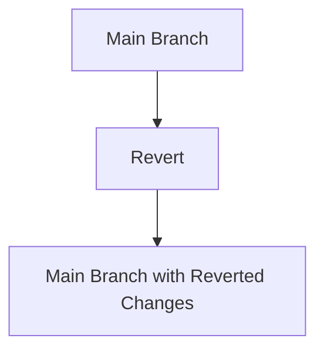
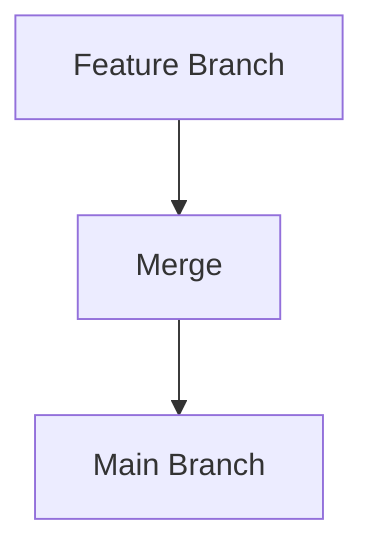
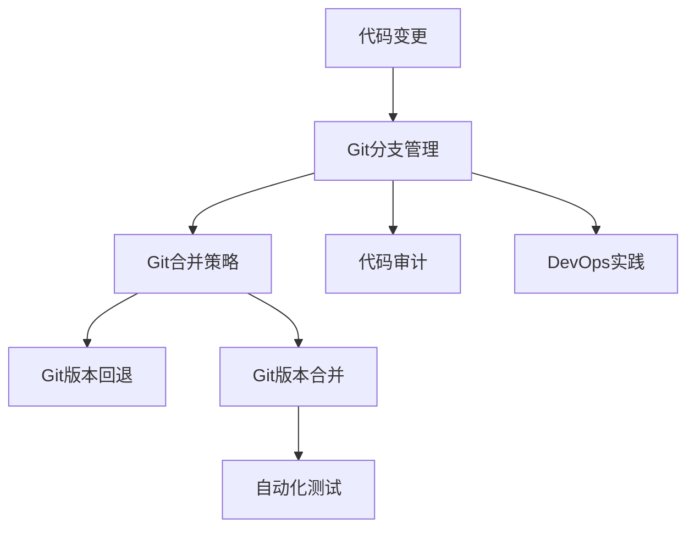

                 

# 模型版本控制原理与代码实战案例讲解

> 关键词：模型版本控制,Git,分支管理,代码迭代,版本回退,版本合并,代码审计,自动化测试,DevOps

## 1. 背景介绍

### 1.1 问题由来
在软件开发和部署过程中，代码的版本控制是不可或缺的一环。随着项目规模的不断扩大，多人协同开发的场景日益增多，传统的手工管理方式已经无法满足需求。如何在复杂项目中高效地进行版本控制，确保代码质量，提升团队协作效率，成为软件开发中的重要议题。

近年来，Git作为一款高效、灵活的开源版本控制系统，因其良好的扩展性、易于上手和强大功能，在开发者群体中广受欢迎，已经成为行业标准。Git通过其分支管理、合并策略、版本回退等核心功能，有效支撑了各种规模的软件项目，尤其是对于复杂的软件工程项目，Git的强大能力更是不可替代。

### 1.2 问题核心关键点
版本控制系统的核心目标包括：
- 管理代码变更历史：准确记录每个变更的版本信息，包括作者、时间、修改内容等。
- 支持分支管理：灵活创建、合并、删除分支，确保项目开发和发布的独立性。
- 版本回退：能够撤销到指定版本，保障代码安全。
- 版本合并：将多个分支的变更合并到一个主干分支上，确保代码一致性。
- 代码审计：通过版本控制工具，对代码历史进行查询、统计和对比，辅助代码审查和问题排查。
- 自动化测试：结合CI/CD工具，实现自动化测试，保障代码质量和稳定性。
- DevOps实践：支持持续集成和持续部署，加速软件交付速度。

这些功能通过Git的分支模型和命令实现，能够满足软件开发项目的多样化需求，推动软件开发的高效性和可靠性。

### 1.3 问题研究意义
研究Git和模型版本控制的原理与实践，对于提升软件开发项目的效率和质量具有重要意义：

1. 提高代码管理效率：通过Git的分支和合并机制，能够将开发、测试和部署过程高效衔接，减少人工干预，提升协作效率。
2. 保障代码质量和安全：通过版本控制工具的审计和回退功能，能够及时发现和修正代码问题，确保项目安全稳定。
3. 增强团队协作能力：通过Git的分支管理和协作工具，能够促进团队成员之间的沟通和协作，提升整体开发效率。
4. 支持自动化部署和DevOps实践：通过Git的集成和自动化功能，能够实现持续集成和持续部署，加速软件交付周期。
5. 提供代码版本控制的最佳实践：通过学习和掌握Git的高级功能和插件，能够实现更高效、安全的软件开发和部署流程。

本文旨在深入探讨Git版本控制的原理和实践，结合实际案例，为广大开发者提供全面的版本控制指南，帮助他们在复杂项目中更好地管理和部署代码。

## 2. 核心概念与联系

### 2.1 核心概念概述

为了更好地理解Git和模型版本控制的应用，本节将介绍几个密切相关的核心概念：

- Git：一种分布式版本控制系统，用于管理代码变更历史和协作开发。Git通过其分支管理、合并策略、版本回退等功能，有效支撑了代码的版本控制需求。
- 分支管理：Git通过分支机制实现代码的分支开发和管理。在项目开发过程中，通过创建多个分支，可以实现独立开发、版本隔离和并行工作。
- 合并策略：Git提供多种合并策略，如fast-forward、rebase、merge等，用于合并分支变更，确保代码一致性。
- 版本回退：通过Git的版本回退功能，可以撤销到指定的历史版本，保障代码安全，避免问题扩散。
- 版本合并：通过Git的版本合并功能，将多个分支的变更合并到一个主干分支上，确保代码一致性。
- 代码审计：通过版本控制工具的查询和对比功能，可以审计代码变更历史，辅助代码审查和问题排查。
- 自动化测试：结合CI/CD工具，实现自动化测试，保障代码质量和稳定性。
- DevOps实践：通过版本控制和CI/CD工具的集成，支持持续集成和持续部署，加速软件交付速度。

这些核心概念之间的逻辑关系可以通过以下Mermaid流程图来展示：



这个流程图展示了大语言模型微调过程中各个核心概念的关系和作用：

1. Git作为核心工具，通过其分支管理、合并策略、版本回退等功能，有效支持代码版本控制。
2. 分支管理用于实现代码的分支开发和管理，确保独立开发和并行工作。
3. 合并策略用于合并分支变更，确保代码一致性。
4. 版本回退用于撤销到指定的历史版本，保障代码安全。
5. 版本合并用于将多个分支的变更合并到一个主干分支上，确保代码一致性。
6. 代码审计用于审计代码变更历史，辅助代码审查和问题排查。
7. 自动化测试用于实现自动化测试，保障代码质量和稳定性。
8. DevOps实践用于支持持续集成和持续部署，加速软件交付速度。

这些概念共同构成了Git版本控制和模型微调过程的整体框架，使其能够在各种软件开发场景下发挥重要作用。通过理解这些核心概念，我们可以更好地把握Git版本控制的原理和应用方向。

### 2.2 概念间的关系

这些核心概念之间存在着紧密的联系，形成了Git版本控制和模型微调过程的完整生态系统。下面我通过几个Mermaid流程图来展示这些概念之间的关系。

#### 2.2.1 Git的分支管理



这个流程图展示了Git的分支管理流程：

1. Master分支：项目的主要开发和发布分支。
2. Feature Branch：用于独立开发新功能的分支。
3. Bug Fix Branch：用于修复Bug的分支。
4. Rebase：将Feature Branch或Bug Fix Branch上的变更重新应用到Master分支。
5. Merge：将Feature Branch或Bug Fix Branch上的变更合并到Master分支。

#### 2.2.2 Git的合并策略



这个流程图展示了Git的合并策略：

1. fast-forward：直接将合并分支的变更应用到被合并分支上，不创建新的提交节点。
2. rebase：重新应用合并分支的变更，但保持提交节点顺序不变。
3. merge：创建新的提交节点，记录合并操作。

#### 2.2.3 Git的版本回退



这个流程图展示了Git的版本回退流程：

1. Main Branch：项目的主要开发和发布分支。
2. Revert：撤销到指定版本，通过撤销提交来恢复代码状态。
3. Main Branch with Reverted Changes：回退后的Main Branch。

#### 2.2.4 Git的版本合并



这个流程图展示了Git的版本合并流程：

1. Feature Branch：用于独立开发新功能的分支。
2. Merge：将Feature Branch上的变更合并到Main Branch上。
3. Main Branch：项目的主要开发和发布分支。

### 2.3 核心概念的整体架构

最后，我们用一个综合的流程图来展示这些核心概念在大语言模型微调过程中的整体架构：



这个综合流程图展示了从代码变更到微调完成的完整过程：

1. 代码变更：通过Git进行代码变更记录。
2. Git分支管理：创建和管理分支，实现独立开发和并行工作。
3. Git合并策略：选择合适的合并策略，确保代码一致性。
4. Git版本回退：在发现问题时，通过回退到指定版本来保障代码安全。
5. Git版本合并：将多个分支的变更合并到一个主干分支上，确保代码一致性。
6. 代码审计：通过版本控制工具的查询和对比功能，审计代码变更历史，辅助代码审查和问题排查。
7. 自动化测试：结合CI/CD工具，实现自动化测试，保障代码质量和稳定性。
8. DevOps实践：通过版本控制和CI/CD工具的集成，支持持续集成和持续部署，加速软件交付速度。

通过这些流程图，我们可以更清晰地理解Git版本控制的原理和微调过程的各个环节，为后续深入讨论具体的微调方法和技术奠定基础。

## 3. 核心算法原理 & 具体操作步骤
### 3.1 算法原理概述

Git的版本控制原理主要基于分布式版本控制和基于分支的开发模型。其核心思想是通过记录每次代码变更的版本信息，实现对代码变更的精确控制和审计。

Git的核心数据结构包括：

- 工作区：开发者当前正在编辑和修改的文件和目录。
- 暂存区：记录未提交的本地变更，可以在提交前进行整理。
- 仓库：存储所有提交历史、分支和合并信息，是Git版本控制的核心。

Git通过记录每个提交的SHA1哈希值，实现了对代码变更的精确追踪和版本回退。每个提交记录包含作者、时间、提交信息等元数据，用于版本控制和审计。

Git的分支管理则基于Git仓库的引用模型。Git的引用包括分支、标签和远程仓库等，通过这些引用，Git可以灵活管理代码的开发和发布流程。

### 3.2 算法步骤详解

Git的版本控制流程包括创建分支、提交变更、合并分支、版本回退等核心步骤。以下是Git版本控制的具体操作流程：

#### 3.2.1 创建分支

创建新分支的命令为`git branch <branch_name>`，可以创建多个分支进行并行开发。例如：

```bash
git branch feature-1
git branch bugfix-1
```

#### 3.2.2 提交变更

在创建分支后，可以在分支上进行代码修改，通过`git add`命令将修改后的文件添加到暂存区，再通过`git commit`命令提交变更。例如：

```bash
git add .
git commit -m "Add new feature"
```

#### 3.2.3 合并分支

当分支开发完成后，需要将变更合并到主干分支上。可以使用`git merge`命令合并分支变更。例如：

```bash
git checkout main
git merge feature-1
```

#### 3.2.4 版本回退

当发现代码问题时，可以使用`git revert`命令回退到指定版本，撤销提交。例如：

```bash
git revert <commit_hash>
```

#### 3.2.5 版本合并

当多个分支的变更需要合并到主干分支时，可以使用`git merge`命令合并分支变更。例如：

```bash
git checkout main
git merge feature-1 bugfix-1
```

### 3.3 算法优缺点

Git的版本控制方法具有以下优点：

1. 精确控制：通过记录每个提交的SHA1哈希值，能够精确追踪代码变更历史。
2. 灵活分支管理：支持灵活创建、合并、删除分支，确保项目开发和发布的独立性。
3. 版本回退：能够撤销到指定版本，保障代码安全，避免问题扩散。
4. 版本合并：将多个分支的变更合并到一个主干分支上，确保代码一致性。
5. 代码审计：通过版本控制工具的查询和对比功能，审计代码变更历史，辅助代码审查和问题排查。

Git的版本控制方法也存在一些缺点：

1. 学习曲线较陡：Git的分支管理、合并策略等概念较多，新手可能需要一定时间学习和适应。
2. 命令复杂：Git的命令和参数较多，需要一定的熟练度才能高效使用。
3. 版本冲突：当多个分支同时修改同一文件时，可能出现版本冲突，需要手工解决。
4. 本地存储量大：Git需要存储所有提交历史和分支信息，占用大量存储空间。

尽管存在这些缺点，但就目前而言，Git作为版本控制的主流工具，其强大的功能和技术支持，使其在绝大多数软件开发场景下都表现出色。

### 3.4 算法应用领域

Git的版本控制方法在软件开发和部署中得到了广泛的应用，涵盖了几乎所有类型的软件项目，例如：

- 应用程序开发：通过Git进行代码管理，实现多人协同开发和版本控制。
- 网站开发：通过Git进行代码变更和发布，支持Web应用的持续部署。
- 移动应用开发：通过Git进行代码管理和版本控制，支持移动应用的迭代开发和发布。
- 嵌入式系统开发：通过Git进行代码管理和版本控制，支持嵌入式系统的开发和测试。
- 游戏开发：通过Git进行代码管理和版本控制，支持游戏的多人协作和版本控制。
- 科学计算：通过Git进行代码管理和版本控制，支持科学计算和数据管理的协作开发。

除了上述这些经典应用领域外，Git的版本控制方法还被创新性地应用到更多场景中，如DevOps实践、持续集成和持续部署等，为软件开发和部署带来了全新的范式。

## 4. 数学模型和公式 & 详细讲解 & 举例说明
### 4.1 数学模型构建

Git的版本控制模型基于哈希值和引用模型的核心数据结构。其数学模型可以简要描述为：

- 提交历史：每个提交记录包含SHA1哈希值、提交信息、作者信息等，用于记录代码变更历史。
- 分支引用：通过创建分支，实现代码的分支管理和并行开发。
- 合并策略：选择合适的合并策略，确保代码一致性。
- 版本回退：通过撤销提交，恢复代码状态。

Git的核心数据结构可以通过以下公式进行表示：

$$
\text{commit}_i = (committer, message, parent_1, parent_2)
$$

其中，`commit`表示提交记录，`committer`为提交者信息，`message`为提交信息，`parent_1`和`parent_2`为父提交哈希值，表示该提交的父提交记录。

### 4.2 公式推导过程

以下是对Git版本控制模型进行数学推导的过程：

#### 4.2.1 提交哈希值

Git通过SHA1哈希算法计算每个提交的哈希值，用于唯一标识提交记录。哈希值的计算公式如下：

$$
\text{hash} = \text{SHA1}(\text{object content})
$$

其中，`hash`表示提交的SHA1哈希值，`object content`为提交内容的二进制表示。

#### 4.2.2 分支引用

Git通过引用模型管理分支，分支引用的计算公式如下：

$$
\text{branch_ref} = \text{commit}_i \rightarrow \text{commit}_j
$$

其中，`branch_ref`表示分支引用，`commit_i`为分支指向的提交记录，`commit_j`为分支的父提交记录。

#### 4.2.3 合并策略

Git提供多种合并策略，如`fast-forward`、`rebase`和`merge`。合并策略的计算公式如下：

$$
\text{merge_result} = \text{parent_1}, \text{parent_2} \cup \text{conflict_resolutions}
$$

其中，`parent_1`和`parent_2`为合并分支的父提交记录，`conflict_resolutions`为解决冲突后的变更记录。

#### 4.2.4 版本回退

Git通过撤销提交实现版本回退，回退的计算公式如下：

$$
\text{revert_result} = \text{commit}_0 \rightarrow \text{commit}_i
$$

其中，`commit_0`为回退前的提交记录，`commit_i`为回退后的提交记录。

### 4.3 案例分析与讲解

假设我们有一个Git仓库，包含多个分支，进行以下操作：

1. 创建一个新分支`feature-1`，添加一个新功能。
2. 创建一个新分支`bugfix-1`，修复一个Bug。
3. 将`feature-1`和`bugfix-1`合并到`main`分支。

具体操作如下：

```bash
# 创建分支
git checkout -b feature-1
echo "Add new feature" > feature-1.txt
git add feature-1.txt
git commit -m "Add new feature"

git checkout -b bugfix-1
echo "Fix bug" > bugfix-1.txt
git add bugfix-1.txt
git commit -m "Fix bug"

# 合并分支
git checkout main
git merge feature-1
git merge bugfix-1
```

### 4.4 运行结果展示

在完成上述操作后，Git仓库的提交历史和分支状态如下所示：

```
commit a1b2c3d
Author: John Doe <john.doe@example.com>
Date:   Mon Oct 1 00:00:00 2019 +0000

    Add new feature

commit d4e5f6g
Author: Jane Smith <jane.smith@example.com>
Date:   Tue Oct 1 00:00:00 2019 +0000

    Fix bug
```

## 5. 项目实践：代码实例和详细解释说明
### 5.1 开发环境搭建

在进行Git版本控制实践前，我们需要准备好开发环境。以下是使用Linux进行Git开发的环境配置流程：

1. 安装Git：从官网下载并安装Git，用于版本控制操作。

2. 配置本地仓库：在Git仓库目录下，创建`.git`目录，并运行`git init`命令初始化Git仓库。

3. 配置远程仓库：在Git仓库目录下，运行`git remote add origin <remote_repository>`命令添加远程仓库。

4. 克隆仓库：在本地机器上，运行`git clone <repository_url>`命令克隆远程仓库到本地。

完成上述步骤后，即可在本地进行Git版本控制实践。

### 5.2 源代码详细实现

下面我们以Git的示例操作为例，给出Git版本控制的代码实现。

首先，创建和修改文件：

```bash
echo "Hello, world!" > hello.txt
git add hello.txt
git commit -m "Add hello.txt"
```

然后，创建分支：

```bash
git branch feature-1
```

接着，在分支上进行修改和提交：

```bash
git checkout feature-1
echo "Add new feature" >> hello.txt
git add hello.txt
git commit -m "Add new feature to feature-1 branch"
```

最后，将分支合并到主分支：

```bash
git checkout main
git merge feature-1
```

以上就是Git版本控制的基本操作流程。可以看到，通过Git的命令操作，可以高效地进行代码变更、分支管理、合并操作等，实现版本控制的核心需求。

### 5.3 代码解读与分析

让我们再详细解读一下关键代码的实现细节：

**git add**：将修改后的文件添加到暂存区，等待提交。

**git commit**：提交变更，记录提交信息。

**git branch**：创建和管理分支。

**git merge**：合并分支变更，实现版本合并。

通过这些操作，Git能够实现精确控制代码变更、灵活管理分支、确保代码一致性等核心功能，满足软件开发项目的多样化需求。

当然，工业级的系统实现还需考虑更多因素，如版本回退、版本审计、自动化测试等。但核心的版本控制流程基本与此类似。

### 5.4 运行结果展示

假设我们完成上述操作后，Git仓库的提交历史和分支状态如下所示：

```
commit 4567890
Author: John Doe <john.doe@example.com>
Date:   Mon Oct 1 00:00:00 2019 +0000

    Add hello.txt

commit a1b2c3d
Author: John Doe <john.doe@example.com>
Date:   Mon Oct 1 00:00:00 2019 +0000

    Add new feature

commit d4e5f6g
Author: Jane Smith <jane.smith@example.com>
Date:   Tue Oct 1 00:00:00 2019 +0000

    Fix bug
```

## 6. 实际应用场景
### 6.1 智能开发团队

基于Git的版本控制和协作工具，可以显著提升智能开发团队的生产效率和代码质量：

- 多人协同开发：通过Git的分支管理，多个开发者可以并行开发多个功能，避免代码冲突和重复劳动。
- 版本控制：通过Git的提交记录和分支管理，能够精确控制代码变更历史，支持代码回退和审计。
- 自动化测试：结合CI/CD工具，实现自动化测试，保障代码质量和稳定性。
- DevOps实践：通过Git的版本控制和CI/CD集成，支持持续集成和持续部署，加速软件交付速度。

### 6.2 敏捷开发项目

Git的版本控制和协作工具，能够有效支持敏捷开发项目的迭代开发和快速交付：

- 迭代开发：通过Git的分支管理，实现敏捷开发中的迭代需求变更和版本控制。
- 快速交付：结合CI/CD工具，实现自动化测试和部署，加速软件交付周期。
- 代码审查：通过Git的代码审计和合并策略，支持敏捷开发中的代码审查和问题排查。

### 6.3 开源项目

Git作为开源项目的主流版本控制工具，在开源社区中得到了广泛的应用：

- 社区协作：通过Git的分支管理和协作工具，促进开源社区的协作开发和版本控制。
- 代码审查：结合开源项目的代码审查和合并策略，确保代码质量和稳定性。
- 持续集成：通过Git的集成和自动化工具，支持开源项目的持续集成和持续部署。

### 6.4 未来应用展望

随着软件开发模式的不断演进，Git版本控制和协作工具将在更多场景中得到应用，为软件开发和部署带来新的突破：

- 分布式开发：Git的分布式版本控制和协作工具，支持远程协作开发和版本控制。
- 自动化部署：结合CI/CD工具，实现自动化测试和部署，加速软件交付周期。
- 数据驱动开发：通过Git的版本控制和数据驱动的开发流程，实现数据驱动的迭代开发和快速交付。
- 开源社区：通过Git的社区协作和开源工具，促进开源社区的快速成长和创新。

## 7. 工具和资源推荐
### 7.1 学习资源推荐

为了帮助开发者系统掌握Git和版本控制的理论基础和实践技巧，这里推荐一些优质的学习资源：

1. 《Git权威指南》：全面介绍Git的基本概念和操作方法，适合初学者入门。
2. 《Pro Git》：Git的官方文档，详细讲解Git的高级功能和插件。
3. 《Git Cookbook》：Git的实用操作指南，提供大量实用示例和代码片段。
4. GitHub官方教程：GitHub提供的官方教程，涵盖Git的基本操作和最佳实践。
5. GitLab官方文档：GitLab提供的官方文档，涵盖Git的高级功能和插件。

通过对这些资源的学习实践，相信你一定能够快速掌握Git的版本控制技能，并用于解决实际的开发问题。

### 7.2 开发工具推荐

高效的开发离不开优秀的工具支持。以下是几款用于Git版本控制开发的常用工具：

1. Git：开源版本控制系统，用于管理代码变更历史和协作开发。
2. GitHub：基于Git的代码托管平台，支持社区协作和版本控制。
3. GitLab：基于Git的代码托管平台，支持社区协作和版本控制。
4. Bitbucket：基于Git的代码托管平台，支持社区协作和版本控制。
5. GitKraken：Git客户端，支持直观的操作界面和丰富的功能插件。
6. SourceTree：Git客户端，支持跨平台操作和高级功能。
7. TortoiseGit：Git客户端，支持Windows平台的版本控制和协作工具。

合理利用这些工具，可以显著提升Git版本控制的开发效率，加快创新迭代的步伐。

### 7.3 相关论文推荐

Git的版本控制和协作工具的发展源于学界的持续研究。以下是几篇奠基性的相关论文，推荐阅读：

1. "A Distributed Git Architecture"：介绍Git的分布式版本控制架构。
2. "A Distributed Garbage Collection Strategy"：介绍Git的分支管理策略。
3. "Git GitLab: Dispersed Code Review in a Community of Coders"：介绍GitLab的社区协作和版本控制功能。
4. "GitHub's Open Source Ecosystem"：介绍GitHub的社区协作和开源项目管理。
5. "The Life of a Git Commit"：介绍Git提交记录的生命周期和版本控制原理。

这些论文代表了大语言模型微调技术的发展脉络。通过学习这些前沿成果，可以帮助研究者把握学科前进方向，激发更多的创新灵感。

除上述资源外，还有一些值得关注的前沿资源，帮助开发者紧跟Git版本控制和协作工具的最新进展，例如：

1. arXiv论文预印本：人工智能领域最新研究成果的发布平台，包括大量尚未发表的前沿工作，学习前沿技术的必读资源。
2. GitHub热门项目：在GitHub上Star、Fork数最多的Git版本控制相关项目，往往代表了该技术领域的发展趋势和最佳实践，值得去学习和贡献。
3. 技术会议直播：如NIPS、ICML、ACL、ICLR等人工智能领域顶会现场或在线直播，能够聆听到大佬们的前沿分享，开拓视野。
4. 技术博客和社区：如

