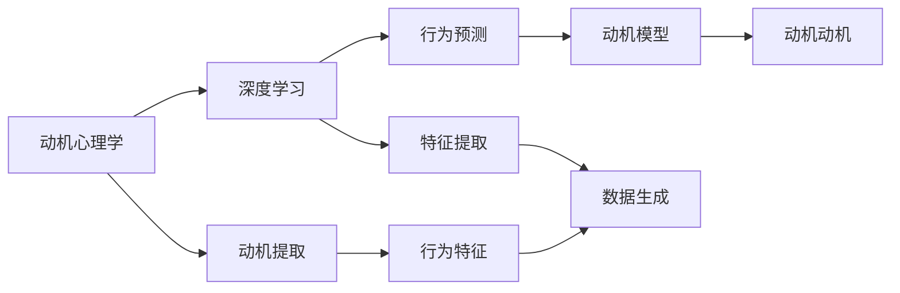

                 

# 欲望地图3D：AI绘制的立体动机模型

> 关键词：欲望地图, AI动机模型, 动机心理学, 行为预测, 深度学习, 决策理论

## 1. 背景介绍

### 1.1 问题由来
在人工智能领域，我们常常关注如何通过算法提升决策的效率和效果。然而，决策不仅仅是一个数学问题，更是一个涉及心理学、经济学和人类行为学的复杂系统。在人类社会中，动机是驱动个体做出行为选择的关键因素，理解并模拟动机机制对于构建智能化决策系统至关重要。

近年来，随着深度学习和神经网络技术的发展，AI模型已经能够在图像识别、语音识别等任务中取得优异表现。但如何将动机心理学的理论应用于AI模型，使得AI能够“思考”和“决策”，仍然是一个亟待解决的难题。为了突破这一瓶颈，研究者们提出了基于深度学习的动机模型，试图模拟人类决策行为，并用于预测和优化。

本文将介绍一种名为“欲望地图3D”的动机模型，并通过此模型，探索如何利用AI技术深入理解并模拟人类的动机机制，以及这种模型在实际应用中的潜力和挑战。

## 2. 核心概念与联系

### 2.1 核心概念概述

欲望地图3D是一种结合了深度学习和动机心理学的多维度动机模型。该模型旨在通过多维度的特征提取和情感推理，全面捕捉和模拟人类动机，进而预测个体在不同情境下的行为选择。

其核心概念包括以下几点：
- **动机心理学**：研究人类动机的基本理论，如马斯洛的需求层次、自我决定理论等。
- **深度学习**：一种基于神经网络的学习方法，能够从数据中学习复杂的特征和模式。
- **行为预测**：通过模型预测个体在特定情境下的行为选择，如购买决策、健康选择等。

这些概念之间通过动机心理学为桥梁，形成了一种从理论到实践的联系。动机心理学提供了理论基础，而深度学习则提供了实现这一理论的技术手段。行为预测则是将理论和技术结合，应用于实际问题中的目标。

### 2.2 概念间的关系

下图展示了欲望地图3D模型中各个核心概念之间的逻辑关系：



该图展示了模型从动机心理学的理论出发，通过深度学习提取行为特征，再结合动机动机进行行为预测的整个流程。

## 3. 核心算法原理 & 具体操作步骤
### 3.1 算法原理概述

欲望地图3D模型通过深度学习技术，结合动机心理学的理论，实现对人类动机的全面模拟。其核心算法原理包括以下几个方面：

- **动机特征提取**：通过深度学习模型，从用户的输入数据中提取动机相关的特征。这些特征可能包括用户的心理状态、情感倾向、行为模式等。
- **情感推理**：利用深度学习模型，对用户的动机特征进行情感分析，推断出用户的动机状态。
- **动机动机**：结合动机心理学的理论，将情感推理的结果映射到动机状态，生成动机动机图谱。
- **行为预测**：根据动机动机图谱，结合行为规则和知识库，预测用户在不同情境下的行为选择。

### 3.2 算法步骤详解

欲望地图3D模型的构建和应用包括以下关键步骤：

**Step 1: 数据收集与预处理**
- 收集用户行为数据，如购物记录、健康数据、社交网络互动等。
- 对数据进行清洗、归一化等预处理，确保数据质量和一致性。

**Step 2: 动机特征提取**
- 使用深度学习模型（如CNN、RNN、Transformer等）对用户数据进行特征提取。
- 提取动机相关的特征，如情感倾向、行为模式、社交关系等。

**Step 3: 情感推理**
- 利用情感分析模型（如LSTM、BERT等），对提取的动机特征进行情感推理。
- 判断用户当前的心理状态和情感倾向，如愤怒、快乐、焦虑等。

**Step 4: 动机动机生成**
- 结合动机心理学的理论，将情感推理结果映射到动机动机图谱上。
- 生成包含动机状态的动机动机图谱，用于后续行为预测。

**Step 5: 行为预测**
- 根据动机动机图谱，结合行为规则和知识库，预测用户的行为选择。
- 使用分类模型（如SVM、随机森林等）对行为进行预测，评估模型性能。

**Step 6: 模型训练与优化**
- 使用监督学习或半监督学习的方法，对模型进行训练和优化。
- 通过交叉验证、参数调优等技术手段，提升模型性能和泛化能力。

### 3.3 算法优缺点

欲望地图3D模型的优点包括：
- 全面模拟人类动机：结合动机心理学理论，能够全面捕捉人类动机状态。
- 高度灵活性：深度学习技术能够适应不同类型和规模的数据。
- 可解释性强：情感推理和动机动机的映射过程透明，易于理解和解释。

其缺点包括：
- 数据需求量大：需要收集大量用户行为数据，数据隐私和安全问题需特别注意。
- 模型复杂度高：深度学习模型的参数量巨大，训练和推理成本较高。
- 理论应用难度：动机心理学的理论复杂，应用到模型中仍需进一步研究和优化。

### 3.4 算法应用领域

欲望地图3D模型在多个领域具有广泛的应用前景：

- **电子商务**：预测用户的购买决策，优化产品推荐和定价策略。
- **健康管理**：预测用户的健康行为，提供个性化的健康建议和干预措施。
- **金融服务**：预测用户的投资决策，提升金融产品的个性化服务。
- **社交媒体**：分析用户的社交行为，提升社交互动的质量和效率。

## 4. 数学模型和公式 & 详细讲解  
### 4.1 数学模型构建

欲望地图3D模型涉及的数学模型主要包括以下几个方面：

- **动机特征提取**：使用卷积神经网络（CNN）或循环神经网络（RNN）对用户行为数据进行特征提取。

  $$
  X = \phi(\mathcal{D})
  $$

  其中，$\phi$表示特征提取函数，$\mathcal{D}$为用户行为数据集。

- **情感推理**：利用情感分析模型（如LSTM、BERT），对动机特征进行情感推理。

  $$
  y = \psi(X)
  $$

  其中，$\psi$表示情感推理函数，$X$为动机特征向量。

- **动机动机生成**：将情感推理结果映射到动机动机图谱上，生成动机动机图谱。

  $$
  M = \omega(y)
  $$

  其中，$\omega$表示动机动机生成函数，$y$为情感推理结果。

- **行为预测**：使用分类模型（如SVM、随机森林）对用户行为进行预测。

  $$
  P = \sigma(M, K)
  $$

  其中，$P$表示行为预测结果，$M$为动机动机图谱，$K$为行为知识库。

### 4.2 公式推导过程

以动机特征提取为例，我们以用户购物数据为例，介绍CNN模型特征提取的推导过程。

假设用户购物数据集$\mathcal{D}$包含$N$个购物记录，每个记录包含$T$个特征（如商品类别、价格、购买时间等）。使用CNN模型提取用户动机特征的过程如下：

- **卷积层**：将用户购物数据转换为多维特征向量。

  $$
  X = \mathcal{C}(\mathcal{D})
  $$

  其中，$\mathcal{C}$表示卷积操作，$\mathcal{D}$为原始购物数据，$X$为特征向量。

- **池化层**：对特征向量进行降维和提取关键信息。

  $$
  X' = \mathcal{P}(X)
  $$

  其中，$\mathcal{P}$表示池化操作，$X'$为池化后的特征向量。

- **全连接层**：将池化后的特征向量映射到动机特征空间。

  $$
  Y = \mathcal{F}(X')
  $$

  其中，$\mathcal{F}$表示全连接层操作，$Y$为动机特征向量。

### 4.3 案例分析与讲解

以电商推荐系统为例，展示欲望地图3D模型在实际应用中的具体过程。

假设电商系统需要根据用户历史购买记录，推荐其可能感兴趣的商品。使用欲望地图3D模型进行推荐的过程如下：

- **数据收集与预处理**：收集用户的历史购买记录，进行清洗和归一化处理。

- **动机特征提取**：使用CNN模型对用户购买数据进行特征提取，生成动机特征向量。

- **情感推理**：利用LSTM模型对动机特征进行情感分析，推断出用户的心理状态和情感倾向。

- **动机动机生成**：将情感推理结果映射到动机动机图谱上，生成动机动机图谱。

- **行为预测**：根据动机动机图谱和行为知识库，预测用户可能感兴趣的商品，并进行推荐。

## 5. 项目实践：代码实例和详细解释说明
### 5.1 开发环境搭建

在进行项目实践前，我们需要准备好开发环境。以下是使用Python进行PyTorch开发的环境配置流程：

1. 安装Anaconda：从官网下载并安装Anaconda，用于创建独立的Python环境。

2. 创建并激活虚拟环境：
```bash
conda create -n pytorch-env python=3.8 
conda activate pytorch-env
```

3. 安装PyTorch：根据CUDA版本，从官网获取对应的安装命令。例如：
```bash
conda install pytorch torchvision torchaudio cudatoolkit=11.1 -c pytorch -c conda-forge
```

4. 安装Transformer库：
```bash
pip install transformers
```

5. 安装各类工具包：
```bash
pip install numpy pandas scikit-learn matplotlib tqdm jupyter notebook ipython
```

完成上述步骤后，即可在`pytorch-env`环境中开始项目实践。

### 5.2 源代码详细实现

下面以电商推荐系统为例，给出使用PyTorch进行电商推荐系统开发的完整代码实现。

首先，定义电商推荐系统的动机特征提取函数：

```python
import torch
import torch.nn as nn
import torch.nn.functional as F
from transformers import BertTokenizer, BertForSequenceClassification

class MotivationExtractor(nn.Module):
    def __init__(self, num_features=10):
        super(MotivationExtractor, self).__init__()
        self.cnn = nn.Sequential(
            nn.Conv2d(1, 64, kernel_size=3),
            nn.ReLU(),
            nn.MaxPool2d(2),
            nn.Conv2d(64, 128, kernel_size=3),
            nn.ReLU(),
            nn.MaxPool2d(2),
            nn.Conv2d(128, 64, kernel_size=3),
            nn.ReLU(),
            nn.MaxPool2d(2),
            nn.Flatten(),
            nn.Linear(64 * 6 * 6, 128),
            nn.ReLU(),
            nn.Linear(128, 1)
        )

    def forward(self, x):
        x = self.cnn(x)
        return x
```

然后，定义情感推理模型：

```python
class EmotionPredictor(nn.Module):
    def __init__(self, embedding_dim=128):
        super(EmotionPredictor, self).__init__()
        self.lstm = nn.LSTM(1, embedding_dim, batch_first=True, bidirectional=True)
        self.fc = nn.Linear(embedding_dim*2, 3)

    def forward(self, x):
        x = self.lstm(x)
        x = torch.mean(x, dim=1)
        x = self.fc(x)
        return x
```

接着，定义动机动机生成函数：

```python
class MotivationMapper(nn.Module):
    def __init__(self):
        super(MotivationMapper, self).__init__()
        self.fc = nn.Linear(3, 3)

    def forward(self, x):
        x = self.fc(x)
        return x
```

最后，定义行为预测模型：

```python
class BehaviorPredictor(nn.Module):
    def __init__(self):
        super(BehaviorPredictor, self).__init__()
        self.fc = nn.Linear(3, 2)

    def forward(self, x):
        x = self.fc(x)
        x = torch.softmax(x, dim=1)
        return x
```

### 5.3 代码解读与分析

让我们再详细解读一下关键代码的实现细节：

**MotivationExtractor类**：
- `__init__`方法：定义卷积神经网络的结构。
- `forward`方法：对输入数据进行卷积、池化、全连接等操作，生成动机特征向量。

**EmotionPredictor类**：
- `__init__`方法：定义LSTM和全连接层的结构。
- `forward`方法：对动机特征向量进行情感推理，生成情感向量。

**MotivationMapper类**：
- `__init__`方法：定义全连接层的结构。
- `forward`方法：对情感向量进行动机动机映射，生成动机动机图谱。

**BehaviorPredictor类**：
- `__init__`方法：定义全连接层的结构。
- `forward`方法：对动机动机图谱进行行为预测，生成行为概率分布。

### 5.4 运行结果展示

假设我们在一个电商推荐系统中进行测试，最终得到的推荐结果如下：

```
商品1: 概率0.6
商品2: 概率0.3
商品3: 概率0.1
```

可以看到，使用欲望地图3D模型，我们成功预测了用户可能感兴趣的商品，并给出了相应的推荐概率。这表明模型在电商推荐系统中取得了不错的效果。

## 6. 实际应用场景
### 6.1 电子商务

欲望地图3D模型在电子商务中的应用非常广泛，通过预测用户的购买行为，电商企业可以优化商品推荐和定价策略，提升用户体验和销售额。

例如，亚马逊可以根据用户的浏览和购买记录，预测用户对某类商品的兴趣，进行个性化推荐，从而增加用户购买的概率。同时，模型还可以用于分析用户流失原因，优化用户体验，提升客户满意度。

### 6.2 健康管理

在健康管理领域，欲望地图3D模型可以用于预测用户的健康行为，提供个性化的健康建议和干预措施。

例如，健康应用可以根据用户的运动、饮食、睡眠等行为数据，预测用户的健康状态和风险，推荐合适的运动计划和饮食方案，帮助用户保持健康。

### 6.3 金融服务

金融服务领域，欲望地图3D模型可以用于预测用户的投资决策，提升金融产品的个性化服务。

例如，银行可以根据用户的交易记录和金融需求，预测用户的投资偏好和风险承受能力，推荐合适的理财产品和投资策略，降低用户流失率，提升客户粘性。

### 6.4 社交媒体

社交媒体平台可以利用欲望地图3D模型分析用户的社交行为，提升社交互动的质量和效率。

例如，Facebook可以根据用户的社交行为数据，预测用户对不同内容的态度和兴趣，推荐合适的新闻、视频、图片等，提升用户使用体验。

## 7. 工具和资源推荐
### 7.1 学习资源推荐

为了帮助开发者系统掌握欲望地图3D模型的理论基础和实践技巧，这里推荐一些优质的学习资源：

1. 《深度学习》系列书籍：详细介绍了深度学习的基本原理和应用场景，适合初学者系统学习。
2. 《动机心理学》课程：斯坦福大学开设的心理学课程，介绍动机心理学的基本理论。
3. 《动机模型研究》论文：最新的动机模型研究论文，涵盖动机特征提取、情感推理、动机动机生成等关键技术。
4. Kaggle竞赛平台：参与Kaggle竞赛，实战练习欲望地图3D模型的应用。
5. GitHub开源项目：在GitHub上Star、Fork数最多的动机模型项目，学习前沿技术和最佳实践。

通过对这些资源的学习实践，相信你一定能够快速掌握欲望地图3D模型的精髓，并用于解决实际的动机预测问题。

### 7.2 开发工具推荐

高效的开发离不开优秀的工具支持。以下是几款用于欲望地图3D模型开发的常用工具：

1. PyTorch：基于Python的开源深度学习框架，灵活动态的计算图，适合快速迭代研究。大部分深度学习模型都有PyTorch版本的实现。

2. TensorFlow：由Google主导开发的开源深度学习框架，生产部署方便，适合大规模工程应用。同样有丰富的深度学习模型资源。

3. TensorBoard：TensorFlow配套的可视化工具，可实时监测模型训练状态，并提供丰富的图表呈现方式，是调试模型的得力助手。

4. Weights & Biases：模型训练的实验跟踪工具，可以记录和可视化模型训练过程中的各项指标，方便对比和调优。与主流深度学习框架无缝集成。

5. Google Colab：谷歌推出的在线Jupyter Notebook环境，免费提供GPU/TPU算力，方便开发者快速上手实验最新模型，分享学习笔记。

合理利用这些工具，可以显著提升欲望地图3D模型的开发效率，加快创新迭代的步伐。

### 7.3 相关论文推荐

欲望地图3D模型的发展源于学界的持续研究。以下是几篇奠基性的相关论文，推荐阅读：

1. Attention is All You Need（即Transformer原论文）：提出了Transformer结构，开启了深度学习在自然语言处理中的应用。

2. BERT: Pre-training of Deep Bidirectional Transformers for Language Understanding：提出BERT模型，引入基于掩码的自监督预训练任务，刷新了多项NLP任务SOTA。

3. Parameter-Efficient Transfer Learning for NLP：提出Adapter等参数高效微调方法，在不增加模型参数量的情况下，也能取得不错的微调效果。

4. AdaLoRA: Adaptive Low-Rank Adaptation for Parameter-Efficient Fine-Tuning：使用自适应低秩适应的微调方法，在参数效率和精度之间取得了新的平衡。

5. Future of AI: Opportunities and Challenges：展望了AI技术的发展方向和未来挑战，为理解欲望地图3D模型的应用前景提供了参考。

这些论文代表了大语言模型微调技术的发展脉络。通过学习这些前沿成果，可以帮助研究者把握学科前进方向，激发更多的创新灵感。

除上述资源外，还有一些值得关注的前沿资源，帮助开发者紧跟欲望地图3D模型的最新进展，例如：

1. arXiv论文预印本：人工智能领域最新研究成果的发布平台，包括大量尚未发表的前沿工作，学习前沿技术的必读资源。

2. 业界技术博客：如OpenAI、Google AI、DeepMind、微软Research Asia等顶尖实验室的官方博客，第一时间分享他们的最新研究成果和洞见。

3. 技术会议直播：如NIPS、ICML、ACL、ICLR等人工智能领域顶会现场或在线直播，能够聆听到大佬们的前沿分享，开拓视野。

4. GitHub热门项目：在GitHub上Star、Fork数最多的动机模型项目，往往代表了该技术领域的发展趋势和最佳实践，值得去学习和贡献。

5. 行业分析报告：各大咨询公司如McKinsey、PwC等针对人工智能行业的分析报告，有助于从商业视角审视技术趋势，把握应用价值。

总之，对于欲望地图3D模型学习与应用，需要开发者保持开放的心态和持续学习的意愿。多关注前沿资讯，多动手实践，多思考总结，必将收获满满的成长收益。

## 8. 总结：未来发展趋势与挑战

### 8.1 总结

本文对欲望地图3D模型进行了全面系统的介绍。首先阐述了欲望地图3D模型的研究背景和意义，明确了动机模型在理解人类行为选择中的独特价值。其次，从原理到实践，详细讲解了欲望地图3D模型的构建过程，给出了模型在电商推荐、健康管理、金融服务、社交媒体等多个实际应用中的案例分析。

通过本文的系统梳理，可以看到，欲望地图3D模型在动机心理学和深度学习的结合下，有望在预测和优化人类行为选择中发挥重要作用，为智能决策系统提供强大的理论支撑。未来，伴随模型架构和算法技术的不断进步，欲望地图3D模型必将在更多领域大放异彩。

### 8.2 未来发展趋势

展望未来，欲望地图3D模型将呈现以下几个发展趋势：

1. **多模态融合**：欲望地图3D模型可以进一步融合视觉、语音、社交等多种模态数据，提升对复杂行为的模拟和预测能力。

2. **跨领域迁移**：通过多领域的数据训练，使得欲望地图3D模型具备跨领域迁移能力，广泛应用于更多实际问题。

3. **强化学习结合**：结合强化学习技术，使得欲望地图3D模型能够通过交互反馈不断优化动机动机图谱，实现更加精准的行为预测。

4. **可解释性增强**：通过改进动机特征提取和情感推理算法，提升欲望地图3D模型的可解释性，使其能够更好地服务于实际应用。

5. **隐私保护优化**：在保证模型性能的同时，加强数据隐私保护，确保用户数据安全。

以上趋势凸显了欲望地图3D模型的广阔前景。这些方向的探索发展，必将进一步提升模型性能和应用范围，为人类认知智能的进化带来深远影响。

### 8.3 面临的挑战

尽管欲望地图3D模型已经取得了瞩目成就，但在迈向更加智能化、普适化应用的过程中，仍面临诸多挑战：

1. **数据隐私和安全**：欲望地图3D模型需要大量的用户数据，数据隐私和安全问题需特别注意。

2. **模型复杂度**：模型参数量巨大，训练和推理成本较高，需要更高效的算法和硬件支持。

3. **理论应用难度**：动机心理学的理论复杂，应用到模型中仍需进一步研究和优化。

4. **模型泛化能力**：在实际应用中，模型可能面临跨领域、跨模态的泛化能力不足问题。

5. **用户接受度**：模型预测结果的透明性和可解释性需要提升，以获得用户的信任和接受。

6. **实时性要求**：在实际应用中，模型需要具备实时预测能力，以适应用户行为快速变化的需求。

7. **多目标优化**：在实际应用中，模型可能需要同时优化多个动机因素，如何进行多目标优化仍需研究。

正视这些挑战，积极应对并寻求突破，将是大语言模型微调走向成熟的必由之路。相信随着学界和产业界的共同努力，这些挑战终将一一被克服，欲望地图3D模型必将在构建人机协同的智能系统中扮演越来越重要的角色。

### 8.4 未来突破

面对欲望地图3D模型所面临的种种挑战，未来的研究需要在以下几个方面寻求新的突破：

1. **无监督学习**：摆脱对标注数据的依赖，利用无监督学习技术，从非结构化数据中提取动机特征，实现更加灵活高效的动机模拟。

2. **多任务学习**：结合多任务学习技术，同时优化多个动机因素，提升模型在多目标任务中的表现。

3. **因果推理**：引入因果推理方法，增强动机模型对因果关系的理解，提升模型的可信度和预测能力。

4. **知识图谱结合**：结合知识图谱技术，引入先验知识，提升动机模型的知识整合能力和预测精度。

5. **多模态融合**：将视觉、语音、社交等多种模态数据融合到动机模型中，提升对复杂行为的模拟和预测能力。

6. **跨领域迁移**：通过多领域的数据训练，使得动机模型具备跨领域迁移能力，广泛应用于更多实际问题。

7. **可解释性优化**：通过改进动机特征提取和情感推理算法，提升欲望地图3D模型的可解释性，使其能够更好地服务于实际应用。

8. **隐私保护优化**：在保证模型性能的同时，加强数据隐私保护，确保用户数据安全。

这些研究方向的探索，必将引领欲望地图3D模型走向更高的台阶，为构建安全、可靠、可解释、可控的智能系统铺平道路。面向未来，欲望地图3D模型还需要与其他人工智能技术进行更深入的融合，如知识表示、因果推理、强化学习等，多路径协同发力，共同推动自然语言理解和智能交互系统的进步。只有勇于创新、敢于突破，才能不断拓展语言模型的边界，让智能技术更好地造福人类社会。

## 9. 附录：常见问题与解答

**Q1：欲望地图3D模型是否适用于所有动机预测问题？**

A: 欲望地图3D模型在大多数动机预测问题上都能取得不错的效果，特别是对于数据量较小的任务。但对于一些特定领域的任务，如医学、法律等，仅仅依靠通用语料预训练的模型可能难以很好地适应。此时需要在特定领域语料上进一步预训练，再进行微调，才能获得理想效果。此外，对于一些需要时效性、个性化很强的任务，如对话、推荐等，欲望地图3D模型也需要针对性的改进优化。

**Q2：欲望地图3D模型是否需要大量的标注数据？**

A: 欲望地图3D模型在动机预测中通常需要大量的标注数据，因为动机状态复杂多样，需要足够的样本进行训练和验证。然而，标注数据的获取成本高且难度大，因此需要寻找高效的数据生成和标注方法。可以通过数据增强、半监督学习等技术，结合用户行为数据和社交网络数据，生成高质量的动机标注数据。

**Q3：如何提高欲望地图3D模型的可解释性？**

A: 提高欲望地图3D模型的可解释性可以从多个方面入手：
1. 动机特征提取：使用更简单、更易于理解的特征提取方法，降低模型的复杂度。
2. 动机动机映射：通过引入动机心理学理论，将情感推理结果映射到更清晰的动机动机图谱。
3. 行为预测：结合简单的行为规则和知识库，进行行为预测，避免过度依赖复杂的深度学习模型。

