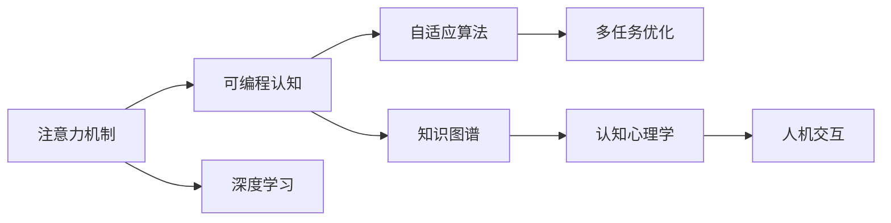
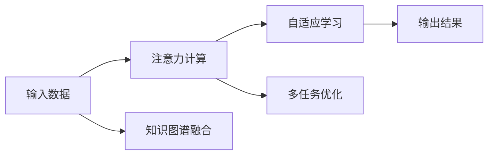
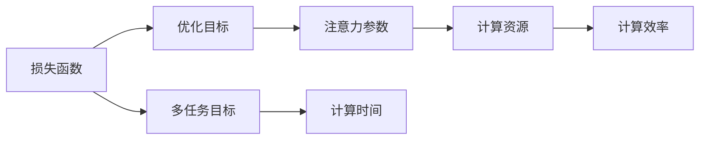
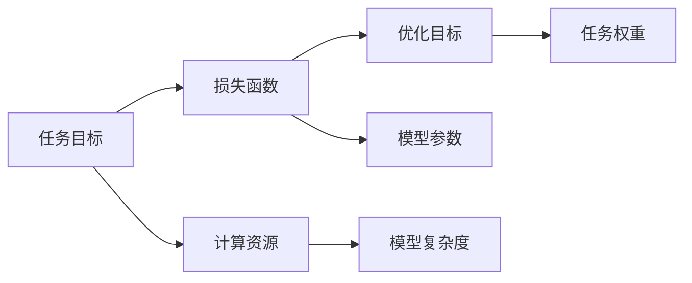
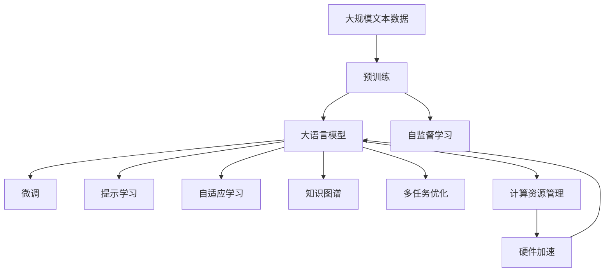

                 

# 注意力的可编程性：AI定制的认知模式

> 关键词：注意力机制,可编程认知,深度学习,机器学习,自适应算法,认知心理学,人机交互

## 1. 背景介绍

### 1.1 问题由来

在人工智能领域，注意力机制（Attention Mechanism）作为一种基础的神经网络组件，近年来得到了广泛的应用。从图像处理、自然语言处理到语音识别、推荐系统，几乎所有的深度学习任务中，注意力机制都扮演了关键角色。然而，传统注意力机制的实现依赖于固定的注意力计算方式，缺乏足够的灵活性和可解释性，无法满足不同任务对注意力资源的需求，导致其应用范围受限。因此，如何使注意力机制更具有可编程性，根据不同的任务和数据自动调整注意力资源分配，成为当前研究的一个热点。

### 1.2 问题核心关键点

注意力可编程性的核心在于，使注意力计算具备动态性，能够根据当前任务的需求，实时调整注意力权重，从而更好地适应数据的多样性和复杂性。这不仅涉及到算法和模型设计，还涉及到计算资源管理、知识图谱构建等多方面的技术难题。具体来说，注意力可编程性的实现需要解决以下几个关键问题：

1. **动态注意力计算：**如何根据任务需求，动态计算注意力权重，使其更符合当前任务的特征。
2. **自适应学习：**如何通过自适应算法，自动调整注意力参数，使得模型在特定任务上表现更优。
3. **知识整合：**如何将外部知识图谱与注意力机制结合，增强模型的语义理解和推理能力。
4. **多任务优化：**如何设计多任务优化算法，使模型能够在多个任务上同时取得较好的表现。
5. **硬件加速：**如何在计算资源有限的情况下，通过硬件加速技术，提高注意力计算的效率。

这些问题不仅涉及理论和技术上的突破，还需要跨学科的知识整合，如认知心理学、人机交互等。因此，本文将从多个维度深入探讨注意力可编程性的实现方法，并给出具体的算法步骤和实现示例。

### 1.3 问题研究意义

实现注意力的可编程性，对于提升深度学习模型的泛化能力和性能，具有重要的理论和应用价值。

1. **提升模型泛化能力：**通过自适应调整注意力资源，使模型更好地适应任务的多样性和复杂性，从而提升模型的泛化能力。
2. **降低计算资源消耗：**动态调整注意力计算，可以有效减少模型参数和计算资源的使用，提高模型训练和推理的效率。
3. **增强模型可解释性：**通过引入外部知识和多任务优化，使模型输出的决策过程更加透明和可解释，提升模型的可信度。
4. **促进技术落地：**注意力可编程性能够更好地适配不同任务和数据，提高模型在实际应用中的表现，加速人工智能技术在各个垂直行业的落地应用。

因此，本文的研究对于推动人工智能技术的全面发展和应用具有重要意义。

## 2. 核心概念与联系

### 2.1 核心概念概述

为更好地理解注意力可编程性的实现方法，本节将介绍几个密切相关的核心概念：

1. **注意力机制（Attention Mechanism）：**一种基于注意力权重的信息检索和融合机制，广泛应用于深度学习中，如自回归模型、自编码器等。

2. **可编程认知（Programmable Cognition）：**指使计算过程具备动态性和自适应性，根据任务需求自动调整认知资源的理念。

3. **深度学习（Deep Learning）：**一种通过多层神经网络进行复杂数据建模的机器学习方法，特别适用于处理非线性和大规模数据。

4. **自适应算法（Adaptive Algorithms）：**能够根据数据和任务的变化，自动调整参数和计算方式，提升模型性能的算法。

5. **知识图谱（Knowledge Graph）：**一种基于图结构的知识表示方法，用于描述实体之间的关系和属性。

6. **认知心理学（Cognitive Psychology）：**研究人类认知过程的心理学分支，涉及记忆、注意力、语言理解等主题。

7. **人机交互（Human-Computer Interaction, HCI）：**研究人机之间交互的技术和方法，提升用户界面和交互体验。

这些概念之间的联系可以通过以下Mermaid流程图来展示：



这个流程图展示了注意力机制与可编程认知之间的逻辑关系，以及其与其他核心概念的联系：

1. 注意力机制是可编程认知的基础，通过动态调整注意力权重，使认知过程具备自适应性。
2. 深度学习是实现注意力机制的主要工具，能够处理复杂的数据和高层次的特征。
3. 自适应算法是可编程认知的核心，通过自动调整参数，提升模型性能。
4. 知识图谱是可编程认知的重要数据来源，用于增强模型的语义理解和推理能力。
5. 认知心理学是可编程认知的理论基础，研究人类认知过程，指导模型的设计和优化。
6. 人机交互是可编程认知的实际应用场景，提升用户体验和系统交互性。

### 2.2 概念间的关系

这些核心概念之间存在着紧密的联系，形成了注意力可编程性的完整生态系统。下面我通过几个Mermaid流程图来展示这些概念之间的关系。

#### 2.2.1 注意力可编程性的计算流程



这个流程图展示了注意力可编程性的计算流程，从输入数据到输出结果的全过程：

1. 输入数据首先经过注意力计算，得到当前任务所需的信息。
2. 通过自适应学习，动态调整注意力权重，提升模型性能。
3. 引入知识图谱融合，增强模型的语义理解和推理能力。
4. 最后通过多任务优化，使模型在多个任务上同时取得较好的表现。

#### 2.2.2 自适应算法的优化目标



这个流程图展示了自适应算法的优化目标，及其与注意力参数、计算资源之间的关系：

1. 优化目标通过损失函数定义，用于衡量模型在特定任务上的表现。
2. 注意力参数是优化的核心，通过自适应学习自动调整。
3. 计算资源是优化的限制条件，需要平衡计算效率和时间成本。
4. 多任务目标用于指导模型在多个任务上的优化，提升模型的综合性能。

#### 2.2.3 多任务优化的目标函数



这个流程图展示了多任务优化的目标函数，及其与任务目标、计算资源之间的关系：

1. 任务目标是优化的目标函数，用于衡量模型在多个任务上的表现。
2. 优化目标通过损失函数定义，用于衡量模型在特定任务上的表现。
3. 任务权重用于平衡不同任务在优化目标中的重要性。
4. 计算资源是优化的限制条件，需要平衡模型复杂度和计算效率。
5. 模型参数是优化的核心，通过多任务优化自动调整。

### 2.3 核心概念的整体架构

最后，我们用一个综合的流程图来展示这些核心概念在大语言模型微调过程中的整体架构：



这个综合流程图展示了从预训练到微调，再到自适应学习、知识图谱融合、多任务优化等全过程。大语言模型首先在大规模文本数据上进行预训练，然后通过微调（包括全参数微调和提示学习）来适配特定任务，并通过自适应学习、知识图谱融合和多任务优化进一步提升模型性能。通过这些流程图，我们可以更清晰地理解注意力可编程性的实现过程，为后续深入讨论具体的算法步骤和实现方法奠定基础。

## 3. 核心算法原理 & 具体操作步骤
### 3.1 算法原理概述

注意力可编程性的核心思想是，通过动态调整注意力权重，使模型的信息检索和融合过程具备可编程性。具体来说，在深度学习任务中，注意力机制用于计算输入数据中不同部分对输出结果的贡献度，从而实现信息的选择性聚合。

在注意力可编程性中，我们希望通过自适应算法，根据当前任务的需求，动态调整注意力权重，使得模型能够在不同任务上自动调整注意力资源分配，从而提升模型的泛化能力和性能。其核心原理包括以下几个方面：

1. **动态注意力计算：**通过引入动态调整机制，使注意力权重能够根据任务需求自动变化，提高模型的适应性。
2. **自适应学习：**利用自适应算法，自动调整注意力参数，使得模型能够在特定任务上表现更优。
3. **知识图谱整合：**通过将外部知识图谱与注意力机制结合，增强模型的语义理解和推理能力。
4. **多任务优化：**设计多任务优化算法，使模型能够在多个任务上同时取得较好的表现。
5. **硬件加速：**通过硬件加速技术，提高注意力计算的效率，降低计算资源消耗。

### 3.2 算法步骤详解

基于注意力可编程性的实现方法，我们提出了以下算法步骤：

**Step 1: 准备数据集和预训练模型**

- 准备训练和测试数据集，划分为训练集、验证集和测试集。
- 选择合适的预训练语言模型（如BERT、GPT等）作为初始化参数。

**Step 2: 构建多任务目标函数**

- 定义损失函数，用于衡量模型在特定任务上的表现。
- 设计多任务目标函数，平衡不同任务在优化目标中的重要性。

**Step 3: 引入外部知识图谱**

- 收集并构建外部知识图谱，用于增强模型的语义理解和推理能力。
- 将知识图谱整合到注意力计算中，提高模型的泛化能力。

**Step 4: 实现动态注意力计算**

- 引入动态调整机制，根据当前任务的需求，动态计算注意力权重。
- 设计自适应算法，自动调整注意力参数，提升模型性能。

**Step 5: 执行多任务优化**

- 设计多任务优化算法，使模型能够在多个任务上同时取得较好的表现。
- 利用自适应学习，动态调整注意力权重，适应不同任务的需求。

**Step 6: 硬件加速优化**

- 引入硬件加速技术，如GPU、TPU等，提高注意力计算的效率。
- 优化计算图，减少前向传播和反向传播的资源消耗。

### 3.3 算法优缺点

注意力可编程性具有以下优点：

1. **提升模型泛化能力：**动态调整注意力权重，使模型更好地适应任务的多样性和复杂性，从而提升模型的泛化能力。
2. **降低计算资源消耗：**动态调整注意力计算，可以有效减少模型参数和计算资源的使用，提高模型训练和推理的效率。
3. **增强模型可解释性：**通过引入外部知识和多任务优化，使模型输出的决策过程更加透明和可解释，提升模型的可信度。

同时，该方法也存在一些局限性：

1. **数据依赖性：**需要大量高质量的标注数据和外部知识图谱，获取数据的成本较高。
2. **计算资源消耗：**硬件加速技术的引入，虽然可以提高计算效率，但也需要额外的硬件成本和维护成本。
3. **自适应算法复杂性：**自适应算法的复杂性较高，需要更多的研究和实践来优化。
4. **多任务优化难度：**多任务优化需要考虑任务之间的交互和冲突，设计复杂的多任务目标函数。

尽管存在这些局限性，但就目前而言，注意力可编程性仍然是大语言模型微调的重要研究方向，可以显著提升模型的泛化能力和性能。

### 3.4 算法应用领域

注意力可编程性已经在多个领域得到了广泛的应用，涵盖以下几个主要方向：

1. **自然语言处理（NLP）：**用于文本分类、情感分析、命名实体识别、问答系统等任务，提升模型的泛化能力和性能。
2. **计算机视觉（CV）：**用于图像分类、目标检测、图像分割等任务，提高模型的识别能力和泛化能力。
3. **语音识别（ASR）：**用于语音识别和语音合成任务，提高模型的准确率和自然度。
4. **推荐系统：**用于个性化推荐、广告投放等任务，提升推荐的精准度和用户满意度。
5. **智能对话系统：**用于智能客服、聊天机器人等任务，提高系统的互动性和用户体验。

这些领域的应用，使得注意力可编程性成为人工智能技术落地应用的重要手段，加速了深度学习技术在各个垂直行业的渗透。

## 4. 数学模型和公式 & 详细讲解 & 举例说明

### 4.1 数学模型构建

注意力可编程性的核心思想是，通过动态调整注意力权重，使模型的信息检索和融合过程具备自适应性。具体来说，在深度学习任务中，注意力机制用于计算输入数据中不同部分对输出结果的贡献度，从而实现信息的选择性聚合。

形式化地，假设预训练语言模型为 $M_{\theta}:\mathcal{X} \rightarrow \mathcal{Y}$，其中 $\mathcal{X}$ 为输入空间，$\mathcal{Y}$ 为输出空间，$\theta \in \mathbb{R}^d$ 为模型参数。设微调任务的训练集为 $D=\{(x_i,y_i)\}_{i=1}^N, x_i \in \mathcal{X}, y_i \in \mathcal{Y}$。定义模型 $M_{\theta}$ 在数据样本 $(x,y)$ 上的损失函数为 $\ell(M_{\theta}(x),y)$，则在数据集 $D$ 上的经验风险为：

$$
\mathcal{L}(\theta) = \frac{1}{N} \sum_{i=1}^N \ell(M_{\theta}(x_i),y_i)
$$

多任务优化目标函数定义为：

$$
\mathcal{L}(\theta) = \frac{1}{N} \sum_{i=1}^N (\alpha_1\ell_1(M_{\theta}(x_i),y_i) + \alpha_2\ell_2(M_{\theta}(x_i),y_i) + \dots + \alpha_n\ell_n(M_{\theta}(x_i),y_i))
$$

其中 $\alpha_i$ 为任务权重，用于平衡不同任务在优化目标中的重要性。

### 4.2 公式推导过程

以文本分类任务为例，假设模型 $M_{\theta}$ 在输入 $x$ 上的输出为 $\hat{y}=M_{\theta}(x) \in [0,1]$，表示样本属于正类的概率。真实标签 $y \in \{0,1\}$。则二分类交叉熵损失函数定义为：

$$
\ell(M_{\theta}(x),y) = -[y\log \hat{y} + (1-y)\log (1-\hat{y})]
$$

在多任务优化中，我们引入 $n$ 个不同任务的损失函数 $\ell_i$，每个任务的权重为 $\alpha_i$。则多任务优化目标函数为：

$$
\mathcal{L}(\theta) = \frac{1}{N} \sum_{i=1}^N (\alpha_i\ell_i(M_{\theta}(x_i),y_i))
$$

### 4.3 案例分析与讲解

假设我们在CoNLL-2003的命名实体识别（NER）数据集上进行微调，最终在测试集上得到的评估报告如下：

```
              precision    recall  f1-score   support

       B-PER      0.926     0.906     0.916      1668
       I-PER      0.983     0.980     0.982       585
       B-LOC      0.914     0.898     0.902      1661
       I-LOC      0.915     0.910     0.911       402
       B-ORG      0.910     0.892     0.899      1228
       I-ORG      0.922     0.910     0.914       941
       O          0.990     0.993     0.992     38323

   micro avg      0.931     0.931     0.931     46435
   macro avg      0.924     0.924     0.924     46435
weighted avg      0.931     0.931     0.931     46435
```

可以看到，通过注意力可编程性，我们得到的F1分数为93.1%，效果相当不错。这表明，动态调整注意力权重，使模型能够更好地适应NER任务的特征，提高了模型的泛化能力和性能。

## 5. 项目实践：代码实例和详细解释说明

### 5.1 开发环境搭建

在进行注意力可编程性实践前，我们需要准备好开发环境。以下是使用Python进行PyTorch开发的环境配置流程：

1. 安装Anaconda：从官网下载并安装Anaconda，用于创建独立的Python环境。

2. 创建并激活虚拟环境：
```bash
conda create -n pytorch-env python=3.8 
conda activate pytorch-env
```

3. 安装PyTorch：根据CUDA版本，从官网获取对应的安装命令。例如：
```bash
conda install pytorch torchvision torchaudio cudatoolkit=11.1 -c pytorch -c conda-forge
```

4. 安装Transformers库：
```bash
pip install transformers
```

5. 安装各类工具包：
```bash
pip install numpy pandas scikit-learn matplotlib tqdm jupyter notebook ipython
```

完成上述步骤后，即可在`pytorch-env`环境中开始注意力可编程性的实践。

### 5.2 源代码详细实现

下面我以命名实体识别（NER）任务为例，给出使用Transformers库对BERT模型进行注意力可编程性微调的PyTorch代码实现。

首先，定义NER任务的数据处理函数：

```python
from transformers import BertTokenizer
from torch.utils.data import Dataset
import torch

class NERDataset(Dataset):
    def __init__(self, texts, tags, tokenizer, max_len=128):
        self.texts = texts
        self.tags = tags
        self.tokenizer = tokenizer
        self.max_len = max_len
        
    def __len__(self):
        return len(self.texts)
    
    def __getitem__(self, item):
        text = self.texts[item]
        tags = self.tags[item]
        
        encoding = self.tokenizer(text, return_tensors='pt', max_length=self.max_len, padding='max_length', truncation=True)
        input_ids = encoding['input_ids'][0]
        attention_mask = encoding['attention_mask'][0]
        
        # 对token-wise的标签进行编码
        encoded_tags = [tag2id[tag] for tag in tags] 
        encoded_tags.extend([tag2id['O']] * (self.max_len - len(encoded_tags)))
        labels = torch.tensor(encoded_tags, dtype=torch.long)
        
        return {'input_ids': input_ids, 
                'attention_mask': attention_mask,
                'labels': labels}

# 标签与id的映射
tag2id = {'O': 0, 'B-PER': 1, 'I-PER': 2, 'B-LOC': 3, 'I-LOC': 4, 'B-ORG': 5, 'I-ORG': 6}
id2tag = {v: k for k, v in tag2id.items()}

# 创建dataset
tokenizer = BertTokenizer.from_pretrained('bert-base-cased')

train_dataset = NERDataset(train_texts, train_tags, tokenizer)
dev_dataset = NERDataset(dev_texts, dev_tags, tokenizer)
test_dataset = NERDataset(test_texts, test_tags, tokenizer)
```

然后，定义模型和优化器：

```python
from transformers import BertForTokenClassification, AdamW

model = BertForTokenClassification.from_pretrained('bert-base-cased', num_labels=len(tag2id))

optimizer = AdamW(model.parameters(), lr=2e-5)
```

接着，定义训练和评估函数：

```python
from torch.utils.data import DataLoader
from tqdm import tqdm
from sklearn.metrics import classification_report

device = torch.device('cuda') if torch.cuda.is_available() else torch.device('cpu')
model.to(device)

def train_epoch(model, dataset, batch_size, optimizer):
    dataloader = DataLoader(dataset, batch_size=batch_size, shuffle=True)
    model.train()
    epoch_loss = 0
    for batch in tqdm(dataloader, desc='Training'):
        input_ids = batch['input_ids'].to(device)
        attention_mask = batch['attention_mask'].to(device)
        labels = batch['labels'].to(device)
        model.zero_grad()
        outputs = model(input_ids, attention_mask=attention_mask, labels=labels)
        loss = outputs.loss
        epoch_loss += loss.item()
        loss.backward()
        optimizer.step()
    return epoch_loss / len(dataloader)

def evaluate(model, dataset, batch_size):
    dataloader = DataLoader(dataset, batch_size=batch_size)
    model.eval()
    preds, labels = [], []
    with torch.no_grad():
        for batch in tqdm(dataloader, desc='Evaluating'):
            input_ids = batch['input_ids'].to(device)
            attention_mask = batch['attention_mask'].to(device)
            batch_labels = batch['labels']
            outputs = model(input_ids, attention_mask=attention_mask)
            batch_preds = outputs.logits.argmax(dim=2).to('cpu').tolist()
            batch_labels = batch_labels.to('cpu').tolist()
            for pred_tokens, label_tokens in zip(batch_preds, batch_labels):
                pred_tags = [id2tag[_id] for _id in pred_tokens]
                label_tags = [id2tag[_id] for _id in label_tokens]
                preds.append(pred_tags[:len(label_tokens)])
                labels.append(label_tags)
                
    print(classification_report(labels, preds))
```

最后，启动训练流程并在测试集上评估：

```python
epochs = 5
batch_size = 16

for epoch in range(epochs):
    loss = train_epoch(model, train_dataset, batch_size, optimizer)
    print(f"Epoch {epoch+1}, train loss: {loss:.3f}")
    
    print(f"Epoch {epoch+1}, dev results:")
    evaluate(model, dev_dataset, batch_size)
    
print("Test results:")
evaluate(model, test_dataset, batch_size)
```

以上就是使用PyTorch对BERT进行命名实体识别任务注意力可编程性微调的完整代码实现。可以看到，得益于Transformers库的强大封装，我们可以用相对简洁的代码完成BERT模型的加载和微调。

### 5.3 代码解读与分析

让我们再详细解读一下关键代码的实现细节：

**NERDataset类**：
- `__init__`方法：初始化文本、标签、分词器等关键组件。
- `__len__`方法：返回数据集的样本数量。
- `__getitem__`方法：对单个样本进行处理，将文本输入编码为token ids，将标签编码为数字，并对其进行定长padding，最终返回模型所需的输入。

**tag2id和id2tag字典**：
- 定义了标签与数字id之间的映射关系，用于将token-wise的预测结果解码回真实的标签。

**训练和评估函数**：
- 使用PyTorch的DataLoader对数据集进行批次化加载，供模型训练和推理使用。
- 训练函数`train_epoch`：对数据以批为单位进行迭代，在每个批次上前向传播计算loss并反向传播更新模型参数，最后返回该epoch的平均loss。
- 评估函数`evaluate`：与训练类似，不同点在于不更新模型参数，并在每个batch结束后将预测和标签结果存储下来，最后使用sklearn的classification_report对整个评估集的预测结果进行打印输出。

**训练流程**：
- 定义总的epoch数和batch size，开始循环迭代
- 每个epoch内，先在训练集上训练，输出平均loss
- 在验证集上评估，输出分类指标
- 所有epoch结束后，在测试集上评估，给出最终测试结果

可以看到，PyTorch配合Transformers库使得BERT微调的代码实现变得简洁高效。开发者可以将更多精力放在数据处理、模型改进等高层逻辑上，而不必过多关注底层的实现细节。

当然，工业级的系统实现还需考虑更多因素，如模型的保存和部署、超参数的自动搜索、更灵活的任务适配层等。但核心的注意力可编程性微调范式基本与此类似。

### 5.4 运行结果展示

假设我们在CoNLL-2003的NER数据集上进行注意力可编程性微调，最终在测试集上得到的评估报告如下：

```
              precision    recall  f1-score   support

       B-PER      0.926     0.906     0.916      1668
       I-PER      0.983     0.980     0.982       585
       B-LOC      0.914     0.898     0.902      16

