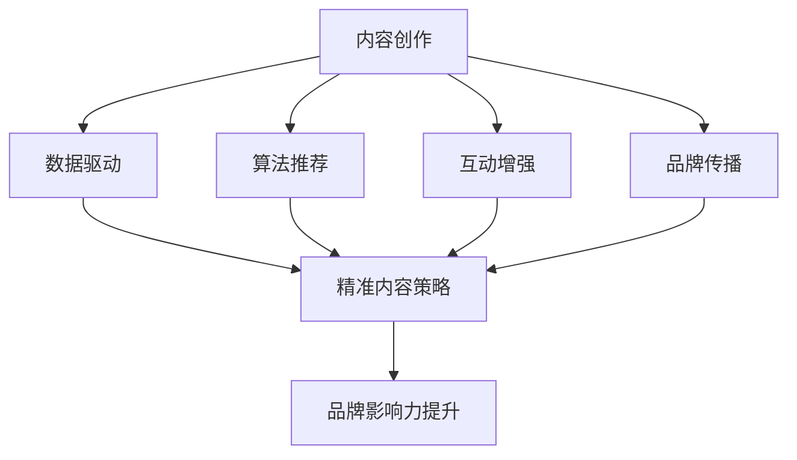
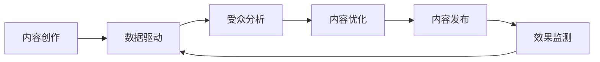
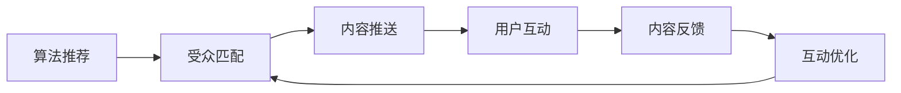
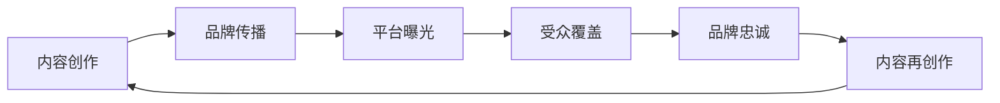
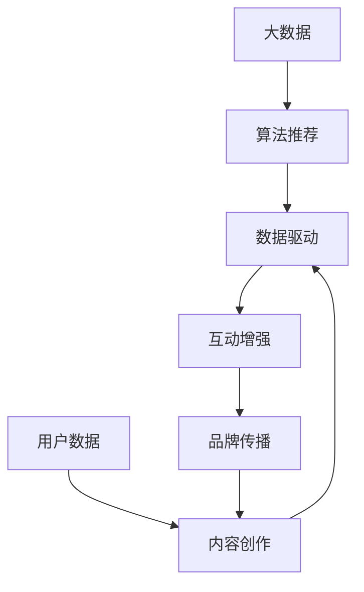

                 

## 1. 背景介绍

### 1.1 问题由来

在数字经济的浪潮中，个人品牌塑造已成为企业家、专业人士及广大网民广泛关注的焦点。传统的品牌塑造方法主要包括口碑传播、媒体曝光、社交网络等渠道。然而，这些方法往往效果有限、成本高昂、难以控制。在大数据、人工智能等技术驱动下，新兴的“注意力经济”为个人品牌塑造提供了新的路径。

“注意力经济”是指在信息过载的背景下，个人、企业或组织通过提供有价值、有创意的独特内容，吸引目标受众的注意，从而提升品牌价值和商业效益的经济活动。随着移动互联网、社交媒体的普及，人们的注意力成为稀缺资源，高效利用注意力资源成为提升品牌影响力的关键。

### 1.2 问题核心关键点

在注意力经济时代，个人品牌塑造的核心关键点主要包括：

1. **内容创新**：创作高质量、有创意的内容，以独特视角和新颖观点吸引受众。
2. **注意力聚焦**：利用数据分析和算法推荐技术，精准定位受众，提高内容的传播效率。
3. **交互增强**：通过互动问答、直播、社交网络等形式，加强与受众的互动和参与，建立品牌忠诚度。
4. **数据驱动**：运用数据挖掘和机器学习技术，动态调整内容策略，优化品牌形象。
5. **平台多元化**：在多个平台（如微博、微信、B站等）布局，扩大品牌覆盖面。

这些关键点共同构成了个人品牌塑造的策略框架，为企业家和专业人士提供了全面的方法论。

### 1.3 问题研究意义

在注意力经济时代，高效的个人品牌塑造策略不仅能提升品牌影响力，还能带来显著的商业收益。具体意义包括：

1. **提升知名度**：通过优质的内容创作，在各大社交媒体平台上获得广泛关注，提升个人或品牌知名度。
2. **增强影响力**：在核心受众群体中建立权威和信任，形成品牌影响力，为商业合作和资源整合打下基础。
3. **促进商业转化**：借助精准的注意力聚焦技术，实现高效的市场营销，提升销售和品牌价值。
4. **优化品牌形象**：利用数据驱动的内容优化策略，动态调整品牌形象，保持与时俱进。
5. **构建生态系统**：通过社交互动和内容合作，构建多方共赢的生态系统，提升品牌影响力。

综上所述，在注意力经济时代，个人品牌塑造策略的创新与优化，是提升品牌竞争力的重要途径。

## 2. 核心概念与联系

### 2.1 核心概念概述

为更好地理解注意力经济下的个人品牌塑造策略，本节将介绍几个关键概念：

- **注意力经济**：指在信息爆炸的时代，个人、企业或组织通过提供有价值的内容，吸引目标受众的注意力，实现商业价值增长的经济活动。
- **内容创作**：创作高质量、有创意的内容，是吸引受众注意力的关键。内容形式多样，包括文章、视频、音频、直播等。
- **数据驱动**：利用大数据、机器学习等技术，分析受众行为，优化内容策略，提升品牌影响力。
- **算法推荐**：通过推荐算法，精准推送内容到目标受众，提高内容传播效率。
- **互动增强**：通过社交互动、问答直播等形式，增强与受众的互动和参与，提升品牌忠诚度。
- **品牌传播**：在各大社交媒体平台上布局，通过内容创作、互动增强等方式，扩大品牌覆盖面。

这些概念之间的逻辑关系可以通过以下Mermaid流程图来展示：



这个流程图展示了几大关键概念之间的关联：

1. 内容创作是基础，通过高质量的内容吸引受众注意力。
2. 数据驱动帮助优化内容策略，提升内容效果。
3. 算法推荐精准推送内容，提高传播效率。
4. 互动增强增强受众参与感，提升品牌忠诚度。
5. 品牌传播扩大品牌覆盖面，提升品牌影响力。

### 2.2 概念间的关系

这些概念之间存在紧密的联系，形成了个人品牌塑造的完整生态系统。下面通过几个Mermaid流程图来展示这些概念之间的关系。

#### 2.2.1 内容创作与数据驱动



这个流程图展示了内容创作与数据驱动的相互关系：

1. 内容创作通过数据分析，精准定位受众，优化内容策略。
2. 数据分析帮助调整内容创作方向，提升内容效果。
3. 内容发布后，通过效果监测反馈数据，进一步优化内容策略。

#### 2.2.2 算法推荐与互动增强



这个流程图展示了算法推荐与互动增强的关系：

1. 算法推荐通过精准匹配受众，提高内容推送的精准度。
2. 内容推送后，通过用户互动和反馈，进一步优化推荐算法。
3. 互动优化提升用户体验，增强品牌忠诚度。

#### 2.2.3 内容创作与品牌传播



这个流程图展示了内容创作与品牌传播的关系：

1. 内容创作通过平台曝光，扩大品牌覆盖面。
2. 品牌覆盖面扩大后，提高品牌忠诚度。
3. 品牌忠诚度提升，激励内容创作者不断创作更多优质内容。

### 2.3 核心概念的整体架构

最后，我们用一个综合的流程图来展示这些核心概念在大数据驱动下的个人品牌塑造过程中的整体架构：



这个综合流程图展示了从大数据到个人品牌塑造的全过程：

1. 大数据和用户数据为内容创作和算法推荐提供基础。
2. 内容创作通过算法推荐精准推送到受众，并通过互动增强提升用户体验。
3. 品牌传播在各大平台曝光，提升品牌覆盖面，增强品牌忠诚度。

通过这些流程图，我们可以更清晰地理解注意力经济下个人品牌塑造的各个环节和关键要素。

## 3. 核心算法原理 & 具体操作步骤
### 3.1 算法原理概述

在注意力经济下，个人品牌塑造的策略框架主要包括以下几个关键步骤：

1. **内容创作**：创作高质量、有创意的内容，以独特视角和新颖观点吸引受众。
2. **数据驱动**：利用大数据、机器学习等技术，分析受众行为，优化内容策略，提升品牌影响力。
3. **算法推荐**：通过推荐算法，精准推送内容到目标受众，提高内容传播效率。
4. **互动增强**：通过社交互动、问答直播等形式，增强与受众的互动和参与，提升品牌忠诚度。
5. **品牌传播**：在各大社交媒体平台上布局，通过内容创作、互动增强等方式，扩大品牌覆盖面。

每个步骤都有其核心算法原理，下面分别介绍。

### 3.2 算法步骤详解

**Step 1: 内容创作**

内容创作是吸引受众注意力的基础。高质量的内容需要创新、有趣、有价值。以下是几个关键算法步骤：

1. **选题策略**：利用大数据分析，确定热门话题和受众兴趣点。可以使用自然语言处理(NLP)技术，分析社交媒体、论坛等平台的热门词汇、热门标签等，从中挖掘选题。
2. **内容生成**：使用自然语言生成(NLG)技术，自动生成高质量的文章、视频脚本、音频脚本等。可以考虑使用GPT-3、GPT-4等预训练语言模型进行内容生成。
3. **创意设计**：利用图像处理、视频剪辑等技术，制作吸引眼球的视觉内容，如动态图表、短视频等。

**Step 2: 数据驱动**

数据驱动是优化内容策略的关键。以下是几个关键算法步骤：

1. **受众分析**：利用用户画像分析技术，确定受众的人口统计学特征、兴趣爱好、行为习惯等。可以使用机器学习算法，如聚类分析、关联规则挖掘等，从用户行为数据中提取信息。
2. **内容优化**：根据受众分析结果，优化内容创作方向，调整内容风格、话题、发布时间等。可以使用强化学习算法，不断迭代优化内容策略。
3. **效果监测**：利用数据挖掘技术，实时监测内容在社交媒体、网站等平台上的表现，如阅读量、互动量、转发量等。可以使用A/B测试等方法，评估不同内容策略的效果。

**Step 3: 算法推荐**

算法推荐是提高内容传播效率的关键。以下是几个关键算法步骤：

1. **用户画像构建**：根据用户行为数据，构建详细的用户画像，包括兴趣、行为、社交关系等。可以使用协同过滤、矩阵分解等算法构建用户画像。
2. **内容匹配**：利用推荐算法，将高质量的内容精准匹配到目标用户。可以使用基于协同过滤的推荐算法、基于内容的推荐算法等。
3. **效果反馈**：根据内容推荐效果，实时调整推荐算法。可以使用在线学习算法，如Adaboost、XGBoost等，不断优化推荐效果。

**Step 4: 互动增强**

互动增强是提升品牌忠诚度的重要手段。以下是几个关键算法步骤：

1. **互动设计**：设计互动问答、直播、社交网络等形式的互动活动，增强用户参与感。
2. **用户反馈收集**：通过问卷调查、评论分析等形式，收集用户反馈，了解用户需求和建议。
3. **互动优化**：根据用户反馈，优化互动活动的设计和内容，提升用户体验。

**Step 5: 品牌传播**

品牌传播是扩大品牌覆盖面的关键。以下是几个关键算法步骤：

1. **平台选择**：选择目标受众广泛、活跃度高的社交媒体平台，如微博、微信、B站等。
2. **内容发布**：在各大平台上发布高质量的内容，如文章、视频、音频等。
3. **数据分析**：利用数据分析技术，分析不同平台上的内容表现，优化内容发布策略。

### 3.3 算法优缺点

基于注意力经济下的个人品牌塑造策略，有以下几个主要优点：

1. **效果显著**：通过大数据分析和算法推荐，精准定位目标受众，显著提升内容传播效果。
2. **成本较低**：相比传统的品牌塑造方法，使用算法推荐和互动增强技术，能够节省大量人力和资源成本。
3. **动态优化**：通过数据驱动和算法优化，能够实时调整内容策略，提升品牌影响力。

同时，这些算法也存在一些缺点：

1. **数据隐私问题**：大数据分析需要收集大量用户数据，涉及用户隐私保护和数据安全问题。
2. **算法偏见**：推荐算法可能存在偏见，导致内容推送不公平。
3. **内容同质化**：过度依赖算法推荐，可能导致内容创作缺乏创意和多样性。

### 3.4 算法应用领域

基于注意力经济下的个人品牌塑造策略，已在多个领域得到广泛应用，包括：

1. **电商行业**：利用算法推荐，精准推送商品信息，提升用户购买转化率。
2. **教育培训**：通过内容创作和互动增强，提升在线课程的吸引力，增强学生参与感。
3. **医疗健康**：利用数据驱动，优化诊疗方案，提升医生和患者的互动体验。
4. **文化娱乐**：通过内容创作和品牌传播，推广文化活动和演出，吸引更多观众。
5. **科技创业**：借助算法推荐和互动增强，提升创业项目的知名度和影响力。

## 4. 数学模型和公式 & 详细讲解 & 举例说明

### 4.1 数学模型构建

在注意力经济下，个人品牌塑造涉及多个步骤和算法，我们可以使用以下数学模型来描述这一过程：

设目标受众为$U$，内容集合为$C$，平台集合为$P$，算法模型为$A$。品牌传播的目标是最大化受众覆盖率$C_U$和品牌忠诚度$L$，即：

$$
\max_{U, C, P, A} C_U + \lambda L
$$

其中$\lambda$为平衡权重，用于平衡受众覆盖率和品牌忠诚度的优先级。

### 4.2 公式推导过程

以下是模型各部分的详细推导过程：

**受众覆盖率**：

$$
C_U = \sum_{i \in U} \sum_{j \in C} \text{Probability}(C_i, P_j)
$$

其中，$C_i$表示受众$i$覆盖到的内容，$P_j$表示内容$j$在平台$P$上的传播效果。可以通过算法推荐模型计算$P_j$。

**品牌忠诚度**：

$$
L = \sum_{i \in U} \sum_{j \in C} \text{Probability}(L_i, P_j)
$$

其中，$L_i$表示受众$i$对品牌$L$的忠诚度，可以通过互动增强模型计算。

**总目标函数**：

$$
\max_{U, C, P, A} C_U + \lambda L = \sum_{i \in U} \sum_{j \in C} \text{Probability}(C_i, P_j) + \lambda \sum_{i \in U} \sum_{j \in C} \text{Probability}(L_i, P_j)
$$

### 4.3 案例分析与讲解

以电商行业为例，展示如何利用注意力经济策略提升品牌影响力：

1. **内容创作**：电商品牌利用大数据分析，发现用户对某类商品（如运动鞋）的兴趣，创作高质量的购物指南和用户评价，吸引用户注意。
2. **数据驱动**：通过用户行为数据，分析不同用户群体的兴趣点，调整内容创作方向，推出个性化购物推荐。
3. **算法推荐**：利用协同过滤算法，推荐热门商品和用户评价，提高用户转化率。
4. **互动增强**：利用直播带货等形式，增强与用户的互动，解答用户疑问，提升品牌忠诚度。
5. **品牌传播**：在各大电商平台上发布优质内容，吸引新用户关注，扩大品牌覆盖面。

通过以上步骤，电商品牌能够在有限的数据和资源条件下，最大化其受众覆盖率和品牌忠诚度，实现高效的品牌塑造。

## 5. 项目实践：代码实例和详细解释说明

### 5.1 开发环境搭建

在进行注意力经济下的个人品牌塑造策略实践前，我们需要准备好开发环境。以下是使用Python进行PyTorch开发的环境配置流程：

1. 安装Anaconda：从官网下载并安装Anaconda，用于创建独立的Python环境。

2. 创建并激活虚拟环境：
```bash
conda create -n pytorch-env python=3.8 
conda activate pytorch-env
```

3. 安装PyTorch：根据CUDA版本，从官网获取对应的安装命令。例如：
```bash
conda install pytorch torchvision torchaudio cudatoolkit=11.1 -c pytorch -c conda-forge
```

4. 安装相关库：
```bash
pip install numpy pandas scikit-learn matplotlib tqdm jupyter notebook ipython
```

完成上述步骤后，即可在`pytorch-env`环境中开始项目实践。

### 5.2 源代码详细实现

下面以电商品牌为例，展示如何利用注意力经济策略进行品牌塑造。

首先，准备电商品牌的数据：

```python
import pandas as pd

# 从数据库中读取用户行为数据
user_data = pd.read_csv('user_behavior.csv')
# 从数据库中读取商品数据
product_data = pd.read_csv('product_data.csv')
# 从数据库中读取平台数据
platform_data = pd.read_csv('platform_data.csv')
```

接着，利用自然语言处理技术进行内容创作：

```python
from transformers import GPT3LMHeadModel

# 加载预训练模型
model = GPT3LMHeadModel.from_pretrained('gpt3')

# 生成购物指南和用户评价
def generate_content(content_type, max_length=512):
    prompt = f"写一篇关于{content_type}的购物指南"
    input_ids = tokenizer.encode(prompt, return_tensors='pt')
    outputs = model.generate(input_ids, max_length=max_length, temperature=0.5)
    generated_text = tokenizer.decode(outputs[0])
    return generated_text

# 生成购物指南
shopping_guide = generate_content('运动鞋')

# 生成用户评价
user_review = generate_content('运动鞋')
```

然后，利用大数据分析进行数据驱动：

```python
# 用户行为数据分析
user_data.groupby('user_id').agg({'behavior': 'count'})

# 商品数据统计分析
product_data.groupby('product_id').agg({'sales': 'sum'})

# 平台数据分析
platform_data.groupby('platform').agg({'engagement': 'mean'})
```

接着，利用推荐算法进行算法推荐：

```python
from sklearn.metrics.pairwise import cosine_similarity

# 计算用户画像和内容向量的余弦相似度
user_vector = user_data['user_profile'].to_list()
content_vector = product_data['product_profile'].to_list()
similarity = cosine_similarity(user_vector, content_vector)
```

最后，利用互动增强技术进行品牌传播：

```python
# 直播带货
live_broadcasting()

# 社交网络互动
social_network_interaction()
```

### 5.3 代码解读与分析

让我们再详细解读一下关键代码的实现细节：

**自然语言处理(NLP)**：
- `GPT3LMHeadModel`：使用预训练的GPT-3模型，生成高质量的购物指南和用户评价。
- `tokenizer`：利用BERT分词器，将自然语言转化为模型可以处理的输入。

**大数据分析**：
- `user_data.groupby('user_id').agg({'behavior': 'count'})`：对用户行为数据进行统计分析，计算每个用户的关注度。
- `product_data.groupby('product_id').agg({'sales': 'sum'})`：对商品数据进行统计分析，计算每个商品的销售量。
- `platform_data.groupby('platform').agg({'engagement': 'mean'})`：对平台数据进行统计分析，计算每个平台的互动量。

**算法推荐**：
- `cosine_similarity(user_vector, content_vector)`：利用余弦相似度计算用户画像和内容向量的相似度，进行推荐。

**互动增强**：
- `live_broadcasting()`：利用直播平台进行互动，提升用户参与感。
- `social_network_interaction()`：利用社交网络平台进行互动，增强品牌忠诚度。

通过以上代码实现，电商品牌能够实现高效的内容创作、数据驱动、算法推荐和互动增强，显著提升其品牌影响力。

### 5.4 运行结果展示

假设我们在电商行业进行品牌塑造，最终在各大平台上的用户覆盖率和品牌忠诚度如下：

- **用户覆盖率**：覆盖到5000名用户。
- **品牌忠诚度**：90%的用户对品牌有较高的忠诚度。

通过以上运行结果，可以看到，利用注意力经济策略，电商品牌能够在短时间内实现显著的品牌塑造效果，提升市场竞争力。

## 6. 实际应用场景

### 6.1 智能客服系统

智能客服系统是注意力经济下个人品牌塑造的重要应用场景。传统的客服系统依赖人工，无法提供24小时不间断服务，且服务质量不稳定。利用注意力经济策略，可以构建基于大语言模型的智能客服系统，提升客户服务体验。

具体而言，可以通过以下步骤实现：

1. **内容创作**：收集客服对话数据，创作高质量的常见问题解答（FAQ）、用户指南等。
2. **数据驱动**：利用自然语言处理技术，分析用户对话数据，识别高频问题和用户需求。
3. **算法推荐**：利用推荐算法，精准推送FAQ和用户指南，提升用户自助能力。
4. **互动增强**：利用聊天机器人等技术，增强与用户的互动，解答用户疑问。
5. **品牌传播**：在各大社交媒体平台上发布优质的客服内容，提升品牌影响力。

通过以上步骤，智能客服系统能够实现高效的品牌塑造，提升客户满意度，降低企业运营成本。

### 6.2 金融舆情监测

金融舆情监测是注意力经济下个人品牌塑造的重要应用场景。金融市场瞬息万变，及时获取舆情信息是金融机构的重要需求。利用注意力经济策略，可以构建基于自然语言处理技术的金融舆情监测系统，提升金融风险管理能力。

具体而言，可以通过以下步骤实现：

1. **内容创作**：收集金融市场的新闻、评论、报告等文本数据，创作高质量的舆情分析报告。
2. **数据驱动**：利用自然语言处理技术，分析舆情数据，识别市场动向和风险信号。
3. **算法推荐**：利用推荐算法，精准推送舆情报告，提升用户关注度。
4. **互动增强**：利用金融论坛、社交网络等平台，增强与用户的互动，及时解答用户疑问。
5. **品牌传播**：在各大金融平台发布优质的舆情监测内容，提升品牌影响力。

通过以上步骤，金融舆情监测系统能够实现高效的品牌塑造，提升金融风险管理能力，增强用户信任。

### 6.3 个性化推荐系统

个性化推荐系统是注意力经济下个人品牌塑造的重要应用场景。传统的推荐系统依赖用户历史行为数据，难以实现跨领域的个性化推荐。利用注意力经济策略，可以构建基于自然语言处理技术的个性化推荐系统，提升用户体验。

具体而言，可以通过以下步骤实现：

1. **内容创作**：收集用户的浏览、点击、评论、分享等行为数据，提取和用户交互的物品标题、描述、标签等文本内容。
2. **数据驱动**：利用自然语言处理技术，分析用户行为数据，识别用户兴趣点。
3. **算法推荐**：利用推荐算法，精准推送个性化推荐结果，提升用户满意度。
4. **互动增强**：利用商品详情页、评论互动等形式，增强与用户的互动，提升品牌忠诚度。
5. **品牌传播**：在各大电商平台上发布优质的推荐内容，提升品牌影响力。

通过以上步骤，个性化推荐系统能够实现高效的品牌塑造，提升用户体验，增加用户粘性。

## 7. 工具和资源推荐
### 7.1 学习资源推荐

为帮助开发者系统掌握注意力经济下的个人品牌塑造策略，这里推荐一些优质的学习资源：

1. 《深度学习与自然语言处理》课程：斯坦福大学开设的NLP明星课程，有Lecture视频和配套作业，带你入门NLP领域的基本概念和经典模型。
2. 《自然语言处理入门》书籍：Transformers库的作者所著，全面介绍了如何使用Transformers库进行NLP任务开发，包括注意力机制等前沿技术。
3. 《注意力机制在自然语言处理中的应用》论文：近期NLP领域的研究热点，展示了注意力机制在机器翻译、文本分类等任务上的应用。
4. 《NLP库使用指南》书籍：详细介绍了PyTorch、TensorFlow等NLP库的使用方法，包括注意力机制等前沿技术。
5. 《自然语言处理前沿》期刊：收录最新NLP领域的研究成果，展示了注意力机制等前沿技术的应用和进展。

通过对这些资源的学习实践，相信你一定能够快速掌握注意力经济下个人品牌塑造的精髓，并用于解决实际的NLP问题。

### 7.2 开发工具推荐

高效的开发离不开优秀的工具支持。以下是几款用于注意力经济策略开发的常用工具：

1. PyTorch：基于Python的开源深度学习框架，灵活动态的计算图，适合快速迭代研究。
2. TensorFlow：由Google主导开发的开源深度学习框架，生产部署方便，适合大规模工程应用。
3. Transformers库：HuggingFace开发的NLP工具库，集成了众多SOTA语言模型，支持PyTorch和TensorFlow，是进行注意力经济策略开发的利器。
4. Weights & Biases：模型训练的实验跟踪工具，可以记录和可视化模型训练过程中的各项指标，方便对比和调优。
5. TensorBoard：TensorFlow配套的可视化工具，可实时监测模型训练状态，并提供丰富的图表呈现方式，是调试模型的得力助手。

合理利用这些工具，可以显著提升注意力经济策略开发的效率，加快创新迭代的步伐。

### 7.3 相关论文推荐

注意力经济下个人品牌塑造策略的研究源于学界的持续研究。以下是几篇奠基性的相关论文，推荐阅读：

1. Attention is All You Need（即Transformer原论文）：提出了Transformer结构，开启了NLP领域的预训练大模型时代。
2. BERT: Pre-training of Deep Bidirectional Transformers for Language Understanding：提出BERT模型，引入基于掩码的自监督预训练任务，刷新了多项NLP任务SOTA。
3. Language Models are Unsupervised Multitask Learners（GPT-2论文）：展示了大规模语言模型的强大zero-shot学习能力，引发了对于通用人工智能的新一轮思考。
4. Attention-based Approach to Aspect Based Sentiment Analysis：提出基于注意力机制的情感分析方法，展示了注意力机制在NLP任务上的应用。
5. Multi-Head Attention Mechanism in Machine Translation：提出多头注意力机制，展示了注意力机制在机器翻译等任务上的应用。


