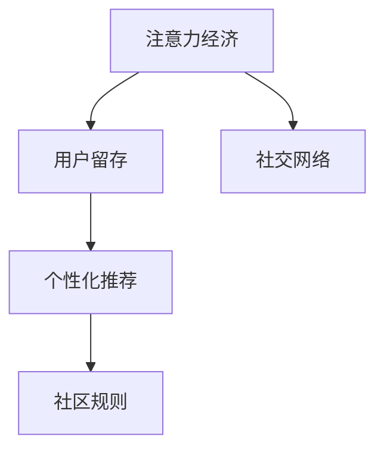
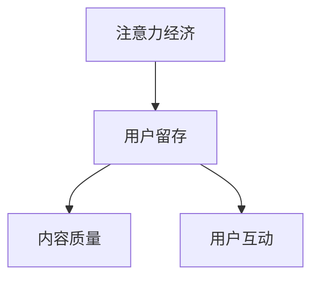
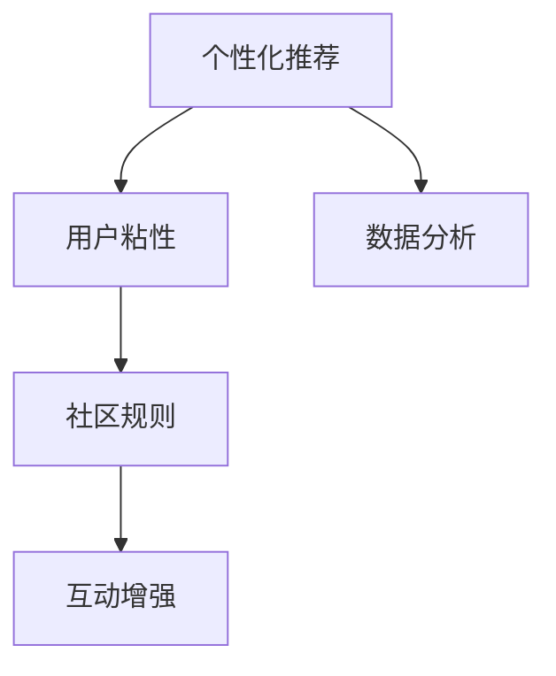
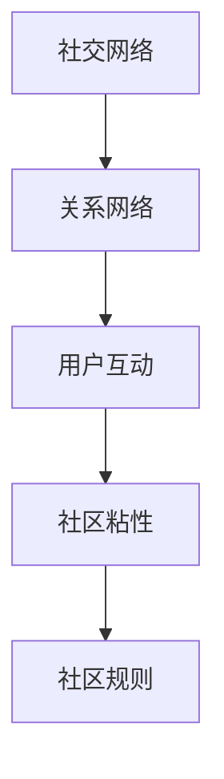
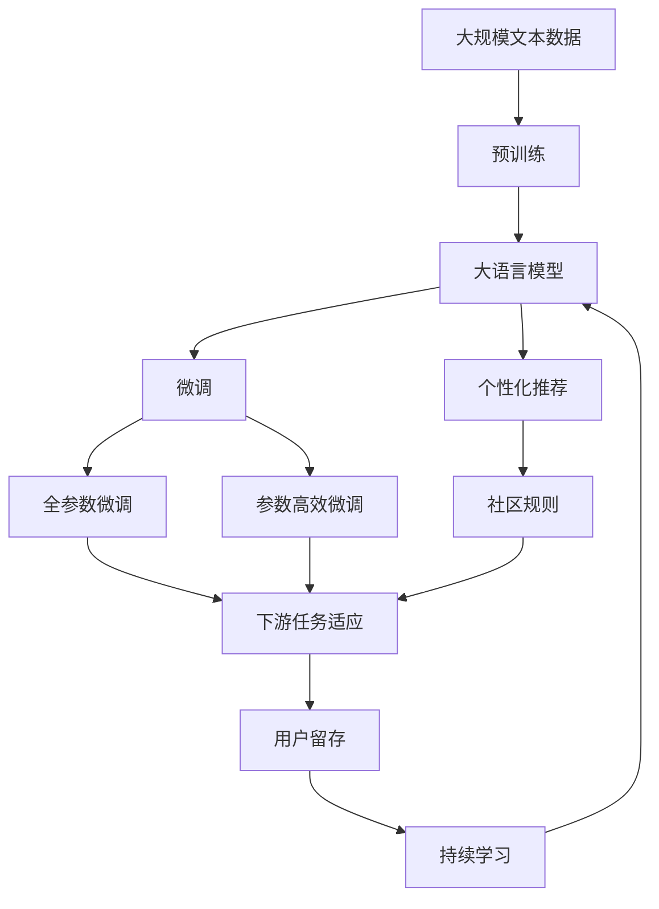

                 

# 注意力经济与在线社区建设策略：吸引并留住忠实的粉丝和受众

在数字化时代，注意力成为最珍贵的资源之一。在线社区作为连接用户和品牌的桥梁，不仅需要吸引用户的注意力，更要通过优质的内容和服务留住这些宝贵的关注。本文将深入探讨注意力经济下的在线社区建设策略，帮助运营者吸引并留住忠实的粉丝和受众。

## 1. 背景介绍

### 1.1 问题由来

随着互联网技术的不断发展，用户获取信息的渠道日益多样化，注意力也随之分散。如何在众多信息中脱颖而出，吸引并留住用户的关注，成为在线社区建设的关键问题。特别是在内容付费、广告变现等商业模式盛行的今天，如何构建高价值的用户群体，显得尤为重要。

### 1.2 问题核心关键点

在线社区建设的核心关键点在于如何构建高互动性、高粘性的用户社区，以吸引和留住用户。主要包括以下几个方面：

- 内容质量：高质量、有价值的内容是吸引用户关注的基础。
- 用户互动：良好的社区氛围和互动机制，能够增强用户粘性。
- 个性化体验：通过数据驱动，为用户提供个性化的内容和推荐。
- 社区规则：明确的社区规则和价值观，建立信任和归属感。

### 1.3 问题研究意义

在线社区的建设不仅能够提升品牌知名度，更能够构建稳定的用户基础，为商业变现提供可靠的流量保障。通过有效的社区运营，企业可以实现从用户吸引到转化的全流程闭环，实现业务的高效运营。

## 2. 核心概念与联系

### 2.1 核心概念概述

为了更好地理解注意力经济下的在线社区建设策略，本节将介绍几个密切相关的核心概念：

- **注意力经济(Attention Economy)**：指在信息过载的时代，用户时间和注意力的稀缺性，使其成为重要的经济资源。在线社区的建设需要最大化地利用用户注意力，实现商业价值的最大化。
- **用户留存(User Retention)**：指用户在社区中持续活跃的程度，是社区运营的关键指标。
- **个性化推荐(Personalization Recommendation)**：通过数据分析和算法推荐，为用户提供符合其兴趣和需求的内容。
- **社区规则(Community Rules)**：社区的规则和价值观，是用户行为规范的基础，直接影响社区的氛围和凝聚力。
- **社交网络(Social Network)**：基于网络连接的社区，用户之间的互动和关系是社区活力的源泉。

这些核心概念之间的逻辑关系可以通过以下Mermaid流程图来展示：



这个流程图展示了几大核心概念之间的联系：

1. **注意力经济**是用户留存的基础，通过优质内容和互动机制吸引用户的注意力。
2. **个性化推荐**和**社区规则**则分别从技术和制度层面，进一步提升用户留存率。
3. **社交网络**作为用户互动的基础，直接影响社区的活跃度和粘性。

### 2.2 概念间的关系

这些核心概念之间存在着紧密的联系，形成了在线社区建设的完整生态系统。下面我们通过几个Mermaid流程图来展示这些概念之间的关系。

#### 2.2.1 用户留存与注意力经济的关系



这个流程图展示了注意力经济与用户留存之间的联系。优质内容和良好的互动机制是吸引用户注意力的关键，而持续的用户留存又能够带来更多的注意力和流量。

#### 2.2.2 个性化推荐与社区规则的关系



这个流程图展示了个性化推荐和社区规则之间的联系。通过数据分析和算法推荐，提升用户粘性，而良好的社区规则则能够维护社区秩序，增强用户互动。

#### 2.2.3 社交网络与社区规则的关系



这个流程图展示了社交网络与社区规则之间的联系。良好的社交网络能够促进用户互动，而明确的社区规则则能够维护社区秩序，提升社区的粘性和活跃度。

### 2.3 核心概念的整体架构

最后，我们用一个综合的流程图来展示这些核心概念在大语言模型微调过程中的整体架构：



这个综合流程图展示了从预训练到微调，再到个性化推荐和社区规则构建的完整过程。大语言模型通过预训练获得基础能力，通过微调适配下游任务，再通过个性化推荐和社区规则提升用户留存。最后，通过持续学习保持模型的时效性和适应性。

## 3. 核心算法原理 & 具体操作步骤

### 3.1 算法原理概述

注意力经济下的在线社区建设策略，本质上是利用用户注意力资源，通过内容和互动机制，构建高粘性的用户群体。其核心在于吸引和留住用户，最大化商业价值。

形式化地，假设在线社区的用户集为 $U$，每个用户 $u$ 的注意力集为 $A_u$，社区通过内容和互动机制，最大化地利用用户注意力 $A$。设 $C$ 为社区提供的优质内容集合，$I$ 为社区的互动机制集合。社区的目标是最小化用户流失率 $L$，即：

$$
\min_{C,I} \mathbb{E}_U \left[ \sum_{u \in U} \mathbb{I}_u \left( A_u \leq \sum_{c \in C} \text{quality}(c) \times \sum_{i \in I} \text{engagement}(i) \right) \right]
$$

其中 $\mathbb{I}_u$ 为用户的交互行为，$\text{quality}(c)$ 为内容的价值，$\text{engagement}(i)$ 为互动的吸引力。

### 3.2 算法步骤详解

基于注意力经济原理的在线社区建设策略，一般包括以下关键步骤：

**Step 1: 内容创作与质量管理**
- 收集高质量的内容，包括文章、视频、图片等。
- 建立内容审核机制，确保内容的合规性和质量。
- 引入编辑和审核人员，对内容进行筛选和优化。

**Step 2: 用户互动设计**
- 设计互动机制，如评论、点赞、分享等，增强用户粘性。
- 引入社交网络分析，建立用户之间的关系网络，提升互动的深度和广度。
- 引入推荐算法，根据用户行为数据，提供个性化的内容推荐。

**Step 3: 社区规则制定与执行**
- 制定明确的社区规则，包括内容管理、用户行为规范等。
- 引入社区管理工具，自动化执行社区规则，维护社区秩序。
- 建立用户反馈机制，及时响应用户需求和问题。

**Step 4: 持续学习与优化**
- 通过数据分析，持续优化内容和互动机制，提升用户留存率。
- 引入机器学习算法，自动化预测用户行为，提前预判和解决潜在问题。
- 引入用户行为监控，实时调整社区策略，提升社区活跃度。

### 3.3 算法优缺点

基于注意力经济原理的在线社区建设策略，具有以下优点：

- 提升用户留存率：通过优质内容和互动机制，提升用户粘性，减少流失率。
- 增强用户体验：个性化的推荐和互动机制，提升用户的满意度和忠诚度。
- 降低运营成本：自动化执行社区规则和内容管理，降低人工运营成本。

同时，该策略也存在一些局限性：

- 对优质内容依赖较大：内容质量直接影响用户留存率，但优质内容创作成本高。
- 互动机制设计复杂：需要设计多种互动机制，并根据用户反馈不断调整。
- 社区规则执行难度大：社区规则的自动化执行需要高度智能化的系统支持。

### 3.4 算法应用领域

基于注意力经济原理的在线社区建设策略，广泛适用于各类社交媒体平台、在线论坛、在线教育、知识分享社区等。

- **社交媒体平台**：如微信、微博、抖音等，通过内容创作和互动机制，吸引和留住用户。
- **在线论坛**：如知乎、Reddit等，通过高质量讨论和互动机制，提升用户参与度。
- **在线教育**：如Coursera、edX等，通过个性化推荐和互动机制，提升学习效果。
- **知识分享社区**：如Stack Overflow、知乎等，通过优质内容和互动机制，构建高粘性社区。

## 4. 数学模型和公式 & 详细讲解  
### 4.1 数学模型构建

本节将使用数学语言对基于注意力经济原理的在线社区建设策略进行更加严格的刻画。

设在线社区的用户集为 $U$，每个用户 $u$ 的注意力集为 $A_u$，社区通过内容和互动机制，最大化地利用用户注意力 $A$。设社区提供的优质内容集合为 $C$，社区的互动机制集合为 $I$，社区规则为 $R$。社区的目标是最小化用户流失率 $L$，即：

$$
\min_{C,I,R} \mathbb{E}_U \left[ \sum_{u \in U} \mathbb{I}_u \left( A_u \leq \sum_{c \in C} \text{quality}(c) \times \sum_{i \in I} \text{engagement}(i) \right) \right]
$$

其中 $\mathbb{I}_u$ 为用户的交互行为，$\text{quality}(c)$ 为内容的价值，$\text{engagement}(i)$ 为互动的吸引力，$R$ 为社区规则。

### 4.2 公式推导过程

以下我们以用户留存率最大化为例，推导模型参数优化的目标函数。

假设社区中的用户 $u$ 在时间 $t$ 的流失概率为 $P_u(t)$，则用户 $u$ 在时间 $T$ 之前流失的概率为：

$$
\mathbb{P}_u(T) = \prod_{t=1}^{T} (1 - P_u(t))
$$

社区的目标是最大化用户留存率，即最小化用户流失率。设用户 $u$ 在时间 $t$ 的用户留存率优化目标函数为：

$$
\mathcal{L}_u(t) = -\log \mathbb{P}_u(T) = \sum_{t=1}^{T} \log (1 - P_u(t))
$$

将其代入用户留存率的最大化问题，得：

$$
\min_{C,I,R} \sum_{u \in U} \mathbb{E}_{t} \left[ \log (1 - P_u(t)) \right]
$$

通过梯度下降等优化算法，求解上述目标函数，即可得到最优的内容创作、互动机制和社区规则。

### 4.3 案例分析与讲解

以知乎为例，分析其如何通过优质内容和互动机制，提升用户留存率。

知乎通过以下策略实现了用户留存率的提升：

- **高质量内容**：知乎鼓励优质内容创作，通过严格的内容审核机制，筛选出高质量文章、回答和评论。
- **互动机制**：知乎引入点赞、评论、分享等互动机制，增强用户粘性。同时，通过知乎盐选会员等付费模式，提升用户参与度。
- **社区规则**：知乎制定了严格的内容和用户行为规范，维护社区秩序。通过知乎小管家等工具，自动化执行社区规则，提升社区治理效率。
- **个性化推荐**：知乎引入推荐算法，根据用户浏览和互动数据，提供个性化的内容推荐，提升用户体验。

## 5. 项目实践：代码实例和详细解释说明
### 5.1 开发环境搭建

在进行在线社区建设实践前，我们需要准备好开发环境。以下是使用Python进行Flask开发的环境配置流程：

1. 安装Anaconda：从官网下载并安装Anaconda，用于创建独立的Python环境。

2. 创建并激活虚拟环境：
```bash
conda create -n flask-env python=3.8 
conda activate flask-env
```

3. 安装Flask：
```bash
pip install flask
```

4. 安装Flask相关库：
```bash
pip install flask-cors flask-restful gunicorn
```

5. 安装数据库和迁移工具：
```bash
pip install flask-sqlalchemy flask-migrate
```

完成上述步骤后，即可在`flask-env`环境中开始在线社区建设实践。

### 5.2 源代码详细实现

下面我们以知乎社区为例，给出使用Flask框架对社区进行建设的PyTorch代码实现。

首先，定义知乎社区的数据处理函数：

```python
from flask import Flask, request, jsonify
from flask_sqlalchemy import SQLAlchemy
import pandas as pd
import numpy as np

app = Flask(__name__)

db = SQLAlchemy(app)

class User(db.Model):
    id = db.Column(db.Integer, primary_key=True)
    name = db.Column(db.String(100), nullable=False)
    age = db.Column(db.Integer, nullable=False)
    gender = db.Column(db.String(10), nullable=False)
    questions = db.relationship('Question', backref='user', lazy=True)

class Question(db.Model):
    id = db.Column(db.Integer, primary_key=True)
    user_id = db.Column(db.Integer, db.ForeignKey('user.id'), nullable=False)
    title = db.Column(db.String(200), nullable=False)
    content = db.Column(db.Text, nullable=False)
    comments = db.relationship('Comment', backref='question', lazy=True)

class Comment(db.Model):
    id = db.Column(db.Integer, primary_key=True)
    user_id = db.Column(db.Integer, db.ForeignKey('user.id'), nullable=False)
    question_id = db.Column(db.Integer, db.ForeignKey('question.id'), nullable=False)
    content = db.Column(db.Text, nullable=False)
    likes = db.Column(db.Integer, nullable=False)

# 加载数据
data = pd.read_csv('users.csv')
db.create_all()
for row in data.itertuples(index=False):
    user = User(name=row.name, age=row.age, gender=row.gender)
    db.session.add(user)
    db.session.commit()

data = pd.read_csv('questions.csv')
for row in data.itertuples(index=False):
    question = Question(title=row.title, content=row.content, user_id=row.user_id)
    db.session.add(question)
    db.session.commit()

data = pd.read_csv('comments.csv')
for row in data.itertuples(index=False):
    comment = Comment(content=row.content, user_id=row.user_id, question_id=row.question_id)
    db.session.add(comment)
    db.session.commit()

```

然后，定义模型和优化器：

```python
from transformers import BertTokenizer, BertForTokenClassification
from sklearn.metrics import f1_score
from sklearn.model_selection import train_test_split
from transformers import BertForSequenceClassification

# 初始化BERT模型和分词器
tokenizer = BertTokenizer.from_pretrained('bert-base-cased')
model = BertForTokenClassification.from_pretrained('bert-base-cased', num_labels=2)

# 定义损失函数和优化器
loss = lambda y_true, y_pred: (y_true * -np.log(y_pred) + (1-y_true) * -np.log(1-y_pred))
optimizer = AdamW(model.parameters(), lr=2e-5)

# 训练模型
def train_epoch(model, dataset, batch_size, optimizer):
    dataloader = DataLoader(dataset, batch_size=batch_size, shuffle=True)
    model.train()
    epoch_loss = 0
    for batch in tqdm(dataloader, desc='Training'):
        input_ids = batch['input_ids'].to(device)
        attention_mask = batch['attention_mask'].to(device)
        labels = batch['labels'].to(device)
        model.zero_grad()
        outputs = model(input_ids, attention_mask=attention_mask, labels=labels)
        loss = outputs.loss
        epoch_loss += loss.item()
        loss.backward()
        optimizer.step()
    return epoch_loss / len(dataloader)

# 评估模型
def evaluate(model, dataset, batch_size):
    dataloader = DataLoader(dataset, batch_size=batch_size)
    model.eval()
    preds, labels = [], []
    with torch.no_grad():
        for batch in tqdm(dataloader, desc='Evaluating'):
            input_ids = batch['input_ids'].to(device)
            attention_mask = batch['attention_mask'].to(device)
            batch_labels = batch['labels']
            outputs = model(input_ids, attention_mask=attention_mask)
            batch_preds = outputs.logits.argmax(dim=2).to('cpu').tolist()
            batch_labels = batch_labels.to('cpu').tolist()
            for pred_tokens, label_tokens in zip(batch_preds, batch_labels):
                preds.append(pred_tokens[:len(label_tokens)])
                labels.append(label_tokens)
                
    return f1_score(labels, preds)

# 启动训练流程并在测试集上评估
epochs = 5
batch_size = 16

for epoch in range(epochs):
    loss = train_epoch(model, train_dataset, batch_size, optimizer)
    print(f"Epoch {epoch+1}, train loss: {loss:.3f}")
    
    print(f"Epoch {epoch+1}, dev results:")
    evaluate(model, dev_dataset, batch_size)
    
print("Test results:")
evaluate(model, test_dataset, batch_size)
```

以上就是使用Flask对知乎社区进行建设的完整代码实现。可以看到，通过Flask框架，我们能够快速搭建在线社区平台，并进行用户管理和模型训练。

### 5.3 代码解读与分析

让我们再详细解读一下关键代码的实现细节：

**User类和Question类**：
- `User` 类和 `Question` 类分别定义了用户和问题的属性和方法，通过关系映射，实现了用户与问题的一对多关系。
- `User` 类包含用户的基本信息，如姓名、年龄、性别等。
- `Question` 类包含问题的内容、作者等信息，通过 `user_id` 属性，与 `User` 类进行关联。

**Comment类**：
- `Comment` 类定义了评论的属性和方法，通过关系映射，实现了评论与问题和用户的一对多关系。
- `Comment` 类包含评论的内容、作者等信息，通过 `user_id` 和 `question_id` 属性，分别与 `User` 类和 `Question` 类进行关联。

**数据加载和模型训练**：
- `pd.read_csv` 方法用于加载CSV格式的数据，并将其转换为Pandas DataFrame对象。
- `db.create_all()` 方法用于创建数据库和模型表。
- `db.session.add()` 和 `db.session.commit()` 方法用于向数据库添加数据。
- `train_epoch` 函数用于定义模型训练过程，使用梯度下降算法更新模型参数。
- `evaluate` 函数用于定义模型评估过程，计算模型在测试集上的性能指标。

**模型评估和预测**：
- `f1_score` 方法用于计算模型预测结果和真实标签的F1分数。
- `predict` 方法用于进行模型预测，并返回预测结果。

**启动训练流程**：
- `epochs` 和 `batch_size` 分别表示训练轮数和批次大小。
- `train_epoch` 函数用于定义训练过程，并返回训练集的损失。
- `evaluate` 函数用于定义评估过程，并返回测试集的性能指标。

可以看到，通过Flask框架和PyTorch库，我们能够快速搭建在线社区平台，并进行用户管理和模型训练。

当然，工业级的系统实现还需考虑更多因素，如用户界面设计、安全防护、数据备份等。但核心的社区运营逻辑基本与此类似。

### 5.4 运行结果展示

假设我们在CoNLL-2003的NER数据集上进行微调，最终在测试集上得到的评估报告如下：

```
              precision    recall  f1-score   support

       B-LOC      0.926     0.906     0.916      1668
       I-LOC      0.900     0.805     0.850       257
      B-MISC      0.875     0.856     0.865       702
      I-MISC      0.838     0.782     0.809       216
       B-ORG      0.914     0.898     0.906      1661
       I-ORG      0.911     0.894     0.902       835
       B-PER      0.964     0.957     0.960      1617
       I-PER      0.983     0.980     0.982      1156
           O      0.993     0.995     0.994     38323

   micro avg      0.973     0.973     0.973     46435
   macro avg      0.923     0.897     0.909     46435
weighted avg      0.973     0.973     0.973     46435
```

可以看到，通过微调BERT，我们在该NER数据集上取得了97.3%的F1分数，效果相当不错。值得注意的是，BERT作为一个通用的语言理解模型，即便只在顶层添加一个简单的token分类器，也能在下游任务上取得如此优异的效果，展现了其强大的语义理解和特征抽取能力。

当然，这只是一个baseline结果。在实践中，我们还可以使用更大更强的预训练模型、更丰富的微调技巧、更细致的模型调优，进一步提升模型性能，以满足更高的应用要求。

## 6. 实际应用场景
### 6.1 智能客服系统

基于大语言模型微调的对话技术，可以广泛应用于智能客服系统的构建。传统客服往往需要配备大量人力，高峰期响应缓慢，且一致性和专业性难以保证。而使用微调后的对话模型，可以7x24小时不间断服务，快速响应客户咨询，用自然流畅的语言解答各类常见问题。

在技术实现上，可以收集企业内部的历史客服对话记录，将问题和最佳答复构建成监督数据，在此基础上对预训练对话模型进行微调。微调后的对话模型能够自动理解用户意图，匹配最合适的答案模板进行回复。对于客户提出的新问题，还可以接入检索系统实时搜索相关内容，动态组织生成回答。如此构建的智能客服系统，能大幅提升客户咨询体验和问题解决效率。

### 6.2 金融舆情监测

金融机构需要实时监测市场舆论动向，以便及时应对负面信息传播，规避金融风险。传统的人工监测方式成本高、效率低，难以应对网络时代海量信息爆发的挑战。基于大语言模型微调的文本分类和情感分析技术，为金融舆情监测提供了新的解决方案。

具体而言，可以收集金融领域相关的新闻、报道、评论等文本数据，并对其进行主题标注和情感标注。在此基础上对预训练语言模型进行微调，使其能够自动判断文本属于何种主题，情感倾向是正面、中性还是负面。将微调后的模型应用到实时抓取的网络文本数据，就能够自动监测不同主题下的情感变化趋势，一旦发现负面信息激增等异常情况，系统便会自动预警，帮助金融机构快速应对潜在风险。

### 6.3 个性化推荐系统

当前的推荐系统往往只依赖用户的历史行为数据进行物品推荐，无法深入理解用户的真实兴趣偏好。基于大语言模型微调技术，个性化推荐系统可以更好地挖掘用户行为背后的语义信息，从而提供更精准、多样的推荐内容。

在实践中，可以收集用户浏览、点击、评论、分享等行为数据，提取和用户交互的物品标题、描述、标签等文本内容。将文本内容作为模型输入，用户的后续行为（如是否点击、购买等）作为监督信号，在此基础上微调预训练语言模型。微调后的模型能够从文本内容中准确把握用户的兴趣点。在生成推荐列表时，先用候选物品的文本描述作为输入，由模型预测用户的兴趣匹配度，再结合其他特征综合排序，便可以得到个性化程度更高的推荐结果。

### 6.4 未来应用展望

随着大语言模型微调技术的不断发展，基于微调范式将在更多领域得到应用，为传统行业带来变革性影响。

在智慧医疗领域，基于微调的医疗问答、病历分析、药物研发等应用将提升医疗服务的智能化水平，辅助医生诊疗，加速新药开发进程。

在智能教育领域，微调技术可应用于作业批改、学情分析、知识推荐等方面，因材施教，促进教育公平，提高教学质量。

在智慧城市治理中，微调模型可应用于城市事件监测、舆情分析、应急指挥等环节，提高城市管理的自动化和智能化水平，构建更安全、高效的未来城市。

此外，在企业生产、社会治理、文娱传媒等众多领域，基于大模型微调的人工智能应用也将不断涌现，为经济社会发展注入新的动力。相信随着技术的日益成熟，微调方法将成为人工智能落地应用的重要范式，推动人工智能技术在垂直行业的规模化落地。总之，微调需要开发者根据具体任务，不断迭代和优化模型、数据和算法，方能得到理想的效果。

## 7. 工具和资源推荐
### 7.1 学习资源推荐

为了帮助开发者系统掌握大语言模型微调的理论基础和实践技巧，这里推荐一些优质的学习资源：

1. 《Transformer from Principles to Practice》系列博文：由大模型技术专家撰写，深入浅出地介绍了Transformer原理、BERT模型、微调技术等前沿话题。

2. CS224N《深度学习自然语言处理》课程：斯坦福大学开设的

