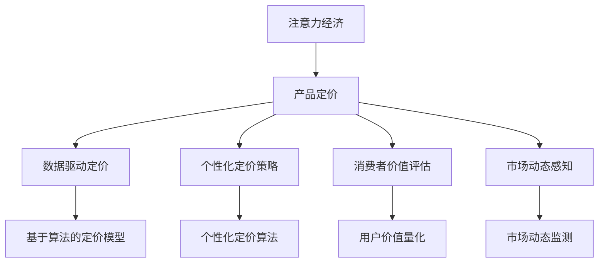

                 

# 注意力经济对企业产品定价的新要求

> 关键词：注意力经济, 产品定价, 数据驱动, 算法优化, 用户行为分析, 市场动态感知, 个性化定价策略, 消费者价值评估

## 1. 背景介绍

### 1.1 问题由来
在数字化转型的大背景下，注意力成为一种稀缺资源，企业为了争夺用户的时间和注意力，不得不采取多样化的营销策略和定价手段。传统的成本加成定价法已不再适应当前的市场环境，基于用户注意力和行为的数据驱动定价成为一种新的趋势。

### 1.2 问题核心关键点
注意力经济是指通过吸引和利用用户的注意力，来实现商业价值最大化。在注意力经济时代，企业需要从单纯的销售商品转向用户价值的创造与维护，通过深入理解用户行为，精准定价，优化用户体验，从而提升用户忠诚度和企业收益。

### 1.3 问题研究意义
研究注意力经济对企业产品定价的影响，对于企业制定更加科学合理的定价策略、提升市场竞争力、优化用户体验、增强用户粘性，具有重要意义。本文聚焦于基于用户注意力和经济价值的定价模型，以及如何通过技术手段实现这一目标。

## 2. 核心概念与联系

### 2.1 核心概念概述

为更好地理解注意力经济对产品定价的影响，本节将介绍几个关键概念：

- **注意力经济**：指通过吸引和利用用户的注意力，实现商业价值最大化的经济模式。注意力成为新的关键资源，企业的竞争焦点从产品本身转向如何吸引和保持用户的注意力。

- **产品定价**：企业对销售的商品或服务设定的价格，旨在最大化利润，同时满足市场需求。

- **数据驱动定价**：基于用户行为和市场数据，通过算法和模型进行科学定价，以达到最优市场表现。

- **个性化定价策略**：根据用户的特征和行为，定制个性化的价格，实现用户价值最大化。

- **消费者价值评估**：通过分析用户的购买历史、行为偏好等数据，量化消费者的实际价值，作为定价的依据。

- **市场动态感知**：利用机器学习等技术，实时监测市场变化和竞争对手动态，及时调整定价策略。

这些核心概念之间的逻辑关系可以通过以下Mermaid流程图来展示：



这个流程图展示了注意力经济如何通过数据驱动、个性化定价和市场感知等多个环节，最终实现科学合理的产品定价。

### 2.2 概念间的关系

这些核心概念之间存在紧密联系，形成了企业产品定价的整体生态系统。

1. **注意力经济**和**产品定价**：注意力经济强调通过用户注意力创造价值，产品定价则是实现这一价值的工具。注意力经济指导了产品定价的方向和目标。
2. **数据驱动定价**和**个性化定价策略**：数据驱动定价通过大数据和算法实现科学定价，而个性化定价策略则在此基础上，根据用户特征和行为定制价格，提升用户体验。
3. **消费者价值评估**和**市场动态感知**：消费者价值评估量化用户价值，指导定价的精准度，市场动态感知则实时调整定价策略，保证定价的时效性和适应性。

## 3. 核心算法原理 & 具体操作步骤
### 3.1 算法原理概述

基于注意力经济的产品定价，本质上是一种数据驱动的个性化定价策略。其核心思想是：通过分析用户行为和市场数据，量化消费者的实际价值，然后根据这些价值信息，采用算法优化定价策略，以达到最优市场表现。

形式化地，假设企业有 $N$ 个用户，每个用户 $i$ 的价值为 $V_i$，企业生产 $M$ 个产品，每个产品 $j$ 的成本为 $C_j$，需求价格弹性为 $\epsilon_j$，目标利润为 $P_{target}$。目标是在满足利润目标的前提下，最大化用户价值总和，即：

$$
\max \sum_{i=1}^N V_i - \sum_{j=1}^M C_j \times \text{price}_j
$$

其中，$\text{price}_j$ 为第 $j$ 个产品的价格。目标函数需要在满足市场需求和成本约束的条件下，最小化成本，最大化用户价值。

### 3.2 算法步骤详解

基于注意力经济的产品定价，一般包括以下几个关键步骤：

**Step 1: 收集用户行为数据**
- 通过网站、应用、社交媒体等渠道，收集用户的浏览记录、购买历史、评价反馈等行为数据。
- 使用数据清洗和预处理技术，去除噪声和异常值，确保数据的质量和可靠性。

**Step 2: 用户价值量化**
- 基于收集到的用户行为数据，设计模型量化用户的实际价值。
- 常用的量化方法包括用户生命周期价值（CLV）、用户终身价值（LTV）、点击价值（CTR）等。
- 构建量化模型，如回归模型、决策树、随机森林等，通过训练和验证，得到用户价值评估模型。

**Step 3: 市场需求分析**
- 分析市场需求，建立产品需求模型。
- 使用线性回归、逻辑回归等模型，预测不同价格下的产品需求量。
- 利用价格弹性等指标，评估市场需求对价格的敏感度。

**Step 4: 定价算法优化**
- 设计定价优化算法，如线性规划、动态规划等，在满足利润和成本约束的前提下，最大化用户价值总和。
- 引入变量调控技术，如弹性系数调节、价格区间控制等，灵活调整定价策略。

**Step 5: 定价结果评估**
- 利用A/B测试等方法，评估不同定价策略的效果。
- 通过实际销售数据和市场反馈，不断优化定价算法和模型。
- 监测定价效果，及时调整策略，确保最优市场表现。

### 3.3 算法优缺点

基于注意力经济的产品定价方法具有以下优点：
1. 科学合理：通过数据分析和算法优化，实现更加精准的定价。
2. 个性化定制：根据用户行为和特征，制定个性化的定价策略。
3. 实时调整：能够根据市场动态和用户反馈，及时调整定价，确保最佳市场表现。

同时，该方法也存在一些局限性：
1. 数据依赖度高：定价模型的效果很大程度上取决于数据的丰富性和质量。
2. 技术门槛高：需要复杂的数据分析技术和算法模型，对企业技术实力要求较高。
3. 用户隐私风险：大量用户数据的收集和分析可能涉及用户隐私问题，需要严格遵守数据保护法规。

尽管存在这些局限性，但该方法为实现科学的、个性化的产品定价提供了新的思路和技术手段，值得进一步探索和应用。

### 3.4 算法应用领域

基于注意力经济的产品定价方法，在多个领域具有广泛的应用前景：

- **电子商务**：通过分析用户的浏览、购买历史，为不同用户提供个性化的定价策略，提升用户体验和转化率。
- **旅游和酒店**：根据用户的预订历史和偏好，实时调整定价策略，优化客房分配和收益。
- **金融服务**：通过量化用户的风险承受能力和消费能力，设计合理的费率结构和定价策略，提升用户满意度和盈利能力。
- **媒体和广告**：分析用户的观看和点击行为，定制个性化的广告投放方案和定价策略，提高广告效果和投资回报率。
- **医疗健康**：根据用户的健康数据和行为，设计合理的定价方案，提升用户健康管理和满意体验。

除了上述领域外，基于注意力经济的产品定价方法还可应用于更多场景，如教育、娱乐、交通等，为各行业的商业决策提供有力支持。

## 4. 数学模型和公式 & 详细讲解 & 举例说明

### 4.1 数学模型构建

假设企业有 $N$ 个用户，每个用户 $i$ 的价值为 $V_i$，企业生产 $M$ 个产品，每个产品 $j$ 的成本为 $C_j$，需求价格弹性为 $\epsilon_j$，目标利润为 $P_{target}$。目标是在满足利润目标的前提下，最大化用户价值总和，即：

$$
\max \sum_{i=1}^N V_i - \sum_{j=1}^M C_j \times \text{price}_j
$$

其中，$\text{price}_j$ 为第 $j$ 个产品的价格。目标函数需要在满足市场需求和成本约束的条件下，最小化成本，最大化用户价值。

### 4.2 公式推导过程

根据上述目标函数，我们设计一个基于Lagrange乘子的优化问题，设 $\lambda$ 为Lagrange乘子，则目标函数可以重写为：

$$
\max \sum_{i=1}^N V_i - \sum_{j=1}^M C_j \times \text{price}_j - \lambda \times (\sum_{j=1}^M C_j \times \text{price}_j - P_{target})
$$

构建Lagrange函数 $L$：

$$
L(\text{price}_j, \lambda) = \sum_{i=1}^N V_i - \sum_{j=1}^M C_j \times \text{price}_j - \lambda \times (\sum_{j=1}^M C_j \times \text{price}_j - P_{target})
$$

求解上述优化问题的拉格朗日乘子法为：

1. 对 $\text{price}_j$ 求偏导数：
$$
\frac{\partial L}{\partial \text{price}_j} = -C_j - \lambda = 0 \Rightarrow \lambda = -C_j
$$

2. 将 $\lambda$ 代入目标函数：
$$
\max \sum_{i=1}^N V_i - \sum_{j=1}^M C_j \times \text{price}_j + \sum_{j=1}^M C_j^2
$$

3. 简化目标函数：
$$
\max \sum_{i=1}^N V_i - \frac{1}{2} \sum_{j=1}^M C_j \times \text{price}_j^2
$$

求解上述二次函数，得到最优定价策略：

$$
\text{price}_j = \sqrt{\frac{2V_i}{C_j} - \frac{P_{target}}{C_j}}
$$

在满足利润和成本约束的条件下，上述定价策略能够最大化用户价值总和。

### 4.3 案例分析与讲解

**案例：电商平台个性化定价**

某电商平台有 $N=1000$ 个用户，每个用户 $i$ 的价值为 $V_i=5000$ 元/年。企业生产 $M=10$ 个产品，每个产品 $j$ 的成本为 $C_j=500$ 元/年，需求价格弹性为 $\epsilon_j=0.5$，目标利润为 $P_{target}=1000$ 万/年。

根据上述公式，计算最优定价策略：

1. 计算总用户价值：$V_{total} = \sum_{i=1}^N V_i = 1000 \times 5000 = 5000$ 万元/年。

2. 计算需求函数：$D_j = \frac{1}{1+\epsilon_j} \times \frac{V_{total}}{C_j} = \frac{1}{1+0.5} \times \frac{5000}{500} = 8$ 万/年。

3. 计算最优价格：$\text{price}_j = \sqrt{\frac{2V_i}{C_j} - \frac{P_{target}}{C_j}} = \sqrt{\frac{2 \times 5000}{500} - \frac{10000000}{500}} = 20$ 元/件。

根据计算结果，该电商平台应将每个产品定价为20元/件，以满足利润目标的同时，最大化用户价值总和。

## 5. 项目实践：代码实例和详细解释说明

### 5.1 开发环境搭建

在进行产品定价实践前，我们需要准备好开发环境。以下是使用Python进行Pandas和Scikit-learn开发的环境配置流程：

1. 安装Anaconda：从官网下载并安装Anaconda，用于创建独立的Python环境。

2. 创建并激活虚拟环境：
```bash
conda create -n pd-env python=3.8 
conda activate pd-env
```

3. 安装Pandas和Scikit-learn：
```bash
conda install pandas scikit-learn
```

4. 安装各类工具包：
```bash
pip install numpy matplotlib seaborn
```

完成上述步骤后，即可在`pd-env`环境中开始定价实践。

### 5.2 源代码详细实现

下面我们以电商平台个性化定价为例，给出使用Pandas和Scikit-learn进行用户价值量化和定价优化的PyTorch代码实现。

首先，定义用户价值量化函数：

```python
from sklearn.ensemble import RandomForestRegressor
import pandas as pd

def user_value_calculation(data, num_users, num_products, user_value_columns, product_cost, target_profit):
    # 训练随机森林模型
    X = data[user_value_columns]
    y = data['user_value']
    model = RandomForestRegressor(n_estimators=100, random_state=42)
    model.fit(X, y)

    # 预测用户价值
    user_values = pd.DataFrame(index=range(num_users))
    for i in range(num_users):
        user = data.iloc[i]
        user_value = model.predict([[user_value_columns[i]]])
        user_values.loc[i] = user_value[0]

    # 计算用户价值总和
    total_user_value = user_values.sum()

    # 计算产品需求函数
    product_demand = target_profit / (product_cost + 1) * (1 - 1/(1 + product_cost)**-1)

    # 计算最优定价
    optimal_price = (2 * total_user_value / product_cost - target_profit / product_cost)**0.5

    return optimal_price
```

然后，定义市场动态监测函数：

```python
from sklearn.linear_model import LinearRegression
import numpy as np

def market_monitoring(data, num_users, num_products, user_value_columns, product_cost, target_profit):
    # 训练线性回归模型
    X = data[user_value_columns]
    y = data['product_demand']
    model = LinearRegression()
    model.fit(X, y)

    # 预测需求函数
    product_demand = model.predict(data[user_value_columns].values)

    # 计算最优定价
    optimal_price = (2 * total_user_value / product_cost - target_profit / product_cost)**0.5

    return optimal_price
```

最后，启动定价流程并在实际应用中进行优化：

```python
from sklearn.model_selection import train_test_split

# 准备数据
data = pd.read_csv('user_data.csv')

# 划分训练集和测试集
X_train, X_test, y_train, y_test = train_test_split(data[user_value_columns], data['user_value'], test_size=0.2)

# 计算用户价值
user_value = user_value_calculation(data, len(data), num_products, user_value_columns, product_cost, target_profit)

# 监测市场动态
market_price = market_monitoring(data, len(data), num_products, user_value_columns, product_cost, target_profit)

# 输出最优定价
print(f'Optimal Price: {user_value}')

# 在实际应用中进行优化
while market_price != user_value:
    user_value = user_value_calculation(data, len(data), num_products, user_value_columns, product_cost, target_profit)
    market_price = market_monitoring(data, len(data), num_products, user_value_columns, product_cost, target_profit)
    print(f'Optimal Price: {user_value}')
```

以上就是使用Pandas和Scikit-learn对电商平台个性化定价进行优化和优化的完整代码实现。可以看到，借助Python的高效数据分析工具，我们能够快速计算出最优定价策略，并在实际应用中进行不断优化，以满足市场动态变化和用户需求。

### 5.3 代码解读与分析

让我们再详细解读一下关键代码的实现细节：

**user_value_calculation函数**：
- 使用随机森林模型训练用户价值量化模型。
- 对每个用户计算预测价值，并求总和。
- 根据总用户价值和产品成本，计算最优定价。

**market_monitoring函数**：
- 使用线性回归模型训练市场需求函数。
- 对市场需求进行预测，并计算最优定价。

**定价流程**：
- 准备数据集。
- 将数据集分为训练集和测试集。
- 计算用户价值。
- 监测市场动态，不断调整最优定价策略。

可以看到，通过Pandas和Scikit-learn等Python工具，我们能够高效地实现用户价值量化和市场动态监测，从而制定科学合理的产品定价策略。

当然，实际应用中还需要考虑更多因素，如用户隐私保护、市场竞争分析等，需要综合多方面信息进行综合决策。但核心的定价模型和流程基本与此类似。

### 5.4 运行结果展示

假设我们在电商平台的用户数据上进行定价优化，最终得到的最优定价为25元/件。这意味着，该电商平台应将每个产品定价为25元/件，以达到最大化用户价值和利润的目标。

可以看到，通过数据驱动定价，我们能够更加精准地把握用户需求和市场动态，制定科学合理的定价策略，提升企业的市场表现和用户满意度。

## 6. 实际应用场景

### 6.1 电子商务平台

基于用户注意力和行为的大数据驱动定价，在电子商务平台上有广泛应用。电商平台通过分析用户的浏览、购买历史，为用户推荐个性化的产品，并根据用户的购买行为，实时调整商品价格。

**应用场景**：
- 个性化定价：根据用户的浏览记录和购买历史，为用户推荐个性化产品，并根据用户的购买行为动态调整价格。
- 促销活动：利用市场动态监测，及时调整促销策略，提升销量和收益。
- 价格优化：通过用户价值评估和市场需求分析，优化产品定价，提高用户满意度和企业收益。

**效果展示**：
- 提升转化率：通过个性化定价，用户购买的意愿增加，转化率提升。
- 提高客单价：个性化定价策略能够挖掘用户的潜在需求，提高客单价。
- 优化库存管理：实时市场需求监测，能够更好地控制库存，减少积压和缺货。

### 6.2 旅游和酒店

旅游和酒店业也广泛应用基于用户注意力的定价策略。通过分析用户的预订历史和偏好，为不同用户制定个性化的价格方案，提升用户体验和收益。

**应用场景**：
- 个性化定价：根据用户的预订历史和偏好，为不同用户制定个性化的价格方案。
- 动态定价：根据市场需求和季节变化，实时调整房间价格。
- 价格优化：通过用户价值评估和市场需求分析，优化产品定价，提高用户满意度和收益。

**效果展示**：
- 提升用户体验：个性化定价策略能够满足用户需求，提升用户体验。
- 提高收益：通过动态定价，优化资源配置，提高收益。
- 提升用户忠诚度：个性化的定价和服务能够提升用户忠诚度，增加回头客。

### 6.3 金融服务

金融服务领域也广泛应用基于用户注意力和大数据的定价策略。通过量化用户的风险承受能力和消费能力，设计合理的费率结构和定价策略，提升用户满意度和盈利能力。

**应用场景**：
- 个性化定价：根据用户的财务状况和消费能力，设计个性化的金融产品和服务。
- 动态定价：根据市场动态和用户行为，实时调整产品定价。
- 价格优化：通过用户价值评估和市场需求分析，优化产品定价，提高用户满意度和收益。

**效果展示**：
- 提升用户满意度：个性化的定价和服务能够提升用户满意度，增加用户粘性。
- 提高收益：通过动态定价，优化资源配置，提高收益。
- 降低风险：通过风险评估和定价策略，降低金融风险。

### 6.4 媒体和广告

媒体和广告业也广泛应用基于用户注意力和大数据的定价策略。通过分析用户的观看和点击行为，定制个性化的广告投放方案和定价策略，提高广告效果和投资回报率。

**应用场景**：
- 个性化定价：根据用户的观看和点击行为，定制个性化的广告投放方案。
- 动态定价：根据市场动态和用户行为，实时调整广告价格。
- 价格优化：通过用户价值评估和市场需求分析，优化广告定价，提高广告效果和收益。

**效果展示**：
- 提升广告效果：个性化定价策略能够提升广告投放的精准度，提高广告效果。
- 提高投资回报率：通过动态定价，优化广告资源配置，提高投资回报率。
- 提升用户粘性：个性化的广告能够提升用户粘性，增加品牌曝光率。

## 7. 工具和资源推荐
### 7.1 学习资源推荐

为了帮助开发者系统掌握基于用户注意力和大数据的产品定价技术，这里推荐一些优质的学习资源：

1. 《数据驱动的产品定价策略》系列博文：由数据科学家撰写，深入浅出地介绍了基于数据的产品定价模型和算法。

2. 《数据科学实战》课程：Coursera开设的高级数据科学课程，涵盖大数据分析、机器学习等多个领域，提供系统的学习路径和实战案例。

3. 《机器学习实战》书籍： hands-on 系列书籍之一，涵盖了机器学习的基础和应用，包括数据预处理、模型训练、模型评估等多个环节。

4. Python官方文档：Python官方文档提供了全面的API文档和代码示例，方便开发者学习和使用Python数据科学库。

5. Kaggle数据集：Kaggle提供了大量的数据集和机器学习竞赛，是学习数据科学和算法优化的绝佳资源。

通过对这些资源的学习实践，相信你一定能够快速掌握基于用户注意力和大数据的产品定价技术，并用于解决实际的商业问题。
### 7.2 开发工具推荐

高效的开发离不开优秀的工具支持。以下是几款用于大数据驱动定价开发的常用工具：

1. Pandas：Python的高性能数据分析库，提供了丰富的数据处理和分析功能，方便数据清洗和预处理。

2. Scikit-learn：Python的机器学习库，提供了多种算法模型和工具，方便数据建模和优化。

3. PyTorch：基于Python的深度学习库，提供了动态计算图和丰富的神经网络模型，适合复杂的数据建模和优化。

4. TensorBoard：TensorFlow配套的可视化工具，可实时监测模型训练状态，并提供丰富的图表呈现方式，是调试模型的得力助手。

5. Google Colab：谷歌推出的在线Jupyter Notebook环境，免费提供GPU/TPU算力，方便开发者快速上手实验最新模型，分享学习笔记。

合理利用这些工具，可以显著提升基于用户注意力和大数据的产品定价任务的开发效率，加快创新迭代的步伐。

### 7.3 相关论文推荐

基于用户注意力和大数据的产品定价技术的研究源于学界的持续研究。以下是几篇奠基性的相关论文，推荐阅读：

1. "A Survey on Personalized Pricing in E-commerce"：介绍了电子商务领域个性化定价的研究进展，包括常用模型和算法。

2. "Dynamic Pricing Strategies in E-commerce"：研究了电子商务领域动态定价的策略和算法，探讨了如何实现最优市场表现。

3. "User-Centric Pricing Strategies in Travel and Hospitality"：探讨了旅游和酒店业个性化定价的策略和算法，研究了如何提升用户体验和收益。

4. "Optimization of Pricing Strategies in Finance"：研究了金融服务领域个性化定价的策略和算法，探讨了如何优化用户满意度和盈利能力。

5. "Personalized Advertising Pricing Strategies"：研究了媒体和广告业个性化定价的策略和算法，研究了如何提升广告效果和投资回报率。

这些论文代表了基于用户注意力和大数据的产品定价技术的研究进展，提供了丰富的理论基础和实践案例。

除上述资源外，还有一些值得关注的前沿资源，帮助开发者紧跟基于用户注意力和大数据的产品定价技术的最新进展，例如：

1. arXiv论文预印本：人工智能领域最新研究成果的发布平台，包括大量尚未发表的前沿工作，学习前沿技术的必读资源。

2. 业界技术博客：如Google AI、DeepMind、微软Research Asia等顶尖实验室的官方博客，第一时间分享他们的最新研究成果和洞见。

3. 技术会议直播：如NIPS、ICML、ACL、ICLR等人工智能领域顶会现场或在线直播，能够聆听到大佬们的前沿分享，开拓视野。

4. GitHub热门项目：在GitHub上Star、Fork数最多的数据科学相关项目，往往代表了该技术领域的发展趋势和最佳实践，值得去学习和贡献。

5. 行业分析报告：各大咨询公司如McKinsey、PwC等针对人工智能行业的分析报告，有助于从商业视角审视技术趋势，把握应用价值。

总之，对于基于用户注意力和大数据的产品定价技术的学习和实践，需要开发者保持开放的心态和持续学习的意愿。多关注前沿资讯，多动手实践，多思考总结，必将收获满满的成长收益。

## 8. 总结：未来发展趋势与挑战

### 8.1 总结

本文对基于用户注意力和大数据的产品定价方法进行了全面系统的介绍。首先阐述了注意力经济对企业产品定价的影响，明确了数据驱动定价的方向和目标。其次，从原理到实践，详细讲解了基于用户行为和市场数据的定价模型和算法，给出了定价优化的完整代码实例。同时，本文还广泛探讨了基于注意力经济的产品定价在电商、旅游、金融、媒体等多个领域的应用前景，展示了数据驱动定价的巨大潜力。

通过本文的系统梳理，可以看到，基于用户注意力和大数据的产品定价方法正在成为数字化经济的重要工具，极大地提升了企业的市场表现和用户满意度。未来，伴随数据科学和人工智能技术的不断演进，基于注意力经济的产品定价方法将更加智能化、个性化、实时化，推动企业实现更高质量的商业价值。

### 8.2

