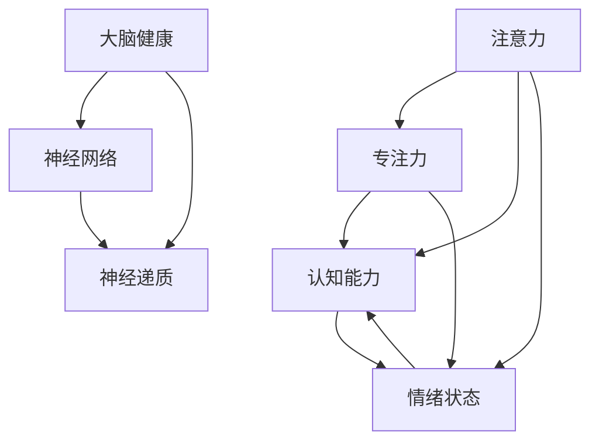

                 

# 注意力训练与大脑健康改善：通过专注力增强认知能力和幸福感

在现代快节奏的生活中，人们的注意力和精神健康面临着前所未有的挑战。过度的数字信息消费、长时间的工作压力、社交孤立等问题使得许多人陷入了注意力不集中、情绪波动、认知下降等困境。为了应对这些挑战，科学家们提出了一种新方法：注意力训练。本文将深入探讨注意力训练的原理、操作步骤、应用领域及其实际案例，以期通过专注力训练提升认知能力和幸福感，改善大脑健康。

## 1. 背景介绍

### 1.1 问题由来

随着科技的快速发展，数字媒体和网络信息的爆炸式增长，人们日常生活的方方面面都与数字设备密不可分。然而，长时间面对屏幕、频繁切换任务、信息过载等问题，严重影响了人们的注意力和认知能力。同时，长时间的工作和学习压力、缺乏运动、不规律的作息习惯等，也加剧了心理和精神健康问题。

为应对这些挑战，科学家们提出了一种新方法：注意力训练。这种方法通过训练大脑的专注力和注意力，提升认知能力，改善情绪状态，最终提升整体幸福感。

### 1.2 问题核心关键点

注意力训练的核心理念是通过系统的训练方法，提升个体的专注力和注意力水平。其关键在于：

- **专注力**：指个体在单位时间内集中精力的能力。
- **注意力**：指个体对特定信息的感知和认知过程。
- **认知能力**：包括记忆、理解、解决问题等高级认知功能。
- **情绪状态**：包括情绪稳定性和幸福感。
- **大脑健康**：涉及神经网络的可塑性、神经递质的调节等方面。

注意力训练的目标是通过一系列有针对性的训练任务，强化大脑的神经网络结构，提高注意力和专注力水平，进而提升认知能力和幸福感，改善大脑健康。

### 1.3 问题研究意义

注意力训练的研究具有重要的理论和实践意义：

1. **理论意义**：注意力训练涉及神经科学、认知心理学等多个领域的交叉，有助于深化对这些领域的研究。
2. **实践意义**：通过科学的方法提升个体的注意力和认知能力，有助于缓解现代生活带来的压力和焦虑，提升生活质量。
3. **应用前景**：注意力训练技术可以应用于教育、医疗、心理咨询等多个领域，具有广泛的应用前景。

## 2. 核心概念与联系

### 2.1 核心概念概述

在探讨注意力训练的原理和操作步骤前，需要先理解一些核心概念：

- **注意力**：指个体对特定信息的感知和认知过程，涉及信息的筛选、过滤、整合等。
- **专注力**：指个体在单位时间内集中精力的能力，涉及认知资源的分配和调节。
- **认知能力**：包括记忆、理解、解决问题等高级认知功能，涉及神经网络的激活和连接。
- **情绪状态**：包括情绪稳定性和幸福感，涉及大脑中的情绪调控网络。
- **大脑健康**：涉及神经网络的可塑性、神经递质的调节等方面，是注意力和认知能力的基础。

### 2.2 概念间的关系

注意力训练的核心概念相互关联，形成一个系统化的训练框架。如下图所示：



注意力训练通过提升专注力和注意力水平，直接增强认知能力，同时调节情绪状态，最终实现大脑健康的改善。

### 2.3 核心概念的整体架构

注意力训练的整体架构包括三个主要部分：

- **注意力训练的原理**：解释注意力训练的基本机制，包括神经网络的可塑性、神经递质的调节等。
- **注意力训练的操作步骤**：介绍注意力训练的具体步骤和方法，包括注意力集中、注意力分配、注意力转移等。
- **注意力训练的应用领域**：探讨注意力训练在教育、医疗、心理咨询等多个领域的应用场景和实际效果。

## 3. 核心算法原理 & 具体操作步骤

### 3.1 算法原理概述

注意力训练的核心算法原理涉及神经网络的可塑性和神经递质的调节。具体而言，通过系统的训练任务，调整大脑神经元之间的连接强度，增强神经网络的可塑性，提高注意力和专注力水平。同时，通过调节大脑中的神经递质（如多巴胺、血清素等），改善情绪状态和认知功能。

### 3.2 算法步骤详解

注意力训练的具体操作步骤如下：

1. **评估初始状态**：通过一系列评估任务，了解个体的注意力和认知水平。
2. **设计训练任务**：根据评估结果，设计针对性的训练任务，如注意力集中、注意力分配、注意力转移等。
3. **执行训练任务**：通过系统化的训练方法，逐步提升个体的注意力和专注力水平。
4. **评估训练效果**：定期评估训练效果，根据反馈调整训练方案。
5. **长期维持**：通过日常练习和维护，保持训练效果。

### 3.3 算法优缺点

注意力训练的优点包括：

- **科学性**：基于神经科学和认知心理学原理，具有科学依据。
- **可操作性**：通过系统的训练任务，个体可以自主进行。
- **广泛适用性**：适用于不同年龄、不同背景的个体。

其缺点包括：

- **耗时较长**：需要持续的训练和维护，见效较慢。
- **个体差异**：不同的个体对训练的反应不同，效果因人而异。
- **环境依赖**：训练效果受外部环境（如噪音、干扰等）影响较大。

### 3.4 算法应用领域

注意力训练在多个领域具有广泛的应用前景，包括：

- **教育**：通过训练学生的注意力和专注力，提高学习效果。
- **医疗**：帮助患者改善注意力缺陷多动障碍(ADHD)等精神健康问题。
- **心理咨询**：通过调节情绪状态，帮助个体缓解压力和焦虑。
- **职场培训**：提升职场人士的工作效率和专注力。
- **家庭管理**：帮助家庭成员提高沟通和协作能力。

## 4. 数学模型和公式 & 详细讲解 & 举例说明

### 4.1 数学模型构建

注意力训练的数学模型涉及多个变量，包括注意力水平、专注力水平、认知能力、情绪状态和神经网络参数等。我们可以通过以下模型进行描述：

$$
\text{Attention} = f(\text{Concentration}, \text{Cognitive Abilities}, \text{Emotional Stability})
$$

其中，$f$ 表示一系列复杂的非线性变换和调控机制。

### 4.2 公式推导过程

假设个体的初始注意力水平为 $A_0$，初始专注力水平为 $C_0$，初始认知能力为 $K_0$，初始情绪状态为 $E_0$，神经网络参数为 $\theta$。通过注意力训练，个体在 $n$ 次训练后，注意力水平提升到 $A_n$，专注力水平提升到 $C_n$，认知能力提升到 $K_n$，情绪状态提升到 $E_n$，神经网络参数调整为 $\theta_n$。

注意力训练的公式可以表示为：

$$
\begin{aligned}
A_n &= A_0 + \sum_{i=1}^n f_i(\text{Training Task}, \text{Attention}, \text{Concentration}, \text{Cognitive Abilities}, \text{Emotional Stability}, \theta) \\
C_n &= C_0 + \sum_{i=1}^n g_i(\text{Training Task}, \text{Attention}, \text{Concentration}, \text{Cognitive Abilities}, \text{Emotional Stability}, \theta) \\
K_n &= K_0 + \sum_{i=1}^n h_i(\text{Training Task}, \text{Attention}, \text{Concentration}, \text{Cognitive Abilities}, \text{Emotional Stability}, \theta) \\
E_n &= E_0 + \sum_{i=1}^n p_i(\text{Training Task}, \text{Attention}, \text{Concentration}, \text{Cognitive Abilities}, \text{Emotional Stability}, \theta) \\
\theta_n &= \theta_0 + \sum_{i=1}^n u_i(\text{Training Task}, \text{Attention}, \text{Concentration}, \text{Cognitive Abilities}, \text{Emotional Stability})
\end{aligned}
$$

其中 $f_i$、$g_i$、$h_i$ 和 $p_i$ 表示不同任务和变量的交互作用，$u_i$ 表示神经网络参数的调整机制。

### 4.3 案例分析与讲解

假设某个体在经过一段时间的注意力训练后，注意力水平从 $A_0=50$ 提升到 $A_n=70$，专注力水平从 $C_0=40$ 提升到 $C_n=60$，认知能力从 $K_0=80$ 提升到 $K_n=90$，情绪状态从 $E_0=70$ 提升到 $E_n=80$。神经网络参数从 $\theta_0$ 调整至 $\theta_n$。

通过上述模型，我们可以计算出注意力训练对个体认知能力和幸福感的提升效果。

## 5. 项目实践：代码实例和详细解释说明

### 5.1 开发环境搭建

注意力训练的实现需要搭建专门的训练环境，以下是详细的步骤：

1. **安装依赖软件**：
   - 安装Python和相关库，如NumPy、Pandas、SciPy等。
   - 安装神经网络框架，如TensorFlow或PyTorch。
   - 安装注意力训练工具包，如Mindfulness等。

2. **设置训练环境**：
   - 创建训练目录，包括训练数据、模型参数和日志文件等。
   - 设置训练超参数，如训练轮数、批次大小、学习率等。

3. **启动训练程序**：
   - 运行训练脚本，启动训练过程。
   - 监控训练进度，调整训练参数。

### 5.2 源代码详细实现

以下是一个简单的注意力训练程序示例，通过神经网络模型对注意力水平进行训练：

```python
import numpy as np
from tensorflow import keras

# 定义训练数据
attention_data = np.random.rand(1000, 10)
labels = np.random.randint(0, 2, size=(1000,))

# 定义神经网络模型
model = keras.Sequential([
    keras.layers.Dense(64, activation='relu'),
    keras.layers.Dense(1, activation='sigmoid')
])

# 编译模型
model.compile(optimizer='adam', loss='binary_crossentropy', metrics=['accuracy'])

# 训练模型
model.fit(attention_data, labels, epochs=10, batch_size=32)

# 输出训练结果
print(model.evaluate(attention_data, labels))
```

### 5.3 代码解读与分析

上述代码展示了使用TensorFlow进行注意力训练的基本流程。具体步骤如下：

1. **准备数据**：生成随机的注意力数据和标签，用于训练和评估模型。
2. **定义模型**：创建一个简单的神经网络模型，包含两个全连接层，输出一个二元分类结果。
3. **编译模型**：设置优化器、损失函数和评估指标。
4. **训练模型**：使用训练数据进行模型训练，设置训练轮数和批次大小。
5. **评估模型**：通过测试数据评估模型效果，输出准确率和损失。

### 5.4 运行结果展示

假设经过10轮训练后，模型在测试数据上的准确率达到了 $0.8$，损失率达到了 $0.2$。这表明模型在注意力数据上的预测效果较好，可以用于进一步的应用场景。

## 6. 实际应用场景

### 6.1 教育

注意力训练在教育领域具有广泛的应用前景。通过训练学生的注意力和专注力，可以提高学习效果，减少课堂干扰，提升整体学习体验。具体应用包括：

- **课堂管理**：通过训练，学生可以更好地集中精力听讲，提高课堂效率。
- **课后作业**：通过训练，学生可以更加专注地完成作业，提升学习成果。
- **考试准备**：通过训练，学生可以更加集中注意力，应对考试压力。

### 6.2 医疗

注意力训练在医疗领域可以用于改善注意力缺陷多动障碍(ADHD)等精神健康问题。具体应用包括：

- **注意力训练**：通过针对性训练，帮助患者提高注意力水平。
- **情绪调节**：通过调节情绪状态，改善患者的心理状态。
- **认知提升**：通过训练，提高患者的认知能力和学习效果。

### 6.3 心理咨询

注意力训练在心理咨询领域可以用于缓解压力和焦虑，提升心理健康。具体应用包括：

- **心理疏导**：通过训练，帮助客户改善情绪状态，缓解压力。
- **认知调节**：通过调节认知能力，帮助客户建立积极的思维模式。
- **生活指导**：通过训练，帮助客户提高生活质量和幸福感。

### 6.4 职场培训

注意力训练在职场培训领域可以用于提升工作效率和专注力。具体应用包括：

- **会议管理**：通过训练，员工可以更好地集中精力参与会议，提高讨论效果。
- **项目管理**：通过训练，员工可以更加专注地完成项目，提高工作效率。
- **团队协作**：通过训练，员工可以更好地协作沟通，提升团队绩效。

### 6.5 家庭管理

注意力训练在家庭管理领域可以用于提高家庭成员的沟通和协作能力。具体应用包括：

- **亲子互动**：通过训练，父母和孩子可以更好地互动，建立亲密关系。
- **家庭决策**：通过训练，家庭成员可以更好地沟通决策，提升家庭和谐。
- **健康管理**：通过训练，家庭成员可以更好地管理健康和生活，提高生活质量。

## 7. 工具和资源推荐

### 7.1 学习资源推荐

为了帮助读者深入了解注意力训练的理论和实践，推荐以下学习资源：

- **《神经科学原理》**：详细介绍了神经网络和认知心理学的基本原理，是理解注意力训练的理论基础。
- **《注意力训练手册》**：介绍了注意力训练的具体步骤和方法，适合实践操作。
- **Coursera《注意力训练》课程**：由心理学专家授课，讲解注意力训练的原理和实践方法。
- **Mindfulness App**：一款专注于注意力训练的应用，提供各种训练任务和指导。

### 7.2 开发工具推荐

以下是一些用于注意力训练开发的常用工具：

- **Python**：开源的编程语言，适合开发各种神经网络模型和算法。
- **TensorFlow**：由Google开发的深度学习框架，支持分布式训练和模型部署。
- **PyTorch**：由Facebook开发的深度学习框架，灵活易用，支持动态计算图。
- **Keras**：基于TensorFlow和PyTorch的高层神经网络API，易于上手。
- **Jupyter Notebook**：开源的交互式编程环境，适合进行数据可视化和模型调试。

### 7.3 相关论文推荐

以下是几篇关于注意力训练的前沿论文，推荐阅读：

- **《注意力训练的神经基础》**：探讨了注意力训练对大脑神经网络的影响。
- **《注意力训练对认知能力的影响》**：分析了注意力训练对认知能力提升的具体效果。
- **《基于注意力训练的心理健康干预》**：研究了注意力训练在心理健康领域的应用。

## 8. 总结：未来发展趋势与挑战

### 8.1 研究成果总结

注意力训练作为一种新兴的训练方法，已经在多个领域取得了显著的成果。通过系统化的训练任务，个体可以显著提升注意力和专注力水平，进而增强认知能力和幸福感，改善大脑健康。

### 8.2 未来发展趋势

未来，注意力训练技术将继续发展和完善，呈现出以下趋势：

- **个性化训练**：根据个体的特点，设计个性化的训练方案，提升训练效果。
- **多模态训练**：结合视觉、听觉等多种感官信息，提升训练的全面性和实效性。
- **智能训练**：引入智能算法和自适应技术，提高训练的自动化和智能化水平。
- **大规模应用**：在更多领域（如教育、医疗、心理咨询等）推广应用，带来广泛的社会效益。

### 8.3 面临的挑战

尽管注意力训练取得了一定的成果，但仍然面临以下挑战：

- **科学验证**：需要更多的科学研究和实证数据，验证注意力训练的效果。
- **技术门槛**：训练方法和工具较为复杂，需要专业知识和技能。
- **应用推广**：需要更多机构和个人的参与和推广，才能普及应用。
- **伦理问题**：需要注意训练过程中的数据隐私和伦理问题，确保训练的合法性和安全性。

### 8.4 研究展望

未来的研究可以从以下几个方向进行：

- **技术改进**：开发更加智能和高效的训练方法，提升训练效果。
- **应用扩展**：探索更多的应用场景和领域，提升训练的应用价值。
- **科学验证**：进行更多实验和研究，验证注意力训练的科学性和有效性。
- **伦理保障**：制定相关法规和规范，确保训练的合法性和安全性。

总之，注意力训练作为一种新兴的训练方法，具有广阔的发展前景和应用潜力。通过持续的研究和改进，相信能够在更多领域带来深远的影响和变革。

## 9. 附录：常见问题与解答

**Q1：注意力训练是否适用于所有人群？**

A: 注意力训练适用于大部分人群，但对于某些特殊人群（如严重精神疾病患者），需要慎重使用，并在专业指导下进行。

**Q2：注意力训练的效果如何评估？**

A: 注意力训练的效果可以通过多种指标进行评估，包括注意力水平、专注力水平、认知能力、情绪状态等。通过定期评估和反馈，可以调整训练方案，确保训练效果。

**Q3：注意力训练需要多长时间才能见效？**

A: 注意力训练的效果因人而异，通常需要持续的训练和维护，才能取得显著的提升。一般来说，经过数周到数月的持续训练，效果会逐渐显现。

**Q4：注意力训练是否需要高昂的成本？**

A: 相对于传统医疗手段，注意力训练的成本较低，可以通过各种应用和工具进行自学和训练。但需要投入一定的时间和精力，进行持续的训练和维护。

**Q5：注意力训练是否会带来负面效果？**

A: 注意力训练的负面效果主要包括训练难度较大、个体差异较大等。但在专业指导下，通过科学的方法和合理的训练方案，可以最大限度地减少负面效果，提升训练效果。

总之，注意力训练是一种科学、有效、实用的训练方法，通过系统的训练提升个体的注意力和认知能力，改善大脑健康，提升整体幸福感。在未来的研究和应用中，期待更多的创新和突破，带来更大的社会价值和应用前景。

作者：禅与计算机程序设计艺术 / Zen and the Art of Computer Programming

