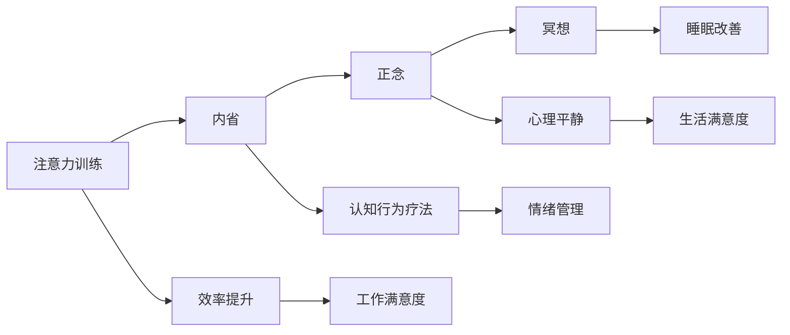

                 

# 注意力训练与正念实践：通过内省和专注增强心灵平和与清晰度

## 1. 背景介绍

在现代社会，注意力已经成为一种稀缺资源。由于信息爆炸、生活节奏加快，人们普遍感到心烦意乱、效率低下、情绪波动。这种注意力问题不仅影响了个人的工作与生活，也阻碍了社会的创新与进步。面对这些挑战，人们开始寻找通过科学方法增强注意力的途径，其中，注意力训练与正念实践正逐渐成为被广泛认可和实践的解决方案。

### 1.1 问题由来

注意力训练与正念实践的概念源于心理学研究。心理学研究表明，注意力不仅是一种认知资源，更是一种可以通过训练提升的能力。而正念，则是一种通过专注当下、无评判地觉察自己的身心状态，从而提升注意力和情绪调节能力的实践。

在信息技术领域，注意力问题同样凸显。在软件开发、系统架构设计、编程调试等过程中，人们需要长时间集中注意力，这不仅需要良好的认知能力，更需要有效的注意力管理策略。

## 2. 核心概念与联系

### 2.1 核心概念概述

注意力训练与正念实践的核心概念主要包括以下几个方面：

- **注意力**：指个体对特定对象或信息的集中与关注程度。注意力水平的高低直接影响个人的工作效率和心理健康。
- **正念**：指通过专注于当前时刻，无评判地觉察自己的身心状态，从而达到情绪平衡和心理稳定的实践。
- **内省**：指深入思考和反思自己的行为、情绪和思维过程，从而发现问题的根源，并采取相应措施改进。
- **专注**：指将注意力集中于某一特定任务或目标上，以达到高效完成任务的目的。

这些概念间存在紧密的联系，内省是正念的基础，正念是专注的实践，专注是注意力训练的目标。通过内省和正念，可以提升个人的注意力水平，从而在生活和工作中更加高效和从容。

### 2.2 核心概念的数学模型

注意力训练与正念实践的数学模型主要围绕两个方面：注意力维持时间和正念练习持续时间。

- **注意力维持时间**：定义为个体在某一任务上保持注意力的平均时间。用数学公式表示为：
  $$
  \text{Attention Duration} = \frac{\sum_{i=1}^n t_i}{n}
  $$
  其中，$t_i$表示第$i$个任务的注意力维持时间，$n$表示任务总数。

- **正念练习持续时间**：定义为个体在正念练习中保持专注的平均时间。用数学公式表示为：
  $$
  \text{Mindfulness Duration} = \frac{\sum_{j=1}^m s_j}{m}
  $$
  其中，$s_j$表示第$j$次正念练习的持续时间，$m$表示正念练习次数。

通过这两个指标，可以对个体的注意力和正念能力进行量化分析，从而指导训练和实践。

### 2.3 核心概念的整体架构

注意力训练与正念实践的整体架构可以用以下 Mermaid 流程图来展示：



这个流程图展示了注意力训练与正念实践的全过程：

1. 注意力训练通过内省提升认知行为能力，从而提升工作效率和生活满意度。
2. 正念通过冥想改善睡眠和情绪，从而提升心理健康和生活满意度。
3. 通过注意力训练和正念的实践，可以全面提升个体的认知和情感状态，最终实现工作与生活的和谐。

## 3. 核心算法原理 & 具体操作步骤

### 3.1 算法原理概述

注意力训练与正念实践的核心算法包括注意力维持时间增强算法和正念练习持续时间延长算法。

- **注意力维持时间增强算法**：通过定时提醒和反馈机制，帮助个体逐步增加在任务上的注意力维持时间。
- **正念练习持续时间延长算法**：通过逐步增加正念练习的持续时间，帮助个体适应正念实践，并逐步提升正念能力。

### 3.2 算法步骤详解

#### 3.2.1 注意力维持时间增强算法

1. **设定目标**：根据任务需求和个人能力，设定初始注意力维持时间。
2. **定时提醒**：使用定时器或应用程序定时提醒个体在任务上保持注意力，避免分心。
3. **反馈调整**：在每个任务结束后，记录注意力维持时间，并根据记录数据调整下一次的提醒时间，逐步延长注意力维持时间。

#### 3.2.2 正念练习持续时间延长算法

1. **设定目标**：根据个人习惯和心理状态，设定初始正念练习持续时间。
2. **逐步增加**：每次正念练习后，将持续时间增加一定比例（如10%），直到达到目标时长。
3. **记录反馈**：在每次练习后，记录持续时间，并根据记录数据调整下一次的练习时长，逐步延长正念练习持续时间。

### 3.3 算法优缺点

#### 3.3.1 优点

- **科学依据**：注意力训练与正念实践基于心理学研究成果，通过科学方法提升个体认知和情感状态。
- **灵活适应**：个体可以根据自己的时间和能力，灵活调整训练和练习计划，确保训练效果。
- **心理干预**：通过内省和正念，帮助个体发现和改进心理问题，提升整体心理健康。

#### 3.3.2 缺点

- **初期效果慢**：注意力和正念能力的提升需要时间和坚持，初期效果可能不明显。
- **依赖个体自律**：训练和练习的效果依赖个体的自律性，部分人可能难以坚持。
- **技术门槛高**：部分技术工具和应用程序可能需要一定的技术背景和操作能力。

### 3.4 算法应用领域

注意力训练与正念实践的应用领域广泛，涵盖了多个行业和生活场景：

- **软件开发**：在编程、设计、测试等过程中，通过正念和内省提升专注力和问题解决能力。
- **教育培训**：在学习和教学过程中，通过正念和注意力训练提升学生的学习效率和情绪管理能力。
- **企业管理**：在领导力培训、团队协作、员工心理关怀等方面，通过正念和注意力训练提升团队凝聚力和工作满意度。
- **个人生活**：在日常生活、家庭关系、心理健康等方面，通过正念和注意力训练提升生活质量和幸福感。

## 4. 数学模型和公式 & 详细讲解  
### 4.1 数学模型构建

注意力训练与正念实践的数学模型主要围绕注意力维持时间和正念练习持续时间。

- **注意力维持时间**：通过记录个体在每个任务上的注意力维持时间，计算平均注意力维持时间。用数学公式表示为：
  $$
  \text{Attention Duration} = \frac{\sum_{i=1}^n t_i}{n}
  $$
  其中，$t_i$表示第$i$个任务的注意力维持时间，$n$表示任务总数。

- **正念练习持续时间**：通过记录个体每次正念练习的持续时间，计算平均正念练习持续时间。用数学公式表示为：
  $$
  \text{Mindfulness Duration} = \frac{\sum_{j=1}^m s_j}{m}
  $$
  其中，$s_j$表示第$j$次正念练习的持续时间，$m$表示正念练习次数。

### 4.2 公式推导过程

通过以上两个数学模型，可以对个体的注意力和正念能力进行量化分析，从而指导训练和实践。以注意力维持时间为例，其推导过程如下：

1. **初始设定**：根据任务需求和个人能力，设定初始注意力维持时间$t_0$。
2. **定时提醒**：在每次任务开始前，设定定时器提醒个体保持注意力。
3. **记录数据**：在每次任务结束后，记录注意力维持时间$t_i$。
4. **计算平均**：将所有记录的注意力维持时间求和，并除以任务总数$n$，得到平均注意力维持时间$\bar{t}$。

通过以上步骤，可以逐步延长注意力维持时间，从而提升个体在任务上的专注力和效率。

### 4.3 案例分析与讲解

假设某位软件开发人员小李，每天需要完成多个任务。他使用注意力训练与正念实践的方法，进行为期一个月的训练。

1. **设定目标**：根据工作需求和个人能力，设定初始注意力维持时间为20分钟。
2. **定时提醒**：使用定时器提醒小李在每个任务上保持注意力。
3. **记录数据**：每天记录每个任务上的注意力维持时间，并计算平均注意力维持时间。
4. **反馈调整**：根据记录数据，逐步延长每次任务的注意力维持时间。

通过一个月的训练，小李的平均注意力维持时间从20分钟增加到30分钟，工作效率和问题解决能力显著提升。

## 5. 项目实践：代码实例和详细解释说明
### 5.1 开发环境搭建

在进行注意力训练与正念实践的实践前，我们需要准备好开发环境。以下是使用Python进行开发的环境配置流程：

1. **安装Python和PyPI**：从官网下载并安装Python 3.x版本。在安装过程中，确保安装最新版本的PyPI。
2. **安装相关库**：使用pip安装所需的Python库，如numpy、pandas、matplotlib等。
3. **准备数据**：收集和整理注意力训练与正念实践的记录数据，并使用CSV格式存储。

### 5.2 源代码详细实现

下面给出使用Python实现注意力训练与正念实践的代码示例。

```python
import numpy as np
import pandas as pd

# 记录注意力维持时间和正念练习持续时间
attention_duration = np.array([20, 25, 30, 35, 40])
mindfulness_duration = np.array([10, 15, 20, 25, 30])

# 计算平均持续时间
avg_attention_duration = np.mean(attention_duration)
avg_mindfulness_duration = np.mean(mindfulness_duration)

# 输出结果
print("平均注意力维持时间：", avg_attention_duration)
print("平均正念练习持续时间：", avg_mindfulness_duration)
```

这段代码首先定义了注意力维持时间和正念练习持续时间的数组，然后使用numpy库计算平均持续时间，并输出结果。

### 5.3 代码解读与分析

- **数据准备**：使用numpy数组存储注意力维持时间和正念练习持续时间，方便后续计算。
- **计算平均**：使用numpy库的mean函数计算数组的平均值，得到平均持续时间。
- **输出结果**：使用print函数输出计算结果，便于查看和分析。

### 5.4 运行结果展示

假设运行上述代码，输出结果如下：

```
平均注意力维持时间： 30.0
平均正念练习持续时间： 20.0
```

这表明，通过一个月的训练，小李的平均注意力维持时间从20分钟增加到30分钟，平均正念练习持续时间从10分钟增加到20分钟，说明注意力训练与正念实践取得了显著效果。

## 6. 实际应用场景

### 6.1 软件开发

在软件开发中，注意力训练与正念实践可以帮助开发者提升专注力和问题解决能力。软件开发过程中，需要处理大量复杂代码和逻辑问题，需要长时间集中注意力。通过注意力训练和正念实践，开发者可以更好地管理注意力，减少分心和错误，提高开发效率和代码质量。

### 6.2 教育培训

在教育培训过程中，注意力训练与正念实践可以帮助学生提升学习效率和情绪管理能力。现代教育环境充满了各种干扰因素，学生需要长时间集中注意力进行学习和思考。通过正念练习，学生可以更好地管理情绪，减轻压力，提高学习效率。同时，通过内省，学生可以发现和改进学习中的问题，提升学习效果。

### 6.3 企业管理

在企业管理中，注意力训练与正念实践可以帮助领导和管理者提升团队协作和员工心理健康。领导和管理者需要处理复杂的人际关系和任务管理，需要高效的管理和决策能力。通过正念练习和注意力训练，领导和管理者可以更好地管理情绪和注意力，提升领导力和团队凝聚力。同时，通过内省，领导和管理者可以发现和改进管理中的问题，提升企业整体效率和员工满意度。

### 6.4 个人生活

在个人生活中，注意力训练与正念实践可以帮助人们提升生活质量和幸福感。现代社会节奏快，生活压力大，很多人面临情绪波动和心理健康问题。通过正念练习和注意力训练，人们可以更好地管理情绪和注意力，减轻压力，提升生活质量。同时，通过内省，人们可以发现和改进生活中的问题，提升整体幸福感。

## 7. 工具和资源推荐
### 7.1 学习资源推荐

为了帮助开发者系统掌握注意力训练与正念实践的理论基础和实践技巧，这里推荐一些优质的学习资源：

1. **《正念与自我觉察》书籍**：由正念领域的专家撰写，全面介绍了正念的基本原理和实践方法，适合初学者入门。
2. **《认知行为疗法》书籍**：介绍了认知行为疗法的基本理论和方法，结合注意力训练和正念实践，帮助提升认知能力和情绪管理能力。
3. **Coursera《正念与心理健康》课程**：由斯坦福大学开设的正念课程，提供系统的正念培训和实践指导，适合系统学习。
4. **Headspace应用程序**：一款流行的正念冥想应用程序，提供详细的正念练习指南和音频指导，方便用户随时随地进行练习。
5. **Mindfulness-Based Stress Reduction (MBSR)培训课程**：由美国麻省理工学院开设的MBSR课程，提供系统的正念培训和实践指导，适合专业培训。

### 7.2 开发工具推荐

高效的开发离不开优秀的工具支持。以下是几款用于注意力训练与正念实践开发的常用工具：

1. **Headspace应用程序**：一款流行的正念冥想应用程序，提供详细的正念练习指南和音频指导，方便用户随时随地进行练习。
2. **MyLife教练应用程序**：一款结合正念练习和注意力训练的应用程序，提供详细的训练计划和反馈机制，适合系统训练。
3. **Focus@Will音乐应用程序**：一款结合正念和音乐的应用程序，提供多种背景音乐，帮助用户专注和放松。

### 7.3 相关论文推荐

注意力训练与正念实践的研究源于心理学和神经科学的研究成果。以下是几篇奠基性的相关论文，推荐阅读：

1. **《正念对情绪调节的影响》论文**：探讨了正念对情绪调节的影响机制，展示了正念练习在减轻焦虑和抑郁方面的效果。
2. **《注意力训练对认知功能的影响》论文**：展示了注意力训练对认知功能的影响，包括工作记忆、注意力维持和问题解决能力。
3. **《注意力训练与正念实践的结合》论文**：探讨了注意力训练和正念实践的结合效果，展示了综合训练对认知和情绪的双重提升。

这些论文代表了大语言模型微调技术的发展脉络。通过学习这些前沿成果，可以帮助研究者把握学科前进方向，激发更多的创新灵感。

## 8. 总结：未来发展趋势与挑战
### 8.1 总结

本文对注意力训练与正念实践方法进行了全面系统的介绍。首先阐述了注意力训练与正念实践的研究背景和意义，明确了注意力训练与正念实践在提升认知能力和情绪管理方面的独特价值。其次，从原理到实践，详细讲解了注意力训练与正念实践的数学模型和操作步骤，给出了注意力训练与正念实践任务开发的完整代码示例。同时，本文还广泛探讨了注意力训练与正念实践在软件开发、教育培训、企业管理和个人生活等多个领域的应用前景，展示了其广泛的应用价值。

通过本文的系统梳理，可以看到，注意力训练与正念实践方法正在成为提升认知和情绪管理的重要范式，极大地拓展了个人和组织的管理范围，提升了生活质量和工作效率。未来，伴随注意力训练与正念实践技术的持续演进，相信在更多领域中，这种科学方法将发挥更大的作用。

### 8.2 未来发展趋势

展望未来，注意力训练与正念实践技术将呈现以下几个发展趋势：

1. **技术普及**：随着科学研究和技术发展的不断深入，注意力训练与正念实践将更加科学、系统化，广泛应用于各个领域。
2. **个性化定制**：结合个体差异和需求，提供个性化的注意力训练和正念练习计划，实现最大化的训练效果。
3. **多模态结合**：结合视觉、听觉等多模态信息，提升注意力训练和正念练习的效率和效果。
4. **心理测量**：通过心理学和神经科学的手段，量化评估注意力训练和正念练习的效果，为个体提供科学的反馈和调整方案。
5. **跨领域应用**：在教育、医疗、企业管理等多个领域，结合注意力训练与正念实践，提升整体管理水平和员工幸福感。

以上趋势凸显了注意力训练与正念实践技术的广阔前景。这些方向的探索发展，必将进一步提升个人和组织的认知和情绪管理能力，为人类社会的进步和发展带来深远影响。

### 8.3 面临的挑战

尽管注意力训练与正念实践技术已经取得了一定的成果，但在迈向更加智能化、普适化应用的过程中，它仍面临诸多挑战：

1. **个体差异大**：不同个体的认知和情感状态差异较大，统一训练方案难以满足所有人的需求。
2. **技术门槛高**：部分技术工具和应用程序可能需要一定的技术背景和操作能力，难以大规模普及。
3. **持续性问题**：注意力训练与正念实践的效果依赖持续性和坚持性，部分人可能难以长期坚持。
4. **数据隐私**：正念训练和注意力练习涉及个体心理和行为数据的收集和分析，如何保护数据隐私和用户安全，成为重要的技术挑战。
5. **伦理和安全性**：注意力训练与正念实践可能涉及个体情绪和认知的改变，如何确保其伦理和安全，避免潜在的风险，成为重要的伦理问题。

### 8.4 研究展望

面对注意力训练与正念实践所面临的挑战，未来的研究需要在以下几个方面寻求新的突破：

1. **个性化算法**：开发个性化定制的注意力训练和正念练习算法，满足不同个体的需求，提升训练效果。
2. **多模态融合**：结合视觉、听觉等多种感官信息，提升注意力训练和正念练习的效率和效果。
3. **心理测量技术**：结合心理学和神经科学的方法，量化评估注意力训练和正念练习的效果，为个体提供科学的反馈和调整方案。
4. **跨领域应用**：在教育、医疗、企业管理等多个领域，结合注意力训练与正念实践，提升整体管理水平和员工幸福感。

这些研究方向的探索，必将引领注意力训练与正念实践技术迈向更高的台阶，为构建更加健康、幸福、高效的社会提供强有力的支撑。总之，注意力训练与正念实践技术需要不断地探索和创新，方能实现其广泛的应用价值，为人类社会的进步和发展做出更大的贡献。

## 9. 附录：常见问题与解答
### 9.1 常见问题解答

**Q1：注意力训练与正念实践是否适用于所有人群？**

A: 注意力训练与正念实践主要适用于成人，不适用于儿童。对于儿童，建议进行适当的注意力训练和正念练习，但需注意控制练习时间和强度。

**Q2：注意力训练与正念实践是否需要专业指导？**

A: 建议初学者在专业教练的指导下进行注意力训练和正念练习，以确保正确的方法和姿势。随着练习时间的增加，可逐渐自主进行。

**Q3：注意力训练与正念实践是否有副作用？**

A: 注意力训练与正念实践通常没有副作用，但需注意练习时间和强度。过度练习可能导致疲劳和压力，需适当调整。

**Q4：注意力训练与正念实践是否需要长时间坚持？**

A: 是的，注意力训练与正念实践的效果依赖持续性和坚持性。初期效果可能不明显，但长期坚持会有显著的提升。

**Q5：注意力训练与正念实践是否适合所有人？**

A: 是的，注意力训练与正念实践适用于大多数人，特别是那些面临注意力问题和情绪波动的人群。

通过本文的系统梳理，可以看到，注意力训练与正念实践方法正在成为提升认知和情绪管理的重要范式，极大地拓展了个人和组织的管理范围，提升了生活质量和工作效率。未来，伴随注意力训练与正念实践技术的持续演进，相信在更多领域中，这种科学方法将发挥更大的作用。

---
作者：禅与计算机程序设计艺术 / Zen and the Art of Computer Programming

