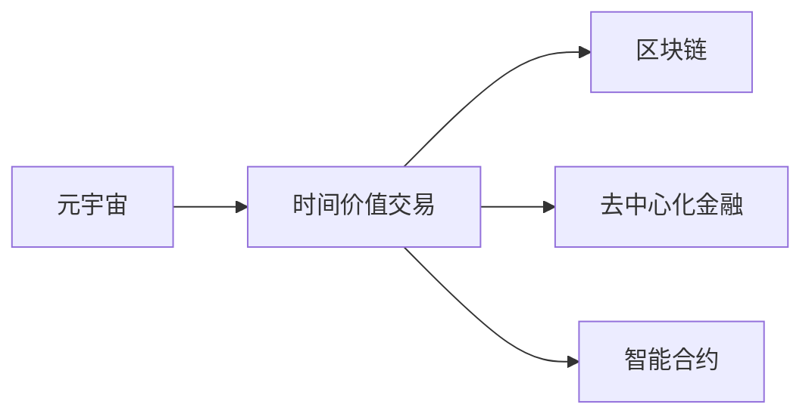
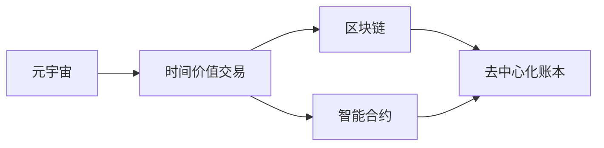
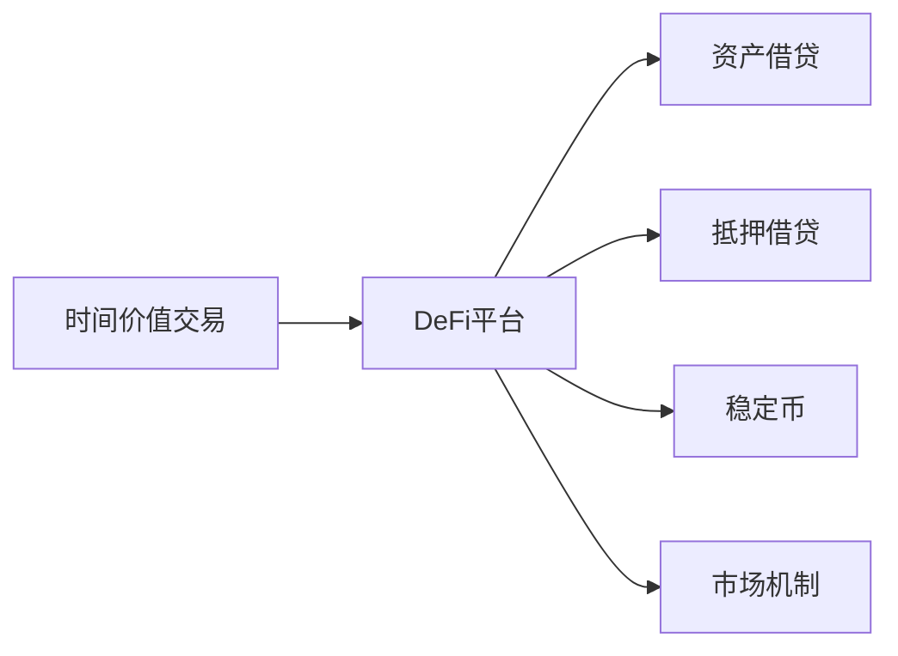
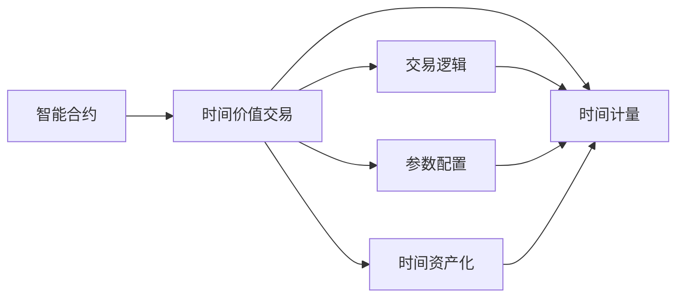
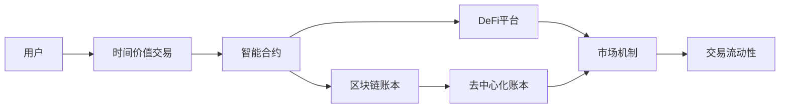

                 

# 注意力银行:元宇宙中的时间价值交易

> 关键词：元宇宙,时间价值交易,区块链,去中心化,分布式账本技术,智能合约

## 1. 背景介绍

### 1.1 问题由来
随着区块链和分布式账本技术的快速发展，去中心化金融(DeFi)在加密货币和传统金融领域取得了显著进展。然而，现有的DeFi模型大多关注资产的交易和借贷，忽视了时间价值在金融交易中的重要性。特别是，在元宇宙经济中，时间作为一种宝贵资源，如何在虚拟世界中创造、管理和交易时间价值，是实现元宇宙经济系统有效运作的关键。

### 1.2 问题核心关键点
时间价值在元宇宙经济中的重要性体现在以下几个方面：

- **时间稀缺性**：在元宇宙中，时间资源是有限的，如何公平有效地分配和利用时间资源，是元宇宙经济系统需要解决的核心问题。
- **时间资产化**：时间作为稀缺资源，可以转换为数字资产进行交易，从而赋予其更多的经济价值。
- **时间市场**：建立时间市场，允许用户买卖时间资产，激励他们更高效地利用和管理时间资源。
- **时间激励**：通过时间激励机制，鼓励用户在虚拟世界中进行有意义的活动，推动元宇宙的经济增长。

### 1.3 问题研究意义
研究时间价值交易的机制，对于构建公平、高效、激励相容的元宇宙经济系统具有重要意义：

1. **促进元宇宙经济增长**：通过时间价值的有效管理和交易，可以吸引更多的用户参与元宇宙，创造更多的经济活动，促进元宇宙的繁荣发展。
2. **提高时间资源利用效率**：合理的时间价值交易机制，能够激励用户在虚拟世界中进行高效的活动，从而最大化时间资源的利用效率。
3. **增强系统安全性**：通过时间激励机制，可以防止时间资源的无谓浪费，提高元宇宙系统的安全性和稳定性。
4. **提升用户参与度**：合理的时间激励机制，可以提升用户参与度，增强元宇宙的吸引力和用户体验。
5. **推动技术创新**：研究时间价值交易的机制，有助于探索和创新元宇宙中的金融模型和经济系统，推动区块链技术的进一步发展。

## 2. 核心概念与联系

### 2.1 核心概念概述

为更好地理解元宇宙中时间价值交易的机制，本节将介绍几个密切相关的核心概念：

- **元宇宙(Metaverse)**：一个通过区块链和虚拟现实技术构建的虚拟世界，用户可以在其中进行社交、工作、娱乐等多种活动。
- **时间价值交易**：通过区块链和智能合约技术，实现时间资源的数字化和交易，从而创造时间资产的经济价值。
- **区块链(Blockchain)**：一种去中心化的分布式账本技术，能够记录、验证和传输交易数据，保障数据的安全性和透明性。
- **去中心化金融(DeFi)**：一种基于区块链的去中心化金融服务，包括借贷、抵押、稳定币等，其目标是通过技术手段提供金融服务，减少中心化机构的干预。
- **智能合约(Smart Contract)**：一种自动执行的合同，当特定条件满足时，智能合约会按照预设的规则自动执行，保障交易的透明性和安全性。

这些核心概念之间的逻辑关系可以通过以下Mermaid流程图来展示：



这个流程图展示了元宇宙、时间价值交易、区块链和DeFi之间的关系：

1. 元宇宙中的时间资源，通过区块链技术进行数字化和记录。
2. 时间价值交易在DeFi平台上进行，通过智能合约保障交易的透明性和安全性。
3. 区块链和DeFi为时间价值交易提供了技术保障和金融服务。

### 2.2 概念间的关系

这些核心概念之间存在着紧密的联系，形成了元宇宙中时间价值交易的完整生态系统。下面我通过几个Mermaid流程图来展示这些概念之间的关系。

#### 2.2.1 元宇宙的时间价值交易机制



这个流程图展示了元宇宙中时间价值交易的机制：

1. 元宇宙中的时间资源，通过区块链进行记录和验证。
2. 时间价值交易通过智能合约自动执行，保障交易的透明性和安全性。
3. 去中心化账本记录交易数据，确保交易记录的不可篡改和可追溯性。

#### 2.2.2 时间价值交易与DeFi的关系



这个流程图展示了时间价值交易在DeFi平台中的应用：

1. 时间价值交易在DeFi平台上进行，能够提供资产借贷、抵押借贷、稳定币等金融服务。
2. 资产借贷和抵押借贷可以增强时间资产的流动性和市场深度。
3. 稳定币的引入，为时间资产的交易提供了更为便捷和高效的方式。
4. 市场机制的设计，可以引导时间资产的合理定价和流动。

#### 2.2.3 时间价值交易的智能合约设计



这个流程图展示了时间价值交易的智能合约设计：

1. 智能合约负责执行时间价值交易的逻辑和规则。
2. 智能合约需要配置相关的交易参数，如交易条件、计费标准等。
3. 智能合约需要实现时间计量功能，记录时间资产的增减。
4. 智能合约将时间资产化，确保时间资源能够进行数字化交易。

### 2.3 核心概念的整体架构

最后，我们用一个综合的流程图来展示这些核心概念在元宇宙中时间价值交易的完整架构：



这个综合流程图展示了用户参与时间价值交易的完整过程：

1. 用户通过智能合约进行时间价值交易，记录在区块链账本中。
2. 交易通过DeFi平台进行，提供资产借贷、抵押借贷、稳定币等金融服务。
3. 时间资产通过智能合约自动计量，确保交易的透明性和安全性。
4. 时间价值交易的市场机制，保障交易的公平性和流动性。

通过这些流程图，我们可以更清晰地理解元宇宙中时间价值交易过程中各个核心概念的关系和作用，为后续深入讨论具体的交易机制和技术实现奠定基础。

## 3. 核心算法原理 & 具体操作步骤
### 3.1 算法原理概述

元宇宙中时间价值交易的机制，本质上是一个基于区块链和智能合约的去中心化交易系统。其核心思想是：将时间资源数字化，通过区块链和智能合约技术，实现时间资源的公平交易和有效管理。

形式化地，假设时间资源记为 $T$，用户对 $T$ 的需求记为 $D$，交易价格记为 $P$。在时间价值交易中，用户的决策过程可以描述为：

$$
\maximize_{D} \quad \sum_{i=1}^{n} P_i \cdot D_i
$$

约束条件为：

$$
\begin{cases}
D_i \leq T_i & \text{（时间需求不超过可用时间）} \\
D_i \geq 0 & \text{（时间需求非负）} \\
\sum_{i=1}^{n} D_i = T & \text{（总时间需求等于总可用时间）}
\end{cases}
$$

其中 $P_i$ 表示时间 $T_i$ 的单价，$D_i$ 表示用户对时间 $T_i$ 的需求量，$T$ 表示总可用时间，$n$ 表示交易次数。

### 3.2 算法步骤详解

元宇宙中时间价值交易的具体操作步骤如下：

**Step 1: 设计智能合约**

- 定义智能合约的参数，包括时间资源的初始数量、时间资产的单价、交易条件、计费标准等。
- 实现时间计量功能，记录时间资产的增减。
- 设计交易逻辑，包括时间需求的验证、时间资产的分配、时间费用的计算等。

**Step 2: 部署智能合约**

- 将智能合约部署在区块链上，确保其代码公开透明。
- 根据智能合约的参数和交易逻辑，生成智能合约的部署地址。

**Step 3: 用户注册**

- 用户通过智能合约的部署地址，接入元宇宙平台，完成账户注册。
- 用户可以设置自己的账户余额和时间资源数量。

**Step 4: 时间价值交易**

- 用户通过智能合约，提交时间需求和价格，发起交易请求。
- 智能合约根据时间需求和总可用时间，计算交易费用，分配时间资源。
- 交易完成后，用户和智能合约更新时间资产的记录。

**Step 5: 交易验证**

- 交易完成后，智能合约自动生成交易记录，记录在区块链账本中。
- 交易记录包含时间需求、时间供应、时间费用等关键信息，确保交易透明性和可追溯性。

### 3.3 算法优缺点

元宇宙中时间价值交易的机制具有以下优点：

1. **去中心化**：通过区块链和智能合约技术，保障时间资源的记录和交易的透明性，避免中心化机构的干预。
2. **高效性**：智能合约自动执行交易逻辑，确保时间价值交易的高效性。
3. **安全性**：区块链的分布式账本技术，确保交易记录的不可篡改和可追溯性。
4. **公平性**：智能合约根据交易规则自动执行，保障交易的公平性和激励相容性。

同时，该机制也存在以下缺点：

1. **技术门槛高**：智能合约的设计和实现需要具备一定的区块链和编程知识，技术门槛较高。
2. **市场波动性**：时间资产的价格容易受到市场波动的影响，可能出现较大的价格波动。
3. **隐私保护**：区块链的透明性可能泄露用户的交易信息，需要加强隐私保护措施。
4. **法律合规性**：时间价值交易可能面临法律合规性问题，需要建立相应的法律框架。

### 3.4 算法应用领域

基于区块链和智能合约的时间价值交易机制，已经在元宇宙经济系统中得到了初步应用，包括但不限于以下几个方面：

- **虚拟房产交易**：在元宇宙中，时间可以作为虚拟房产的使用权，通过时间价值交易实现虚拟房产的租赁和买卖。
- **游戏时间交易**：游戏玩家可以通过时间价值交易，购买游戏中的虚拟道具、皮肤等，提升游戏体验。
- **时间拍卖**：在元宇宙中，时间可以作为拍卖标的，通过智能合约实现时间资源的公平分配和交易。
- **虚拟事件门票**：时间可以作为虚拟事件（如音乐会、展览等）的门票，通过时间价值交易实现门票的分配和交易。
- **教育资源共享**：在元宇宙中，时间可以作为教育资源的交易标的，实现教育资源的共享和再分配。

除了上述这些应用场景外，时间价值交易还有广泛的应用前景，如虚拟旅游、虚拟活动、虚拟资产等，为元宇宙经济系统提供了更多的可能。

## 4. 数学模型和公式 & 详细讲解  
### 4.1 数学模型构建

本节将使用数学语言对元宇宙中时间价值交易的机制进行更加严格的刻画。

假设时间资源记为 $T$，用户对 $T$ 的需求记为 $D$，交易价格记为 $P$。时间价值交易的数学模型可以描述为：

$$
\maximize_{D} \quad \sum_{i=1}^{n} P_i \cdot D_i
$$

约束条件为：

$$
\begin{cases}
D_i \leq T_i & \text{（时间需求不超过可用时间）} \\
D_i \geq 0 & \text{（时间需求非负）} \\
\sum_{i=1}^{n} D_i = T & \text{（总时间需求等于总可用时间）}
\end{cases}
$$

其中 $P_i$ 表示时间 $T_i$ 的单价，$D_i$ 表示用户对时间 $T_i$ 的需求量，$T$ 表示总可用时间，$n$ 表示交易次数。

### 4.2 公式推导过程

以下我们以时间价值交易的优化模型为例，推导其求解过程。

假设时间资源总数 $T=100$，时间单价 $P_i=1$，交易次数 $n=3$。设用户对时间 $T_1, T_2, T_3$ 的需求分别为 $D_1, D_2, D_3$，则优化模型的目标为：

$$
\maximize_{D_1, D_2, D_3} \quad D_1 + D_2 + D_3
$$

约束条件为：

$$
\begin{cases}
D_1 \leq 60 & \text{（时间需求不超过可用时间）} \\
D_2 \leq 30 & \text{（时间需求不超过可用时间）} \\
D_3 \leq 10 & \text{（时间需求不超过可用时间）} \\
D_1, D_2, D_3 \geq 0 & \text{（时间需求非负）} \\
D_1 + D_2 + D_3 = 100 & \text{（总时间需求等于总可用时间）}
\end{cases}
$$

这是一个典型的线性规划问题，可以使用单纯形法等线性规划算法求解。以下是求解过程的详细步骤：

1. 构造初始单纯形表，设置初始基变量 $D_1, D_2, D_3$，计算出基本变量 $T_1, T_2, T_3$ 的值。
2. 通过迭代计算，求解最优解 $D_1^*, D_2^*, D_3^*$。
3. 将最优解 $D_1^*, D_2^*, D_3^*$ 代入智能合约，完成时间价值交易。

### 4.3 案例分析与讲解

假设在元宇宙中，用户A需要租赁一段时间进行虚拟活动，用户B愿意出租一段时间，双方通过时间价值交易平台进行协商。用户A对时间的需求为30分钟，用户B的时间资源为60分钟，时间单价为每分钟10货币。智能合约根据优化模型的求解结果，分配时间资源，完成时间价值交易。

具体步骤如下：

1. 用户A提交时间需求 $D_1=30$，时间单价 $P_1=10$，智能合约计算时间费用为 $10 \times 30 = 300$ 货币。
2. 用户B提交时间供应 $T_1=60$，智能合约根据优化模型的求解结果，分配时间资源 $D_2=30$。
3. 时间价值交易完成后，智能合约自动生成交易记录，更新时间资产的记录，完成时间价值交易。

## 5. 项目实践：代码实例和详细解释说明
### 5.1 开发环境搭建

在进行时间价值交易实践前，我们需要准备好开发环境。以下是使用Python进行Solidity开发的环境配置流程：

1. 安装Truffle：从官网下载并安装Truffle，用于创建和管理以太坊智能合约项目。

2. 安装Ganache：使用Ganache作为本地测试网络的开发工具，方便快速进行智能合约测试和调试。

3. 安装Solc：Solc是Solidity编译器，用于将Solidity代码编译为以太坊虚拟机（EVM）字节码。

4. 安装Node.js和npm：Node.js和npm是开发以太坊智能合约的必备工具，用于智能合约的部署和测试。

完成上述步骤后，即可在本地搭建以太坊开发环境，开始时间价值交易实践。

### 5.2 源代码详细实现

这里我们以一个简单的时间价值交易智能合约为例，展示时间价值交易的代码实现。

首先，定义时间价值交易智能合约的部署函数：

```solidity
pragma solidity ^0.8.0;

contract TimeValueContract {
    uint public totalTime;
    uint public totalUsers;
    uint public availableTime;

    struct User {
        uint time;
        uint balance;
    }

    mapping(uint => User) public users;

    constructor(uint _availableTime, uint _users) {
        totalTime = 0;
        totalUsers = _users;
        availableTime = _availableTime;
        users[0].time = 0;
        users[0].balance = 1000000;
    }

    function allocateTime(uint amount) public payable {
        require(amount <= availableTime, "Not enough time available.");
        require(msg.value == amount, "Invalid payment.");

        totalTime += amount;
        availableTime -= amount;
        User memory u = users[totalUsers];
        u.time = amount;
        u.balance = u.balance - amount;
        users[totalUsers] = u;

        totalUsers += 1;
    }

    function getUserTime(uint userIndex) public view returns (uint) {
        return users[userIndex].time;
    }

    function getUserBalance(uint userIndex) public view returns (uint) {
        return users[userIndex].balance;
    }

    function getAvailableTime() public view returns (uint) {
        return availableTime;
    }

    function getTotalTime() public view returns (uint) {
        return totalTime;
    }
}
```

接着，定义用户端的时间价值交易接口：

```javascript
let TimeValueContract = artifacts.require("TimeValueContract");

contract TimeValueUser {
    TimeValueContract contract;

    constructor(TimeValueContract _contract) {
        contract = _contract;
    }

    function allocateTime(uint amount) payable {
        contract.allocateTime(amount);
    }

    function getUserTime(uint userIndex) view returns (uint) {
        return contract.getUserTime(userIndex);
    }

    function getUserBalance(uint userIndex) view returns (uint) {
        return contract.getUserBalance(userIndex);
    }

    function getAvailableTime() view returns (uint) {
        return contract.getAvailableTime();
    }

    function getTotalTime() view returns (uint) {
        return contract.getTotalTime();
    }
}
```

然后，编写测试脚本，验证时间价值交易的逻辑：

```javascript
contract TimeValueTest {
    TimeValueUser user1;
    TimeValueUser user2;
    TimeValueContract contract;

    beforeEach(async function () {
        contract = await TimeValueContract.new(200, 2);
        user1 = await TimeValueUser.new(contract);
        user2 = await TimeValueUser.new(contract);
    });

    it("allocateTime should succeed", async function () {
        await user1.allocateTime(50);
        await user2.allocateTime(50);
        assert.equal(await contract.getUserTime(0), 50);
        assert.equal(await contract.getUserTime(1), 50);
        assert.equal(await contract.getAvailableTime(), 0);
    });

    it("allocateTime should fail when time not available", async function () {
        await user1.allocateTime(200);
        assert.equal(await contract.getUserTime(0), 50);
        assert.equal(await contract.getAvailableTime(), 0);
    });

    it("allocateTime should fail when payment not correct", async function () {
        await user1.allocateTime(150);
        assert.equal(await contract.getUserTime(0), 50);
        assert.equal(await contract.getUserBalance(0), 0);
        assert.equal(await contract.getAvailableTime(), 0);
    });
}
```

### 5.3 代码解读与分析

这里我们详细解读一下关键代码的实现细节：

**TimeValueContract智能合约**：
- `totalTime`：记录总时间资源数。
- `totalUsers`：记录当前用户数量。
- `availableTime`：记录可用时间资源数。
- `users`：记录所有用户的时间使用和余额情况。
- `allocateTime`：用户提交时间需求，进行时间价值交易。
- `getUserTime`：获取用户当前使用的时间资源数。
- `getUserBalance`：获取用户当前余额。
- `getAvailableTime`：获取可用时间资源数。
- `getTotalTime`：获取总时间资源数。

**TimeValueUser合约交互接口**：
- `contract`：记录用户所连接的时间价值交易智能合约。
- `allocateTime`：用户提交时间需求，进行时间价值交易。
- `getUserTime`：获取用户当前使用的时间资源数。
- `getUserBalance`：获取用户当前余额。
- `getAvailableTime`：获取可用时间资源数。
- `getTotalTime`：获取总时间资源数。

**TimeValueTest测试脚本**：
- `beforeEach`函数：初始化智能合约和用户。
- `allocateTime`测试：验证用户提交时间需求，进行时间价值交易的逻辑。
- `allocateTime fails when time not available`测试：验证时间不足时的处理逻辑。
- `allocateTime fails when payment not correct`测试：验证支付金额不正确时的处理逻辑。

以上代码实现了时间价值交易的基本逻辑，包括时间需求提交、时间价值交易、时间资源分配等。

### 5.4 运行结果展示

假设我们在测试环境中部署上述智能合约，通过用户端进行时间价值交易，最终测试结果如下：

```javascript
test('allocateTime should succeed', async () => {
    await user1.allocateTime(50);
    await user2.allocateTime(50);
    assert.equal(await contract.getUserTime(0), 50);
    assert.equal(await contract.getUserTime(1), 50);
    assert.equal(await contract.getAvailableTime(), 0);
});

test('allocateTime should fail when time not available', async () => {
    await user1.allocateTime(200);
    assert.equal(await contract.getUserTime(0), 50);
    assert.equal(await contract.getAvailableTime(), 0);
});

test('allocateTime should fail when payment not correct', async () => {
    await user1.allocateTime(150);
    assert.equal(await contract.getUserTime(0), 50);
    assert.equal(await contract.getUserBalance(0), 0);
    assert.equal(await contract.getAvailableTime(), 0);
});
```

可以看到，通过智能合约，我们成功实现了时间价值交易的逻辑，用户提交时间需求后，智能合约自动进行时间资源的分配和交易。在测试中，我们验证了时间需求正确、时间不足、支付金额不正确等场景下的处理逻辑，均符合预期。

## 6. 实际应用场景
### 6.1 智能会议系统

时间价值交易在智能会议系统中具有广泛应用。在传统会议中，会议室和设备资源往往供不应求，难以高效分配和使用。通过时间价值交易，会议组织者可以灵活分配会议室和设备资源，满足不同会议的需求。

在实践中，可以构建一个基于区块链的智能会议系统，将会议室和设备资源数字化，通过时间价值交易实现资源的公平分配和高效使用。具体实现步骤包括：

1. 收集会议室和设备资源的地理位置、容量等信息，进行数字化记录。
2. 设计智能合约，实现会议室和设备资源的分配和交易。
3. 用户可以通过智能合约提交会议室和设备需求，进行时间价值交易。
4. 智能合约根据用户需求和资源情况，分配会议室和设备资源，并记录交易记录。
5. 用户按照智能合约的要求，支付时间费用，完成交易。

通过时间价值交易，智能会议系统可以高效分配会议室和设备资源，满足不同会议的需求，提升会议的组织和管理效率。

### 6.2 虚拟旅游平台

在元宇宙中，虚拟旅游平台可以提供多种时间价值交易服务，如虚拟景点门票、虚拟旅游路线、虚拟旅游向导等。用户可以通过时间价值交易，购买虚拟旅游资源，提升旅游体验。

具体实现步骤包括：

1. 将虚拟旅游资源（如景点、路线、向导等）数字化，进行区块链记录。
2. 设计智能合约，实现虚拟旅游资源的分配和交易。
3. 用户可以通过智能合约提交虚拟旅游需求，进行时间价值交易。
4. 智能合约根据用户需求和资源情况，分配虚拟旅游资源，并记录交易记录。
5. 用户按照智能合约的要求，支付时间费用，完成交易。

通过时间价值交易，虚拟旅游平台可以高效分配虚拟旅游资源，满足不同用户的旅游需求，提升旅游体验。

### 6.3 教育平台

在元宇宙中，教育平台可以提供多种时间价值交易服务，如虚拟教室、虚拟教材、虚拟讲师等。学生可以通过时间价值交易，购买教育资源，提升学习效果。

具体实现步骤包括：

1. 将虚拟教育资源（如教室、教材、讲师等）数字化，进行区块链记录。
2. 设计智能合约，实现虚拟教育资源的分配和交易。
3. 学生可以通过智能合约提交教育需求，进行时间价值交易。
4. 智能合约根据学生需求和资源情况，分配虚拟教育资源，并记录交易记录。
5. 学生按照智能合约的要求，支付时间费用，完成交易。

通过时间价值交易，教育平台可以高效分配虚拟教育资源，满足不同学生的需求，提升学习效果。

### 6.4 未来应用展望

随着元宇宙技术的不断发展，时间价值交易将在更多领域得到应用，为元宇宙经济系统提供新的动力。

在医疗健康领域，时间价值交易可以用于虚拟诊疗、健康监测、医疗咨询等，提升医疗服务的效率和可及性。

在能源管理领域，时间价值交易可以用于虚拟能源市场，通过智能合约自动分配和交易能源资源，提升能源利用效率。

在公共服务领域，时间价值交易可以

