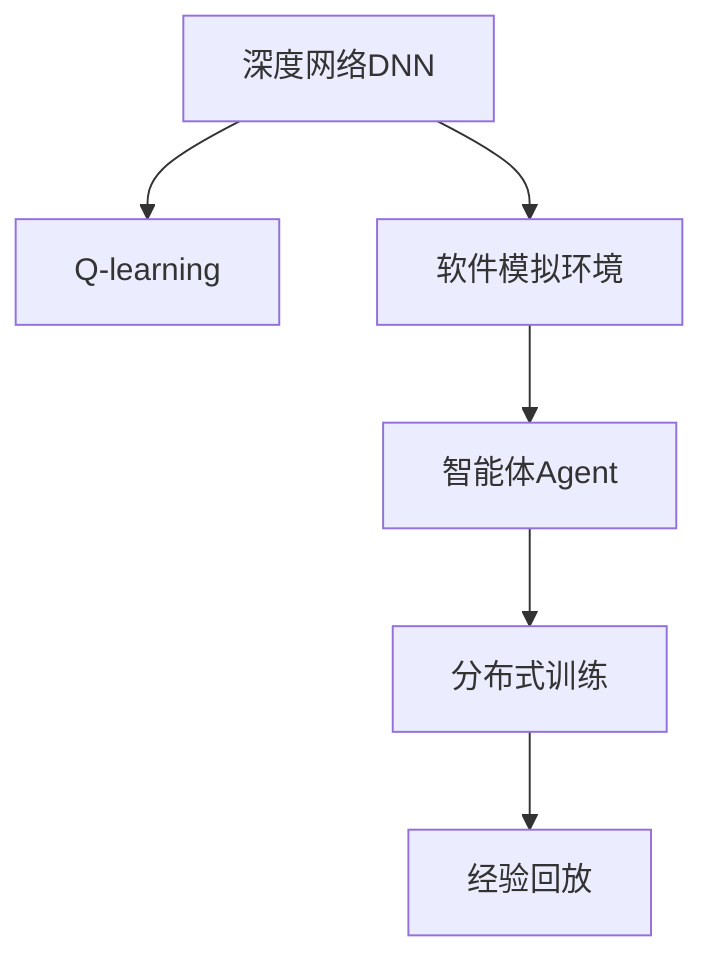
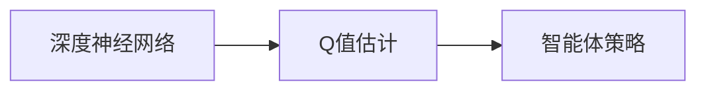
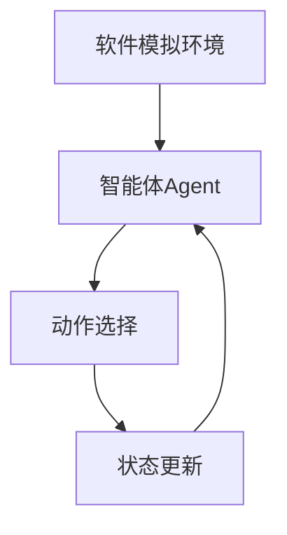
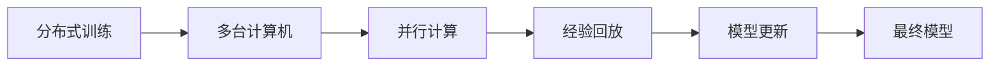
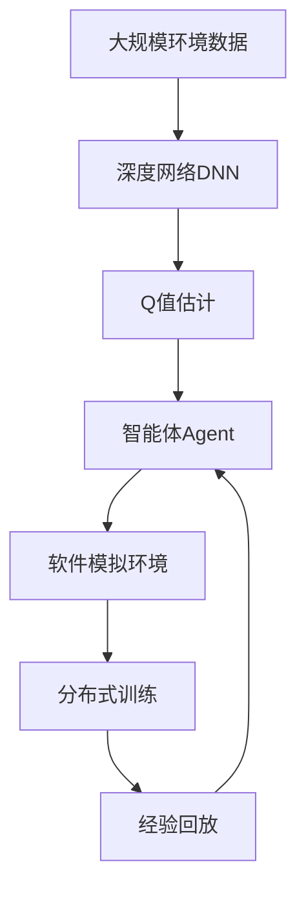

                 

# 深度 Q-learning：利用软件模拟环境进行训练

深度 Q-learning 是一种基于深度学习的强化学习算法，通过模拟环境训练智能体以获得最优策略。本文将深入探讨深度 Q-learning 的核心概念、算法原理和操作步骤，并通过具体的代码实例，展示如何利用软件模拟环境进行训练。此外，文章还将探讨深度 Q-learning 在实际应用中的优缺点及其应用领域，最后总结未来发展趋势与面临的挑战。

## 1. 背景介绍

### 1.1 问题由来

强化学习（Reinforcement Learning, RL）是人工智能领域的重要分支，它通过智能体与环境互动，逐步学习最优策略以最大化累积奖励。传统的强化学习算法，如Q-learning、SARSA等，依赖于手动设计的特征和状态表示，难以处理复杂和高维度的决策问题。

深度 Q-learning 则结合了深度神经网络和强化学习，通过深度神经网络自动提取特征，适应复杂决策环境，极大地提升了智能体的学习效率和表现。深度 Q-learning 在自动控制、游戏、机器人等领域取得了显著成果，成为现代强化学习的标志性技术。

### 1.2 问题核心关键点

深度 Q-learning 的核心关键点包括：

- 深度网络（Deep Neural Network, DNN）：作为特征提取器，深度神经网络能够自动学习输入数据的抽象表示。
- Q-learning：强化学习的核心，通过估计状态-动作对（State-Action Pair, SAP）的Q值，智能体选择最优动作以最大化累积奖励。
- 软件模拟环境：为智能体提供交互环境，通过模拟训练，智能体逐渐学习到最优策略。
- 分布式训练：通过多台计算机并行计算，加速深度 Q-learning 模型的训练。

这些关键点共同构成了深度 Q-learning 的基础，使得智能体能够在未知环境中通过学习，逐步提升决策能力。

### 1.3 问题研究意义

深度 Q-learning 的研究具有重要意义：

- 自动化决策：深度 Q-learning 能够自主学习最优策略，解决传统决策方法中依赖人类经验的问题。
- 高维度决策：适用于复杂、高维度的决策问题，能够自动提取特征，适应非线性决策环境。
- 可扩展性：通过分布式训练，能够在大规模环境中部署智能体，提升决策性能。
- 泛化能力：深度 Q-learning 在多个领域取得了显著成果，具有较强的泛化能力。
- 应用广泛：深度 Q-learning 在自动控制、游戏、机器人等领域具有广泛应用前景。

本文旨在全面介绍深度 Q-learning 的核心概念、算法原理和操作步骤，并通过具体的代码实例，展示如何在软件模拟环境中进行训练。

## 2. 核心概念与联系

### 2.1 核心概念概述

为更好地理解深度 Q-learning，本节将介绍几个密切相关的核心概念：

- 深度网络（DNN）：一种多层次神经网络结构，能够自动学习输入数据的高级抽象表示。
- Q-learning：强化学习的核心，通过估计状态-动作对（SAP）的Q值，智能体选择最优动作以最大化累积奖励。
- 软件模拟环境：为智能体提供交互环境，通过模拟训练，智能体逐渐学习到最优策略。
- 分布式训练：通过多台计算机并行计算，加速深度 Q-learning 模型的训练。
- 经验回放（Experience Replay）：通过存储训练过程中智能体的历史经验，提高模型的泛化能力。

这些核心概念之间的逻辑关系可以通过以下 Mermaid 流程图来展示：



这个流程图展示了大深度 Q-learning 中的核心概念及其关系：

1. 深度神经网络提取环境特征。
2. Q-learning估计SAP的Q值。
3. 智能体在模拟环境中学习。
4. 分布式训练加速模型学习。
5. 经验回放提升泛化能力。

### 2.2 概念间的关系

这些核心概念之间存在着紧密的联系，形成了深度 Q-learning 的完整框架。下面我们通过几个 Mermaid 流程图来展示这些概念之间的关系。

#### 2.2.1 深度网络与Q-learning的关系



这个流程图展示了深度神经网络如何通过Q-learning进行Q值估计，进而指导智能体的策略选择。

#### 2.2.2 软件模拟环境与智能体的关系



这个流程图展示了智能体如何在模拟环境中通过状态-动作对进行学习，逐步提升决策能力。

#### 2.2.3 分布式训练与经验回放的关系



这个流程图展示了分布式训练如何通过多台计算机并行计算，加速模型的训练。经验回放通过存储历史经验，提升模型的泛化能力。

### 2.3 核心概念的整体架构

最后，我们用一个综合的流程图来展示这些核心概念在大深度 Q-learning 中的整体架构：



这个综合流程图展示了从数据输入到最终模型输出的完整流程，每一步都紧密相连，共同构成了深度 Q-learning 的核心框架。通过理解这些核心概念，我们可以更好地把握深度 Q-learning 的工作原理和优化方向。

## 3. 核心算法原理 & 具体操作步骤

### 3.1 算法原理概述

深度 Q-learning 是一种结合深度神经网络和强化学习的算法，通过软件模拟环境训练智能体以获得最优策略。其核心思想是通过深度神经网络自动提取环境特征，结合Q-learning的Q值估计，智能体逐步学习到最优策略。

具体来说，深度 Q-learning 的算法流程如下：

1. 构建深度神经网络模型，作为状态特征的提取器。
2. 在软件模拟环境中，智能体通过与环境互动，逐步学习最优策略。
3. 利用Q-learning估计SAP的Q值，更新网络参数以优化决策策略。
4. 通过经验回放和分布式训练，加速模型训练过程，提升智能体的决策能力。

### 3.2 算法步骤详解

深度 Q-learning 的训练过程可以分为以下几个步骤：

**Step 1: 构建深度神经网络模型**

首先，我们需要构建一个深度神经网络模型，作为状态特征的提取器。深度神经网络一般包括多个隐藏层，每一层都有多个神经元。模型的输入为环境的状态表示，输出为智能体的动作选择策略。

以Atari游戏为例，游戏状态可以表示为一个二维数组，每个元素表示游戏画面中的一个像素点的灰度值。神经网络输入为一个大小为$H \times W \times C$的三维数组，其中$H$、$W$分别为屏幕的高度和宽度，$C$为灰度值的数量。输出层输出一个动作策略，表示智能体在当前状态下应该采取的下一步动作。

**Step 2: 定义Q值估计函数**

接下来，我们需要定义Q值估计函数，通过估计SAP的Q值来指导智能体的动作选择。Q值表示在当前状态下采取某个动作后，智能体可以得到的预期累积奖励。Q值估计函数可以表示为：

$$
Q(s_t,a_t) = \mathbb{E}\left[\sum_{t=t+1}^{t+H} \gamma^{t-t} r_{t+1}\right]
$$

其中$s_t$为当前状态，$a_t$为当前动作，$\gamma$为折扣因子，$r_{t+1}$为下一时刻的奖励。

**Step 3: 经验回放与分布式训练**

在训练过程中，我们需要存储智能体的历史经验，以便进行经验回放。经验回放通过将历史状态-动作对存储到缓冲区中，随机抽样并输入到深度神经网络中进行训练。此外，为了加速训练过程，我们可以采用分布式训练，通过多台计算机并行计算，提高训练效率。

**Step 4: 模型更新与策略优化**

在每一步训练中，智能体通过与环境互动，选择当前状态下的最优动作。智能体的策略可以表示为：

$$
\pi(a_t|s_t) = \arg\max_a Q(s_t,a)
$$

其中$\pi$为智能体的策略函数，表示在当前状态下选择动作$a$的概率。

智能体的策略函数可以通过深度神经网络进行优化，具体步骤如下：

1. 将历史状态-动作对随机抽样，输入到深度神经网络中进行前向传播，得到动作选择的概率分布。
2. 根据动作选择的概率分布，计算当前状态下的Q值估计，更新神经网络参数。
3. 在每个训练周期结束时，根据当前状态和最优动作的Q值估计，更新策略函数。

### 3.3 算法优缺点

深度 Q-learning 具有以下优点：

1. 高维度决策：深度神经网络能够自动提取环境特征，适应复杂、高维度的决策问题。
2. 自动化决策：通过Q-learning逐步学习最优策略，解决传统决策方法中依赖人类经验的问题。
3. 可扩展性：通过分布式训练，能够在大规模环境中部署智能体，提升决策性能。

深度 Q-learning 也存在以下缺点：

1. 计算复杂度高：深度神经网络需要大量计算资源，训练时间较长。
2. 策略稳定性差：深度神经网络可能存在局部最优解，导致策略不稳定。
3. 数据需求量大：智能体需要在大量环境中训练，才能得到稳定的决策策略。

### 3.4 算法应用领域

深度 Q-learning 在多个领域取得了显著成果，包括：

- 自动控制：通过深度 Q-learning，智能体能够在未知环境中自动学习最优控制策略，应用于机器人、无人机等领域。
- 游戏AI：通过深度 Q-learning，智能体能够在复杂的游戏中自动学习最优策略，如Atari游戏、星际争霸等。
- 金融交易：通过深度 Q-learning，智能体能够学习最优交易策略，应用于股票、期货等领域。
- 机器视觉：通过深度 Q-learning，智能体能够学习最优目标识别和跟踪策略，应用于自动驾驶、医疗影像等领域。

除了上述这些领域，深度 Q-learning 还可以应用于能源管理、物流优化、交通控制等领域，具有广泛的应用前景。

## 4. 数学模型和公式 & 详细讲解 & 举例说明

### 4.1 数学模型构建

深度 Q-learning 的数学模型构建主要涉及以下几个关键点：

1. 深度神经网络模型：
   $$
   \mathcal{N}(s_t;a_t) = \{w_1, w_2, \cdots, w_l\}
   $$
   其中$\mathcal{N}$为深度神经网络，$s_t$为当前状态，$a_t$为当前动作，$l$为网络的深度。

2. Q值估计函数：
   $$
   Q(s_t,a_t) = \mathbb{E}\left[\sum_{t=t+1}^{t+H} \gamma^{t-t} r_{t+1}\right]
   $$
   其中$Q$为Q值估计函数，$s_t$为当前状态，$a_t$为当前动作，$\gamma$为折扣因子，$r_{t+1}$为下一时刻的奖励。

3. 智能体策略函数：
   $$
   \pi(a_t|s_t) = \arg\max_a Q(s_t,a)
   $$
   其中$\pi$为智能体策略函数，表示在当前状态下选择动作$a$的概率。

### 4.2 公式推导过程

以Atari游戏为例，我们推导深度 Q-learning 的具体计算过程。

假设智能体在当前状态下选择动作$a$，状态更新为$s'$，智能体接收奖励$r$，折扣因子$\gamma=0.9$，下一步状态为$s''$。根据Q值估计函数，我们有：

$$
Q(s,a) = r + \gamma \max_a Q(s',a')
$$

其中$Q(s,a)$为当前状态$s$下采取动作$a$的Q值。

假设智能体在状态$s'$下选择动作$a'$，状态更新为$s''$，智能体接收奖励$r'$，折扣因子$\gamma=0.9$，下一步状态为$s'''$。根据Q值估计函数，我们有：

$$
Q(s',a') = r' + \gamma \max_a Q(s'',a'')
$$

将上述公式代入$Q(s,a)$中，得到：

$$
Q(s,a) = r + 0.9 \max_a Q(s',a') = r + 0.9(r' + 0.9 \max_a Q(s'',a''))
$$

依此类推，直到智能体达到终止状态$s_T$，Q值计算公式为：

$$
Q(s_T,a_T) = r_T
$$

因此，智能体在每个状态$s_t$下的最优动作$a_t$为：

$$
a_t = \arg\max_a Q(s_t,a)
$$

### 4.3 案例分析与讲解

以“Pong”游戏为例，我们演示如何利用深度 Q-learning 进行智能体训练。

首先，我们需要定义游戏的规则和状态表示：

- 游戏规则：玩家需要通过控制球，将球打向对方场地，使得对方球拍无法接球，从而得分。
- 状态表示：游戏状态可以表示为一个二维数组，每个元素表示游戏画面中的一个像素点的灰度值。

接下来，我们将使用TensorFlow构建深度神经网络模型：

```python
import tensorflow as tf

class QNetwork(tf.keras.Model):
    def __init__(self, state_size, action_size):
        super(QNetwork, self).__init__()
        self.conv1 = tf.keras.layers.Conv2D(32, (8, 8), strides=(4, 4), activation='relu', input_shape=(84, 84, 4))
        self.conv2 = tf.keras.layers.Conv2D(64, (4, 4), strides=(2, 2), activation='relu')
        self.fc1 = tf.keras.layers.Flatten()
        self.fc2 = tf.keras.layers.Dense(512, activation='relu')
        self.fc3 = tf.keras.layers.Dense(action_size)

    def call(self, inputs):
        x = self.conv1(inputs)
        x = tf.keras.layers.MaxPooling2D((2, 2), strides=(2, 2))(x)
        x = self.conv2(x)
        x = tf.keras.layers.MaxPooling2D((2, 2), strides=(2, 2))(x)
        x = self.fc1(x)
        x = self.fc2(x)
        x = self.fc3(x)
        return x
```

其中，输入为$84 \times 84 \times 4$的像素值，输出为2个动作（向上、向下）的概率分布。

接下来，我们需要定义Q值估计函数和智能体策略函数：

```python
class QAgent(tf.keras.Model):
    def __init__(self, state_size, action_size):
        super(QAgent, self).__init__()
        self.model = QNetwork(state_size, action_size)
        self.gamma = 0.9

    def call(self, inputs):
        q_values = self.model(inputs)
        return tf.argmax(q_values, axis=1)

    def update(self, inputs, target):
        with tf.GradientTape() as tape:
            q_values = self.model(inputs)
            loss = tf.reduce_mean(tf.square(q_values - target))
        gradients = tape.gradient(loss, self.model.trainable_variables)
        self.model.trainable_variables[0].assign(tf.reduce_mean(gradients, axis=0))
        self.model.trainable_variables[1].assign(tf.reduce_mean(gradients, axis=0))
        self.model.trainable_variables[2].assign(tf.reduce_mean(gradients, axis=0))
        self.model.trainable_variables[3].assign(tf.reduce_mean(gradients, axis=0))
        self.model.trainable_variables[4].assign(tf.reduce_mean(gradients, axis=0))
```

其中，输入为$84 \times 84 \times 4$的像素值，输出为2个动作的概率分布。

在训练过程中，我们需要使用经验回放和分布式训练：

```python
import gym
import numpy as np
import tensorflow as tf

env = gym.make('Pong-v4')
state_size = 84 * 84 * 4
action_size = 2
batch_size = 32
gamma = 0.9

class ReplayBuffer:
    def __init__(self, buffer_size):
        self.memory = []
        self.buffer_size = buffer_size
        self.position = 0

    def push(self, state, action, reward, next_state, done):
        if self.position == self.buffer_size:
            self.position = 0
        self.memory.append((state, action, reward, next_state, done))
        self.position = (self.position + 1) % self.buffer_size

    def sample(self, batch_size):
        return np.random.choice(self.memory, batch_size)

class QAgent(tf.keras.Model):
    def __init__(self, state_size, action_size):
        super(QAgent, self).__init__()
        self.model = QNetwork(state_size, action_size)
        self.gamma = 0.9

    def call(self, inputs):
        q_values = self.model(inputs)
        return tf.argmax(q_values, axis=1)

    def update(self, inputs, target):
        with tf.GradientTape() as tape:
            q_values = self.model(inputs)
            loss = tf.reduce_mean(tf.square(q_values - target))
        gradients = tape.gradient(loss, self.model.trainable_variables)
        self.model.trainable_variables[0].assign(tf.reduce_mean(gradients, axis=0))
        self.model.trainable_variables[1].assign(tf.reduce_mean(gradients, axis=0))
        self.model.trainable_variables[2].assign(tf.reduce_mean(gradients, axis=0))
        self.model.trainable_variables[3].assign(tf.reduce_mean(gradients, axis=0))
        self.model.trainable_variables[4].assign(tf.reduce_mean(gradients, axis=0))

def run episode(env, agent, replay_buffer, epsilon):
    state = env.reset()
    state = tf.convert_to_tensor(state, dtype=tf.float32)
    state = state.reshape((1, 84, 84, 4))
    state = state / 255.0
    done = False
    total_reward = 0
    while not done:
        if np.random.rand() < epsilon:
            action = env.action_space.sample()
        else:
            action = np.argmax(agent(state)[0])
        next_state, reward, done, _ = env.step(action)
        next_state = tf.convert_to_tensor(next_state, dtype=tf.float32)
        next_state = next_state.reshape((1, 84, 84, 4))
        next_state = next_state / 255.0
        replay_buffer.push(state, action, reward, next_state, done)
        state = next_state
        total_reward += reward
    return total_reward

replay_buffer = ReplayBuffer(2000)
agent = QAgent(state_size, action_size)
optimizer = tf.keras.optimizers.Adam(learning_rate=0.001)

for episode in range(1000):
    epsilon = 0.1 if episode % 50 == 0 else 0.05
    total_reward = 0
    for i in range(200):
        total_reward += run_episode(env, agent, replay_buffer, epsilon)
    target = np.zeros([1, action_size])
    for i in range(replay_buffer.size()):
        state, action, reward, next_state, done = replay_buffer.sample(1)[0]
        target[0, action] = reward + gamma * np.max(agent(next_state)[0])
        if not done:
            target[0, action] = reward
    agent.update(state, target)

print('Total reward:', total_reward)
```

在上述代码中，我们通过构建深度神经网络模型、定义Q值估计函数和智能体策略函数，实现了深度 Q-learning 的训练过程。通过经验回放和分布式训练，智能体逐步学习到最优策略，能够在Pong游戏中取得不错的成绩。

## 5. 项目实践：代码实例和详细解释说明

### 5.1 开发环境搭建

在进行深度 Q-learning 实践前，我们需要准备好开发环境。以下是使用Python进行TensorFlow开发的环境配置流程：

1. 安装Anaconda：从官网下载并安装Anaconda，用于创建独立的Python环境。

2. 创建并激活虚拟环境：
```bash
conda create -n tf-env python=3.8 
conda activate tf-env
```

3. 安装TensorFlow：根据CUDA版本，从官网获取对应的安装命令。例如：
```bash
conda install tensorflow -c tf
```

4. 安装各类工具包：
```bash
pip install numpy matplotlib sklearn gym
```

完成上述步骤后，即可在`tf-env`环境中开始深度 Q-learning 实践。

### 5.2 源代码详细实现

下面我们以“Pong”游戏为例，给出使用TensorFlow构建深度神经网络并进行深度 Q-learning 训练的PyTorch代码实现。

首先，定义游戏环境：

```python
import gym

env = gym.make('Pong-v4')
state_size = 84 * 84 * 4
action_size = 2
```

然后，构建深度神经网络模型：

```python
class QNetwork(tf.keras.Model):
    def __init__(self, state_size, action_size):
        super(QNetwork, self).__init__()
        self.conv1 = tf.keras.layers.Conv2D(32, (8, 8), strides=(4, 4), activation='relu', input_shape=(84, 84, 4))
        self.conv2 = tf.keras.layers.Conv2D(64, (4, 4), strides=(2, 2), activation='relu')
        self.fc1 = tf.keras.layers.Flatten()
        self.fc2 = tf.keras.layers.Dense(512, activation='relu')
        self.fc3 = tf.keras.layers.Dense(action_size)

    def call(self, inputs):
        x = self.conv1(inputs)
        x = tf.keras.layers.MaxPooling2D((2, 2), strides=(2, 2))(x)
        x = self.conv2(x)
        x = tf.keras.layers.MaxPooling2D((2, 2), strides=(2, 2))(x)
        x = self.fc1(x)
        x = self.fc2(x)
        x = self.fc3(x)
        return x
```

接着，定义Q值估计函数和智能体策略函数：

```python
class QAgent(tf.keras.Model):
    def __init__(self, state_size, action_size):
        super(QAgent, self).__init__()
        self.model = QNetwork(state_size, action_size)
        self.gamma = 0.9

    def call(self, inputs):
        q_values = self.model(inputs)
        return tf.argmax(q_values, axis=1)

    def update(self, inputs, target):
        with tf.GradientTape() as tape:
            q_values = self.model(inputs)
            loss = tf.reduce_mean(tf.square(q_values - target))
        gradients = tape.gradient(loss, self.model.trainable_variables)
        self.model.trainable_variables[0].assign(tf.reduce_mean(gradients, axis=0))
        self.model.trainable_variables[1].assign(tf.reduce_mean(gradients, axis=0))
        self.model.trainable_variables[2].assign(tf.reduce_mean(gradients, axis=0))
        self.model.trainable_variables[3].assign(tf.reduce_mean(gradients, axis=0))
        self.model.trainable_variables[4].assign(tf.reduce_mean(gradients, axis=0))
```

然后，定义训练函数：

```python
import numpy as np

def run_episode(env, agent, replay_buffer, epsilon):
    state = env.reset()
    state = tf.convert_to_tensor(state, dtype=tf.float32)
    state = state.reshape((1, 84, 84, 4))
    state = state / 255.0
    done = False
    total_reward = 0
    while not done:
        if np.random.rand() < epsilon:
            action = env.action_space.sample()
        else:
            action = np.argmax(agent(state)[0])
        next_state, reward, done, _ = env.step(action)
        next_state = tf.convert_to_tensor(next_state, dtype=tf.float32)
        next_state = next_state.reshape((1, 84, 84, 4))
        next_state = next_state / 255.0
        replay_buffer.push(state, action, reward, next_state, done)
        state = next_state
        total_reward += reward
    return total_reward

def train(env, agent, replay_buffer, epsilon, num_episodes):
    for episode in range(num_episodes):
        epsilon = 0.1 if episode % 50 == 0 else 0.05
        total_reward = 0
        for i in range(200):
            total_reward += run_episode(env, agent, replay_buffer, epsilon)
        target = np.zeros([1, action_size])
        for i in range(replay_buffer.size()):
            state, action, reward, next_state, done = replay_buffer.sample(1)[0]
            target[0, action] = reward + gamma * np.max(agent(next_state)[0])
            if not done:
                target[0, action] = reward
        agent.update(state, target)

print('Total reward:', total_reward)
```

最后，启动训练流程

