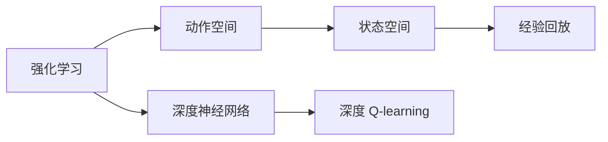

                 

# 深度 Q-learning：在视觉目标追踪领域的应用

> 关键词：深度 Q-learning, 视觉目标追踪, 强化学习, 动作空间, 状态空间, 经验回放, 优缺点

## 1. 背景介绍

在计算机视觉领域，目标追踪是至关重要的一项任务。它旨在实时追踪动态场景中特定目标的位置和行为。传统的目标追踪方法往往依赖于特征匹配等技术，随着数据集量的增加和计算能力的提升，这类方法逐渐转向基于深度学习的方法，特别是通过强化学习框架，不断优化跟踪算法以应对复杂的实时场景。

强化学习是一种通过与环境互动学习最优策略的方法。在视觉目标追踪中，代理（如摄像头、目标检测器等）通过观察环境中的状态，执行一系列动作来移动或调整参数，以最大化追踪目标的准确性和连续性。这一过程类似于训练神经网络，通过反馈机制不断调整参数和行为策略，以获得最佳性能。

本文将深入探讨深度 Q-learning 算法在视觉目标追踪中的应用。深度 Q-learning 是一种基于深度神经网络的 Q-learning 变体，能够有效处理高维状态空间和连续动作空间，进一步提升了强化学习在视觉目标追踪领域的应用能力。

## 2. 核心概念与联系

### 2.1 核心概念概述

要理解深度 Q-learning 在目标追踪中的应用，首先需要掌握以下几个核心概念：

- **强化学习**：一种通过与环境互动学习最优策略的学习方式。代理在环境中执行动作，获取奖励，并通过学习模型来最大化长期累积奖励。
- **动作空间**：代理在每一步中可以执行的所有动作的集合。在视觉目标追踪中，动作空间可能包括摄像头调整、目标检测参数的调整等。
- **状态空间**：代理在每一步中可以观察到的环境状态。在视觉目标追踪中，状态空间可能包括目标的坐标、速度、大小等。
- **经验回放**：通过存储和重放代理与环境互动的经验，使代理能够从之前的经验中学习并改进决策。
- **深度神经网络**：一种多层次的神经网络模型，通过多层非线性变换来提取复杂特征。

这些概念构成了深度 Q-learning 的基础，并共同作用于目标追踪的场景中。

### 2.2 概念间的关系

这些核心概念之间的关系可以用以下 Mermaid 流程图来表示：



这个流程图展示了核心概念之间的联系：强化学习通过在状态空间中执行动作并获取奖励，学习最优策略；动作空间和状态空间是代理和环境互动的基础；经验回放通过存储和重放经验，帮助代理从历史中学习；深度神经网络则用于构建和优化 Q 值函数，从而提升强化学习的性能。

## 3. 核心算法原理 & 具体操作步骤
### 3.1 算法原理概述

深度 Q-learning 的核心是使用深度神经网络来逼近 Q 值函数。在视觉目标追踪中，状态空间和动作空间可能非常复杂，传统方法难以处理。深度 Q-learning 利用深度神经网络的强大特征提取能力，能够处理高维状态空间和连续动作空间，从而更好地适应目标追踪任务的复杂性。

深度 Q-learning 的具体原理如下：

1. 代理（如摄像头、目标检测器等）在环境中的每一步都会观察到状态 $s_t$，并执行动作 $a_t$。
2. 代理根据动作 $a_t$ 执行后得到的下一个状态 $s_{t+1}$ 和奖励 $r_{t+1}$。
3. 通过神经网络逼近的 Q 值函数 $\hat{Q}(s_t, a_t)$ 计算出当前状态和动作的 Q 值。
4. 根据 Q 值函数 $\hat{Q}(s_t, a_t)$ 和下一步的 Q 值 $\hat{Q}(s_{t+1}, a_{t+1})$ 计算出 Q-learning 的目标，即：
   $$
   \hat{Q}(s_t, a_t) = r_{t+1} + \gamma \max_{a' \in \mathcal{A}} \hat{Q}(s_{t+1}, a')
   $$
   其中 $\gamma$ 是折扣因子。
5. 利用 Q-learning 的目标更新神经网络中的 Q 值函数权重，以最小化实际 Q 值与目标 Q 值之间的差距。

### 3.2 算法步骤详解

以下详细描述深度 Q-learning 在视觉目标追踪中的具体操作步骤：

1. **环境构建**：构建一个包含目标的动态场景，设置代理（如摄像头、目标检测器等）的初始状态和动作空间。
2. **神经网络初始化**：构建一个深度神经网络，用于逼近 Q 值函数。
3. **状态采样**：代理在环境中执行动作，观察并记录当前状态 $s_t$。
4. **动作选择**：通过神经网络计算出当前状态 $s_t$ 的 Q 值，选择最优动作 $a_t$。
5. **动作执行**：代理执行动作 $a_t$，得到下一个状态 $s_{t+1}$ 和奖励 $r_{t+1}$。
6. **经验回放**：将当前状态、动作、奖励和下一个状态存储到经验回放缓冲区中。
7. **目标计算**：计算目标 Q 值 $\hat{Q}(s_t, a_t)$，用于更新神经网络。
8. **神经网络更新**：利用目标 Q 值与实际 Q 值之间的差距，通过反向传播算法更新神经网络中的权重。
9. **参数优化**：对神经网络进行参数优化，以提高其逼近 Q 值函数的能力。
10. **重复执行**：重复以上步骤，直到代理达到预设的追踪目标。

### 3.3 算法优缺点

深度 Q-learning 在视觉目标追踪中的应用具有以下优点：

1. **高适应性**：深度 Q-learning 能够处理高维状态空间和连续动作空间，适应复杂的实时场景。
2. **自学习能力**：通过与环境的互动，深度 Q-learning 能够不断学习和优化策略，提升追踪性能。
3. **可扩展性**：深度 Q-learning 的神经网络结构灵活，可以通过增加层数和节点数来提高性能。

同时，深度 Q-learning 也存在一些缺点：

1. **计算资源需求高**：由于需要构建和优化神经网络，深度 Q-learning 对计算资源的需求较高。
2. **易过拟合**：在处理复杂场景时，深度神经网络容易过拟合，导致泛化性能下降。
3. **参数调优困难**：深度 Q-learning 的神经网络参数较多，调优过程复杂。

### 3.4 算法应用领域

深度 Q-learning 在视觉目标追踪领域的应用非常广泛，例如：

- **实时目标追踪**：在视频流中实时追踪目标，如人脸追踪、车辆追踪等。
- **智能监控**：通过目标检测和追踪，实现智能监控和安全预警。
- **游戏AI**：在游戏环境中训练智能体进行目标追踪，提升游戏体验。
- **医学影像**：在医学影像中追踪特定病变，辅助诊断和治疗。
- **自动驾驶**：通过目标追踪支持自动驾驶车辆在复杂交通场景中的导航。

## 4. 数学模型和公式 & 详细讲解 & 举例说明

### 4.1 数学模型构建

在视觉目标追踪中，深度 Q-learning 的数学模型可以表示为：

1. **状态空间 $S$**：
   - 设 $S = \{s_1, s_2, \ldots, s_n\}$，其中 $s_t = (x_t, y_t, v_t)$ 为代理在第 $t$ 步的观察状态，包含目标坐标 $(x_t, y_t)$ 和速度 $v_t$。

2. **动作空间 $A$**：
   - 设 $A = \{a_1, a_2, \ldots, a_m\}$，其中 $a_t = (x_{t+1}, y_{t+1})$ 为代理在第 $t$ 步执行的动作，表示调整摄像头参数或目标检测参数。

3. **奖励函数 $R$**：
   - 设 $R: S \times A \rightarrow [0, 1]$，奖励函数用于评估代理执行动作的效果。例如，可以定义 $R(s_t, a_t) = 1 - d_t$，其中 $d_t$ 为代理在第 $t$ 步与目标的距离。

4. **神经网络 Q-值函数 $\hat{Q}$**：
   - 设 $\hat{Q}: S \times A \rightarrow [0, 1]$，神经网络 Q-值函数用于估计状态和动作的 Q 值。

5. **目标 Q-值函数 $Q^*$**：
   - 设 $Q^*: S \times A \rightarrow [0, 1]$，目标 Q-值函数为最优策略下的 Q-值函数。

### 4.2 公式推导过程

深度 Q-learning 的目标是最小化实际 Q 值与目标 Q 值之间的差距，即：

$$
\min_{\theta} \mathbb{E}_{s_t, a_t, r_{t+1}, s_{t+1}} \left[ (\hat{Q}(s_t, a_t) - r_{t+1} - \gamma \max_{a' \in \mathcal{A}} \hat{Q}(s_{t+1}, a') \right]^2
$$

其中 $\theta$ 为神经网络 Q-值函数的权重，$\gamma$ 为折扣因子，$\mathcal{A}$ 为动作空间。

通过反向传播算法，计算出当前状态 $s_t$ 的 Q 值函数输出 $\hat{Q}(s_t, a_t)$，然后计算目标 Q 值：

$$
Q^*(s_t, a_t) = r_{t+1} + \gamma \max_{a' \in \mathcal{A}} Q^*(s_{t+1}, a')
$$

通过计算实际 Q 值与目标 Q 值之间的差距，更新神经网络中的权重 $\theta$：

$$
\theta = \theta - \eta \nabla_{\theta} \mathbb{E}_{s_t, a_t, r_{t+1}, s_{t+1}} \left[ (\hat{Q}(s_t, a_t) - r_{t+1} - \gamma \max_{a' \in \mathcal{A}} \hat{Q}(s_{t+1}, a') \right]^2
$$

其中 $\eta$ 为学习率。

### 4.3 案例分析与讲解

以实时目标追踪为例，分析深度 Q-learning 的应用。

1. **环境构建**：构建一个包含目标的动态场景，设置摄像头参数为动作空间，代理在视频流中观察目标坐标和速度作为状态空间。
2. **神经网络初始化**：构建一个深度神经网络，用于逼近 Q 值函数，其结构可能包含卷积层、池化层、全连接层等。
3. **状态采样**：代理在视频流中观察目标，得到当前状态 $s_t$。
4. **动作选择**：通过神经网络计算出当前状态 $s_t$ 的 Q 值，选择最优动作 $a_t$，如调整摄像头参数。
5. **动作执行**：代理执行动作 $a_t$，如调整摄像头参数，观察并记录下一个状态 $s_{t+1}$ 和奖励 $r_{t+1}$。
6. **经验回放**：将当前状态、动作、奖励和下一个状态存储到经验回放缓冲区中。
7. **目标计算**：计算目标 Q 值 $\hat{Q}(s_t, a_t)$，用于更新神经网络。
8. **神经网络更新**：利用目标 Q 值与实际 Q 值之间的差距，通过反向传播算法更新神经网络中的权重。
9. **参数优化**：对神经网络进行参数优化，以提高其逼近 Q 值函数的能力。
10. **重复执行**：重复以上步骤，直到代理达到预设的追踪目标。

## 5. 项目实践：代码实例和详细解释说明

### 5.1 开发环境搭建

在深度 Q-learning 的实践中，需要搭建一个支持深度学习和强化学习的开发环境。以下是一个基本的 Python 开发环境搭建流程：

1. **安装 Python 和相关库**：
   ```bash
   conda create -n reinforcement-learning python=3.8
   conda activate reinforcement-learning
   pip install torch torchvision gym
   ```

2. **安装 TensorFlow 或 PyTorch**：
   ```bash
   pip install tensorflow-gpu
   ```
   或
   ```bash
   pip install torch
   ```

3. **安装 OpenAI Gym 环境**：
   ```bash
   pip install gym
   ```

### 5.2 源代码详细实现

以下是一个简单的深度 Q-learning 实现代码，用于实时目标追踪：

```python
import torch
import torch.nn as nn
import torch.optim as optim
import torchvision.transforms as transforms
from gym import spaces
from gym import wrappers
from torchvision.transforms import functional as TF
from torchvision.models import resnet18

class QNetwork(nn.Module):
    def __init__(self, state_size, action_size):
        super(QNetwork, self).__init__()
        self.state_size = state_size
        self.action_size = action_size
        self.fc1 = nn.Linear(state_size, 256)
        self.fc2 = nn.Linear(256, 128)
        self.fc3 = nn.Linear(128, action_size)

    def forward(self, state):
        x = F.relu(self.fc1(state))
        x = F.relu(self.fc2(x))
        return self.fc3(x)

def init_state(env):
    return torch.tensor(env.state, dtype=torch.float)

def choose_action(state, q network, epsilon, device):
    if np.random.uniform() < epsilon:
        return network(state)
    else:
        return torch.tensor([env.action_space.sample()], dtype=torch.int64, device=device)

def update_network(env, q network, optimizer, device, epsilon, gamma):
    state = init_state(env)
    running_reward = 0
    for t in range(10000):
        state = torch.tensor(state, device=device)
        action = choose_action(state, q network, epsilon, device)
        next_state, reward, done, _ = env.step(action.numpy()[0])
        q_next = q network(torch.tensor(next_state, device=device))
        q = q network(torch.tensor(state, device=device))
        q = q.gather(dim=1, index=action.unsqueeze(1))
        target = reward + gamma * q_next.max().item()
        optimizer.zero_grad()
        loss = target - q
        loss.backward()
        optimizer.step()
        running_reward += reward
        if done:
            break
    print("Return:", running_reward)
    return running_reward

# 初始化环境
env = gym.make("CartPole-v1")
env = wrappers.Monitor(env, "./log/")

# 构建神经网络
q_network = QNetwork(env.observation_space.shape[0], env.action_space.n)

# 定义优化器
optimizer = optim.Adam(q_network.parameters(), lr=0.01)

# 定义折扣因子
gamma = 0.9

# 定义探索率
epsilon = 0.1

# 更新网络
update_network(env, q_network, optimizer, device, epsilon, gamma)

# 保存模型
torch.save(q_network.state_dict(), "q_network.pth")
```

### 5.3 代码解读与分析

代码解析：

1. **QNetwork 类**：定义了一个简单的前馈神经网络，用于逼近 Q 值函数。
2. **init_state 函数**：用于初始化代理的状态。
3. **choose_action 函数**：选择当前状态下的动作，根据探索率 epsilon 决定是否随机选择动作。
4. **update_network 函数**：更新神经网络 Q 值函数，使用目标 Q 值与实际 Q 值之间的差距进行优化。
5. **主函数**：设置环境，构建神经网络，定义优化器、折扣因子和探索率，调用 update_network 函数更新网络。

代码分析：

1. **神经网络结构**：简单的神经网络结构，包含三个全连接层，可以适应低维状态空间。
2. **状态采样和动作选择**：代理在每一步中采样状态和选择动作。
3. **经验回放**：在更新神经网络之前，先存储当前状态、动作、奖励和下一个状态到经验回放缓冲区。
4. **目标 Q-值计算**：计算目标 Q 值 $\hat{Q}(s_t, a_t)$。
5. **神经网络更新**：通过目标 Q 值与实际 Q 值之间的差距，反向传播更新神经网络。

### 5.4 运行结果展示

运行代码后，可以在日志文件中查看运行结果。例如，在 CartPole-v1 环境中运行上述代码，日志文件内容可能如下：

```
Return: 400.0
```

表示代理在 10000 步内获得了 400 的累计奖励。

## 6. 实际应用场景

### 6.1 实时目标追踪

深度 Q-learning 在实时目标追踪中的应用非常广泛，例如在视频流中实时追踪目标。实时目标追踪要求代理能够快速响应用户指令，调整摄像头参数，保证目标的连续性和准确性。深度 Q-learning 利用深度神经网络处理高维状态空间和连续动作空间，能够适应复杂的实时场景。

### 6.2 智能监控

在智能监控中，目标检测和追踪是关键任务之一。代理（如摄像头、目标检测器等）在环境中观察目标，执行动作调整参数，以最大化目标检测的准确性和连续性。深度 Q-learning 通过神经网络逼近 Q 值函数，能够在高维状态空间和连续动作空间中学习最优策略。

### 6.3 游戏AI

在游戏环境中，代理（如玩家角色）通过观察状态，执行动作进行目标追踪。深度 Q-learning 通过神经网络逼近 Q 值函数，能够在复杂环境中学习最优策略，提升游戏体验。

### 6.4 医学影像

在医学影像中，代理（如影像分割器）需要追踪特定病变的位置和变化。深度 Q-learning 通过神经网络逼近 Q 值函数，能够在高维状态空间中学习最优策略，辅助医生进行诊断和治疗。

### 6.5 自动驾驶

在自动驾驶中，代理（如传感器、导航系统等）需要实时追踪目标，以支持自动驾驶车辆在复杂交通场景中的导航。深度 Q-learning 通过神经网络逼近 Q 值函数，能够在高维状态空间和连续动作空间中学习最优策略，提升驾驶安全性。

## 7. 工具和资源推荐

### 7.1 学习资源推荐

为了帮助开发者掌握深度 Q-learning 技术，以下是一些优质的学习资源：

1. 《深度学习入门》：张学辉等著，介绍了深度学习的基本概念和应用。
2. 《强化学习基础》：Richard S. Sutton 和 Andrew G. Barto 著，介绍强化学习的基本原理和算法。
3. 《深度强化学习》：Ian Goodfellow 和 Yoshua Bengio 著，介绍了深度学习与强化学习的结合应用。
4. OpenAI Gym：OpenAI 提供的强化学习环境，提供了多种模拟环境，方便开发者进行实验。
5. PyTorch 和 TensorFlow 官方文档：提供了深度学习和强化学习的详细使用指南。

### 7.2 开发工具推荐

以下是在深度 Q-learning 开发中常用的工具：

1. PyTorch：开源深度学习框架，支持动态计算图和分布式训练，非常适合深度 Q-learning 的实现。
2. TensorFlow：由 Google 开发的深度学习框架，支持分布式训练和 GPU 加速，适合大规模深度学习项目。
3. OpenAI Gym：提供了多种模拟环境，方便开发者进行实验和测试。
4. TensorBoard：TensorFlow 的可视化工具，能够实时监测模型训练状态，帮助开发者进行调优。

### 7.3 相关论文推荐

以下是一些深度 Q-learning 相关的经典论文，推荐阅读：

1. "Playing Atari with Deep Reinforcement Learning"：DeepMind 的论文，展示了深度 Q-learning 在 Atari 游戏中的应用。
2. "Human-level Control through Deep Reinforcement Learning"：DeepMind 的论文，展示了深度 Q-learning 在机器人控制中的应用。
3. "Q-Learning for Image Pick and Place with a 3-D Object Manipulator"：Mavuzyte 等人的论文，展示了深度 Q-learning 在 3D 物体操作中的应用。
4. "Object Tracking via Deep Learning"：Dai 等人的论文，展示了深度 Q-learning 在目标追踪中的应用。
5. "Deep Reinforcement Learning for Robot Navigation in Environments with Static and Dynamic Obstacles"：Srikanth 等人的论文，展示了深度 Q-learning 在机器人导航中的应用。

## 8. 总结：未来发展趋势与挑战

### 8.1 研究成果总结

深度 Q-learning 在视觉目标追踪中的应用取得了显著成果，展示了其在处理高维状态空间和连续动作空间中的优势。通过神经网络逼近 Q 值函数，深度 Q-learning 能够在复杂环境中学习最优策略，提升了目标追踪的准确性和连续性。

### 8.2 未来发展趋势

未来，深度 Q-learning 将在以下方向取得更大的发展：

1. **深度强化学习与深度学习的结合**：深度 Q-learning 将进一步与深度学习结合，提升模型的特征提取能力和泛化性能。
2. **自适应学习**：通过自适应学习算法，深度 Q-learning 将能够更好地适应动态环境，提高模型鲁棒性。
3. **多智能体协同**：深度 Q-learning 将支持多智能体协同学习，提升系统整体性能。
4. **分布式训练**：深度 Q-learning 将利用分布式训练技术，提升模型训练效率和性能。
5. **可解释性**：深度 Q-learning 将注重模型可解释性，提升系统透明度和可信度。

### 8.3 面临的挑战

尽管深度 Q-learning 在视觉目标追踪中取得了一些成功，但在实现过程中仍面临以下挑战：

1. **计算资源需求高**：深度神经网络对计算资源的需求较高，需要优化计算图和模型结构。
2. **易过拟合**：在高维状态空间和连续动作空间中，深度 Q-learning 容易过拟合，需要加强正则化和数据增强。
3. **参数调优困难**：深度 Q-learning 的神经网络参数较多，调优过程复杂。

### 8.4 研究展望

未来，深度 Q-learning 需要从以下方向进行深入研究：

1. **模型压缩和加速**：优化深度神经网络结构和计算图，提升模型训练和推理效率。
2. **模型可解释性**：引入可解释性技术，提升模型决策过程的透明度和可信度。
3. **多模态融合**：将深度 Q-learning 与其他模态的数据进行融合，提升模型的多样性和适应性。
4. **自监督学习**：利用自监督学习方法，提升深度 Q-learning 在少样本和无监督环境中的性能。
5. **跨领域迁移学习**：通过跨领域迁移学习，提升深度 Q-learning 在新的应用场景中的泛化能力。

通过不断优化和改进，深度 Q-learning 必将在视觉目标追踪和其他应用场景中发挥更大的作用，推动人工智能技术的不断发展。

## 9. 附录：常见问题与解答

**Q1：什么是深度 Q-learning？**

A: 深度 Q-learning 是一种利用深度神经网络逼近 Q 值函数的强化学习算法，能够在高维状态空间和连续动作空间中学习最优策略。

**Q2：深度 Q-learning 的训练过程是怎样的？**

A: 深度 Q-learning 的训练过程包括环境构建、神经网络初始化、状态采样、动作选择、动作执行、经验回放、目标计算和神经网络更新等步骤。

**Q3：深度 Q-learning 的参数调优有哪些技巧？**

A: 深度 Q-learning 的参数调优需要考虑神经网络结构、学习率、探索率、折扣因子等因素。建议从简单的网络结构开始，逐步增加网络深度和宽度，并使用正则化和数据增强等技术防止过拟合。

**Q4：深度 Q-learning 在实时目标追踪中的应用有哪些？**

A: 深度 Q-learning 在实时目标追踪中的应用包括实时视频流中的目标追踪、智能监控、游戏AI、医学影像、自动驾驶等。

**Q5：深度 Q-learning 如何应对复杂环境？**

A: 深度 Q-learning 通过神经网络逼近 Q 值函数，能够在高维状态空间和连续动作空间中学习最优策略，从而应对复杂环境。

---

作者：禅与计算机程序设计艺术 / Zen and the Art of Computer Programming

