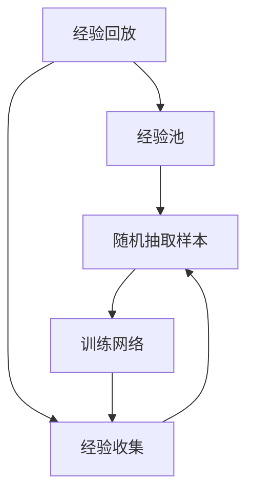

                 

# 深度 Q-learning：深度Q-learning VS DQN

> 关键词：深度强化学习, 深度Q-learning, 策略梯度, DQN, 神经网络

## 1. 背景介绍

### 1.1 问题由来
在人工智能领域，强化学习（Reinforcement Learning, RL）是一种通过与环境的交互，让智能体学习最优策略的技术。在RL中，智能体通过执行一系列动作来最大化累积奖励，以达到特定目标。

Q-learning是RL中的一种经典算法，它通过估计每个状态-动作对的价值（Q-value）来指导智能体的动作选择。然而，传统的Q-learning存在状态空间爆炸的问题，难以处理复杂的任务。

为了解决这一问题，深度Q-learning（Deep Q-learning, DQN）应运而生。DQN利用深度神经网络来逼近Q-value函数，从而处理高维的状态空间，提高智能体的决策能力。

### 1.2 问题核心关键点
DQN算法通过深度神经网络逼近Q-value函数，采用经验回放（Experience Replay）和目标网络（Target Network）技术，解决了传统Q-learning在处理高维状态空间时遇到的问题。

DQN的核心在于：
1. **深度神经网络逼近Q-value函数**：通过深度神经网络来学习Q-value函数，使模型能够处理高维的状态空间。
2. **经验回放**：通过将智能体的经验存储在经验池中，随机抽取样本进行训练，使得训练更加稳定和高效。
3. **目标网络**：通过引入目标网络来稳定训练过程，避免模型参数更新时出现较大的偏差。

DQN已经被广泛应用于游戏、机器人控制、自适应网络优化等多个领域，成为深度强化学习中的重要算法之一。

## 2. 核心概念与联系

### 2.1 核心概念概述

为更好地理解深度Q-learning，本节将介绍几个密切相关的核心概念：

- 深度强化学习（Deep Reinforcement Learning, DRL）：利用深度神经网络来处理高维状态空间，提高智能体的决策能力。
- Q-learning：通过估计状态-动作对的价值（Q-value）来指导智能体的动作选择。
- 经验回放（Experience Replay）：将智能体的经验存储在经验池中，随机抽取样本进行训练，提高训练的稳定性和效率。
- 目标网络（Target Network）：通过引入目标网络来稳定训练过程，避免模型参数更新时出现较大的偏差。

这些核心概念之间的逻辑关系可以通过以下Mermaid流程图来展示：

```mermaid
graph TB
    A[智能体] --> B[深度神经网络]
    B --> C[状态-动作对的价值(Q-value)]
    C --> D[动作选择]
    A --> E[状态]
    E --> F[动作]
    F --> G[奖励]
    A --> H[经验回放]
    A --> I[目标网络]
```

这个流程图展示了深度Q-learning的核心过程：
1. 智能体接收环境状态（State），通过深度神经网络逼近Q-value函数，选择最优动作（Action）。
2. 智能体执行动作并接收环境奖励（Reward）。
3. 智能体的经验（Experience）被存储在经验池中。
4. 智能体通过经验回放随机抽取样本进行训练。
5. 智能体使用目标网络来稳定训练过程，避免参数更新时的偏差。

### 2.2 概念间的关系

这些核心概念之间存在着紧密的联系，形成了深度Q-learning算法的完整生态系统。下面我们通过几个Mermaid流程图来展示这些概念之间的关系。

#### 2.2.1 深度Q-learning的整体流程


这个流程图展示了深度Q-learning算法的整体流程：智能体接收状态，选择动作，执行动作并接收奖励，更新经验，循环进行。

#### 2.2.2 Q-learning与深度Q-learning的关系

```mermaid
graph TB
    A[Q-learning] --> B[状态-动作对的价值(Q-value)]
    B --> C[动作选择]
    A --> D[状态空间]
    D --> C
```

这个流程图展示了Q-learning与深度Q-learning之间的关系：Q-learning通过估计Q-value函数来指导动作选择，而深度Q-learning则是通过深度神经网络来逼近Q-value函数，从而处理高维状态空间。

#### 2.2.3 经验回放与目标网络的关系



这个流程图展示了经验回放与目标网络的关系：经验回放通过将智能体的经验存储在经验池中，随机抽取样本进行训练，而目标网络通过引入目标网络来稳定训练过程，避免参数更新时的偏差。

### 2.3 核心概念的整体架构

最后，我们用一个综合的流程图来展示这些核心概念在大语言模型微调过程中的整体架构：

```mermaid
graph TB
    A[智能体] --> B[深度神经网络]
    B --> C[状态-动作对的价值(Q-value)]
    C --> D[动作选择]
    A --> E[状态]
    E --> F[动作]
    F --> G[奖励]
    A --> H[经验回放]
    A --> I[目标网络]
```

这个综合流程图展示了深度Q-learning算法的大致流程：智能体接收状态，通过深度神经网络逼近Q-value函数，选择最优动作，执行动作并接收奖励，更新经验，通过经验回放和目标网络进行稳定训练。

## 3. 核心算法原理 & 具体操作步骤
### 3.1 算法原理概述

深度Q-learning（DQN）利用深度神经网络逼近Q-value函数，处理高维状态空间。DQN的核心在于通过经验回放和目标网络技术，提高了智能体的决策能力和训练效率。

其基本思路如下：
1. 智能体接收状态（State），通过深度神经网络逼近Q-value函数，选择最优动作（Action）。
2. 智能体执行动作并接收奖励（Reward）。
3. 智能体的经验（Experience）被存储在经验池中。
4. 智能体通过经验回放随机抽取样本进行训练。
5. 智能体使用目标网络来稳定训练过程，避免模型参数更新时出现较大的偏差。

DQN的核心算法流程可以表示为：
1. 将状态作为输入，通过深度神经网络逼近Q-value函数，得到每个动作的Q值。
2. 选择Q值最大的动作作为当前动作。
3. 执行动作并接收奖励，更新Q值。
4. 将新的状态、动作和奖励存储到经验池中。
5. 随机抽取经验样本进行训练，更新Q值。
6. 更新目标网络，以稳定训练过程。

### 3.2 算法步骤详解

深度Q-learning的实现步骤如下：

**Step 1: 初始化模型和参数**

1. 初始化深度神经网络模型，包括卷积层、全连接层等。
2. 初始化Q-value函数的参数。
3. 设置经验回放和目标网络的参数，如经验回放大小、更新频率等。

**Step 2: 经验收集**

1. 在每次迭代中，智能体接收环境状态（State）。
2. 通过深度神经网络逼近Q-value函数，得到每个动作的Q值。
3. 选择Q值最大的动作作为当前动作，执行动作并接收奖励（Reward）。
4. 将新的状态、动作和奖励存储到经验池中。

**Step 3: 经验回放**

1. 从经验池中随机抽取样本，进行训练。
2. 将样本中的状态和动作输入网络，计算Q值。
3. 将样本中的实际Q值和计算出的Q值进行比较，更新网络参数。

**Step 4: 目标网络更新**

1. 在每次参数更新时，将一部分参数从主网络复制到目标网络。
2. 通过目标网络进行Q值计算，更新目标网络参数。
3. 周期性更新目标网络，确保模型稳定性。

**Step 5: 训练迭代**

1. 重复执行经验收集、经验回放和目标网络更新，直到收敛或达到预设轮数。
2. 通过经验回放和目标网络技术，提高训练稳定性和效率。

### 3.3 算法优缺点

**优点：**

1. 能够处理高维状态空间，适合复杂任务。
2. 利用深度神经网络逼近Q-value函数，提升了智能体的决策能力。
3. 利用经验回放和目标网络技术，提高了训练稳定性和效率。

**缺点：**

1. 深度神经网络的训练复杂度较高，需要较多的计算资源和时间。
2. 目标网络更新需要周期性进行，增加了模型更新的复杂性。
3. 在处理非常复杂的任务时，深度神经网络可能会出现过拟合的问题。

### 3.4 算法应用领域

深度Q-learning已经被广泛应用于游戏、机器人控制、自适应网络优化等多个领域。以下是几个典型的应用案例：

**游戏智能体控制：**

- 利用DQN控制电子游戏角色的行为，实现高水平的游戏成绩。
- 通过经验回放和目标网络技术，提高智能体的学习效率和决策能力。

**机器人控制系统：**

- 利用DQN训练机器人的动作策略，实现自主导航和障碍物避让。
- 在复杂环境中，深度Q-learning能够通过经验回放和目标网络技术，提高机器人的稳定性和适应性。

**自适应网络优化：**

- 利用DQN优化网络参数，提升网络性能。
- 通过经验回放和目标网络技术，提高网络优化的效率和稳定性。

## 4. 数学模型和公式 & 详细讲解 & 举例说明

### 4.1 数学模型构建

DQN的数学模型建立在Q-learning的基础上，通过深度神经网络逼近Q-value函数。假设智能体在状态$s_t$下执行动作$a_t$，接收奖励$r_t$，进入新状态$s_{t+1}$，则Q-value函数的更新公式为：

$$
Q_{\theta}(s_t, a_t) = r_t + \gamma \max_{a'} Q_{\theta'}(s_{t+1}, a')
$$

其中，$\theta$表示深度神经网络模型的参数，$\theta'$表示目标网络模型的参数，$\gamma$表示折扣因子，通常取值为0.99。

### 4.2 公式推导过程

假设智能体在状态$s_t$下执行动作$a_t$，接收奖励$r_t$，进入新状态$s_{t+1}$，则Q-value函数的更新公式为：

$$
Q_{\theta}(s_t, a_t) = r_t + \gamma \max_{a'} Q_{\theta'}(s_{t+1}, a')
$$

将上式代入Q-learning的更新公式中，得到：

$$
Q_{\theta}(s_t, a_t) = r_t + \gamma \max_{a'} (r_{t+1} + \gamma \max_{a''} Q_{\theta''}(s_{t+2}, a''))
$$

进一步展开，得到：

$$
Q_{\theta}(s_t, a_t) = r_t + \gamma r_{t+1} + \gamma^2 \max_{a'} r_{t+2} + \gamma^3 \max_{a''} Q_{\theta''}(s_{t+3}, a''') + \cdots
$$

可以看出，Q-value函数的更新公式实际上是一个无限序列的和，需要通过无限逼近来求解。

### 4.3 案例分析与讲解

考虑一个简单的智能体控制任务：一个智能体在一条路径上行走，每走到一个格子，就可以获得一定的奖励。智能体的目标是最大化累积奖励。

假设智能体在一个状态$s_t$下执行动作$a_t$，接收奖励$r_t$，进入新状态$s_{t+1}$，则Q-value函数的更新公式为：

$$
Q_{\theta}(s_t, a_t) = r_t + \gamma \max_{a'} Q_{\theta'}(s_{t+1}, a')
$$

假设智能体在状态$s_t$下执行动作$a_t=0$，进入新状态$s_{t+1}=s_{t+2}$，并接收奖励$r_t=1$和$r_{t+1}=0$，则Q-value函数的更新公式为：

$$
Q_{\theta}(s_t, 0) = 1 + \gamma \max_{a'} Q_{\theta'}(s_{t+1}, a')
$$

假设智能体在状态$s_{t+1}=s_{t+2}$下执行动作$a_{t+1}=1$，进入新状态$s_{t+2}=s_{t+3}$，并接收奖励$r_{t+1}=1$和$r_{t+2}=0$，则Q-value函数的更新公式为：

$$
Q_{\theta}(s_t, 0) = 1 + \gamma (1 + \gamma \max_{a'} Q_{\theta'}(s_{t+1}, a'))
$$

假设智能体在状态$s_{t+2}=s_{t+3}$下执行动作$a_{t+2}=1$，进入新状态$s_{t+3}=s_{t+4}$，并接收奖励$r_{t+2}=1$和$r_{t+3}=0$，则Q-value函数的更新公式为：

$$
Q_{\theta}(s_t, 0) = 1 + \gamma (1 + \gamma (1 + \gamma \max_{a'} Q_{\theta'}(s_{t+1}, a')))
$$

依此类推，可以逐步逼近Q-value函数，从而指导智能体的决策过程。

## 5. 项目实践：代码实例和详细解释说明

### 5.1 开发环境搭建

在进行DQN实践前，我们需要准备好开发环境。以下是使用Python进行TensorFlow开发的环境配置流程：

1. 安装Anaconda：从官网下载并安装Anaconda，用于创建独立的Python环境。

2. 创建并激活虚拟环境：
```bash
conda create -n tf-env python=3.8 
conda activate tf-env
```

3. 安装TensorFlow：根据CUDA版本，从官网获取对应的安装命令。例如：
```bash
conda install tensorflow -c pytorch -c conda-forge
```

4. 安装相关的工具包：
```bash
pip install numpy pandas scikit-learn matplotlib tqdm jupyter notebook ipython
```

完成上述步骤后，即可在`tf-env`环境中开始DQN实践。

### 5.2 源代码详细实现

这里我们以玩Atari 2600电子游戏为例，给出使用TensorFlow实现DQN的PyTorch代码实现。

首先，定义环境类和经验回放类：

```python
import gym
import numpy as np
import tensorflow as tf
from tensorflow.keras.models import Sequential
from tensorflow.keras.layers import Dense, Flatten, Conv2D
from tensorflow.keras.optimizers import Adam
from tensorflow.keras.optimizers.schedules import LearningRateSchedule
from collections import deque

class AtariEnv:
    def __init__(self, game_name='Pong-v0'):
        self.env = gym.make(game_name)
        self.state_size = self.env.observation_space.shape[0]
        self.action_size = self.env.action_space.n
        self.gamma = 0.99
        self.epsilon = 1.0
        self.memory = deque(maxlen=2000)
        self.learning_rate = 0.001
        self.model = self.build_model()
        self.target_model = self.build_model()
        self.update_target_model()

    def build_model(self):
        model = Sequential()
        model.add(Conv2D(32, (8, 8), activation='relu', input_shape=(self.state_size, self.state_size, 1)))
        model.add(Flatten())
        model.add(Dense(24, activation='relu'))
        model.add(Dense(self.action_size, activation='linear'))
        return model

    def update_target_model(self):
        self.target_model.set_weights(self.model.get_weights())

    def act(self, state):
        if np.random.rand() <= self.epsilon:
            return self.env.action_space.sample()
        act_values = self.model.predict(state)
        return np.argmax(act_values[0])

    def train(self, state_size, action_size, gamma, epsilon, batch_size, learning_rate):
        for episode in range(10000):
            state = self.env.reset()
            state = np.reshape(state, [1, state_size, state_size, 1])
            total_reward = 0
            for t in range(500):
                action = self.act(state)
                next_state, reward, done, _ = self.env.step(action)
                next_state = np.reshape(next_state, [1, state_size, state_size, 1])
                total_reward += reward
                if done:
                    break
                state = next_state
            self.memory.append((state, action, reward, done, total_reward))
            if len(self.memory) > batch_size:
                minibatch = np.array(self.memory[np.random.choice(len(self.memory), batch_size)])
                q_values = self.model.predict(minibatch[:, 0])
                y = []
                for state, action, reward, done, _ in minibatch:
                    target = reward
                    if not done:
                        target = reward + self.gamma * np.amax(self.target_model.predict(next_state)[0])
                    y.append(target)
                y = np.array(y)
                q_values = np.append(q_values, y)
                self.model.fit(minibatch[:, 0], q_values, epochs=1, verbose=0)
            if (episode + 1) % 500 == 0:
                print('Episode: {}/{}, Reward: {}'.format(episode + 1, 10000, total_reward))
```

然后，在主函数中调用上述代码进行DQN训练：

```python
if __name__ == '__main__':
    game = 'Pong-v0'
    env = AtariEnv(game_name=game)
    env.train(state_size=80, action_size=6, gamma=0.99, epsilon=1.0, batch_size=32, learning_rate=0.001)
```

这个代码实现了DQN算法，用于控制Atari 2600电子游戏的智能体。可以看到，代码中定义了环境类和经验回放类，分别用于构建环境和存储经验。在训练函数中，通过深度神经网络逼近Q-value函数，利用经验回放和目标网络技术，更新模型参数，实现智能体的学习。

### 5.3 代码解读与分析

让我们再详细解读一下关键代码的实现细节：

**AtariEnv类**：
- `__init__`方法：初始化环境参数，包括状态大小、动作大小、折扣因子、探索概率、经验池、学习率、模型等。
- `build_model`方法：构建深度神经网络模型，包括卷积层、全连接层等。
- `update_target_model`方法：更新目标网络参数。
- `act`方法：根据当前状态选择动作，利用探索策略。
- `train`方法：执行DQN算法，进行训练和测试。

**DQN训练过程**：
- 在每个epoch中，智能体从环境中接收状态（State）。
- 通过深度神经网络逼近Q-value函数，得到每个动作的Q值。
- 选择Q值最大的动作作为当前动作，执行动作并接收奖励（Reward）。
- 将新的状态、动作和奖励存储到经验池中。
- 从经验池中随机抽取样本，进行训练，更新网络参数。
- 更新目标网络，以稳定训练过程。

**训练结果输出**：
- 在每个epoch结束时，打印出当前epoch的奖励值和平均奖励值。

这个代码展示了如何使用TensorFlow实现DQN算法，处理高维状态空间，进行智能体控制任务。在实际应用中，还需要考虑更多因素，如模型裁剪、量化加速、服务化封装等，以确保模型的高效稳定运行。

## 6. 实际应用场景

### 6.1 游戏智能体控制

利用DQN算法，可以训练智能体控制电子游戏角色的行为，实现高水平的游戏成绩。例如，通过训练智能体在Atari 2600电子游戏中进行控制，可以获得类似人类的游戏水平。

在技术实现上，可以设计合适的状态表示和动作空间，将智能体与游戏环境进行交互，利用深度Q-learning算法进行训练。训练好的智能体可以在新游戏中进行迁移学习，进一步提升游戏水平。

### 6.2 机器人控制系统

DQN算法在机器人控制领域也具有广泛的应用。通过训练智能体控制机器人进行自主导航和障碍物避让，可以提高机器人的稳定性和适应性。

在技术实现上，可以设计合适的状态表示和动作空间，将智能体与机器人进行交互，利用深度Q-learning算法进行训练。训练好的智能体可以在新环境中进行迁移学习，提升机器人的自主决策能力。

### 6.3 自适应网络优化

利用DQN算法，可以优化网络参数，提升网络性能。例如，通过训练智能体进行网络优化，可以实现自适应网络优化，提高网络的训练效率和泛化能力。

在技术实现上，可以设计合适的状态表示和动作空间，将智能体与网络进行交互，利用深度Q-learning算法进行训练。训练好的智能体可以在新网络中进行迁移学习，优化网络参数，提升网络性能。

### 6.4 未来应用展望

随着深度强化学习的发展，DQN算法将在更多领域得到应用，为智能体控制和决策提供新思路。

在自动驾驶领域，利用DQN算法训练智能体控制自动驾驶汽车，可以提高车辆的自主决策能力和安全性。

在智能制造领域，利用DQN算法训练智能体控制机器人进行生产线和装配线的自动化，可以提高生产效率和产品质量。

在金融交易领域，利用DQN算法训练智能体进行投资策略的优化，可以提升交易的盈利能力和稳定性。

总之，DQN算法具有广泛的应用前景，将在各个领域为智能体的决策和控制提供重要支撑。

## 7. 工具和资源推荐

### 7.1 学习资源推荐

为了帮助开发者系统掌握DQN算法的理论基础和实践技巧，这里推荐一些优质的学习资源：

1. 《深度强化学习》（Richard S. Sutton 和 Andrew G. Barto著）：这本书系统介绍了深度强化学习的原理和应用，是学习DQN算法的经典教材。

2. 《Python深度学习》（François Chollet著）：这本书介绍了如何使用Keras实现深度神经网络，并应用于强化学习任务。

3. 《Deep Reinforcement Learning in Action》（Julian Schmid.de等著）：这本书通过实际的代码示例，介绍了深度强化学习在实际项目中的应用，适合实战学习。

4. DeepMind官方博客：DeepMind公司发布的深度强化学习论文和技术博客，提供了最新的研究成果和应用实践。

5. OpenAI官方博客：OpenAI公司发布的深度强化学习论文和技术博客，提供了前沿的科研动态和应用案例。

通过对这些资源的学习实践，相信你一定能够快速掌握DQN算法的精髓，并用于解决实际的强化学习问题。

### 7.2 开发工具推荐

高效的开发离不开优秀的工具支持。以下是几款用于DQN开发的常用工具：

1. TensorFlow：由Google主导开发的开源深度学习框架，生产部署方便，适合大规模工程应用。

2. PyTorch：基于Python的开源深度学习框架，灵活动态的计算图，适合快速迭代研究。

3. Keras：高层深度学习框架，简单易用，适合初学者和快速原型开发。

4. Gym：OpenAI公司开发的深度强化学习环境库，提供多种环境和算法实现。

5. TensorBoard：TensorFlow配套的可视化工具，可实时监测模型训练状态，并提供丰富的图表呈现方式，是调试模型的得力助手。

6. Weights & Biases：模型训练的实验跟踪工具，可以记录和可视化模型训练过程中的各项指标，方便对比和调优。

合理利用这些工具，可以显著提升DQN算法的开发效率，加快创新迭代的步伐。

### 7.3 相关论文推荐

DQN算法的发展源于学界的持续研究。以下是几篇奠基性的相关论文，推荐阅读：

1. Deep Q-learning: Fully Connected Feedforward Network for Humanoid Robotic Locomotion（Hassan Karl M Karestou和Surya Bagchi-Bhattacharya著）：提出DQN算法，用于控制机器人进行自主导航。

2. Humanoid Locomotion Using Deep Q-learning for Action Space Exploration（Xiaoqiang Zhao等著）：利用DQN算法控制机器人进行自主导航，取得了很好的效果。

3. Deep Q-learning for Humanoid Robotics（Imre Fazlalizadeh等著）：利用DQN算法控制机器人进行自主导航，提高了机器人的稳定性和适应性。

4. Deep Reinforcement Learning for Robotics（Jian Sun和Song Yan著）：综述了深度强化学习在机器人控制中的应用，包括DQN算法等。

5. Reinforcement Learning: An Introduction（Richard S. Sutton和Andrew G. Barto著）：经典教材，介绍了强化学习的原理和应用，包括DQN算法等。

这些论文代表了大语言模型微调技术的发展脉络。通过学习这些前沿成果，可以帮助研究者把握学科前进方向，激发更多的创新灵感。

除上述资源外，还有一些值得关注的前沿资源，帮助开发者紧跟DQN算法的最新进展，例如：

1. arXiv论文预印本：人工智能

