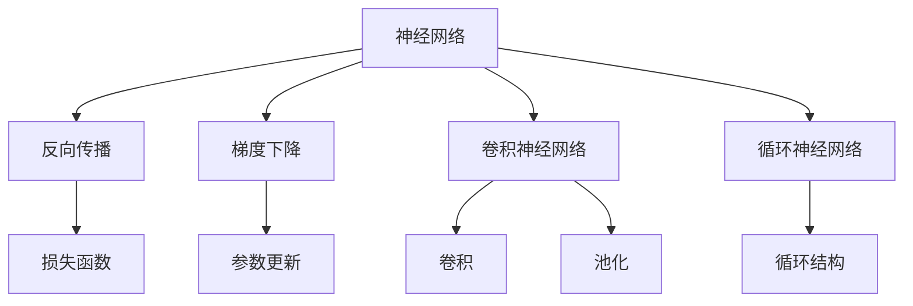
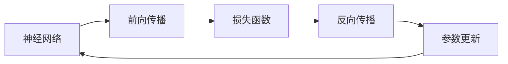
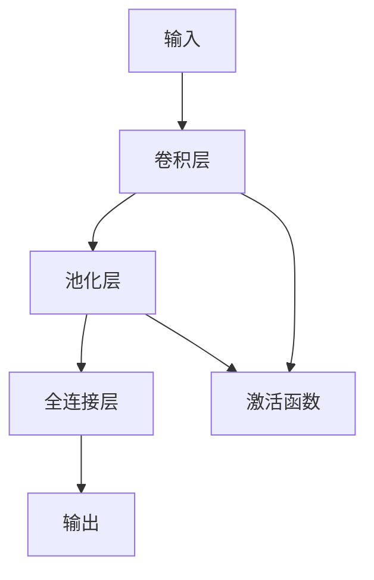
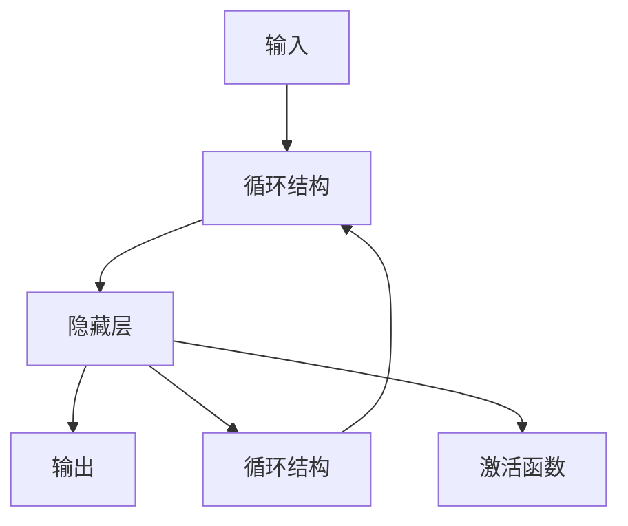
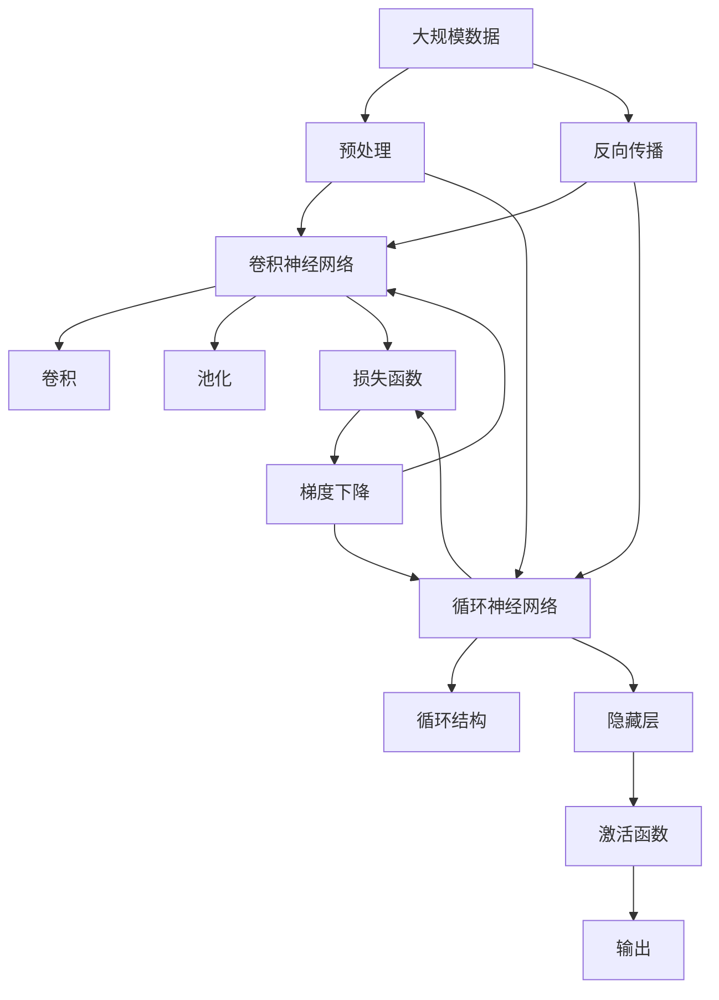

                 

# 深度学习 (Deep Learning) 原理与代码实例讲解

> 关键词：深度学习,神经网络,反向传播,卷积神经网络,循环神经网络,卷积,池化,激活函数,梯度下降,全连接层,深度学习框架

## 1. 背景介绍

### 1.1 问题由来

深度学习（Deep Learning, DL）作为一门迅速发展的机器学习分支，以其强大的表达能力和卓越的性能，在图像处理、自然语言处理、语音识别等领域取得了显著进展。当前，深度学习正被广泛应用于自动驾驶、医疗诊断、智能推荐等多个领域，为各行各业带来了新的变革。

然而，深度学习的原理较为复杂，涉及大量数学和统计学知识，给初学者带来了不小的学习挑战。本文旨在以通俗易懂的方式，全面介绍深度学习的核心概念、原理和实践技巧，并通过代码实例进行详细讲解，帮助读者深入理解深度学习的精髓。

### 1.2 问题核心关键点

深度学习的核心在于通过多层神经网络进行特征提取和决策。其核心算法包括反向传播、梯度下降、卷积神经网络、循环神经网络等。深度学习与传统机器学习相比，具有以下几个显著优势：

1. **特征提取能力强**：深度学习可以自动学习数据的高级特征表示，减少手动特征工程的工作量。
2. **适应性强**：深度学习模型可以处理非线性数据，适用于各类复杂模式识别任务。
3. **泛化能力好**：深度学习模型具有较强的泛化能力，可以在不同数据集上表现优异。
4. **灵活性高**：深度学习模型可以灵活适应各种任务，如分类、回归、聚类等。

本文将通过详细的数学推导和代码实例，帮助读者深入理解深度学习的核心算法和实践技巧，为实际应用奠定坚实基础。

## 2. 核心概念与联系

### 2.1 核心概念概述

为了更好地理解深度学习的基本原理，本节将介绍几个关键概念及其相互联系：

- **神经网络（Neural Network）**：由多个神经元（即节点）组成的计算图，用于模拟人脑处理信息的过程。神经网络中的每个神经元接收来自其他神经元的输入，并通过一系列数学运算生成输出。
- **反向传播（Backpropagation）**：一种用于训练神经网络的算法，通过反向传播误差，逐层更新网络参数，以最小化损失函数。
- **梯度下降（Gradient Descent）**：一种常用的优化算法，通过不断调整参数值，使得损失函数逐渐减小，从而找到最优解。
- **卷积神经网络（Convolutional Neural Network, CNN）**：一种专门用于处理图像数据的神经网络，通过卷积、池化等操作提取图像特征。
- **循环神经网络（Recurrent Neural Network, RNN）**：一种处理序列数据的神经网络，通过循环结构捕捉时间序列信息。

这些概念之间的关系可以用以下Mermaid流程图来展示：



这个流程图展示了深度学习中几个核心概念及其之间的关系：

1. 神经网络作为计算图，是深度学习的基础。
2. 反向传播用于训练神经网络，通过误差反向传播更新参数。
3. 梯度下降用于优化损失函数，是反向传播的数学基础。
4. CNN和RNN分别用于处理图像和序列数据，是其重要的变种网络。

这些概念共同构成了深度学习的理论基础，理解它们是深入掌握深度学习原理的前提。

### 2.2 概念间的关系

这些核心概念之间存在着紧密的联系，形成了深度学习的基本框架。下面我们将通过几个Mermaid流程图来展示这些概念之间的关系。

#### 2.2.1 神经网络的学习范式



这个流程图展示了神经网络的前向传播、损失函数、反向传播和参数更新之间的关系。神经网络通过前向传播计算输出，并通过损失函数衡量与真实标签的差距，反向传播更新参数，以最小化损失函数。

#### 2.2.2 卷积神经网络的结构



这个流程图展示了卷积神经网络的基本结构，包括输入、卷积层、池化层、全连接层和输出。卷积层和池化层用于提取图像特征，全连接层用于分类，激活函数用于引入非线性变换。

#### 2.2.3 循环神经网络的结构



这个流程图展示了循环神经网络的基本结构，包括输入、隐藏层、输出和循环结构。隐藏层通过循环结构捕捉时间序列信息，激活函数用于引入非线性变换。

### 2.3 核心概念的整体架构

最后，我们用一个综合的流程图来展示这些核心概念在深度学习中的应用：



这个综合流程图展示了从预处理到输出，再到反向传播和梯度下降的完整流程。深度学习模型首先对大规模数据进行预处理，然后通过卷积神经网络或循环神经网络进行特征提取，并引入非线性变换，最后输出结果。同时，反向传播和梯度下降用于更新网络参数，以最小化损失函数。

## 3. 核心算法原理 & 具体操作步骤

### 3.1 算法原理概述

深度学习的核心算法包括反向传播、梯度下降、卷积、池化等。本节将详细讲解这些核心算法的原理及其在深度学习中的应用。

#### 3.1.1 反向传播

反向传播是一种用于训练神经网络的算法，通过误差反向传播，逐层更新网络参数，以最小化损失函数。反向传播的原理基于链式法则，可以高效计算损失函数对每个参数的梯度，从而进行参数更新。

具体来说，假设神经网络中第 $l$ 层的输出为 $a_l$，输入为 $a_{l-1}$，权重为 $W_l$，偏置为 $b_l$，则第 $l$ 层的误差为：

$$
\delta_l = \frac{\partial L}{\partial z_l} \cdot \sigma'(z_l)
$$

其中，$L$ 为损失函数，$z_l$ 为第 $l$ 层的加权和，$\sigma(z_l)$ 为激活函数，$\sigma'(z_l)$ 为激活函数的导数。

通过链式法则，可以得到第 $l$ 层的输入 $a_{l-1}$ 对损失函数 $L$ 的偏导数：

$$
\frac{\partial L}{\partial a_{l-1}} = \frac{\partial L}{\partial z_l} \cdot \frac{\partial z_l}{\partial a_{l-1}} \cdot \frac{\partial a_{l-1}}{\partial z_l} = \delta_l \cdot W_l^T \cdot \sigma'(z_l)
$$

同理，可以得到输入 $x$ 对损失函数 $L$ 的偏导数：

$$
\frac{\partial L}{\partial x} = \frac{\partial L}{\partial z_1} \cdot \frac{\partial z_1}{\partial a_0} \cdot \frac{\partial a_0}{\partial x} = \delta_1 \cdot W_1^T \cdot W_0^T \cdot \sigma'(z_1)
$$

其中，$a_0$ 为输入层，$z_1$ 为第1层的加权和，$\sigma(z_1)$ 为激活函数，$\sigma'(z_1)$ 为激活函数的导数。

通过反向传播，可以逐层更新网络参数，使得模型输出的误差最小化。反向传播算法的伪代码如下：

```
for l in reverse(range(len(nets))):
    dLdZl = dLdzl * net[l].dZdA(l+1)
    dLdAl = dLdZl * net[l].dA dzl
    net[l].dw = dLdAl * net[l+1].a
    net[l].db = dLdAl
```

#### 3.1.2 梯度下降

梯度下降是一种常用的优化算法，通过不断调整参数值，使得损失函数逐渐减小，从而找到最优解。具体来说，假设目标函数为 $J(\theta)$，其中 $\theta$ 为模型参数，则梯度下降算法的迭代公式为：

$$
\theta_j = \theta_j - \eta \frac{\partial J(\theta)}{\partial \theta_j}
$$

其中，$\eta$ 为学习率，控制参数更新的步长。

在深度学习中，梯度下降通常与反向传播结合使用，用于训练神经网络。梯度下降的伪代码如下：

```
for i in range(iterations):
    J, grad = compute_cost_and_gradient(theta)
    theta = theta - eta * grad
```

#### 3.1.3 卷积神经网络

卷积神经网络是一种专门用于处理图像数据的神经网络，通过卷积、池化等操作提取图像特征。卷积神经网络通常包含多个卷积层、池化层和全连接层。

卷积层通过卷积操作提取图像局部特征，卷积核的大小和数量决定了卷积层的输出特征图的大小和数量。池化层用于降低特征图的空间大小，减少计算量。全连接层将特征图展开成一维向量，进行分类。

卷积神经网络的结构如图1所示：

```
                              Input Layer
                                 |
                                 v
                              Conv Layer 1
                                 |
                                 v
                             Max Pool Layer
                                 |
                                 v
                              Conv Layer 2
                                 |
                                 v
                           Max Pool Layer
                                 |
                                 v
                              Flatten Layer
                                 |
                                 v
                             Dense Layer 1
                                 |
                                 v
                              Softmax Layer
                                 |
                                 v
                              Output Layer
```

图1：卷积神经网络结构图

#### 3.1.4 循环神经网络

循环神经网络是一种处理序列数据的神经网络，通过循环结构捕捉时间序列信息。循环神经网络通常包含多个隐藏层，每个隐藏层接收前一时刻的状态作为输入，并输出当前时刻的状态。

循环神经网络的结构如图2所示：

```
                              Input Layer
                                 |
                                 v
                              Hidden Layer 1
                                 |
                                 v
                             Hidden Layer 2
                                 |
                                 v
                             Hidden Layer n
                                 |
                                 v
                              Output Layer
```

图2：循环神经网络结构图

### 3.2 算法步骤详解

#### 3.2.1 卷积神经网络的步骤

1. **数据预处理**：对输入数据进行归一化、标准化等预处理操作，以便于神经网络的训练。

2. **卷积层**：通过卷积核对输入数据进行卷积操作，提取图像局部特征。

3. **池化层**：通过池化操作降低特征图的空间大小，减少计算量。

4. **全连接层**：将特征图展开成一维向量，进行分类。

5. **softmax层**：将输出向量映射到类别概率分布上，进行分类。

6. **反向传播和梯度下降**：通过反向传播计算损失函数对每个参数的梯度，并使用梯度下降算法更新参数。

卷积神经网络的伪代码如下：

```
for i in range(iterations):
    # 前向传播
    features = conv_layer(features, conv_weights, conv_biases)
    features = max_pool_layer(features)
    # 反向传播和梯度下降
    cost, grads = compute_cost_and_gradient(features, targets, conv_weights, conv_biases, max_pool_weights, max_pool_biases, dense_weights, dense_biases, softmax_weights, softmax_biases)
    conv_weights, conv_biases, max_pool_weights, max_pool_biases, dense_weights, dense_biases, softmax_weights, softmax_biases = update_parameters(cost, grads, learning_rate)
```

#### 3.2.2 循环神经网络的步骤

1. **数据预处理**：对输入数据进行归一化、标准化等预处理操作，以便于神经网络的训练。

2. **循环结构**：通过循环结构处理时间序列数据，捕捉时间序列信息。

3. **隐藏层**：每个隐藏层接收前一时刻的状态作为输入，并输出当前时刻的状态。

4. **全连接层**：将隐藏层的输出展开成一维向量，进行分类。

5. **softmax层**：将输出向量映射到类别概率分布上，进行分类。

6. **反向传播和梯度下降**：通过反向传播计算损失函数对每个参数的梯度，并使用梯度下降算法更新参数。

循环神经网络的伪代码如下：

```
for i in range(iterations):
    # 前向传播
    states = init_state()
    for t in range(length):
        hidden = rnn_layer(inputs[t], states, weights, biases)
        states = hidden
    # 反向传播和梯度下降
    cost, grads = compute_cost_and_gradient(features, targets, weights, biases, states)
    weights, biases, states = update_parameters(cost, grads, learning_rate)
```

#### 3.2.3 卷积和池化操作

卷积和池化操作是卷积神经网络的核心操作。卷积操作通过卷积核提取图像局部特征，池化操作通过最大池化或平均池化降低特征图的空间大小。

卷积操作的伪代码如下：

```
features = conv_layer(features, conv_weights, conv_biases)
```

池化操作的伪代码如下：

```
features = max_pool_layer(features)
```

#### 3.2.4 激活函数

激活函数用于引入非线性变换，是卷积神经网络和循环神经网络中不可或缺的组成部分。常用的激活函数包括Sigmoid、ReLU、Tanh等。

激活函数的伪代码如下：

```
features = relu(features)
```

### 3.3 算法优缺点

深度学习算法具有以下几个优点：

1. **强大的表达能力**：深度学习算法通过多层神经网络进行特征提取和决策，可以处理复杂的非线性数据。
2. **自动化特征工程**：深度学习算法可以自动学习数据的高级特征表示，减少手动特征工程的工作量。
3. **高泛化能力**：深度学习算法具有较强的泛化能力，可以在不同数据集上表现优异。

深度学习算法也存在一些缺点：

1. **计算复杂度高**：深度学习算法需要大量的计算资源和时间进行训练，对硬件要求较高。
2. **模型参数多**：深度学习算法需要大量的参数进行训练，容易出现过拟合问题。
3. **可解释性差**：深度学习算法通常被视为"黑盒"系统，难以解释其内部工作机制和决策逻辑。

### 3.4 算法应用领域

深度学习算法在图像处理、自然语言处理、语音识别等多个领域取得了显著进展，以下是深度学习算法的主要应用领域：

- **计算机视觉**：图像分类、目标检测、图像分割等。
- **自然语言处理**：文本分类、情感分析、机器翻译等。
- **语音识别**：语音识别、说话人识别、语音合成等。
- **游戏AI**：游戏策略、决策、角色控制等。
- **自动驾驶**：车辆控制、路径规划、环境感知等。
- **医疗诊断**：医学图像分析、疾病预测、药物研发等。

## 4. 数学模型和公式 & 详细讲解 & 举例说明

### 4.1 数学模型构建

深度学习模型的构建通常包括以下几个步骤：

1. **数据准备**：将原始数据转化为神经网络可以处理的形式，如将图像数据转化为像素矩阵，将文本数据转化为词汇序列。
2. **网络设计**：选择合适的神经网络结构，如卷积神经网络、循环神经网络等。
3. **损失函数选择**：根据任务类型选择合适的损失函数，如交叉熵损失、均方误差损失等。
4. **参数初始化**：对神经网络的参数进行初始化，如使用随机初始化、预训练初始化等。
5. **模型训练**：通过前向传播和反向传播，不断调整网络参数，使得模型输出逼近真实标签。
6. **模型评估**：使用测试集对训练好的模型进行评估，计算模型性能指标。

以图像分类任务为例，下面给出深度学习模型的数学模型构建过程。

### 4.2 公式推导过程

假设输入为 $x \in \mathbb{R}^d$，输出为 $y \in \{0,1\}$，神经网络结构如图3所示：

```
                              Input Layer
                                 |
                                 v
                              Conv Layer 1
                                 |
                                 v
                             Max Pool Layer
                                 |
                                 v
                              Conv Layer 2
                                 |
                                 v
                           Max Pool Layer
                                 |
                                 v
                              Flatten Layer
                                 |
                                 v
                             Dense Layer 1
                                 |
                                 v
                              Softmax Layer
                                 |
                                 v
                              Output Layer
```

图3：卷积神经网络结构图

定义第 $l$ 层的输出为 $a_l$，输入为 $a_{l-1}$，权重为 $W_l$，偏置为 $b_l$，则第 $l$ 层的误差为：

$$
\delta_l = \frac{\partial L}{\partial z_l} \cdot \sigma'(z_l)
$$

其中，$L$ 为损失函数，$z_l$ 为第 $l$ 层的加权和，$\sigma(z_l)$ 为激活函数，$\sigma'(z_l)$ 为激活函数的导数。

通过链式法则，可以得到第 $l$ 层的输入 $a_{l-1}$ 对损失函数 $L$ 的偏导数：

$$
\frac{\partial L}{\partial a_{l-1}} = \frac{\partial L}{\partial z_l} \cdot \frac{\partial z_l}{\partial a_{l-1}} \cdot \frac{\partial a_{l-1}}{\partial z_l} = \delta_l \cdot W_l^T \cdot \sigma'(z_l)
$$

同理，可以得到输入 $x$ 对损失函数 $L$ 的偏导数：

$$
\frac{\partial L}{\partial x} = \frac{\partial L}{\partial z_1} \cdot \frac{\partial z_1}{\partial a_0} \cdot \frac{\partial a_0}{\partial x} = \delta_1 \cdot W_1^T \cdot W_0^T \cdot \sigma'(z_1)
$$

其中，$a_0$ 为输入层，$z_1$ 为第1层的加权和，$\sigma(z_1)$ 为激活函数，$\sigma'(z_1)$ 为激活函数的导数。

### 4.3 案例分析与讲解

#### 4.3.1 图像分类任务

假设我们有一个图像分类任务，输入为图像数据，输出为类别标签。

首先，对输入图像进行预处理，将其转化为像素矩阵。然后，通过卷积层和池化层提取图像特征，使用全连接层进行分类，最后使用softmax层将输出映射到类别概率分布上。

定义卷积核的大小为 $3 \times 3$，数量分别为 $16$ 和 $32$，则第1层的输出特征图大小为 $28 \times 28 \times 16$。定义池化窗口大小为 $2 \times 2$，则第1层的输出特征图大小为 $14 \times 14 \times 16$。

定义第2层的卷积核大小为 $3 \times 3$，数量分别为 $32$ 和 $64$，则第2层的输出特征图大小为 $12 \times 12 \times 64$。定义第2层的池化窗口大小为 $2 \times 2$，则第2层的输出特征图大小为 $6 \times 6 \times 64$。

定义全连接层的大小为 $100$，则第3层的输出大小为 $6 \times 6 \times 64 \times 100 = 768$。

定义softmax层的大小为 $10$，则第4层的输出大小为 $100 \times 10 = 1000$。

定义损失函数为交叉熵损失，则损失函数为：

$$
L = -\frac{1}{N} \sum_{i=1}^N \sum_{j=1}^{10} y_{ij} \log \hat{y}_{ij}
$$

其中，$y_{ij}$ 为真实标签，$\hat{y}_{ij}$ 为模型预测结果。

通过反向传播计算损失函数对每个参数的梯度，并使用梯度下降算法更新参数。

### 4.3.2 文本分类任务

假设我们有一个文本分类任务，输入为文本数据，输出为类别标签。

首先，对输入文本进行预处理，将其转化为词汇序列。然后，通过嵌入层将词汇序列转化为向量表示。接着，通过循环神经网络捕捉时间序列信息，使用全连接层进行分类，最后使用softmax层将输出映射到类别概率分布上。

定义嵌入层的大小为 $100$，则输入的向量表示大小为 $100$。定义循环神经网络隐藏层的大小为 $64$，则隐藏层的输出大小为 $64$。定义全连接层的大小为 $10$，则第3层的输出大小为 $64 \times 10 = 640$。

定义损失函数为交叉熵损失，则损失函数为：

$$
L = -\frac{1}{N} \sum_{i=1}^N \sum_{j=1}^{10} y_{ij} \log \hat{y}_{ij}
$$

其中，$y_{ij}$ 为真实标签，$\hat{y}_{ij}$ 为模型预测结果。

通过反向传播计算损失函数对每个参数的梯度，并使用梯度下降算法更新参数。

## 5. 项目实践：代码实例和详细解释说明

### 5.1 开发环境搭建

在进行深度学习项目实践前，我们需要准备好开发环境。以下是使用Python进行TensorFlow开发的环境配置流程：

1. 安装Anaconda：从官网下载并安装Anaconda，用于创建独立的Python环境。

2. 创建并激活虚拟环境：
```bash
conda create -n tensorflow-env python=3.8 
conda activate tensorflow-env
```

3. 安装TensorFlow：根据CUDA版本，从官网获取对应的安装命令。例如：
```bash
conda install tensorflow-gpu=2.6.0 -c pytorch -c conda-forge
```

4. 安装TensorBoard：
```bash
pip install tensorboard
```

5. 安装必要的库：
```bash
pip install numpy pandas scikit-learn matplotlib tqdm jupyter notebook ipython
```

完成上述步骤后，即可在`tensorflow-env`环境中开始深度学习项目实践。

### 5.2 源代码详细实现

下面我们以图像分类任务为例，给出使用TensorFlow进行卷积神经网络训练的PyTorch代码实现。

首先，定义数据集和标签：

```python
import numpy as np
import tensorflow as tf
from tensorflow.keras import datasets, layers, models

(train_images, train_labels), (test_images, test_labels) = datasets.cifar10.load_data()

train_images, test_images = train_images / 255.0, test_images / 255.0
```

然后，定义模型：

```python
model = models.Sequential()
model.add(layers.Conv2D(32, (3, 3), activation='relu', input_shape=(32, 32, 3)))
model.add(layers.MaxPooling2D((2, 2)))
model.add(layers.Conv2D(64, (3, 3), activation='relu'))
model.add(layers.MaxPooling2D((2, 2)))
model.add(layers.Conv2D(64, (3, 3), activation='relu'))
model.add(layers.Flatten())
model.add(layers.Dense(64, activation='relu'))
model.add(layers.Dense(10))
```

接着，编译模型：

```python
model.compile(optimizer='adam',
              loss=tf.keras.losses.SparseCategoricalCrossentropy(from_logits=True),
              metrics=['accuracy'])
```

然后，训练模型：

```python
history = model.fit(train_images, train_labels, epochs=10, 
                    validation_data=(test_images, test_labels))
```

最后，评估模型：

```python
test_loss, test_acc = model.evaluate(test_images,  test_labels, verbose=2)
print('Test accuracy:', test_acc)
```


