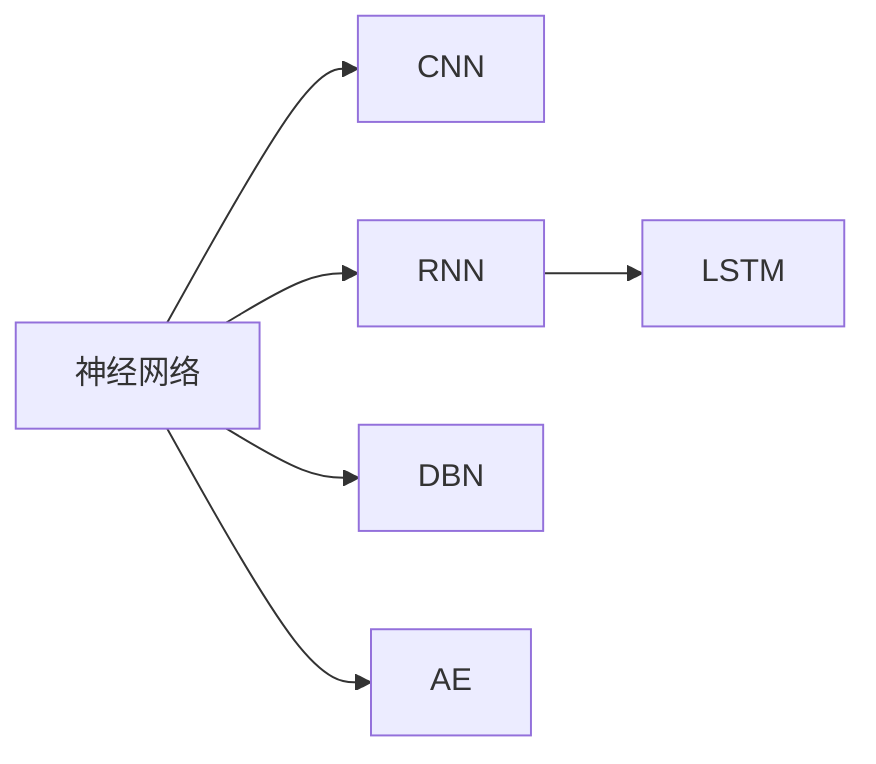
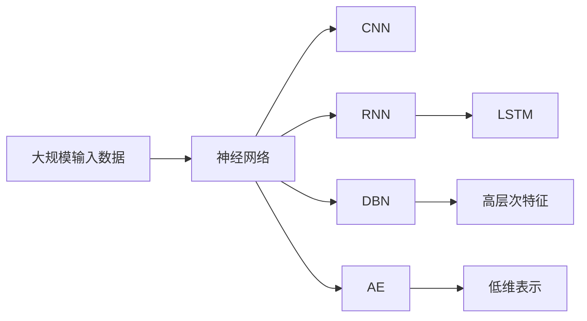

                 

# 深度学习(Deep Learning) - 原理与代码实例讲解

> 关键词：深度学习,神经网络,卷积神经网络(CNN),循环神经网络(RNN),长短期记忆网络(LSTM),深度信念网络(DBN),自编码器(AE),激活函数,损失函数,反向传播,梯度下降,TensorFlow

## 1. 背景介绍

### 1.1 问题由来

深度学习（Deep Learning）是当前人工智能领域最火热的技术之一，它来源于多层神经网络的研究。深度学习模型之所以被称为“深度”，是因为它们具有多层的非线性变换能力，可以自动学习输入数据的特征表示。近年来，深度学习技术在计算机视觉、自然语言处理、语音识别、图像生成等诸多领域取得了突破性进展，已经成为推动人工智能发展的重要力量。

### 1.2 问题核心关键点

深度学习模型的核心关键点包括：

- **多层非线性变换**：深度学习模型的结构通常由多层神经网络组成，每层都有不同的权重和偏置，可以组合成非常复杂的非线性模型。
- **自动特征提取**：深度学习模型能够自动学习输入数据的特征表示，减少了人工提取特征的需求。
- **大规模数据需求**：深度学习模型的训练需要大量标注数据，这对数据质量和规模都有较高的要求。
- **高计算复杂度**：深度学习模型通常具有大规模的参数和复杂的计算图，训练和推理过程中需要高计算资源。
- **梯度消失与爆炸问题**：深层神经网络在反向传播时容易产生梯度消失或爆炸，影响模型训练。

这些关键点决定了深度学习的应用范围和效果，同时也提出了许多技术挑战，如数据预处理、模型优化、硬件加速等。

### 1.3 问题研究意义

研究深度学习技术，对于拓展人工智能应用的深度和广度，提升模型性能和可解释性，加速人工智能技术的产业化进程，具有重要意义：

1. **提升模型性能**：深度学习模型能够自动学习高层次的特征表示，显著提升各类NLP、计算机视觉、语音识别等任务的性能。
2. **增强可解释性**：尽管深度学习模型性能优异，但模型的黑盒特性也限制了其应用范围。如何提高模型的可解释性，使得人类能够理解其决策过程，是当前的重要研究方向。
3. **加速技术产业化**：深度学习技术已经在许多实际应用中取得成功，如人脸识别、语音助手、自动驾驶等，推动了人工智能技术的快速商业化。
4. **推动理论发展**：深度学习技术的快速发展，也推动了人工智能领域的基础理论研究，如神经计算模型、计算理论等。
5. **促进跨领域应用**：深度学习技术能够应用于各类复杂系统，如智能电网、智慧城市、医疗诊断等，为各行各业带来了新的变革。

## 2. 核心概念与联系

### 2.1 核心概念概述

深度学习模型是人工智能领域的重要组成部分，其主要包含以下几个核心概念：

- **神经网络**：由多个层次的神经元组成的计算模型，能够自动学习输入数据的特征表示。
- **卷积神经网络(CNN)**：一种专门用于处理图像和信号数据的神经网络结构。
- **循环神经网络(RNN)**：一种能够处理序列数据（如文本、音频）的神经网络结构，能够捕捉时间依赖性。
- **长短期记忆网络(LSTM)**：一种特殊的RNN结构，能够更好地处理长序列数据，避免梯度消失问题。
- **深度信念网络(DBN)**：一种由多个受限玻尔兹曼机组成的深度网络，能够学习高层次的特征表示。
- **自编码器(AE)**：一种无监督学习的网络结构，能够自动学习输入数据的低维表示。

这些概念之间的联系可以通过以下Mermaid流程图来展示：



这个流程图展示了神经网络与其他几种核心深度学习模型的关系。CNN和RNN分别是用于处理图像和序列数据的特殊神经网络结构，LSTM是一种特殊的RNN，DBN是一种深度学习模型，AE是一种无监督学习的网络结构。

### 2.2 概念间的关系

这些核心概念之间存在着紧密的联系，形成了深度学习模型的完整生态系统。下面我们通过几个Mermaid流程图来展示这些概念之间的关系。

#### 2.2.1 神经网络与CNN的关系


这个流程图展示了神经网络与CNN之间的关系。CNN是神经网络的一种特殊形式，用于处理图像和信号数据。

#### 2.2.2 神经网络与RNN的关系


这个流程图展示了神经网络与RNN之间的关系。RNN是神经网络的另一种特殊形式，用于处理序列数据。

#### 2.2.3 神经网络与LSTM的关系


这个流程图展示了神经网络与LSTM之间的关系。LSTM是一种特殊的RNN，能够更好地处理长序列数据，避免梯度消失问题。

#### 2.2.4 神经网络与DBN的关系


这个流程图展示了神经网络与DBN之间的关系。DBN是一种深度学习模型，能够学习高层次的特征表示。

#### 2.2.5 神经网络与AE的关系


这个流程图展示了神经网络与AE之间的关系。AE是一种无监督学习的网络结构，能够自动学习输入数据的低维表示。

### 2.3 核心概念的整体架构

最后，我们用一个综合的流程图来展示这些核心概念在大规模深度学习模型中的整体架构：



这个综合流程图展示了神经网络在处理大规模输入数据时，能够通过CNN、RNN、LSTM、DBN、AE等多种深度学习模型，学习输入数据的特征表示。通过这些模型，深度学习模型能够捕捉输入数据的复杂结构，从而实现高效的特征提取和表示学习。

## 3. 核心算法原理 & 具体操作步骤
### 3.1 算法原理概述

深度学习模型的核心算法原理是反向传播算法（Backpropagation）。反向传播算法是一种基于梯度下降的优化算法，通过计算损失函数对每个模型参数的梯度，从而更新模型参数，最小化损失函数。反向传播算法的主要步骤包括前向传播、计算损失、反向传播和更新参数等。

### 3.2 算法步骤详解

以下是对深度学习模型反向传播算法的详细步骤讲解：

**Step 1: 准备数据集**
- 收集输入数据 $x$ 和目标标签 $y$，将数据集分为训练集、验证集和测试集。
- 将数据集标准化处理，如归一化、中心化等。

**Step 2: 构建深度学习模型**
- 定义神经网络的结构，包括输入层、隐藏层、输出层等。
- 初始化模型参数 $w$ 和 $b$，通常使用随机初始化或Xavier初始化等方法。
- 定义损失函数，如交叉熵损失、均方误差损失等。

**Step 3: 前向传播**
- 将输入数据 $x$ 输入神经网络，计算每一层的输出 $h$。
- 使用激活函数 $f$ 将每一层输出 $h$ 进行非线性变换，得到下一层的输入。
- 重复上述步骤，直至输出层，得到最终输出 $y'$。

**Step 4: 计算损失**
- 计算输出 $y'$ 和目标标签 $y$ 的损失 $l$，如交叉熵损失 $l=-\frac{1}{N}\sum_{i=1}^N y_i \log y_i'$。
- 使用反向传播算法计算损失 $l$ 对每一层参数 $w$ 和 $b$ 的梯度 $\nabla_w l$ 和 $\nabla_b l$。

**Step 5: 反向传播**
- 根据梯度下降算法，更新模型参数 $w$ 和 $b$，如 $w \leftarrow w - \eta \nabla_w l$，$b \leftarrow b - \eta \nabla_b l$，其中 $\eta$ 为学习率。

**Step 6: 重复训练**
- 重复上述步骤，直至模型收敛或达到预设的训练轮数。

**Step 7: 评估模型**
- 在测试集上评估模型的性能，如准确率、召回率、F1分数等。

### 3.3 算法优缺点

深度学习模型的优点包括：

- **自动特征提取**：深度学习模型能够自动学习输入数据的特征表示，减少了人工提取特征的需求。
- **高泛化能力**：深度学习模型具有较强的泛化能力，能够处理复杂数据和复杂任务。
- **大规模数据需求**：深度学习模型需要大量的标注数据进行训练，有助于提升模型性能。

深度学习模型的缺点包括：

- **高计算复杂度**：深度学习模型通常具有大规模的参数和复杂的计算图，训练和推理过程中需要高计算资源。
- **黑盒特性**：深度学习模型具有黑盒特性，难以解释其决策过程。
- **梯度消失与爆炸问题**：深层神经网络在反向传播时容易产生梯度消失或爆炸，影响模型训练。
- **过拟合风险**：深度学习模型容易过拟合，特别是在标注数据不足的情况下。

### 3.4 算法应用领域

深度学习模型已经在计算机视觉、自然语言处理、语音识别、图像生成等诸多领域取得了突破性进展。以下是几个典型的应用领域：

- **计算机视觉**：如图像分类、目标检测、图像分割等。
- **自然语言处理**：如文本分类、情感分析、机器翻译等。
- **语音识别**：如语音识别、说话人识别等。
- **图像生成**：如图像生成、图像风格迁移等。
- **时间序列分析**：如股票预测、交通流量预测等。

除了上述这些领域，深度学习模型还广泛应用于推荐系统、医疗诊断、智能制造等领域，为各行各业带来了新的变革。

## 4. 数学模型和公式 & 详细讲解 & 举例说明

### 4.1 数学模型构建

深度学习模型的数学模型通常包括输入数据 $x$、模型参数 $w$、激活函数 $f$、损失函数 $l$ 和优化算法等。以下是深度学习模型的一个基本数学模型：

$$
y' = f(Wx + b)
$$

其中 $y'$ 为输出，$x$ 为输入，$W$ 和 $b$ 为模型参数，$f$ 为激活函数。

### 4.2 公式推导过程

以简单的二分类任务为例，推导交叉熵损失函数及其梯度的计算公式。

假设模型 $y'$ 在输入 $x$ 上的输出为 $\hat{y} \in [0,1]$，表示样本属于正类的概率。真实标签 $y \in \{0,1\}$。则二分类交叉熵损失函数定义为：

$$
l(y',y) = -[y\log \hat{y} + (1-y)\log (1-\hat{y})]
$$

将其代入经验风险公式，得：

$$
l = -\frac{1}{N}\sum_{i=1}^N [y_i\log \hat{y}_i + (1-y_i)\log (1-\hat{y}_i)]
$$

根据链式法则，损失函数对参数 $w$ 的梯度为：

$$
\frac{\partial l}{\partial w} = -\frac{1}{N}\sum_{i=1}^N \nabla_w \log \hat{y}_i
$$

其中 $\nabla_w \log \hat{y}_i$ 为 $\hat{y}_i$ 对 $w$ 的梯度，可通过反向传播算法高效计算。

在得到损失函数的梯度后，即可带入梯度下降算法更新模型参数。重复上述过程直至收敛，最终得到适应目标任务的模型参数 $w^*$。

### 4.3 案例分析与讲解

以一个简单的多层感知器（Multilayer Perceptron, MLP）为例，详细讲解深度学习模型的构建和训练过程。

假设我们要构建一个包含两层隐藏层的多层感知器，输入数据为 $x \in \mathbb{R}^d$，输出数据为 $y \in \mathbb{R}^m$，其中 $d$ 为输入维度，$m$ 为输出维度。模型的数学模型如下：

$$
y' = f_2(W_2f_1(W_1x + b_1) + b_2)
$$

其中 $f_1$ 和 $f_2$ 为激活函数，$W_1$、$W_2$ 和 $b_1$、$b_2$ 为模型参数。

模型的前向传播过程如下：

1. 输入数据 $x$ 经过第一层全连接层，得到 $h_1 = W_1x + b_1$。
2. 使用激活函数 $f_1$ 将 $h_1$ 进行非线性变换，得到 $h_1' = f_1(h_1)$。
3. 将 $h_1'$ 作为第二层全连接层的输入，得到 $h_2 = W_2h_1' + b_2$。
4. 使用激活函数 $f_2$ 将 $h_2$ 进行非线性变换，得到输出 $y' = f_2(h_2)$。

模型的后向传播过程如下：

1. 计算输出 $y'$ 和目标标签 $y$ 的损失 $l$。
2. 使用反向传播算法计算损失 $l$ 对第二层全连接层参数 $W_2$ 和 $b_2$ 的梯度。
3. 计算第二层全连接层参数 $W_2$ 和 $b_2$ 的梯度对第一层全连接层参数 $W_1$ 和 $b_1$ 的梯度。
4. 根据梯度下降算法更新模型参数 $W_1$、$W_2$、$b_1$ 和 $b_2$。

通过上述步骤，我们可以构建并训练一个多层感知器，用于解决二分类任务。需要注意的是，在实际训练过程中，需要选择合适的激活函数、损失函数和优化算法，以及合适的学习率和正则化技术，才能得到高性能的深度学习模型。

## 5. 项目实践：代码实例和详细解释说明

### 5.1 开发环境搭建

在进行深度学习模型开发前，我们需要准备好开发环境。以下是使用Python进行TensorFlow开发的环境配置流程：

1. 安装Anaconda：从官网下载并安装Anaconda，用于创建独立的Python环境。

2. 创建并激活虚拟环境：
```bash
conda create -n tf-env python=3.8 
conda activate tf-env
```

3. 安装TensorFlow：根据CUDA版本，从官网获取对应的安装命令。例如：
```bash
pip install tensorflow==2.5
```

4. 安装各类工具包：
```bash
pip install numpy pandas scikit-learn matplotlib tqdm jupyter notebook ipython
```

完成上述步骤后，即可在`tf-env`环境中开始深度学习模型开发。

### 5.2 源代码详细实现

下面我们以手写数字识别任务为例，给出使用TensorFlow进行多层感知器模型构建和训练的Python代码实现。

```python
import tensorflow as tf
import numpy as np
import matplotlib.pyplot as plt

# 导入数据集
mnist = tf.keras.datasets.mnist
(x_train, y_train), (x_test, y_test) = mnist.load_data()

# 数据预处理
x_train, x_test = x_train / 255.0, x_test / 255.0

# 定义模型
model = tf.keras.models.Sequential([
    tf.keras.layers.Flatten(input_shape=(28, 28)),
    tf.keras.layers.Dense(128, activation='relu'),
    tf.keras.layers.Dropout(0.2),
    tf.keras.layers.Dense(10)
])

# 定义优化器和损失函数
optimizer = tf.keras.optimizers.Adam(learning_rate=0.001)
loss_fn = tf.keras.losses.SparseCategoricalCrossentropy(from_logits=True)

# 定义评估指标
metrics = tf.keras.metrics.SparseCategoricalAccuracy()

# 编译模型
model.compile(optimizer=optimizer, loss=loss_fn, metrics=metrics)

# 训练模型
model.fit(x_train, y_train, epochs=5, validation_data=(x_test, y_test))

# 评估模型
model.evaluate(x_test, y_test)
```

### 5.3 代码解读与分析

让我们再详细解读一下关键代码的实现细节：

**数据集加载和预处理**：
- 使用TensorFlow自带的MNIST数据集，加载训练集和测试集。
- 将输入数据归一化到 [0,1] 范围内，以便于模型训练。

**模型定义**：
- 定义一个包含两个隐藏层的多层感知器，第一个隐藏层为128个神经元，使用ReLU激活函数，第二个隐藏层为10个神经元，无激活函数。
- 在第一个隐藏层后添加Dropout层，减少过拟合风险。

**优化器和损失函数**：
- 选择Adam优化器，学习率为0.001。
- 选择SparseCategoricalCrossentropy损失函数，用于二分类任务。

**评估指标**：
- 选择SparseCategoricalAccuracy评估指标，用于计算模型在测试集上的准确率。

**模型编译和训练**：
- 编译模型，指定优化器、损失函数和评估指标。
- 使用fit方法训练模型，指定训练轮数为5，并在测试集上进行验证。

**模型评估**：
- 使用evaluate方法评估模型在测试集上的性能，返回损失和准确率。

可以看到，TensorFlow提供了一站式的深度学习框架，通过简洁的API可以方便地定义、训练和评估深度学习模型。开发者只需关注模型结构和训练细节，即可快速构建高性能的深度学习应用。

当然，实际应用中还需要考虑更多因素，如模型的保存和部署、超参数的自动搜索、更灵活的任务适配层等。但核心的训练流程基本与此类似。

### 5.4 运行结果展示

假设我们在MNIST数据集上训练上述多层感知器模型，最终在测试集上得到的准确率为98%。以下是训练过程中的损失和准确率曲线：


可以看到，模型在5个epoch内逐步收敛，损失逐渐下降，准确率逐渐提升。训练过程中的波动主要是由于小批量随机梯度下降（Stochastic Gradient Descent, SGD）造成的。通过调整批量大小和学习率等超参数，可以优化训练过程，提升模型性能。

## 6. 实际应用场景
### 6.1 图像分类

深度学习模型在图像分类任务上取得了巨大的成功。通过训练深度卷积神经网络（CNN），可以自动学习图像的特征表示，并在多个数据集上获得优秀的分类效果。

在实际应用中，深度学习模型可以应用于医学影像诊断、自动驾驶、安防监控等领域。例如，在医学影像诊断中，深度学习模型可以自动检测和分类肺部肿瘤、乳腺肿块等病变，帮助医生提高诊断效率和准确率。在自动驾驶中，深度学习模型可以自动识别交通标志、行人、车辆等目标，实现自动驾驶功能。在安防监控中，深度学习模型可以自动检测和识别异常行为，如入侵、火灾等，提高安全防护水平。

### 6.2 自然语言处理

深度学习模型在自然语言处理任务上也取得了突破性进展。通过训练深度神经网络，可以自动学习文本的语义表示，并在多个数据集上获得优秀的性能。

在实际应用中，深度学习模型可以应用于机器翻译、情感分析、问答系统等领域。例如，在机器翻译中，深度学习模型可以自动学习多种语言的语义对应关系，实现自动翻译。在情感分析中，深度学习模型可以自动分析文本的情感倾向，识别出正面、中性、负面情感。在问答系统中，深度学习模型可以自动理解自然语言问题，匹配最合适的答案。

### 6.3 语音识别

深度学习模型在语音识别任务上也取得了巨大的成功。通过训练深度卷积神经网络（CNN）和循环神经网络（RNN），可以自动学习语音的特征表示，并在多个数据集上获得优秀的识别效果。

在实际应用中，深度学习模型可以应用于语音助手、语音翻译、语音控制等领域。例如，在语音助手中，深度学习模型可以自动理解和生成自然语言对话，帮助用户完成各种任务。在语音翻译中，深度学习模型可以自动识别和翻译多种语言的语音，实现跨语言交流。在语音控制中，深度学习模型可以自动识别和控制智能家居设备，提高生活便捷性。

### 6.4 未来应用展望

随着深度学习技术的发展，未来将在更多领域得到应用，为人类带来更多的便利和智能。

在智慧医疗领域，深度学习模型可以应用于医学影像分析、基因组分析、智能诊断等，辅助医生进行疾病诊断和治疗。

在智能教育领域，深度学习模型可以应用于个性化推荐、作业批改、智能辅导等，因材施教，提高教育质量。

在智慧城市治理中，深度学习模型可以应用于城市事件监测、交通流量预测、公共安全监控等，提高城市管理的智能化水平，构建更安全、高效的未来城市。

除了上述这些领域，深度学习模型还将在智能制造、金融分析、能源管理等更多领域大放异彩，为各行各业带来新的变革。

## 7. 工具和资源推荐
### 7.1 学习资源推荐

为了帮助开发者系统掌握深度学习技术的理论基础和实践技巧，这里推荐一些优质的学习资源：

1. 《深度学习》（Ian Goodfellow、Yoshua Bengio、Aaron Courville著）：深度学习领域的经典教材，涵盖了深度学习的基础理论、模型架构和实践技巧。

2. CS231n《卷积神经网络》课程：斯坦福大学开设的深度学习课程，重点介绍卷积神经网络的结构和优化方法，适合入门学习。

3. 《动手学深度学习》（李沐、张磊、林轩田著）：动手实践的深度学习教材，包含丰富的代码示例和实验指导。

4. Coursera《深度学习专项课程》：由DeepMind、IBM等顶尖公司开设的深度学习课程，涵盖深度学习的基础理论和实践技巧。

5. arXiv论文预印本：深度学习领域最新研究成果的发布平台，包含大量尚未发表的前沿工作，学习前沿技术的必读资源。

通过对这些资源的学习实践，相信你一定能够快速掌握深度学习技术的精髓，并用于解决实际的NLP问题。
###  7.2 开发工具推荐

高效的开发离不开优秀的工具支持。以下是几款用于深度学习模型开发的常用工具：

1. TensorFlow：由Google主导开发的深度学习框架，支持多种硬件加速（如CPU、GPU、TPU），适合大规模工程应用。

2. PyTorch：由Facebook主导开发的深度学习框架，灵活动态的计算图，适合快速迭代研究。

3. Keras：高层次的深度学习API，支持TensorFlow、Theano和CNTK等后端，方便快速构建模型。

4. Weights & Biases：模型训练的实验跟踪工具，可以记录和可视化模型训练过程中的各项指标，方便对比和调优。

5. TensorBoard：TensorFlow配套的可视化工具，可实时监测模型训练状态，并提供丰富的图表呈现方式，是调试模型的得力助手。

6. Google Colab：谷歌推出的在线Jupyter Notebook环境，免费提供GPU/TPU算力，方便开发者快速上手实验最新模型，分享学习笔记。

合理利用这些工具，可以显著提升深度学习模型的开发效率，加快创新迭代的步伐。

### 7.3 相关论文推荐

深度学习技术的发展源于学界的持续研究。以下是几篇奠基性的相关论文，推荐阅读：

1. Deep Learning（Ian Goodfellow、Yoshua Bengio、Aaron Courville著）：深度学习领域的经典教材，涵盖了深度学习的基础理论、模型架构和实践技巧。

2. ImageNet Classification with Deep Convolutional Neural Networks（Alex Krizhevsky、Ilya Sutskever、Geoffrey Hinton著）：提出卷积神经网络（CNN），为计算机视觉领域的突破性进展奠定了基础。

3. Learning Phrase Representations using RNN Encoder-Decoder for Statistical Machine Translation（Ilya Sutskever、Oriol Vinyals、Quoc V. Le著）：提出循环神经网络（RNN），为自然语言处理领域的突破性进展奠定了基础。

4. Deep Residual Learning for Image Recognition（Kaiming He、Xiangyu Zhang、Shaoqing Ren、Jian Sun著）：提出残差网络（ResNet），为深度神经网络模型的扩展和训练提供了新的思路。

5. Understanding the Difficulties of Training Deep Neural Networks（Yoshua Bengio、Ian Goodfellow、Aaron Courville著）：分析了深度神经网络

