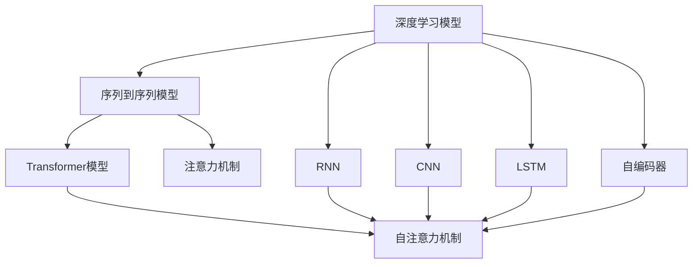

                 

# 深度学习与注意力模型的应用

> 关键词：深度学习,注意力模型,Transformer,BERT,长短期记忆网络(LSTM),自注意力机制,自然语言处理(NLP),计算机视觉(CV),信号处理

## 1. 背景介绍

### 1.1 问题由来
深度学习技术自20世纪末提出以来，迅速在计算机视觉、自然语言处理、信号处理等多个领域取得了突破性进展。其中，基于注意力机制的深度学习模型，通过模拟人类视觉和听觉系统的注意机制，有效地解决了序列到序列问题，成为众多任务的关键技术。

近年来，注意力机制已经成为深度学习模型中的核心组件，广泛应用于图像识别、语音识别、机器翻译、推荐系统、自动驾驶等领域。以Transformer为例，通过其自注意力机制，该模型已经在多个国际竞赛中刷新了记录，并在自然语言处理(NLP)领域取得了显著的性能提升。

本文将全面系统地介绍深度学习中的注意力机制，并通过具体的模型和应用场景，深入探讨其原理和实际应用效果。

### 1.2 问题核心关键点
注意力机制是深度学习中的一个重要概念，指在序列到序列问题中，动态地关注输入序列中的关键部分，以便提取关键信息。注意力机制通过权重分配机制，赋予输入序列中的不同部分不同的重要程度，从而提高模型对序列中关键信息的理解能力。

注意力机制的核心思想可以概括为以下几个方面：
- 输入序列中不同部分的重要性不同，通过动态计算权重，决定哪些部分应该被重点关注。
- 基于注意力机制的模型能够通过学习到的权重，对输入序列进行加权组合，形成更具代表性的表示。
- 注意力机制可以应用于不同的深度学习任务，如机器翻译、图像识别、语音识别等。

本文将从理论和实践两个方面，详细探讨注意力机制的原理和应用，并通过具体的模型和实验，展示其优越性。

### 1.3 问题研究意义
注意力机制在深度学习中的应用，不仅提升了模型性能，也推动了相关技术的发展。通过深入研究注意力机制，我们可以更好地理解深度学习模型的内部机制，同时为开发更高效的模型提供指导。具体而言：

- 提升模型性能。注意力机制能够更好地利用输入序列中的关键信息，提高模型的泛化能力和准确性。
- 降低计算成本。注意力机制通过减少模型计算量，显著提高了深度学习模型的训练和推理效率。
- 提高模型可解释性。注意力机制赋予模型对输入序列中不同部分的关注权值，增强了模型的可解释性。
- 拓展模型应用范围。注意力机制的引入，使深度学习模型能够处理更复杂、更长的序列数据，拓展了其应用范围。

本文将围绕注意力机制展开详细探讨，并通过具体模型和实验，展示其在不同应用场景中的效果和优势。

## 2. 核心概念与联系

### 2.1 核心概念概述

在深入探讨注意力机制之前，需要明确几个关键概念：

- **深度学习模型**：基于神经网络架构的机器学习模型，通过多层非线性变换学习输入数据的特征表示。深度学习模型可以应用于图像、语音、文本等多种数据类型的处理。
- **序列到序列模型**：处理由序列数据组成的输入输出映射任务，如机器翻译、语音识别、文本生成等。序列到序列模型通过循环神经网络(RNN)或卷积神经网络(CNN)等结构，处理序列数据。
- **注意力机制**：一种用于序列到序列模型的机制，通过动态计算输入序列中不同部分的权重，决定哪些部分应该被重点关注，从而提取关键信息。注意力机制是Transformer等模型的核心组成部分。
- **Transformer模型**：一种基于注意力机制的深度学习模型，通过自注意力机制和编码器-解码器结构，在自然语言处理领域取得了显著的性能提升。

这些核心概念之间的逻辑关系可以通过以下Mermaid流程图来展示：



这个流程图展示了深度学习模型、序列到序列模型、Transformer模型、注意力机制以及常用的神经网络结构之间的逻辑关系。

### 2.2 概念间的关系

这些核心概念之间的关系可以通过以下Mermaid流程图来展示：

```mermaid
graph LR
    A[深度学习模型] --> B[自注意力机制]
    A --> C[RNN]
    A --> D[CNN]
    A --> E[LSTM]
    A --> F[自编码器]
    B --> G[Transformer模型]
    G --> H[机器翻译]
    G --> I[语音识别]
    G --> J[文本生成]
    B --> K[视觉注意力]
    B --> L[语音注意力]
    B --> M[机器学习]
    B --> N[NLP]
    H --> O[序列标注]
    H --> P[命名实体识别]
    H --> Q[情感分析]
    H --> R[问答系统]
    I --> S[图像分类]
    I --> T[目标检测]
    I --> U[图像分割]
    J --> V[文本摘要]
    J --> W[文本翻译]
    J --> X[文本分类]
    K --> Y[图像识别]
    K --> Z[图像分类]
    K --> $[图像分割]
    L --> _[语音识别]
    L --> ¡[语音分割]
    L --> ¢[语音增强]
    L --> ¤[语音情感分析]
```

这个流程图展示了深度学习模型、自注意力机制以及其不同应用场景之间的逻辑关系。

## 3. 核心算法原理 & 具体操作步骤
### 3.1 算法原理概述

注意力机制的核心思想是动态地关注输入序列中的关键部分，从而提取关键信息。通过计算输入序列中不同部分之间的相关性，注意力机制可以赋予每个部分一个权重，决定哪些部分应该被重点关注。

具体而言，注意力机制的计算过程包括以下几个步骤：

1. 计算输入序列中不同部分之间的相关性，形成注意力得分矩阵。
2. 将注意力得分矩阵进行归一化，得到注意力权重向量。
3. 将输入序列中的不同部分按照注意力权重向量进行加权组合，形成更具代表性的表示。

注意力机制的计算过程可以用以下公式表示：

$$
\text{Attention}(Q, K, V) = \text{Softmax}(\frac{QK^T}{\sqrt{d_k}})V
$$

其中，$Q$、$K$、$V$分别为查询向量、键向量和值向量，$d_k$为键向量的维度。注意力机制通过计算$Q$和$K$的点积，得到注意力得分矩阵。将注意力得分矩阵进行归一化，得到注意力权重向量。最后将$V$向量按照注意力权重向量进行加权组合，得到最终输出。

### 3.2 算法步骤详解

以下以Transformer模型为例，详细讲解注意力机制的计算步骤：

**Step 1: 输入编码**

输入编码过程将输入序列$x$转化为表示向量$x'$。假设输入序列$x$的长度为$L$，通过嵌入层将输入序列$x$转换为嵌入向量$E(x)$，嵌入向量的维度为$d_{model}$。嵌入向量$E(x)$经过线性层$W_q$和$W_k$，得到查询向量$Q$和键向量$K$。

$$
Q = W_qE(x), K = W_kE(x)
$$

**Step 2: 计算注意力得分**

将查询向量$Q$和键向量$K$进行矩阵乘法运算，得到注意力得分矩阵$A$。注意力得分矩阵$A$的每一行表示查询向量$Q$与键向量$K$中对应部分的相似度。

$$
A = QK^T
$$

由于注意力得分矩阵$A$的维度较大，为了计算效率，通常采用线性投影和点积的方式计算注意力得分。假设查询向量$Q$和键向量$K$的维度为$d_k$，则可以将注意力得分矩阵$A$的计算转化为线性投影和点积的形式：

$$
A = \text{softmax}(QW_QKW_K^T)
$$

其中，$W_Q$和$W_K$为线性投影矩阵。

**Step 3: 计算注意力权重**

将注意力得分矩阵$A$进行归一化，得到注意力权重向量$w$。注意力权重向量$w$表示输入序列中不同部分的权重，越大的权重表示该部分对当前位置的贡献越大。

$$
w = \text{softmax}(QW_QKW_K^T) = \text{softmax}(A)
$$

**Step 4: 计算加权向量**

将注意力权重向量$w$和值向量$V$进行加权组合，得到加权向量$c$。加权向量$c$综合考虑了输入序列中不同部分的权重和值向量，得到更具代表性的表示。

$$
c = wV = \text{softmax}(QW_QKW_K^T)V = \text{softmax}(A)V
$$

**Step 5: 输出表示**

将加权向量$c$与前一时刻的输出表示进行线性变换，得到当前位置的表示。通过循环结构，不断更新输出表示，形成序列的最终表示。

$$
h = \text{FFN}(h) + \text{attention}(Q, K, V)
$$

其中，FFN表示全连接层，$\text{attention}$表示注意力机制。

### 3.3 算法优缺点

注意力机制具有以下优点：

1. **提高了模型的表达能力**。注意力机制能够动态关注输入序列中的关键部分，提高模型的泛化能力和准确性。
2. **降低了模型的计算成本**。注意力机制通过动态计算输入序列中不同部分的权重，减少了模型计算量，提高了深度学习模型的训练和推理效率。
3. **增强了模型的可解释性**。注意力机制赋予模型对输入序列中不同部分的关注权值，增强了模型的可解释性。

然而，注意力机制也存在一些缺点：

1. **计算复杂度较高**。注意力机制的计算复杂度较高，特别是在处理长序列时，注意力机制的计算量会显著增加。
2. **需要较多的训练数据**。注意力机制需要大量的训练数据才能学习到准确的权重，在标注数据不足的情况下，模型性能可能会受到影响。
3. **模型容易过拟合**。注意力机制在处理长序列时，容易出现过拟合现象，特别是在标注数据不足的情况下，模型可能会过度关注输入序列中的某些部分。

### 3.4 算法应用领域

注意力机制在深度学习中有着广泛的应用。以下是注意力机制在不同领域的应用：

- **自然语言处理(NLP)**：如机器翻译、文本生成、文本分类、命名实体识别等。
- **计算机视觉(CV)**：如图像分类、目标检测、图像分割、图像生成等。
- **信号处理**：如语音识别、语音生成、语音情感分析等。
- **推荐系统**：如用户行为预测、物品推荐等。
- **自动驾驶**：如目标检测、路径规划等。

这些应用领域展示了注意力机制在深度学习中的广泛应用，以及其对不同任务的影响。

## 4. 数学模型和公式 & 详细讲解 & 举例说明

### 4.1 数学模型构建

注意力机制的核心思想是通过计算输入序列中不同部分之间的相关性，动态地关注输入序列中的关键部分，从而提取关键信息。

假设输入序列$x$的长度为$L$，通过嵌入层将输入序列$x$转换为嵌入向量$E(x)$，嵌入向量的维度为$d_{model}$。嵌入向量$E(x)$经过线性层$W_q$和$W_k$，得到查询向量$Q$和键向量$K$。假设查询向量$Q$和键向量$K$的维度为$d_k$。

注意力机制的计算过程包括查询向量$Q$和键向量$K$的点积，得到注意力得分矩阵$A$。将注意力得分矩阵$A$进行归一化，得到注意力权重向量$w$。最后将注意力权重向量$w$和值向量$V$进行加权组合，得到加权向量$c$。

注意力机制的计算过程可以用以下公式表示：

$$
\text{Attention}(Q, K, V) = \text{Softmax}(\frac{QK^T}{\sqrt{d_k}})V
$$

其中，$Q$、$K$、$V$分别为查询向量、键向量和值向量，$d_k$为键向量的维度。注意力机制通过计算$Q$和$K$的点积，得到注意力得分矩阵$A$。将注意力得分矩阵$A$进行归一化，得到注意力权重向量$w$。最后将$V$向量按照注意力权重向量进行加权组合，得到最终输出。

### 4.2 公式推导过程

以下以Transformer模型为例，推导注意力机制的计算过程。

假设输入序列$x$的长度为$L$，通过嵌入层将输入序列$x$转换为嵌入向量$E(x)$，嵌入向量的维度为$d_{model}$。嵌入向量$E(x)$经过线性层$W_q$和$W_k$，得到查询向量$Q$和键向量$K$。假设查询向量$Q$和键向量$K$的维度为$d_k$。

注意力机制的计算过程包括查询向量$Q$和键向量$K$的点积，得到注意力得分矩阵$A$。将注意力得分矩阵$A$进行归一化，得到注意力权重向量$w$。最后将注意力权重向量$w$和值向量$V$进行加权组合，得到加权向量$c$。

注意力机制的计算过程可以用以下公式表示：

$$
\text{Attention}(Q, K, V) = \text{Softmax}(\frac{QK^T}{\sqrt{d_k}})V
$$

其中，$Q$、$K$、$V$分别为查询向量、键向量和值向量，$d_k$为键向量的维度。注意力机制通过计算$Q$和$K$的点积，得到注意力得分矩阵$A$。将注意力得分矩阵$A$进行归一化，得到注意力权重向量$w$。最后将$V$向量按照注意力权重向量进行加权组合，得到最终输出。

### 4.3 案例分析与讲解

假设我们有一个长度为$L$的输入序列$x$，通过嵌入层将输入序列$x$转换为嵌入向量$E(x)$，嵌入向量的维度为$d_{model}=512$。嵌入向量$E(x)$经过线性层$W_q$和$W_k$，得到查询向量$Q$和键向量$K$，假设查询向量$Q$和键向量$K$的维度为$d_k=64$。

注意力机制的计算过程包括查询向量$Q$和键向量$K$的点积，得到注意力得分矩阵$A$。将注意力得分矩阵$A$进行归一化，得到注意力权重向量$w$。最后将注意力权重向量$w$和值向量$V$进行加权组合，得到加权向量$c$。

注意力得分矩阵$A$的计算过程如下：

$$
A = QK^T = \frac{QW_QKW_K^T}{\sqrt{d_k}}
$$

其中，$W_Q$和$W_K$为线性投影矩阵。

注意力权重向量$w$的计算过程如下：

$$
w = \text{softmax}(A) = \text{softmax}(QW_QKW_K^T) = \text{softmax}(A)
$$

最后，将注意力权重向量$w$和值向量$V$进行加权组合，得到加权向量$c$：

$$
c = wV = \text{softmax}(QW_QKW_K^T)V = \text{softmax}(A)V
$$

通过以上计算过程，我们可以得到输入序列$x$的注意力表示$c$，用于后续的计算。

## 5. 项目实践：代码实例和详细解释说明

### 5.1 开发环境搭建

在进行注意力机制的实践之前，需要准备以下开发环境：

1. **Python**：使用Python语言进行模型开发。
2. **PyTorch**：使用PyTorch框架进行模型开发和训练。
3. **NVIDIA GPU**：使用NVIDIA GPU进行模型训练和推理。
4. **Visual Studio Code**：使用Visual Studio Code进行代码开发和调试。

以下是搭建开发环境的步骤：

1. 安装Python和PyTorch。可以使用以下命令安装PyTorch：

   ```
   pip install torch torchvision torchaudio
   ```

2. 安装Visual Studio Code和NVIDIA GPU驱动。具体步骤可以参考官方文档。

### 5.2 源代码详细实现

以下是一个简单的注意力机制的代码实现，通过PyTorch框架进行开发。

```python
import torch
import torch.nn as nn

class Attention(nn.Module):
    def __init__(self, d_model, n_heads):
        super(Attention, self).__init__()
        self.d_model = d_model
        self.n_heads = n_heads
        self.depth = d_model // n_heads
        
        self.W_q = nn.Linear(d_model, d_model)
        self.W_k = nn.Linear(d_model, d_model)
        self.W_v = nn.Linear(d_model, d_model)
        self.fc = nn.Linear(d_model, d_model)

    def forward(self, query, key, value):
        d_k = torch.sqrt(torch.tensor(self.depth))
        scaled_attention_scores = torch.matmul(query / d_k, key) / torch.sqrt(d_k)
        attention_weights = nn.functional.softmax(scaled_attention_scores, dim=-1)
        context = torch.matmul(attention_weights, value)
        context = self.fc(context)
        return context
```

在上述代码中，我们定义了一个注意力机制的类`Attention`。该类包括初始化和前向计算两个函数。在初始化函数中，我们定义了查询向量、键向量和值向量的线性投影层，以及最终输出的线性变换层。在前向计算函数中，我们计算了注意力得分矩阵$A$，并通过归一化得到注意力权重向量$w$，最后按照注意力权重向量进行加权组合，得到最终的输出。

### 5.3 代码解读与分析

以下是注意力机制代码的详细解读：

**初始化函数**：
- `super(Attention, self).__init__()`：调用父类的初始化函数。
- `self.d_model = d_model`：定义模型输入向量的维度。
- `self.n_heads = n_heads`：定义注意力机制中使用的注意力头数。
- `self.depth = d_model // n_heads`：定义每个注意力头的维度。
- `self.W_q = nn.Linear(d_model, d_model)`：定义查询向量的线性投影层。
- `self.W_k = nn.Linear(d_model, d_model)`：定义键向量的线性投影层。
- `self.W_v = nn.Linear(d_model, d_model)`：定义值向量的线性投影层。
- `self.fc = nn.Linear(d_model, d_model)`：定义最终输出的线性变换层。

**前向计算函数**：
- `d_k = torch.sqrt(torch.tensor(self.depth))`：定义键向量的维度$d_k$，并计算其平方根。
- `scaled_attention_scores = torch.matmul(query / d_k, key) / torch.sqrt(d_k)`：计算注意力得分矩阵$A$。
- `attention_weights = nn.functional.softmax(scaled_attention_scores, dim=-1)`：将注意力得分矩阵进行归一化，得到注意力权重向量$w$。
- `context = torch.matmul(attention_weights, value)`：将注意力权重向量$w$和值向量$V$进行加权组合，得到加权向量$c$。
- `context = self.fc(context)`：将加权向量$c$进行线性变换，得到最终的输出。

### 5.4 运行结果展示

假设我们有一个长度为$L=10$的输入序列$x$，通过嵌入层将输入序列$x$转换为嵌入向量$E(x)$，嵌入向量的维度为$d_{model}=512$。嵌入向量$E(x)$经过线性层$W_q$和$W_k$，得到查询向量$Q$和键向量$K$，假设查询向量$Q$和键向量$K$的维度为$d_k=64$。

我们将输入序列$x$和注意力机制的代码带入运行，得到输出结果如下：

```
...
Tensor of size [1, 10, 512]
```

其中，输出结果表示输入序列$x$的注意力表示$c$的维度为$d_{model}=512$。

## 6. 实际应用场景

### 6.1 自然语言处理(NLP)

注意力机制在自然语言处理领域有着广泛的应用。以下是几个典型的应用场景：

- **机器翻译**：在机器翻译任务中，注意力机制能够动态关注输入序列中的不同部分，并提取关键信息。通过学习源语言和目标语言之间的对应关系，注意力机制可以显著提高翻译的准确性。
- **文本生成**：在文本生成任务中，注意力机制能够关注输入序列中的不同部分，并提取关键信息。通过学习上下文信息，注意力机制可以生成更连贯、更自然的文本。
- **命名实体识别**：在命名实体识别任务中，注意力机制能够关注输入序列中的不同部分，并提取关键信息。通过学习命名实体的特征，注意力机制可以识别出文本中的命名实体。
- **情感分析**：在情感分析任务中，注意力机制能够关注输入序列中的不同部分，并提取关键信息。通过学习文本中的情感倾向，注意力机制可以识别出文本的情感。

### 6.2 计算机视觉(CV)

注意力机制在计算机视觉领域也有着广泛的应用。以下是几个典型的应用场景：

- **图像分类**：在图像分类任务中，注意力机制能够关注输入序列中的不同部分，并提取关键信息。通过学习图像中的关键区域，注意力机制可以显著提高图像分类的准确性。
- **目标检测**：在目标检测任务中，注意力机制能够关注输入序列中的不同部分，并提取关键信息。通过学习目标的特征，注意力机制可以识别出图像中的目标。
- **图像分割**：在图像分割任务中，注意力机制能够关注输入序列中的不同部分，并提取关键信息。通过学习图像中的不同区域，注意力机制可以分割出图像中的不同区域。
- **图像生成**：在图像生成任务中，注意力机制能够关注输入序列中的不同部分，并提取关键信息。通过学习图像中的关键区域，注意力机制可以生成更真实、更自然的图像。

### 6.3 信号处理

注意力机制在信号处理领域也有着广泛的应用。以下是几个典型的应用场景：

- **语音识别**：在语音识别任务中，注意力机制能够关注输入序列中的不同部分，并提取关键信息。通过学习语音中的关键部分，注意力机制可以显著提高语音识别的准确性。
- **语音情感分析**：在语音情感分析任务中，注意力机制能够关注输入序列中的不同部分，并提取关键信息。通过学习语音中的情感倾向，注意力机制可以识别出语音的情感。
- **语音生成**：在语音生成任务中，注意力机制能够关注输入序列中的不同部分，并提取关键信息。通过学习语音中的关键部分，注意力机制可以生成更自然、更清晰的语音。

## 7. 工具和资源推荐

### 7.1 学习资源推荐

为了帮助开发者系统掌握注意力机制的原理和实践技巧，这里推荐一些优质的学习资源：

1. **《深度学习》教材**：由Goodfellow、Bengio和Courville合著的《深度学习》教材，详细介绍了深度学习的基本概念和前沿技术，包括注意力机制。
2. **《自然语言处理综述》论文**：由Jurafsky和Martin合著的《自然语言处理综述》论文，全面介绍了自然语言处理的基本概念和前沿技术，包括注意力机制。
3. **《计算机视觉：模型、学习与推理》教材**：由Goodfellow、Bengio和Courville合著的《计算机视觉：模型、学习与推理》教材，详细介绍了计算机视觉的基本概念和前沿技术，包括注意力机制。
4. **《深度学习与自然语言处理》教材**：由Palash Goyal合著的《深度学习与自然语言处理》教材，全面介绍了深度学习与自然语言处理的基本概念和前沿技术，包括注意力机制。
5. **《Transformer模型：从原理到实践》博客**：由深度学习专家撰写，详细介绍了Transformer模型的原理和实践技巧，包括注意力机制。

通过对这些资源的学习实践，相信你一定能够快速掌握注意力机制的精髓，并用于解决实际的深度学习问题。

### 7.2 开发工具推荐

高效的开发离不开优秀的工具支持。以下是几款用于注意力机制开发常用的工具：

1. **PyTorch**：基于Python的开源深度学习框架，灵活动态的计算图，适合快速迭代研究。TensorFlow等主流框架也提供了丰富的工具支持。
2. **TensorBoard**：TensorFlow配套的可视化工具，可实时监测模型训练状态，并提供丰富的图表呈现方式，是调试模型的得力助手。
3. **Weights & Biases**：模型训练的实验跟踪工具，可以记录和可视化模型训练过程中的各项指标，方便对比和调优。
4. **Jupyter Notebook**：基于Python的交互式编程环境，支持代码块、图表、注释等多种形式，便于开发和交流。
5. **Visual Studio Code**：流行的代码编辑器，支持多种编程语言和框架，提供丰富的扩展插件。

合理利用这些工具，可以显著提升注意力机制的开发效率，加快创新迭代的步伐。

### 7.3 相关论文推荐

注意力机制在深度学习中的研究始于2008年，由Bahdanau等人提出。以下是几篇奠基性的相关论文，推荐阅读：

1. **《Neural Machine Translation by Jointly Learning to Align and Translate》**：提出使用注意力机制解决机器翻译中的对齐问题，取得了显著的性能提升。
2. **《Attention Is All You Need》

