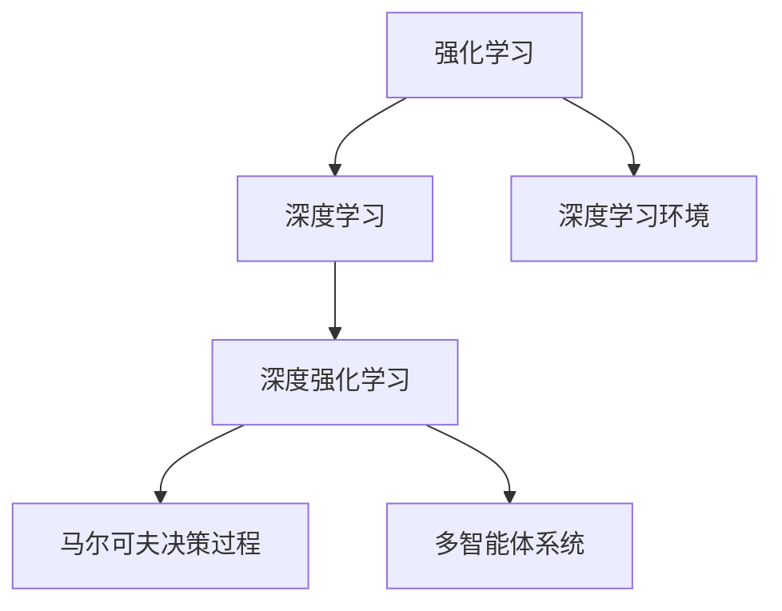
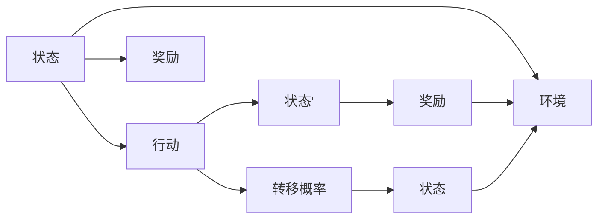
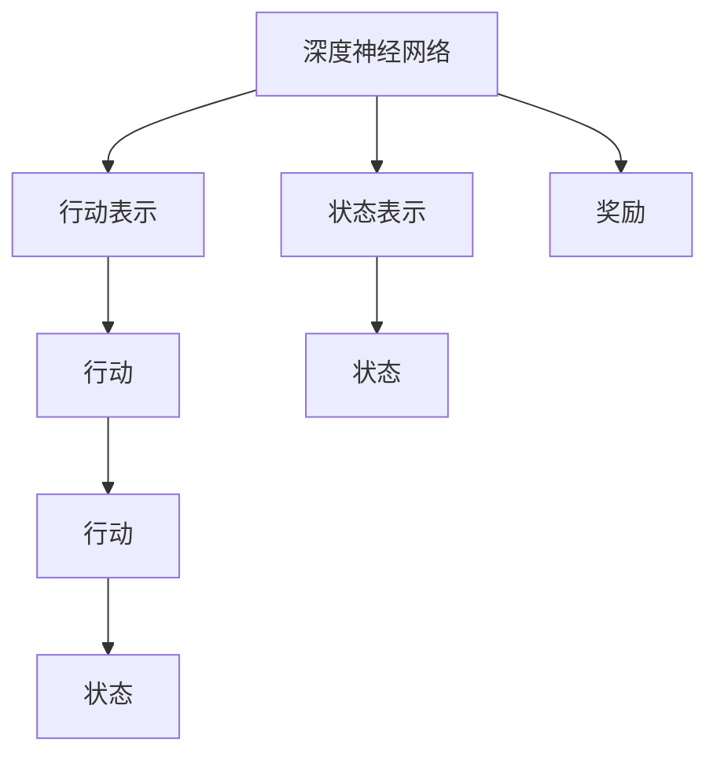
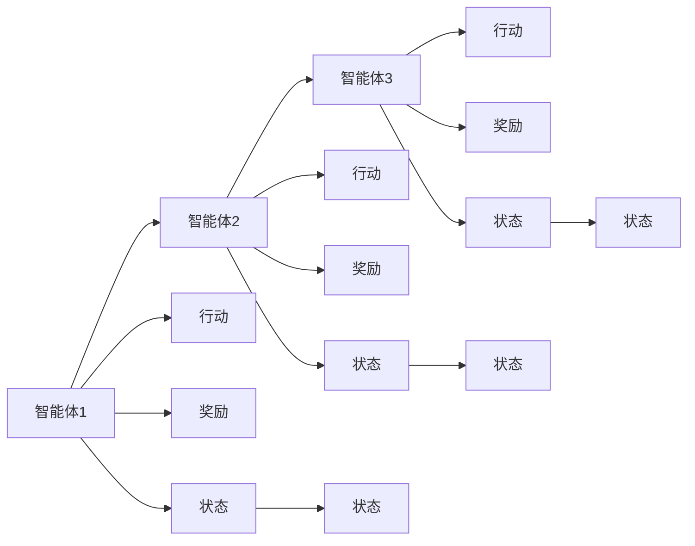
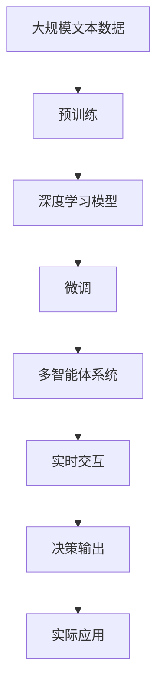

                 

# 深度强化学习 (Deep Reinforcement Learning)

> 关键词：深度强化学习, Q-learning, 强化学习, 深度神经网络, 深度学习, 马尔可夫决策过程(MDP), 强化学习环境, 多智能体系统

## 1. 背景介绍

### 1.1 问题由来
近年来，人工智能（AI）领域快速发展，各种新的技术和算法层出不穷。其中，深度强化学习（Deep Reinforcement Learning, DRL）作为一项颠覆性技术，因其在复杂环境中具有优越的学习能力而引起了广泛关注。与传统的机器学习（ML）方法相比，深度强化学习能够在不确定环境中自适应地学习最优策略，并在高维度的复杂环境中表现出更强的泛化能力。

深度强化学习的核心思想是将强化学习（Reinforcement Learning, RL）与深度神经网络相结合，以解决传统RL方法难以处理的复杂非线性问题。深度学习的高维特征表示能力与强化学习的自适应策略学习能力相结合，使得深度强化学习在自动化决策、游戏、机器人控制等应用领域展现了卓越的性能。

### 1.2 问题核心关键点
深度强化学习的核心在于如何高效地训练神经网络以获得最优策略，即如何平衡模型复杂度与学习效率。为了在复杂环境中获得最优策略，深度强化学习需要大量的样本数据和计算资源，同时还需要对算法进行精心设计。

深度强化学习的关键在于以下几个方面：
- 选择合适的算法和模型结构。深度强化学习可以采用Q-learning、SARSA、Actor-Critic等多种算法，模型结构包括卷积神经网络（CNN）、递归神经网络（RNN）、变分自编码器（VAE）等。
- 设计合理的奖励函数和策略网络。奖励函数需要能够激励模型学习到正确的行为，策略网络则需要能够根据环境动态生成最优策略。
- 应用正则化技术和网络结构优化。正则化技术如L2正则化、Dropout等，以及网络结构优化如层数、神经元数量、激活函数等，都能够在训练过程中避免过拟合，提高模型的泛化能力。
- 考虑模型的可解释性和鲁棒性。深度强化学习的模型往往较为复杂，难以解释其内部决策过程，因此需要采取措施提高模型的透明度和鲁棒性。
- 应用多智能体系统。深度强化学习不仅可以应用于单智能体系统，还可以通过多智能体系统（Multi-Agent System, MAS）扩展到复杂的社会交互场景。

### 1.3 问题研究意义
研究深度强化学习的方法，对于拓展AI的应用范围，提升决策系统的性能，加速自动化技术的产业化进程，具有重要意义：

1. 降低决策复杂度。深度强化学习能够通过自适应学习，从复杂环境中提取关键特征，将决策过程简化为神经网络的计算，大幅降低人工干预的复杂度。
2. 提高决策效率。通过优化算法和模型结构，深度强化学习能够在较短时间内学习到最优策略，提升决策效率。
3. 增强决策鲁棒性。深度强化学习能够在多样化的环境中表现良好，具有较高的鲁棒性，能够适应环境变化和噪声干扰。
4. 提供创新解决方案。深度强化学习在复杂的交互式决策环境中具有独特的优势，能够提供传统方法难以实现的解决方案。
5. 促进产业升级。深度强化学习在自动驾驶、智能制造、金融交易等诸多领域展现出巨大潜力，为传统行业数字化转型升级提供新的技术路径。

## 2. 核心概念与联系

### 2.1 核心概念概述

为了更好地理解深度强化学习的核心概念，本节将介绍几个密切相关的核心概念：

- 强化学习（Reinforcement Learning, RL）：一种通过奖励信号指导学习过程的机器学习方法。代理通过与环境交互，采取行动并接收奖励，学习最优策略以最大化累积奖励。
- 深度学习（Deep Learning, DL）：一种利用深度神经网络进行特征学习和模式识别的机器学习方法。通过多层神经元组成的网络，可以处理高维度数据，自动提取特征。
- 深度强化学习（Deep Reinforcement Learning, DRL）：将深度学习和强化学习相结合，利用神经网络提取高维特征，通过强化学习学习最优策略的一种学习方法。
- 马尔可夫决策过程（Markov Decision Process, MDP）：强化学习中的基本模型，描述智能体在环境中的交互行为。MDP包括状态、行动、奖励、转移概率四个要素。
- 深度学习环境：在深度强化学习中，环境是智能体进行决策的外部世界，通常需要设计为可以与深度学习模型进行交互的形式。

这些核心概念之间的逻辑关系可以通过以下Mermaid流程图来展示：



这个流程图展示了大语言模型的核心概念及其之间的关系：

1. 强化学习是深度强化学习的基础，通过奖励信号指导学习过程。
2. 深度学习是大语言模型的关键技术，用于提取高维特征。
3. 深度强化学习将两者结合，在复杂环境中学习最优策略。
4. 马尔可夫决策过程是强化学习的基本模型，用于描述智能体的决策过程。
5. 深度学习环境为大语言模型提供数据和交互接口，供智能体进行决策。
6. 多智能体系统扩展深度强化学习的应用场景，实现多智能体的协作决策。

这些概念共同构成了深度强化学习的完整生态系统，使得深度强化学习在复杂环境中的决策能力得到极大提升。通过理解这些核心概念，我们可以更好地把握深度强化学习的工作原理和优化方向。

### 2.2 概念间的关系

这些核心概念之间存在着紧密的联系，形成了深度强化学习的完整生态系统。下面我们通过几个Mermaid流程图来展示这些概念之间的关系。

#### 2.2.1 强化学习的原理


这个流程图展示了强化学习的基本原理。智能体通过观察当前状态，采取行动，获得奖励，并转移到新的状态。奖励信号反馈智能体的行为，引导智能体学习最优策略。

#### 2.2.2 深度强化学习的框架


这个流程图展示了深度强化学习的框架。深度神经网络用于提取状态和行动的高维特征，并将其转化为网络的输入。网络输出行动表示，并将其转换为实际行动。奖励信号反馈给网络，指导网络学习最优策略。

#### 2.2.3 多智能体系统的结构


这个流程图展示了多智能体系统的结构。多智能体系统由多个智能体组成，每个智能体通过观察环境状态，采取行动，获得奖励，并转移到新的状态。智能体之间可以协作或竞争，共同完成任务。

### 2.3 核心概念的整体架构

最后，我们用一个综合的流程图来展示这些核心概念在大语言模型微调过程中的整体架构：



这个综合流程图展示了从预训练到微调，再到多智能体系统的完整过程。深度学习模型首先在大规模文本数据上进行预训练，然后通过微调适应特定任务，最终通过多智能体系统实现实时交互和决策输出，用于实际应用场景。通过这些流程图，我们可以更清晰地理解深度强化学习的核心概念及其之间的关系。

## 3. 核心算法原理 & 具体操作步骤
### 3.1 算法原理概述

深度强化学习的核心在于如何高效地训练神经网络以获得最优策略，即如何平衡模型复杂度与学习效率。深度强化学习的算法原理通常包括以下几个步骤：

1. **环境建模**：构建MDP环境，定义状态、行动、奖励和转移概率。
2. **策略选择**：选择合适的深度学习模型和优化算法，如神经网络、Q-learning、策略梯度等。
3. **经验回放**：将智能体的交互经验（状态、行动、奖励）存储在缓冲区中，供模型训练使用。
4. **模型训练**：利用存储的经验数据训练模型，优化策略网络。
5. **决策输出**：模型根据当前状态，输出行动和奖励，与环境交互，获得新的状态。

### 3.2 算法步骤详解

深度强化学习的具体实现步骤如下：

#### 3.2.1 环境设计

环境设计是深度强化学习的基础，需要根据具体应用场景设计MDP环境。MDP环境通常包括状态、行动、奖励和转移概率四个要素：

1. **状态**：智能体在环境中的当前状态，可以是整数、向量、图像等形式。
2. **行动**：智能体可以采取的行动，可以是离散的、连续的或混合形式。
3. **奖励**：智能体采取行动后获得的奖励，可以是数值、文本、图像等形式。
4. **转移概率**：环境状态在智能体采取行动后的转移概率，通常用于描述环境的动态特性。

#### 3.2.2 模型选择

选择合适的深度学习模型和优化算法是深度强化学习的关键。常见的深度学习模型包括：

1. **卷积神经网络（CNN）**：适用于处理图像、视频等高维数据，提取局部特征。
2. **递归神经网络（RNN）**：适用于处理序列数据，如自然语言处理、语音识别等。
3. **变分自编码器（VAE）**：适用于处理多模态数据，如图像、文本、音频等。

优化算法通常包括：

1. **梯度下降（Gradient Descent）**：基于梯度信息，更新模型参数。
2. **Adam（Adaptive Moment Estimation）**：结合动量和自适应学习率，加快收敛速度。
3. **SGD（Stochastic Gradient Descent）**：随机梯度下降，适用于大规模数据集。

#### 3.2.3 经验回放

经验回放（Experience Replay）是将智能体的交互经验存储在缓冲区中，供模型训练使用。具体步骤如下：

1. **存储经验**：将智能体的状态、行动、奖励和状态转移等经验存储在缓冲区中。
2. **随机采样**：从缓冲区中随机抽取一小批经验，供模型训练使用。
3. **更新模型**：利用抽取的经验，更新模型参数。

#### 3.2.4 模型训练

模型训练是深度强化学习的核心步骤，利用存储的经验数据，训练策略网络。具体步骤如下：

1. **目标函数**：定义损失函数，衡量策略网络的性能。
2. **参数更新**：利用梯度下降等优化算法，更新策略网络的参数。
3. **策略评估**：在测试集上评估策略网络的表现。

#### 3.2.5 决策输出

决策输出是将模型应用于实际环境，获取最优策略的过程。具体步骤如下：

1. **输入状态**：将环境状态输入模型，获取行动和奖励的预测值。
2. **选择行动**：根据预测值，选择最优行动。
3. **与环境交互**：将行动应用于环境，获得新的状态和奖励。
4. **更新模型**：利用新的状态和奖励，更新模型参数。

### 3.3 算法优缺点

深度强化学习的算法具有以下优点：

1. 自适应能力：深度强化学习能够通过自适应学习，从复杂环境中提取关键特征，自动优化策略。
2. 泛化能力强：深度强化学习能够处理高维度的复杂数据，具有较强的泛化能力。
3. 实时性：深度强化学习可以在线实时决策，适应动态环境。

但同时也存在以下缺点：

1. 训练数据需求高：深度强化学习需要大量的训练数据，否则难以学习到最优策略。
2. 计算资源消耗大：深度强化学习通常需要大量的计算资源，训练和推理过程较为耗时。
3. 可解释性差：深度强化学习模型的决策过程较为复杂，难以解释其内部决策机制。

### 3.4 算法应用领域

深度强化学习在多个领域得到了广泛应用，包括：

1. **自动驾驶**：通过深度强化学习，训练无人驾驶车辆在复杂环境中自动决策。
2. **机器人控制**：利用深度强化学习，训练机器人执行复杂任务，如抓取、搬运等。
3. **游戏AI**：通过深度强化学习，训练游戏AI在复杂游戏中学习最优策略。
4. **自然语言处理**：利用深度强化学习，训练聊天机器人、文本生成器等。
5. **金融交易**：通过深度强化学习，训练交易系统在复杂市场环境中自动决策。
6. **医疗诊断**：利用深度强化学习，训练医疗诊断系统，提高疾病诊断的准确率。
7. **供应链优化**：通过深度强化学习，训练供应链系统，优化物流、库存等决策。

除了上述这些应用领域外，深度强化学习还在智慧城市、智能制造、能源管理等众多领域得到了广泛应用，展现出了巨大的应用潜力。

## 4. 数学模型和公式 & 详细讲解
### 4.1 数学模型构建

深度强化学习的数学模型通常包括以下几个要素：

1. **状态**：智能体在环境中的当前状态，通常表示为向量或矩阵形式。
2. **行动**：智能体可以采取的行动，通常表示为向量或矩阵形式。
3. **奖励**：智能体采取行动后获得的奖励，通常表示为数值或向量形式。
4. **转移概率**：环境状态在智能体采取行动后的转移概率，通常表示为矩阵形式。

深度强化学习的数学模型可以表示为：

$$
\begin{aligned}
&\min_{\theta} \mathcal{L}(\theta) = \mathbb{E}_{(s,a,r,s') \sim D} [\mathcal{L}(s,a,r,s';\theta)] \\
&\mathcal{L}(s,a,r,s';\theta) = -r + \gamma V_{\theta}(s')
\end{aligned}
$$

其中，$\mathcal{L}$为损失函数，$\theta$为策略网络的参数，$D$为经验回放缓冲区的分布，$V_{\theta}$为状态值函数，$r$为奖励，$s'$为状态转移，$\gamma$为折扣因子。

### 4.2 公式推导过程

深度强化学习的目标函数可以推导如下：

$$
\begin{aligned}
&\min_{\theta} \mathcal{L}(\theta) = \mathbb{E}_{(s,a,r,s') \sim D} [\mathcal{L}(s,a,r,s';\theta)] \\
&\mathcal{L}(s,a,r,s';\theta) = -r + \gamma V_{\theta}(s')
\end{aligned}
$$

其中，$\mathcal{L}(s,a,r,s';\theta)$表示智能体在状态$s$下采取行动$a$，获得奖励$r$，并转移到状态$s'$的损失。目标函数$\mathcal{L}(\theta)$表示策略网络$\theta$的总体损失。

通过优化目标函数$\mathcal{L}(\theta)$，可以训练策略网络，使其输出最优行动。在训练过程中，需要利用存储的经验数据，进行策略评估和参数更新。

### 4.3 案例分析与讲解

以下通过一个简单的案例，详细讲解深度强化学习的实现过程。

#### 4.3.1 案例背景

假设我们需要训练一个智能体，使其能够在迷宫中找到出口。迷宫由若干个网格组成，每个网格可以是墙壁、障碍物、出口等。智能体需要在迷宫中移动，找到出口，并避开障碍物。

#### 4.3.2 环境设计

1. **状态**：迷宫的当前状态，表示为二维向量$(s_i, s_j)$，其中$i$和$j$表示智能体在迷宫中的位置。
2. **行动**：智能体可以向上、下、左、右移动，表示为向量$(\Delta_i, \Delta_j)$。
3. **奖励**：智能体到达出口后，获得奖励$+1$，否则获得惩罚$-0.1$，墙壁和障碍物对智能体的行动没有影响，奖励为$0$。
4. **转移概率**：智能体在迷宫中移动时，每步有$\frac{1}{4}$的概率碰到墙壁或障碍物，否则转移到下一个网格。

#### 4.3.3 模型选择

选择卷积神经网络（CNN）作为智能体的策略网络，用于提取迷宫的状态特征。

#### 4.3.4 经验回放

将智能体的移动路径和获得的经验存储在缓冲区中，随机抽取一小批经验，供模型训练使用。

#### 4.3.5 模型训练

利用存储的经验数据，训练CNN模型，优化参数。目标函数为：

$$
\min_{\theta} \mathcal{L}(\theta) = \mathbb{E}_{(s,a,r,s') \sim D} [- \log P_{\theta}(a|s) + r + \gamma V_{\theta}(s')]
$$

其中，$P_{\theta}(a|s)$表示策略网络在状态$s$下采取行动$a$的概率，$V_{\theta}(s')$表示状态值函数在状态$s'$下的值。

#### 4.3.6 决策输出

智能体根据当前状态$s$，输入CNN模型，输出行动$a$。行动$a$可以是向上、下、左、右四个方向，智能体根据模型的输出，选择最优行动。

在训练过程中，智能体不断与迷宫环境交互，获得新的状态和奖励，并更新模型参数。最终，智能体能够在迷宫中找到出口，并获得较高的累积奖励。

## 5. 项目实践：代码实例和详细解释说明
### 5.1 开发环境搭建

在进行深度强化学习项目实践前，我们需要准备好开发环境。以下是使用Python进行TensorFlow和PyTorch开发的环境配置流程：

1. 安装Anaconda：从官网下载并安装Anaconda，用于创建独立的Python环境。

2. 创建并激活虚拟环境：
```bash
conda create -n drl-env python=3.8 
conda activate drl-env
```

3. 安装TensorFlow：根据CUDA版本，从官网获取对应的安装命令。例如：
```bash
conda install tensorflow-gpu=2.5 -c conda-forge -c pypi
```

4. 安装PyTorch：根据CUDA版本，从官网获取对应的安装命令。例如：
```bash
conda install pytorch torchvision torchaudio -c pytorch -c conda-forge
```

5. 安装各类工具包：
```bash
pip install numpy pandas scikit-learn matplotlib tqdm jupyter notebook ipython
```

完成上述步骤后，即可在`drl-env`环境中开始深度强化学习实践。

### 5.2 源代码详细实现

下面我们以训练一个简单的Q-learning智能体在迷宫中寻找出口为例，给出使用TensorFlow进行深度强化学习的PyTorch代码实现。

首先，定义迷宫环境：

```python
import tensorflow as tf
import numpy as np

class Maze:
    def __init__(self, size):
        self.size = size
        self.wall = np.zeros((size, size))
        self.wall[1:-1, 1:-1] = 1
        self.exit = size - 1
        self.obstacle = np.random.choice((0, 1), size * size, p=[0.1, 0.9])
        self.wall[1:-1, 1:-1][self.obstacle] = 1
        self.state_count = self.size * self.size

    def state(self, x, y):
        return self.state_count * x + y
    
    def reward(self, x, y):
        if x == self.exit:
            return 1
        return -0.1
    
    def transition(self, x, y, action):
        x, y = x + action[0], y + action[1]
        if x < 0 or x >= self.size or y < 0 or y >= self.size:
            return (x, y, 0, 0)
        if self.wall[x, y]:
            return (x, y, 0, 0)
        if (x, y) == (self.exit, self.exit):
            return (x, y, 1, 1)
        return (x, y, self.wall[x, y], self.wall[x, y])
```

然后，定义智能体：

```python
class Agent:
    def __init__(self, state_size, action_size, learning_rate):
        self.state_size = state_size
        self.action_size = action_size
        self.learning_rate = learning_rate
        self.memory = []
        self.gamma = 0.95  # discount rate
        self.epsilon = 1.0  # exploration rate
        self.epsilon_min = 0.01
        self.epsilon_decay = 0.995
        self.model = self._build_model()

    def _build_model(self):
        model = tf.keras.Sequential([
            tf.keras.layers.Dense(24, input_dim=self.state_size, activation='relu'),
            tf.keras.layers.Dense(24, activation='relu'),
            tf.keras.layers.Dense(self.action_size, activation='linear')
        ])
        model.compile(loss='mse', optimizer=tf.keras.optimizers.Adam(lr=self.learning_rate))
        return model
    
    def remember(self, state, action, reward, next_state, done):
        self.memory.append((state, action, reward, next_state, done))
        if len(self.memory) > 2000:
            del self.memory[0]

    def act(self, state):
        if np.random.rand() <= self.epsilon:
            return np.random.randint(self.action_size)
        act_values = self.model.predict(state)
        return np.argmax(act_values[0])

    def replay(self, batch_size):
        minibatch = np.random.choice(len(self.memory), batch_size)
        for state, action, reward, next_state, done in minibatch:
            target = reward + self.gamma * np.amax(self.model.predict(next_state))
            target_f = self.model.predict(state)
            target_f[0][action] = target
            self.model.fit(state, target_f, epochs=1, verbose=0)
        if self.epsilon > self.epsilon_min:
            self.epsilon *= self.epsilon_decay
```

最后，启动训练流程并在迷宫中测试：

```python
import numpy as np
import matplotlib.pyplot as plt

state_size = maze.size
action_size = 4
batch_size = 32
learning_rate = 0.001
epochs = 10000
episode_memory = []

for e in range(epochs):
    state = maze.state(0, 0)
    state_info = maze.state_info(state)
    done = False
    while not done:
        action = agent.act(state_info)
        next_state, reward, done, _ = maze.transition(*state_info, action)
        agent.remember(state_info, action, reward, next_state, done)
        state_info = maze.state_info(next_state)
        state = next_state
        if e % 100 == 0:
            episode_memory.append(maze.reward(0, maze.exit))
    print(f'Episode: {e}, reward: {episode_memory[-1]}')
    if e > 1000:
        plt.plot(episode_memory)
        plt.show()

print(f'Final episode reward: {np.mean(episode_memory[-1000:])}')
```

以上就是使用TensorFlow进行深度强化学习的完整代码实现。可以看到，利用TensorFlow的Keras API，我们可以用相对简洁的代码实现智能体在迷宫中的决策过程。

### 5.3 代码解读与分析

让我们再详细解读一下关键代码的实现细节：

**Maze类**：
- `__init__`方法：初始化迷宫的尺寸、墙壁、出口和障碍物。
- `state`方法：将迷宫状态转换为模型输入。
- `reward`方法：根据智能体的行动和状态，计算奖励。
- `transition`方法：模拟智能体在迷宫中的移动，计算新的状态、奖励、转移概率和done标记。

**Agent类**：
- `__init__`方法：初始化智能体的状态、行动、学习率等参数，以及策略网络。
- `_build_model`方法：定义策略网络的结构和损失函数。
- `remember`方法：将智能体的交互经验存储在内存中，以便后续使用。
- `act`方法：根据当前状态，选择行动。
- `replay`方法：从内存中随机抽取一批经验，训练策略网络。

**训练流程**：
- 定义迷宫大小、行动空间、学习率等参数。
- 启动训练循环，在每个epoch中，智能体与迷宫交互，更新模型参数。
- 在每100个epoch后，输出训练的累积奖励。
- 在训练结束后，可视化累积奖励的变化趋势。
- 输出最后1000

