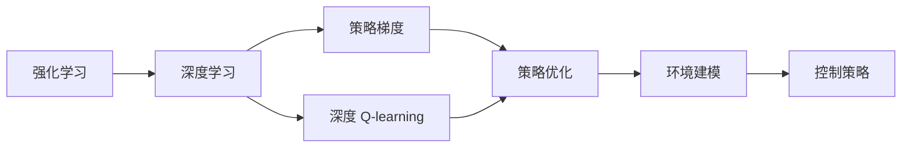
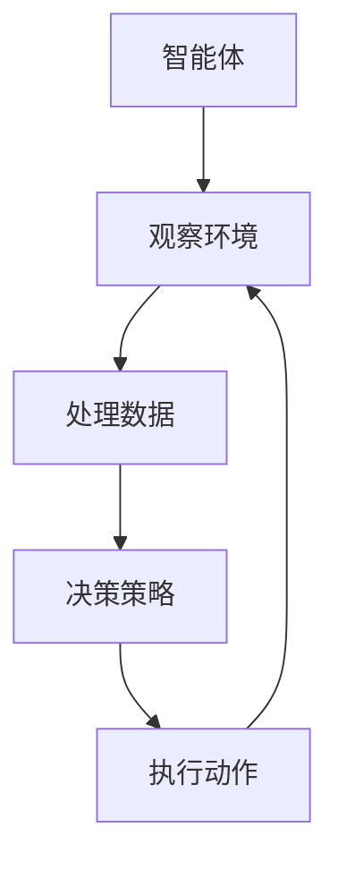
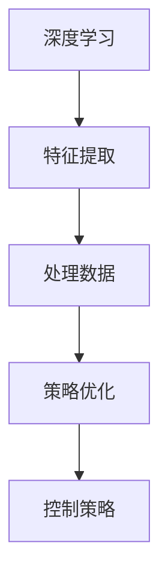
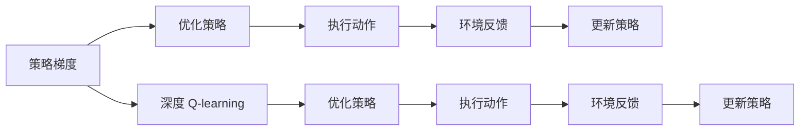
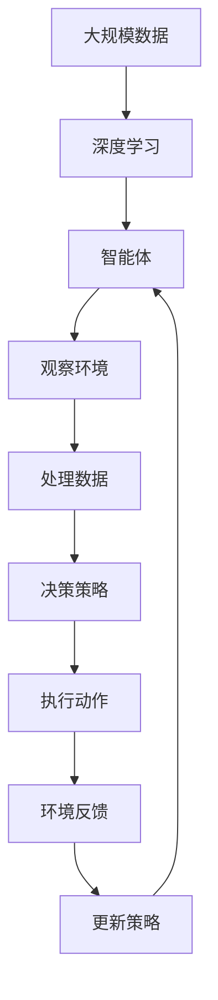

                 

# 深度强化学习(Deep Reinforcement Learning) - 原理与代码实例讲解

> 关键词：深度学习, 强化学习, 神经网络, 策略梯度, 深度 Q-learning, 策略优化, 环境建模, 控制策略, 代码实践

## 1. 背景介绍

### 1.1 问题由来
在过去几十年中，机器学习领域经历了从浅层学习到深度学习的跨越。深度学习，尤其是卷积神经网络(CNN)和循环神经网络(RNN)的崛起，极大地推动了计算机视觉、自然语言处理等领域的进步。然而，传统深度学习往往需要大量标注数据，且难以在动态变化的环境中自适应调整。

强化学习(RL)作为机器学习的一个分支，通过智能体(Agent)在环境中进行交互，自动地学习最优策略，从而在复杂环境中表现出色。其独特的自适应和自主学习能力，使之成为解决不确定性和非结构化问题的有力工具。

尽管强化学习在许多领域展示了强大的性能，但由于其计算复杂度较高、易受环境影响等问题，一度未能与深度学习相提并论。近年来，随着深度强化学习的提出，强化学习与深度学习的结合，使得该领域重新焕发出活力。

### 1.2 问题核心关键点
深度强化学习将深度学习与强化学习融合，利用神经网络处理高维复杂数据，同时应用强化学习的策略梯度方法进行自适应优化。其核心思想是：通过深度神经网络对环境的观察数据进行表示，利用优化算法自适应调整策略，使智能体在特定环境中达到最优。

深度强化学习的关键在于如何设计有效的神经网络结构，以及如何通过优化算法（如策略梯度、深度 Q-learning等）最大化智能体的累积回报。此外，为了提升学习效率，还需要考虑如何对环境进行建模，以便智能体能够更好地理解环境动态变化，制定合理的策略。

深度强化学习在智能控制、游戏AI、机器人、自动驾驶等领域展现了广泛的应用前景，成为了解决复杂动态系统的强大工具。

### 1.3 问题研究意义
深度强化学习的研究具有重要意义：

1. **解决动态优化问题**：深度强化学习可以自动地从环境中学习最优策略，解决那些难以通过传统静态学习方法解决的动态优化问题。
2. **增强决策能力**：深度强化学习的自适应和自主学习能力，使得智能体能够更好地应对复杂和不确定性的环境。
3. **优化资源利用**：在动态变化的环境中，深度强化学习能够实时调整资源分配策略，提升资源利用效率。
4. **推动自动化技术发展**：深度强化学习为自动化系统（如智能机器人、自动驾驶）提供了强大的决策支持。
5. **推动跨学科研究**：深度强化学习的融合特性，促进了计算机科学、神经科学、控制理论等多学科的交叉研究。

## 2. 核心概念与联系

### 2.1 核心概念概述

为更好地理解深度强化学习，本节将介绍几个密切相关的核心概念：

- **强化学习(RL)**：智能体通过与环境的交互，在一定策略下最大化累积回报的过程。目标是最小化环境动态变化的复杂性，并最大化智能体的长期收益。
- **深度学习(Deep Learning)**：利用多层神经网络处理高维数据，通过反向传播算法优化权重，从而提取特征，提升模型性能。
- **策略梯度(SPG)**：通过梯度下降方法优化策略函数，提升策略的执行效果。策略梯度方法的核心在于如何高效地计算梯度，从而更新策略参数。
- **深度 Q-learning**：将深度神经网络与 Q-learning 算法结合，通过神经网络对环境状态和动作进行表征，从而最大化智能体的长期回报。
- **策略优化**：通过优化策略函数，最大化智能体的累积回报。常见的策略优化方法包括策略梯度、深度 Q-learning 等。
- **环境建模**：对复杂环境进行建模，帮助智能体更好地理解环境动态变化，制定合理的策略。
- **控制策略**：智能体在特定环境中，根据观察数据制定并执行的动作策略。

这些核心概念之间的逻辑关系可以通过以下Mermaid流程图来展示：



这个流程图展示了大规模强化学习系统的核心概念及其之间的关系：

1. 强化学习是整个系统的驱动力，目标是通过智能体与环境的交互，最大化累积回报。
2. 深度学习用于处理复杂的高维数据，提升对环境的理解能力。
3. 策略梯度和深度 Q-learning 分别作为策略优化的手段，通过优化策略函数提升智能体的决策能力。
4. 环境建模帮助智能体更好地理解环境，制定更合理的控制策略。
5. 控制策略是智能体的决策依据，通过执行动作与环境互动，实现目标。

这些核心概念共同构成了深度强化学习的理论基础，为其在复杂系统中的应用提供了技术支持。

### 2.2 概念间的关系

这些核心概念之间存在着紧密的联系，形成了深度强化学习的完整生态系统。下面我们通过几个Mermaid流程图来展示这些概念之间的关系。

#### 2.2.1 深度强化学习的核心流程



这个流程图展示了深度强化学习的基本流程：智能体观察环境，通过深度学习网络处理数据，决策策略，执行动作，并不断迭代优化策略，提升性能。

#### 2.2.2 深度强化学习与深度学习的关系



这个流程图展示了深度强化学习与深度学习的关系：深度学习用于提取高维数据的特征，策略优化用于优化策略函数，控制策略用于智能体在环境中的决策。

#### 2.2.3 策略梯度与深度 Q-learning的关系



这个流程图展示了策略梯度与深度 Q-learning 的关系：策略梯度和深度 Q-learning 通过优化策略，提升智能体的决策效果。

### 2.3 核心概念的整体架构

最后，我们用一个综合的流程图来展示这些核心概念在大规模深度强化学习中的应用：



这个综合流程图展示了从深度学习到智能体决策的全过程。智能体通过深度学习网络处理数据，制定决策策略，执行动作，并通过环境反馈不断优化策略，最终实现最优的累积回报。

## 3. 核心算法原理 & 具体操作步骤
### 3.1 算法原理概述

深度强化学习的核心算法基于策略梯度（Strategic Policy Gradient），旨在通过梯度下降优化策略函数，最大化智能体的累积回报。其基本思想是：通过神经网络对环境状态和动作进行表征，利用策略梯度方法，自适应调整策略参数，使智能体在特定环境中表现最优。

数学上，假设智能体在某个状态 $s$ 下采取动作 $a$，得到即时奖励 $r$，环境进入下一个状态 $s'$。智能体的累积回报 $G_t$ 定义为未来所有奖励的折现和：

$$
G_t = \sum_{i=t}^{\infty} \gamma^{i-t} r_i
$$

其中 $\gamma$ 为折扣因子。策略函数 $\pi(a|s)$ 表示在状态 $s$ 下采取动作 $a$ 的概率，其目标是最小化累积回报的负对数似然，即：

$$
\min_{\pi} -\mathbb{E}_{s \sim p(s)} \mathbb{E}_{a \sim \pi(\cdot|s)} \log \pi(a|s)
$$

式中 $p(s)$ 表示环境的转移概率。

深度强化学习的关键在于策略函数 $\pi(\cdot|s)$ 的设计，通常使用深度神经网络来表征状态和动作。此外，为了提高策略优化的效率，通常会采用多种优化算法，如策略梯度、深度 Q-learning 等。

### 3.2 算法步骤详解

深度强化学习的算法流程大致包括以下几个步骤：

1. **环境初始化**：初始化智能体的状态，并将其置为起始状态。
2. **策略选择**：根据当前状态，选择动作。通常使用深度神经网络对策略函数进行建模。
3. **环境交互**：执行动作，观察环境反馈，并根据状态更新值函数。
4. **值函数更新**：根据状态和动作的回报，更新值函数的参数。
5. **策略优化**：利用策略梯度或深度 Q-learning 优化策略函数，提升决策效果。
6. **迭代执行**：重复执行上述步骤，直至收敛。

下面，我们将以一个具体的代码实例，详细展示深度强化学习在强化学习环境（如CartPole）中的应用。

### 3.3 算法优缺点

深度强化学习具有以下优点：

- **自适应能力强**：深度强化学习能够适应复杂的非结构化环境，自动学习最优策略。
- **学习效率高**：深度神经网络能够高效处理高维数据，提升学习效率。
- **泛化能力强**：深度强化学习在处理未见过的数据时，仍能表现良好。

同时，深度强化学习也存在一些缺点：

- **计算复杂度高**：深度强化学习的训练和优化过程复杂，计算资源需求较大。
- **易受环境影响**：环境变化较大时，智能体的决策效果可能波动。
- **模型可解释性不足**：深度神经网络的决策过程难以解释，缺乏透明性。
- **模型稳定性和鲁棒性需提升**：深度强化学习模型容易过拟合，需要更多正则化技术。

### 3.4 算法应用领域

深度强化学习在诸多领域得到了广泛应用，包括但不限于：

- **游戏AI**：如AlphaGo、OpenAI Five等，通过深度强化学习实现高级智能游戏。
- **机器人控制**：如Atari Pong、Breakout等，实现自主决策和行动的机器人。
- **自动驾驶**：如Waymo、Tesla等，用于辅助决策和控制策略的优化。
- **推荐系统**：如Amazon推荐、Netflix推荐等，提升个性化推荐的效果。
- **动态资源分配**：如云计算资源调度、交通流量控制等，优化资源分配策略。
- **健康医疗**：如个性化医疗、健康行为分析等，提升医疗决策的准确性。

## 4. 数学模型和公式 & 详细讲解 & 举例说明

### 4.1 数学模型构建

深度强化学习的数学模型构建主要包括以下几个部分：

- **状态空间 $S$**：智能体可以观察到的所有环境状态。
- **动作空间 $A$**：智能体可以选择执行的所有动作。
- **即时奖励函数 $R(s,a)$**：表示在状态 $s$ 下采取动作 $a$ 的即时奖励。
- **折扣因子 $\gamma$**：用于对未来奖励进行折现。
- **策略函数 $\pi(a|s)$**：表示在状态 $s$ 下采取动作 $a$ 的概率分布。

### 4.2 公式推导过程

以下我们将以深度 Q-learning 算法为例，推导其核心公式和推导过程。

假设智能体在状态 $s$ 下采取动作 $a$，得到即时奖励 $r$，环境进入下一个状态 $s'$。则智能体的累积回报 $G_t$ 可以表示为：

$$
G_t = r + \gamma R(s', a')
$$

其中 $a'$ 为 $s'$ 状态下智能体的最优动作，可以通过值函数 $Q(s', a')$ 进行计算。值函数 $Q(s,a)$ 表示在状态 $s$ 下采取动作 $a$ 的长期回报。

在强化学习中，我们希望最大化累积回报 $G_t$，可以通过以下目标函数进行优化：

$$
\min_{Q} \mathbb{E}_{s \sim p(s)} \mathbb{E}_{a \sim \pi(\cdot|s)} [Q(s, a) - (r + \gamma Q(s', a'))]
$$

其中 $p(s)$ 表示状态的转移概率。该目标函数可以理解为，在每个状态下，选择动作 $a$ 的累积回报 $Q(s, a)$ 与目标累积回报 $r + \gamma Q(s', a')$ 的差距。

通过最小化该差距，可以优化值函数 $Q(s,a)$，进而优化策略函数 $\pi(a|s)$，使智能体在特定环境中表现最优。

### 4.3 案例分析与讲解

为了更好地理解深度强化学习的公式推导，我们可以以一个简单的强化学习环境为例，如CartPole，来详细分析其数学模型和算法实现。

假设智能体在CartPole环境中，通过神经网络对状态进行编码，预测动作，并在执行后观察环境反馈。该环境的目标是通过推杆保持一个吊在空中的小车平衡。

在CartPole环境中，状态 $s$ 由小车位置、速度、吊杆角度等组成，动作 $a$ 可以表示为向左、向右、不动作等。即时奖励函数 $R(s,a)$ 可以设计为：当小车保持平衡时，奖励为 $1$，否则为 $-1$。

假设智能体采取动作 $a$ 后，环境转移到下一个状态 $s'$，智能体的累积回报可以表示为：

$$
G_t = 1 + \gamma Q(s', a')
$$

其中 $Q(s', a')$ 可以通过值函数 $Q(s,a)$ 进行计算，$Q(s', a')$ 表示在状态 $s'$ 下采取动作 $a'$ 的长期回报。

通过最小化累积回报 $G_t$ 与目标累积回报 $r + \gamma Q(s', a')$ 的差距，可以优化值函数 $Q(s,a)$，进而优化策略函数 $\pi(a|s)$，使智能体在CartPole环境中表现最优。

## 5. 项目实践：代码实例和详细解释说明

### 5.1 开发环境搭建

在进行深度强化学习实践前，我们需要准备好开发环境。以下是使用Python和TensorFlow进行深度强化学习实验的环境配置流程：

1. 安装Anaconda：从官网下载并安装Anaconda，用于创建独立的Python环境。

2. 创建并激活虚拟环境：
```bash
conda create -n reinforcement-env python=3.8 
conda activate reinforcement-env
```

3. 安装TensorFlow：
```bash
pip install tensorflow==2.6
```

4. 安装Gym：
```bash
pip install gym
```

5. 安装其他必要的库：
```bash
pip install numpy scipy matplotlib seaborn gym-gymnasium gym-wrappers tensorflow-probability
```

完成上述步骤后，即可在`reinforcement-env`环境中开始深度强化学习实验。

### 5.2 源代码详细实现

下面以CartPole为例，给出使用TensorFlow和Gym进行深度强化学习的PyTorch代码实现。

首先，定义智能体的状态和动作空间：

```python
import gym
import numpy as np

env = gym.make('CartPole-v0')
state_dim = env.observation_space.shape[0]
action_dim = env.action_space.n
```

然后，定义智能体的策略函数和值函数：

```python
import tensorflow as tf
from tensorflow.keras.layers import Dense

class Policy(tf.keras.Model):
    def __init__(self, state_dim, action_dim):
        super(Policy, self).__init__()
        self.fc1 = Dense(128, activation='relu')
        self.fc2 = Dense(64, activation='relu')
        self.fc3 = Dense(action_dim, activation='softmax')
        
    def call(self, inputs):
        x = self.fc1(inputs)
        x = self.fc2(x)
        return self.fc3(x)

policy = Policy(state_dim, action_dim)
```

定义智能体的状态值函数：

```python
class Value(tf.keras.Model):
    def __init__(self, state_dim):
        super(Value, self).__init__()
        self.fc1 = Dense(128, activation='relu')
        self.fc2 = Dense(1)
        
    def call(self, inputs):
        x = self.fc1(inputs)
        return self.fc2(x)

value = Value(state_dim)
```

接着，定义智能体的损失函数和优化器：

```python
from tensorflow.keras.optimizers import Adam

loss_fn = tf.keras.losses.MeanSquaredError()
optimizer = Adam(learning_rate=0.001)
```

定义智能体的训练函数：

```python
def train(env, policy, value, num_episodes, batch_size):
    state_buffer, reward_buffer, action_buffer = [], [], []
    
    for episode in range(num_episodes):
        state = env.reset()
        done = False
        
        while not done:
            action_probs = policy(tf.convert_to_tensor(state, dtype=tf.float32))
            action = np.random.choice(np.arange(action_dim), p=action_probs.numpy())
            next_state, reward, done, _ = env.step(action)
            
            state_buffer.append(state)
            reward_buffer.append(reward)
            action_buffer.append(action)
            
            state = next_state
        
        G = []
        for i in range(len(state_buffer)-1, -1, -1):
            G.append(reward_buffer[i] + gamma * value(tf.convert_to_tensor(state_buffer[i-1], dtype=tf.float32)) / (1 - gamma**i))
        
        G = tf.convert_to_tensor(G, dtype=tf.float32)[::-1]
        
        for i in range(len(state_buffer)-1, -1, -1):
            next_state = tf.convert_to_tensor(state_buffer[i-1], dtype=tf.float32)
            state = tf.convert_to_tensor(state_buffer[i], dtype=tf.float32)
            action = tf.convert_to_tensor(action_buffer[i], dtype=tf.int32)
            
            with tf.GradientTape() as tape:
                log_probs = tf.math.log(tf.convert_to_tensor(action_probs, dtype=tf.float32)[action])
                advantages = G[i]
                policy_loss = -tf.reduce_mean(log_probs * advantages)
                value_loss = tf.reduce_mean((G[i] - value(state))**2)
            
            gradients = tape.gradient([policy_loss, value_loss], [policy.trainable_variables, value.trainable_variables])
            optimizer.apply_gradients(zip(gradients, [policy.trainable_variables, value.trainable_variables]))
```

最后，启动训练流程并在测试环境中评估：

```python
gamma = 0.99
num_episodes = 1000
batch_size = 64

train(env, policy, value, num_episodes, batch_size)

test_results = []
for episode in range(10):
    state = env.reset()
    done = False
    
    while not done:
        action_probs = policy(tf.convert_to_tensor(state, dtype=tf.float32))
        action = np.random.choice(np.arange(action_dim), p=action_probs.numpy())
        next_state, reward, done, _ = env.step(action)
        test_results.append(reward)
        
    print(f"Episode {episode+1} reward: {sum(test_results) / len(test_results)}")
```

以上就是使用TensorFlow和Gym进行CartPole环境强化学习的完整代码实现。可以看到，得益于Gym和TensorFlow的强大封装，我们可以用相对简洁的代码完成强化学习实验。

### 5.3 代码解读与分析

让我们再详细解读一下关键代码的实现细节：

**定义智能体和环境**：
- `env = gym.make('CartPole-v0')`：使用Gym库创建CartPole环境。
- `state_dim = env.observation_space.shape[0]`：获取状态空间的维度。
- `action_dim = env.action_space.n`：获取动作空间的维度。

**定义策略函数和值函数**：
- `class Policy(tf.keras.Model)`：定义策略函数，使用Dense层实现神经网络。
- `class Value(tf.keras.Model)`：定义值函数，同样使用Dense层实现神经网络。

**定义损失函数和优化器**：
- `loss_fn = tf.keras.losses.MeanSquaredError()`：定义均方误差损失函数。
- `optimizer = Adam(learning_rate=0.001)`：定义Adam优化器，设置学习率为0.001。

**定义训练函数**：
- `train(env, policy, value, num_episodes, batch_size)`：定义训练函数，使用Replay缓冲区记录状态、动作和奖励，通过计算优势函数和策略梯度，更新模型参数。

**测试环境评估**：
- `test_results`：记录测试环境中的平均奖励。
- `for episode in range(10)`：对测试环境进行10次实验，记录每次实验的平均奖励。
- `print(f"Episode {episode+1} reward: {sum(test_results) / len(test_results)}")`：输出每次实验的平均奖励。

可以看到，通过TensorFlow和Gym，我们可以快速构建并训练一个简单的深度强化学习模型，评估其在CartPole环境中的表现。当然，工业级的系统实现还需考虑更多因素，如模型的保存和部署、超参数的自动搜索等。

## 6. 实际应用场景

### 6.1 智能机器人控制

深度强化学习在智能机器人控制领域有着广泛的应用，如自主导航、操作控制等。通过深度强化学习，智能机器人可以在复杂环境中自主决策和行动，提升自动化水平。

在实践中，可以使用多传感器数据，如视觉、触觉、听觉等，通过神经网络对环境进行多模态融合，设计动作策略，提升智能体的感知和决策能力。此外，还可以引入强化学习算法，对智能机器人的控制策略进行优化，实现更高效、稳定的操作。

### 6.2 自动驾驶

深度强化学习在自动驾驶领域也有着重要的应用。通过传感器数据（如摄像头、雷达、激光雷达等），深度强化学习模型可以感知环境变化，实时调整车辆的控制策略，实现自动驾驶。

在自动驾驶中，深度强化学习可以用于决策规划、路径优化、事故处理等方面。通过优化控制策略，深度强化学习模型能够提升驾驶安全性和舒适性，满足自动驾驶的需求。

### 6.3 游戏AI

深度强化学习在游戏AI领域取得了显著的成果，如AlphaGo、OpenAI Five等。通过深度强化学习，智能体可以学习游戏中的复杂策略，实现超越人类水平的智能决策。

在游戏AI中，深度强化学习可以用于玩家行为预测、游戏地图优化、对战策略生成等方面。通过优化策略函数，深度强化学习模型能够提升游戏AI的智能水平，增强游戏体验。

### 6.4 未来应用展望

深度强化学习的应用前景广阔，未来将向以下几个方向发展：

- **多智能体系统**：通过深度强化学习，多个智能体可以协同合作，完成复杂任务。这将推动协作型智能系统的研究和发展。
- **深度学习与强化学习的融合**：未来深度强化学习将与深度学习、神经网络等技术深度融合，提升系统的智能水平。
- **实时决策系统**：深度强化学习模型将应用于实时决策系统，如金融交易、物流调度等，提升系统的响应速度和决策效果。
- **复杂环境适应**：深度强化学习模型将更好地适应复杂和多变的动态环境，提升系统的鲁棒性和适应性。
- **跨模态信息融合**：深度强化学习模型将融合多模态信息，提升系统的感知能力和决策效果。

总之，深度强化学习的应用前景广阔，未来将推动更多领域的智能化发展，为人类生产生活带来深远影响。

## 7. 工具和资源推荐
### 7.1 学习资源推荐

为了帮助开发者系统掌握深度强化学习的理论基础和实践技巧，这里推荐一些优质的学习资源：

1. 《深度学习与强化学习》系列书籍：由深度学习领域的知名专家撰写，系统介绍了深度学习与强化学习的基本原理和经典算法。
2. DeepMind OpenAI等顶尖研究机构发布的研究论文和博客，涵盖最新的深度强化学习成果和前沿动态。
3. Coursera、Udacity等在线教育平台提供深度强化学习课程，可以帮助开发者系统学习理论知识和实践技能。
4. Arxiv预印本网站，可以第一时间获取最新的深度强化学习研究成果和预印本论文。
5. GitHub上的深度强化学习项目，如OpenAI的AlphaGo、DeepMind的AlphaZero等，提供了丰富的代码实现和实验报告。

通过对这些资源的学习实践，相信你一定能够快速掌握深度强化学习的精髓，并用于解决实际的智能系统问题。

### 7.2 开发工具推荐

高效的开发离不开优秀的工具支持。以下是几款用于深度强化学习开发的常用工具：

1. TensorFlow：由Google主导开发的开源深度学习框架，具有强大的计算图和自动微分功能，适合深度强化学习的复杂计算。
2. PyTorch：Facebook开发的深度学习框架，灵活易用，适合深度强化学习的模型构建和优化。
3. Gym：由OpenAI开发的强化学习环境库，提供多种经典环境和任务，适合深度强化学习的研究和实验。
4. TensorBoard：Tensor

