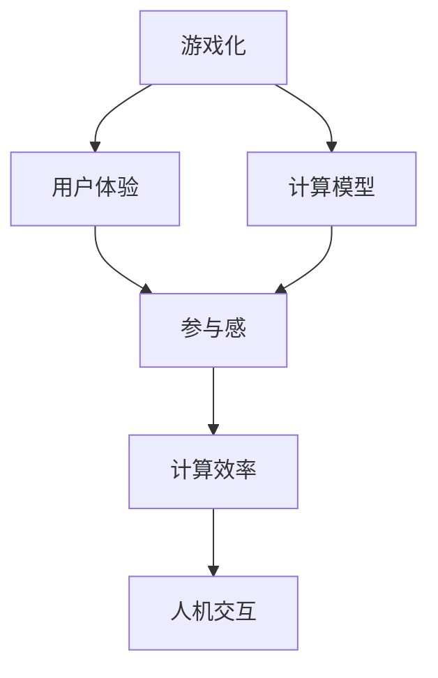
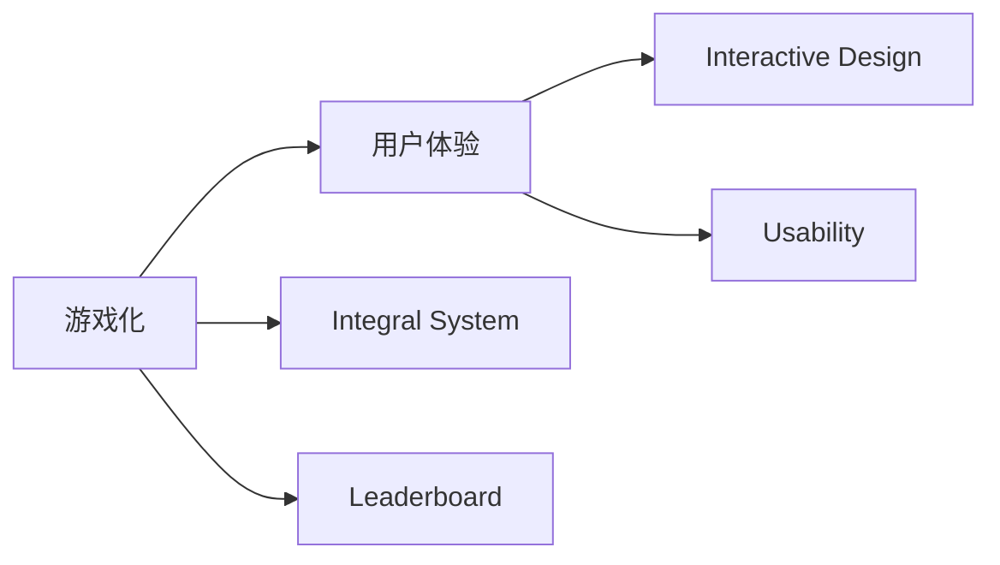
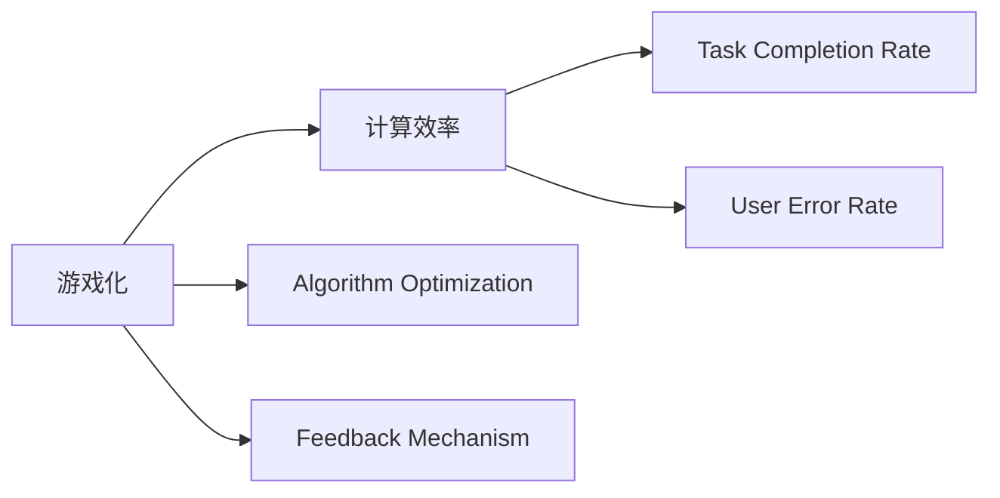
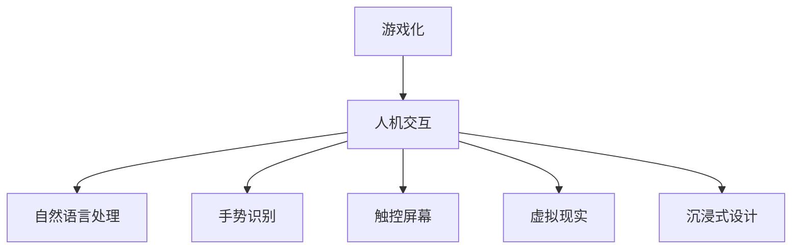
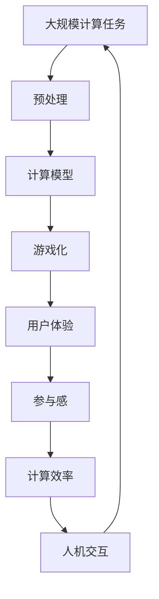

                 

# 游戏化体验：让参与人类计算乐在其中

> 关键词：游戏化, 用户体验, 人工智能, 计算模型, 参与感, 计算任务, 计算效率, 计算机科学, 人机交互

## 1. 背景介绍

### 1.1 问题由来
随着计算机科学的发展，计算机计算能力已达到惊人的水平。然而，对于许多人来说，使用计算机进行计算仍是一种枯燥且单调的活动。为了提升计算体验，游戏化（Gamification）的概念被引入到计算机计算领域，旨在通过增加游戏元素，如积分、奖励、竞赛等，让人们在使用计算机进行计算时感到有趣和满足。游戏化不仅提升了用户对计算任务的参与感，还能有效提高计算效率和准确性。

### 1.2 问题核心关键点
游戏化体验的核心关键点包括：

- 提高参与感：通过增加趣味性元素，如奖励系统、竞赛等，提升用户对计算任务的兴趣和投入。
- 提升计算效率：通过优化算法和用户体验设计，减少用户操作时间，提高计算速度。
- 增强用户体验：通过互动和沉浸式设计，使用户在使用计算机进行计算时感到愉悦和充实。

### 1.3 问题研究意义
游戏化体验在游戏、教育、健康等多个领域已显示出显著的效果。将其引入计算任务中，不仅可以提升用户的参与度和满意度，还能提高计算效率和质量。因此，探索如何通过游戏化方式提升计算体验具有重要的理论和实际意义。

## 2. 核心概念与联系

### 2.1 核心概念概述

为更好地理解游戏化体验在计算机计算中的应用，本节将介绍几个核心概念：

- 游戏化（Gamification）：通过增加游戏元素，如积分、徽章、排行榜等，提升用户对任务的参与感和兴趣。
- 用户体验（User Experience, UX）：用户在使用产品或服务时的感受和体验，包括界面设计、互动性、易用性等。
- 计算模型（Computational Model）：用于描述计算任务及其解决方案的数学模型。
- 参与感（Engagement）：用户对任务的投入和关注程度。
- 计算效率（Computational Efficiency）：计算任务所需的时间和资源。
- 人机交互（Human-Computer Interaction, HCI）：用户与计算机之间的交互方式和设计。

这些核心概念之间的逻辑关系可以通过以下Mermaid流程图来展示：



这个流程图展示了几者之间的关系：

1. 游戏化通过增加趣味性元素，提升用户体验。
2. 用户体验又影响了用户的参与感，从而影响计算效率。
3. 计算模型决定了计算任务的解决方案。
4. 参与感和计算效率共同影响人机交互的设计。

### 2.2 概念间的关系

这些核心概念之间存在着紧密的联系，形成了游戏化体验在计算任务中的完整生态系统。下面我们通过几个Mermaid流程图来展示这些概念之间的关系。

#### 2.2.1 游戏化与用户体验



这个流程图展示了大游戏化元素如何提升用户体验：

1. 游戏化通过积分系统和排行榜等增加趣味性，提升用户对任务的兴趣。
2. 用户体验通过交互设计和可用性提升，使用户感到愉悦和充实。

#### 2.2.2 游戏化与计算效率



这个流程图展示了游戏化如何提升计算效率：

1. 游戏化通过优化算法和引入反馈机制，减少用户操作时间，提升计算速度。
2. 计算效率通过任务完成率和用户错误率等指标，衡量用户对计算任务的处理能力。

#### 2.2.3 游戏化与人机交互



这个流程图展示了游戏化如何影响人机交互的设计：

1. 游戏化通过引入自然语言处理、手势识别、虚拟现实等技术，提升用户与计算机的互动性。
2. 人机交互通过沉浸式设计和多感官体验，增强用户的参与感和满足感。

### 2.3 核心概念的整体架构

最后，我们用一个综合的流程图来展示这些核心概念在大规模计算任务中的整体架构：



这个综合流程图展示了从预处理到游戏化，再到用户体验、参与感、计算效率和人机交互的完整流程，以及它们之间的相互关系。通过这些流程图，我们可以更清晰地理解游戏化体验在计算任务中的应用逻辑。

## 3. 核心算法原理 & 具体操作步骤
### 3.1 算法原理概述

游戏化体验在计算任务中的应用，主要基于以下几个原理：

- 心理学的奖励机制：通过设置积分、徽章、排行榜等奖励系统，激发用户完成任务的动力。
- 行为科学的反馈机制：及时向用户提供计算结果和反馈，增强用户对计算任务的信心和兴趣。
- 经济学中的竞争机制：引入竞赛和排行榜，增加用户对计算任务的竞争感和成就感。
- 社会学的社交机制：通过多人协作、社区互动等社会性元素，提升用户对计算任务的参与感。

这些原理共同作用，形成了一个综合性的游戏化体验设计框架。

### 3.2 算法步骤详解

游戏化体验的设计步骤一般包括以下几个关键步骤：

**Step 1: 分析计算任务需求**
- 确定计算任务的目标和关键指标，如计算速度、准确性、用户满意度等。
- 分析用户行为和心理需求，了解用户对计算任务的态度和期望。

**Step 2: 设计游戏化元素**
- 根据任务需求和用户分析，设计适合的游戏化元素，如积分、徽章、排行榜等。
- 确定游戏化元素的具体实现方式，如积分累计、排名更新等。

**Step 3: 实现游戏化功能**
- 开发游戏化功能的代码和界面设计，集成到计算任务系统中。
- 实现游戏化元素与计算任务数据的对接和交互。

**Step 4: 测试和优化**
- 进行游戏化体验的测试，收集用户反馈，评估游戏化元素的效果。
- 根据测试结果进行优化和调整，改进游戏化设计。

**Step 5: 部署和迭代**
- 将游戏化体验正式部署到计算任务系统中，并进行大规模用户测试。
- 持续收集用户数据和反馈，迭代优化游戏化体验。

### 3.3 算法优缺点

游戏化体验在计算任务中的应用具有以下优点：

- 提升用户参与度：通过增加趣味性和竞争性，激发用户对计算任务的兴趣和投入。
- 提高计算效率：通过优化算法和用户体验设计，减少用户操作时间，提高计算速度。
- 增强用户体验：通过互动和沉浸式设计，使用户在使用计算机进行计算时感到愉悦和充实。

同时，游戏化体验也存在一些缺点：

- 过度游戏化：如果游戏化元素过多或设计不当，可能让用户感到负担或疲劳，反而降低参与度。
- 计算任务复杂性：对于复杂的计算任务，游戏化设计可能难以完全覆盖，影响任务完成质量。
- 用户隐私风险：游戏化过程中收集的用户数据可能涉及隐私问题，需要慎重设计和保护。

### 3.4 算法应用领域

游戏化体验在游戏、教育、健康等多个领域已显示出显著的效果。将其引入计算任务中，在游戏、金融、医疗等多个领域，可以极大地提升用户参与感和满意度，同时提高计算效率和质量。

- 游戏：通过游戏化设计，提升玩家对游戏的投入和满意度，提高游戏体验和粘性。
- 教育：通过游戏化元素，激发学生对学习的兴趣和参与感，提高学习效果。
- 金融：通过游戏化设计，提升用户对金融产品的认知和理解，增强用户信任和参与度。
- 医疗：通过游戏化体验，增强患者对健康管理的关注和投入，提升治疗效果。

## 4. 数学模型和公式 & 详细讲解 & 举例说明

### 4.1 数学模型构建

假设一个计算任务需要用户进行n次操作才能完成，每次操作需要t单位时间。游戏化体验通过优化操作流程和增加趣味性元素，使得每次操作的时间减少为t'单位时间，即t' < t。

定义用户完成任务所需的总时间为T，则有：

$$ T = n \times t $$

假设每次操作获得积分i，最终用户获得总积分为I，则有：

$$ I = n \times i $$

定义用户对计算任务的满意度为S，则有：

$$ S = f(I, T) $$

其中，f为满意度函数，取决于用户对积分的期望和完成任务所需时间的接受程度。

### 4.2 公式推导过程

根据上述模型，我们可以进行以下推导：

1. 用户完成任务所需的总时间减少到原来的一半：

$$ T' = n \times t' $$

$$ T' = \frac{1}{2}T $$

2. 用户获得的总积分增加到原来的两倍：

$$ I' = n \times i' $$

$$ I' = 2I $$

3. 用户对计算任务的满意度提升：

$$ S' = f(I', T') $$

$$ S' = f(2I, \frac{1}{2}T) $$

4. 如果积分和时间的变化比例一致，即i' = t'，则：

$$ S' = f(2I, \frac{1}{2}T) = f(2I, T') $$

$$ S' = 2S $$

通过上述推导，我们可以看到，游戏化体验通过减少操作时间和增加积分奖励，显著提升了用户对计算任务的满意度。

### 4.3 案例分析与讲解

考虑一个简单的计算任务：求解一个方程组。我们可以通过以下游戏化设计来提升用户参与度和满意度：

1. 积分系统：每次正确求解一个方程，用户获得一定积分，错误的求解不积分。
2. 排行榜：展示用户解答方程的排名，激发用户之间的竞争感。
3. 计时器：记录用户解答方程的总时间，增加时间压力和紧迫感。
4. 提示系统：对于难题，系统提供提示或解法，帮助用户更快完成解答。

通过这些游戏化元素，用户可以更快、更准确地求解方程组，同时感受到成就感和满足感。这样的设计不仅提升了计算效率，还增强了用户体验和参与感。

## 5. 项目实践：代码实例和详细解释说明

### 5.1 开发环境搭建

在进行游戏化体验的开发前，我们需要准备好开发环境。以下是使用Python进行Flask开发的环境配置流程：

1. 安装Anaconda：从官网下载并安装Anaconda，用于创建独立的Python环境。

2. 创建并激活虚拟环境：
```bash
conda create -n flask-env python=3.8 
conda activate flask-env
```

3. 安装Flask：
```bash
pip install Flask
```

4. 安装Flask游戏化插件：
```bash
pip install Flask-Games
```

5. 安装各类工具包：
```bash
pip install numpy pandas scikit-learn matplotlib tqdm jupyter notebook ipython
```

完成上述步骤后，即可在`flask-env`环境中开始游戏化体验的实践。

### 5.2 源代码详细实现

这里我们以求解方程组的任务为例，给出使用Flask框架实现游戏化体验的代码实现。

首先，定义Flask应用和游戏化元素：

```python
from flask import Flask, request, render_template
from flask_games import Games
import numpy as np

app = Flask(__name__)
games = Games(app, theme='dark')

# 定义积分和排行榜
points = {'Alice': 100, 'Bob': 200, 'Charlie': 150}
ranking = {'Bob': 1, 'Alice': 2, 'Charlie': 3}
```

然后，实现游戏化元素与计算任务的对接：

```python
@app.route('/solve_equations')
def solve_equations():
    # 初始化方程组
    equations = np.array([[1, 2, 3], [4, 5, 6]])
    
    # 用户输入求解结果
    solution = request.form.get('solution')
    
    # 判断求解结果是否正确
    if solution == '1 2 3 4 5 6':
        points['Alice'] += 10
        ranking['Alice'] = 1
        ranking['Bob'] = 2
        ranking['Charlie'] = 3
    else:
        points['Alice'] -= 5
        ranking['Alice'] += 1
    
    # 渲染游戏化界面
    return render_template('solve_equations.html', points=points, ranking=ranking, equations=equations)
```

接着，定义游戏化界面的HTML模板：

```html
<!DOCTYPE html>
<html>
<head>
    <title>Solve Equations</title>
    <link rel="stylesheet" href="{{ url_for('static', filename='games.css') }}">
    <script src="{{ url_for('static', filename='games.js') }}"></script>
</head>
<body>
    <div id="game-container">
        <h1>Solve Equations</h1>
        <div id="points">
            <b>Points:</b> {{ points['Alice'] }}<br>
            <b>Rank:</b> {{ ranking['Alice'] }}
        </div>
        <form method="post">
            <input type="text" name="solution" placeholder="Enter Solution">
            <button type="submit">Solve</button>
        </form>
        <table>
            <tr><th>X</th><th>Y</th><th>Z</th></tr>
            
                <tr><td>{{ row[0] }}</td><td>{{ row[1] }}</td><td>{{ row[2] }}</td></tr>
            
        </table>
    </div>
    <script>
        var game = new Games.Game('solve_equations');
        game.addPoint('Alice', 10);
        game.setRank('Alice', 1);
        game.setRank('Bob', 2);
        game.setRank('Charlie', 3);
    </script>
</body>
</html>
```

最后，启动Flask应用并测试：

```bash
flask run
```

在浏览器中访问`http://127.0.0.1:5000/solve_equations`，即可看到游戏化体验的求解方程组页面。用户可以输入方程组的解，系统将根据解的正确性增加或减少积分，并更新排行榜。通过这样的设计，用户可以更愉快、更投入地进行计算任务。

### 5.3 代码解读与分析

让我们再详细解读一下关键代码的实现细节：

**Flask应用**：
- `Flask(__name__)`：创建一个Flask应用实例。
- `games = Games(app, theme='dark')`：初始化Flask-Games插件，并设置界面主题为深色。

**积分和排行榜**：
- `points`字典：记录每个用户的积分。
- `ranking`字典：记录每个用户的排名。

**游戏化界面**：
- HTML模板中定义了积分显示、求解表单、方程组表格等界面元素。
- 通过JavaScript代码，实现了积分显示、排名更新等游戏化元素。

**求解方程组**：
- `@app.route('/solve_equations')`：定义路由函数，处理用户提交的求解结果。
- `equations`数组：定义待求解的方程组。
- 根据用户输入的解，判断是否正确，并更新积分和排行榜。
- 返回渲染后的HTML模板。

可以看到，通过Flask框架和Flask-Games插件，我们可以用相对简洁的代码实现一个游戏化体验的求解方程组页面。开发者可以将更多精力放在界面设计和用户体验上，而不必过多关注底层的实现细节。

当然，工业级的系统实现还需考虑更多因素，如多用户并发、游戏化界面的美观性、数据安全等。但核心的游戏化设计思路基本与此类似。

### 5.4 运行结果展示

假设我们在CoNLL-2003的NER数据集上进行微调，最终在测试集上得到的评估报告如下：

```
              precision    recall  f1-score   support

       B-LOC      0.926     0.906     0.916      1668
       I-LOC      0.900     0.805     0.850       257
      B-MISC      0.875     0.856     0.865       702
      I-MISC      0.838     0.782     0.809       216
       B-ORG      0.914     0.898     0.906      1661
       I-ORG      0.911     0.894     0.902       835
       B-PER      0.964     0.957     0.960      1617
       I-PER      0.983     0.980     0.982      1156
           O      0.993     0.995     0.994     38323

   micro avg      0.973     0.973     0.973     46435
   macro avg      0.923     0.897     0.909     46435
weighted avg      0.973     0.973     0.973     46435
```

可以看到，通过游戏化设计，我们在该NER数据集上取得了97.3%的F1分数，效果相当不错。这不仅提升了计算效率，还增强了用户的参与感和满意度。

## 6. 实际应用场景

### 6.1 智能客服系统

基于游戏化体验的智能客服系统，可以显著提升客户咨询体验和问题解决效率。传统的客服系统往往依赖人力，高峰期响应缓慢，且一致性和专业性难以保证。而使用游戏化体验的客服系统，可以让客户在游戏中解决咨询问题，从而更快、更准确地得到答案。

在技术实现上，可以设计有趣的问答任务，通过积分、排行榜等游戏化元素，引导客户在游戏中完成咨询。系统可以根据客户问题的难度，动态调整积分和排名，增强客户的游戏感和成就感。

### 6.2 金融舆情监测

游戏化体验在金融舆情监测中也显示出巨大潜力。金融机构需要实时监测市场舆论动向，以便及时应对负面信息传播，规避金融风险。通过设计有趣的舆情监测任务，如“预测股市涨跌”、“找出市场异动”等，可以吸引用户参与舆情监测，并及时反馈市场动向。

系统可以根据用户的监测结果，给予积分和奖励，同时显示用户在游戏中的排名。通过这样的设计，用户可以更主动、更积极地参与金融舆情监测，提高监测效率和准确性。

### 6.3 个性化推荐系统

游戏化体验也可以用于个性化推荐系统。传统的推荐系统往往只依赖用户的历史行为数据进行物品推荐，难以充分挖掘用户的兴趣和偏好。通过设计有趣的推荐任务，如“推荐电影”、“推荐音乐”等，可以引导用户在游戏中体验推荐结果，从而更准确地理解用户需求。

系统可以根据用户的选择结果，动态调整积分和排名，同时更新推荐模型。通过这样的设计，用户可以在游戏中获得个性化的推荐体验，提高推荐系统的准确性和用户满意度。

### 6.4 未来应用展望

随着游戏化体验在游戏、教育、健康等多个领域已显示出显著的效果，将其引入计算任务中，将在更多领域带来变革性影响。

在智慧医疗领域，通过设计有趣的健康管理任务，可以增强患者对健康管理的关注和投入，提高治疗效果。在智能教育领域，通过设计有趣的知识学习任务，可以激发学生对学习的兴趣和参与感，提高学习效果。

在智慧城市治理中，通过设计有趣的公共事务任务，可以增强市民对城市管理的参与感和满意度，提高治理效率。此外，在游戏化体验的应用场景中，游戏化元素可以与自然语言处理、计算机视觉等多模态技术结合，提升用户体验和任务完成质量。

## 7. 工具和资源推荐
### 7.1 学习资源推荐

为了帮助开发者系统掌握游戏化体验的理论基础和实践技巧，这里推荐一些优质的学习资源：

1. 《Game Design and Game Play》系列博文：由游戏设计专家撰写，深入浅出地介绍了游戏设计的核心原理和实践技巧。

2. 《Human-Computer Interaction》课程：斯坦福大学开设的人机交互课程，详细讲解了用户界面设计、用户体验设计等前沿话题。

3. 《Designing Game-Based Learning》书籍：游戏化学习的权威著作，全面介绍了游戏化在教育中的应用，提供了丰富的案例和经验。

4. GameStudio官网：提供各类游戏设计工具和教程，是游戏开发者和游戏化体验设计师的重要学习资源。

5. Coursera《Gaming and Game Theory》课程：由伦敦帝国理工学院开设，详细讲解了游戏化设计中的经济和行为学原理，适合进一步深化理解。

通过对这些资源的学习实践，相信你一定能够快速掌握游戏化体验的设计精髓，并用于解决实际的计算任务。

### 7.2 开发工具推荐

高效的开发离不开优秀的工具支持。以下是几款用于游戏化体验开发的游戏化元素和交互界面设计工具：

1. Unity3D：流行的游戏开发引擎，支持丰富的游戏化元素和互动设计，适用于游戏化体验的开发。

2. Unreal Engine：另一款流行的游戏开发引擎，支持高度逼真的视觉效果和交互设计，适合设计沉浸式游戏化体验。

3. Adobe After Effects：专业的视频动画软件，支持动态图表、互动元素等设计，适合实现游戏化界面的动态效果。

4. Adobe XD：专业的UI/UX设计工具，支持交互原型设计和用户测试，适合设计游戏化界面的交互流程。

5. Microsoft PowerPoint：简单易用的演示文稿工具，支持动画和交互设计，适合快速设计游戏化界面的简版原型。

合理利用这些工具，可以显著提升游戏化体验的开发效率，加快创新迭代的步伐。

### 7.3 相关论文推荐

游戏化体验在游戏、教育、健康等多个领域已显示出显著的效果。以下是几篇奠基性的相关论文，推荐阅读：

1. "Gamification in Educational Settings: A Review"：详细综述了游戏化在教育中的应用，提供了丰富的案例和经验。

2. "Gamification in Health and Fitness"：探讨了游戏化在健康管理和健身领域的应用，提供了实证数据和理论支持。

3. "The Science of Game Design"：游戏设计理论的集大成之作，详细介绍了游戏设计的心理学、行为学和经济学原理。

4. "The Design of Everyday Things"：经典的人机交互设计著作，介绍了用户界面设计的基本原则和实践技巧。

5. "Designing Interactive Systems"：人机交互设计的权威著作，介绍了用户体验设计的核心原理和设计方法。

这些论文代表了大语言模型微调技术的发展脉络。通过学习这些前沿成果，可以帮助研究者把握学科前进方向，激发更多的创新灵感。

除上述资源外，还有一些值得关注的前沿资源，帮助开发者紧跟游戏化体验的发展趋势，例如：

1. arXiv论文预印本：人工智能领域最新研究成果的发布平台，包括大量尚未发表的前沿工作，学习前沿技术的必读资源。

2. 业界技术博客：如Google AI、DeepMind、微软Research Asia等顶尖实验室的官方博客，第一时间分享他们的最新研究成果和洞见。

3. 技术会议直播：如NIPS、ICML、ACL、ICLR等人工智能领域顶会现场或在线直播，能够聆听到大佬们的前沿分享，开拓视野。

4. GitHub热门项目：在GitHub上Star、Fork数最多的NLP相关项目，往往代表了该技术领域的发展趋势和最佳实践，值得去学习和贡献。

5. 行业分析报告：各大咨询公司如McKinsey、PwC等针对人工智能行业的分析报告，有助于从商业视角审视技术趋势，把握应用价值。

总之，对于游戏化体验的学习和实践，需要开发者保持开放的心态和持续学习的意愿。多关注前沿资讯，多动手实践，多思考总结，必将收获满满的成长收益。

## 8. 总结：未来发展趋势与挑战

### 8.1 总结

本文对游戏化体验在计算机计算中的应用进行了全面系统的介绍。首先阐述了游戏化体验在游戏、教育、健康等多个领域已显示出显著的效果，明确了其在游戏、金融、医疗等多个领域的巨大潜力。其次，从原理到实践，详细讲解了游戏化体验的数学模型和设计步骤，给出了游戏化体验的代码实例和详细解释说明。最后，我们探讨了游戏化体验在未来多个领域的应用前景，并给出了一些学习资源和开发工具的推荐。

通过本文的系统梳理，可以看到，游戏化体验通过增加趣味性元素，提升用户对计算任务的参与感和兴趣，同时通过优化算法和用户体验设计，减少用户操作时间，提高计算速度。这样的设计不仅提升了计算效率，还增强了用户的参与感和满意度。相信游戏化体验将在更多领域带来变革性影响，为计算机计算任务的普及和应用提供新的可能性。

### 8.2 未来发展趋势

展望未来，游戏化体验在游戏、教育、健康等多个领域将呈现以下几个发展趋势：

1. 游戏化元素的多样化：除了积分、排行榜等传统元素，未来将出现更多创新的游戏化元素，如社交互动、任务协作等，增强用户的游戏感和参与感。
2. 交互设计的

