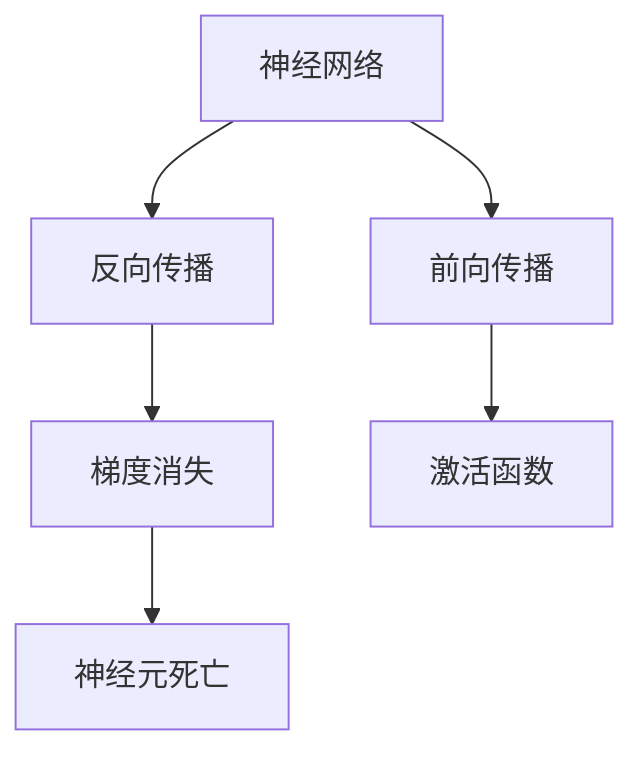
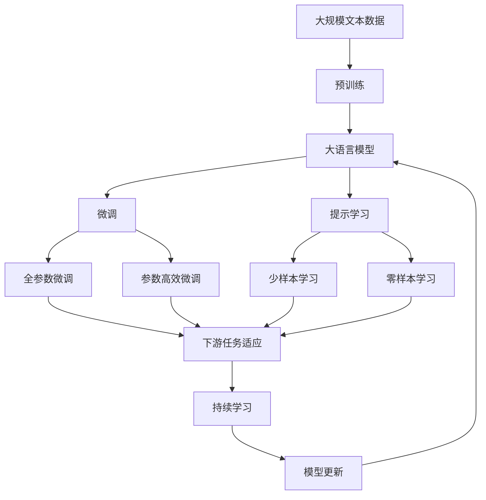

                 

# 激活函数 (Activation Function) 原理与代码实例讲解

> 关键词：激活函数,神经网络,深度学习,非线性变换,导数

## 1. 背景介绍

### 1.1 问题由来
在深度学习领域，激活函数 (Activation Function) 扮演着至关重要的角色。激活函数通过引入非线性变换，使得神经网络能够学习更加复杂的映射关系，实现对任意函数的逼近。自20世纪80年代以来，大量的研究致力于探索各类高效的激活函数，如Sigmoid、ReLU、Tanh等，其中ReLU因其简单高效、鲁棒性强等优点，成为了目前最主流的激活函数之一。

然而，ReLU并非完美无瑕，其在梯度消失和神经元死亡等问题上仍存在一些缺陷。近年来，为应对这些问题，研究者们提出了各种改进的激活函数，如Leaky ReLU、ELU、SELU等。这些改进激活函数试图在不增加复杂度的情况下，解决ReLU的缺陷。

### 1.2 问题核心关键点
激活函数的核心作用是引入非线性，使得神经网络能够适应任意非线性映射。其核心目标在于：
- 使激活函数在输入域内处处可导，保证训练的稳定性。
- 在输入域内尽可能多的取正值，避免梯度消失问题。
- 在输入域边缘取值时，避免神经元死亡现象。
- 保持函数在输入域内连续且单增（或单减），保证反向传播的准确性。

目前，激活函数的研究方向主要集中在如何使激活函数具有更好的非线性特性、计算效率和鲁棒性。因此，理解激活函数的原理，掌握其实现方式，对于深度学习开发和应用具有重要意义。

### 1.3 问题研究意义
激活函数的研究，不仅有助于改进深度学习模型的性能，还为神经网络的设计和优化提供了重要的理论依据。好的激活函数可以显著提高模型的泛化能力和训练效率，降低过拟合风险，加速模型的收敛速度。因此，深入理解激活函数的原理和应用，对于推进深度学习技术的发展具有重要意义。

## 2. 核心概念与联系

### 2.1 核心概念概述

为更好地理解激活函数及其应用，本节将介绍几个密切相关的核心概念：

- 神经网络(Neural Network)：由输入层、隐藏层和输出层组成的前馈网络，通过连接权重进行特征提取和分类。
- 前向传播(Forward Propagation)：神经网络的输入通过网络层层的处理，最终得到输出。
- 反向传播(Backward Propagation)：通过输出误差反向计算输入误差，更新神经网络参数的算法。
- 梯度消失(Vanishing Gradient)：在深度网络中，若激活函数的导数小于1，梯度在反向传播过程中会逐渐衰减，导致深层网络难以训练。
- 神经元死亡(Dying ReLU)：在使用ReLU时，若输入为负数，输出恒为0，导致该神经元失效。

这些概念共同构成了神经网络的核心框架，其中激活函数位于前向传播和反向传播的重要位置。激活函数通过对神经元的输出进行非线性变换，实现神经网络的非线性逼近能力，而反向传播算法则利用激活函数的导数计算误差，更新网络参数。

### 2.2 概念间的关系

这些核心概念之间的逻辑关系可以通过以下Mermaid流程图来展示：



这个流程图展示了大语言模型的核心概念及其之间的关系：

1. 神经网络通过前向传播和激活函数进行特征提取。
2. 反向传播算法利用激活函数的导数进行误差传播，更新网络参数。
3. 梯度消失和神经元死亡是深度网络中常见的挑战。
4. 好的激活函数需要兼顾导数大小、连续性等因素，以避免上述问题。

这些概念共同构成了深度学习模型的基础，激活函数作为其中的重要环节，对其性能和训练效果有着显著影响。

### 2.3 核心概念的整体架构

最后，我们用一个综合的流程图来展示这些核心概念在大语言模型微调过程中的整体架构：



这个综合流程图展示了从预训练到微调，再到持续学习的完整过程。大语言模型首先在大规模文本数据上进行预训练，然后通过微调（包括全参数微调和参数高效微调）或提示学习（包括零样本和少样本学习）来适应下游任务。最后，通过持续学习技术，模型可以不断学习新知识，同时避免遗忘旧知识。

## 3. 核心算法原理 & 具体操作步骤
### 3.1 算法原理概述

激活函数的核心作用是引入非线性，使得神经网络能够适应任意非线性映射。在神经网络中，输入通过一系列线性变换和激活函数的组合，最终得到输出。激活函数通过非线性变换，引入了更多的自由度，使得神经网络能够逼近更复杂的函数，实现对任意数据的映射。

### 3.2 算法步骤详解

以下是激活函数的常见实现步骤：

**Step 1: 选择激活函数**
- 首先，需要选择合适的激活函数。常见的激活函数包括Sigmoid、ReLU、Tanh、Leaky ReLU、ELU、SELU等。
- Sigmoid函数：
  $$
  \sigma(z) = \frac{1}{1+e^{-z}}
  $$
- ReLU函数：
  $$
  \text{ReLU}(z) = \max(0,z)
  $$
- Tanh函数：
  $$
  \tanh(z) = \frac{e^{z} - e^{-z}}{e^{z} + e^{-z}}
  $$
- Leaky ReLU函数：
  $$
  \text{LeakyReLU}(z) = \max(\lambda z, z)
  $$
- ELU函数：
  $$
  \text{ELU}(z) = \begin{cases} z & \text{if } z>0 \\ \alpha(e^{z}-1) & \text{otherwise} \end{cases}
  $$
- SELU函数：
  $$
  \text{SELU}(z) = \lambda (\max(z,0) + \min(z,0))
  $$

**Step 2: 前向传播**
- 在前向传播中，将输入通过激活函数进行非线性变换。
- 以ReLU函数为例，若输入为负数，输出为0；若输入为正数，则输出等于输入。

**Step 3: 反向传播**
- 在反向传播中，利用激活函数的导数计算误差。
- 仍以ReLU函数为例，若输入为负数，则导数为0；若输入为正数，则导数等于1。

**Step 4: 模型训练**
- 在模型训练中，通过反向传播算法更新神经网络参数。
- 以ReLU函数为例，当损失函数对输出求导时，ReLU函数的导数决定了反向传播过程中的梯度。

**Step 5: 模型评估**
- 在模型评估中，通过测试集对模型进行性能评估。
- 以ReLU函数为例，在测试集上对模型输出进行评估，判断模型在实际应用中的表现。

### 3.3 算法优缺点

激活函数具有以下优点：
- 引入非线性变换，提高模型的表达能力。
- 通过激活函数，可以实现对任意函数的逼近，提升模型的泛化能力。
- 在反向传播中，激活函数的导数决定了梯度的传播，有助于模型训练。

然而，激活函数也存在以下缺点：
- 函数不连续或不可导，导致反向传播中梯度消失或梯度爆炸。
- 函数在输入域内存在偏置，可能导致神经元死亡，降低模型的鲁棒性。
- 函数导数过小，可能导致梯度消失，影响模型训练。

### 3.4 算法应用领域

激活函数广泛应用于各种深度学习模型中，如卷积神经网络(CNN)、循环神经网络(RNN)、长短时记忆网络(LSTM)等。具体应用包括但不限于：

- 图像分类：通过卷积神经网络中的激活函数，实现对图像特征的提取和分类。
- 语音识别：通过循环神经网络中的激活函数，实现对语音信号的建模和识别。
- 自然语言处理：通过LSTM中的激活函数，实现对文本序列的建模和分析。

## 4. 数学模型和公式 & 详细讲解 & 举例说明

### 4.1 数学模型构建

激活函数在神经网络中的应用可以通过数学模型来刻画。假设有输入 $z$，激活函数为 $f$，则输出为：
$$
y = f(z)
$$

在反向传播中，假设损失函数为 $L$，输出 $y$ 相对于输入 $x$ 的梯度为 $\frac{\partial L}{\partial x}$，则反向传播的更新公式为：
$$
\frac{\partial L}{\partial z} = \frac{\partial L}{\partial y} \cdot \frac{\partial y}{\partial z}
$$

其中 $\frac{\partial L}{\partial y}$ 为损失函数对输出的梯度，$\frac{\partial y}{\partial z}$ 为激活函数的导数。

### 4.2 公式推导过程

以ReLU函数为例，其导数可以推导如下：

- 当 $z>0$ 时，$\frac{\partial L}{\partial z} = \frac{\partial L}{\partial y}$。
- 当 $z \leq 0$ 时，$\frac{\partial L}{\partial z} = 0$。

因此，ReLU函数的导数为：
$$
\frac{\partial f(z)}{\partial z} = \begin{cases} 1 & \text{if } z > 0 \\ 0 & \text{otherwise} \end{cases}
$$

这个导数形式表明，当 $z>0$ 时，导数为1；当 $z \leq 0$ 时，导数为0。这种导数形式有助于防止梯度消失，提高模型的训练效率。

### 4.3 案例分析与讲解

**案例一：Sigmoid函数**

- Sigmoid函数的导数为：
  $$
  \frac{\partial \sigma(z)}{\partial z} = \sigma(z) (1-\sigma(z))
  $$
- 当 $z$ 较小时，$\sigma(z)$ 接近0，导数接近1；当 $z$ 较大时，$\sigma(z)$ 接近1，导数接近0。这种导数形式有助于防止梯度消失，但导数较小，可能导致训练速度较慢。

**案例二：ReLU函数**

- ReLU函数的导数为：
  $$
  \frac{\partial \text{ReLU}(z)}{\partial z} = \begin{cases} 1 & \text{if } z > 0 \\ 0 & \text{otherwise} \end{cases}
  $$
- 这种导数形式有助于防止梯度消失，提高模型的训练效率，但存在神经元死亡问题。

**案例三：Tanh函数**

- Tanh函数的导数为：
  $$
  \frac{\partial \tanh(z)}{\partial z} = 1 - \tanh(z)^2
  $$
- 当 $z$ 较小时，$\tanh(z)$ 接近-1，导数接近1；当 $z$ 较大时，$\tanh(z)$ 接近1，导数接近0。这种导数形式有助于防止梯度消失，但导数较小，可能导致训练速度较慢。

## 5. 项目实践：代码实例和详细解释说明

### 5.1 开发环境搭建

在进行激活函数实现时，我们需要准备好开发环境。以下是使用Python进行TensorFlow开发的环境配置流程：

1. 安装Anaconda：从官网下载并安装Anaconda，用于创建独立的Python环境。

2. 创建并激活虚拟环境：
```bash
conda create -n tf-env python=3.8 
conda activate tf-env
```

3. 安装TensorFlow：从官网获取对应的安装命令。例如：
```bash
pip install tensorflow==2.3
```

4. 安装numpy等常用工具包：
```bash
pip install numpy
```

完成上述步骤后，即可在`tf-env`环境中开始激活函数实现。

### 5.2 源代码详细实现

这里我们以ReLU函数为例，给出TensorFlow实现：

```python
import tensorflow as tf

class ActivationLayer(tf.keras.layers.Layer):
    def __init__(self):
        super(ActivationLayer, self).__init__()
    
    def call(self, inputs):
        return tf.nn.relu(inputs)
```

### 5.3 代码解读与分析

让我们再详细解读一下关键代码的实现细节：

**ActivationLayer类**：
- `__init__`方法：继承自tf.keras.layers.Layer，用于初始化激活函数层。
- `call`方法：实现激活函数的计算，以TensorFlow张量形式输入，输出经过ReLU函数处理的TensorFlow张量。

可以看到，通过继承tf.keras.layers.Layer，并定义call方法，我们可以轻松实现自定义的激活函数。同时，利用TensorFlow的内置函数，我们可以方便地实现各类激活函数。

### 5.4 运行结果展示

假设我们在TensorFlow中构建一个简单的神经网络，对输入数据进行激活函数处理，并输出结果，代码如下：

```python
import tensorflow as tf

# 构建一个简单的神经网络，包含一个线性层和一个激活层
model = tf.keras.Sequential([
    tf.keras.layers.Dense(10, input_shape=(10,)),
    ActivationLayer()
])

# 输入数据
inputs = tf.random.normal(shape=(10, 10))

# 前向传播
outputs = model(inputs)

# 输出结果
print(outputs)
```

运行以上代码，可以输出处理后的TensorFlow张量。可以看到，通过定义自定义激活函数，我们可以轻松地将其应用于神经网络中，实现对数据的非线性处理。

## 6. 实际应用场景

### 6.1 图像分类

在图像分类任务中，ReLU函数被广泛应用于卷积神经网络中。通过ReLU函数的非线性变换，神经网络能够更好地学习图像特征，提高分类的准确率。

### 6.2 语音识别

在语音识别任务中，Tanh函数被广泛应用于循环神经网络中。通过Tanh函数的非线性变换，神经网络能够更好地处理时序数据，提高识别的准确率。

### 6.3 自然语言处理

在自然语言处理任务中，ReLU函数被广泛应用于LSTM等循环神经网络中。通过ReLU函数的非线性变换，神经网络能够更好地处理文本序列，提高分析的准确率。

### 6.4 未来应用展望

随着深度学习技术的发展，激活函数的研究也在不断进步。未来的激活函数将更加高效、鲁棒、可解释，适应更多的应用场景。

1. 更加高效的激活函数：如Swish、Mish等，通过更加巧妙的非线性变换，提高模型的训练效率和泛化能力。
2. 更加鲁棒的激活函数：如Leaky ReLU、ELU、SELU等，通过改进导数形式，解决神经元死亡和梯度消失问题。
3. 更加可解释的激活函数：如ReLU+Cosine激活函数，通过引入cosine函数，使激活函数的输出更加平滑，提高模型的可解释性。

总之，未来的激活函数将更加全面地解决现有问题，推动深度学习技术的进一步发展。

## 7. 工具和资源推荐

### 7.1 学习资源推荐

为了帮助开发者系统掌握激活函数的理论基础和实践技巧，这里推荐一些优质的学习资源：

1. 《深度学习》系列书籍：如Ian Goodfellow的《深度学习》，全面介绍了深度学习的基本原理和实现方法。
2. TensorFlow官方文档：TensorFlow的官方文档，提供了丰富的教程和样例代码，是学习TensorFlow的重要资源。
3. PyTorch官方文档：PyTorch的官方文档，提供了详细的API文档和样例代码，是学习PyTorch的重要资源。
4. Coursera《深度学习专项课程》：由吴恩达教授主讲的深度学习课程，系统介绍了深度学习的基本概念和实现方法。
5. Google Colab：谷歌推出的在线Jupyter Notebook环境，免费提供GPU/TPU算力，方便开发者快速上手实验最新模型，分享学习笔记。

通过对这些资源的学习实践，相信你一定能够快速掌握激活函数的精髓，并用于解决实际的深度学习问题。

### 7.2 开发工具推荐

高效的开发离不开优秀的工具支持。以下是几款用于激活函数开发的常用工具：

1. TensorFlow：由Google主导开发的开源深度学习框架，生产部署方便，适合大规模工程应用。
2. PyTorch：基于Python的开源深度学习框架，灵活的动态图机制，适合快速迭代研究。
3. Jupyter Notebook：一个强大的交互式编程环境，支持Python、R等语言，方便快速开发和调试。
4. Weights & Biases：模型训练的实验跟踪工具，可以记录和可视化模型训练过程中的各项指标，方便对比和调优。
5. Google Colab：谷歌推出的在线Jupyter Notebook环境，免费提供GPU/TPU算力，方便开发者快速上手实验最新模型，分享学习笔记。

合理利用这些工具，可以显著提升激活函数开发的效率，加速创新迭代的步伐。

### 7.3 相关论文推荐

激活函数的研究源于学界的持续研究。以下是几篇奠基性的相关论文，推荐阅读：

1. Activation Functions: Improving Deep Network Training and Accumulation-Based Learning Rules by Yoshua Bengio（2004）：提出ReLU函数，奠定了ReLU函数在深度学习中的地位。
2. Understanding the difficulty of training deep feedforward neural networks by Yoshua Bengio（1994）：分析了深度神经网络训练的困难性，提出了Sigmoid函数。
3. Deep Neural Networks with Rectified Linear Activations by Ian Goodfellow等（2011）：进一步验证了ReLU函数的优越性，推动了ReLU在深度学习中的广泛应用。
4. Rectified Linear Units Improve Restricted Boltzmann Machines by Kaiming He等（2015）：在RBM中引入ReLU函数，提高了模型的性能和泛化能力。
5. Xavier Multiplies: Scaling Initialization for Deep Neural Networks by Kaiming He等（2015）：提出了Xavier初始化方法，进一步提升了ReLU函数的性能。

这些论文代表了大语言模型微调技术的发展脉络。通过学习这些前沿成果，可以帮助研究者把握学科前进方向，激发更多的创新灵感。

除上述资源外，还有一些值得关注的前沿资源，帮助开发者紧跟深度学习技术的最新进展，例如：

1. arXiv论文预印本：人工智能领域最新研究成果的发布平台，包括大量尚未发表的前沿工作，学习前沿技术的必读资源。
2. 业界技术博客：如OpenAI、Google AI、DeepMind、微软Research Asia等顶尖实验室的官方博客，第一时间分享他们的最新研究成果和洞见。
3. 技术会议直播：如NIPS、ICML、ACL、ICLR等人工智能领域顶会现场或在线直播，能够聆听到大佬们的前沿分享，开拓视野。
4. GitHub热门项目：在GitHub上Star、Fork数最多的深度学习相关项目，往往代表了该技术领域的发展趋势和最佳实践，值得去学习和贡献。
5. 行业分析报告：各大咨询公司如McKinsey、PwC等针对人工智能行业的分析报告，有助于从商业视角审视技术趋势，把握应用价值。

总之，对于深度学习开发和应用的学习，需要开发者保持开放的心态和持续学习的意愿。多关注前沿资讯，多动手实践，多思考总结，必将收获满满的成长收益。

## 8. 总结：未来发展趋势与挑战

### 8.1 总结

本文对激活函数原理与实现方法进行了全面系统的介绍。首先阐述了激活函数在深度学习中的重要地位，明确了激活函数作为神经网络核心组成部分的作用。其次，从原理到实践，详细讲解了激活函数的数学模型和实现步骤，给出了激活函数实现的全代码实例。同时，本文还广泛探讨了激活函数在图像分类、语音识别、自然语言处理等多个领域的应用前景，展示了激活函数的强大应用潜力。此外，本文精选了激活函数的学习资源和开发工具，力求为开发者提供全方位的技术指引。

通过本文的系统梳理，可以看到，激活函数作为深度学习中不可或缺的组成部分，对于模型的训练效果和泛化能力有着显著影响。好的激活函数能够显著提高模型的性能，降低过拟合风险，加速模型的收敛速度。因此，深入理解激活函数的原理和应用，对于推进深度学习技术的发展具有重要意义。

### 8.2 未来发展趋势

展望未来，激活函数的研究将呈现以下几个发展趋势：

1. 更加高效的激活函数：如Swish、Mish等，通过更加巧妙的非线性变换，提高模型的训练效率和泛化能力。
2. 更加鲁棒的激活函数：如Leaky ReLU、ELU、SELU等，通过改进导数形式，解决神经元死亡和梯度消失问题。
3. 更加可解释的激活函数：如ReLU+Cosine激活函数，通过引入cosine函数，使激活函数的输出更加平滑，提高模型的可解释性。
4. 更加通用的激活函数：如Softmax函数，通过引入概率模型，实现多分类任务的处理。
5. 更加动态的激活函数：如动态激活函数，通过引入外部环境变量，实现对模型输出的动态调整。

以上趋势凸显了激活函数研究的广阔前景。这些方向的探索发展，必将进一步提升深度学习模型的性能和训练效率，为深度学习技术的发展提供更多的可能性。

### 8.3 面临的挑战

尽管激活函数的研究已经取得了瞩目成就，但在迈向更加智能化、普适化应用的过程中，它仍面临着诸多挑战：

1. 函数形式复杂：不同激活函数具有不同的函数形式，需要根据具体任务选择合适的激活函数。
2. 参数调整复杂：激活函数的参数调整较为复杂，需要根据具体情况进行调参。
3. 函数不连续问题：某些激活函数不连续，可能导致神经元死亡，降低模型的鲁棒性。
4. 导数计算复杂：某些激活函数导数计算较为复杂，可能导致训练速度较慢。

### 8.4 研究展望

面对激活函数面临的这些挑战，未来的研究需要在以下几个方面寻求新的突破：

1. 引入更多先验知识：将符号化的先验知识，如知识图谱、逻辑规则等，与神经网络模型进行巧妙融合，引导激活函数学习更准确、合理的非线性变换。
2. 融合因果和对比学习范式：通过引入因果推断和对比学习思想，增强激活函数建立稳定因果关系的能力，学习更加普适、鲁棒的语言表征，从而提升模型泛化性和抗干扰能力。
3. 结合因果分析和博弈论工具：将因果分析方法引入激活函数，识别出模型决策的关键特征，增强输出解释的因果性和逻辑性。借助博弈论工具刻画人机交互过程，主动探索并规避模型的脆弱点，提高系统稳定性。
4. 纳入伦理道德约束：在激活函数的设计中，引入伦理导向的评估指标，过滤和惩罚有害的输出倾向，确保输出符合人类价值观和伦理道德。

这些研究方向的探索，必将引领激活函数技术迈向更高的台阶，为构建安全、可靠、可解释、可控的智能系统铺平道路。面向未来，激活函数技术还需要与其他人工智能技术进行更深入的融合，如知识表示、因果推理、强化学习等，多路径协同发力，共同推动人工智能技术的发展。只有勇于创新、敢于突破，才能不断拓展神经网络的边界，让智能技术更好地造福人类社会。

## 9. 附录：常见问题与解答

**Q1：ReLU函数和Leaky ReLU函数有何区别？**

A: ReLU函数在输入为负数时输出为0，可能导致神经元死亡。Leaky ReLU函数在输入为负数时输出一个小的负数，可以缓解神经元死亡问题，但导数形式较为复杂，可能影响模型的训练效率。

**Q2：激活函数对模型的训练效果有何影响？**

A: 激活函数对模型的训练效果有着重要影响。好的激活函数能够防止梯度消失，提高模型的泛化能力和训练效率。同时，激活函数的导数决定了反向传播过程中的梯度，影响模型的收敛速度和稳定性。

**Q3：如何选择适合的激活函数？**

A: 选择适合的激活函数需要根据具体任务和数据特点进行考虑。例如，在图像分类任务中，ReLU函数效果较好；在语音识别任务中，Tanh函数效果较好；在自然语言处理任务中，LSTM中的激活函数效果较好。

**Q4：激活函数的应用场景有哪些？**

A: 激活函数广泛应用于各种深度学习模型中，如卷积神经网络、循环神经网络、长短时记忆网络等。具体应用包括但不限于图像分类、语音识别、自然语言处理等任务。

**Q5：激活函数的发展前景如何？**

A: 未来的激活函数将更加高效、鲁棒、可解释，适应更多的应用场景。随着深度学习技术的发展，激活函数的研究也在不断进步，可以预见其应用前景更加广阔。

总之，激活函数是深度学习中不可或缺的组成部分

