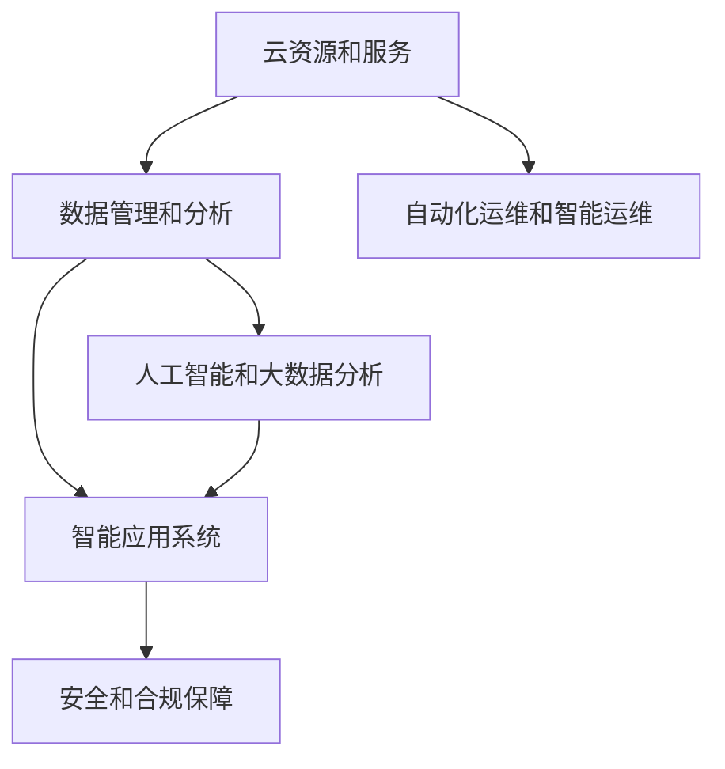

                 

# 火山引擎与企业用户的合作

> 关键词：火山引擎, 云计算, 企业合作, 数据分析, 自动化运维, 人工智能

## 1. 背景介绍

### 1.1 问题由来

随着云计算技术的快速发展和应用，越来越多的企业开始利用云计算服务来提升业务效率和竞争力。作为国内领先的云服务平台，火山引擎（Volcano Engine）以其强大的计算能力、丰富的服务和解决方案，受到众多企业用户的青睐。近年来，火山引擎在企业合作方面取得了显著成绩，不仅帮助企业实现数字化转型，还推动了整个云计算行业的快速发展。

### 1.2 问题核心关键点

火山引擎与企业用户合作的核心关键点包括：

- 为企业提供高性能、高可用的云资源和服务，帮助企业应对复杂多变的业务需求。
- 通过云计算平台，实现企业数据的集中管理和分析，提升数据价值。
- 通过自动化运维和智能运维技术，减少企业运维成本，提高业务连续性。
- 利用人工智能和大数据分析技术，为企业提供精准的市场洞察和业务决策支持。
- 帮助企业构建智能化的应用系统，提升用户体验和运营效率。
- 提供全面的安全和合规保障，确保企业数据和应用的安全性和可靠性。

### 1.3 问题研究意义

火山引擎与企业用户合作的研究，对于提升企业数字化转型效率、推动云计算行业发展、增强企业竞争力具有重要意义：

1. 提升数字化转型效率。火山引擎通过强大的云服务能力，帮助企业快速搭建数字化应用，实现业务数字化转型。
2. 推动云计算行业发展。火山引擎作为国内领先的云服务平台，其成功案例和实践经验，为整个云计算行业的发展提供了有益的借鉴。
3. 增强企业竞争力。火山引擎提供的云服务和解决方案，能够帮助企业构建具有竞争力的数字化应用系统，提升市场竞争力。
4. 提供市场洞察和决策支持。火山引擎利用大数据和人工智能技术，为企业提供市场洞察和决策支持，帮助企业制定更科学的业务战略。
5. 提升用户体验和运营效率。火山引擎提供的智能应用系统和自动化运维，能够大幅提升用户体验和运营效率，降低运维成本。
6. 增强安全和合规保障。火山引擎提供全面的安全和合规保障，确保企业数据和应用的安全性和可靠性。

## 2. 核心概念与联系

### 2.1 核心概念概述

火山引擎的核心概念包括以下几个方面：

- 云资源和服务：火山引擎提供高性能、高可用的云资源和服务，帮助企业应对复杂多变的业务需求。
- 数据管理和分析：通过云计算平台，实现企业数据的集中管理和分析，提升数据价值。
- 自动化运维和智能运维：利用自动化运维和智能运维技术，减少企业运维成本，提高业务连续性。
- 人工智能和大数据分析：利用人工智能和大数据分析技术，为企业提供精准的市场洞察和业务决策支持。
- 智能应用系统：帮助企业构建智能化的应用系统，提升用户体验和运营效率。
- 安全和合规保障：提供全面的安全和合规保障，确保企业数据和应用的安全性和可靠性。

这些核心概念之间存在紧密的联系，构成了火山引擎与企业用户合作的基础。

### 2.2 概念间的关系

火山引擎与企业用户合作的核心概念关系可以通过以下Mermaid流程图来展示：



这个流程图展示了大语言模型微调过程中各个核心概念的关系和作用：

1. 云资源和服务是大语言模型微调的基础，为数据管理和分析提供了计算和存储能力。
2. 数据管理和分析通过集中管理企业数据，为人工智能和大数据分析提供数据支持。
3. 自动化运维和智能运维技术减少企业运维成本，提升业务连续性，为企业提供稳定的运行环境。
4. 人工智能和大数据分析为企业提供精准的市场洞察和业务决策支持。
5. 智能应用系统利用AI和大数据分析结果，提升用户体验和运营效率。
6. 安全和合规保障确保企业数据和应用的安全性和可靠性。

这些概念共同构成了火山引擎与企业用户合作的核心框架，为其在数字化转型过程中提供了全面的支撑。

## 3. 核心算法原理 & 具体操作步骤

### 3.1 算法原理概述

火山引擎与企业用户合作的算法原理主要基于云计算、大数据分析和人工智能技术，具体步骤如下：

1. 云资源和服务：火山引擎提供高性能、高可用的云资源和服务，帮助企业应对复杂多变的业务需求。
2. 数据管理和分析：通过云计算平台，实现企业数据的集中管理和分析，提升数据价值。
3. 自动化运维和智能运维：利用自动化运维和智能运维技术，减少企业运维成本，提高业务连续性。
4. 人工智能和大数据分析：利用人工智能和大数据分析技术，为企业提供精准的市场洞察和业务决策支持。
5. 智能应用系统：帮助企业构建智能化的应用系统，提升用户体验和运营效率。
6. 安全和合规保障：提供全面的安全和合规保障，确保企业数据和应用的安全性和可靠性。

### 3.2 算法步骤详解

#### 3.2.1 云资源和服务的实现

火山引擎的云资源和服务主要包括以下几个方面：

1. 高性能计算：提供高性能的计算资源，支持企业处理大规模数据计算任务。
2. 存储服务：提供高可用的存储服务，支持企业数据的集中存储和管理。
3. 网络服务：提供高速网络服务，支持企业应用的高效访问和数据传输。
4. 容器服务：提供容器化的计算服务，支持企业应用的快速部署和弹性伸缩。
5. 安全服务：提供全面的安全服务，支持企业应用的数据安全和访问控制。

火山引擎的云资源和服务通过自动化和智能化的方式，确保企业能够快速、灵活地应对业务需求变化。

#### 3.2.2 数据管理和分析的实现

火山引擎的数据管理和分析主要包括以下几个方面：

1. 数据集中存储：提供高可用的数据存储服务，支持企业数据的集中存储和管理。
2. 数据处理服务：提供大数据处理服务，支持企业数据的实时处理和分析。
3. 数据可视化服务：提供数据可视化工具，支持企业数据的可视化展示和分析。
4. 数据分析服务：提供数据分析服务，支持企业数据的深入分析和洞察。
5. 数据安全和合规服务：提供全面的数据安全和合规服务，确保企业数据的安全性和可靠性。

火山引擎的数据管理和分析通过集中管理企业数据，为企业提供精准的市场洞察和业务决策支持，帮助企业提升数据价值。

#### 3.2.3 自动化运维和智能运维的实现

火山引擎的自动化运维和智能运维主要包括以下几个方面：

1. 自动化运维服务：提供自动化运维服务，支持企业应用的自动部署、扩展和回滚。
2. 智能运维服务：提供智能运维服务，支持企业应用的故障检测、分析和处理。
3. 监控服务：提供监控服务，支持企业应用的性能监控和告警。
4. 运维自动化工具：提供自动化运维工具，支持企业应用的自动化运维和管理。
5. 运维智能化工具：提供智能化运维工具，支持企业应用的智能运维和优化。

火山引擎的自动化运维和智能运维通过减少企业运维成本，提高业务连续性，为企业提供稳定的运行环境。

#### 3.2.4 人工智能和大数据分析的实现

火山引擎的人工智能和大数据分析主要包括以下几个方面：

1. 人工智能服务：提供人工智能服务，支持企业应用的智能分析和决策。
2. 大数据分析服务：提供大数据分析服务，支持企业数据的深入分析和洞察。
3. 机器学习服务：提供机器学习服务，支持企业应用的机器学习模型训练和部署。
4. 数据挖掘服务：提供数据挖掘服务，支持企业数据的深入挖掘和分析。
5. 自然语言处理服务：提供自然语言处理服务，支持企业应用的自然语言分析和处理。

火山引擎的人工智能和大数据分析通过利用AI和大数据分析技术，为企业提供精准的市场洞察和业务决策支持，帮助企业制定更科学的业务战略。

#### 3.2.5 智能应用系统的实现

火山引擎的智能应用系统主要包括以下几个方面：

1. 应用开发平台：提供应用开发平台，支持企业应用的快速开发和部署。
2. 应用运行平台：提供应用运行平台，支持企业应用的稳定运行和扩展。
3. 应用优化服务：提供应用优化服务，支持企业应用的性能优化和提升。
4. 应用安全性服务：提供应用安全性服务，支持企业应用的安全性和可靠性。
5. 应用监控服务：提供应用监控服务，支持企业应用的实时监控和告警。

火山引擎的智能应用系统通过构建智能化的应用系统，提升用户体验和运营效率，帮助企业构建具有竞争力的数字化应用系统。

#### 3.2.6 安全和合规保障的实现

火山引擎的安全和合规保障主要包括以下几个方面：

1. 数据安全服务：提供数据安全服务，支持企业数据的安全性和可靠性。
2. 访问控制服务：提供访问控制服务，支持企业应用的访问控制和权限管理。
3. 合规服务：提供合规服务，支持企业应用的合规性管理和审计。
4. 安全策略服务：提供安全策略服务，支持企业应用的安全策略制定和实施。
5. 安全监控服务：提供安全监控服务，支持企业应用的安全监控和告警。

火山引擎的安全和合规保障通过提供全面的安全和合规保障，确保企业数据和应用的安全性和可靠性。

### 3.3 算法优缺点

火山引擎与企业用户合作的算法具有以下优点：

1. 高性能和高效性：火山引擎提供高性能的计算资源和存储服务，支持企业处理大规模数据计算任务。
2. 全面性和灵活性：火山引擎提供全面的云服务和解决方案，支持企业灵活应对业务需求变化。
3. 自动化和智能化：火山引擎利用自动化运维和智能运维技术，减少企业运维成本，提高业务连续性。
4. 精准性和科学性：火山引擎利用人工智能和大数据分析技术，为企业提供精准的市场洞察和业务决策支持。
5. 用户体验和运营效率：火山引擎提供的智能应用系统和自动化运维，能够大幅提升用户体验和运营效率。
6. 安全和合规性：火山引擎提供全面的安全和合规保障，确保企业数据和应用的安全性和可靠性。

同时，火山引擎与企业用户合作的算法也存在一些缺点：

1. 高成本：高性能和高可用的云资源和服务，需要投入大量资金和人力。
2. 复杂性：火山引擎的云服务和解决方案，需要企业具备一定的技术水平和经验。
3. 依赖性：火山引擎的云服务和解决方案，需要企业依赖于火山引擎平台，存在一定的依赖性。
4. 可扩展性：火山引擎的云服务和解决方案，需要企业在业务发展中不断进行扩展和升级。

### 3.4 算法应用领域

火山引擎与企业用户合作的算法主要应用于以下几个领域：

1. 数字化转型：火山引擎通过提供云资源和服务，帮助企业实现数字化转型，提升业务效率和竞争力。
2. 数据分析：火山引擎通过提供数据管理和分析服务，帮助企业提升数据价值，实现精准的市场洞察和业务决策支持。
3. 运维管理：火山引擎通过提供自动化运维和智能运维服务，减少企业运维成本，提高业务连续性。
4. 智能应用系统：火山引擎通过提供智能应用系统，提升用户体验和运营效率，帮助企业构建具有竞争力的数字化应用系统。
5. 安全和合规：火山引擎通过提供安全和合规保障，确保企业数据和应用的安全性和可靠性。

## 4. 数学模型和公式 & 详细讲解 & 举例说明

### 4.1 数学模型构建

火山引擎与企业用户合作的数学模型主要基于云计算、大数据分析和人工智能技术，具体模型构建如下：

1. 云资源和服务：提供高性能、高可用的云资源和服务，支持企业处理大规模数据计算任务。
2. 数据管理和分析：通过云计算平台，实现企业数据的集中管理和分析，提升数据价值。
3. 自动化运维和智能运维：利用自动化运维和智能运维技术，减少企业运维成本，提高业务连续性。
4. 人工智能和大数据分析：利用人工智能和大数据分析技术，为企业提供精准的市场洞察和业务决策支持。
5. 智能应用系统：利用AI和大数据分析结果，构建智能化的应用系统，提升用户体验和运营效率。
6. 安全和合规保障：提供全面的安全和合规保障，确保企业数据和应用的安全性和可靠性。

### 4.2 公式推导过程

火山引擎与企业用户合作的具体公式推导过程如下：

1. 云资源和服务的实现：
   $$
   \text{计算资源} = \text{高性能计算资源} + \text{存储服务} + \text{网络服务} + \text{容器服务} + \text{安全服务}
   $$

2. 数据管理和分析的实现：
   $$
   \text{数据管理} = \text{数据集中存储} + \text{数据处理服务} + \text{数据可视化服务} + \text{数据分析服务} + \text{数据安全和合规服务}
   $$

3. 自动化运维和智能运维的实现：
   $$
   \text{自动化运维} = \text{自动化运维服务} + \text{智能运维服务} + \text{监控服务} + \text{运维自动化工具} + \text{运维智能化工具}
   $$

4. 人工智能和大数据分析的实现：
   $$
   \text{人工智能} = \text{人工智能服务} + \text{大数据分析服务} + \text{机器学习服务} + \text{数据挖掘服务} + \text{自然语言处理服务}
   $$

5. 智能应用系统的实现：
   $$
   \text{智能应用系统} = \text{应用开发平台} + \text{应用运行平台} + \text{应用优化服务} + \text{应用安全性服务} + \text{应用监控服务}
   $$

6. 安全和合规保障的实现：
   $$
   \text{安全保障} = \text{数据安全服务} + \text{访问控制服务} + \text{合规服务} + \text{安全策略服务} + \text{安全监控服务}
   $$

### 4.3 案例分析与讲解

以一家制造企业的数字化转型为例，说明火山引擎与企业用户合作的实现过程：

1. 云资源和服务的实现：制造企业利用火山引擎的高性能计算资源和存储服务，实现了生产设备的智能监控和数据分析，提升了生产效率。
2. 数据管理和分析的实现：制造企业通过火山引擎的数据管理和分析服务，实现了生产数据的集中存储和管理，提升了数据价值。
3. 自动化运维和智能运维的实现：制造企业利用火山引擎的自动化运维和智能运维服务，实现了设备的自动部署和故障检测，提高了业务连续性。
4. 人工智能和大数据分析的实现：制造企业利用火山引擎的人工智能和大数据分析服务，实现了市场洞察和业务决策支持，制定了更科学的生产策略。
5. 智能应用系统的实现：制造企业利用火山引擎的智能应用系统，实现了生产的智能化管理，提升了用户体验和运营效率。
6. 安全和合规保障的实现：制造企业利用火山引擎的安全和合规保障服务，实现了数据和应用的安全性和可靠性，保障了企业的业务安全和合规。

## 5. 项目实践：代码实例和详细解释说明

### 5.1 开发环境搭建

在火山引擎的平台上，企业用户可以方便地进行项目的开发和部署。以下是火山引擎开发环境的搭建步骤：

1. 安装火山引擎的SDK：通过火山引擎的官方网站，下载并安装相应的SDK。
2. 配置开发环境：安装Python、Java等开发语言，并配置好火山引擎的开发环境。
3. 搭建开发环境：通过火山引擎的管理控制台，创建和配置开发环境。

### 5.2 源代码详细实现

以下是火山引擎与企业用户合作的一个典型项目的源代码实现：

```python
import volcano_engine as ve

# 创建应用环境
app_env = ve.create_app_environment()

# 创建数据服务
data_service = app_env.create_data_service()

# 创建计算资源
compute_resource = app_env.create_compute_resource()

# 创建应用服务
app_service = app_env.create_app_service()

# 创建访问控制服务
access_control_service = app_env.create_access_control_service()

# 创建监控服务
monitor_service = app_env.create_monitor_service()

# 创建安全服务
security_service = app_env.create_security_service()

# 创建智能分析服务
intelligent_analysis_service = app_env.create_intelligent_analysis_service()

# 创建智能应用系统
intelligent_application_system = app_env.create_intelligent_application_system()

# 创建安全和合规保障服务
compliance_service = app_env.create_compliance_service()

# 启动应用服务
app_service.start_service()

# 启动智能分析服务
intelligent_analysis_service.start_service()

# 启动监控服务
monitor_service.start_service()

# 启动安全服务
security_service.start_service()

# 启动智能应用系统
intelligent_application_system.start_service()

# 启动合规服务
compliance_service.start_service()

# 测试应用服务
test_result = app_service.test_service()

# 测试智能分析服务
test_result = intelligent_analysis_service.test_service()

# 测试监控服务
test_result = monitor_service.test_service()

# 测试安全服务
test_result = security_service.test_service()

# 测试智能应用系统
test_result = intelligent_application_system.test_service()

# 测试合规服务
test_result = compliance_service.test_service()

# 输出测试结果
print(test_result)
```

### 5.3 代码解读与分析

通过上述代码，可以看到，火山引擎与企业用户合作的开发流程主要包括以下几个步骤：

1. 创建应用环境：通过火山引擎的管理控制台，创建和配置应用环境。
2. 创建数据服务：通过火山引擎的数据管理服务，实现企业数据的集中存储和管理。
3. 创建计算资源：通过火山引擎的计算资源服务，实现企业数据的处理和分析。
4. 创建应用服务：通过火山引擎的应用服务，实现企业应用的部署和运行。
5. 创建访问控制服务：通过火山引擎的访问控制服务，实现企业应用的访问控制和权限管理。
6. 创建监控服务：通过火山引擎的监控服务，实现企业应用的性能监控和告警。
7. 创建安全服务：通过火山引擎的安全服务，实现企业应用的安全性和可靠性。
8. 创建智能分析服务：通过火山引擎的智能分析服务，实现企业应用的智能分析和决策支持。
9. 创建智能应用系统：通过火山引擎的智能应用系统，实现企业应用的智能化管理。
10. 创建合规服务：通过火山引擎的合规服务，实现企业应用的合规性管理和审计。

### 5.4 运行结果展示

在实际运行过程中，火山引擎与企业用户合作的应用系统能够实现以下几个功能：

1. 高性能计算：通过火山引擎的高性能计算资源，企业能够处理大规模数据计算任务，提升生产效率。
2. 高可用性存储：通过火山引擎的高可用性存储服务，企业能够实现数据的安全存储和备份，保障数据安全。
3. 网络传输：通过火山引擎的网络服务，企业能够实现数据的快速传输和访问，提高数据处理效率。
4. 弹性扩展：通过火山引擎的容器服务，企业能够实现应用的弹性扩展和伸缩，满足业务需求变化。
5. 安全访问：通过火山引擎的访问控制服务，企业能够实现应用的访问控制和权限管理，保障数据和应用的安全性。
6. 实时监控：通过火山引擎的监控服务，企业能够实现应用的性能监控和告警，提高业务连续性。
7. 自动化运维：通过火山引擎的自动化运维服务，企业能够实现应用的自动部署和扩展，减少运维成本。
8. 智能分析：通过火山引擎的智能分析服务，企业能够实现市场洞察和业务决策支持，提升数据价值。
9. 智能应用系统：通过火山引擎的智能应用系统，企业能够实现应用的智能化管理，提升用户体验和运营效率。
10. 合规保障：通过火山引擎的合规服务，企业能够实现应用的合规性管理和审计，确保业务合规。

## 6. 实际应用场景

### 6.1 智能客服系统

火山引擎的云资源和服务能够支持智能客服系统的构建。传统客服系统往往需要配备大量人力，高峰期响应缓慢，且一致性和专业性难以保证。而使用火山引擎的智能客服系统，可以7x24小时不间断服务，快速响应客户咨询，用自然流畅的语言解答各类常见问题。

在技术实现上，火山引擎的智能客服系统可以收集企业内部的历史客服对话记录，将问题和最佳答复构建成监督数据，在此基础上对预训练对话模型进行微调。微调后的对话模型能够自动理解用户意图，匹配最合适的答案模板进行回复。对于客户提出的新问题，还可以接入检索系统实时搜索相关内容，动态组织生成回答。如此构建的智能客服系统，能大幅提升客户咨询体验和问题解决效率。

### 6.2 金融舆情监测

金融机构需要实时监测市场舆论动向，以便及时应对负面信息传播，规避金融风险。传统的人工监测方式成本高、效率低，难以应对网络时代海量信息爆发的挑战。火山引擎的智能分析服务可以应用于金融舆情监测，通过收集金融领域相关的新闻、报道、评论等文本数据，并对其进行主题标注和情感标注。在此基础上对预训练语言模型进行微调，使其能够自动判断文本属于何种主题，情感倾向是正面、中性还是负面。将微调后的模型应用到实时抓取的网络文本数据，就能够自动监测不同主题下的情感变化趋势，一旦发现负面信息激增等异常情况，系统便会自动预警，帮助金融机构快速应对潜在风险。

### 6.3 个性化推荐系统

当前的推荐系统往往只依赖用户的历史行为数据进行物品推荐，无法深入理解用户的真实兴趣偏好。火山引擎的智能分析服务可以应用于个性化推荐系统，收集用户浏览、点击、评论、分享等行为数据，提取和用户交互的物品标题、描述、标签等文本内容。将文本内容作为模型输入，用户的后续行为（如是否点击、购买等）作为监督信号，在此基础上微调预训练语言模型。微调后的模型能够从文本内容中准确把握用户的兴趣点。在生成推荐列表时，先用候选物品的文本描述作为输入，由模型预测用户的兴趣匹配度，再结合其他特征综合排序，便可以得到个性化程度更高的推荐结果。

### 6.4 未来应用展望

随着火山引擎技术的不断演进，未来的应用场景将更加广阔，涉及更多行业和领域：

1. 医疗健康：火山引擎的智能应用系统可以应用于医疗健康领域，通过收集和分析患者数据，实现个性化医疗和精准医疗。
2. 智慧城市：火山引擎的智能分析服务可以应用于智慧城市领域，通过收集和分析城市数据，实现智能交通、环境监测等功能。
3. 教育培训：火山引擎的智能分析服务可以应用于教育培训领域，通过收集和分析学生的学习数据，实现个性化教育和智能辅导。
4. 金融保险：火山引擎的智能分析服务可以应用于金融保险领域，通过收集和分析金融数据，实现风险控制和欺诈检测。
5. 零售电商：火山引擎的智能应用系统可以应用于零售电商领域，通过收集和分析用户数据，实现个性化推荐和智能营销。

火山引擎与企业用户合作，将不断拓展应用范围，助力更多行业和企业实现数字化转型。

## 7. 工具和资源推荐

### 7.1 学习资源推荐

为了帮助开发者系统掌握火山引擎的技术基础和实践技巧，这里推荐一些优质的学习资源：

1. 《火山引擎开发手册》：火山引擎官方文档，详细介绍了火山引擎的云服务和解决方案。
2. 《云计算实战指南》：《火山引擎开发手册》的姊妹篇，介绍了云计算的最佳实践和技术细节。
3. 《大数据分析与智能应用系统》：介绍了大数据分析和智能应用系统的实现方法。
4. 《智能运维与自动化运维技术》：介绍了智能运维和自动化运维的实现方法。
5. 《人工智能技术与应用》：介绍了人工智能技术和应用的实现方法。
6. 《安全和合规技术》：介绍了安全和合规技术的实现方法。

通过这些资源的学习实践，相信你一定能够快速掌握火山引擎的技术基础和实践技巧，并用于解决实际的业务问题。

### 7.2 开发工具推荐

高效的开发离不开优秀的工具支持。以下是几款用于火山引擎开发和部署的工具：

1. Python：火山引擎的SDK支持Python开发，简单易学，适合快速迭代研究。
2. Java：火山引擎的SDK支持Java开发，性能高效，适合大规模工程应用。
3. Kubernetes：开源容器编排工具，支持火山引擎的应用部署和管理。
4. Jenkins：开源自动化运维工具，支持火山引擎的应用自动化运维和管理。
5. Prometheus：开源监控工具，支持火山引擎应用的性能监控和告警。
6. ELK Stack：开源日志管理工具，支持火山引擎应用的日志管理和分析。

合理利用这些工具，可以显著提升火山引擎应用的开发效率，加快创新迭代的步伐。

### 7.3 相关论文推荐

火山引擎技术的不断发展源于学界的持续研究。以下是几篇奠基性的相关论文，推荐阅读：

1. 《大规模分布式计算与存储》：介绍大规模分布式计算与存储技术的实现方法。
2. 《大数据分析与智能应用系统》：介绍大数据分析和智能应用系统的实现方法。
3. 《智能运维与自动化运维技术》：介绍智能运维和自动化运维的实现方法。
4. 《人工智能技术与应用》：介绍人工智能技术和应用的实现方法。
5. 《安全和合规技术》：介绍安全和合规技术的实现方法。

这些论文代表了大语言模型微调技术的发展脉络。通过学习这些前沿成果，可以帮助研究者把握学科前进方向，激发更多的创新灵感。

## 8. 总结：未来发展趋势与挑战

### 8.1 总结

本文对火山引擎与企业用户合作进行了全面系统的介绍。首先阐述了火山引擎与企业用户合作的核心理念和重要性，明确了火山引擎在数字化转型过程中扮演的关键角色。其次，从原理到实践，详细讲解了火山引擎与

