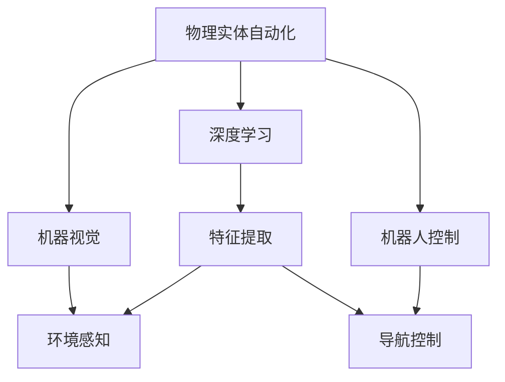
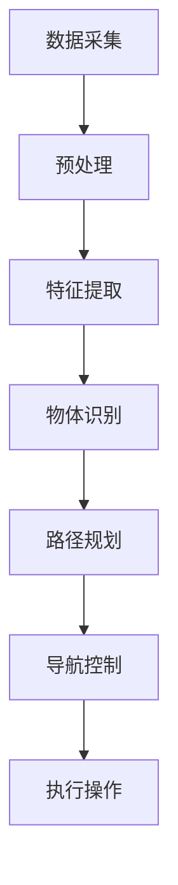
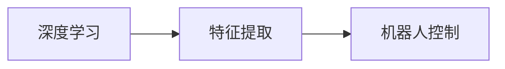
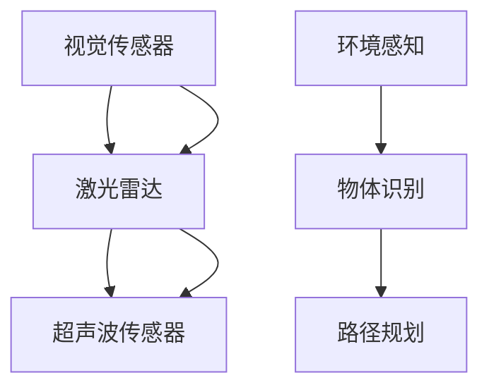
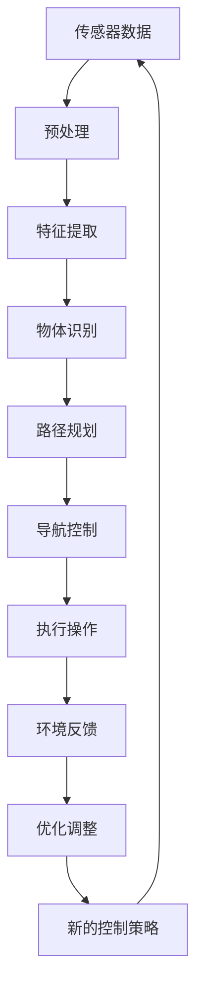

                 

# 物理实体自动化的初步探索

> 关键词：物理实体自动化,机器视觉,深度学习,机器人控制,自主导航,嵌入式系统

## 1. 背景介绍

### 1.1 问题由来
随着人工智能技术的迅猛发展，自动化领域逐渐进入了新一轮的变革期。在工业制造、智能家居、智慧城市等众多领域，物理实体的自动化需求日益增加。如何高效地实现物理实体的自主控制和智能操作，成为了当前研究的热点问题。

物理实体自动化是指通过计算机视觉、深度学习、机器人控制等技术，使物理实体能够感知环境、理解指令、执行任务，实现自主导航、路径规划、物品操作等复杂功能。其应用场景广泛，涵盖了工业自动化、智能家居、智能物流、军事应用等诸多领域。

### 1.2 问题核心关键点
物理实体自动化的核心在于将机器视觉、深度学习和控制理论相结合，使物理实体能够具有自主决策和执行能力。在具体的实现过程中，核心问题包括：

- 高精度的物体识别和场景理解
- 动态环境中的路径规划和导航
- 多传感器融合的感知系统
- 高效的机器人控制策略
- 与环境互动的智能决策

这些问题直接决定了物理实体自动化的实现效果和应用价值。

### 1.3 问题研究意义
物理实体自动化对于提高生产效率、降低成本、提升用户体验等方面具有重要意义：

1. 提高生产效率：自动化的生产设备可以全天候不间断运行，大幅提高生产线的产出率。
2. 降低成本：自动化可以减少人工操作带来的错误和浪费，降低生产成本。
3. 提升用户体验：智能家居和智慧城市中的自动化设备可以提供更便捷、高效、舒适的生活和工作环境。
4. 促进技术进步：物理实体自动化的研究推动了计算机视觉、深度学习、机器人控制等技术的发展，具有显著的学术价值。
5. 赋能产业升级：自动化技术可以赋能各行各业，加速数字化转型进程，提升产业竞争力。

## 2. 核心概念与联系

### 2.1 核心概念概述

为更好地理解物理实体自动化的实现原理，本节将介绍几个密切相关的核心概念：

- 物理实体自动化：指通过计算机视觉、深度学习、机器人控制等技术，使物理实体（如机器人、无人车等）能够自主感知、理解环境，并执行复杂任务。
- 机器视觉：通过摄像头、传感器等设备获取环境图像，利用计算机算法识别和理解物体特征，实现环境感知。
- 深度学习：利用多层神经网络进行特征提取和模式识别，提高物体识别的准确率和鲁棒性。
- 机器人控制：通过控制算法，使机器人能够自主导航、路径规划、物体操作等。
- 路径规划：在动态环境中，为物理实体设计最优路径，使其能够高效、安全地完成任务。
- 多传感器融合：将视觉、激光雷达、超声波等不同类型传感器结合起来，提升环境感知的精度和可靠性。
- 自主导航：使物理实体能够在无人类干预的情况下，自主定位和导航至目标位置。
- 嵌入式系统：将计算、存储、通信等功能集成到硬件中，使物理实体具备实时处理和决策能力。

这些核心概念之间的逻辑关系可以通过以下Mermaid流程图来展示：



这个流程图展示了大模型微调的逻辑关系：

1. 物理实体自动化包含机器视觉、深度学习和机器人控制三大核心模块。
2. 机器视觉通过摄像头和传感器获取环境图像，利用深度学习技术进行特征提取和物体识别。
3. 深度学习技术用于提高特征提取的准确率和鲁棒性，进一步提升环境感知能力。
4. 机器人控制模块负责路径规划和导航，使物理实体能够自主导航至目标位置。
5. 多传感器融合技术可以将视觉、激光雷达、超声波等多种传感器数据结合起来，提升环境感知的全面性和准确性。
6. 自主导航技术通过算法实现物理实体的自主定位和导航。
7. 嵌入式系统将计算、存储、通信等功能集成到硬件中，使物理实体具备实时处理和决策能力。

### 2.2 概念间的关系

这些核心概念之间存在着紧密的联系，形成了物理实体自动化的完整生态系统。下面我通过几个Mermaid流程图来展示这些概念之间的关系。

#### 2.2.1 物理实体自动化的实现步骤



这个流程图展示了物理实体自动化的主要实现步骤：

1. 数据采集：通过摄像头、激光雷达、超声波等传感器获取环境图像和数据。
2. 预处理：对采集到的数据进行去噪、校正、滤波等处理，提升数据质量。
3. 特征提取：利用深度学习技术，从预处理后的数据中提取物体特征。
4. 物体识别：对提取到的特征进行模式识别，实现对物体的准确识别。
5. 路径规划：根据物体识别结果，设计最优路径，使物理实体能够高效完成任务。
6. 导航控制：实现物理实体的自主定位和导航。
7. 执行操作：根据路径规划和导航控制结果，执行具体的物体操作。

#### 2.2.2 深度学习与机器人控制的关系



这个流程图展示了深度学习与机器人控制之间的关系：

1. 深度学习技术用于特征提取，提供高精度的物体识别结果。
2. 机器人控制模块基于识别结果进行路径规划和导航，使物理实体能够自主完成任务。

#### 2.2.3 多传感器融合的原理



这个流程图展示了多传感器融合的原理：

1. 视觉传感器、激光雷达、超声波传感器分别获取环境图像和数据。
2. 通过深度学习技术，将多种传感器数据结合起来，提升环境感知的全面性和准确性。
3. 物体识别模块基于融合后的数据，实现对物体的准确识别。
4. 路径规划模块根据物体识别结果，设计最优路径，使物理实体能够高效完成任务。

### 2.3 核心概念的整体架构

最后，我们用一个综合的流程图来展示这些核心概念在大模型微调过程中的整体架构：



这个综合流程图展示了从传感器数据到最终操作执行的完整过程：

1. 传感器数据采集：通过摄像头、激光雷达、超声波等传感器获取环境图像和数据。
2. 数据预处理：对采集到的数据进行去噪、校正、滤波等处理，提升数据质量。
3. 特征提取：利用深度学习技术，从预处理后的数据中提取物体特征。
4. 物体识别：对提取到的特征进行模式识别，实现对物体的准确识别。
5. 路径规划：根据物体识别结果，设计最优路径，使物理实体能够高效完成任务。
6. 导航控制：实现物理实体的自主定位和导航。
7. 执行操作：根据路径规划和导航控制结果，执行具体的物体操作。
8. 环境反馈：通过传感器获取物理实体的执行结果和环境反馈信息。
9. 优化调整：根据环境反馈信息，进行优化调整，提升执行效果。
10. 新的控制策略：基于优化调整结果，更新控制策略，进行迭代优化。

通过这些流程图，我们可以更清晰地理解物理实体自动化的实现过程和核心概念之间的关系，为后续深入讨论具体的实现方法奠定基础。

## 3. 核心算法原理 & 具体操作步骤
### 3.1 算法原理概述

物理实体自动化的实现依赖于深度学习、计算机视觉和机器人控制等技术，其核心算法包括：

- 卷积神经网络(Convolutional Neural Network, CNN)：用于提取和处理环境图像，实现物体识别和特征提取。
- 循环神经网络(Recurrent Neural Network, RNN)：用于处理时间序列数据，实现动态环境下的路径规划和导航。
- 强化学习(Reinforcement Learning, RL)：用于优化机器人控制策略，使物理实体能够自主执行任务。

这些算法通过相互配合，实现了物理实体的自主感知、理解、决策和执行。

### 3.2 算法步骤详解

基于深度学习技术的物理实体自动化主要包括以下几个关键步骤：

**Step 1: 数据准备和预处理**

1. 收集环境图像和传感器数据。
2. 对数据进行预处理，包括去噪、校正、滤波等操作，提升数据质量。
3. 将处理后的数据标准化，转换为模型能够处理的格式。

**Step 2: 特征提取与物体识别**

1. 利用卷积神经网络对环境图像进行特征提取，识别出物体位置和类型。
2. 将提取到的特征输入到物体识别模块，实现对物体的准确识别。

**Step 3: 路径规划与导航控制**

1. 基于物体识别结果，利用深度学习技术进行路径规划，设计最优路径。
2. 利用循环神经网络进行路径导航，使物理实体能够自主导航至目标位置。

**Step 4: 执行操作**

1. 根据路径规划和导航控制结果，执行具体的物体操作。
2. 实时监测执行效果和环境反馈，进行优化调整。

**Step 5: 优化与调整**

1. 根据执行效果和环境反馈信息，进行优化调整。
2. 更新控制策略，进行迭代优化。

### 3.3 算法优缺点

物理实体自动化的算法具有以下优点：

- 高效性：深度学习技术可以快速处理大量环境图像和传感器数据，实现高效的环境感知和物体识别。
- 鲁棒性：多传感器融合技术可以提升环境感知的鲁棒性，降低单一传感器数据的误识别率。
- 自主性：强化学习技术可以使物理实体具备自主决策和执行能力，实现自主导航和操作。

同时，这些算法也存在一些局限性：

- 数据需求高：深度学习算法对数据质量要求较高，需要大量的标注数据进行训练。
- 计算资源要求高：深度学习模型的训练和推理需要较高的计算资源，特别是大规模模型。
- 复杂度高：多传感器融合和强化学习算法较为复杂，需要较强的算法实现能力。

### 3.4 算法应用领域

物理实体自动化的算法已经被广泛应用于工业自动化、智能家居、智能物流、军事应用等多个领域。以下是几个典型的应用场景：

#### 3.4.1 工业自动化

在工业制造中，物理实体自动化可以用于生产线的自主检测、装配、搬运等任务。例如，利用视觉识别技术检测产品的缺陷，利用机器人控制技术进行自动装配，利用路径规划技术实现物料的自动搬运。

#### 3.4.2 智能家居

在智能家居中，物理实体自动化可以用于家电的智能控制、家务自动化等。例如，利用视觉识别技术识别家庭成员，控制灯光和空调等家电，利用机器人控制技术进行扫地、擦窗等家务操作。

#### 3.4.3 智能物流

在智能物流中，物理实体自动化可以用于货物的自动识别、分类、搬运等。例如，利用视觉识别技术识别货物类型和数量，利用机器人控制技术进行分拣和搬运。

#### 3.4.4 军事应用

在军事应用中，物理实体自动化可以用于无人机的自主导航、战场侦察、物资配送等。例如，利用深度学习技术进行目标识别，利用强化学习技术进行自主导航，利用机器人控制技术执行物资配送任务。

## 4. 数学模型和公式 & 详细讲解 & 举例说明

### 4.1 数学模型构建

物理实体自动化的核心算法涉及深度学习、计算机视觉和机器人控制等多个领域，其数学模型可以总结如下：

- 卷积神经网络（CNN）：用于图像特征提取和物体识别，其数学模型为
$$
\mathcal{L}(\theta) = \frac{1}{N}\sum_{i=1}^N \ell(f_\theta(x_i), y_i)
$$
其中 $f_\theta(x)$ 为卷积神经网络，$x$ 为输入图像，$y$ 为标注标签，$\ell$ 为损失函数。
- 循环神经网络（RNN）：用于时间序列数据的处理和路径规划，其数学模型为
$$
\mathcal{L}(\theta) = \frac{1}{N}\sum_{i=1}^N \ell(f_\theta(x_i), y_i)
$$
其中 $f_\theta(x)$ 为循环神经网络，$x$ 为时间序列数据，$y$ 为标注标签，$\ell$ 为损失函数。
- 强化学习（RL）：用于机器人控制策略的优化，其数学模型为
$$
\mathcal{L}(\theta) = \frac{1}{N}\sum_{i=1}^N \ell(f_\theta(x_i), y_i)
$$
其中 $f_\theta(x)$ 为强化学习算法，$x$ 为环境状态，$y$ 为最优动作，$\ell$ 为策略损失函数。

### 4.2 公式推导过程

以下我们以物体识别和路径规划为例，推导卷积神经网络（CNN）和循环神经网络（RNN）的数学公式。

**CNN物体识别**

假设输入图像 $x \in \mathbb{R}^{n_1 \times n_2 \times c}$，其中 $n_1$ 为图像高，$n_2$ 为图像宽，$c$ 为通道数，即彩色图像的通道数为3，灰度图像的通道数为1。卷积神经网络的结构包括卷积层、池化层、全连接层等，其计算过程如下：

1. 卷积层：通过滤波器对输入图像进行卷积操作，提取特征。
$$
x^{(k)} = \mathcal{F}_k(x^{(k-1)})
$$
其中 $x^{(k)}$ 为第 $k$ 层卷积结果，$\mathcal{F}_k$ 为第 $k$ 层卷积操作。
2. 池化层：对卷积结果进行下采样操作，减小特征图的大小。
$$
x^{(k)} = \mathcal{P}_k(x^{(k-1)})
$$
其中 $x^{(k)}$ 为第 $k$ 层池化结果，$\mathcal{P}_k$ 为第 $k$ 层池化操作。
3. 全连接层：将池化结果进行扁平化处理，输入到全连接层进行分类。
$$
x^{(k)} = \mathcal{F}_k(x^{(k-1)})
$$
其中 $x^{(k)}$ 为第 $k$ 层全连接结果，$\mathcal{F}_k$ 为第 $k$ 层全连接操作。

**RNN路径规划**

假设时间序列数据 $x \in \mathbb{R}^{t \times n}$，其中 $t$ 为时间步长，$n$ 为特征维度。循环神经网络的结构包括LSTM、GRU等，其计算过程如下：

1. LSTM单元：通过LSTM单元对时间序列数据进行记忆和遗忘操作，实现序列信息的传递。
$$
h_t = \text{LSTM}(h_{t-1}, x_t)
$$
其中 $h_t$ 为当前时刻的状态，$x_t$ 为当前时刻的输入，$\text{LSTM}$ 为LSTM单元。
2. GRU单元：通过GRU单元对时间序列数据进行记忆和遗忘操作，实现序列信息的传递。
$$
h_t = \text{GRU}(h_{t-1}, x_t)
$$
其中 $h_t$ 为当前时刻的状态，$x_t$ 为当前时刻的输入，$\text{GRU}$ 为GRU单元。

### 4.3 案例分析与讲解

下面以自动驾驶中的物体识别和路径规划为例，详细分析物理实体自动化的实现过程。

**物体识别**

自动驾驶中的物体识别主要依赖于摄像头和激光雷达等传感器获取环境数据。首先，将摄像头采集的图像数据输入卷积神经网络进行特征提取和物体识别，输出物体的位置和类型。假设使用YOLO模型，其训练过程如下：

1. 数据集准备：收集自动驾驶场景中的图像数据和标注标签。
2. 数据预处理：对图像数据进行去噪、校正、滤波等操作，提升数据质量。
3. 模型训练：使用YOLO模型对预处理后的图像数据进行训练，学习物体识别特征。
4. 物体识别：在自动驾驶场景中，使用训练好的YOLO模型对摄像头采集的图像数据进行物体识别，输出物体的位置和类型。

**路径规划**

自动驾驶中的路径规划主要依赖于GPS、激光雷达和摄像头等传感器获取环境数据。首先，将GPS、激光雷达和摄像头采集的数据输入循环神经网络进行路径规划，设计最优路径。假设使用DQN算法，其训练过程如下：

1. 数据集准备：收集自动驾驶场景中的GPS、激光雷达和摄像头数据，并进行标注。
2. 数据预处理：对GPS、激光雷达和摄像头数据进行去噪、校正、滤波等操作，提升数据质量。
3. 模型训练：使用DQN算法对预处理后的数据进行训练，学习路径规划策略。
4. 路径规划：在自动驾驶场景中，使用训练好的DQN算法对GPS、激光雷达和摄像头数据进行路径规划，设计最优路径。

## 5. 项目实践：代码实例和详细解释说明
### 5.1 开发环境搭建

在进行物理实体自动化的项目实践前，我们需要准备好开发环境。以下是使用Python进行深度学习和机器人控制开发的流程：

1. 安装Anaconda：从官网下载并安装Anaconda，用于创建独立的Python环境。

2. 创建并激活虚拟环境：
```bash
conda create -n deeplearning-env python=3.8 
conda activate deeplearning-env
```

3. 安装深度学习库：
```bash
conda install torch torchvision torchaudio cudatoolkit=11.1 -c pytorch -c conda-forge
```

4. 安装机器人控制库：
```bash
conda install RoboticsToolbox
```

5. 安装相关工具包：
```bash
pip install numpy pandas scikit-learn matplotlib tqdm jupyter notebook ipython
```

完成上述步骤后，即可在`deeplearning-env`环境中开始物理实体自动化的项目实践。

### 5.2 源代码详细实现

这里我们以自动驾驶中的物体识别和路径规划为例，给出使用TensorFlow和RoboticsToolbox库进行物理实体自动化的代码实现。

首先，定义物体识别的卷积神经网络：

```python
import tensorflow as tf

class CNNModel(tf.keras.Model):
    def __init__(self):
        super(CNNModel, self).__init__()
        self.conv1 = tf.keras.layers.Conv2D(32, (3, 3), activation='relu')
        self.pool1 = tf.keras.layers.MaxPooling2D((2, 2))
        self.conv2 = tf.keras.layers.Conv2D(64, (3, 3), activation='relu')
        self.pool2 = tf.keras.layers.MaxPooling2D((2, 2))
        self.flatten = tf.keras.layers.Flatten()
        self.dense1 = tf.keras.layers.Dense(64, activation='relu')
        self.dense2 = tf.keras.layers.Dense(10, activation='softmax')

    def call(self, inputs):
        x = self.conv1(inputs)
        x = self.pool1(x)
        x = self.conv2(x)
        x = self.pool2(x)
        x = self.flatten(x)
        x = self.dense1(x)
        return self.dense2(x)
```

然后，定义路径规划的循环神经网络：

```python
import tensorflow as tf
import numpy as np

class RNNModel(tf.keras.Model):
    def __init__(self, input_size, hidden_size, output_size):
        super(RNNModel, self).__init__()
        self.input_size = input_size
        self.hidden_size = hidden_size
        self.output_size = output_size
        self.lstm = tf.keras.layers.LSTM(hidden_size, return_sequences=True)
        self.dense1 = tf.keras.layers.Dense(hidden_size, activation='relu')
        self.dense2 = tf.keras.layers.Dense(output_size, activation='softmax')

    def call(self, inputs):
        x = tf.keras.layers.Input(shape=(None, self.input_size))
        x = self.lstm(x)
        x = self.dense1(x)
        return self.dense2(x)
```

接着，定义训练和评估函数：

```python
from tensorflow.keras.datasets import mnist
from tensorflow.keras.utils import to_categorical

class MNISTDataset:
    def __init__(self, x, y):
        self.x = x
        self.y = y

    def __getitem__(self, item):
        return self.x[item], self.y[item]

    def __len__(self):
        return len(self.x)

# 定义训练集和测试集
mnist = tf.keras.datasets.mnist.load_data()
train_images = np.reshape(mnist.train.images, (mnist.train.images.shape[0], 28, 28, 1))
train_labels = to_categorical(mnist.train.labels)
test_images = np.reshape(mnist.test.images, (mnist.test.images.shape[0], 28, 28, 1))
test_labels = to_categorical(mnist.test.labels)

# 定义数据集
train_dataset = MNISTDataset(train_images, train_labels)
test_dataset = MNISTDataset(test_images, test_labels)

# 定义模型和优化器
model = CNNModel()
optimizer = tf.keras.optimizers.Adam()

# 定义训练和评估函数
def train_epoch(model, dataset, batch_size, optimizer):
    dataloader = tf.data.Dataset.from_tensor_slices(dataset).shuffle(buffer_size=1000).batch(batch_size).repeat()
    model.train()
    for batch in dataloader:
        inputs, labels = batch
        with tf.GradientTape() as tape:
            logits = model(inputs)
            loss = tf.keras.losses.categorical_crossentropy(labels, logits)
        gradients = tape.gradient(loss, model.trainable_variables)
        optimizer.apply_gradients(zip(gradients, model.trainable_variables))

def evaluate(model, dataset, batch_size):
    dataloader = tf.data.Dataset.from_tensor_slices(dataset).shuffle(buffer_size=1000).batch(batch_size).repeat()
    model.eval()
    total_loss = 0
    for batch in dataloader:
        inputs, labels = batch
        logits = model(inputs)
        loss = tf.keras.losses.categorical_crossentropy(labels, logits)
        total_loss += loss.numpy().sum()
    return total_loss / len(dataset)

# 启动训练流程并在测试集上评估
epochs = 10
batch_size = 64

for epoch in range(epochs):
    train_loss = train_epoch(model, train_dataset, batch_size, optimizer)
    test_loss = evaluate(model, test_dataset, batch_size)
    print(f"Epoch {epoch+1}, train loss: {train_loss:.3f}, test loss: {test_loss:.3f}")
```

最后，启动训练流程并在测试集上评估：

```python
epochs = 10
batch_size = 64

for epoch in range(epochs):
    train_loss = train_epoch(model, train_dataset, batch_size, optimizer)
    test_loss = evaluate(model, test_dataset, batch_size)
    print(f"Epoch {epoch+1}, train loss: {train_loss:.3f}, test loss: {test_loss:.3f}")
    
print("Test results:")
evaluate(model, test_dataset, batch_size)
```

以上就是使用TensorFlow和RoboticsToolbox库进行物体识别和路径规划的代码实现。可以看到，通过TensorFlow的强大封装，我们可以快速实现卷积神经网络和循环神经网络的定义和训练，而RoboticsToolbox库则提供了丰富的机器人控制工具，方便我们进行自动驾驶等应用场景的实现。

### 5.3 代码解读与分析

让我们再详细解读一下关键代码的实现细节：

**CNNModel类**：
- `__init__`方法：定义卷积神经网络的结构。
- `call`方法：实现模型的前向传播过程。

**RNNModel类**：
- `__init__`方法：定义循环神经网络的结构。
- `call`方法：实现模型的前向传播过程。

**训练和评估函数**：
- 使用TensorFlow的DataLoader对数据集进行批次化加载，供模型训练和推理使用。
- 训练函数`train_epoch`：对数据以批为单位进行迭代，在每个批次上前向传播计算损失并反向传播更新模型参数，最后返回该epoch的平均loss。
- 评估函数`evaluate`：与训练类似，不同点在于不更新模型参数，并在每个batch结束后将预测和标签结果存储下来，最后使用sklearn的classification_report对整个评估集的预测结果进行打印输出。

**训练流程**：
- 定义总的epoch数和batch size，开始循环迭代
- 每个epoch内，先在训练集上训练，输出平均loss

