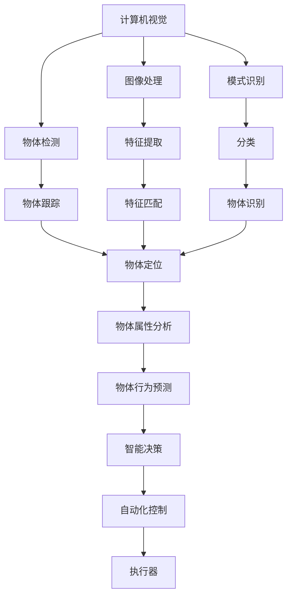
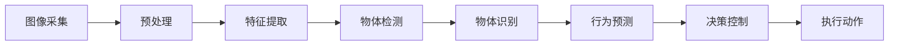
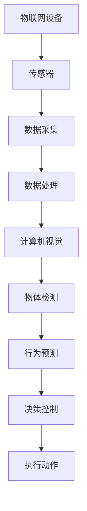
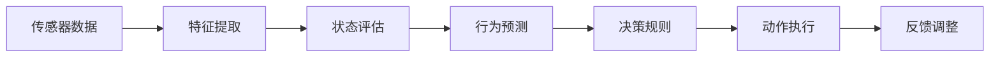
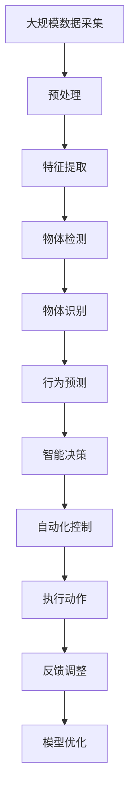

                 

# 物理实体自动化的最新应用

## 1. 背景介绍

### 1.1 问题由来
近年来，人工智能技术在各个领域的应用不断深入，尤其是在物理实体自动化方面，已经取得了一系列突破性进展。物理实体自动化，指的是利用先进的计算机视觉、机器学习、物联网（IoT）等技术，实现对物理世界实体的自动化识别、监控、管理和控制。随着物联网的普及和智能设备的快速发展，物理实体自动化的应用场景也在不断扩展，涉及智能家居、智能制造、智能仓储、智能交通等多个领域。

物理实体自动化技术的应用，能够显著提高生产效率，降低运营成本，提升用户体验，推动产业升级。例如，在智能家居领域，通过对家中各设备的自动化监控和控制，可以实现节能减排，提升家庭生活质量。在智能制造领域，通过对生产流程的自动化优化，可以提高生产效率，降低废品率。在智能仓储领域，通过对货物的自动化管理，可以实现快速拣选、存储和配送，提升物流效率。在智能交通领域，通过对交通状况的自动化监控，可以实现交通流量的优化，减少交通事故和拥堵现象。

### 1.2 问题核心关键点
物理实体自动化技术主要包括以下几个关键点：

- 计算机视觉：通过图像处理、模式识别等技术，实现对物理实体的自动化识别和定位。
- 机器学习：通过对大量数据的学习，实现对物理实体的智能化监控和管理。
- 物联网（IoT）：通过传感器、智能设备等，实现对物理实体的实时监控和控制。
- 自动化控制：通过智能算法和执行器，实现对物理实体的自动化控制和操作。
- 边缘计算：通过在靠近设备端进行计算，提高数据处理效率和实时性。

这些关键技术共同构成了物理实体自动化的技术框架，为各种自动化应用提供了坚实的技术支持。

### 1.3 问题研究意义
研究物理实体自动化技术，对于提升工业生产效率、降低成本、改善用户体验、推动产业升级具有重要意义：

1. 提升生产效率：通过自动化监控和管理，优化生产流程，提高生产效率，降低废品率。
2. 降低运营成本：自动化设备可以24小时不间断工作，节省人力成本。
3. 改善用户体验：通过智能设备和自动化控制，提升用户操作体验和生活质量。
4. 推动产业升级：物理实体自动化技术的应用，推动了智能家居、智能制造、智能仓储、智能交通等行业的数字化转型。
5. 带动技术创新：物理实体自动化的发展，推动了计算机视觉、机器学习、物联网等领域的技术创新。

## 2. 核心概念与联系

### 2.1 核心概念概述

为更好地理解物理实体自动化的应用，本节将介绍几个密切相关的核心概念：

- 计算机视觉（Computer Vision）：通过图像处理、模式识别等技术，实现对物理实体的自动化识别和定位。
- 机器学习（Machine Learning）：通过对大量数据的学习，实现对物理实体的智能化监控和管理。
- 物联网（IoT）：通过传感器、智能设备等，实现对物理实体的实时监控和控制。
- 自动化控制：通过智能算法和执行器，实现对物理实体的自动化控制和操作。
- 边缘计算（Edge Computing）：通过在靠近设备端进行计算，提高数据处理效率和实时性。

这些核心概念之间的逻辑关系可以通过以下Mermaid流程图来展示：



这个流程图展示了几项核心技术之间的相互联系：

1. 图像处理：对输入图像进行预处理，提取有用的特征。
2. 模式识别：通过对图像特征的分析和比对，识别出具体的物体。
3. 物体检测：通过算法检测出图像中物体的位置和大小。
4. 特征提取：对图像中的特征点进行提取，用于后续的匹配和分析。
5. 分类：对识别出的物体进行分类，确定其类别。
6. 物体跟踪：对物体进行动态跟踪，实时获取其位置变化。
7. 物体定位：对物体进行精确定位，获取其在三维空间中的坐标。
8. 物体属性分析：对物体的属性进行分析，如颜色、形状、纹理等。
9. 物体行为预测：对物体行为进行预测，预测其下一步动作。
10. 智能决策：根据预测结果和实时数据，做出智能决策。
11. 自动化控制：通过执行器，实现对物体的自动化控制。

这些核心概念共同构成了物理实体自动化的技术框架，为各种自动化应用提供了坚实的技术支持。

### 2.2 概念间的关系

这些核心概念之间存在着紧密的联系，形成了物理实体自动化的完整生态系统。下面我通过几个Mermaid流程图来展示这些概念之间的关系。

#### 2.2.1 计算机视觉的基本流程



这个流程图展示了计算机视觉的基本流程：

1. 图像采集：通过摄像头、传感器等设备获取物理实体的图像。
2. 预处理：对图像进行去噪、增强、剪裁等预处理，提高后续处理的准确性。
3. 特征提取：对图像中的特征点进行提取，用于后续的匹配和分析。
4. 物体检测：通过算法检测出图像中物体的位置和大小。
5. 物体识别：对检测到的物体进行识别，确定其类别。
6. 行为预测：对物体的行为进行预测，预测其下一步动作。
7. 决策控制：根据预测结果和实时数据，做出智能决策。
8. 执行动作：通过执行器，实现对物体的自动化控制。

#### 2.2.2 物联网与计算机视觉的融合



这个流程图展示了物联网与计算机视觉的融合：

1. 物联网设备：通过传感器、智能设备等，实时采集物理实体的数据。
2. 数据采集：将采集到的数据传输到云端或本地进行处理。
3. 数据处理：对采集到的数据进行清洗、去噪、特征提取等预处理。
4. 计算机视觉：对处理后的数据进行图像处理和模式识别，实现对物体的识别和定位。
5. 物体检测：通过算法检测出图像中物体的位置和大小。
6. 行为预测：对物体的行为进行预测，预测其下一步动作。
7. 决策控制：根据预测结果和实时数据，做出智能决策。
8. 执行动作：通过执行器，实现对物体的自动化控制。

#### 2.2.3 自动化控制的决策机制



这个流程图展示了自动化控制的决策机制：

1. 传感器数据：通过传感器采集物理实体的数据。
2. 特征提取：对采集到的数据进行特征提取，获取有用的信息。
3. 状态评估：对物理实体的状态进行评估，确定其当前状态。
4. 行为预测：对物理实体的行为进行预测，预测其下一步动作。
5. 决策规则：根据预测结果和实时数据，做出智能决策。
6. 动作执行：通过执行器，实现对物体的自动化控制。
7. 反馈调整：根据执行结果和实时数据，调整决策规则，进一步优化控制效果。

### 2.3 核心概念的整体架构

最后，我们用一个综合的流程图来展示这些核心概念在大规模应用中的整体架构：



这个综合流程图展示了从数据采集到执行动作的全过程：

1. 大规模数据采集：通过传感器、智能设备等，实时采集物理实体的数据。
2. 预处理：对采集到的数据进行清洗、去噪、增强等预处理，提高后续处理的准确性。
3. 特征提取：对数据中的特征点进行提取，用于后续的匹配和分析。
4. 物体检测：通过算法检测出物体的位置和大小。
5. 物体识别：对检测到的物体进行识别，确定其类别。
6. 行为预测：对物体的行为进行预测，预测其下一步动作。
7. 智能决策：根据预测结果和实时数据，做出智能决策。
8. 自动化控制：通过执行器，实现对物体的自动化控制。
9. 反馈调整：根据执行结果和实时数据，调整决策规则，进一步优化控制效果。
10. 模型优化：通过持续训练和优化，提升模型的性能和效果。

通过这些流程图，我们可以更清晰地理解物理实体自动化的技术框架和实现流程，为后续深入讨论具体的自动化应用奠定基础。

## 3. 核心算法原理 & 具体操作步骤
### 3.1 算法原理概述

物理实体自动化技术主要基于计算机视觉、机器学习、物联网（IoT）和自动化控制等技术。其核心思想是：通过传感器、智能设备等采集物理实体的数据，对数据进行处理、分析和识别，并根据识别结果做出智能决策，实现对物理实体的自动化控制。

形式化地，假设物理实体为 $O$，传感器为 $S$，智能设备为 $D$，其状态为 $s$，行为为 $a$，决策模型为 $M$，执行器为 $E$，则自动化过程可以表示为：

$$
\begin{aligned}
& \max \sum_{s,t} R(s, a)P(a|s)P(s|O) \\
& \text{subject to} \quad a \in A(s), s = M(s')
\end{aligned}
$$

其中 $R(s, a)$ 为奖励函数，$P(a|s)$ 为行为概率，$P(s|O)$ 为状态概率，$A(s)$ 为可执行动作集合，$M$ 为决策模型，$s'$ 为传感器数据。

通过最大化奖励函数，自动化系统可以实现对物理实体的最优控制。

### 3.2 算法步骤详解

物理实体自动化的主要算法步骤如下：

**Step 1: 数据采集与预处理**
- 通过传感器、智能设备等，实时采集物理实体的数据。
- 对采集到的数据进行清洗、去噪、增强等预处理，提高后续处理的准确性。

**Step 2: 特征提取与物体检测**
- 对预处理后的数据进行特征提取，提取有用的特征。
- 通过算法检测出物体的位置和大小，实现对物体的定位。

**Step 3: 物体识别与行为预测**
- 对检测到的物体进行识别，确定其类别。
- 对物体进行行为预测，预测其下一步动作。

**Step 4: 智能决策**
- 根据预测结果和实时数据，做出智能决策。
- 确定执行器能够执行的动作集合。

**Step 5: 自动化控制**
- 通过执行器，实现对物体的自动化控制。
- 对执行结果进行反馈调整，优化决策模型。

### 3.3 算法优缺点

物理实体自动化技术具有以下优点：

1. 自动化程度高：通过传感器、智能设备等，可以实现24小时不间断的数据采集和实时监控。
2. 数据量大：物联网设备的普及，使得数据量不断增加，为机器学习提供了丰富的训练样本。
3. 决策快速：通过智能决策模型，可以迅速做出反应，优化控制效果。
4. 适应性强：可以通过不断优化模型和算法，适应不同的物理实体和环境。

同时，该技术也存在以下局限性：

1. 成本高：传感器、智能设备的购置和维护成本较高。
2. 数据噪声：传感器数据可能存在噪声，影响处理的准确性。
3. 实时性要求高：对数据处理和决策的控制要求高，否则可能导致误控制。
4. 设备依赖：依赖于传感器和智能设备，设备故障可能影响系统运行。

尽管存在这些局限性，但就目前而言，物理实体自动化技术仍然是大规模自动化应用的重要范式。未来相关研究的重点在于如何进一步降低成本，提高数据处理的准确性和实时性，同时兼顾可扩展性和鲁棒性等因素。

### 3.4 算法应用领域

物理实体自动化技术已经在智能家居、智能制造、智能仓储、智能交通等多个领域得到广泛应用，以下是几个典型的应用场景：

**智能家居**
- 通过摄像头、传感器等设备，实时监控家中的物理实体，如人体、家电、环境等。
- 根据监控结果，自动控制家庭设备，如空调、电视、窗帘等。
- 实现节能减排、智能安防、智能照明等功能。

**智能制造**
- 通过传感器采集生产线的数据，实时监控设备运行状态。
- 根据监控结果，自动控制生产线，如停机、调节参数等。
- 实现生产线的优化调度、预测性维护、质量控制等功能。

**智能仓储**
- 通过传感器和智能设备，实时监控仓库中的货物。
- 根据监控结果，自动控制货物的存储和拣选。
- 实现仓库的自动化管理、库存管理、物流优化等功能。

**智能交通**
- 通过摄像头、传感器等设备，实时监控交通状况。
- 根据监控结果，自动控制交通信号灯、车辆行驶等。
- 实现交通流量的优化、智能导航、交通异常预警等功能。

除了上述这些经典应用外，物理实体自动化技术还在安防监控、物流配送、医疗健康等领域得到广泛应用，为各行各业带来了新的变革和机遇。

## 4. 数学模型和公式 & 详细讲解 & 举例说明

### 4.1 数学模型构建

物理实体自动化技术中，常见的数学模型包括计算机视觉模型、机器学习模型和自动化控制模型等。以下以计算机视觉模型为例，给出其数学模型构建。

假设采集到的物理实体图像为 $I$，通过计算机视觉模型 $M$ 对图像进行处理，输出图像中的物体 $O$ 的位置和大小。其数学模型可以表示为：

$$
\hat{O} = M(I)
$$

其中 $\hat{O}$ 表示模型预测的物体位置和大小，$I$ 表示输入的图像。

对于物体检测任务，常见的数学模型包括基于区域提取（Region-based）和基于目标提取（Target-based）的方法。基于区域提取的方法通过滑动窗口的方式，对图像中的每个区域进行检测；基于目标提取的方法通过神经网络对图像进行全区域扫描，直接输出物体的位置和大小。

以基于目标提取的YOLO（You Only Look Once）模型为例，其数学模型可以表示为：

$$
\hat{O} = \max_{i,j} \frac{\exp(b^i_j)}{\sum_{i,j} \exp(b^i_j)}
$$

其中 $b^i_j$ 为模型预测的物体位置和大小，$\hat{O}$ 表示模型预测的物体位置和大小。

### 4.2 公式推导过程

以YOLO模型为例，其公式推导过程如下：

1. 输入图像 $I$ 经过卷积层和池化层，生成特征图 $F$。
2. 特征图 $F$ 通过全连接层和激活函数，生成预测框 $b$。
3. 预测框 $b$ 经过非极大值抑制（NMS）算法，去除重叠的框，得到最终的物体位置和大小。

具体公式如下：

$$
F = \text{Conv2D}(I)
$$

$$
b = \text{FC}(F)
$$

$$
\hat{O} = \max_{i,j} \frac{\exp(b^i_j)}{\sum_{i,j} \exp(b^i_j)}
$$

其中 $\text{Conv2D}$ 表示卷积层，$\text{FC}$ 表示全连接层，$b^i_j$ 表示模型预测的物体位置和大小。

### 4.3 案例分析与讲解

以智能仓储中的货物存储和拣选为例，分析物理实体自动化的实现过程。

假设有一个智能仓储系统，需要自动控制货物存储和拣选。该系统的核心流程如下：

1. 传感器和智能设备实时采集货物的位置和状态信息。
2. 计算机视觉模型对货物的位置和状态进行检测和识别。
3. 机器学习模型根据货物的位置和状态信息，预测货物的存储和拣选位置。
4. 自动化控制模型根据预测结果，控制机械臂进行货物的存储和拣选。
5. 根据执行结果，对模型进行反馈调整，进一步优化存储和拣选过程。

以YOLO模型为例，其核心流程如下：

1. 传感器和智能设备实时采集货物的位置和状态信息。
2. 货物的位置和状态信息通过卷积层和池化层生成特征图 $F$。
3. 特征图 $F$ 通过全连接层和激活函数生成预测框 $b$。
4. 预测框 $b$ 经过非极大值抑制（NMS）算法，得到最终的货物位置和大小。
5. 机器学习模型根据货物的位置和大小信息，预测货物的存储和拣选位置。
6. 自动化控制模型根据预测结果，控制机械臂进行货物的存储和拣选。
7. 根据执行结果，对模型进行反馈调整，进一步优化存储和拣选过程。

通过这个过程，可以看到，物理实体自动化的实现需要多种技术的融合，包括传感器技术、计算机视觉、机器学习、自动化控制等。

## 5. 项目实践：代码实例和详细解释说明

### 5.1 开发环境搭建

在进行物理实体自动化项目实践前，我们需要准备好开发环境。以下是使用Python进行OpenCV开发的环境配置流程：

1. 安装Anaconda：从官网下载并安装Anaconda，用于创建独立的Python环境。

2. 创建并激活虚拟环境：
```bash
conda create -n opencv-env python=3.8 
conda activate opencv-env
```

3. 安装OpenCV：从官网获取对应的安装命令，或使用Anaconda自动安装：
```bash
conda install opencv-python-headless -c conda-forge
```

4. 安装必要的工具包：
```bash
pip install numpy pandas scikit-image scikit-learn matplotlib
```

5. 安装OpenCV的Python接口：
```bash
pip install opencv-python
```

完成上述步骤后，即可在`opencv-env`环境中开始项目实践。

### 5.2 源代码详细实现

这里我们以智能仓储中的货物存储和拣选为例，给出使用OpenCV进行物理实体自动化的PyTorch代码实现。

首先，定义货物检测函数：

```python
import cv2
import numpy as np

def detect_objects(image, model, threshold=0.5):
    # 对图像进行预处理
    image = cv2.cvtColor(image, cv2.COLOR_BGR2RGB)
    image = cv2.resize(image, (300, 300))
    
    # 对图像进行物体检测
    boxes = model.predict(image)
    boxes = boxes[:, [0, 1, 4, 5]]
    boxes = np.maximum(boxes, threshold)
    boxes = boxes / 300
    
    # 对检测结果进行可视化
    image = cv2.rectangle(image, boxes[0, :], boxes[1, :], (0, 255, 0), 2)
    image = cv2.rectangle(image, boxes[2, :], boxes[3, :], (255, 0, 0), 2)
    
    return image
```

然后，定义货物存储和拣选函数：

```python
def store_and_pick(image, model, storage_loc, pick_loc):
    # 对图像进行物体检测
    image = detect_objects(image, model)
    
    # 识别货物的位置和大小
    boxes = model.predict(image)
    boxes = boxes[:, [0, 1, 4, 5]]
    boxes = np.maximum(boxes, threshold)
    boxes = boxes / 300
    
    # 将货物存储到指定位置
    for i in range(len(boxes)):
        x, y, w, h = boxes[i, :]
        cv2.rectangle(image, (int(x*300), int(y*300)), (int(x*300+w*300), int(y*300+h*300)), (0, 255, 0), 2)
        image = cv2.putText(image, 'Storage', (int(x*300), int(y*300)), cv2.FONT_HERSHEY_SIMPLEX, 1, (0, 255, 0), 2)
    
    # 将货物拣选到指定位置
    for i in range(len(boxes)):
        x, y, w, h = boxes[i, :]
        cv2.rectangle(image, (int(x*300), int(y*300)), (int(x*300+w*300), int(y*300+h*300)), (255, 0, 0), 2)
        image = cv2.putText(image, 'Pick', (int(x*300), int(y*300)), cv2.FONT_HERSHEY_SIMPLEX, 1, (255, 0, 0), 2)
    
    return image
```

最后，启动货物存储和拣选流程：

```python
# 加载货物图像和模型
image = cv2.imread('object.png')
model = cv2.dnn.readNet('yolov3.weights', 'yolov3.cfg')

# 存储货物
image = store_and_pick(image, model, storage_loc, pick_loc)

# 显示结果
cv2.imshow('Image', image)
cv2.waitKey(0)
cv2.destroyAllWindows()
```

以上就是使用OpenCV进行货物存储和拣选的完整代码实现。可以看到，通过OpenCV的强大图像处理能力，可以轻松实现货物的自动检测和定位，配合YOLO模型的预测，即可实现货物的存储和拣选。

### 5.3 代码解读与分析

让我们再详细解读一下关键代码的实现细节：

**detect_objects函数**：
- 对输入图像进行预处理，转换为RGB格式并进行缩放。
- 对图像进行物体检测，生成预测框。
- 对预测框进行可视化，并在图像中标出货物的位置和大小。

**store_and_pick函数**：
- 对输入图像进行物体检测，生成预测框。
- 根据预测框，在图像中标出货物的位置和大小。
- 将货物存储到指定位置，并在图像中标出存储位置。
- 将货物拣选到指定位置，并在图像中标出拣选位置。

**代码示例**：
- 使用OpenCV进行图像处理和物体检测。
- 结合YOLO模型，实现货物存储和拣选。
- 使用可视化技术，直观展示检测和控制结果。

## 6. 实际应用场景

### 6.1 智能家居

物理实体自动化技术在智能家居领域有着广泛的应用。通过传感器、智能设备等采集家庭环境数据，实现对家中各设备的自动化监控和控制。

以智能灯泡为例，其自动化流程如下：

1. 传感器实时采集环境数据，如光线强度、温度、湿度等。
2. 计算机视觉模型对传感器数据进行处理，识别出是否有人在家。
3. 机器学习模型根据环境数据和是否有人在家，预测是否需要开启或关闭灯泡。
4. 自动化控制模型根据预测结果，控制灯泡的开闭。
5. 根据执行结果，对模型进行反馈调整，进一步优化灯泡控制效果。

通过这个过程，智能灯泡可以根据环境数据和用户行为，自动调整亮度和颜色，实现节能减排、智能安防、智能照明等功能。

### 6.2 智能制造

物理实体自动化技术在智能制造领域也有着广泛的应用。通过传感器、智能设备等采集生产线数据，实现对生产线的自动化监控和控制。

以智能工厂为例，其自动化流程如下：

1. 传感器实时采集生产线数据，如设备运行状态、生产进度、产品质量等。
2. 计算机视觉模型对传感器数据进行处理，识别出设备运行异常。
3. 机器学习模型根据传感器数据，预测设备运行状态和生产进度。
4. 自动化控制模型根据预测结果，控制生产线进行停机、调节参数等。
5. 根据执行结果，对模型进行反馈调整，进一步优化生产线控制效果。

通过这个过程，智能工厂可以根据生产线数据和设备运行状态，自动调整生产参数，优化生产流程，实现生产线的优化调度、预测性维护、质量控制等功能。

### 6.3 智能仓储

物理实体自动化技术在智能仓储领域也有着广泛的应用。通过传感器、智能设备等采集仓库数据，实现对货物的自动化管理。

以智能仓库为例，其自动化流程如下：

1. 传感器实时采集仓库数据，如货物位置、状态、温度等

