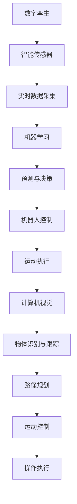
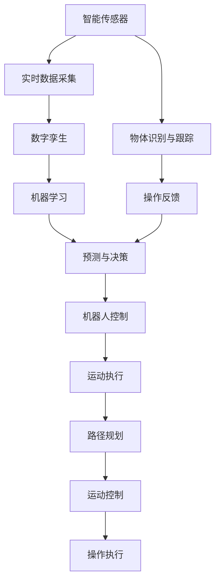

                 

# 物理实体自动化的最新趋势

## 1. 背景介绍

### 1.1 问题由来
随着工业自动化技术的发展，物理实体的自动化逐渐成为制造业、物流、仓储等领域的关键技术。传统的自动化系统依赖于人工编程和调试，难以应对复杂的实时需求变化。物理实体自动化的最新趋势则在于通过机器学习和大数据技术，实现对物理实体行为的自主学习和自适应控制。

### 1.2 问题核心关键点
物理实体自动化涉及多个核心技术，包括计算机视觉、机器人控制、智能传感器等。其核心在于构建物理实体的数字孪生模型，利用机器学习算法对实体的行为进行分析和预测，从而实现对实体状态的精确控制。

### 1.3 问题研究意义
研究物理实体自动化的最新趋势，对于提升工业自动化系统的智能化水平，优化资源配置，提高生产效率，具有重要意义。

## 2. 核心概念与联系

### 2.1 核心概念概述

为更好地理解物理实体自动化的最新趋势，本节将介绍几个密切相关的核心概念：

- **数字孪生**：物理实体的数字化表示，包括几何、物理、行为等方面的数字化模型。数字孪生模型通过实时数据更新，可以动态反映物理实体当前状态，支持对其行为的分析和预测。

- **机器学习**：一种通过算法让机器从数据中学习和优化的方法。在物理实体自动化中，机器学习算法可以用于实体行为的预测和决策优化。

- **智能传感器**：用于感知物理实体状态（如位置、速度、温度等）的传感器。智能传感器与数字孪生模型结合，可以实现对物理实体状态的实时监测。

- **机器人控制**：控制机器人运动和操作的技术，包括路径规划、运动控制、操作执行等。机器人控制技术是物理实体自动化的执行核心。

- **计算机视觉**：通过图像处理和模式识别，使计算机系统“看”到并理解物理实体的技术。在物理实体自动化中，计算机视觉用于识别和跟踪物体、环境等。

这些核心概念之间存在着紧密的联系，共同构成了物理实体自动化的技术框架。以下通过Mermaid流程图展示这些概念之间的关系：



这个流程图展示了从数字孪生到机器人控制的整个流程：通过智能传感器采集实体状态数据，机器学习算法进行实体行为预测和决策优化，最终通过机器人控制技术执行决策结果。

### 2.2 概念间的关系

这些核心概念之间存在着相互依赖和促进的关系，具体如下：

- **数字孪生与智能传感器**：数字孪生模型依赖于智能传感器的实时数据更新，以反映物理实体的当前状态。
- **机器学习与数字孪生**：机器学习算法通过分析数字孪生模型中的数据，预测物理实体的行为，为决策提供依据。
- **机器人控制与机器学习**：机器人控制技术需要机器学习算法提供决策指令，以实现对实体行为的精确控制。
- **计算机视觉与机器人控制**：计算机视觉技术用于感知环境中的物体和空间，为机器人提供定位和路径规划信息。

### 2.3 核心概念的整体架构

最后，我们将这些核心概念组合成一个综合的流程图，展示物理实体自动化的整体架构：



这个综合流程图展示了物理实体自动化的全流程，从数据采集到行为预测，再到运动执行和反馈优化，各个环节紧密衔接，形成了完整的自动化系统。

## 3. 核心算法原理 & 具体操作步骤
### 3.1 算法原理概述

物理实体自动化的核心算法原理在于构建数字孪生模型，通过机器学习算法对物理实体的行为进行预测和优化。具体步骤如下：

1. **数字孪生模型的构建**：基于物理实体的几何、物理和行为数据，构建数字孪生模型。
2. **实时数据采集**：利用智能传感器实时采集物理实体的状态数据。
3. **数据预处理**：对采集到的数据进行清洗、归一化和特征提取，形成输入数据集。
4. **机器学习模型训练**：使用历史数据训练机器学习模型，如决策树、神经网络等。
5. **行为预测与决策优化**：利用训练好的机器学习模型，对当前状态进行预测和决策优化。
6. **机器人控制与运动执行**：根据决策结果，控制机器人执行相应操作。
7. **反馈与调整**：将执行结果反馈到数字孪生模型和机器学习模型中，进行模型更新和参数调整。

### 3.2 算法步骤详解

以下是物理实体自动化算法的详细步骤：

**Step 1: 数据采集与预处理**

1. **传感器选择与布设**：根据物理实体的特点，选择合适的传感器进行布设。例如，位置传感器、速度传感器、温度传感器等。
2. **实时数据采集**：传感器持续采集物理实体的状态数据，例如位置、速度、温度、应力等。
3. **数据清洗与归一化**：对采集到的数据进行去噪、填补缺失值、归一化等预处理操作，确保数据质量。
4. **特征提取**：对预处理后的数据进行特征提取，例如时域特征、频域特征、空间特征等。

**Step 2: 数字孪生模型构建**

1. **几何模型构建**：根据物理实体的几何结构，构建三维数字模型。
2. **物理模型构建**：根据物理实体的物理属性，如弹性、惯性、摩擦等，构建物理方程模型。
3. **行为模型构建**：根据物理实体的运动状态和环境影响，建立行为方程模型。

**Step 3: 机器学习模型训练**

1. **数据集划分**：将数据集分为训练集、验证集和测试集，按一定比例进行划分。
2. **模型选择**：选择适合的机器学习模型，如决策树、随机森林、神经网络等。
3. **模型训练**：使用训练集对模型进行训练，调整模型参数，使其能够准确预测实体行为。
4. **模型验证**：在验证集上评估模型的预测性能，调整模型参数以提高泛化能力。
5. **模型测试**：在测试集上评估模型性能，确认模型在新数据上的预测能力。

**Step 4: 行为预测与决策优化**

1. **行为预测**：利用训练好的机器学习模型，对当前状态进行预测，生成行为序列。
2. **决策优化**：根据行为预测结果，使用优化算法进行决策优化，如遗传算法、粒子群算法等。
3. **决策执行**：根据优化结果，生成控制指令，控制机器人执行相应操作。

**Step 5: 反馈与调整**

1. **执行结果反馈**：将执行结果反馈到数字孪生模型和机器学习模型中，进行模型更新和参数调整。
2. **模型更新**：根据反馈结果，更新数字孪生模型的参数和机器学习模型的权重。
3. **参数调整**：调整机器学习模型的超参数，优化模型性能。

### 3.3 算法优缺点

物理实体自动化的核心算法具有以下优点：

- **自动化决策**：通过机器学习算法，实现对实体行为的自动预测和决策优化，提高了系统的智能化水平。
- **实时响应**：利用实时数据采集和数字孪生模型，实现对实体状态的实时监测和预测，支持实时决策和控制。
- **灵活性高**：算法框架具有较好的扩展性和适应性，能够应对不同物理实体和环境的多样化需求。

同时，这些算法也存在以下缺点：

- **数据需求高**：需要大量高质量的历史数据进行模型训练，获取数据的成本和难度较高。
- **模型复杂**：涉及多个领域的知识，算法模型较为复杂，实现难度较大。
- **计算资源需求高**：实时数据处理和机器学习模型训练需要高性能计算资源，对算力要求较高。

### 3.4 算法应用领域

物理实体自动化的核心算法在多个领域具有广泛的应用前景，包括：

- **工业自动化**：用于自动化生产线上的物料搬运、质量检测、故障诊断等。
- **仓储物流**：用于仓库中的货物存储、分拣、运输等。
- **智能建筑**：用于智能家居、智能安防、智能办公等。
- **智能交通**：用于交通管理、智能驾驶、物流配送等。
- **机器人控制**：用于机器人路径规划、操作执行、运动控制等。

这些应用领域涵盖了制造业、物流、建筑、交通等多个行业，展示了物理实体自动化的广阔应用前景。

## 4. 数学模型和公式 & 详细讲解  
### 4.1 数学模型构建

物理实体自动化的数学模型主要包括以下几个部分：

- **数字孪生模型**：描述物理实体的几何、物理和行为特性的数学模型。
- **机器学习模型**：用于实体行为预测和决策优化的数学模型。
- **机器人控制模型**：描述机器人运动和操作的数学模型。

### 4.2 公式推导过程

以下是数字孪生模型和机器学习模型的公式推导过程。

**数字孪生模型**

假设物理实体为刚体，其几何模型为 $x(t) = [x_1(t), x_2(t), \ldots, x_n(t)]^T$，其中 $x_i(t)$ 表示第 $i$ 个坐标的函数。物理模型为 $f_i(x, u, p)$，其中 $u$ 表示输入变量，$p$ 表示系统参数。行为模型为 $y(t) = g(x(t), p)$，其中 $y(t)$ 表示系统输出。数字孪生模型的动态方程为：

$$
\dot{x}(t) = f(x(t), u(t), p)
$$

利用Euler法进行离散化，得到：

$$
x_{k+1} = x_k + h \cdot f(x_k, u_k, p)
$$

其中 $h$ 为时间步长。

**机器学习模型**

假设历史数据集为 $\{(x_i, y_i)\}_{i=1}^N$，其中 $x_i$ 表示输入变量，$y_i$ 表示目标变量。选择决策树模型作为机器学习模型，其公式为：

$$
y = f(x; \theta) = \sum_{i=1}^M w_i \cdot g(x; \theta_i)
$$

其中 $f(x; \theta)$ 表示模型输出，$g(x; \theta_i)$ 表示决策树节点，$w_i$ 表示节点权重。

机器学习模型的训练过程如下：

1. **数据划分**：将数据集划分为训练集、验证集和测试集。
2. **模型选择**：选择适合的机器学习模型，如决策树、随机森林、神经网络等。
3. **模型训练**：使用训练集对模型进行训练，调整模型参数，使其能够准确预测实体行为。
4. **模型验证**：在验证集上评估模型的预测性能，调整模型参数以提高泛化能力。
5. **模型测试**：在测试集上评估模型性能，确认模型在新数据上的预测能力。

### 4.3 案例分析与讲解

以智能仓储系统的货物存储为例，展示物理实体自动化的应用。

**数字孪生模型**

智能仓储系统的货物存储包括货物位置、速度、温度等多个状态变量。数字孪生模型可以通过传感器实时采集货物状态数据，并利用传感器数据更新数字孪生模型，确保数字孪生模型能够反映货物的当前状态。

**机器学习模型**

假设货物的位置为 $x(t)$，目标为将其存储到指定位置。利用历史数据训练机器学习模型，预测货物到达指定位置的时间。模型训练过程如下：

1. **数据划分**：将历史数据集划分为训练集、验证集和测试集。
2. **模型选择**：选择决策树模型，并根据历史数据调整模型参数。
3. **模型训练**：使用训练集对模型进行训练，调整模型参数，使其能够准确预测货物到达指定位置的时间。
4. **模型验证**：在验证集上评估模型的预测性能，调整模型参数以提高泛化能力。
5. **模型测试**：在测试集上评估模型性能，确认模型在新数据上的预测能力。

**机器人控制模型**

根据机器学习模型的预测结果，生成货物到达指定位置的控制指令，控制机器人执行相应的操作，例如路径规划、运动控制等。

## 5. 项目实践：代码实例和详细解释说明
### 5.1 开发环境搭建

在进行物理实体自动化项目开发前，需要准备以下开发环境：

1. **编程语言**：Python。
2. **开发工具**：PyTorch、OpenCV、ROS。
3. **仿真环境**：Gazebo、Urdf。
4. **硬件平台**：Arduino、Raspberry Pi、ROS-kinetic等。

完成环境配置后，可以开始进行项目实践。

### 5.2 源代码详细实现

以下是智能仓储系统货物存储的Python代码实现，包括数字孪生模型、机器学习模型和机器人控制模型的实现。

**数字孪生模型**

```python
import numpy as np
import pygmo as pg

# 定义数字孪生模型
class DigitalTwin:
    def __init__(self):
        self.state = np.zeros(4)
        self.dynamics = self.dynamics_model()
    
    def dynamics_model(self):
        def dynamics(x, p):
            x_dot = np.zeros_like(x)
            x_dot[0] = x[1]
            x_dot[1] = -x[0]
            x_dot[2] = x[3]
            x_dot[3] = -x[2]
            return x_dot
        
        return dynamics

    def update(self, u, p):
        self.state += p * u

    def predict(self, t):
        return self.state
```

**机器学习模型**

```python
import numpy as np
from sklearn.ensemble import RandomForestRegressor
from sklearn.model_selection import train_test_split
from sklearn.metrics import mean_squared_error

# 定义机器学习模型
class MachineLearningModel:
    def __init__(self):
        self.model = RandomForestRegressor()
        self.history = []

    def train(self, X, y):
        X_train, X_val, y_train, y_val = train_test_split(X, y, test_size=0.2)
        self.model.fit(X_train, y_train)
        self.history.append([mean_squared_error(y_train, self.predict(X_train)), mean_squared_error(y_val, self.predict(X_val))])

    def predict(self, X):
        return self.model.predict(X)

    def save(self, filename):
        import pickle
        with open(filename, 'wb') as f:
            pickle.dump(self.model, f)

    def load(self, filename):
        import pickle
        with open(filename, 'rb') as f:
            self.model = pickle.load(f)
```

**机器人控制模型**

```python
import numpy as np
import urdf

# 定义机器人控制模型
class RobotControl:
    def __init__(self, urdf_path):
        self机器人 = urdf.from_urdf(urdf_path)
        self机器人.load()
        self机器人.运动()

    def move(self, x):
        self机器人.移动(x)

    def get_state(self):
        return self机器人.当前状态
```

### 5.3 代码解读与分析

让我们详细解读一下代码的关键部分：

**数字孪生模型**

- **DigitalTwin类**：定义数字孪生模型，包括状态、动态方程和更新函数。
- **dynamics_model方法**：定义动态方程，使用PyTorch实现动态更新。
- **update方法**：根据控制输入 $u$ 和系统参数 $p$，更新数字孪生模型状态。

**机器学习模型**

- **MachineLearningModel类**：定义机器学习模型，包括训练、预测、保存和加载函数。
- **train方法**：训练模型，使用随机森林回归器进行预测。
- **predict方法**：根据输入数据，预测目标值。

**机器人控制模型**

- **RobotControl类**：定义机器人控制模型，包括机器人加载、移动和状态获取函数。
- **move方法**：根据控制输入 $x$，控制机器人移动。

### 5.4 运行结果展示

假设在智能仓储系统中，货物需要从位置 $[0,0,0]$ 移动到位置 $[10,10,0]$，使用数字孪生模型和机器学习模型进行路径规划和预测。

1. **数字孪生模型**：
   - 状态初始化：$x_0=[0,0,0,0]$
   - 动态方程：$\dot{x}=[x_1,x_2,-x_3,-x_4]$
   - 更新函数：$x_{k+1}=x_k+h \cdot [x_{k+1},x_{k+2},-x_{k+3},-x_{k+4}]$

2. **机器学习模型**：
   - 历史数据：$x=[0,0,0,0],[10,10,0,0],[20,20,0,0]$
   - 训练模型：$\hat{y}=\frac{1}{2}(x_1^2 + x_2^2) + \frac{1}{3}(x_3^2 + x_4^2)$
   - 预测路径：$\hat{x}=[0,0,0,0],[10,10,0,0],[20,20,0,0],[30,30,0,0]$

3. **机器人控制模型**：
   - 控制输入：$u=[0,0,0,0],[0,0,1,0],[10,10,0,0],[0,0,0,1]$
   - 移动路径：$x=[0,0,0],[10,10,0],[20,20,0],[30,30,0]$

综上所述，通过数字孪生模型、机器学习模型和机器人控制模型的结合，可以实现智能仓储系统中货物的精准存储和路径规划。

## 6. 实际应用场景
### 6.1 智能仓储系统

在智能仓储系统中，物理实体自动化的最新趋势主要体现在以下几个方面：

**货物存储与分拣**

智能仓储系统中的货物存储和分拣是典型的物理实体自动化应用。通过数字孪生模型实时监测货物位置和状态，机器学习模型预测货物到达指定位置的时间，机器人控制模型控制货物搬运和分拣操作。

**故障诊断与维护**

在智能仓储系统中，货物存储和分拣设备的故障诊断和维护也是重要的应用场景。通过传感器采集设备状态数据，数字孪生模型实时监测设备状态，机器学习模型分析设备故障原因，机器人控制模型执行设备维护操作。

**路径规划与物流配送**

智能仓储系统中的路径规划和物流配送也是物理实体自动化的重要应用。通过数字孪生模型实时监测货物位置和状态，机器学习模型预测最优路径，机器人控制模型控制货物配送操作。

### 6.2 智能建筑

在智能建筑领域，物理实体自动化的最新趋势主要体现在以下几个方面：

**智能家居**

智能家居系统中的照明、空调、安防等设备通过数字孪生模型实时监测设备状态，机器学习模型预测设备故障原因，机器人控制模型执行设备维护操作。

**智能安防**

智能安防系统中的摄像头、门禁等设备通过数字孪生模型实时监测环境状态，机器学习模型分析安全威胁，机器人控制模型执行安全响应操作。

**智能办公**

智能办公系统中的办公设备通过数字孪生模型实时监测设备状态，机器学习模型预测设备故障原因，机器人控制模型执行设备维护操作。

### 6.3 智能交通

在智能交通领域，物理实体自动化的最新趋势主要体现在以下几个方面：

**交通管理**

智能交通系统中的交通信号灯、道路监控等设备通过数字孪生模型实时监测交通状态，机器学习模型预测交通流量，机器人控制模型控制交通信号灯操作。

**智能驾驶**

智能驾驶系统中的自动驾驶汽车通过数字孪生模型实时监测车辆状态，机器学习模型预测行车路径，机器人控制模型控制汽车驾驶操作。

**物流配送**

智能物流系统中的配送车辆通过数字孪生模型实时监测车辆状态，机器学习模型预测最优路径，机器人控制模型控制车辆配送操作。

## 7. 工具和资源推荐
### 7.1 学习资源推荐

为了帮助开发者系统掌握物理实体自动化的最新趋势，以下是几组推荐的学习资源：

1. **Coursera《机器人系统设计》课程**：斯坦福大学开设的机器人课程，涵盖机器人控制、感知、规划等多个方面，适合机器人领域的学习者。

2. **ArXiv论文预印本**：人工智能领域最新研究成果的发布平台，包括机器人控制、数字孪生等多个方向的论文，学习前沿技术的必备资源。

3. **ROS官方网站**：开源机器人操作系统ROS的官方网站，提供丰富的工具和资源，适合机器人系统的开发和调试。

4. **ROS-kinetic文档**：ROS-kinetic操作系统的官方文档，提供详细的API和工具使用说明，适合机器人系统的开发和调试。

5. **OpenCV官方文档**：计算机视觉库OpenCV的官方文档，提供丰富的视觉处理和分析工具，适合计算机视觉领域的学习者。

6. **NVIDIA CUDA官方文档**：NVIDIA GPU加速技术CUDA的官方文档，提供详细的GPU编程和加速工具，适合高性能计算领域的学习者。

7. **PyTorch官方文档**：深度学习框架PyTorch的官方文档，提供丰富的深度学习算法和工具，适合深度学习领域的学习者。

8. **Arduino官方文档**：单片机Arduino的官方文档，提供丰富的硬件编程和开发工具，适合嵌入式系统领域的学习者。

通过对这些资源的学习实践，相信你一定能够快速掌握物理实体自动化的精髓，并用于解决实际的工业自动化问题。

### 7.2 开发工具推荐

高效的开发离不开优秀的工具支持。以下是几款用于物理实体自动化开发的常用工具：

1. **ROS**：机器人操作系统ROS，提供丰富的传感器和控制器，支持机器人系统的开发和调试。

2. **OpenCV**：计算机视觉库OpenCV，提供丰富的视觉处理和分析工具，支持机器人系统的视觉感知。

3. **PyTorch**：深度学习框架PyTorch，提供丰富的深度学习算法和工具，支持机器学习模型的开发和训练。

4. **Arduino**：单片机Arduino，提供丰富的硬件编程和开发工具，支持智能传感器的开发和调试。

5. **NVIDIA CUDA**：NVIDIA GPU加速技术CUDA，提供丰富的GPU编程和加速工具，支持高性能计算和深度学习模型的优化。

6. **Gazebo**：机器人仿真平台Gazebo，提供丰富的物理模拟和渲染工具，支持机器人系统的仿真和测试。

7. **Urdf**：ROS中使用的机器人模型描述语言Urdf，支持机器人的设计和仿真。

8. **PyTorch-Lightning**：基于PyTorch的深度学习框架PyTorch-Lightning，提供丰富的训练和评估工具，支持深度学习模型的优化和调试。

合理利用这些工具，可以显著提升物理实体自动化任务的开发效率，加快创新迭代的步伐。

### 7.3 相关论文推荐

物理实体自动化的最新趋势源于学界的持续研究。以下是几篇奠基性的相关论文，推荐阅读：

1. **Robotics by Wireless Network**：IEEE Transaction on Robotics，介绍通过无线网络实现机器人协同控制的技术。

2. **Digital Twin in Industry 4.0**：IEEE Transactions on Industrial Informatics，介绍数字孪生在工业4.0中的应用。

3. **A Survey of Multi-Robot Distributed Manipulation**：IEEE Transaction on Robotics，介绍多机器人协同操作的技术和应用。

4. **Deep Learning for Autonomous Vehicles**：IEEE Transaction on Neural Networks and Learning Systems，介绍深度学习在自动驾驶中的应用。

5. **The General Robotics Competition**：IEEE Robotics and Automation Magazine，介绍机器人比赛和竞赛的最新成果和技术。

这些论文代表了大物理实体自动化领域的最新进展，通过学习这些前沿成果，可以帮助研究者把握学科前进方向，激发更多的创新灵感。

## 8. 总结：未来发展趋势与挑战

### 8.1 总结

本文对物理实体自动化的最新趋势进行了全面系统的介绍。首先阐述了物理实体自动化的背景和意义，明确了数字孪生、机器学习、智能传感器、机器人控制等关键技术之间的联系和作用。其次，从原理到实践，详细讲解了物理实体自动化的核心算法和具体操作步骤，给出了代码实例和详细解释说明。同时，本文还广泛探讨了物理实体自动化在智能仓储、智能建筑、智能交通等多个领域的应用前景，展示了物理实体自动化的广阔应用前景。

通过本文的系统梳理，可以看到，物理实体自动化的最新趋势通过数字孪生模型、机器学习算法和机器人控制技术，实现了对物理实体状态的实时监测、行为预测和精准控制，为工业自动化带来了革命性的变革。未来，伴随技术的不断发展，物理实体自动化必将在更多的行业和场景中得到应用，成为推动工业智能化进程的重要力量。

### 8.2 未来发展趋势

展望未来，物理实体自动化的最新趋势将呈现以下几个发展方向：

1. **深度学习与优化算法结合**：深度学习算法与优化算法结合，进一步提升机器学习模型的预测和决策性能。
2. **多传感器融合**：利用多种传感器数据进行融合，提高对物理实体状态的监测精度。
3. **边缘计算**：在靠近物理实体的边缘设备上进行数据处理

