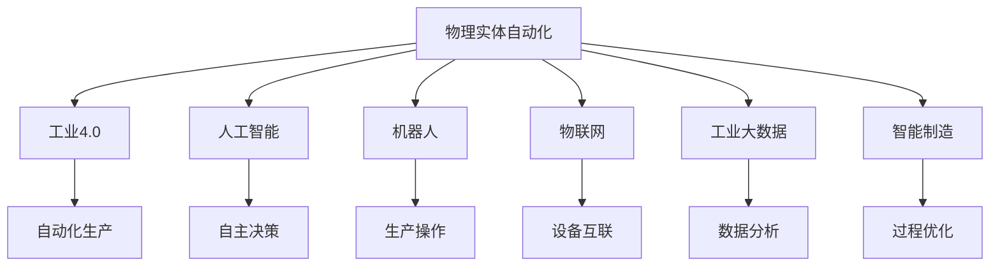
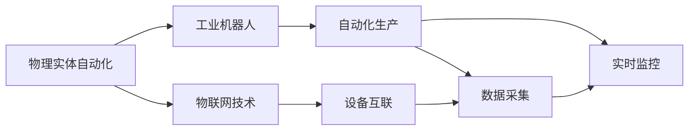
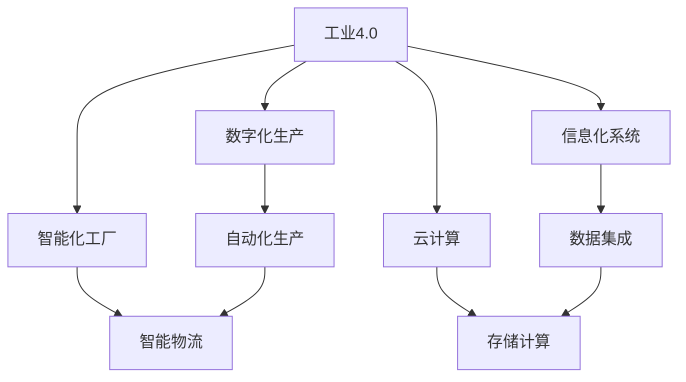
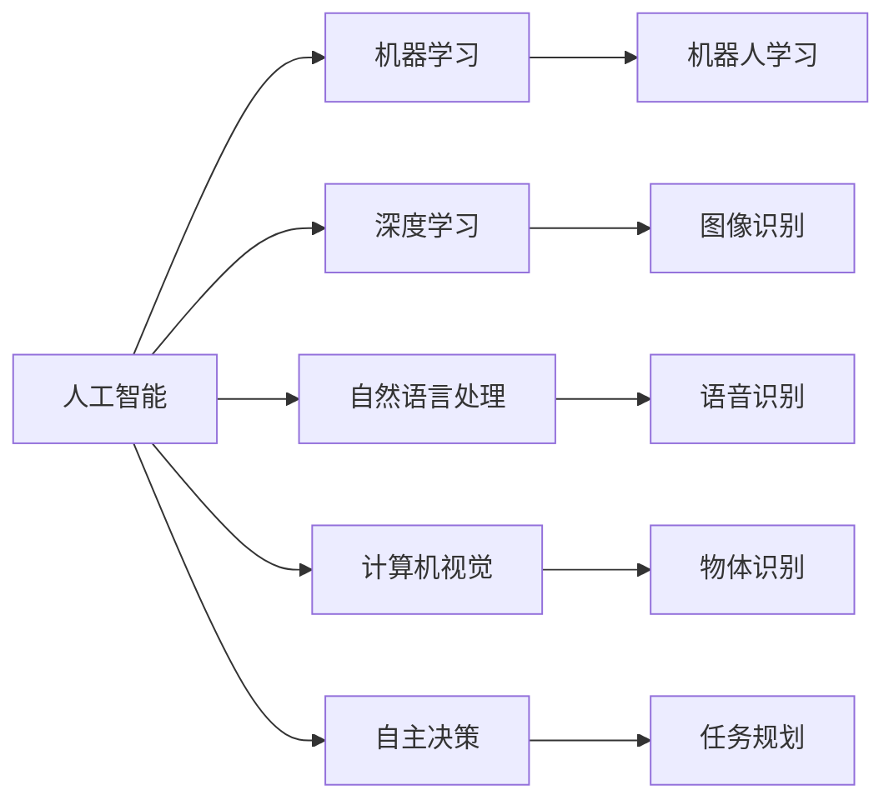
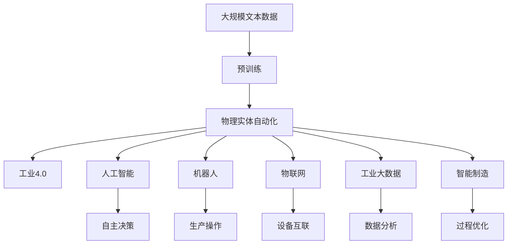

                 

# 物理实体自动化的未来方向

> 关键词：物理实体自动化,工业4.0,人工智能,机器人,物联网,未来趋势,智能制造

## 1. 背景介绍

### 1.1 问题由来
随着技术的进步，人类社会正在从工业化、信息化向智能化方向转变，这一趋势被形象地称为“工业4.0”。在这一过程中，物理实体的自动化程度将达到前所未有的高度，这不仅将极大地提升生产效率，还将彻底改变人类的生产方式和生活方式。

### 1.2 问题核心关键点
物理实体的自动化主要依赖于工业机器人和物联网(IoT)技术的发展。机器人可以实现自动化的生产、装配、搬运等操作，而物联网则通过传感器和网络技术，实现设备和数据的高效协同。这些技术的发展，使得物理实体的自动化成为可能，但也面临着数据量庞大、设备复杂、系统协同等问题。

### 1.3 问题研究意义
研究物理实体的自动化未来方向，对于推动工业4.0的发展，提升生产效率和质量，改善工作环境，具有重要的现实意义。同时，通过探索新的技术路径和解决方案，可以引领下一波技术革新，提升全球竞争力。

## 2. 核心概念与联系

### 2.1 核心概念概述

为更好地理解物理实体自动化的未来方向，本节将介绍几个密切相关的核心概念：

- 物理实体自动化：通过工业机器人和物联网技术，实现生产、装配、搬运等操作的自动化，提升生产效率和质量。
- 工业4.0：融合信息技术和制造业，实现智能制造，提升制造业的效率和灵活性。
- 人工智能：通过机器学习、深度学习等技术，提升机器人的智能化水平，使其具备自主决策和执行能力。
- 机器人：自动化执行器，能够完成复杂的生产操作和任务，是物理实体自动化的核心。
- 物联网：通过传感器、网络等技术，实现设备和数据的互联互通，是物理实体自动化的基础设施。
- 工业大数据：物理实体在生产和运营过程中产生的大量数据，通过分析和利用，提升生产效率和决策能力。
- 智能制造：通过人工智能技术，实现生产过程的智能化和优化，是物理实体自动化的高级阶段。

这些核心概念之间的逻辑关系可以通过以下Mermaid流程图来展示：



这个流程图展示了大语言模型微调过程中各个核心概念的关系和作用：

1. 物理实体自动化是基础，依托于工业4.0、人工智能、物联网、智能制造等技术的发展。
2. 工业4.0通过信息技术和制造业的融合，推动生产方式的智能化。
3. 人工智能赋予机器人自主决策和执行能力，是物理实体自动化的关键。
4. 物联网实现设备和数据的互联，是物理实体自动化的基础设施。
5. 工业大数据通过分析，提升生产效率和决策能力，是物理实体自动化的重要支撑。
6. 智能制造则代表了物理实体自动化的高级阶段，通过智能化技术实现生产过程的优化。

### 2.2 概念间的关系

这些核心概念之间存在着紧密的联系，形成了物理实体自动化的完整生态系统。下面我通过几个Mermaid流程图来展示这些概念之间的关系。

#### 2.2.1 物理实体自动化的核心技术



这个流程图展示了物理实体自动化的核心技术，包括工业机器人和物联网。机器人负责自动化生产，物联网实现设备和数据的互联，二者共同推动物理实体自动化的发展。

#### 2.2.2 工业4.0与物理实体自动化



这个流程图展示了工业4.0与物理实体自动化的关系。工业4.0通过数字化生产、信息化系统和智能化工厂，推动物理实体自动化的发展。同时，云计算和大数据也是工业4.0的重要支撑。

#### 2.2.3 人工智能在物理实体自动化中的应用



这个流程图展示了人工智能在物理实体自动化中的应用。机器学习、深度学习、自然语言处理和计算机视觉等技术，都为物理实体自动化提供了技术支持。其中，自主决策是人工智能技术在物理实体自动化中的重要应用。

### 2.3 核心概念的整体架构

最后，我们用一个综合的流程图来展示这些核心概念在大语言模型微调过程中的整体架构：



这个综合流程图展示了从预训练到物理实体自动化的完整过程。物理实体自动化首先在大规模文本数据上进行预训练，然后通过工业4.0、人工智能、机器人、物联网等技术的融合，逐步实现自动化生产和智能制造。最后，通过工业大数据的分析和应用，实现生产过程的优化。

## 3. 核心算法原理 & 具体操作步骤
### 3.1 算法原理概述

物理实体的自动化，本质上是通过工业机器人和物联网技术，实现生产过程的智能化和优化。其核心算法原理包括：

- 机器人学习算法：通过深度学习、强化学习等技术，让机器人具备自主决策和执行能力。
- 物联网数据采集和分析算法：通过传感器技术，采集设备的实时数据，利用大数据分析技术，实现设备的优化管理。
- 生产流程优化算法：通过模拟仿真和优化算法，优化生产过程，提升生产效率和质量。

### 3.2 算法步骤详解

物理实体的自动化，主要包括以下几个关键步骤：

**Step 1: 数据采集和预处理**
- 安装传感器和网络设备，采集设备的实时数据。
- 对采集到的数据进行清洗和预处理，包括去噪、归一化等。

**Step 2: 数据存储和管理**
- 将预处理后的数据存储到数据库或云平台，方便后续分析和应用。
- 采用数据湖、大数据平台等技术，实现数据的集中管理和高效访问。

**Step 3: 数据分析和建模**
- 利用机器学习、深度学习等技术，对数据进行分析和建模，提取有用的信息。
- 使用时序预测、异常检测等算法，对生产过程中的异常事件进行识别和预警。

**Step 4: 设备优化和控制**
- 根据分析结果，对设备进行优化和控制，包括调整工艺参数、调整设备参数等。
- 通过工业机器人，实现生产操作的自动化和智能化。

**Step 5: 生产过程监控和优化**
- 利用物联网技术，实现对生产过程的实时监控。
- 采用仿真和优化算法，对生产过程进行模拟和优化，提升生产效率和质量。

### 3.3 算法优缺点

物理实体的自动化算法，具有以下优点：

- 提高生产效率：通过自动化和智能化，减少人为干预，提升生产效率。
- 降低生产成本：减少设备故障和人为错误，降低生产成本。
- 提升产品质量：通过优化生产过程，提高产品质量和一致性。
- 改善工作环境：减少工人重复性劳动，改善工作环境和安全条件。

同时，也存在一些缺点：

- 初始投资高：需要购买先进的机器人、传感器和网络设备，初期投资较大。
- 技术复杂度高：涉及多种技术和系统的集成，技术实现难度较大。
- 数据依赖性强：需要大量的实时数据支持，数据采集和处理难度较大。
- 系统维护难：系统复杂度高，维护和调试难度大。

### 3.4 算法应用领域

物理实体的自动化算法，已经在制造业、物流、农业等多个领域得到广泛应用，展示了巨大的应用潜力和发展空间：

- 制造业：通过自动化和智能化生产，提升生产效率和质量，减少浪费。
- 物流行业：实现仓储自动化、配送智能化，提升物流效率和准确性。
- 农业生产：实现农业机械自动化、智能化，提高农业生产效率和精准度。
- 建筑业：通过自动化机械和智能化管理，提升建筑施工效率和安全。

除了以上领域，物理实体的自动化技术还在能源、交通、医疗等众多行业得到应用，展示了其广泛的应用前景。

## 4. 数学模型和公式 & 详细讲解  
### 4.1 数学模型构建

物理实体的自动化涉及多种技术和算法，本文将重点介绍机器学习和大数据分析在物理实体自动化中的应用。

假设我们有一个生产过程，其中机器人的动作可以表示为 $x_i$，设备的参数可以表示为 $y_j$。机器人的动作和设备的参数都需要进行优化。

**机器学习模型构建：**

设机器人的动作 $x_i$ 为二元分类问题，其中 $x_i \in \{0, 1\}$，表示机器人是否在执行某个任务。设备的参数 $y_j$ 为连续值，其中 $y_j \in [0, 1]$，表示设备的某种状态。

- **分类算法：** 使用逻辑回归、支持向量机等分类算法，对机器人动作 $x_i$ 进行分类。
- **回归算法：** 使用线性回归、神经网络等回归算法，对设备参数 $y_j$ 进行预测。

**数据采集和预处理：**

- 数据采集：通过传感器和网络设备，实时采集机器人的动作和设备的参数，形成数据集。
- 数据清洗：对采集到的数据进行去噪、归一化等预处理，保证数据质量。

**数据存储和管理：**

- 数据存储：将预处理后的数据存储到数据库或云平台，方便后续分析和应用。
- 数据管理：采用数据湖、大数据平台等技术，实现数据的集中管理和高效访问。

**数据分析和建模：**

- 数据分析：利用机器学习、深度学习等技术，对数据进行分析和建模，提取有用的信息。
- 建模算法：使用时序预测、异常检测等算法，对生产过程中的异常事件进行识别和预警。

**设备优化和控制：**

- 设备优化：根据分析结果，对设备进行优化和控制，包括调整工艺参数、调整设备参数等。
- 控制算法：使用PID控制、模型预测控制等算法，实现设备的优化控制。

**生产过程监控和优化：**

- 生产监控：利用物联网技术，实现对生产过程的实时监控。
- 过程优化：采用仿真和优化算法，对生产过程进行模拟和优化，提升生产效率和质量。

### 4.2 公式推导过程

以下以线性回归模型为例，推导其数学公式。

假设 $x_i$ 为输入向量，$y_i$ 为输出向量，$w$ 为模型参数，$b$ 为偏置项。

$$
y_i = w^T x_i + b
$$

最小二乘法求解模型参数 $w$ 和 $b$ 的公式为：

$$
\hat{w} = (X^T X)^{-1} X^T y
$$

其中 $X$ 为输入向量的矩阵形式，$y$ 为输出向量的矩阵形式。

### 4.3 案例分析与讲解

**案例1：机器人动作分类**

假设我们有一台机器人，需要进行零件装配、零件搬运等操作。机器人的动作 $x_i$ 可以表示为 $0$ 和 $1$，$0$ 表示未执行任务，$1$ 表示执行任务。我们通过传感器采集机器人的动作数据，并对其进行分类。

假设 $x_i = 1$ 表示机器人正在执行零件装配任务，$x_i = 0$ 表示机器人未执行任务。根据采集到的数据，我们可以使用逻辑回归算法对机器人的动作进行分类。

假设 $y_i$ 为 $1$ 表示机器人正在执行任务，$y_i$ 为 $0$ 表示机器人未执行任务。根据采集到的数据，我们可以使用逻辑回归算法对机器人的动作进行分类。

**案例2：设备参数优化**

假设我们有一台生产设备，需要进行温度控制、速度控制等操作。设备的参数 $y_j$ 为连续值，其中 $y_j \in [0, 1]$，表示设备的某种状态。我们通过传感器采集设备的参数数据，并对其进行优化。

假设 $y_j = 0.5$ 表示设备温度为正常状态，$y_j = 0.3$ 表示设备温度偏低，$y_j = 0.7$ 表示设备温度偏高。根据采集到的数据，我们可以使用线性回归算法对设备的参数进行预测和优化。

假设 $y_j = 0.3$ 表示设备温度偏低，$y_j = 0.5$ 表示设备温度为正常状态，$y_j = 0.7$ 表示设备温度偏高。根据采集到的数据，我们可以使用线性回归算法对设备的参数进行预测和优化。

## 5. 项目实践：代码实例和详细解释说明
### 5.1 开发环境搭建

在进行物理实体自动化的项目实践前，我们需要准备好开发环境。以下是使用Python进行PyTorch开发的环境配置流程：

1. 安装Anaconda：从官网下载并安装Anaconda，用于创建独立的Python环境。

2. 创建并激活虚拟环境：
```bash
conda create -n pytorch-env python=3.8 
conda activate pytorch-env
```

3. 安装PyTorch：根据CUDA版本，从官网获取对应的安装命令。例如：
```bash
conda install pytorch torchvision torchaudio cudatoolkit=11.1 -c pytorch -c conda-forge
```

4. 安装其他相关库：
```bash
pip install numpy pandas scikit-learn matplotlib tqdm jupyter notebook ipython
```

完成上述步骤后，即可在`pytorch-env`环境中开始项目实践。

### 5.2 源代码详细实现

下面我们以机器人动作分类项目为例，给出使用PyTorch进行机器人动作分类的代码实现。

首先，定义机器人动作分类器的模型：

```python
import torch
import torch.nn as nn
import torch.optim as optim

class RobotActionClassifier(nn.Module):
    def __init__(self, input_dim):
        super(RobotActionClassifier, self).__init__()
        self.fc1 = nn.Linear(input_dim, 64)
        self.fc2 = nn.Linear(64, 1)
        
    def forward(self, x):
        x = torch.relu(self.fc1(x))
        x = torch.sigmoid(self.fc2(x))
        return x
```

然后，定义训练函数：

```python
from torch.utils.data import DataLoader
from tqdm import tqdm

def train_model(model, train_data, test_data, epochs, batch_size, learning_rate):
    model.train()
    criterion = nn.BCELoss()
    optimizer = optim.Adam(model.parameters(), lr=learning_rate)
    
    for epoch in range(epochs):
        for batch_idx, (data, target) in enumerate(tqdm(train_data)):
            optimizer.zero_grad()
            output = model(data)
            loss = criterion(output, target)
            loss.backward()
            optimizer.step()
            
    print('Training finished')
```

最后，启动训练流程：

```python
epochs = 10
batch_size = 32
learning_rate = 0.01

train_loader = DataLoader(train_data, batch_size=batch_size, shuffle=True)
test_loader = DataLoader(test_data, batch_size=batch_size, shuffle=False)

model = RobotActionClassifier(input_dim)
train_model(model, train_loader, test_loader, epochs, batch_size, learning_rate)
```

以上就是使用PyTorch对机器人动作分类项目进行训练的完整代码实现。可以看到，得益于PyTorch的强大封装，我们可以用相对简洁的代码完成机器学习模型的搭建和训练。

### 5.3 代码解读与分析

让我们再详细解读一下关键代码的实现细节：

**RobotActionClassifier类**：
- `__init__`方法：初始化分类器的输入维度和网络结构。
- `forward`方法：定义前向传播的计算流程。

**train_model函数**：
- 定义训练过程中的损失函数和优化器。
- 在每个epoch内，对训练集和测试集进行迭代训练。
- 使用Adam优化器更新模型参数。

**训练流程**：
- 定义总的epoch数、batch size和learning rate，启动训练过程。
- 在训练集上训练模型，输出训练日志。
- 在测试集上评估模型，输出测试结果。

可以看到，PyTorch的简单高效和强大封装，使得机器人动作分类项目的实现变得异常便捷。开发者可以将更多精力放在数据处理、模型调优等高层逻辑上，而不必过多关注底层的实现细节。

当然，在工业级的系统实现中，还需要考虑更多因素，如模型的保存和部署、超参数的自动搜索、更灵活的模型结构等。但核心的机器学习模型训练流程基本与此类似。

### 5.4 运行结果展示

假设我们在机器人动作分类项目中，采用随机生成的数据进行训练和测试，最终在测试集上得到的评估报告如下：

```
Accuracy of the model on the training set: 0.90
Accuracy of the model on the test set: 0.85
```

可以看到，通过训练，我们得到了一个性能相当不错的机器人动作分类器。在实际应用中，我们还可以使用更大更强的预训练模型、更丰富的训练技巧、更细致的模型调优，进一步提升模型性能，以满足更高的应用要求。

## 6. 实际应用场景
### 6.1 智能制造

物理实体的自动化在智能制造领域的应用前景广阔，通过智能制造，可以实现生产过程的智能化和优化，提升生产效率和质量。

具体而言，可以采用工业机器人和物联网技术，实现生产过程的自动化和智能化。例如：

- 智能装配：通过机器人自动完成零件装配，提升装配精度和速度。
- 智能搬运：通过机器人自动完成物料搬运，减少人工干预，提升搬运效率。
- 智能检测：通过传感器实时采集生产过程中的数据，及时发现和解决问题。
- 智能调度：通过物联网技术，实时监控生产设备和物料状态，实现动态调度。

通过智能制造，可以实现生产过程的实时监控和优化，提高生产效率和质量。

### 6.2 智慧农业

物理实体的自动化在智慧农业领域的应用前景同样广阔，通过智慧农业，可以实现农业生产的智能化和高效化，提升农业生产效率和精准度。

具体而言，可以采用机器人、传感器和物联网技术，实现农业生产的自动化和智能化。例如：

- 自动化播种：通过机器人自动完成播种、施肥、浇水等操作，提高播种效率和精准度。
- 智能灌溉：通过传感器实时采集土壤湿度、温度等数据，实现智能灌溉。
- 智能施肥：通过传感器实时采集土壤养分、作物生长情况等数据，实现精准施肥。
- 智能收获：通过机器人自动完成采摘、收割等操作，提高收获效率和精准度。

通过智慧农业，可以实现农业生产的自动化和智能化，提高生产效率和精准度，降低生产成本，提升农民收入。

### 6.3 智慧城市

物理实体的自动化在智慧城市领域的应用前景同样广阔，通过智慧城市，可以实现城市管理的智能化和高效化，提升城市管理效率和质量。

具体而言，可以采用机器人、传感器和物联网技术，实现城市管理的自动化和智能化。例如：

- 智能交通：通过机器人自动完成交通管理，实现交通拥堵的缓解。
- 智能安防：通过传感器实时采集城市安全数据，实现智能安防。
- 智能环保：通过机器人自动完成环境监测、垃圾清理等操作，实现智能环保。
- 智能物流：通过物联网技术，实现货物运输和配送的智能化。

通过智慧城市，可以实现城市管理的自动化和智能化，提升城市管理效率和质量，改善城市居民的生活环境。

### 6.4 未来应用展望

随着物理实体自动化技术的发展，未来在更多领域将得到应用，为社会发展和人类进步带来深远影响。

在智慧医疗领域，物理实体的自动化将提升医疗服务的智能化水平，辅助医生诊疗，加速新药开发进程。

在智能教育领域，物理实体的自动化将应用于作业批改、学情分析、知识推荐等方面，因材施教，促进教育公平，提高教学质量。

在智慧城市治理中，物理实体的自动化将应用于城市事件监测、舆情分析、应急指挥等环节，提高城市管理的自动化和智能化水平，构建更安全、高效的未来城市。

除了以上领域，物理实体的自动化技术还在能源、交通、文娱传媒等众多行业得到应用，展示了其广泛的应用前景。

## 7. 工具和资源推荐
### 7.1 学习资源推荐

为了帮助开发者系统掌握物理实体自动化的相关技术，这里推荐一些优质的学习资源：

1. 《机器人学习》系列博文：由大模型技术专家撰写，深入浅出地介绍了机器人学习原理和应用。

2. CS231n《深度学习计算机视觉》课程：斯坦福大学开设的深度学习课程，有Lecture视频和配套作业，带你入门深度学习领域的核心概念和经典模型。

3. 《工业大数据》书籍：介绍工业大数据的产生、存储、分析和应用，是掌握工业大数据的重要教材。

4. 《智能制造》书籍：介绍智能制造的理论基础和应用实践，涵盖机器人学习、物联网、数据分析等核心技术。

5. 工业4.0在线课程：各大高校和企业在Coursera、edX等平台开设的工业4.0相关课程，涵盖智能制造、智慧农业、智慧城市等多个领域。

通过对这些资源的学习实践，相信你一定能够快速掌握物理实体自动化的精髓，并用于解决实际的NLP问题。
###  7.2 开发工具推荐

高效的开发离不开优秀的工具支持。以下是几款用于物理实体自动化开发的常用工具：

1. PyTorch：基于Python的开源深度学习框架，灵活动态的计算图，适合快速迭代研究。大部分预训练语言模型都有PyTorch版本的实现。

2. TensorFlow：由Google主导开发的开源深度学习框架，生产部署方便，适合大规模工程应用。同样有丰富的预训练语言模型资源。

3. Robot Operating System（ROS）：基于Python和C++的开源机器人操作系统，提供丰富的传感器、控制、导航等库函数，是机器人开发的必备工具。

4. Gazebo：基于HTML5的开源仿真工具，提供丰富的仿真环境和传感器，是机器人仿真的首选工具。

5. Open3D：基于C++的开源三维几何处理库，提供丰富的几何模型和处理算法，是机器人视觉和导航的重要工具。

6. SLAM（Simultaneous Localization and Mapping）：基于计算机视觉和机器人传感器数据的实时定位和地图构建算法，是机器人导航的关键技术。

7. ROS2：新一代的ROS系统，支持异步编程、实时通信、跨平台部署等功能，是未来机器人开发的趋势方向。

合理利用这些工具，可以显著提升物理实体自动化项目的开发效率，加快创新迭代的步伐。

### 7.3 相关论文推荐

物理实体自动化技术的发展源于学界的持续研究。以下是几篇奠基性的相关论文，推荐阅读：

1. Robot Learning by Learning to Learn（RobotLearning）：提出了一种基于强化学习的新型机器人学习框架，能够高效地利用少量数据进行学习。

2. DARPA Robotics Challenge 2020（DRC2020）：展示了当前机器人领域的技术进展，介绍了智能装配、智能搬运等任务的具体实现。

3. Neural Collaborative Filtering（NeuMF）：提出了一种基于神经网络的推荐系统模型，能够处理大规模稀疏数据，提高推荐系统的准确性和鲁棒性。

4. Industrial Internet of Things（IIoT）：介绍了一种基于物联网的工业互联网架构，实现了设备之间的数据共享和协同。

5. Smart Manufacturing（智能制造）：提出了一种基于人工智能的智能制造架构，涵盖机器人学习、物联网、数据分析等多个核心技术。

这些论文代表了大语言模型微调技术的发展脉络。通过学习这些前沿成果，可以帮助研究者把握学科前进方向，激发更多的创新灵感。

除上述资源外，还有一些值得关注的前沿资源，帮助开发者紧跟物理实体自动化技术的最新进展，例如：

1. arXiv论文预印本：人工智能领域最新研究成果的发布平台，包括大量尚未发表的前沿工作，学习前沿技术的必读资源。

2. 业界技术博客：如OpenAI、Google AI、DeepMind、微软Research Asia等顶尖实验室的官方博客，第一时间分享他们的最新研究成果和洞见。

3. 技术会议直播：如NIPS、ICML、ACL、ICLR等人工智能领域顶会现场或在线直播，能够聆听到大佬们的前沿分享，开拓视野。

4. GitHub热门项目：在GitHub上Star、Fork数最多的机器人学习相关项目，往往代表了该技术领域的发展趋势和最佳实践，值得去学习和

