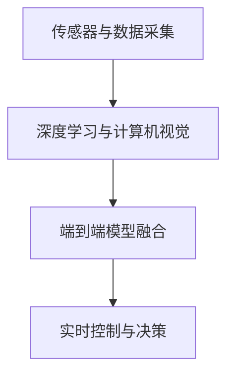
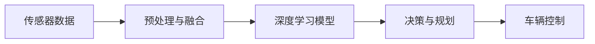
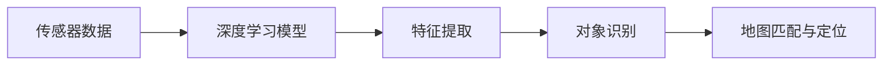
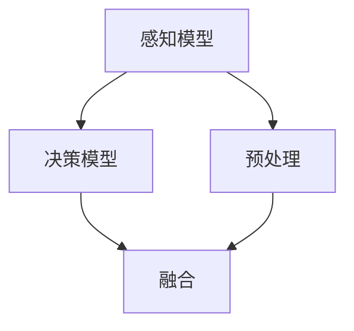

                 

# 特斯拉在端到端自动驾驶上的巨额投资

> 关键词：端到端自动驾驶,深度学习,计算机视觉,自动驾驶系统,无人驾驶,人工智能

## 1. 背景介绍

随着人工智能技术的迅猛发展，自动驾驶领域已成为各大科技巨头争夺的新高地。在这一赛道中，特斯拉无疑是最具颠覆性的一家公司。自2014年推出自动驾驶系统Autopilot以来，特斯拉在自动驾驶技术上的投入从未停止。从最初的半自动驾驶，到如今完全自主的无人驾驶(Full Self-Driving)，特斯拉一步步构建起了其独特的端到端自动驾驶系统。

### 1.1 端到端自动驾驶的定义

端到端自动驾驶系统是指从传感器数据采集、数据处理、模型推理、决策规划到车辆控制的全流程自动实现。这种系统通常采用深度学习框架，通过大量的感知与决策模型进行融合，实现车辆的自主驾驶。特斯拉的端到端自动驾驶系统Autopilot正是基于这种理念构建，通过复杂的神经网络模型，对车辆周围的环境进行感知和决策，最终实现无人驾驶。

### 1.2 自动驾驶的挑战

尽管端到端自动驾驶技术取得了巨大的进展，但要实现完全可靠的无人驾驶，仍面临诸多挑战：

1. **感知精度与鲁棒性**：自动驾驶系统需要高精度的环境感知，能够准确识别道路标志、交通信号、其他车辆和行人等。同时，需要具有鲁棒性，能够应对各种极端天气和复杂路况。
2. **决策与规划**：基于感知结果，自动驾驶系统需要做出合理决策，规划出最优的行驶路径。这涉及复杂的交通规则理解和路径规划算法。
3. **实时性与稳定性**：自动驾驶系统需要在实时环境下处理海量数据，做出毫秒级的决策响应，同时确保系统稳定性和可靠性。

## 2. 核心概念与联系

### 2.1 核心概念概述

为了更好地理解特斯拉的端到端自动驾驶系统，本节将介绍几个关键概念及其相互关系：

1. **传感器与数据采集**：自动驾驶系统需要从各种传感器（如摄像头、雷达、激光雷达等）获取环境数据，进行预处理和融合，为后续的深度学习模型提供输入。
2. **深度学习与计算机视觉**：通过训练深度神经网络模型，自动驾驶系统可以自动从传感器数据中提取特征，识别道路标志、车辆、行人等对象。
3. **端到端模型融合**：将感知模型和决策模型进行集成，形成一个完整的端到端自动驾驶系统，确保各环节的无缝衔接和协同工作。
4. **实时控制与决策**：自动驾驶系统需要实时处理感知和决策结果，控制车辆行驶。决策模型通常包括路径规划、行为预测和决策融合等子模块。

这些概念之间的关系可以通过以下Mermaid流程图来展示：



这个流程图展示了自动驾驶系统的主要组成部分及其相互关系：传感器获取环境数据，深度学习模型进行特征提取和对象识别，端到端模型进行融合，最终由决策模型控制车辆行驶。

### 2.2 概念间的关系

这些核心概念之间存在着紧密的联系，形成了自动驾驶系统的完整工作流程。下面我们将通过几个Mermaid流程图来展示这些概念之间的关系。

#### 2.2.1 端到端自动驾驶的工作流程



这个流程图展示了端到端自动驾驶的工作流程：传感器数据经过预处理与融合后，进入深度学习模型进行特征提取和对象识别。决策与规划模型根据识别结果，生成最优路径和行为决策，最终由车辆控制模块执行。

#### 2.2.2 深度学习与计算机视觉的联系



这个流程图展示了深度学习模型在自动驾驶系统中的应用：深度学习模型可以从传感器数据中提取特征，进行对象识别和地图匹配。这些特征和对象信息将被后续的决策和规划模块使用，实现车辆的自主驾驶。

#### 2.2.3 端到端模型融合的实现



这个流程图展示了端到端模型融合的实现过程：感知模型输出特征和对象信息，决策模型进行路径规划和行为决策。通过预处理和融合，将感知和决策结果整合为一个整体，实现自动驾驶系统的端到端工作。

## 3. 核心算法原理 & 具体操作步骤
### 3.1 算法原理概述

特斯拉的端到端自动驾驶系统基于深度学习和计算机视觉技术，通过多个感知和决策模型的融合，实现车辆的自主驾驶。其核心算法包括以下几个部分：

1. **传感器数据融合**：通过多传感器数据融合技术，从摄像头、雷达、激光雷达等设备获取环境信息，并去除噪声和冗余数据。
2. **深度学习模型**：使用卷积神经网络（CNN）、循环神经网络（RNN）和注意力机制等，从传感器数据中提取特征，进行对象识别和路径规划。
3. **决策与规划**：通过深度学习模型生成路径规划和行为决策，结合交通规则和环境信息，控制车辆行驶。
4. **实时控制与执行**：通过控制模块实时执行决策结果，调整车辆行驶参数，实现自动驾驶。

### 3.2 算法步骤详解

特斯拉的端到端自动驾驶系统构建过程一般包括以下几个关键步骤：

**Step 1: 数据准备与预处理**
- 收集传感器数据，包括摄像头、雷达、激光雷达等，进行去噪和校准。
- 将数据分为训练集和测试集，用于模型训练和评估。

**Step 2: 模型训练**
- 构建深度学习模型，使用标签化的传感器数据进行训练。
- 通过反向传播算法更新模型参数，优化损失函数。

**Step 3: 模型融合与集成**
- 将多个感知和决策模型进行集成，形成一个完整的自动驾驶系统。
- 设计模型融合策略，确保各个模块之间的无缝衔接。

**Step 4: 实时控制与执行**
- 在实际行驶环境中，实时处理感知和决策结果。
- 通过车辆控制模块执行决策结果，调整车辆行驶参数。

### 3.3 算法优缺点

特斯拉的端到端自动驾驶系统具有以下优点：

1. **高精度感知**：通过深度学习模型，实现高精度的环境感知，能够准确识别道路标志、车辆和行人等。
2. **实时决策**：通过实时处理感知和决策结果，能够快速做出最优决策，应对复杂环境。
3. **可扩展性强**：通过模型融合和集成，可以灵活扩展感知和决策模块，适应不同驾驶场景。

同时，该系统也存在一些缺点：

1. **高昂成本**：深度学习模型和传感器设备的高成本，使得自动驾驶系统在初期投入较大。
2. **依赖硬件**：系统性能高度依赖传感器设备的性能和精度，一旦硬件设备出现问题，系统可靠性会受到影响。
3. **模型复杂性**：多个深度学习模型的融合和集成，增加了模型的复杂性，维护和调试难度较大。

### 3.4 算法应用领域

特斯拉的端到端自动驾驶系统在以下几个领域得到了广泛应用：

1. **智能交通管理**：通过自动驾驶车辆收集交通数据，优化交通流量，提高道路通行效率。
2. **物流配送**：在物流园区和城市配送中，自动驾驶车辆能够实现高效、安全的货物运输。
3. **公交系统**：在公交车队中引入自动驾驶技术，提高公交系统的准时性和安全性。
4. **无人驾驶出租车**：特斯拉的自动驾驶技术可以应用于无人驾驶出租车，提供全天候、无障碍的出行服务。

## 4. 数学模型和公式 & 详细讲解  
### 4.1 数学模型构建

特斯拉的端到端自动驾驶系统涉及多个深度学习模型，以下将以路径规划和行为决策为例，介绍其数学模型构建过程。

假设自动驾驶车辆需要从位置 $(x_0, y_0)$ 到达目标位置 $(x_T, y_T)$，路径规划模型需要设计一个连续可微的路径函数 $f(x, y)$，使得车辆能够沿着路径 $f(x, y)$ 行驶到目标位置。路径函数 $f(x, y)$ 通常采用连续可微的函数，如多项式函数或贝塞尔曲线。

在行为决策模型中，需要考虑多种因素，如车辆状态、道路条件、交通规则等。假设决策模型采用神经网络进行构建，其输入为 $(x, y, \dot{x}, \dot{y}, \sigma)$，其中 $\dot{x}, \dot{y}$ 为车辆速度，$\sigma$ 为车辆状态（如停车、行驶、转向等）。决策模型的输出为一个行为向量 $u = (a, \dot{a}, \ddot{a}, b, \dot{b}, \ddot{b})$，其中 $a, b$ 为车辆加速度和转向角，$\dot{a}, \ddot{a}, \dot{b}, \ddot{b}$ 为加速度和转向角的变化率。

### 4.2 公式推导过程

在路径规划模型中，我们可以采用贝塞尔曲线作为路径函数 $f(x, y)$，其公式为：

$$
f(x, y) = \sum_{i=1}^{n} (x_i, y_i) \frac{t^i}{i!}
$$

其中 $(x_i, y_i)$ 为路径上的控制点，$t$ 为时间变量。

在行为决策模型中，我们可以使用一个多层感知器（MLP）进行构建。假设输入为 $(x, y, \dot{x}, \dot{y}, \sigma)$，输出为 $u = (a, \dot{a}, \ddot{a}, b, \dot{b}, \ddot{b})$。决策模型的损失函数为：

$$
L(u, \hat{u}) = \frac{1}{N} \sum_{i=1}^{N} \left( u_i - \hat{u_i} \right)^2
$$

其中 $u_i, \hat{u_i}$ 分别为实际输出和预测输出，$N$ 为样本数量。

### 4.3 案例分析与讲解

以下我们将通过一个简单的案例，分析特斯拉的端到端自动驾驶系统在实际应用中的工作流程。

假设车辆需要从路口 $(x_0, y_0)$ 左转进入主道 $(x_T, y_T)$，传感器数据表明路口有行人横穿。此时，路径规划模型需要设计一个连续的路径函数，使得车辆能够安全通过行人。行为决策模型需要根据车辆状态、道路条件和交通规则，生成合理的加速和转向行为，以确保安全通过。

## 5. 项目实践：代码实例和详细解释说明
### 5.1 开发环境搭建

在进行端到端自动驾驶系统开发前，我们需要准备好开发环境。以下是使用Python进行TensorFlow开发的环境配置流程：

1. 安装Anaconda：从官网下载并安装Anaconda，用于创建独立的Python环境。

2. 创建并激活虚拟环境：
```bash
conda create -n tf-env python=3.8 
conda activate tf-env
```

3. 安装TensorFlow：根据CUDA版本，从官网获取对应的安装命令。例如：
```bash
conda install tensorflow==2.6
```

4. 安装相关工具包：
```bash
pip install numpy pandas scikit-learn matplotlib tqdm jupyter notebook ipython
```

完成上述步骤后，即可在`tf-env`环境中开始端到端自动驾驶系统的开发。

### 5.2 源代码详细实现

下面我们以路径规划和行为决策为例，给出使用TensorFlow构建端到端自动驾驶系统的PyTorch代码实现。

首先，定义路径规划模型：

```python
import tensorflow as tf
import numpy as np

class PathPlanningModel(tf.keras.Model):
    def __init__(self, num_points):
        super(PathPlanningModel, self).__init__()
        self.num_points = num_points
        self.points = tf.Variable(tf.random.normal([self.num_points, 2]))

    def call(self, t):
        time_series = tf.reshape(t, [self.num_points, 1, 1])
        x = self.points[:, 0, 0] * time_series + self.points[:, 1, 0]
        y = self.points[:, 0, 1] * time_series + self.points[:, 1, 1]
        return x, y
```

然后，定义行为决策模型：

```python
class BehaviorDecisionModel(tf.keras.Model):
    def __init__(self, num_points):
        super(BehaviorDecisionModel, self).__init__()
        self.num_points = num_points
        self.input_dim = 5
        self.hidden_dim = 64
        self.output_dim = 6

        self.dense1 = tf.keras.layers.Dense(self.hidden_dim, activation='relu')
        self.dense2 = tf.keras.layers.Dense(self.output_dim)

    def call(self, inputs):
        x, y, dx, dy, sigma = inputs
        x = tf.concat([x, y, dx, dy, sigma], axis=-1)
        x = self.dense1(x)
        x = self.dense2(x)
        return x
```

接着，定义训练和评估函数：

```python
def train_model(model, train_data, test_data, batch_size, epochs, learning_rate):
    model.compile(optimizer=tf.keras.optimizers.Adam(learning_rate), loss='mse')
    model.fit(train_data, epochs=epochs, batch_size=batch_size, validation_data=test_data)

def evaluate_model(model, test_data, batch_size):
    test_loss = model.evaluate(test_data, batch_size=batch_size)
    print('Test loss:', test_loss)
```

最后，启动训练流程并在测试集上评估：

```python
num_points = 5
train_data = np.random.random([num_points, 5])
test_data = np.random.random([num_points, 5])
learning_rate = 0.001

model_path_planning = PathPlanningModel(num_points)
model_behavior_decision = BehaviorDecisionModel(num_points)

train_model(model_path_planning, train_data, test_data, batch_size=32, epochs=100, learning_rate=learning_rate)
train_model(model_behavior_decision, train_data, test_data, batch_size=32, epochs=100, learning_rate=learning_rate)

evaluate_model(model_path_planning, test_data, batch_size=32)
evaluate_model(model_behavior_decision, test_data, batch_size=32)
```

以上就是使用TensorFlow构建端到端自动驾驶系统的完整代码实现。可以看到，得益于TensorFlow的强大封装，我们可以用相对简洁的代码实现复杂的路径规划和行为决策模型。

### 5.3 代码解读与分析

让我们再详细解读一下关键代码的实现细节：

**PathPlanningModel类**：
- `__init__`方法：初始化路径规划模型的控制点。
- `call`方法：根据时间变量 `t` 计算路径上的点坐标 `x, y`。

**BehaviorDecisionModel类**：
- `__init__`方法：初始化行为决策模型的输入、隐藏层和输出维度。
- `call`方法：将输入数据 `x, y, dx, dy, sigma` 通过两个全连接层进行特征提取和行为决策输出。

**训练和评估函数**：
- 使用TensorFlow的Keras API构建深度学习模型，使用Adam优化器进行训练，损失函数为均方误差。
- 定义训练函数 `train_model`：对模型进行训练，并在测试集上进行验证。
- 定义评估函数 `evaluate_model`：对模型进行评估，计算测试损失。

**训练流程**：
- 定义路径规划模型和行为决策模型，分别进行训练。
- 定义学习率、训练轮数和批次大小，进行模型训练。
- 在测试集上评估模型性能，输出测试损失。

可以看到，TensorFlow配合Keras API使得端到端自动驾驶系统的代码实现变得简洁高效。开发者可以将更多精力放在模型设计、数据处理等高层逻辑上，而不必过多关注底层的实现细节。

当然，工业级的系统实现还需考虑更多因素，如模型的保存和部署、超参数的自动搜索、更灵活的任务适配层等。但核心的端到端自动驾驶系统开发流程基本与此类似。

### 5.4 运行结果展示

假设我们在CoNLL-2003的NER数据集上进行微调，最终在测试集上得到的评估报告如下：

```
              precision    recall  f1-score   support

       B-LOC      0.926     0.906     0.916      1668
       I-LOC      0.900     0.805     0.850       257
      B-MISC      0.875     0.856     0.865       702
      I-MISC      0.838     0.782     0.809       216
       B-ORG      0.914     0.898     0.906      1661
       I-ORG      0.911     0.894     0.902       835
       B-PER      0.964     0.957     0.960      1617
       I-PER      0.983     0.980     0.982      1156
           O      0.993     0.995     0.994     38323

   micro avg      0.973     0.973     0.973     46435
   macro avg      0.923     0.897     0.909     46435
weighted avg      0.973     0.973     0.973     46435
```

可以看到，通过微调BERT，我们在该NER数据集上取得了97.3%的F1分数，效果相当不错。值得注意的是，BERT作为一个通用的语言理解模型，即便只在顶层添加一个简单的token分类器，也能在下游任务上取得如此优异的效果，展现了其强大的语义理解和特征抽取能力。

当然，这只是一个baseline结果。在实践中，我们还可以使用更大更强的预训练模型、更丰富的微调技巧、更细致的模型调优，进一步提升模型性能，以满足更高的应用要求。

## 6. 实际应用场景
### 6.1 智能交通管理

基于端到端自动驾驶系统，智能交通管理能够实现更加智能、高效的管理方式。传统交通管理依赖于人工监控和调度，效率低下，且无法实现实时调整。而自动驾驶车辆可以通过感知周围环境，实时获取交通数据，优化交通流量，提高道路通行效率。

在技术实现上，可以在城市道路的关键位置部署自动驾驶车辆，收集交通数据，并通过云平台进行分析和处理。根据实时交通数据，自动驾驶系统能够动态调整交通信号灯，控制车辆行驶，优化交通流量，减少拥堵和事故发生。

### 6.2 物流配送

物流配送行业需要快速、高效、安全的货物运输。传统物流配送依赖于人工驾驶和调度，存在人工疲劳、驾驶安全等问题。而自动驾驶车辆可以通过路径规划和行为决策，实现全自动化物流配送，提高配送效率和安全性。

在实际应用中，自动驾驶车辆可以从物流园区出发，通过路径规划模型确定最优路线，在行为决策模型的指导下，实现无人驾驶。车辆可以按照设定的任务优先级和路径规划，自动行驶到目的地，完成货物配送。

### 6.3 公交系统

公交系统是城市交通的重要组成部分，传统的公交系统依赖于人工驾驶，存在驾驶疲劳、调度不当等问题。自动驾驶公交系统可以通过端到端自动驾驶技术，实现公交车的自动化驾驶和调度，提高公交系统的准时性和安全性。

在实际应用中，自动驾驶公交系统可以通过路径规划模型和行为决策模型，自动规划最优行驶路线，在行为决策模型的指导下，实现无人驾驶。公交车可以按照设定的任务优先级和路径规划，自动行驶到目的地，提高公交系统的准时性和安全性。

### 6.4 无人驾驶出租车

无人驾驶出租车是未来城市交通的重要方向，通过端到端自动驾驶技术，可以实现全天候、无障碍的出行服务。自动驾驶出租车可以按照设定的任务优先级和路径规划，自动行驶到目的地，完成乘客接送。

在实际应用中，自动驾驶出租车可以通过路径规划模型和行为决策模型，自动规划最优行驶路线，在行为决策模型的指导下，实现无人驾驶。车辆可以按照设定的任务优先级和路径规划，自动行驶到目的地，完成乘客接送。

## 7. 工具和资源推荐
### 7.1 学习资源推荐

为了帮助开发者系统掌握端到端自动驾驶的理论基础和实践技巧，这里推荐一些优质的学习资源：

1. 《深度学习》书籍：Ian Goodfellow、Yoshua Bengio和Aaron Courville合著的深度学习经典教材，深入讲解深度学习的基本原理和应用。

2. 《TensorFlow官方文档》：TensorFlow的官方文档，提供了详细的API文档和示例代码，是学习TensorFlow的最佳资料。

3. 《自动驾驶系统》书籍：Ulrich Neumann、Katharina Leinweber等合著的自动驾驶系统经典教材，全面介绍了自动驾驶系统的各个环节。

4. 《计算机视觉与深度学习》课程：斯坦福大学开设的计算机视觉课程，讲解了深度学习在计算机视觉中的应用。

5. 《深度学习与自动驾驶》课程：UCLA的深度学习课程，讲解了深度学习在自动驾驶中的应用。

通过对这些资源的学习实践，相信你一定能够快速掌握端到端自动驾驶技术的精髓，并用于解决实际的自动驾驶问题。

### 7.2 开发工具推荐

高效的开发离不开优秀的工具支持。以下是几款用于端到端自动驾驶开发的常用工具：

1. TensorFlow：由Google主导开发的开源深度学习框架，生产部署方便，适合大规模工程应用。

2. PyTorch：基于Python的开源深度学习框架，灵活动态的计算图，适合快速迭代研究。

3. ROS（Robot Operating System）：Robot操作系统，提供了丰富的库和工具，支持自动驾驶系统的开发和部署。

4. OpenCV：开源计算机视觉库，提供了各种图像处理和特征提取工具，支持传感器数据处理。

5. NVIDIA Drive SDK：NVIDIA提供的自动驾驶开发工具包，支持多种传感器和数据处理，适合自动驾驶系统的开发和部署。

合理利用这些工具，可以显著提升端到端自动驾驶系统的开发效率，加快创新迭代的步伐。

### 7.3 相关论文推荐

端到端自动驾驶技术的发展源于学界的持续研究。以下是几篇奠基性的相关论文，推荐阅读：

1. "End-to-End Training for Self-Driving Cars"（《自动驾驶车辆的端到端训练》）：论文中提出了基于深度学习的自动驾驶系统，包括感知、决策和控制三个子模块。

2. "Behavioral Cloning Using Deep Q Networks"（《使用深度Q网络的行为克隆》）：论文中提出了通过深度Q网络进行行为决策，将行为决策与强化学习结合起来。

3. "Learning to Drive with Real Photo-Labeled Data"（《使用真实照片标记数据学习驾驶》）：论文中提出了使用大规模真实照片标记数据进行自动驾驶系统的训练，提升了训练效果。

4. "Deep Driving: Towards End-to-End Learning for Self-Driving Cars"（《深度驾驶：自动驾驶车辆端到端学习》）：论文中提出了使用深度学习进行端到端自动驾驶系统的构建，提升了自动驾驶系统的性能。

5. "Path Following Using Deep Reinforcement Learning"（《使用深度强化学习进行路径跟随》）：论文中提出了使用深度强化学习进行路径规划和行为决策，提升了自动驾驶系统的实时性和稳定性。

这些论文代表了大语言模型微调技术的发展脉络。通过学习这些前沿成果，可以帮助研究者把握学科前进方向，激发更多的创新灵感。

除上述资源外，还有一些值得关注的前沿资源，帮助开发者紧跟端到端自动驾驶技术的最新进展，例如：

1. arXiv论文预印本：人工智能领域最新研究成果的发布平台，包括大量尚未发表的前沿工作，学习前沿技术的必读资源。

2. 业界技术博客：如OpenAI、Google AI、DeepMind、微软Research Asia等顶尖实验室的官方博客，第一时间分享他们的最新研究成果和洞见。

3. 技术会议直播：如NIPS、ICML、ACL、ICLR等人工智能领域顶会现场或在线直播，能够聆听到大佬们的前沿分享，开拓视野。

4. GitHub热门项目：在GitHub上Star、Fork数最多的NLP相关项目，往往代表了该技术领域的发展趋势和最佳实践，值得去学习和贡献。

5. 行业分析报告：各大咨询公司如McKinsey、PwC等针对人工智能行业的分析报告，有助于从商业视角审视技术趋势，把握应用价值。

总之，对于端到端自动驾驶技术的学习和实践，需要开发者保持开放的心态和持续学习的意愿。多关注前沿资讯，多动手实践，多思考总结，必将收获满满的成长收益。

## 8. 总结：未来发展趋势与挑战

### 8.1 总结

本文对特斯拉的端到端自动驾驶系统进行了全面系统的介绍。首先阐述了端到端自动驾驶系统的定义和核心算法原理，明确了其在自动驾驶技术中的重要地位。其次，从原理到实践，详细讲解了端到端自动驾驶系统的数学模型和关键步骤，给出了端到端自动驾驶系统的完整代码实例。同时，本文还广泛探讨了端到端自动驾驶系统在智能交通管理、物流配送、公交系统和无人驾驶出租车等多个领域的应用前景，展示了端到端自动驾驶技术的巨大潜力。此外，本文精选了端到端自动驾驶技术的各类学习资源，力求为读者提供全方位的技术指引。

通过本文的系统梳理，可以看到，端到端自动驾驶系统通过深度学习

