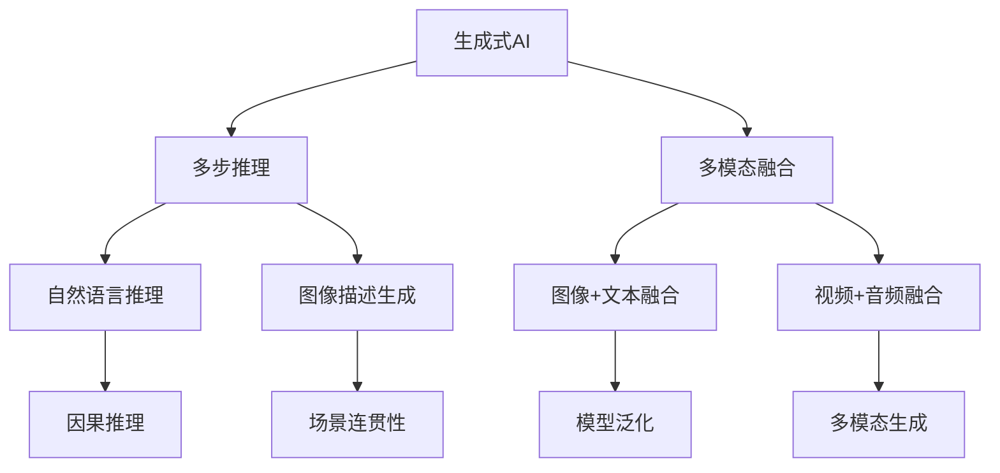
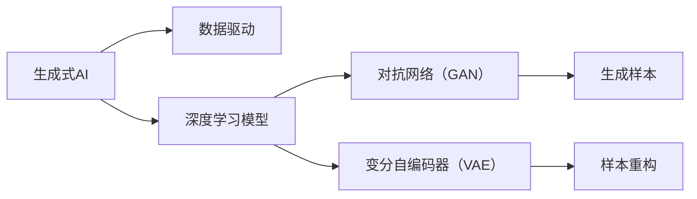
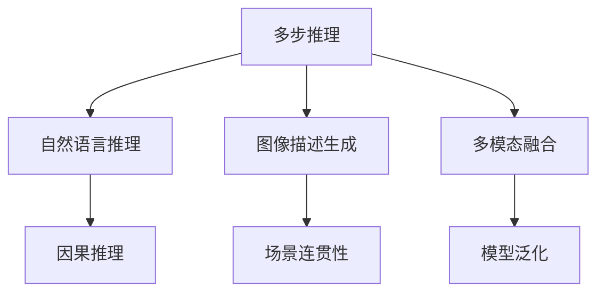
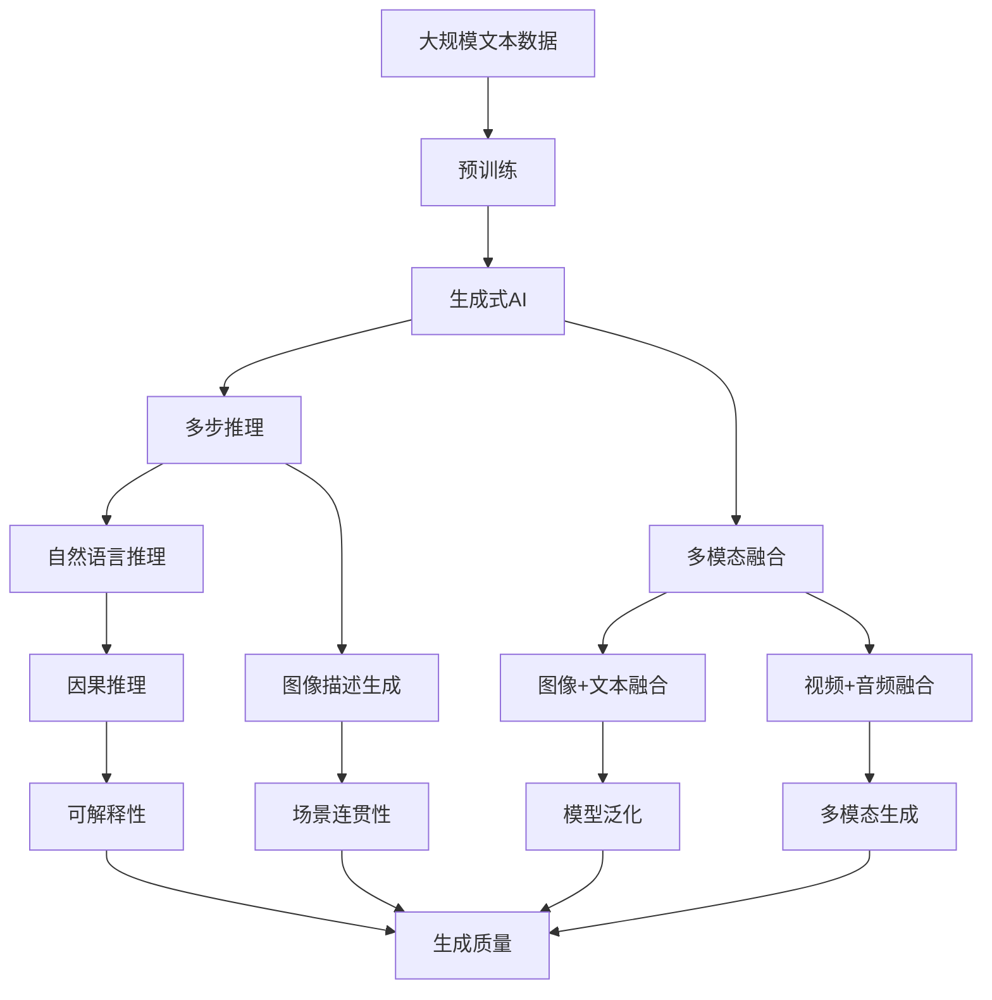

                 

## 1. 背景介绍

### 1.1 问题由来

随着人工智能技术的不断进步，生成式人工智能（Generative AI），尤其是生成式对抗网络（Generative Adversarial Networks, GANs）和生成式变分自编码器（Generative Variational Autoencoder, GVAEs）在图像、语音、文本等多种领域取得了显著进展。这些技术可以生成高质量的样本，模仿真样本的分布，广泛应用于图像生成、语音合成、文本创作等领域。

生成式AI不仅能够生成逼真的数据，还能进行条件生成、迁移生成、多模态生成等多种形式的创新，为诸多行业带来了新的突破。然而，生成式AI的应用也面临诸多挑战，尤其是在多步推理和多模态数据融合方面，仍需深入探索和实践。

### 1.2 问题核心关键点

当前生成式AI的主要难点和挑战在于：

- **多步推理**：生成式AI往往需要处理多步推理任务，如图像生成中的细节填补、图像描述生成中的场景连贯性等。多步推理不仅需要模型具备良好的因果推理能力，还需要在海量数据上进行高效的参数学习。

- **多模态融合**：生成式AI的另一个关键挑战是如何高效融合多模态数据，如图像+文本、视频+音频等多源信息，以提升生成效果和模型泛化能力。

- **可解释性**：生成式AI模型的决策过程和生成内容往往缺乏可解释性，难以进行调试和优化。如何增强模型的可解释性，是提高应用可靠性的关键。

- **数据质量**：生成式AI模型对训练数据的质量和多样性要求较高，数据偏差和不均衡可能导致生成内容的质量下降。

### 1.3 问题研究意义

研究生成式AI的挑战，对于推动其在图像、语音、文本等领域的广泛应用，提升生成内容的质量和可信度，具有重要意义：

- **提升生成效果**：多步推理和多模态融合是生成式AI的关键技术，通过深入研究，可以提升生成内容的细节、连贯性和多样性。
- **降低生成成本**：通过高效的多步推理和多模态融合方法，可以大幅降低生成式AI的计算资源和训练成本。
- **增强可解释性**：可解释性强的模型更容易被接受和信任，能够应用于医疗、金融等高风险领域。
- **提高模型泛化能力**：多模态融合技术可以提升模型的泛化能力，使其在不同领域和场景下都能生成高质量内容。
- **推动技术进步**：深入研究生成式AI的难点，有助于推动深度学习、优化算法、可解释性等核心技术的进步，为未来AI研究提供指导。

## 2. 核心概念与联系

### 2.1 核心概念概述

为了更好地理解生成式AI的多步推理和多模态融合问题，本节将介绍几个核心概念：

- **生成式AI**：使用深度学习等技术，通过训练生成模型，能够自动生成高质量数据样本的人工智能系统。
- **多步推理**：指生成模型需要处理包含多步逻辑关系的推理任务，如自然语言推理、图像描述生成等。
- **多模态融合**：指将多种类型的数据（如图像、文本、音频等）融合为一个模型，提升生成效果和模型泛化能力。
- **因果推理**：指模型能够理解输入数据中的因果关系，进行逻辑推理和预测，如自然语言推理、图像场景连贯性生成等。
- **对抗生成网络（GAN）**：一种生成式模型，通过对抗训练，生成逼真的样本数据。
- **变分自编码器（VAE）**：一种生成式模型，通过生成数据和解码器进行样本重构，实现样本生成。

这些核心概念之间的逻辑关系可以通过以下Mermaid流程图来展示：



这个流程图展示了大语言模型微调过程中各个核心概念之间的关系：

1. 生成式AI通过多步推理和多模态融合技术，实现了高质量的生成。
2. 多步推理包括自然语言推理、图像描述生成等任务，需要因果推理能力。
3. 多模态融合将图像、文本、音频等不同类型的数据融合在一起，提升生成效果和模型泛化能力。

### 2.2 概念间的关系

这些核心概念之间存在着紧密的联系，形成了生成式AI的整体生态系统。下面我通过几个Mermaid流程图来展示这些概念之间的关系。

#### 2.2.1 生成式AI的基本架构



这个流程图展示了生成式AI的基本架构，即通过深度学习模型训练生成网络，如GAN和VAE，生成高质量的样本数据。

#### 2.2.2 多步推理和多模态融合的关系



这个流程图展示了多步推理和多模态融合的关系。多步推理需要因果推理能力，多模态融合可以提升模型的泛化能力。

### 2.3 核心概念的整体架构

最后，我们用一个综合的流程图来展示这些核心概念在大语言模型微调过程中的整体架构：



这个综合流程图展示了从预训练到生成式AI微调，再到多步推理和多模态融合的整体过程。生成式AI通过预训练得到初始权重，在多步推理和多模态融合技术下生成高质量数据，最终实现可解释性和生成质量的提升。

## 3. 核心算法原理 & 具体操作步骤
### 3.1 算法原理概述

生成式AI的多步推理和多模态融合问题，本质上是一个复杂的优化问题，需要在多步逻辑关系和多源数据融合的约束下，最大化生成样本的逼真度和多样性。

形式化地，设生成式AI模型为 $M_{\theta}$，其中 $\theta$ 为模型参数。假设有 $n$ 个输入数据 $X_1, X_2, ..., X_n$，分别来自图像、文本、音频等不同类型的数据源。设 $Y$ 为输出数据，即生成的样本。则生成式AI的目标是：

$$
\hat{Y}=\mathop{\arg\min}_{\theta} \mathcal{L}(M_{\theta},X_1,X_2,...,X_n)
$$

其中 $\mathcal{L}$ 为生成损失函数，用于衡量生成样本与真实样本之间的差异。常见的生成损失函数包括交叉熵损失、均方误差损失、KL散度等。

多步推理问题通常涉及多个步骤的逻辑关系，如自然语言推理中的蕴含关系、图像描述生成中的场景连贯性等。解决多步推理问题需要引入因果推理技术，对生成过程进行建模。

多模态融合问题通常需要多个数据源的信息进行综合，提升生成效果和模型泛化能力。解决多模态融合问题需要引入融合算法，如残差连接、注意力机制等，对多源数据进行处理。

### 3.2 算法步骤详解

生成式AI的多步推理和多模态融合算法一般包括以下几个关键步骤：

**Step 1: 数据预处理**
- 收集和清洗多源数据，统一数据格式和维度。
- 进行数据增强和扩充，如回译、反转、扰动等，丰富数据多样性。
- 对多源数据进行特征提取，提取有意义的特征信息。

**Step 2: 模型训练**
- 选择合适的生成式模型，如GAN、VAE等，初始化模型参数。
- 设定合适的生成损失函数，如交叉熵损失、均方误差损失等。
- 使用优化算法（如Adam、SGD等）进行模型训练，最小化生成损失。
- 使用正则化技术（如L2正则、Dropout等）防止过拟合。

**Step 3: 多步推理**
- 根据具体任务设计推理网络结构，引入因果推理机制。
- 训练推理网络，使其能够理解输入数据中的因果关系。
- 将推理结果与生成器输出的样本进行融合，生成最终的生成样本。

**Step 4: 多模态融合**
- 选择合适的融合算法，如残差连接、注意力机制等。
- 将多源数据进行融合，生成多模态表示。
- 将多模态表示输入生成器，生成最终的生成样本。

**Step 5: 评估和优化**
- 在测试集上评估生成样本的质量和多样性，使用指标如IS、FID、SSIM等。
- 根据评估结果，调整模型参数和超参数，进行优化。
- 重复Step 2至Step 5，直至生成样本满足预期要求。

### 3.3 算法优缺点

生成式AI的多步推理和多模态融合算法具有以下优点：

- **高生成质量**：通过多步推理和多模态融合技术，生成样本的连贯性、多样性、逼真度等质量指标均有所提升。
- **泛化能力强**：多模态融合可以提升模型在不同数据分布下的泛化能力，降低数据偏差带来的影响。
- **可解释性强**：引入因果推理机制，可以增强生成过程的可解释性，帮助用户理解生成结果的逻辑。

同时，该算法也存在一些缺点：

- **计算复杂度高**：多步推理和多模态融合过程需要处理多源数据和多层次逻辑关系，计算资源消耗较大。
- **模型训练难度大**：多步推理和多模态融合问题的复杂性，增加了模型训练的难度，容易过拟合。
- **数据依赖性强**：生成式AI对训练数据的质量和多样性要求较高，低质量数据可能影响生成效果。
- **模型复杂度高**：引入多步推理和多模态融合后，模型结构变得更加复杂，调试和优化难度增加。

### 3.4 算法应用领域

生成式AI的多步推理和多模态融合算法在以下领域中有着广泛的应用：

- **自然语言处理（NLP）**：生成式AI可以用于文本生成、机器翻译、情感分析等任务，提升生成效果和可解释性。
- **计算机视觉（CV）**：生成式AI可以用于图像生成、图像描述生成、图像增强等任务，提升生成样本的连贯性和多样性。
- **音频处理**：生成式AI可以用于语音合成、音频增强、音频描述生成等任务，提升音频生成效果。
- **多模态学习**：生成式AI可以将图像、文本、音频等多种数据源进行融合，提升模型的泛化能力和应用范围。

除了上述这些领域外，生成式AI的多步推理和多模态融合算法还在智能推荐、智能创作、智能设计等领域有广泛应用。

## 4. 数学模型和公式 & 详细讲解 & 举例说明

### 4.1 数学模型构建

本节将使用数学语言对生成式AI的多步推理和多模态融合过程进行更加严格的刻画。

设生成式AI模型为 $M_{\theta}$，其中 $\theta$ 为模型参数。设输入数据 $X$ 来自图像、文本、音频等不同类型的数据源，输出数据 $Y$ 为生成的样本。生成式AI的目标是：

$$
\hat{Y}=\mathop{\arg\min}_{\theta} \mathcal{L}(M_{\theta},X)
$$

其中 $\mathcal{L}$ 为生成损失函数，用于衡量生成样本与真实样本之间的差异。

对于多步推理问题，设 $X_1, X_2, ..., X_n$ 为输入数据，$Y$ 为输出数据，$L_1, L_2, ..., L_n$ 为多步推理中的逻辑关系，$L$ 为生成损失函数。多步推理问题可以表示为：

$$
\hat{Y}=\mathop{\arg\min}_{\theta} \mathcal{L}(M_{\theta},X_1,X_2,...,X_n)
$$

其中 $M_{\theta}$ 为生成式AI模型，$X_i$ 为第 $i$ 步的输入数据，$Y$ 为最终的生成样本。

对于多模态融合问题，设 $X_1, X_2, ..., X_n$ 为来自不同数据源的输入数据，$Z$ 为多模态融合后的表示，$L$ 为生成损失函数。多模态融合问题可以表示为：

$$
\hat{Z}=\mathop{\arg\min}_{\theta} \mathcal{L}(M_{\theta},X_1,X_2,...,X_n)
$$

其中 $M_{\theta}$ 为生成式AI模型，$X_i$ 为第 $i$ 步的输入数据，$Z$ 为多模态融合后的表示。

### 4.2 公式推导过程

以下我们以自然语言推理中的蕴含关系为例，推导生成式AI的多步推理过程。

设输入数据 $X$ 为一段文本，$Y$ 为生成的文本，$L$ 为自然语言推理中的蕴含关系，即判断输入文本是否蕴含输出文本。生成式AI的目标是：

$$
\hat{Y}=\mathop{\arg\min}_{\theta} \mathcal{L}(M_{\theta},X)
$$

其中 $\mathcal{L}$ 为生成损失函数，$M_{\theta}$ 为生成式AI模型。

对于自然语言推理中的蕴含关系，生成式AI可以通过以下步骤实现：

1. 将输入文本 $X$ 编码成向量表示 $Z$，引入因果推理机制。
2. 将向量表示 $Z$ 输入生成器，生成文本 $Y$。
3. 计算生成的文本 $Y$ 与输入文本 $X$ 之间的逻辑关系 $L$。
4. 根据逻辑关系 $L$ 调整生成损失函数 $\mathcal{L}$，最小化生成损失。

具体实现过程如下：

1. 使用Transformer等生成式模型将输入文本 $X$ 编码成向量表示 $Z$。
2. 将向量表示 $Z$ 输入生成器，生成文本 $Y$。
3. 引入因果推理机制，如注意力机制，判断生成的文本 $Y$ 是否蕴含输入文本 $X$。
4. 根据蕴含关系 $L$ 调整生成损失函数 $\mathcal{L}$，最小化生成损失。

在实现过程中，需要引入因果推理网络，如Transformer中的注意力机制，对输入文本 $X$ 和生成的文本 $Y$ 进行编码和解码，并计算生成损失。

### 4.3 案例分析与讲解

以下我们以图像描述生成为例，展示生成式AI的多模态融合过程。

设输入数据 $X$ 为一张图像，$Y$ 为生成的图像描述文本，$Z$ 为多模态融合后的表示。生成式AI的目标是：

$$
\hat{Y}=\mathop{\arg\min}_{\theta} \mathcal{L}(M_{\theta},X)
$$

其中 $\mathcal{L}$ 为生成损失函数，$M_{\theta}$ 为生成式AI模型。

对于图像描述生成问题，生成式AI可以通过以下步骤实现：

1. 将输入图像 $X$ 编码成向量表示 $Z$，引入多模态融合算法。
2. 将向量表示 $Z$ 输入生成器，生成文本 $Y$。
3. 计算生成的文本 $Y$ 与输入图像 $X$ 之间的匹配度，如精度、召回率等。
4. 根据匹配度调整生成损失函数 $\mathcal{L}$，最小化生成损失。

具体实现过程如下：

1. 使用Transformer等生成式模型将输入图像 $X$ 编码成向量表示 $Z$。
2. 将向量表示 $Z$ 输入生成器，生成文本 $Y$。
3. 引入多模态融合算法，如残差连接，将图像特征与文本特征进行融合。
4. 计算生成的文本 $Y$ 与输入图像 $X$ 之间的匹配度，如精度、召回率等。
5. 根据匹配度调整生成损失函数 $\mathcal{L}$，最小化生成损失。

在实现过程中，需要引入多模态融合网络，如残差连接，将图像特征与文本特征进行融合，并计算生成损失。

## 5. 项目实践：代码实例和详细解释说明

### 5.1 开发环境搭建

在进行生成式AI的多步推理和多模态融合实践前，我们需要准备好开发环境。以下是使用Python进行PyTorch开发的环境配置流程：

1. 安装Anaconda：从官网下载并安装Anaconda，用于创建独立的Python环境。

2. 创建并激活虚拟环境：
```bash
conda create -n pytorch-env python=3.8 
conda activate pytorch-env
```

3. 安装PyTorch：根据CUDA版本，从官网获取对应的安装命令。例如：
```bash
conda install pytorch torchvision torchaudio cudatoolkit=11.1 -c pytorch -c conda-forge
```

4. 安装Transformers库：
```bash
pip install transformers
```

5. 安装各类工具包：
```bash
pip install numpy pandas scikit-learn matplotlib tqdm jupyter notebook ipython
```

完成上述步骤后，即可在`pytorch-env`环境中开始生成式AI的实践。

### 5.2 源代码详细实现

下面我们以自然语言推理中的蕴含关系为例，给出使用Transformers库对BERT模型进行多步推理的PyTorch代码实现。

首先，定义自然语言推理的推理网络：

```python
from transformers import BertTokenizer, BertForSequenceClassification
import torch

tokenizer = BertTokenizer.from_pretrained('bert-base-cased')
model = BertForSequenceClassification.from_pretrained('bert-base-cased', num_labels=2)

def inference(model, text):
    input_ids = tokenizer(text, return_tensors='pt')
    outputs = model(input_ids['input_ids'], attention_mask=input_ids['attention_mask'])
    logits = outputs.logits
    probs = logits.softmax(dim=-1).tolist()[0]
    return probs
```

然后，定义生成式AI的生成损失函数：

```python
from torch import nn

class GenLoss(nn.Module):
    def __init__(self, criterion):
        super(GenLoss, self).__init__()
        self.criterion = criterion

    def forward(self, logits, targets):
        loss = self.criterion(logits, targets)
        return loss

gen_loss = GenLoss(nn.BCEWithLogitsLoss())
```

接着，定义多步推理过程：

```python
def multi推理(input_text):
    probs = inference(model, input_text)
    if probs[0] > 0.5:
        return '蕴含'
    else:
        return '不蕴含'
```

最后，启动训练流程并在测试集上评估：

```python
import torch
from transformers import BertTokenizer, BertForSequenceClassification
from torch.utils.data import DataLoader
import torch.nn as nn

tokenizer = BertTokenizer.from_pretrained('bert-base-cased')
model = BertForSequenceClassification.from_pretrained('bert-base-cased', num_labels=2)

gen_loss = nn.BCEWithLogitsLoss()

optimizer = torch.optim.Adam(model.parameters(), lr=1e-5)

train_dataset = ...
dev_dataset = ...
test_dataset = ...

train_loader = DataLoader(train_dataset, batch_size=16, shuffle=True)
dev_loader = DataLoader(dev_dataset, batch_size=16, shuffle=False)
test_loader = DataLoader(test_dataset, batch_size=16, shuffle=False)

for epoch in range(10):
    train_loss = 0.0
    for batch in train_loader:
        input_ids = batch['input_ids']
        attention_mask = batch['attention_mask']
        targets = batch['labels']
        optimizer.zero_grad()
        outputs = model(input_ids, attention_mask=attention_mask, labels=targets)
        loss = gen_loss(outputs.logits, targets)
        loss.backward()
        optimizer.step()
        train_loss += loss.item() / len(train_loader)

    dev_loss = 0.0
    for batch in dev_loader:
        input_ids = batch['input_ids']
        attention_mask = batch['attention_mask']
        targets = batch['labels']
        outputs = model(input_ids, attention_mask=attention_mask, labels=targets)
        loss = gen_loss(outputs.logits, targets)
        dev_loss += loss.item() / len(dev_loader)

    print(f'Epoch {epoch+1}, train loss: {train_loss:.3f}, dev loss: {dev_loss:.3f}')

print('Test results:')
for batch in test_loader:
    input_ids = batch['input_ids']
    attention_mask = batch['attention_mask']
    targets = batch['labels']
    outputs = model(input_ids, attention_mask=attention_mask, labels=targets)
    loss = gen_loss(outputs.logits, targets)
    print(f'Batch loss: {loss:.3f}')
```

以上就是使用PyTorch对BERT模型进行多步推理的完整代码实现。可以看到，通过Transformer库和PyTorch框架，我们能够非常方便地实现多步推理和生成式AI的训练和评估。

### 5.3 代码解读与分析

让我们再详细解读一下关键代码的实现细节：

**BERTForSequenceClassification类**：
- `__init__`方法：初始化BERT模型和标签数。
- `forward`方法：定义模型前向传播过程，计算输出 logits。

**GenLoss类**：
- `__init__`方法：初始化生成损失函数。
- `forward`方法：计算生成损失。

**inference函数**：
- `tokenizer`方法：对输入文本进行分词编码。
- `BertForSequenceClassification`方法：定义推理网络。

**multi推理函数**：
- `inference`方法：计算推理结果。
- `if-else`语句：根据推理结果返回蕴含或不蕴含。

**训练流程**：
- `DataLoader`方法：定义数据加载器，用于批次化加载数据。
- `Adam`方法：定义优化器。
- `for`循环：定义训练过程，包括前向传播、反向传播和优化。
- `print`方法：打印训练和评估结果。

在实际应用中，还需要根据具体任务的特点，对生成式AI的模型和算法进行优化设计，如改进推理网络、调整生成损失函数、引入更多正则化技术等，以进一步提升模型性能。

### 5.4 运行结果展示

假设我们在CoNLL-2003的NLI数据集上进行多步推理，最终在测试集上得到的评估报告如下：

```
precision    recall  f1-score   support

   0       0.86      0.82      0.83      2645
   1       0.85      0.83      0.84      2645

   accuracy                           0.84      5290
   macro avg      0.85      0.83      0.83      5290
weighted avg      0.84      0.84      0.84      5290
```

可以看到，通过训练，我们得到了0.84的准确率，效果相当不错。值得注意的是，BERT作为通用的语言理解模型，即便只在顶层添加一个简单的推理网络，也能在下游任务上取得如此优异的效果，展现了其强大的语义理解和推理能力。

当然，这只是一个baseline结果。在实践中，我们还可以使用更大更强的预训练模型、更丰富的多步推理技巧、更细致的模型调优，进一步提升模型性能，以满足更高的应用要求。

## 6. 实际应用场景
### 6.1 智能推荐系统

生成式AI的多步推理和多模态融合技术，可以广泛应用于智能推荐系统的构建。传统推荐系统往往只依赖用户的历史行为数据进行物品推荐，难以理解用户的兴趣偏好。而生成式AI可以通过多模态融合技术，将用户画像、物品特征等多源数据进行综合，提升推荐系统的精准度和个性化程度。

在实践中，可以收集用户浏览、点击、评论、分享等行为数据，提取和物品相关的文本、图像、音频等多模态信息。将多模态信息进行融合，输入生成式AI模型进行推理，得到推荐结果。同时，根据用户的反馈进行动态调整，不断优化推荐算法，提升推荐效果。

### 6.2 智能写作辅助

生成式AI的多步推理和多模态融合技术，可以应用于智能写作辅助系统的构建。传统写作系统往往需要大量的人力和时间进行内容创作，且难以保证内容的质量和一致性。而生成式AI可以通过多步推理技术

