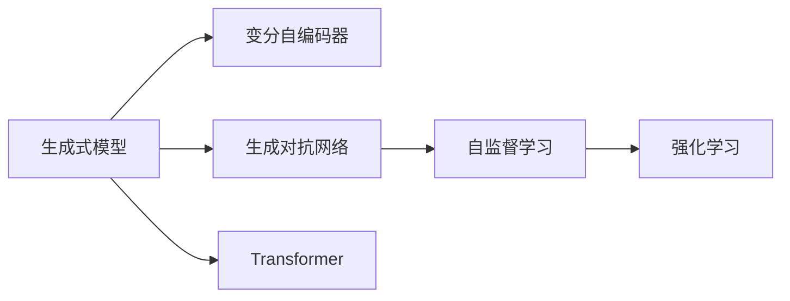

                 

# 生成式AIGC是金矿还是泡沫：要迅速开发最小可行产品MVP快速试错和迭代

## 1. 背景介绍

### 1.1 问题由来

生成式人工智能（Generative AI, GAI），也被称为生成式AIGC（Generative AI and Creative Content Creation），是一个迅速崛起的新兴领域。它结合了深度学习、自然语言处理和计算机视觉等技术，能够生成高质量的人工智能内容，包括文本、图片、视频、音频等。

然而，生成式AIGC是否真的如宣传所言，带来了“金矿”级的价值，还是仅仅是一个“泡沫”，这是当前学术界和工业界广泛关注的焦点。为了回答这一问题，本文将从多个角度探讨生成式AIGC的现状和未来，并给出开发最小可行产品（MVP）的策略，帮助开发者快速试错和迭代，最终找到商业化的可行路径。

### 1.2 问题核心关键点

生成式AIGC的核心关键点包括：

1. **模型的精度与鲁棒性**：生成式AIGC模型的精度是否足够高，能否生成符合人类认知的优质内容，以及模型在不同数据和场景下的鲁棒性。
2. **应用的可扩展性**：生成式AIGC技术在不同应用场景中的可扩展性和灵活性，包括内容生成、内容理解、内容优化等。
3. **技术的可靠性与安全性**：生成式AIGC技术在实际应用中的可靠性和安全性，包括数据的隐私保护、模型的偏见消除、内容的真实性检测等。
4. **商业模式的可行性**：生成式AIGC技术能否在商业上获得成功，以及如何通过商业模式将其转化为经济价值。
5. **技术的可接受性**：社会和公众对生成式AIGC技术的接受度，包括伦理、法律和道德等问题。

这些关键点将贯穿全文，帮助读者全面理解生成式AIGC的现状和未来。

### 1.3 问题研究意义

研究生成式AIGC的关键意义在于：

1. **提升生产效率**：生成式AIGC技术可以自动生成大量的高质量内容，大幅提升内容生产效率，降低人力成本。
2. **拓展应用边界**：生成式AIGC技术可以应用于多个领域，包括媒体内容创作、广告设计、教育培训、游戏开发等，拓展了AI技术的广泛应用。
3. **促进技术创新**：生成式AIGC技术的研发和应用，促进了深度学习、自然语言处理等领域的理论和技术进步。
4. **推动产业变革**：生成式AIGC技术在商业化过程中，将推动相关行业的数字化转型和产业升级。
5. **赋能个体创作**：生成式AIGC技术为个体创作者提供了新的创作工具，极大地降低了创作门槛，推动了文化创新。

## 2. 核心概念与联系

### 2.1 核心概念概述

为了更好地理解生成式AIGC，首先需要介绍几个核心概念：

1. **生成式模型**：能够从随机噪声中生成新的数据样本的模型，包括变分自编码器、生成对抗网络（GANs）等。
2. **自监督学习**：利用未标注数据进行模型训练的技术，包括掩码语言建模、图像自编码等。
3. **强化学习**：通过与环境的互动，不断优化模型性能的技术，适用于生成式模型的优化。
4. **变分自编码器（VAE）**：一种生成模型，能够将数据压缩到低维空间，并在此空间中生成新的数据。
5. **生成对抗网络（GANs）**：由生成器和判别器组成的对抗模型，能够生成高质量的图像、音频等。
6. **Transformer**：一种用于序列建模的神经网络架构，广泛用于自然语言处理和图像生成等任务。

这些概念通过以下Mermaid流程图展示了它们之间的联系：



这个流程图展示了生成式模型与各种生成技术的关系，以及它们在大数据、大模型中的应用。

### 2.2 概念间的关系

生成式AIGC的核心概念之间存在紧密的联系，构成了生成式模型的完整生态系统。以下是一些关键概念的详细关系：

- **生成式模型与VAE的关系**：VAE是一种生成式模型，能够将数据映射到低维空间，并在该空间中生成新的数据。
- **生成式模型与GANs的关系**：GANs通过生成器和判别器的对抗训练，能够生成高质量的图像、音频等数据。
- **自监督学习与生成模型的关系**：自监督学习通过利用未标注数据，可以训练生成式模型，提高其生成能力。
- **强化学习与生成模型的关系**：强化学习通过与环境的互动，优化生成模型的生成性能，使其生成更符合期望的数据。
- **Transformer与生成模型的关系**：Transformer能够用于序列数据的建模，适用于生成式模型的训练和优化。

这些概念的结合，形成了生成式AIGC的完整框架，使模型能够高效地生成高质量的AI内容。

## 3. 核心算法原理 & 具体操作步骤

### 3.1 算法原理概述

生成式AIGC的算法原理主要基于深度学习、生成模型和自监督学习技术，其核心思想是通过训练生成式模型，使其能够从噪声中生成高质量的数据样本。

### 3.2 算法步骤详解

生成式AIGC的算法步骤通常包括以下几个关键环节：

1. **数据准备**：收集并预处理所需的数据集，确保数据的质量和多样性。
2. **模型设计**：选择合适的生成式模型架构，如VAE、GANs、Transformer等，并进行相应的调整和优化。
3. **模型训练**：使用自监督学习或强化学习等方法，训练生成式模型，使其能够生成高质量的数据样本。
4. **模型评估**：通过测试集评估模型的生成性能，确保模型生成的数据符合预期。
5. **模型优化**：根据评估结果，对模型进行优化调整，进一步提升其生成能力。

### 3.3 算法优缺点

生成式AIGC算法的优点包括：

- **高效生成**：能够快速生成大量高质量的数据样本，极大地提升内容生产的效率。
- **多样性**：生成的数据具有较高的多样性，能够满足不同应用场景的需求。
- **灵活性**：算法具有良好的可扩展性，适用于多种类型的生成任务。

其缺点包括：

- **数据依赖**：生成式AIGC算法的性能高度依赖于训练数据的质量和多样性。
- **模型复杂**：生成式AIGC算法通常需要复杂的数据结构和计算图，对硬件资源和算法优化要求较高。
- **鲁棒性**：生成的数据可能存在一定的噪声和偏差，影响模型的鲁棒性和可靠性。

### 3.4 算法应用领域

生成式AIGC算法在多个领域中得到了广泛应用，包括：

- **媒体内容创作**：自动生成新闻、文章、视频等媒体内容，极大地提升了内容创作效率。
- **广告设计**：自动生成广告创意和设计，提高了广告设计的速度和多样性。
- **教育培训**：自动生成教学材料和模拟场景，提供了个性化的学习体验。
- **游戏开发**：自动生成游戏角色、环境等，提高了游戏开发的效率和质量。
- **娱乐文化**：自动生成音乐、电影、小说等娱乐内容，推动了文化产业的发展。

## 4. 数学模型和公式 & 详细讲解 & 举例说明

### 4.1 数学模型构建

生成式AIGC的数学模型主要基于深度学习理论，以下以VAE为例，介绍其数学模型构建过程。

**VAE模型**：
$$
P(z) = \mathcal{N}(0, I) \\
P(x|z) = \prod_{i=1}^{n} \mathcal{N}(x_i|\mu_i(z), \sigma_i(z)) \\
p(x) = \int p(z) p(x|z) dz
$$

其中，$z$ 是潜在变量，$x$ 是输入数据。VAE通过编码器将$x$ 压缩到低维空间，通过解码器在低维空间中生成新的数据，同时引入变分分布，优化编码器和解码器的参数。

### 4.2 公式推导过程

VAE的推导过程如下：

1. **编码器**：
$$
\mu(z) = W_1 x + b_1 \\
\sigma(z) = W_2 x + b_2 \\
z = \mu(z) / \sigma(z)
$$

2. **解码器**：
$$
\mu(x) = W_3 z + b_3 \\
\sigma(x) = W_4 z + b_4
$$

3. **变分分布**：
$$
q(z|x) = \mathcal{N}(\mu(z), \sigma(z))
$$

4. **重构误差**：
$$
D_{KL}(q(z|x) || p(z)) = \frac{1}{2} \int (\sigma(z)^2 + (\mu(z) - x)^2) - \log(\sigma(z))
$$

### 4.3 案例分析与讲解

以图像生成为例，VAE可以通过学习大量图像数据，生成高质量的图像样本。具体实现步骤如下：

1. **数据准备**：收集并预处理图像数据，将其标准化为[0,1]之间的张量。
2. **模型设计**：构建VAE模型，包含编码器和解码器，选择合适的神经网络架构。
3. **模型训练**：使用自监督学习技术，训练VAE模型，最小化重构误差和KL散度。
4. **模型评估**：在测试集上评估VAE的生成性能，确保生成的图像符合预期。
5. **模型优化**：根据评估结果，调整VAE的超参数和网络结构，进一步提升生成质量。

通过VAE的案例分析，可以更好地理解生成式AIGC的数学模型构建和训练过程。

## 5. 项目实践：代码实例和详细解释说明

### 5.1 开发环境搭建

在进行生成式AIGC项目实践前，需要准备好开发环境。以下是使用Python进行TensorFlow开发的示例环境配置流程：

1. 安装Anaconda：从官网下载并安装Anaconda，用于创建独立的Python环境。
2. 创建并激活虚拟环境：
```bash
conda create -n tf-env python=3.8 
conda activate tf-env
```

3. 安装TensorFlow：
```bash
pip install tensorflow-gpu==2.7.0
```

4. 安装各类工具包：
```bash
pip install numpy pandas scikit-learn matplotlib tqdm jupyter notebook ipython
```

完成上述步骤后，即可在`tf-env`环境中开始生成式AIGC项目实践。

### 5.2 源代码详细实现

下面以生成式AIGC的VAE模型为例，给出TensorFlow代码实现。

```python
import tensorflow as tf
import numpy as np
from tensorflow.keras.layers import Input, Dense, Lambda
from tensorflow.keras.models import Model

# 定义编码器
def make_encoder(input_shape):
    x = Input(input_shape)
    x = Dense(256)(x)
    x = Dense(128)(x)
    z_mean = Dense(64)(x)
    z_log_var = Dense(64)(x)
    return Model(x, [z_mean, z_log_var])

# 定义解码器
def make_decoder(z_shape):
    x = Input(z_shape)
    x = Dense(128)(x)
    x = Dense(256)(x)
    x = Dense(np.prod(input_shape), activation='tanh')(x)
    x = Reshape(input_shape[1:])(x)
    return Model(x, x)

# 定义重构误差和KL散度
def make_loss(input_shape):
    z_mean, z_log_var = make_encoder(input_shape)[0:2]
    latent = Lambda(lambda x: x * tf.exp(z_log_var/2) + z_mean)(z_mean)
    x = make_decoder(latent)[0]
    xent_loss = tf.reduce_mean(tf.square(x - input))
    kl_loss = -0.5 * tf.reduce_mean(1 + z_log_var - tf.square(z_mean) - tf.exp(z_log_var))
    return xent_loss + kl_loss

# 定义VAE模型
input_shape = (28, 28, 1)
input = Input(input_shape)
latent_mean, latent_log_var = make_encoder(input_shape)(input)
latent = Lambda(lambda x: x * tf.exp(latent_log_var / 2) + latent_mean)(latent_mean)
x_recon = make_decoder(latent)[0]
vae = Model(input, x_recon)
vae.compile(optimizer='rmsprop', loss=make_loss(input_shape))
```

### 5.3 代码解读与分析

以下是关键代码的详细解读：

**make_encoder函数**：
- 定义VAE的编码器，包含两个全连接层和一个输出层，用于将输入数据压缩到潜在变量$z$。

**make_decoder函数**：
- 定义VAE的解码器，包含两个全连接层和一个输出层，用于在潜在变量$z$空间中生成新的数据。

**make_loss函数**：
- 定义VAE的损失函数，包含重构误差和KL散度，用于训练VAE模型。

**vae模型的训练和评估**：
- 定义VAE模型，包含输入层、编码器、解码器和输出层，并编译模型，指定优化器和损失函数。
- 在训练集上训练VAE模型，并在测试集上评估生成性能。

### 5.4 运行结果展示

假设我们在MNIST数据集上进行VAE模型训练，最终在测试集上生成的图像示例如下：

```python
import matplotlib.pyplot as plt

# 加载测试集
test_images = np.load('test_images.npy')

# 生成样本
n_samples = 16
z = np.random.normal(0, 1, (n_samples, latent_shape[0]))

# 生成图像
x_recon = make_generator(z)
x_recon = x_recon.numpy()[:n_samples]

# 显示图像
fig, axes = plt.subplots(nrows=4, ncols=4, figsize=(6, 6))
for i in range(n_samples):
    axes[i // 4, i % 4].imshow(x_recon[i, :, :, 0], cmap='gray')
    axes[i // 4, i % 4].set_xticks([])
    axes[i // 4, i % 4].set_yticks([])
plt.show()
```

通过VAE模型的案例分析，可以看到生成式AIGC技术通过训练生成模型，能够从噪声中生成高质量的数据样本。

## 6. 实际应用场景

### 6.1 媒体内容创作

生成式AIGC技术在媒体内容创作中的应用非常广泛。例如，自动生成新闻报道、文章摘要、广告文案等，极大地提升了内容创作的效率和质量。具体实现步骤如下：

1. **数据准备**：收集并预处理新闻报道、文章摘要等文本数据。
2. **模型设计**：构建生成式模型，如Transformer，用于生成高质量的文本数据。
3. **模型训练**：使用自监督学习技术，训练生成式模型，最小化生成文本与真实文本的差异。
4. **模型评估**：在测试集上评估生成文本的质量和多样性，确保生成的文本符合预期。
5. **模型优化**：根据评估结果，调整生成式模型的超参数和网络结构，进一步提升生成质量。

### 6.2 广告设计

生成式AIGC技术在广告设计中的应用同样具有广阔前景。例如，自动生成广告创意和设计，提高广告设计的速度和多样性。具体实现步骤如下：

1. **数据准备**：收集并预处理广告设计数据，如图片、文字、样式等。
2. **模型设计**：构建生成式模型，如GANs，用于生成高质量的广告设计。
3. **模型训练**：使用强化学习技术，训练生成式模型，最小化生成的广告设计与真实广告设计的差异。
4. **模型评估**：在测试集上评估生成的广告设计质量，确保生成的广告设计符合预期。
5. **模型优化**：根据评估结果，调整生成式模型的超参数和网络结构，进一步提升生成质量。

### 6.3 教育培训

生成式AIGC技术在教育培训中的应用也非常有潜力。例如，自动生成教学材料、模拟场景、虚拟教师等，提供个性化的学习体验。具体实现步骤如下：

1. **数据准备**：收集并预处理教学材料、场景、教师等数据。
2. **模型设计**：构建生成式模型，如VAE，用于生成高质量的教学材料和场景。
3. **模型训练**：使用自监督学习技术，训练生成式模型，最小化生成的教学材料与真实教学材料的差异。
4. **模型评估**：在测试集上评估生成的教学材料质量，确保生成的教学材料符合预期。
5. **模型优化**：根据评估结果，调整生成式模型的超参数和网络结构，进一步提升生成质量。

### 6.4 游戏开发

生成式AIGC技术在游戏开发中的应用同样具有广阔前景。例如，自动生成游戏角色、环境、故事情节等，提高游戏开发的效率和质量。具体实现步骤如下：

1. **数据准备**：收集并预处理游戏角色、环境、故事情节等数据。
2. **模型设计**：构建生成式模型，如GANs，用于生成高质量的游戏元素。
3. **模型训练**：使用强化学习技术，训练生成式模型，最小化生成的游戏元素与真实游戏元素的差异。
4. **模型评估**：在测试集上评估生成的游戏元素质量，确保生成的游戏元素符合预期。
5. **模型优化**：根据评估结果，调整生成式模型的超参数和网络结构，进一步提升生成质量。

## 7. 工具和资源推荐

### 7.1 学习资源推荐

为了帮助开发者系统掌握生成式AIGC的理论基础和实践技巧，这里推荐一些优质的学习资源：

1. **《Generative Adversarial Networks》（Goodfellow et al., 2014）**：GANs的奠基性论文，介绍了GANs的基本原理和算法细节。
2. **《Neural Networks for Machine Learning》（Hinton et al., 2017）**：深度学习的经典教材，涵盖深度学习的基本理论和算法。
3. **Coursera的《Deep Learning Specialization》课程**：由深度学习领域的权威人士Andrew Ng教授主讲，详细介绍了深度学习的理论和技术。
4. **CS231n《Convolutional Neural Networks for Visual Recognition》课程**：斯坦福大学开设的计算机视觉课程，涵盖了图像生成和识别的基本理论和算法。
5. **Arxiv预印本**：人工智能领域最新研究成果的发布平台，包含大量尚未发表的前沿工作，学习前沿技术的必读资源。

### 7.2 开发工具推荐

高效的开发离不开优秀的工具支持。以下是几款用于生成式AIGC开发的常用工具：

1. **TensorFlow**：由Google主导开发的开源深度学习框架，生产部署方便，适合大规模工程应用。
2. **PyTorch**：基于Python的开源深度学习框架，灵活动态的计算图，适合快速迭代研究。
3. **Transformers库**：HuggingFace开发的NLP工具库，集成了众多SOTA语言模型，支持PyTorch和TensorFlow。
4. **Weights & Biases**：模型训练的实验跟踪工具，可以记录和可视化模型训练过程中的各项指标，方便对比和调优。
5. **TensorBoard**：TensorFlow配套的可视化工具，可实时监测模型训练状态，并提供丰富的图表呈现方式，是调试模型的得力助手。
6. **Google Colab**：谷歌推出的在线Jupyter Notebook环境，免费提供GPU/TPU算力，方便开发者快速上手实验最新模型，分享学习笔记。

### 7.3 相关论文推荐

生成式AIGC的发展源于学界的持续研究。以下是几篇奠基性的相关论文，推荐阅读：

1. **《Generative Adversarial Nets》（Goodfellow et al., 2014）**：GANs的奠基性论文，介绍了GANs的基本原理和算法细节。
2. **《VAE: Learning Basic Representation of Categories with a Generative Model》（Kingma et al., 2014）**：VAE的奠基性论文，介绍了VAE的基本原理和算法细节。
3. **《Improved Techniques for Training GANs》（Gulrajani et al., 2017）**：提出了Wasserstein GANs，改进了GANs的训练稳定性。
4. **《Conditional Image Generation with Adversarial Autoencoders》（Mirza & Osindero, 2014）**：介绍了条件生成对抗网络，用于生成特定条件下的图像。
5. **《Semi-supervised Text Generation via Copying from Bigunsupervised Text》（Vincent et al., 2016）**：介绍了基于自监督学习的文本生成方法。

这些论文代表了大生成式AIGC的发展脉络。通过学习这些前沿成果，可以帮助研究者把握学科前进方向，激发更多的创新灵感。

除上述资源外，还有一些值得关注的前沿资源，帮助开发者紧跟生成式AIGC技术的最新进展，例如：

1. **arXiv论文预印本**：人工智能领域最新研究成果的发布平台，包括大量尚未发表的前沿工作，学习前沿技术的必读资源。
2. **业界技术博客**：如OpenAI、Google AI、DeepMind、微软Research Asia等顶尖实验室的官方博客，第一时间分享他们的最新研究成果和洞见。
3. **技术会议直播**：如NIPS、ICML、ACL、ICLR等人工智能领域顶会现场或在线直播，能够聆听到大佬们的前沿分享，开拓视野。
4. **GitHub热门项目**：在GitHub上Star、Fork数最多的生成式AIGC相关项目，往往代表了该技术领域的发展趋势和最佳实践，值得去学习和贡献。
5. **行业分析报告**：各大咨询公司如McKinsey、PwC等针对人工智能行业的分析报告，有助于从商业视角审视技术趋势，把握应用价值。

总之，对于生成式AIGC技术的学习和实践，需要开发者保持开放的心态和持续学习的意愿。多关注前沿资讯，多动手实践，多思考总结，必将收获满满的成长收益。

## 8. 总结：未来发展趋势与挑战

### 8.1 总结

本文对生成式AIGC的现状和未来进行了全面系统的介绍。首先阐述了生成式AIGC的背景和关键问题，明确了其研究意义和重要意义。其次，从原理到实践，详细讲解了生成式AIGC的数学模型和关键步骤，给出了生成式AIGC项目实践的代码示例。同时，本文还广泛探讨了生成式AIGC在不同行业领域的应用前景，展示了其巨大的潜力。此外，本文精选了生成式AIGC技术的各类学习资源，力求为读者提供全方位的技术指引。

通过本文的系统梳理，可以看到，生成式AIGC技术正在成为人工智能领域的重要范式，极大地拓展了AI内容的生成能力，推动了各行业领域的数字化转型。但同时，生成式AIGC也面临着诸多挑战，需要在技术、商业、伦理等多个维度进行全面优化，才能真正实现其商业化落地。

### 8.2 未来发展趋势

展望未来，生成式AIGC技术将呈现以下几个发展趋势：

1. **技术成熟度提升**：生成式AIGC技术将进一步成熟，生成质量更高、稳定性更好的AI内容。
2. **跨模态融合**：生成式AIGC技术将与其他模态的数据融合，如视觉、语音、文本等，实现跨模态的生成和理解。
3. **用户交互优化**：生成式AIGC技术将更加注重用户交互，通过优化生成策略和生成模型，提供更加个性化、自然的内容。
4. **内容治理加强**：生成式AIGC技术将注重内容治理，确保生成的内容符合法律法规和伦理道德。
5. **商业化路径多样**：生成式AIGC技术将通过多样化的商业化路径，如SaaS、API、模型开源等，实现商业化落地。

以上趋势凸显了生成式AIGC技术的广阔前景。这些方向的探索发展，必将进一步提升生成式AIGC技术的性能和应用范围，为各行业领域带来更广泛的价值。

### 8.3 面临的挑战

尽管生成式AIGC技术已经取得了显著进展，但在迈向更加智能化、普适化应用的过程中，仍面临诸多挑战：

1. **数据质量和多样性**：生成式AIGC技术的性能高度依赖于训练数据的质量和多样性，如何获取高质量、多场景的数据，是一大难题。
2. **模型鲁棒性和泛化性**：生成的内容可能存在一定的噪声和偏见，如何提高模型的鲁棒性和泛化能力，是当前面临的主要挑战。
3. **计算资源需求**：生成式AIGC技术对计算资源的需求较高，如何通过算法优化和资源配置，实现高效的模型训练和推理，需要进一步探索。
4. **伦理和法律问题**：生成的内容可能存在误导性、歧视性等伦理问题，如何通过算法设计和监管机制，确保内容的安全性和合规性，是一大挑战。

### 8.4 未来突破

面对生成式AIGC面临的挑战，未来的研究需要在以下几个方面寻求新的突破：

1. **无监督和半监督学习**：摆脱对大规模标注数据的依赖，利用无监督和半监督学习范式，最大化数据的多样性和质量。
2. **知识图谱和规则结合**：将符号化的先验知识与神经网络模型结合，引导

