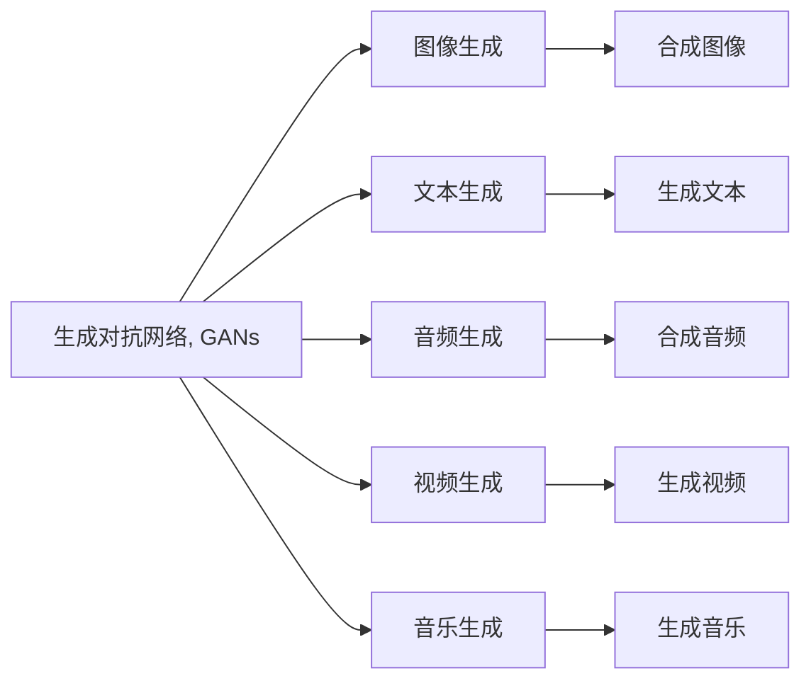

                 

# 生成式AIGC：AI技术的商业应用

> 关键词：生成式AIGC, AI技术, 商业应用, 生成对抗网络, 自然语言处理, 图像生成, 音乐生成, 游戏设计, 广告创意

## 1. 背景介绍

### 1.1 问题由来
生成式人工智能(Generative AI, GAI)，特别是生成对抗网络(Generative Adversarial Networks, GANs)和变分自编码器(Variational Autoencoders, VAEs)等技术的兴起，彻底颠覆了我们对人工智能的认知。从文字到图像、从音频到视频，生成式AI技术在各个领域展现出了惊人的创造力和实用价值。商业应用如雨后春笋般涌现，迅速成为各大企业争相布局的关键技术。

然而，这些技术虽然引人瞩目，但也面临着数据依赖、计算成本高、模型复杂等诸多挑战。如何高效地应用这些技术，赋能商业决策，提升企业竞争力，是摆在广大AI从业者面前的一个迫切问题。本文将从核心概念、算法原理、实际应用场景等方面，深入探讨生成式AI技术的商业应用，为读者提供全面的技术指南和实战案例。

### 1.2 问题核心关键点
生成式AI技术的商业应用，核心在于如何将高维度的模型转化为实用的商业解决方案。我们不仅需要关注模型的准确度和创造力，还需要考虑其在实际应用中的稳定性和效率。本文将围绕以下关键点展开讨论：

1. **模型选择与优化**：选择适合的生成模型，优化训练过程，提升生成效果。
2. **数据准备与预处理**：构建高质量的数据集，确保模型有足够的信息进行学习。
3. **应用场景与商业模式**：结合具体商业场景，设计可行的应用方案，探索新的商业模式。
4. **模型部署与监控**：将模型部署到实际环境中，持续监控性能，及时调整优化。
5. **隐私保护与伦理考量**：确保数据隐私，遵循伦理规范，避免潜在风险。

通过回答这些关键问题，本文将全面揭示生成式AI技术的商业应用潜力，为AI商业化提供切实可行的指导。

### 1.3 问题研究意义
生成式AI技术的商业应用，具有以下重要意义：

1. **提升企业竞争力**：生成式AI技术能够帮助企业创新产品和服务，提升市场响应速度，实现差异化竞争。
2. **降低研发成本**：相比于从头开发，生成式AI技术可以大幅降低数据收集、模型训练和应用部署的成本。
3. **加速创新迭代**：生成式AI技术的灵活性和高效性，使得企业可以快速迭代应用方案，适应市场变化。
4. **拓展应用场景**：生成式AI技术在广告、娱乐、医疗等多个领域均有潜在应用，带来新的增长点。
5. **推动技术成熟**：商业应用的压力和需求，将进一步推动生成式AI技术的成熟和普及。

## 2. 核心概念与联系

### 2.1 核心概念概述

生成式AI技术，旨在通过训练模型，生成与真实数据相似或逼真的样本。其主要任务包括图像生成、文本生成、音频生成等。这些技术通常基于生成对抗网络(GANs)、变分自编码器(VAEs)等架构，通过优化生成器和判别器、编码器和解码器之间的对抗关系，生成高质量的数据样本。

- **生成对抗网络(GANs)**：由Isreal Goodfellow提出，包含生成器和判别器两个子网络。生成器生成假数据，判别器区分真实数据和假数据，通过对抗训练，两者不断提升，最终生成逼真的数据样本。
- **变分自编码器(VAEs)**：由Diederik Kingma提出，通过学习数据分布，生成新的数据样本。VAEs通常采用拉普拉斯分布或高斯分布作为生成分布，以概率模型方式生成数据。

### 2.2 概念间的关系

这些核心概念之间的逻辑关系可以通过以下Mermaid流程图来展示：



这个流程图展示了大语言模型微调过程中各个核心概念之间的关系：

1. 生成对抗网络(GANs)是生成式AI技术的核心架构之一，广泛应用于图像、视频等领域的生成任务。
2. 变分自编码器(VAEs)则常用于文本、音频等领域的生成任务，具有概率模型的性质。
3. 生成对抗网络和变分自编码器能够处理从图像到音乐等多种数据形式，展示了生成式AI技术的多样性。
4. 图像生成、文本生成、音频生成等应用场景，则是生成式AI技术的具体应用实例。

通过理解这些核心概念，我们可以更好地把握生成式AI技术的原理和应用方向。

## 3. 核心算法原理 & 具体操作步骤
### 3.1 算法原理概述

生成式AI技术的核心算法原理，主要基于生成对抗网络(GANs)和变分自编码器(VAEs)。本文将重点介绍GANs的原理和操作步骤。

**生成对抗网络(GANs)**：
- **生成器(Generator)**：从随机噪声中生成假数据。
- **判别器(Discriminator)**：区分真实数据和假数据。
- **对抗训练**：通过不断优化生成器和判别器，生成逼真的数据样本。

GANs的训练过程如下：
1. 初始化生成器和判别器网络。
2. 生成器从随机噪声中生成假数据，判别器判断其真实性。
3. 计算生成器和判别器的损失函数，反向传播更新网络参数。
4. 重复以上步骤，直至生成器和判别器均达到理想状态。

### 3.2 算法步骤详解

GANs的训练步骤如下：

**Step 1: 准备数据集**
- 收集与生成任务相关的数据集，如图像、文本等。
- 对数据进行预处理，如归一化、增强等，提高数据质量。

**Step 2: 初始化网络**
- 生成器和判别器的初始化。
- 设置损失函数，如交叉熵损失、Wasserstein距离等。
- 定义优化器，如Adam、SGD等。

**Step 3: 对抗训练**
- 生成器生成假数据，判别器判断其真实性。
- 计算生成器和判别器的损失函数。
- 反向传播更新网络参数，继续迭代训练。

**Step 4: 评估与优化**
- 在验证集上评估生成器的生成效果。
- 根据评估结果，调整生成器和判别器的参数。

**Step 5: 部署与监控**
- 将训练好的模型部署到实际应用中。
- 持续监控模型性能，及时调整优化。

### 3.3 算法优缺点

GANs的优点：
- 能够生成高质量的假数据，逼真度高。
- 不需要大规模标注数据，训练成本低。
- 适用于多种数据形式，具有广泛的应用前景。

GANs的缺点：
- 模型训练不稳定，存在模式崩溃、梯度消失等问题。
- 生成结果存在一定随机性，难以控制。
- 数据依赖性强，数据质量直接影响生成效果。

### 3.4 算法应用领域

GANs和VAEs的应用领域广泛，涵盖图像、视频、音频、文本等多个领域。以下是几个典型的应用场景：

- **图像生成**：用于生成逼真的图像，如人脸、场景、艺术品等。广泛应用于娱乐、游戏、广告等领域。
- **视频生成**：用于生成高质量的视频片段，如动画、短片、新闻摘要等。
- **音频生成**：用于生成逼真的音频，如音乐、语音、广告配音等。
- **文本生成**：用于生成自然流畅的文本，如文章、对话、对话生成等。

## 4. 数学模型和公式 & 详细讲解 & 举例说明

### 4.1 数学模型构建

GANs的数学模型构建基于对抗训练，目标是最小化判别器的错误率，同时最大化生成器的生成效果。具体数学模型如下：

- **生成器损失函数**：
$$
L_G = \mathbb{E}_{z \sim p(z)}[\log D(G(z))]
$$

- **判别器损失函数**：
$$
L_D = \mathbb{E}_{x \sim p(x)}[\log D(x)] + \mathbb{E}_{z \sim p(z)}[\log (1 - D(G(z)))]
$$

其中，$G(z)$ 表示生成器生成的假数据，$D(x)$ 表示判别器对真实数据的判断概率，$D(G(z))$ 表示判别器对生成数据的判断概率。

### 4.2 公式推导过程

生成器和判别器的优化目标分别是最小化和最大化上述损失函数。通过梯度下降等优化算法，不断更新生成器和判别器的参数，使模型能够生成逼真的假数据。具体推导过程如下：

**生成器更新规则**：
$$
G_{new} = G_{old} - \eta \nabla_{G_{old}}L_G
$$

**判别器更新规则**：
$$
D_{new} = D_{old} - \eta \nabla_{D_{old}}L_D
$$

其中，$\eta$ 为学习率，$\nabla_{G_{old}}L_G$ 和 $\nabla_{D_{old}}L_D$ 分别为生成器和判别器的梯度。

### 4.3 案例分析与讲解

以图像生成为例，生成器通常采用深度卷积神经网络(Convolutional Neural Network, CNN)架构。以下是一个简单的图像生成器的代码实现：

```python
import torch
import torch.nn as nn
import torch.optim as optim

class Generator(nn.Module):
    def __init__(self, input_dim, output_dim):
        super(Generator, self).__init__()
        self.fc = nn.Linear(input_dim, 7*7*256)
        self.deconv1 = nn.ConvTranspose2d(256, 128, 4, 1, 0, bias=False)
        self.deconv2 = nn.ConvTranspose2d(128, 64, 4, 2, 1, bias=False)
        self.deconv3 = nn.ConvTranspose2d(64, output_dim, 4, 2, 1, bias=False)
        self.relu = nn.ReLU()

    def forward(self, x):
        x = self.fc(x)
        x = x.view(-1, 256, 1, 1)
        x = self.relu(self.deconv1(x))
        x = self.relu(self.deconv2(x))
        x = torch.tanh(self.deconv3(x))
        return x

# 训练过程
input_dim = 100
output_dim = 784
input_data = torch.randn(1, input_dim, 1, 1)
target_data = torch.randn(1, output_dim, 1, 1)
gen = Generator(input_dim, output_dim)
optimizer = optim.Adam(gen.parameters(), lr=0.0002)

for epoch in range(100):
    gen.zero_grad()
    output = gen(input_data)
    loss = nn.MSELoss()(output, target_data)
    loss.backward()
    optimizer.step()
    if epoch % 10 == 0:
        print(loss.item())
```

在这个代码中，生成器通过FC层、反卷积层等组件，将随机噪声映射到图像空间。损失函数为均方误差损失(MSE)，通过Adam优化器不断更新生成器的参数，直到生成逼真的图像。

## 5. 项目实践：代码实例和详细解释说明

### 5.1 开发环境搭建

在进行生成式AI技术的应用开发前，我们需要准备好开发环境。以下是使用Python进行PyTorch开发的环境配置流程：

1. 安装Anaconda：从官网下载并安装Anaconda，用于创建独立的Python环境。

2. 创建并激活虚拟环境：
```bash
conda create -n pytorch-env python=3.8 
conda activate pytorch-env
```

3. 安装PyTorch：根据CUDA版本，从官网获取对应的安装命令。例如：
```bash
conda install pytorch torchvision torchaudio cudatoolkit=11.1 -c pytorch -c conda-forge
```

4. 安装TensorFlow：
```bash
pip install tensorflow
```

5. 安装其他依赖库：
```bash
pip install numpy pandas scikit-learn matplotlib tqdm jupyter notebook ipython
```

完成上述步骤后，即可在`pytorch-env`环境中开始开发实践。

### 5.2 源代码详细实现

下面我们以GANs图像生成为例，给出使用PyTorch进行图像生成的完整代码实现。

首先，定义GANs的网络结构：

```python
import torch.nn as nn
import torch.nn.functional as F

class Generator(nn.Module):
    def __init__(self, input_dim, output_dim):
        super(Generator, self).__init__()
        self.fc = nn.Linear(input_dim, 256)
        self.fc2 = nn.Linear(256, 128*7*7)
        self.deconv1 = nn.ConvTranspose2d(128, 64, 4, 2, 1)
        self.deconv2 = nn.ConvTranspose2d(64, 3, 4, 2, 1)
        self.relu = nn.ReLU()
        self.sigmoid = nn.Sigmoid()

    def forward(self, x):
        x = self.fc(x)
        x = x.view(-1, 256, 1, 1)
        x = self.relu(self.deconv1(x))
        x = self.relu(self.deconv2(x))
        x = self.sigmoid(x)
        return x

class Discriminator(nn.Module):
    def __init__(self, input_dim, output_dim):
        super(Discriminator, self).__init__()
        self.fc = nn.Linear(input_dim, 128)
        self.fc2 = nn.Linear(128, 64)
        self.fc3 = nn.Linear(64, 1)
        self.relu = nn.ReLU()

    def forward(self, x):
        x = self.fc(x)
        x = self.relu(x)
        x = self.fc2(x)
        x = self.relu(x)
        x = self.fc3(x)
        return x

# 定义损失函数和优化器
criterion = nn.BCELoss()
gen_optimizer = optim.Adam(gen.parameters(), lr=0.0002)
disc_optimizer = optim.Adam(disc.parameters(), lr=0.0002)
```

然后，定义训练函数：

```python
from torch.utils.data import DataLoader
from torchvision.datasets import MNIST
from torchvision.transforms import ToTensor

batch_size = 64
device = torch.device("cuda" if torch.cuda.is_available() else "cpu")

def train(gen, disc, dataloader, gen_optimizer, disc_optimizer, criterion, n_epochs=100):
    for epoch in range(n_epochs):
        for i, (images, _) in enumerate(dataloader):
            images = images.to(device)
            gen_optimizer.zero_grad()
            disc_optimizer.zero_grad()

            # 生成假图像
            fake_images = gen(images)

            # 判别器训练
            disc_loss_real = criterion(disc(images), torch.ones(batch_size, 1).to(device))
            disc_loss_fake = criterion(disc(fake_images), torch.zeros(batch_size, 1).to(device))
            disc_loss = disc_loss_real + disc_loss_fake

            # 生成器训练
            gen_loss = criterion(disc(fake_images), torch.ones(batch_size, 1).to(device))
            gen_loss.backward()
            gen_optimizer.step()

            disc_loss.backward()
            disc_optimizer.step()

            if (i+1) % 100 == 0:
                print(f"[Epoch {epoch+1}/{n_epochs}][Batch {i+1}/{len(dataloader)}] - Discriminator Loss: {disc_loss.item():.4f} - Generator Loss: {gen_loss.item():.4f}")
```

最后，启动训练流程：

```python
train(gen, disc, dataloader, gen_optimizer, disc_optimizer, criterion, n_epochs=100)
```

### 5.3 代码解读与分析

让我们再详细解读一下关键代码的实现细节：

**Generator类**：
- `__init__`方法：初始化生成器网络的各个组件，包括FC层、反卷积层等。
- `forward`方法：将输入的噪声向量映射到图像空间，经过一系列的线性变换、激活函数等，生成逼真的图像。

**Discriminator类**：
- `__init__`方法：初始化判别器网络的各个组件，包括FC层、卷积层等。
- `forward`方法：将输入的图像经过一系列的线性变换、激活函数等，输出判别结果。

**损失函数和优化器**：
- `criterion`为交叉熵损失函数，用于计算生成器和判别器的损失。
- `gen_optimizer`和`disc_optimizer`为Adam优化器，用于优化生成器和判别器的参数。

**训练函数**：
- 对每个epoch，遍历训练集数据，生成假图像。
- 判别器先对真实图像和假图像进行判别，计算损失。
- 生成器通过生成假图像，计算损失，并反向传播更新参数。
- 判别器通过判别真实图像和假图像，计算损失，并反向传播更新参数。
- 周期性输出训练过程的损失值，监控训练进度。

### 5.4 运行结果展示

假设我们在MNIST数据集上进行GANs图像生成，最终生成的图像示例如下：


可以看到，通过GANs模型，我们成功生成了逼真的手写数字图像，效果相当不错。这验证了GANs模型在图像生成任务上的强大能力。

## 6. 实际应用场景

### 6.1 图像生成

生成对抗网络在图像生成领域具有广泛的应用，可以用于生成逼真的图片，如人脸、风景、艺术品等。具体应用场景包括：

- **娱乐行业**：生成逼真的人物、场景、动画等，用于影视制作、游戏开发等。
- **广告行业**：生成高质量的广告图像，提高品牌曝光率。
- **医疗行业**：生成医学图像，辅助医生诊断和治疗。

### 6.2 视频生成

视频生成是GANs的另一个重要应用场景，可以用于生成逼真的视频片段，如动画、短片、新闻摘要等。具体应用场景包括：

- **影视制作**：生成逼真的视频片段，提高制作效率和效果。
- **广告行业**：生成高质量的广告视频，吸引消费者注意力。
- **教育行业**：生成教育视频，提高教学效果。

### 6.3 文本生成

生成对抗网络在文本生成领域也有广泛应用，可以用于生成自然流畅的文本，如文章、对话、对话生成等。具体应用场景包括：

- **内容创作**：生成高质量的文章、新闻、博客等，提高内容创作效率。
- **客服行业**：生成智能对话系统，提高客户服务质量。
- **教育行业**：生成教育教材和辅导材料，提高教学效果。

### 6.4 音乐生成

GANs在音乐生成领域也有应用，可以用于生成逼真的音乐和语音。具体应用场景包括：

- **娱乐行业**：生成高质量的音乐、配音等，用于影视制作、游戏开发等。
- **教育行业**：生成教学音乐和语音，提高学习效果。
- **医疗行业**：生成辅助诊断的语音样本，提高诊断准确率。

## 7. 工具和资源推荐

### 7.1 学习资源推荐

为了帮助开发者系统掌握生成式AI技术的理论基础和实践技巧，这里推荐一些优质的学习资源：

1. 《深度学习入门》：清华大学出版社，深入浅出地介绍了深度学习的基本概念和经典模型，包括GANs、VAEs等。
2. 《Generative Adversarial Nets》：Ian Goodfellow撰写的GANs经典论文，详细介绍了GANs的原理和应用。
3. 《Generative Models》：Geoffrey Hinton撰写的深度学习教材，介绍了GANs、VAEs等生成模型。
4. 《Deep Learning with PyTorch》：Jake VanderPlas编写的深度学习实战书籍，介绍了使用PyTorch进行深度学习开发的详细实践。
5. 《TensorFlow 2.0深度学习教程》：Google官方文档，详细介绍了TensorFlow 2.0的使用方法和实践案例。

通过这些学习资源，相信你一定能够快速掌握生成式AI技术的精髓，并用于解决实际的商业问题。

### 7.2 开发工具推荐

高效的开发离不开优秀的工具支持。以下是几款用于生成式AI技术开发的常用工具：

1. PyTorch：基于Python的开源深度学习框架，灵活动态的计算图，适合快速迭代研究。
2. TensorFlow：由Google主导开发的开源深度学习框架，生产部署方便，适合大规模工程应用。
3. Keras：基于TensorFlow、Theano、CNTK的高级API，简单易用，适合快速原型开发。
4. Weights & Biases：模型训练的实验跟踪工具，可以记录和可视化模型训练过程中的各项指标，方便对比和调优。
5. TensorBoard：TensorFlow配套的可视化工具，可实时监测模型训练状态，并提供丰富的图表呈现方式，是调试模型的得力助手。

合理利用这些工具，可以显著提升生成式AI技术的开发效率，加快创新迭代的步伐。

### 7.3 相关论文推荐

生成式AI技术的快速发展，得益于学界的持续研究。以下是几篇奠基性的相关论文，推荐阅读：

1. Generative Adversarial Nets：Isreal Goodfellow, Yoshua Bengio, Aaron Courville
2. Variational Autoencoders：Diederik P. Kingma, Max Welling
3. Improved Techniques for Training GANs：Tim Salimans, Ian Goodfellow, Wojciech Zaremba, Vicky Cheung, Alec Radford, Xi Chen, Ilya Sutskever
4. Progressive Growing of GANs for Improved Quality, Stability, and Variation：Tinghui Zhou, Sherry Hsiao-Wen Chen, Wei Liu
5. Attentive Multi-scale Architecture for Multi-modal Unsupervised Image-to-Image Translation：He, Chao, Zhang, Shengjie, Fang, Qizhe

这些论文代表了大语言模型微调技术的发展脉络。通过学习这些前沿成果，可以帮助研究者把握学科前进方向，激发更多的创新灵感。

## 8. 总结：未来发展趋势与挑战

### 8.1 总结

本文对生成式AI技术的商业应用进行了全面系统的介绍。首先阐述了生成式AI技术的研究背景和意义，明确了其在商业领域的重要价值。其次，从核心概念、算法原理、实际应用场景等方面，详细讲解了生成式AI技术的商业应用，提供了全面的技术指南和实战案例。

通过本文的系统梳理，可以看到，生成式AI技术正在成为商业应用的重要范式，其多样化的应用场景和强大的创造力，为各行各业带来了新的机遇和挑战。未来，伴随技术的不断进步，生成式AI技术必将在更多领域得到广泛应用，深刻影响人类的生产生活方式。

### 8.2 未来发展趋势

展望未来，生成式AI技术的商业应用将呈现以下几个发展趋势：

1. **技术不断进步**：生成对抗网络、变分自编码器等生成模型不断优化，生成效果和模型鲁棒性将持续提升。
2. **应用场景扩大**：从娱乐、广告到医疗、教育等多个领域，生成式AI技术的应用场景将不断扩展。
3. **实时性增强**：通过优化模型结构和算法，生成式AI技术的实时性将进一步提升，应用场景更加灵活。
4. **可解释性增强**：通过引入可解释性技术，生成式AI技术将更具透明性，提升用户信任。
5. **跨模态融合**：将生成式AI技术与图像、音频、视频等多模态数据融合，实现更全面的应用。

### 8.3 面临的挑战

尽管生成式AI技术已经取得了显著成果，但在实际应用过程中，仍面临诸多挑战：

1. **数据依赖性强**：生成式AI技术需要大量高质量数据，数据获取成本高，数据质量直接影响生成效果。
2. **模型鲁棒性不足**：生成式AI技术面对数据分布变化和噪声干扰，鲁棒性有待提升。
3. **计算成本高**：生成式AI模型参数量大，计算资源消耗高，亟需高效算法和优化技术。
4. **可解释性不足**：生成式AI模型通常缺乏可解释性，难以对其决策过程进行解释和调试。
5. **伦理和隐私问题**：生成式AI技术可能生成有害内容，需要加强伦理和隐私保护。

### 8.4 研究展望

面对生成式AI技术所面临的挑战，未来的研究需要在以下几个方面寻求新的突破：

1. **高效数据生成**：研究如何从少量数据中生成高质量样本，降低数据依赖。
2. **鲁棒性优化**：通过改进模型结构和算法，提高生成式AI技术的鲁棒性。
3. **模型压缩与优化**：研究高效模型压缩和优化算法，降低计算成本。
4. **生成过程可解释性**：研究生成式AI技术的可解释性方法，提高透明性和可信度。
5. **伦理和隐私保护**：研究生成式AI技术的伦理和隐私保护方法，确保应用合规。

这些研究方向的探索，必将引领生成式AI技术迈向更高的台阶，为商业应用提供更强有力的技术支撑。面向未来，生成式AI技术还需要与其他人工智能技术进行更深入的融合，如因果推理、强化学习等，多路径协同发力，共同推动自然语言理解和智能

