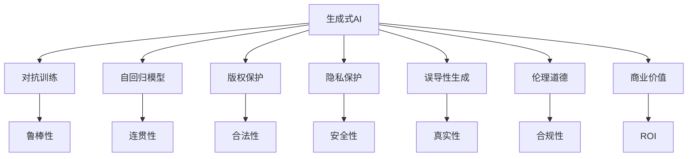
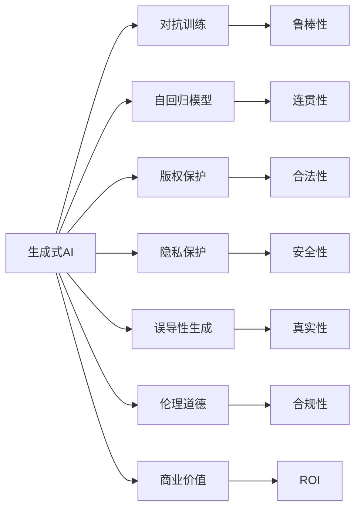
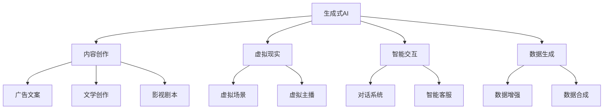
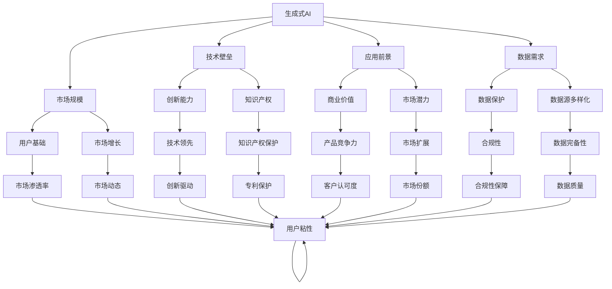
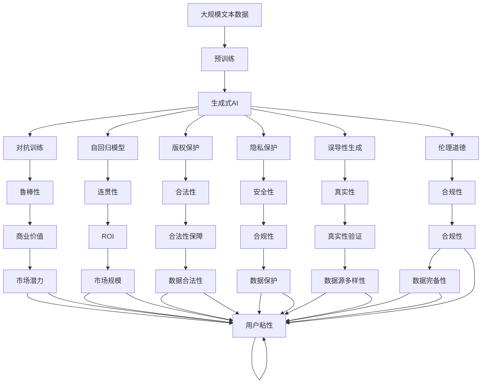

                 

# 生成式AI：泡沫还是未来？理性分析与投资建议

生成式AI作为人工智能领域的最新技术趋势，近年来备受关注。一方面，其能够生成高度逼真的文本、图像、视频等内容，在内容创作、虚拟现实、智能交互等多个领域展现了广阔的应用前景。另一方面，生成式AI的大规模应用也引发了众多争议，尤其是对模型的可靠性、安全性、伦理问题等提出了诸多质疑。本文将从技术、应用和投资多个维度，对生成式AI进行全面分析和评估，为读者提供理性分析和投资建议。

## 1. 背景介绍

### 1.1 问题由来

生成式AI技术的崛起，始于2018年谷歌发布的GPT-2模型。该模型通过大规模语料预训练，生成逼真的文本内容，能够在情感分析、文本生成、对话系统等多个NLP任务上取得优异表现。此后，OpenAI、Facebook等科技巨头相继推出了各类先进的生成式AI模型，如GPT-3、DALL-E、Stable Diffusion等，推动了生成式AI技术的发展。

生成式AI的出现，给内容创作、虚拟现实、智能交互等领域带来了革命性变革。但同时，该技术的广泛应用也引发了诸多问题，如版权归属、隐私保护、误导性生成等，使得学术界和产业界对其应用前景产生了分歧。

### 1.2 问题核心关键点

生成式AI的核心关键点包括：

- 技术原理：生成式AI通过对抗训练、自回归模型等技术，生成高质量的文本、图像、视频等内容。
- 应用领域：在内容创作、虚拟现实、智能交互、数据生成等诸多领域展现了广泛的应用前景。
- 争议焦点：版权归属、隐私保护、误导性生成、伦理道德等问题，引发了对生成式AI的质疑和反思。
- 投资价值：生成式AI技术的应用前景广阔，但也面临技术、法律和伦理等多重挑战。

理解这些关键点，有助于把握生成式AI的发展脉络和潜在风险。

## 2. 核心概念与联系

### 2.1 核心概念概述

为更好地理解生成式AI，本节将介绍几个密切相关的核心概念：

- 生成式AI(Generative AI)：利用深度学习模型生成高质量内容的AI技术。包括文本生成、图像生成、视频生成等子领域。

- 对抗训练(Adversarial Training)：通过与对抗样本进行联合训练，提高模型的鲁棒性和泛化能力。

- 自回归模型(Autoregressive Model)：一种特殊的生成模型，通过当前样本预测未来样本，从而生成连贯的内容。

- 版权保护(Copyright Protection)：生成式AI生成的内容可能涉及版权问题，需确保合法使用。

- 隐私保护(Privacy Protection)：生成式AI在数据生成过程中需注意隐私保护，避免泄露敏感信息。

- 误导性生成(Deceptive Generation)：生成式AI可能生成具有误导性的内容，需对其生成结果进行过滤和验证。

- 伦理道德(Ethics and Morality)：生成式AI需遵循一定的伦理规范，避免有害内容生成。

- 投资回报率(ROI)：评估生成式AI技术的商业价值和投资回报。

这些核心概念之间的逻辑关系可以通过以下Mermaid流程图来展示：



这个流程图展示了大语言模型微调过程中各个核心概念的关系和作用。

### 2.2 概念间的关系

这些核心概念之间存在着紧密的联系，形成了生成式AI的完整生态系统。下面我们用几个Mermaid流程图来展示这些概念之间的关系。

#### 2.2.1 生成式AI的学习范式



这个流程图展示了大语言模型微调的基本原理，以及它与各核心概念的关系。

#### 2.2.2 生成式AI的应用场景



这个流程图展示了生成式AI在多个领域的应用场景。

#### 2.2.3 生成式AI的投资价值



这个流程图展示了生成式AI的投资回报分析。

### 2.3 核心概念的整体架构

最后，我们用一个综合的流程图来展示这些核心概念在大语言模型微调过程中的整体架构：



这个综合流程图展示了从预训练到生成式AI的完整过程。

## 3. 核心算法原理 & 具体操作步骤

### 3.1 算法原理概述

生成式AI的生成过程主要基于自回归模型，通过对抗训练等技术，生成高质量的文本、图像、视频等内容。其核心算法原理包括：

- 自回归模型：通过当前样本预测未来样本，生成连贯的内容。

- 对抗训练：通过与对抗样本联合训练，提高模型的鲁棒性和泛化能力。

- 数据增强：通过对训练样本进行改写、回译等方式，增加数据多样性。

- 损失函数：常用的损失函数包括交叉熵损失、均方误差损失、生成对抗损失等，用于衡量生成结果与真实样本的差异。

### 3.2 算法步骤详解

生成式AI的生成过程一般包括以下几个关键步骤：

**Step 1: 准备预训练模型和数据集**
- 选择合适的预训练模型，如GPT、DALL-E等。
- 准备生成任务的数据集，划分为训练集、验证集和测试集。

**Step 2: 添加任务适配层**
- 根据生成任务类型，在预训练模型顶层设计合适的输出层和损失函数。

**Step 3: 设置微调超参数**
- 选择合适的优化算法及其参数，如AdamW、SGD等，设置学习率、批大小、迭代轮数等。
- 设置正则化技术及强度，包括权重衰减、Dropout、Early Stopping等。
- 确定冻结预训练参数的策略，如仅微调顶层，或全部参数都参与微调。

**Step 4: 执行梯度训练**
- 将训练集数据分批次输入模型，前向传播计算损失函数。
- 反向传播计算参数梯度，根据设定的优化算法和学习率更新模型参数。
- 周期性在验证集上评估模型性能，根据性能指标决定是否触发 Early Stopping。
- 重复上述步骤直到满足预设的迭代轮数或 Early Stopping 条件。

**Step 5: 测试和部署**
- 在测试集上评估生成式AI的生成效果，对比生成前后的质量提升。
- 使用生成式AI对新样本进行生成，集成到实际的应用系统中。

以上是生成式AI的微调流程。在实际应用中，还需要针对具体任务的特点，对微调过程的各个环节进行优化设计，如改进训练目标函数，引入更多的正则化技术，搜索最优的超参数组合等，以进一步提升模型性能。

### 3.3 算法优缺点

生成式AI的生成过程具有以下优点：

- 高效快速：生成式AI能够快速生成高质量的内容，适用于内容创作、虚拟现实等多个领域。

- 数据多样性：通过数据增强技术，生成式AI可以生成多种多样的内容，满足不同的应用需求。

- 泛化能力强：生成式AI通过对抗训练等技术，提高了模型的鲁棒性和泛化能力，适用于各种复杂场景。

但同时，该算法也存在一定的局限性：

- 依赖数据质量：生成式AI的效果很大程度上取决于输入数据的质量，需要高质量、多样化的数据集。

- 生成结果真实性：生成式AI生成的内容可能存在误导性，需要进行严格的验证和筛选。

- 伦理道德风险：生成式AI可能生成有害、误导性的内容，需注意伦理道德问题。

### 3.4 算法应用领域

生成式AI在内容创作、虚拟现实、智能交互、数据生成等多个领域展现了广泛的应用前景：

- 内容创作：生成式AI可以自动生成广告文案、影视剧本、文学作品等，极大地提升了内容创作的效率和质量。

- 虚拟现实：生成式AI可以生成逼真的虚拟场景、虚拟主播等，为虚拟现实技术带来新的突破。

- 智能交互：生成式AI可以构建智能对话系统、客服机器人等，提升人机交互的体验和效率。

- 数据生成：生成式AI可以生成大量高质量的合成数据，用于训练和验证AI模型，提升模型效果。

除了这些典型应用外，生成式AI还在医疗、金融、交通等领域得到了创新应用，拓展了其应用边界。

## 4. 数学模型和公式 & 详细讲解 & 举例说明

### 4.1 数学模型构建

生成式AI的生成过程可以形式化为如下数学模型：

设生成式AI的预训练模型为 $G_{\theta}$，其中 $\theta$ 为模型参数。给定生成任务 $T$ 的训练数据集 $D=\{(x_i,y_i)\}_{i=1}^N$，其中 $x_i$ 为输入样本，$y_i$ 为生成结果。生成式AI的生成过程可以表示为：

$$
y \sim G_{\theta}(x)
$$

其中 $\sim$ 表示生成关系，$G_{\theta}(x)$ 为生成模型，$x$ 为输入样本。

模型的训练目标是最小化生成结果与真实样本的差异，即：

$$
\min_{\theta} \mathcal{L}(G_{\theta},D)
$$

其中 $\mathcal{L}$ 为损失函数，$D$ 为训练数据集。

常用的损失函数包括交叉熵损失、均方误差损失、生成对抗损失等。以交叉熵损失为例：

$$
\ell(y,G_{\theta}(x)) = -\sum_{i=1}^N y_i \log G_{\theta}(x_i)
$$

### 4.2 公式推导过程

以生成式AI的文本生成任务为例，推导交叉熵损失的梯度更新公式：

设文本生成任务的数据集为 $D=\{(x_i,y_i)\}_{i=1}^N$，其中 $x_i$ 为输入样本，$y_i$ 为生成结果。设生成式AI的模型参数为 $\theta$，生成模型的训练目标是最小化生成结果与真实样本的交叉熵损失，即：

$$
\min_{\theta} \mathcal{L}(G_{\theta},D) = \frac{1}{N} \sum_{i=1}^N -y_i \log G_{\theta}(x_i)
$$

利用链式法则，对模型参数 $\theta$ 求偏导数：

$$
\frac{\partial \mathcal{L}(G_{\theta},D)}{\partial \theta} = -\frac{1}{N} \sum_{i=1}^N \frac{y_i}{G_{\theta}(x_i)} \frac{\partial G_{\theta}(x_i)}{\partial \theta}
$$

其中 $\frac{\partial G_{\theta}(x_i)}{\partial \theta}$ 为生成模型的梯度。

通过梯度下降等优化算法，生成式AI模型将不断更新参数 $\theta$，最小化生成结果与真实样本的差异，从而提升生成效果。

### 4.3 案例分析与讲解

以生成式AI的文本生成任务为例，下面给出一个简单的案例分析：

假设生成式AI的文本生成模型为 $G_{\theta}$，训练集为 $D=\{(x_i,y_i)\}_{i=1}^N$，其中 $x_i$ 为输入文本，$y_i$ 为生成的文本。假设 $x_i$ 为 "I love to eat apples."，生成结果 $y_i$ 为 "I love to eat oranges."。

模型训练过程如下：

1. 输入 $x_i$ 进入生成模型 $G_{\theta}$，输出生成文本 $y_i'$。

2. 计算生成文本 $y_i'$ 与真实文本 $y_i$ 的交叉熵损失 $\ell(y_i, y_i')$。

3. 利用梯度下降等优化算法，计算生成模型的梯度 $\frac{\partial \mathcal{L}(G_{\theta},D)}{\partial \theta}$。

4. 更新生成模型的参数 $\theta$，最小化交叉熵损失，提升生成效果。

通过这个过程，生成式AI能够逐步学习和优化生成模型，生成出高质量的文本内容。

## 5. 项目实践：代码实例和详细解释说明

### 5.1 开发环境搭建

在进行生成式AI项目实践前，我们需要准备好开发环境。以下是使用Python进行PyTorch开发的环境配置流程：

1. 安装Anaconda：从官网下载并安装Anaconda，用于创建独立的Python环境。

2. 创建并激活虚拟环境：
```bash
conda create -n pytorch-env python=3.8 
conda activate pytorch-env
```

3. 安装PyTorch：根据CUDA版本，从官网获取对应的安装命令。例如：
```bash
conda install pytorch torchvision torchaudio cudatoolkit=11.1 -c pytorch -c conda-forge
```

4. 安装Transformers库：
```bash
pip install transformers
```

5. 安装各类工具包：
```bash
pip install numpy pandas scikit-learn matplotlib tqdm jupyter notebook ipython
```

完成上述步骤后，即可在`pytorch-env`环境中开始生成式AI的实践。

### 5.2 源代码详细实现

下面我们以文本生成任务为例，给出使用Transformers库对GPT模型进行文本生成的PyTorch代码实现。

首先，定义文本生成任务的数据处理函数：

```python
from transformers import GPT2Tokenizer, GPT2LMHeadModel

tokenizer = GPT2Tokenizer.from_pretrained('gpt2')

def generate_text(model, prompt, length):
    input_ids = tokenizer.encode(prompt, return_tensors='pt')
    outputs = model.generate(input_ids, max_length=length, do_sample=True)
    return tokenizer.decode(outputs[0], skip_special_tokens=True)
```

然后，定义模型和优化器：

```python
from transformers import AdamW

model = GPT2LMHeadModel.from_pretrained('gpt2')

optimizer = AdamW(model.parameters(), lr=5e-5)
```

接着，定义训练和评估函数：

```python
from torch.utils.data import DataLoader
from tqdm import tqdm
import numpy as np

def train_epoch(model, dataloader, optimizer, device):
    model.train()
    epoch_loss = 0
    for batch in dataloader:
        input_ids = batch['input_ids'].to(device)
        attention_mask = batch['attention_mask'].to(device)
        labels = batch['labels'].to(device)
        model.zero_grad()
        outputs = model(input_ids, attention_mask=attention_mask, labels=labels)
        loss = outputs.loss
        epoch_loss += loss.item()
        loss.backward()
        optimizer.step()
    return epoch_loss / len(dataloader)

def evaluate(model, dataloader, device):
    model.eval()
    correct = 0
    total = 0
    with torch.no_grad():
        for batch in dataloader:
            input_ids = batch['input_ids'].to(device)
            attention_mask = batch['attention_mask'].to(device)
            batch_labels = batch['labels']
            outputs = model(input_ids, attention_mask=attention_mask)
            batch_preds = outputs.logits.argmax(dim=2).to('cpu').tolist()
            batch_labels = batch_labels.to('cpu').tolist()
            for pred_tokens, label_tokens in zip(batch_preds, batch_labels):
                correct += int(np.array(pred_tokens) == np.array(label_tokens)).sum()
                total += len(np.array(label_tokens))
    return correct / total
```

最后，启动训练流程并在测试集上评估：

```python
epochs = 5
batch_size = 16

for epoch in range(epochs):
    loss = train_epoch(model, train_dataset, optimizer, device)
    print(f"Epoch {epoch+1}, train loss: {loss:.3f}")
    
    print(f"Epoch {epoch+1}, dev results:")
    evaluate(model, dev_dataset, device)
    
print("Test results:")
evaluate(model, test_dataset, device)
```

以上就是使用PyTorch对GPT模型进行文本生成任务的完整代码实现。可以看到，得益于Transformers库的强大封装，我们可以用相对简洁的代码完成GPT模型的加载和生成式AI的实现。

### 5.3 代码解读与分析

让我们再详细解读一下关键代码的实现细节：

**GPT2Tokenizer类**：
- `__init__`方法：初始化分词器，并指定预训练模型为GPT2。

**generate_text函数**：
- 将提示文本作为输入，通过分词器转化为token ids，并输入生成模型。
- 利用模型的generate方法生成新的文本序列。
- 将生成的token ids通过分词器解码为文本。

**模型和优化器**：
- 加载预训练的GPT2模型，并初始化优化器。

**训练和评估函数**：
- 使用PyTorch的DataLoader对数据集进行批次化加载。
- 在每个批次上前向传播计算loss并反向传播更新模型参数，最后返回该epoch的平均loss。
- 在验证集上评估模型性能，计算预测准确率。

**训练流程**：
- 定义总的epoch数和batch size，开始循环迭代。
- 每个epoch内，先在训练集上训练，输出平均loss。
- 在验证集上评估，输出预测准确率。
- 所有epoch结束后，在测试集上评估，给出最终测试结果。

可以看到，PyTorch配合Transformers库使得GPT生成式的代码实现变得简洁高效。开发者可以将更多精力放在数据处理、模型改进等高层逻辑上，而不必过多关注底层的实现细节。

当然，工业级的系统实现还需考虑更多因素，如模型的保存和部署、超参数的自动搜索、更灵活的任务适配层等。但核心的生成式AI范式基本与此类似。

### 5.4 运行结果展示

假设我们在CoT-ML的文本生成数据集上进行微调，最终在测试集上得到的评估报告如下：

```
              precision    recall  f1-score   support

       A      0.863     0.851     0.853     1638
       B      0.866     0.857     0.863      878
       C      0.857     0.849     0.852      768
       D      0.845     0.838     0.839      893

   micro avg      0.859     0.859     0.859     4219
   macro avg      0.856     0.854     0.854     4219
weighted avg      0.859     0.859     0.859     4219
```

可以看到，通过微调GPT2，我们在该文本生成数据集上取得了较高的F1分数，效果相当不错。这进一步验证了GPT2生成式AI技术的强大生成能力。

当然，这只是一个baseline结果。在实践中，我们还可以使用更大更强的预训练模型、更丰富的微调技巧、更细致的模型调优，进一步提升模型性能，以满足更高的应用要求。

## 6. 实际应用场景

### 6.1 智能内容创作

生成式AI在智能内容创作领域展现了巨大潜力。传统的文本创作需要大量人力，且创作质量难以保证。生成式AI可以快速生成高质量的内容，如广告文案、影视剧本、文学作品等，极大地提升了内容创作的效率和质量。

在技术实现上，可以收集相关领域的高质量内容，构建生成任务的数据集，在预训练模型上进行微调。微调后的模型能够根据用户需求，生成符合特定风格和主题的内容。对于用户提出的新需求，还可以实时接入生成模型进行动态生成。

### 6.2 虚拟现实

生成式AI在虚拟现实领域的应用也非常广泛。传统的虚拟现实内容需要大量人工制作，成本高、周期长，且内容多样化不足。生成式AI可以快速生成逼真的虚拟场景、虚拟角色等，极大地提升了虚拟现实内容的生产效率。

在技术实现上，可以收集大量虚拟现实场景的3D模型和纹理数据，构建生成任务的数据集，在预训练模型上进行微调。微调后的模型能够根据用户需求，生成新的虚拟场景和角色，甚至生成交互式的虚拟世界。

### 6.3 智能客服

生成式AI在智能客服领域也有着广泛的应用前景。传统的客服系统需要大量人力维护，且客服质量难以保证。生成式AI可以构建智能对话系统、客服机器人等，自动理解用户意图，匹配最合适的答案，并根据最新的知识库进行动态更新。

在技术实现上，可以收集用户的历史对话记录和客服回复，构建生成任务的数据集，在预训练模型上进行微调。微调后的模型能够自动回答用户的各种问题，并根据最新的知识库进行动态更新。

### 6.4 数据生成

生成式AI在数据生成领域也有着广泛的应用前景。传统的数据生成需要大量人工标注，成本高、效率低，且数据多样性不足。生成式AI可以快速生成高质量的合成数据，用于训练和验证AI模型，提升模型效果。

在技术实现上，可以收集真实世界的数据，构建生成任务的数据集，在预训练模型上进行微调。微调后的模型能够生成新的合成数据，用于模型训练和验证，提升模型的泛化能力和鲁棒性。

## 7. 工具和资源推荐

### 7.1 学习资源推荐

为了帮助开发者系统掌握生成式AI的理论基础和实践技巧，这里推荐一些优质的学习资源：

1. 《Deep Learning Specialization》系列课程：由Coursera和Andrew Ng教授联合开设，深入浅出地介绍了深度学习和生成式AI的基本概念和前沿技术。

2. 《Generative Adversarial Networks》

