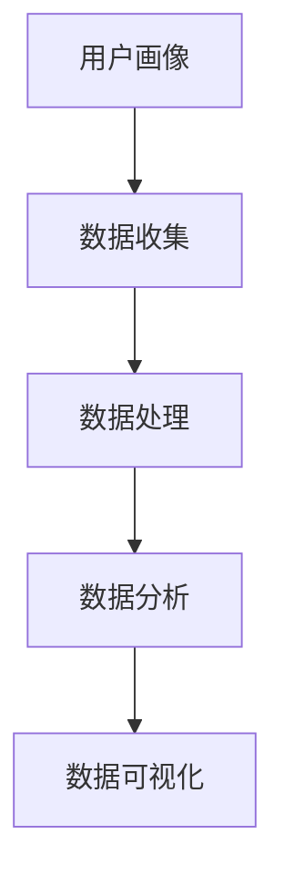

                 

# 用户画像的数据收集方法

在数字时代，用户画像（User Persona）已成为企业和研究机构洞察用户需求、制定个性化策略的重要工具。构建一个精准有效的用户画像，依赖于充分、深入的数据收集和分析。本文将系统介绍用户画像数据收集的方法和策略，涵盖数据源选择、数据收集技术、数据处理流程和最佳实践，为读者提供全面的指导。

## 1. 背景介绍

### 1.1 问题由来
用户画像的构建，离不开系统化、结构化、数据驱动的方法。在信息爆炸的互联网时代，如何高效、准确地收集用户数据，构建详细、准确的用户画像，是一个重要而复杂的问题。传统的数据收集方法，如问卷调查、电话访谈等，已无法满足现代数据量庞大的需求，而新兴的数据收集技术则带来了新的解决方案。

### 1.2 问题核心关键点
构建用户画像的核心是收集用户的行为数据、态度数据和背景数据。这些数据可以通过各种渠道和方法获取，但如何筛选合适的数据源，并设计高效的数据收集流程，是本文关注的重点。

### 1.3 问题研究意义
构建精准用户画像，有助于企业准确把握用户需求，优化产品和服务，提升用户体验。同时，在市场营销、用户研究、内容创作等领域，用户画像也提供了强有力的支撑。本文将详细介绍数据收集的策略和技巧，为构建高质量的用户画像奠定基础。

## 2. 核心概念与联系

### 2.1 核心概念概述

构建用户画像涉及多个概念，理解这些概念及其相互关系，是进行有效数据收集的前提：

- **用户画像（User Persona）**：即用户群体的理想化、简化的代表性形象，通过多维度的数据收集和分析，形成用户特征的完整画像。

- **数据收集（Data Collection）**：通过多种渠道和方法，从用户那里获取相关信息，并形成结构化数据。

- **数据处理（Data Processing）**：对原始数据进行清洗、整理、统计和分析，提取有用的信息，构建用户特征模型。

- **数据存储（Data Storage）**：将处理好的数据存入数据库或其他存储系统，方便后续的查询和使用。

- **数据分析（Data Analysis）**：利用统计学、机器学习等方法，对数据进行深度挖掘，识别出用户的关键行为和特征。

- **数据可视化（Data Visualization）**：将分析结果以图表、报告等形式展示出来，辅助决策和洞察。

### 2.2 概念间的关系

用户画像的构建是一个多步骤、多环节的过程。不同阶段需要不同的数据和技能，如图：



其中，数据收集是基础，处理和分析是关键，而可视化则是结果的呈现。各个环节相互关联，共同构成完整的用户画像构建流程。

## 3. 核心算法原理 & 具体操作步骤
### 3.1 算法原理概述

用户画像的数据收集，本质上是一个从数据源获取信息，并对这些信息进行系统化处理的过程。数据收集的目标是构建一个包含用户行为、兴趣、需求等多维特征的画像。

形式化地说，用户画像 $P$ 可以表示为：

$$
P = (B, I, N, A, C)
$$

其中，$B$ 表示用户行为特征，$I$ 表示用户兴趣特征，$N$ 表示用户需求特征，$A$ 表示用户属性特征，$C$ 表示用户情感特征。这些特征数据可以通过多种数据源获取，并通过一系列处理和分析技术，形成最终的用户画像。

### 3.2 算法步骤详解

用户画像的数据收集一般包括以下几个关键步骤：

**Step 1: 确定数据收集目标**
- 明确收集数据的目的是什么，是用于产品优化、市场营销还是用户研究等。
- 确定用户画像的关键维度，如用户行为、兴趣、需求等。

**Step 2: 筛选数据源**
- 根据数据源的覆盖范围、数据质量和可获取性，筛选合适的数据源。
- 常用的数据源包括网站流量数据、社交媒体数据、交易数据、问卷调查数据等。

**Step 3: 设计数据收集工具**
- 根据数据收集目标，设计相应的数据收集工具。
- 如使用网页分析工具收集网站行为数据，使用问卷调查工具收集用户态度数据。

**Step 4: 实施数据收集**
- 根据设计好的工具，实施数据收集。
- 可以通过API接口、爬虫、问卷等方式进行数据获取。

**Step 5: 数据清洗与整理**
- 对原始数据进行去重、去噪、格式化等处理，确保数据质量。
- 使用数据清洗工具，如Python的pandas库，进行数据预处理。

**Step 6: 数据存储与标注**
- 将处理好的数据存入数据库或其他存储系统，便于后续查询。
- 对数据进行标注，将用户特征映射到具体维度，如用户行为、兴趣等。

**Step 7: 数据分析与建模**
- 利用统计学、机器学习等方法，对数据进行深度挖掘。
- 构建用户特征模型，如用户行为模式、兴趣偏好等。

**Step 8: 数据可视化与报告**
- 将分析结果以图表、报告等形式展示出来，辅助决策和洞察。
- 使用数据可视化工具，如Tableau、PowerBI等。

### 3.3 算法优缺点

用户画像的数据收集方法具有以下优点：
- 系统化：通过多个渠道和方法，收集全面的用户数据。
- 可扩展性：随着数据源的增加，可以持续收集和更新用户画像。
- 高效性：使用自动化工具和机器学习方法，加快数据处理速度。

同时，该方法也存在以下局限：
- 数据隐私问题：用户隐私保护是一个重要考虑因素，需要在数据收集和使用过程中严格遵守相关法规。
- 数据质量和一致性：数据源的多样性可能影响数据质量和一致性，需要进行严格的筛选和清洗。
- 数据维度复杂：构建完整的用户画像需要收集多维度的数据，工作量较大。

### 3.4 算法应用领域

用户画像的数据收集方法在多个领域得到了广泛应用：

- **市场营销**：通过收集用户行为数据，分析用户购买偏好，制定个性化营销策略。
- **产品开发**：通过收集用户反馈和行为数据，优化产品功能和用户体验。
- **用户体验研究**：通过收集用户的使用数据，分析用户满意度，提升服务质量。
- **内容创作**：通过收集用户的兴趣数据，定制个性化内容，提升用户粘性。
- **客户服务**：通过收集用户反馈数据，优化客服策略，提升服务水平。

## 4. 数学模型和公式 & 详细讲解

### 4.1 数学模型构建

用户画像的数据收集模型可以形式化为：

$$
D = \{d_1, d_2, ..., d_n\}
$$

其中，$d_i$ 表示来自第 $i$ 个数据源的用户数据。每个数据源 $d_i$ 可以分为若干个特征维度，如行为特征 $B_i$、兴趣特征 $I_i$、需求特征 $N_i$ 等。

### 4.2 公式推导过程

以网站行为数据为例，用户行为特征 $B_i$ 可以表示为：

$$
B_i = (p_i, u_i, s_i, v_i)
$$

其中，$p_i$ 表示页面访问次数，$u_i$ 表示用户在网站的停留时间，$s_i$ 表示用户浏览的页面集合，$v_i$ 表示用户浏览页面的页面深度。

通过对多个数据源的行为数据进行统计和分析，可以得到用户行为特征的聚类结果：

$$
K-means(B_1, B_2, ..., B_n) = \{C_1, C_2, ..., C_k\}
$$

其中，$C_1, C_2, ..., C_k$ 表示不同行为特征的用户群体。

### 4.3 案例分析与讲解

假设我们有一个电商平台，需要构建用户画像以优化产品推荐。可以设计以下数据收集和处理流程：

**Step 1: 确定数据收集目标**
- 优化产品推荐，提升用户体验。

**Step 2: 筛选数据源**
- 网站流量数据、交易数据、用户评价数据等。

**Step 3: 设计数据收集工具**
- 使用网站分析工具Google Analytics收集网站流量数据。
- 设计调查问卷，收集用户对产品的评价和需求。

**Step 4: 实施数据收集**
- 通过API接口获取网站流量数据。
- 在线下和线上分发问卷调查，收集用户反馈。

**Step 5: 数据清洗与整理**
- 使用Python的pandas库清洗和整理数据，去除无效和重复记录。

**Step 6: 数据存储与标注**
- 将处理好的数据存入数据库，对用户特征进行标注，如用户行为、兴趣等。

**Step 7: 数据分析与建模**
- 使用机器学习算法，如聚类算法、关联规则挖掘，分析用户行为和兴趣。
- 构建用户行为模式和兴趣偏好的模型。

**Step 8: 数据可视化与报告**
- 使用Tableau进行数据可视化，展示用户画像和推荐结果。
- 定期更新用户画像，调整推荐策略。

## 5. 项目实践：代码实例和详细解释说明

### 5.1 开发环境搭建

要进行用户画像的数据收集和处理，需要以下开发环境：

1. 安装Python和相关库：如numpy、pandas、scikit-learn、matplotlib等。
2. 安装数据收集工具：如Python的requests库，用于网站数据爬取。
3. 安装数据分析工具：如Jupyter Notebook，用于交互式数据处理和分析。
4. 安装数据可视化工具：如Tableau或PowerBI，用于生成可视化报告。

### 5.2 源代码详细实现

以下是一个使用Python和Pandas库进行用户画像数据收集的示例代码：

```python
import pandas as pd
import requests

# 获取网站流量数据
url = 'https://example.com'
response = requests.get(url)
html = response.text

# 解析网页内容，提取用户行为数据
soup = BeautifulSoup(html, 'html.parser')
data = []
for link in soup.find_all('a'):
    href = link.get('href')
    if href is not None:
        data.append((href, link.text, link.get('target'), link.get('title')))
        
# 使用Pandas将数据保存为CSV文件
df = pd.DataFrame(data, columns=['url', 'text', 'target', 'title'])
df.to_csv('web_data.csv', index=False)
```

这个代码片段展示了如何使用requests库和BeautifulSoup库从网站上提取用户行为数据。具体步骤如下：

1. 发送HTTP请求，获取网站页面内容。
2. 使用BeautifulSoup解析HTML内容，提取链接信息。
3. 将提取的数据保存为CSV文件。

### 5.3 代码解读与分析

上述代码实现了从网站页面上提取链接和相关元信息的功能。具体来说，步骤如下：

1. 使用requests库发送HTTP请求，获取页面内容。
2. 使用BeautifulSoup解析HTML内容，遍历所有链接元素。
3. 提取链接的URL、文本、目标和标题，并将这些信息保存为一个列表。
4. 使用Pandas将列表保存为CSV文件，方便后续的数据处理和分析。

这个代码示例展示了Python在数据收集和处理中的应用，具体步骤如下：

1. 发送HTTP请求，获取页面内容。
2. 使用BeautifulSoup解析HTML内容，提取链接信息。
3. 将提取的数据保存为CSV文件。

### 5.4 运行结果展示

假设我们收集到的网站流量数据如下：

```
url, text, target, title
https://example.com/page1, 点击1次，内部链接，title1
https://example.com/page2, 点击5次，外部链接，title2
https://example.com/page3, 点击2次，内部链接，title3
```

通过上述代码，我们可以得到保存为CSV文件的数据：

```
url, text, target, title
https://example.com/page1, 点击1次，内部链接，title1
https://example.com/page2, 点击5次，外部链接，title2
https://example.com/page3, 点击2次，内部链接，title3
```

## 6. 实际应用场景

### 6.1 电子商务推荐系统

在电子商务领域，用户画像的构建对于个性化推荐系统至关重要。通过收集用户行为数据，分析用户的浏览和购买历史，可以构建用户画像，优化推荐算法，提升用户体验。例如，阿里巴巴的天猫超市就通过构建详细的用户画像，为用户提供个性化的购物推荐，提高了用户满意度和销售额。

### 6.2 金融风险管理

金融行业需要精确评估用户风险，以制定有效的风险管理策略。通过收集用户交易数据、信用评分等，构建用户画像，可以分析用户行为模式，预测潜在风险，优化风险控制策略。例如，蚂蚁金服通过构建用户画像，实现了智能风控系统，有效降低了用户违约率。

### 6.3 广告投放优化

广告投放需要精确投放给感兴趣的用户群体，以提高广告效果。通过收集用户浏览数据、广告点击数据等，构建用户画像，可以识别出潜在的高价值用户，优化广告投放策略。例如，百度的百度广告系统通过用户画像，实现了精准投放，提升了广告ROI。

### 6.4 未来应用展望

未来，用户画像的数据收集方法将在更多领域得到应用，为各行各业带来变革性影响。例如：

- 智慧医疗：通过收集患者数据，构建用户画像，优化医疗服务，提升诊疗效果。
- 智能制造：通过收集工人操作数据，构建用户画像，优化生产流程，提高生产效率。
- 智慧城市：通过收集居民行为数据，构建用户画像，优化城市管理，提高居民满意度。

## 7. 工具和资源推荐

### 7.1 学习资源推荐

为了帮助开发者系统掌握用户画像的数据收集方法，这里推荐一些优质的学习资源：

1. 《用户画像构建与分析》系列博文：由大公司数据科学家撰写，深入浅出地介绍了用户画像构建的基本概念和实践方法。
2. 《用户画像的科学与艺术》书籍：全面介绍了用户画像的理论基础和实践技巧，适合系统学习。
3. 《用户画像实战》在线课程：提供丰富的案例分析和实际项目，帮助学习者掌握用户画像的构建和应用。
4. 《数据科学与用户画像》MOOC课程：由知名高校开设的课程，涵盖用户画像的理论和实践，适合进阶学习。
5. 《用户画像与人工智能》论文：介绍使用机器学习算法进行用户画像构建的最新研究成果，拓展视野。

通过对这些资源的学习实践，相信你一定能够快速掌握用户画像的数据收集方法，并用于解决实际的业务问题。

### 7.2 开发工具推荐

高效的数据收集和处理离不开优秀的工具支持。以下是几款用于用户画像数据收集开发的常用工具：

1. Google Analytics：Google提供的网站流量分析工具，提供丰富的用户行为数据，易于使用。
2. SEMrush：全球领先的SEO工具，提供详细的用户搜索行为数据，帮助优化营销策略。
3. Tableau：数据可视化工具，支持多种数据源，提供丰富的可视化图表和报告。
4. Python Pandas：数据分析库，支持高效的数据清洗和处理，便于后续分析。
5. Apache Spark：大数据处理框架，支持分布式计算，处理海量数据。

合理利用这些工具，可以显著提升用户画像数据收集的效率和准确性，加快创新迭代的步伐。

### 7.3 相关论文推荐

用户画像的数据收集方法在学术界和产业界得到了广泛关注，以下是几篇奠基性的相关论文，推荐阅读：

1. "User Profiling for Recommendation Systems: A Survey"：综述了用户画像在推荐系统中的应用，介绍了多种用户画像构建方法。
2. "A Survey of User Profiling for Personalized Marketing"：介绍了用户画像在个性化营销中的应用，总结了用户画像构建的关键技术。
3. "Adaptive User Profiling for Web Recommendation Systems"：提出了一种自适应用户画像构建方法，结合用户行为和兴趣，提高了推荐系统的准确性。
4. "Social Media Mining for User Profiling"：介绍了社交媒体数据在用户画像构建中的应用，探讨了社交网络特征提取方法。
5. "User Profiling Using Web History Data"：提出了一种基于Web浏览历史的用户画像构建方法，分析了Web数据的特征和潜在价值。

这些论文代表了用户画像数据收集技术的发展脉络，通过学习这些前沿成果，可以帮助研究者把握学科前进方向，激发更多的创新灵感。

除上述资源外，还有一些值得关注的前沿资源，帮助开发者紧跟用户画像数据收集技术的最新进展，例如：

1. arXiv论文预印本：人工智能领域最新研究成果的发布平台，包括大量尚未发表的前沿工作，学习前沿技术的必读资源。
2. 业界技术博客：如Google、Facebook、Amazon等顶尖公司官方博客，第一时间分享他们的最新研究成果和洞见。
3. 技术会议直播：如KDD、SIGKDD、ICDM等人工智能领域顶会现场或在线直播，能够聆听到大佬们的前沿分享，开拓视野。
4. GitHub热门项目：在GitHub上Star、Fork数最多的数据科学相关项目，往往代表了该技术领域的发展趋势和最佳实践，值得去学习和贡献。
5. 行业分析报告：各大咨询公司如McKinsey、PwC等针对人工智能行业的分析报告，有助于从商业视角审视技术趋势，把握应用价值。

总之，用户画像的数据收集方法需要开发者不断学习新知识，掌握新工具，不断实践和优化。只有从数据、算法、工程、业务等多个维度协同发力，才能真正构建出精准、全面的用户画像。

## 8. 总结：未来发展趋势与挑战

### 8.1 总结

本文对用户画像的数据收集方法进行了全面系统的介绍。首先阐述了用户画像构建的重要性，明确了数据收集的目标和关键维度。其次，从原理到实践，详细讲解了数据收集的数学模型和具体步骤。同时，本文还广泛探讨了数据收集方法在多个领域的应用前景，展示了其巨大的应用潜力。最后，本文精选了数据收集的各类学习资源，力求为读者提供全方位的技术指引。

通过本文的系统梳理，可以看到，用户画像的数据收集方法在构建精准用户画像、优化产品和服务、提升用户体验等方面具有重要价值。未来，随着数据收集技术的不断进步，用户画像将进一步深入各行各业，带来更加个性化的服务体验和更高的经济效益。

### 8.2 未来发展趋势

展望未来，用户画像的数据收集方法将呈现以下几个发展趋势：

1. 数据来源多样化。未来的数据收集将不再局限于网站和社交媒体，而是拓展到更多渠道，如物联网设备、智能家居等，以获取更全面的用户数据。
2. 数据质量提升。通过自动化和智能化的数据收集工具，可以大大提升数据质量和一致性，减少手动干预。
3. 数据实时性增强。实时数据收集和处理技术的发展，使得用户画像可以更加动态、实时地更新，提升决策的即时性和准确性。
4. 数据隐私保护。随着数据隐私法规的不断完善，数据收集和处理需要更加注重用户隐私保护，遵循数据隐私保护法规。
5. 数据联邦化。通过数据联邦技术，可以在不泄露用户隐私的情况下，进行多源数据联合分析和建模，提升用户画像的准确性。

以上趋势凸显了用户画像数据收集技术的广阔前景。这些方向的探索发展，必将进一步提升用户画像的质量和应用价值，为构建智能系统提供坚实的数据基础。

### 8.3 面临的挑战

尽管用户画像的数据收集技术已经取得了显著进展，但在迈向更加智能化、普适化应用的过程中，它仍面临着诸多挑战：

1. 数据隐私问题。用户数据隐私保护是一个重要考虑因素，需要在数据收集和使用过程中严格遵守相关法规。
2. 数据质量和一致性。数据源的多样性可能影响数据质量和一致性，需要进行严格的筛选和清洗。
3. 数据维度复杂。构建完整的用户画像需要收集多维度的数据，工作量较大。
4. 数据存储和处理。海量数据的存储和处理需要高性能的存储和计算基础设施。
5. 数据安全和可靠性。用户数据的安全性和可靠性是数据收集的根本，需要采取一系列技术和措施，保障数据安全。

### 8.4 研究展望

面对用户画像数据收集所面临的种种挑战，未来的研究需要在以下几个方面寻求新的突破：

1. 探索高效、自动化的数据收集方法。开发更加智能化、自动化的数据收集工具，减少人工干预，提升数据收集效率。
2. 研究数据隐私保护技术。开发数据脱敏和匿名化技术，确保用户数据隐私，防止数据滥用。
3. 开发数据联合分析方法。研究多源数据联合分析方法，提升用户画像的准确性和可靠性。
4. 引入区块链技术。利用区块链技术，保障用户数据的透明和可追溯，提升数据可信度。
5. 探索数据联邦化技术。研究数据联邦技术，实现跨机构、跨平台的数据共享和联合建模。

这些研究方向的探索，必将引领用户画像数据收集技术迈向更高的台阶，为构建安全、可靠、可解释、可控的智能系统铺平道路。面向未来，用户画像数据收集技术还需要与其他人工智能技术进行更深入的融合，如知识表示、因果推理、强化学习等，多路径协同发力，共同推动自然语言理解和智能交互系统的进步。只有勇于创新、敢于突破，才能不断拓展用户画像的边界，让智能技术更好地造福人类社会。

## 9. 附录：常见问题与解答

**Q1：如何选择合适的数据源？**

A: 选择数据源应考虑以下因素：
- 数据覆盖范围：确保数据源能够覆盖目标用户群体的主要行为和特征。
- 数据质量：选择数据完整、准确、时效性高的数据源。
- 数据可获取性：选择易于获取和整合的数据源。

**Q2：如何设计有效的数据收集工具？**

A: 设计数据收集工具应考虑以下步骤：
- 确定数据收集目标：明确收集数据的目的是什么。
- 确定数据类型：明确要收集的数据类型，如行为数据、态度数据、背景数据等。
- 设计数据收集流程：设计合理的数据收集流程，确保数据收集的全面性和准确性。
- 选择合适的数据收集工具：根据数据类型和收集目标，选择合适的数据收集工具。

**Q3：如何进行数据清洗和处理？**

A: 数据清洗和处理应考虑以下步骤：
- 去除无效数据：去除重复、无关、异常数据。
- 处理缺失数据：填补缺失值或删除缺失值较多的记录。
- 数据格式标准化：统一数据格式，便于后续分析和建模。
- 数据去重：去除重复记录，避免数据冗余。

**Q4：如何进行数据分析和建模？**

A: 数据分析和建模应考虑以下步骤：
- 确定分析目标：明确数据分析的目的是什么，如用户行为分析、用户兴趣分析等。
- 选择合适的分析方法：根据分析目标，选择相应的分析方法，如聚类分析、关联规则挖掘等。
- 构建用户画像模型：根据分析结果，构建用户画像模型，如用户行为模式、兴趣偏好等。

**Q5：如何进行数据可视化？**

A: 数据可视化应考虑以下步骤：
- 确定可视化目标：明确可视化目标，如展示用户行为特征、展示用户画像等。
- 选择合适的可视化工具：根据可视化目标，选择相应的可视化工具，如Tableau、PowerBI等。
- 设计可视化图表：设计简洁、美观、易读的可视化图表，展示分析结果。

通过这些问题和解答，相信读者能够更好地理解和掌握用户画像的数据收集方法，为构建精准的用户画像奠定坚实基础。

---

作者：禅与计算机程序设计艺术 / Zen and the Art of Computer Programming

