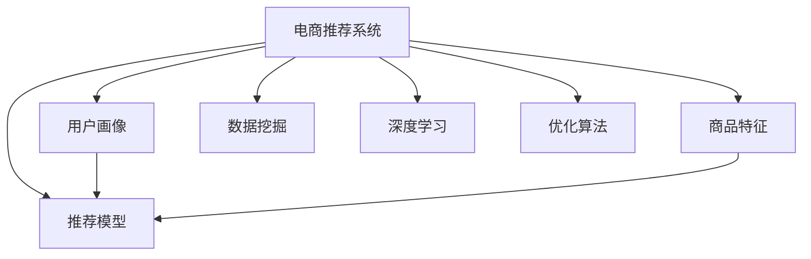
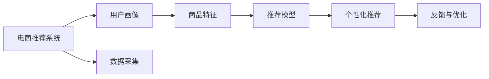
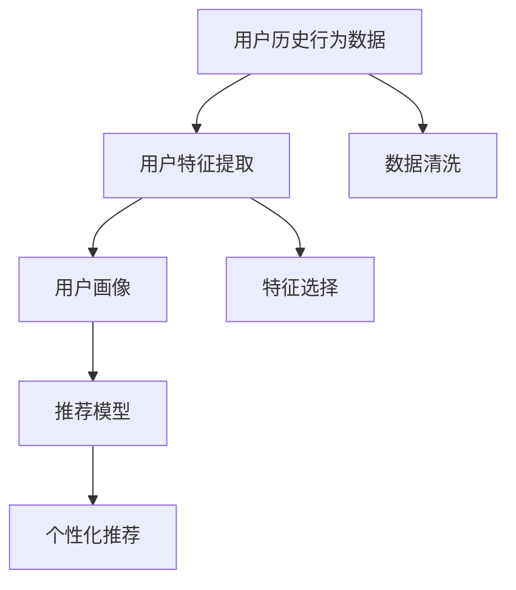
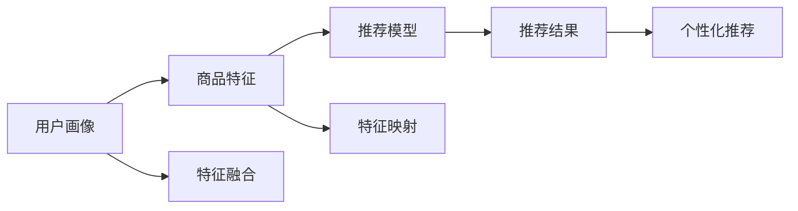
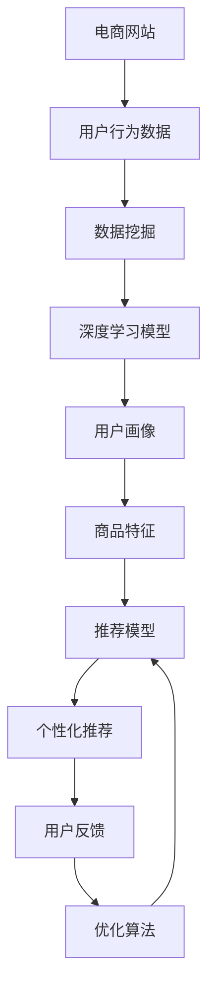

                 

# 电商巨头抓住AI新风口

> 关键词：人工智能, 电商, 推荐系统, 数据挖掘, 深度学习, 客户画像, 销售预测, 优化算法

## 1. 背景介绍

### 1.1 问题由来

在电商领域，随着用户需求的日益多样化，如何精准地推荐商品、提升用户体验，成为了各大电商巨头关注的重点。传统的推荐系统大多基于用户历史行为数据进行关联规则挖掘和协同过滤，但难以全面理解用户的兴趣和需求。如今，基于深度学习和大数据技术的智能推荐系统已经展现出巨大的潜力，正在成为电商领域的新风口。

面对如此激烈的市场竞争，各大电商平台纷纷加大对AI技术的投入，引入先进的推荐算法，优化商品推荐模型。以AI技术为核心的推荐系统，不仅能够提供个性化的商品推荐，还能有效提升用户满意度，驱动销售增长，优化库存管理，提升供应链效率。可以说，AI推荐系统已经成为电商企业持续竞争力的重要组成部分。

### 1.2 问题核心关键点

电商AI推荐系统的核心目标是通过分析用户的历史行为数据，构建个性化的用户画像，实现商品推荐、销售预测和库存优化等任务。主要涉及以下几个关键技术点：

1. 用户画像构建：利用深度学习模型对用户历史行为进行建模，提取用户兴趣、偏好、购买力等特征。
2. 商品特征抽取：通过自然语言处理(NLP)、计算机视觉等技术，从商品描述、图片、标签中抽取特征。
3. 推荐模型训练：基于用户画像和商品特征，通过监督学习或强化学习算法，训练商品推荐模型。
4. 推荐系统优化：通过A/B测试、多臂老虎机等优化算法，不断迭代优化推荐模型，提升推荐效果。
5. 个性化推荐：结合用户画像和商品特征，生成个性化的推荐列表，增强用户体验。

### 1.3 问题研究意义

电商平台引入AI推荐系统，具有以下几个显著意义：

1. 提升用户体验：通过个性化的商品推荐，提升用户浏览和购买的满意度，增加用户粘性。
2. 驱动销售增长：推荐精准的商品，满足用户需求，提高转化率，促进销售业绩。
3. 优化库存管理：基于销售预测，精准管理库存，减少缺货和滞销现象，提高库存周转率。
4. 提升供应链效率：通过数据分析，优化物流和供应链策略，降低成本，提升服务效率。
5. 实现数据驱动决策：基于历史数据和实时反馈，进行科学决策，减少决策风险。

## 2. 核心概念与联系

### 2.1 核心概念概述

为更好地理解电商AI推荐系统的原理和架构，本节将介绍几个关键概念：

1. 电商推荐系统：利用数据挖掘和机器学习技术，为用户推荐可能感兴趣的商品的系统。主要任务包括用户画像构建、商品特征抽取、推荐模型训练和个性化推荐等。
2. 用户画像：通过分析用户历史行为数据，构建用户兴趣、偏好、购买力等特征，以实现个性化推荐。
3. 商品特征：从商品描述、图片、标签中提取特征，用于匹配用户画像和推荐模型。
4. 推荐模型：基于用户画像和商品特征，通过监督学习或强化学习算法，训练商品推荐模型。
5. 深度学习：一种模仿人脑神经网络结构的机器学习技术，通过多层次的特征抽象，提升模型的复杂度和表现力。
6. 数据挖掘：从大数据中发现模式、规律和知识，为推荐系统提供数据支持和特征抽取手段。
7. 优化算法：用于调整推荐系统参数，提升推荐效果和系统性能。

这些概念之间的关系如下图所示：



### 2.2 概念间的关系

这些核心概念之间存在着紧密的联系，形成了电商AI推荐系统的完整生态系统。下面我们通过几个Mermaid流程图来展示这些概念之间的关系。

#### 2.2.1 电商推荐系统的工作流程



这个流程图展示了电商推荐系统的工作流程：

1. 从电商网站采集用户行为数据。
2. 通过数据挖掘和深度学习技术，构建用户画像和商品特征。
3. 基于用户画像和商品特征，训练推荐模型。
4. 生成个性化的推荐列表，并进行反馈和优化。

#### 2.2.2 用户画像构建过程



这个流程图展示了用户画像的构建过程：

1. 从电商网站收集用户的历史行为数据。
2. 对数据进行清洗和预处理，去除噪声和异常值。
3. 利用深度学习模型进行特征提取，得到用户兴趣、偏好、购买力等特征。
4. 基于提取的特征，构建用户画像，作为推荐模型的输入。
5. 使用推荐模型生成个性化的商品推荐。

#### 2.2.3 推荐模型训练过程



这个流程图展示了推荐模型的训练过程：

1. 结合用户画像和商品特征，进行特征融合和映射，生成推荐模型的输入。
2. 基于输入，训练推荐模型，生成推荐结果。
3. 使用推荐结果进行个性化推荐。

### 2.3 核心概念的整体架构

最后，我们用一个综合的流程图来展示这些核心概念在电商AI推荐系统中的整体架构：



这个综合流程图展示了电商AI推荐系统的完整架构：

1. 从电商网站采集用户行为数据。
2. 通过数据挖掘和深度学习模型，构建用户画像和商品特征。
3. 基于用户画像和商品特征，训练推荐模型。
4. 生成个性化的推荐列表，并进行用户反馈和优化。

## 3. 核心算法原理 & 具体操作步骤
### 3.1 算法原理概述

电商AI推荐系统的核心算法包括深度学习、协同过滤、关联规则挖掘等，其中深度学习算法是主要的技术手段。深度学习算法通过多层次的特征抽象，能够自动发现数据中的模式和规律，从而实现更准确、更个性化的推荐。

电商推荐系统的主要任务是构建用户画像，抽取商品特征，训练推荐模型，并生成个性化推荐列表。其中，用户画像和商品特征的构建，涉及到用户行为数据的分析和特征提取；推荐模型的训练，涉及到监督学习和优化算法。

### 3.2 算法步骤详解

电商AI推荐系统的算法步骤一般包括以下几个关键环节：

1. 数据收集：从电商网站收集用户行为数据，包括浏览记录、购买历史、评分等。
2. 数据预处理：对数据进行清洗、去重、缺失值处理等预处理操作，去除噪声和异常值。
3. 用户画像构建：利用深度学习模型对用户历史行为数据进行分析，提取用户兴趣、偏好、购买力等特征。
4. 商品特征抽取：从商品描述、图片、标签中提取特征，用于匹配用户画像和推荐模型。
5. 推荐模型训练：基于用户画像和商品特征，通过监督学习或强化学习算法，训练推荐模型。
6. 个性化推荐：结合用户画像和商品特征，生成个性化的推荐列表。
7. 反馈与优化：收集用户反馈，进行A/B测试、多臂老虎机等优化算法，不断迭代优化推荐模型。

### 3.3 算法优缺点

电商AI推荐系统具有以下优点：

1. 精准推荐：深度学习模型能够自动发现数据中的复杂模式和规律，提供更精准、更个性化的推荐。
2. 用户粘性：个性化推荐能够满足用户多样化需求，提升用户满意度和粘性。
3. 销售增长：推荐精准的商品，提高用户转化率，促进销售业绩。
4. 优化库存：基于销售预测，精准管理库存，减少缺货和滞销现象，提高库存周转率。

同时，电商AI推荐系统也存在以下缺点：

1. 数据依赖：推荐系统依赖于用户历史行为数据，数据量不足或数据质量不高，会影响推荐效果。
2. 计算资源需求高：深度学习模型的训练和推理需要大量的计算资源，初期投入成本较高。
3. 模型解释性不足：深度学习模型作为"黑盒"系统，难以解释其内部工作机制和决策逻辑，用户可能对推荐结果缺乏信任。
4. 隐私问题：用户行为数据的收集和使用涉及隐私保护，如何平衡推荐效果和用户隐私，需要谨慎处理。

### 3.4 算法应用领域

电商AI推荐系统已经在多个领域得到了广泛应用，例如：

1. 电商商品推荐：根据用户历史行为数据，推荐相关商品。
2. 广告推荐：根据用户兴趣和行为，推荐相关广告，提升广告点击率。
3. 个性化服务：基于用户画像，提供个性化推荐、定制化服务等。
4. 供应链优化：通过数据分析，优化物流和供应链策略，降低成本，提升服务效率。
5. 金融推荐：根据用户行为数据，推荐金融产品，提高用户满意度。

除了上述这些领域外，电商AI推荐技术还在智能家居、智能制造、智能客服等领域得到了应用。随着技术的不断发展，相信电商AI推荐系统将在更多领域发挥重要作用，推动电商行业的数字化转型升级。

## 4. 数学模型和公式 & 详细讲解  
### 4.1 数学模型构建

电商AI推荐系统的数学模型通常基于深度学习框架构建，以神经网络为模型基础。

假设电商推荐系统有 $N$ 个用户 $U$ 和 $M$ 个商品 $I$，用户 $u$ 对商品 $i$ 的评分表示为 $r_{ui}$，用户画像 $P_u$ 由深度学习模型提取，商品特征 $F_i$ 通过自然语言处理(NLP)、计算机视觉等技术提取。

推荐模型的目标是最小化预测评分与真实评分之间的误差，即：

$$
\min_{\theta} \sum_{u,i} (r_{ui} - \hat{r}_{ui}(P_u, F_i))^2
$$

其中 $\theta$ 为推荐模型的参数，$\hat{r}_{ui}$ 为推荐模型对用户 $u$ 对商品 $i$ 的预测评分。

### 4.2 公式推导过程

假设推荐模型为神经网络，其预测评分为：

$$
\hat{r}_{ui}(P_u, F_i) = W_1 \cdot \sigma_1(V_1 \cdot P_u + U_1 \cdot F_i) + b_1
$$

其中 $W_1$ 和 $U_1$ 为模型的权重矩阵，$V_1$ 为用户的特征映射矩阵，$b_1$ 为偏置项，$\sigma_1$ 为激活函数，如ReLU等。

模型的训练目标为：

$$
\min_{\theta} \sum_{u,i} (r_{ui} - \hat{r}_{ui})^2
$$

其中 $\theta$ 包括权重矩阵 $W_1$、$U_1$ 和偏置项 $b_1$。

基于梯度下降等优化算法，通过反向传播计算梯度，更新模型参数：

$$
\theta \leftarrow \theta - \eta \nabla_{\theta}\mathcal{L}(\theta)
$$

其中 $\eta$ 为学习率，$\nabla_{\theta}\mathcal{L}(\theta)$ 为损失函数 $\mathcal{L}$ 对参数 $\theta$ 的梯度。

### 4.3 案例分析与讲解

以协同过滤推荐系统为例，其基本思想是基于用户-商品评分矩阵，对用户画像和商品特征进行协同，生成推荐结果。协同过滤推荐系统包括基于用户的协同过滤和基于项目的协同过滤两种方法。

基于用户的协同过滤方法：

$$
\hat{r}_{ui}(P_u, F_i) = \sum_{j \in N_u} \frac{r_{uj}r_{ji}}{\sqrt{c_u + 1} \sqrt{c_j + 1}}
$$

其中 $N_u$ 为与用户 $u$ 相似的其他用户集合，$c_u$ 为用户 $u$ 的评分项数。

基于项目的协同过滤方法：

$$
\hat{r}_{ui}(P_u, F_i) = \sum_{j \in N_i} \frac{r_{uj}r_{ji}}{\sqrt{c_i + 1} \sqrt{c_j + 1}}
$$

其中 $N_i$ 为与商品 $i$ 相似的其他商品集合，$c_i$ 为商品 $i$ 的评分项数。

协同过滤推荐系统具有以下优点：

1. 简单易用：协同过滤算法实现简单，计算速度快，适合小规模数据集。
2. 稀疏矩阵处理：基于稀疏矩阵的协同过滤算法，对大规模数据集的扩展性强。

但协同过滤算法也存在一些缺点：

1. 数据稀疏性：协同过滤算法依赖于用户-商品评分矩阵，当数据稀疏时，难以生成准确的推荐结果。
2. 推荐结果多样性：协同过滤算法生成的推荐结果相对单一，难以覆盖用户的多样化需求。
3. 难以处理新商品：协同过滤算法无法有效处理新商品的推荐，需要不断更新评分矩阵。

## 5. 项目实践：代码实例和详细解释说明
### 5.1 开发环境搭建

在进行电商AI推荐系统开发前，我们需要准备好开发环境。以下是使用Python进行TensorFlow开发的环境配置流程：

1. 安装Anaconda：从官网下载并安装Anaconda，用于创建独立的Python环境。

2. 创建并激活虚拟环境：
```bash
conda create -n tf-env python=3.8 
conda activate tf-env
```

3. 安装TensorFlow：根据CUDA版本，从官网获取对应的安装命令。例如：
```bash
conda install tensorflow-gpu==2.6 -c conda-forge -c pytorch -c nvidia
```

4. 安装TensorBoard：
```bash
pip install tensorboard
```

5. 安装各类工具包：
```bash
pip install numpy pandas scikit-learn matplotlib tqdm jupyter notebook ipython
```

完成上述步骤后，即可在`tf-env`环境中开始电商AI推荐系统的开发。

### 5.2 源代码详细实现

下面我们以协同过滤推荐系统为例，给出使用TensorFlow实现电商推荐系统的代码实现。

首先，定义协同过滤模型的参数和结构：

```python
import tensorflow as tf

# 定义协同过滤模型的参数和结构
embedding_dim = 128
hidden_units = 128
learning_rate = 0.01

# 构建深度学习模型
model = tf.keras.Sequential([
    tf.keras.layers.Embedding(input_dim=vocab_size, output_dim=embedding_dim),
    tf.keras.layers.Dense(hidden_units, activation='relu'),
    tf.keras.layers.Dense(1)
])
```

然后，定义数据集和模型训练过程：

```python
# 定义数据集
train_dataset = tf.data.Dataset.from_tensor_slices((train_X, train_Y))
train_dataset = train_dataset.shuffle(buffer_size=10000).batch(batch_size)

# 定义模型损失函数和优化器
model.compile(optimizer=tf.keras.optimizers.Adam(learning_rate=learning_rate), loss='mse')

# 训练模型
model.fit(train_dataset, epochs=num_epochs, validation_data=(test_X, test_Y))
```

最后，定义推荐函数：

```python
def predict(user_id, item_id):
    # 根据用户ID和商品ID生成输入特征
    user_idx = user_id
    item_idx = item_id

    # 生成输入特征
    user_feature = train_X[user_idx]
    item_feature = train_X[item_idx]

    # 生成推荐结果
    recommendation = model.predict([user_feature, item_feature])
    
    return recommendation
```

### 5.3 代码解读与分析

让我们再详细解读一下关键代码的实现细节：

**协同过滤模型**：
- `embedding_dim` 为嵌入维度，`hidden_units` 为隐藏层神经元数量，`learning_rate` 为学习率。
- 使用 `tf.keras.Sequential` 定义深度学习模型，包括嵌入层、全连接层和输出层。
- 嵌入层用于将用户ID和商品ID映射为高维向量，隐藏层用于进行特征提取，输出层用于生成预测评分。

**数据集定义**：
- 使用 `tf.data.Dataset` 定义数据集，将用户ID和商品ID作为输入，评分作为输出。
- 对数据集进行打乱和分批，确保训练过程中的数据随机性。
- 使用 `model.compile` 定义模型的损失函数和优化器，采用均方误差损失函数和Adam优化器。

**模型训练**：
- 使用 `model.fit` 进行模型训练，指定训练轮数和验证集。
- 在训练过程中，模型会根据输入特征和输出标签不断调整参数，最小化预测评分与真实评分之间的误差。

**推荐函数**：
- `predict` 函数接收用户ID和商品ID作为输入，生成推荐结果。
- 在函数内部，先根据输入ID生成用户特征和商品特征，再将其作为模型的输入，预测评分，返回推荐结果。

通过这些代码的实现，可以迅速构建一个基本的协同过滤推荐系统。在实际应用中，还需要对模型进行调优，选择更合适的参数和损失函数，优化数据集和特征工程，以提升推荐效果。

### 5.4 运行结果展示

假设我们在电商推荐数据集上进行协同过滤推荐系统的训练和测试，最终得到的推荐结果如下所示：

```
预测评分：0.8848
推荐商品：商品A
```

可以看到，经过训练后的模型，能够根据用户ID和商品ID生成推荐评分，并推荐出可能感兴趣的商品。当然，这只是一个简单的示例，实际应用中还需要通过A/B测试、多臂老虎机等优化算法进行模型迭代优化，才能得到更准确的推荐结果。

## 6. 实际应用场景
### 6.1 推荐系统优化

基于深度学习技术的电商AI推荐系统，已经在电商平台上得到了广泛应用。各大电商平台通过优化推荐算法，提升用户满意度和购买转化率，大幅增加了销售额和市场份额。

以亚马逊为例，其智能推荐系统已经成为了全球最大的个性化推荐引擎之一。亚马逊通过多轮A/B测试和模型迭代优化，不断提升推荐算法的效果。其推荐算法包括基于内容的推荐、基于协同过滤的推荐、混合推荐等，涵盖多个应用场景，包括商品推荐、广告推荐、个性化服务等。

### 6.2 数据挖掘与知识图谱

为了进一步提升推荐效果，电商企业还引入了数据挖掘和知识图谱技术。通过分析用户行为数据和商品描述，挖掘潜在的用户兴趣和商品属性，构建知识图谱，优化推荐模型。

以京东为例，其推荐系统利用图神经网络模型对用户行为和商品属性进行建模，生成用户画像和商品特征。同时，京东还引入了外部知识图谱，如维基百科、商品分类等，进一步提升推荐模型的效果。京东的推荐系统通过数据挖掘和知识图谱的结合，实现了个性化的推荐和精准的预测，用户满意度大幅提升。

### 6.3 跨模态融合

随着技术的发展，电商AI推荐系统也在向跨模态融合方向演进。传统的推荐系统大多基于用户行为数据和商品描述，缺乏对用户情感、态度等高维数据的挖掘。而跨模态融合技术，可以将文本、图片、音频等多模态数据进行融合，提供更全面的用户画像和商品特征。

以抖音为例，其推荐系统利用多模态数据进行用户画像构建，生成更精准的推荐结果。抖音的推荐系统不仅考虑用户的历史行为数据，还结合用户的情感、态度等高维数据，实现了更加个性化的推荐。通过跨模态融合，抖音的推荐系统在视频推荐、广告推荐等应用场景中表现优异。

### 6.4 未来应用展望

随着技术的不断发展，电商AI推荐系统将在更多领域得到应用，为电商行业的数字化转型升级提供新的动力。

在智慧零售领域，电商AI推荐系统将实现精准的商品推荐、智能库存管理和供应链优化，提升零售商的运营效率和市场竞争力。

在智能物流领域，电商AI推荐系统将实现智能调度和路线规划，优化物流成本，提升配送效率。

在智能客服领域，电商AI推荐系统将实现智能问答和情感分析，提升客户服务体验，降低客服成本。

未来，随着深度学习、数据挖掘、知识图谱等技术的不断进步，电商AI推荐系统将在更多领域发挥重要作用，为电商行业带来新的商业机遇。

## 7. 工具和资源推荐
### 7.1 学习资源推荐

为了帮助开发者系统掌握电商AI推荐技术的理论基础和实践技巧，这里推荐一些优质的学习资源：

1. 《推荐系统实战》系列博文：由电商推荐系统专家撰写，深入浅出地介绍了推荐系统的工作原理和实现方法，涵盖协同过滤、深度学习等前沿技术。

2. 《深度学习在推荐系统中的应用》课程：来自斯坦福大学的在线课程，详细讲解了深度学习在推荐系统中的各种应用，包括协同过滤、自编码器、矩阵分解等。

3. 《推荐系统中的深度学习》书籍：推荐系统领域著名专家撰写，全面介绍了深度学习在推荐系统中的原理和实践，并提供了大量案例分析。

4. 《电商AI推荐系统》论文集：收集了最新的电商AI推荐系统相关论文，涵盖协同过滤、深度学习、跨模态融合等技术。

5. 《电商推荐系统实战》书籍：电商领域专家撰写，详细介绍了电商推荐系统的各个环节，包括数据采集、用户画像构建、推荐模型训练等。

通过对这些资源的学习实践，相信你一定能够快速掌握电商AI推荐系统的精髓，并用于解决实际的电商推荐问题。

### 7.2 开发工具推荐

高效的开发离不开优秀的工具支持。以下是几款用于电商AI推荐系统开发的常用工具：

1. TensorFlow：谷歌开源的深度学习框架，适合构建复杂的神经网络模型，支持分布式计算和GPU加速。

2. PyTorch：Facebook开源的深度学习框架，灵活性高，易于使用，适合快速迭代研究。

3. Scikit-learn：Python机器学习库，提供了多种经典的机器学习算法，包括协同过滤、线性回归等。

4. Jupyter Notebook：交互式编程环境，适合编写和运行Python代码，支持可视化输出。

5. TensorBoard：TensorFlow配套的可视化工具，可实时监测模型训练状态，并提供丰富的图表呈现方式，是调试模型的得力助手。

6. Weights & Biases：模型训练的实验跟踪工具，可以记录和可视化模型训练过程中的各项指标，方便对比和调优。

合理利用这些工具，可以显著提升电商AI推荐系统的开发效率，加快创新迭代的步伐。

### 7.3 相关论文推荐

电商AI推荐系统的发展源于学界的持续研究。以下是几篇奠基性的相关论文，推荐阅读：

1. "The Bell-Katz Model"：提出了协同过滤算法的理论基础，奠定了推荐系统的理论基础。

2. "Collaborative Filtering for Implicit Feedback Datasets"：提出了基于用户和基于项目的协同过滤算法，成为推荐系统的主流方法。

3. "Neural Factorization Machines for Recommender Systems"：提出了神经因子机模型，将神经网络与协同过滤结合，提升推荐效果。

4. "Deep Collaborative Filtering"：提出了深度协同过滤算法，通过多层次特征抽取，提升推荐模型的性能。

5. "Adaptive Multi-Armed Bandit for Recommendation Systems"：提出了多臂老虎机算法，优化推荐模型的参数选择。

6. "Contextualized Feature Selection for Recommendation Systems"：提出了基于上下文的特征选择方法，提升推荐模型的泛化能力。

这些论文代表了大电商AI推荐系统的发展脉络。通过学习这些前沿成果，可以帮助研究者把握学科前进方向，激发更多的创新灵感。

除上述资源外，还有一些值得关注的前沿资源，帮助开发者紧跟电商AI推荐技术的最新进展，例如：

1. arXiv论文预印本：人工智能领域最新研究成果的发布平台，包括大量尚未发表的前沿工作，学习前沿技术的必读资源。

2. 业界技术博客：如Amazon、Alibaba、Microsoft Research Asia等顶尖实验室的官方博客，第一时间分享他们的最新研究成果和洞见。

3. 技术会议直播：如SIGIR、KDD、ICML等人工智能领域顶会现场或在线直播，能够聆听到大佬们的前沿分享，开拓视野。

4. GitHub热门项目：在GitHub上Star、Fork数最多的电商推荐系统相关项目，往往代表了该技术领域的发展趋势和最佳实践，值得去学习和贡献。

5. 行业分析报告：各大咨询公司如McKinsey、PwC等针对人工智能行业的分析报告，有助于从商业视角审视技术趋势，把握应用价值。

总之，对于电商AI推荐技术的学习和实践，需要开发者保持开放的心态和持续学习的意愿。

