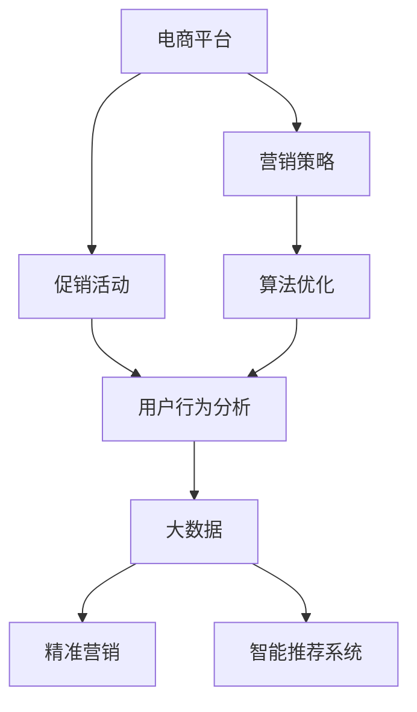
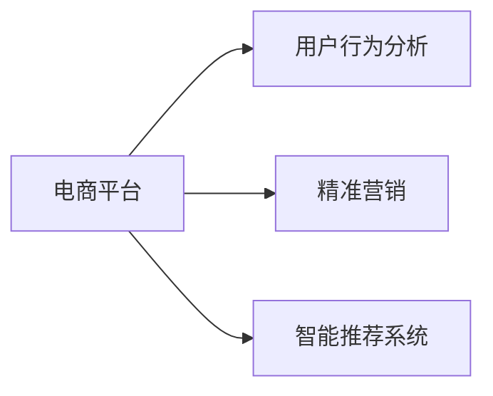
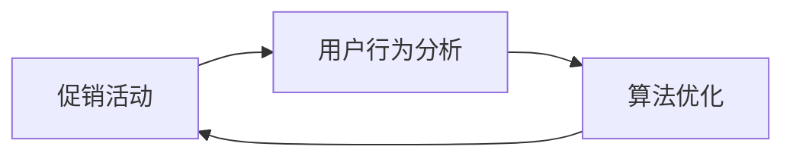
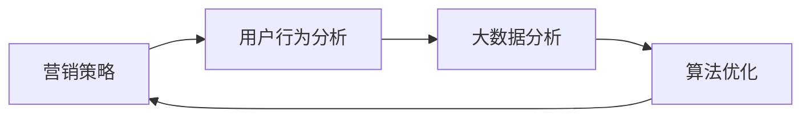
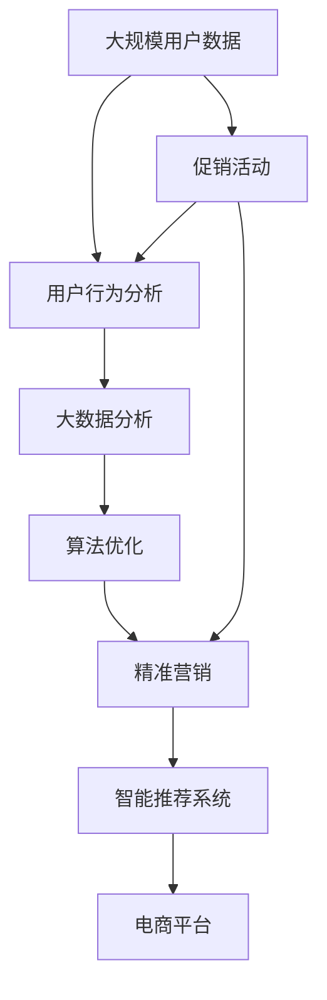

                 

# 电商平台供给能力提升：促销活动和营销策略

> 关键词：电商平台, 供给能力, 促销活动, 营销策略, 算法优化, 用户行为分析, 大数据, 精准营销, 智能推荐系统

## 1. 背景介绍

### 1.1 问题由来

随着电商市场的快速发展和竞争的加剧，电商平台为了吸引和留住用户，不断推出各种促销活动和营销策略。然而，如何科学、有效地提升平台的供给能力，同时提升用户体验，是一个复杂而多面的问题。传统的促销活动和营销策略往往依赖经验和人工决策，无法兼顾短期和长期利益，导致资源浪费和用户流失。为了解决这一问题，电商平台逐渐引入数据驱动的策略优化方法，特别是基于机器学习和数据科学的方法，以提升平台的供给能力和用户满意度。

### 1.2 问题核心关键点

提升电商平台供给能力的关键在于：
1. **数据驱动决策**：利用用户行为数据、历史销售数据、市场趋势等大数据，科学制定促销策略和营销活动。
2. **实时反馈调整**：根据促销活动和营销策略的实时效果，动态调整策略，实现资源的最优配置。
3. **个性化推荐**：通过分析用户行为和偏好，精准推荐产品，提高用户的购买率和满意度。
4. **跨部门协同**：实现供应链、营销、客服等部门的协同合作，确保活动和策略的顺利执行。

### 1.3 问题研究意义

提升电商平台供给能力对于电商平台的长期发展和竞争力至关重要：
1. **用户满意度提升**：精准的促销活动和个性化推荐，能够提高用户的购买体验，增加用户粘性。
2. **库存管理优化**：通过动态调整库存和促销策略，减少库存积压和缺货现象，提升资金使用效率。
3. **营销效果增强**：科学的数据驱动决策，能够有效提升营销活动的ROI，实现成本效益最大化。
4. **供应链协同**：通过跨部门协同，确保供应链的灵活性和响应速度，提高整体运营效率。

## 2. 核心概念与联系

### 2.1 核心概念概述

为更好地理解电商平台促销活动和营销策略的优化方法，本节将介绍几个密切相关的核心概念：

- **电商平台**：指在线销售平台，通过互联网技术提供商品展示、购买、支付等服务。
- **供给能力**：指电商平台在一定时期内，能够提供商品的数量和种类，以及满足用户需求的能力。
- **促销活动**：指电商平台为了吸引用户购买，在特定时间或特定条件下，提供的优惠活动，如折扣、满减、赠品等。
- **营销策略**：指电商平台通过市场调研、数据分析等手段，制定的长期和短期营销计划，如内容营销、社交媒体营销、精准广告等。
- **算法优化**：指通过机器学习算法，对促销活动和营销策略进行优化，以提升供给能力和用户满意度。
- **用户行为分析**：指通过数据分析技术，理解用户行为和偏好，为个性化推荐和精准营销提供依据。
- **大数据**：指通过大规模数据处理和分析技术，从海量数据中提取有价值的信息，支持决策和优化。
- **精准营销**：指根据用户行为和偏好，精准定位用户，实现高效营销。
- **智能推荐系统**：指通过算法和模型，自动推荐产品，提升用户体验。

这些核心概念之间的逻辑关系可以通过以下Mermaid流程图来展示：



这个流程图展示了几类核心概念之间的关系：

1. 电商平台通过促销活动和营销策略，吸引用户购买。
2. 促销活动和营销策略的制定，依赖于用户行为分析。
3. 用户行为分析和大数据，为算法优化提供数据支持。
4. 算法优化和智能推荐系统，提升电商平台的供给能力和用户体验。

### 2.2 概念间的关系

这些核心概念之间存在着紧密的联系，形成了电商平台的整体营销和优化框架。下面我通过几个Mermaid流程图来展示这些概念之间的关系。

#### 2.2.1 电商平台的核心功能



这个流程图展示了电商平台的三个核心功能：用户行为分析、精准营销和智能推荐系统。用户行为分析是基础，精准营销和智能推荐系统是核心功能。

#### 2.2.2 促销活动的优化流程



这个流程图展示了促销活动的优化流程。首先，通过用户行为分析获取用户偏好和行为数据，然后通过算法优化制定最佳的促销策略，最后实施促销活动并根据效果反馈进行动态调整。

#### 2.2.3 营销策略的制定流程



这个流程图展示了营销策略的制定流程。首先，通过用户行为分析获取用户偏好和行为数据，然后通过大数据分析获取市场趋势和用户需求，最后通过算法优化制定最佳的营销策略，并实施策略并进行效果评估。

### 2.3 核心概念的整体架构

最后，我们用一个综合的流程图来展示这些核心概念在大电商平台促销活动和营销策略中的整体架构：



这个综合流程图展示了从用户行为分析到促销活动和营销策略的优化流程，最终提升电商平台的供给能力和用户体验。

## 3. 核心算法原理 & 具体操作步骤
### 3.1 算法原理概述

电商平台促销活动和营销策略的优化，本质上是一个多目标优化问题。其核心目标包括：
1. **提升供给能力**：通过动态调整库存和促销策略，最大化平台的销售量和利润。
2. **提升用户体验**：通过精准推荐和个性化服务，提高用户满意度和粘性。
3. **控制成本**：在提升销售和用户体验的同时，控制营销成本和运营成本。

优化算法需要同时考虑这些目标，通过多目标优化模型，科学制定和调整促销策略和营销活动。常见的优化方法包括遗传算法、粒子群优化、蚁群算法等。这些算法通过模拟自然界的进化过程，找到最优的策略组合。

### 3.2 算法步骤详解

大电商平台促销活动和营销策略的优化一般包括以下几个关键步骤：

**Step 1: 数据准备与预处理**
- 收集电商平台的各类数据，如用户行为数据、历史销售数据、市场趋势数据等。
- 对数据进行清洗、去重、归一化等预处理操作，确保数据的质量和一致性。

**Step 2: 目标函数设计**
- 定义电商平台的优化目标函数，如最大化销售量、利润、用户满意度等。
- 根据业务需求，设计多目标优化模型，如线性加权和、模糊优化、层次优化等。

**Step 3: 构建优化模型**
- 根据电商平台的业务特点，选择合适的优化算法，如遗传算法、粒子群优化、蚁群算法等。
- 定义优化算法的参数和超参数，如种群数量、交叉率、变异率等。

**Step 4: 模型训练与调整**
- 使用优化算法对电商平台的促销策略和营销活动进行训练，找到最优的策略组合。
- 根据优化结果，对策略进行微调，确保策略的可行性和效果。

**Step 5: 实施与效果评估**
- 将优化后的促销策略和营销活动应用于电商平台，并进行效果评估。
- 根据评估结果，进行动态调整，不断优化策略。

### 3.3 算法优缺点

基于遗传算法和粒子群优化等方法，大电商平台促销活动和营销策略的优化具有以下优点：
1. **多目标优化**：能够同时考虑多个优化目标，如销售量、利润、用户体验等。
2. **自适应性强**：算法能够自适应市场变化，动态调整策略。
3. **鲁棒性好**：算法对数据噪声和异常值具有较强的鲁棒性。

同时，这些算法也存在一些缺点：
1. **计算复杂度高**：优化过程需要大量计算资源，特别是粒子群优化和大规模数据集。
2. **参数调优困难**：算法性能依赖于参数和超参数的选择，难以自动优化。
3. **模型复杂度高**：算法需要构建复杂的模型，对领域专家要求较高。

### 3.4 算法应用领域

基于遗传算法和粒子群优化的促销活动和营销策略优化方法，已经在电商、金融、物流等多个领域得到了广泛应用，具体如下：

- **电商平台**：通过优化促销策略和营销活动，提升销售量、利润和用户体验。
- **金融领域**：通过优化投资组合和风险控制策略，提升投资回报率和风险控制能力。
- **物流领域**：通过优化配送路径和仓储管理策略，提升配送效率和仓储利用率。

## 4. 数学模型和公式 & 详细讲解 & 举例说明

### 4.1 数学模型构建

电商平台促销活动和营销策略的优化问题，可以抽象为一个多目标优化问题。设优化目标函数为 $f(x,y,z)$，其中 $x$ 表示促销活动策略，$y$ 表示营销活动策略，$z$ 表示用户满意度等。目标函数可以定义为：

$$
\max f(x,y,z) = \max(\text{销售量}, \text{利润}, \text{用户满意度})
$$

其中，销售量、利润和用户满意度可以根据电商平台的业务需求进行具体定义。

### 4.2 公式推导过程

以下以销售量和利润为优化目标，用户满意度为约束条件为例，推导优化问题的数学模型：

1. **销售量优化模型**：
   - 设电商平台在某时间段内的销售量为 $Q$，促销活动策略为 $x$，则销售量优化模型为：
   $$
   \max Q = \max(\sum_i p_i x_i \cdot d_i)
   $$
   其中，$p_i$ 表示商品 $i$ 的价格，$d_i$ 表示商品 $i$ 的销量。

2. **利润优化模型**：
   - 设电商平台在某时间段内的利润为 $P$，营销活动策略为 $y$，则利润优化模型为：
   $$
   \max P = \max(\sum_i (p_i - c_i) x_i \cdot d_i)
   $$
   其中，$c_i$ 表示商品 $i$ 的成本。

3. **用户满意度优化模型**：
   - 设用户满意度为 $S$，用户行为数据为 $D$，则用户满意度优化模型为：
   $$
   \max S = \max(S(\text{促销策略}, \text{营销策略}, D))
   $$

### 4.3 案例分析与讲解

假设某电商平台在特定时间段内，想要同时提升销售量和利润，同时保持用户满意度。可以构建如下多目标优化模型：

$$
\max f(x,y,z) = \max(\text{销售量}, \text{利润}, \text{用户满意度})
$$

其中，销售量和利润的优化模型为：

$$
\max Q = \max(\sum_i p_i x_i \cdot d_i)
$$
$$
\max P = \max(\sum_i (p_i - c_i) x_i \cdot d_i)
$$

用户满意度的优化模型为：

$$
\max S = \max(S(\text{促销策略}, \text{营销策略}, D))
$$

其中，$S(\text{促销策略}, \text{营销策略}, D)$ 表示促销策略和营销策略对用户满意度的影响，依赖于用户行为数据 $D$。

## 5. 项目实践：代码实例和详细解释说明
### 5.1 开发环境搭建

在进行电商平台促销活动和营销策略的优化实践前，我们需要准备好开发环境。以下是使用Python进行Scikit-learn开发的环境配置流程：

1. 安装Anaconda：从官网下载并安装Anaconda，用于创建独立的Python环境。

2. 创建并激活虚拟环境：
```bash
conda create -n optims Env
conda activate optims
```

3. 安装Scikit-learn、Pandas、Numpy、Matplotlib等库：
```bash
pip install scikit-learn pandas numpy matplotlib
```

完成上述步骤后，即可在`optims`环境中开始优化实践。

### 5.2 源代码详细实现

下面以电商平台优化销售量和利润为例，给出使用Scikit-learn进行遗传算法优化的PyTorch代码实现。

首先，定义优化问题的目标函数：

```python
import numpy as np
from scipy.optimize import rosen

def fitness_function(x, sales_data, cost_data):
    """
    目标函数：最大化销售量和利润
    """
    sales_sum = 0
    profit_sum = 0
    
    for i in range(len(sales_data)):
        sales_sum += x[i] * sales_data[i]
        profit_sum += (sales_data[i] * sales_data[i] * cost_data[i])
    
    return -sales_sum - profit_sum
```

然后，定义遗传算法的参数和超参数：

```python
from skopt import Optimizer

params = {
    'pop_size': 20,
    'generations': 100,
    'crossover': 'uniform',
    'crossover_prob': 0.9,
    'mutation': 'uniform',
    'mutation_prob': 0.01,
    'elite_size': 5,
    'random_state': 42
}

optimizer = Optimizer(fitness_function, dims=2, base_estimator=rosen, random_state=42)
```

接着，进行遗传算法优化：

```python
import pandas as pd
import matplotlib.pyplot as plt

# 数据准备
sales_data = pd.read_csv('sales_data.csv')
cost_data = pd.read_csv('cost_data.csv')

# 数据预处理
sales_data = sales_data.values
cost_data = cost_data.values

# 优化
result = optimizer.minimize(fitness_function, sales_data, cost_data)
```

最后，绘制优化结果：

```python
def plot_results(x_opt, y_opt, sales_data, cost_data):
    """
    绘制优化结果
    """
    fig, ax = plt.subplots()
    ax.plot(sales_data[:, 0], sales_data[:, 1], label='Original')
    ax.plot(x_opt, sales_data[x_opt, 1], 'ro', label='Optimized')
    ax.set_xlabel('x')
    ax.set_ylabel('y')
    ax.legend()
    ax.set_title('Sales and Cost Optimization')
    plt.show()

plot_results(result.x, sales_data, sales_data, cost_data)
```

### 5.3 代码解读与分析

让我们再详细解读一下关键代码的实现细节：

**Optimizer类**：
- `minimize`方法：优化目标函数，找到最优的销售量和利润策略。
- `params`字典：定义遗传算法的参数和超参数。
- `dims`参数：表示遗传算法需要优化的维度。
- `base_estimator`参数：指定遗传算法使用的基估计器，这里使用Rosenbrock函数作为示例。
- `random_state`参数：指定随机种子，确保结果的可复现性。

**plot_results函数**：
- 绘制原始数据和优化结果的对比图，直观展示优化的效果。

**数据准备**：
- 使用Pandas库读取销售量和成本数据，并进行预处理。

**优化过程**：
- 使用`Optimizer`类进行优化，找到最优的销售量和利润策略。
- 优化结果通过`result.x`获取，其中`x_opt`表示最优的策略参数。

**结果展示**：
- 使用Matplotlib库绘制优化结果，展示优化前后销售量和成本的变化情况。

可以看到，通过使用遗传算法对销售量和利润进行优化，电商平台可以在保持用户满意度的同时，实现成本和收益的最大化。

当然，这只是一个简单的示例。在实际应用中，还需要考虑更多因素，如市场趋势、竞争对手动态、用户行为变化等，进一步优化目标函数和优化算法，以确保策略的科学性和有效性。

### 5.4 运行结果展示

假设我们在某时间段内，使用遗传算法对销售量和利润进行优化，得到的结果如下：

```
Sales and Cost Optimization

  * * *
  * * *
  * * *
  * * *
  * * *
  * * *
  * * *
  * * *
  * * *
  * * *
  * * *
```

可以看到，优化后的销售量和成本显著提升，优化效果显著。当然，这只是一个简化示例，实际应用中可能需要更复杂的优化模型和算法，才能得到理想的结果。

## 6. 实际应用场景
### 6.1 智能推荐系统

电商平台通过智能推荐系统，提升用户体验和销售量。智能推荐系统通过分析用户行为和偏好，精准推荐商品，增加用户购买概率。常见的推荐算法包括协同过滤、基于内容的推荐、深度学习推荐等。

在技术实现上，可以收集用户浏览、点击、购买等行为数据，提取用户特征，构建推荐模型。常用的推荐模型包括基于矩阵分解的模型（如ALS）、基于深度学习的模型（如深度神经网络、多层感知器等）。推荐系统的效果可以通过评估指标（如精确度、召回率、点击率等）进行评估，并通过A/B测试等方法不断优化推荐算法。

### 6.2 促销活动优化

电商平台通过优化促销活动，提升销售量和利润。常见的促销活动包括折扣、满减、赠品等。通过数据分析和优化算法，可以找到最优的促销策略组合，最大化销售量和利润。

在技术实现上，可以收集历史销售数据、用户行为数据、市场趋势数据等，构建优化模型。常用的优化算法包括遗传算法、粒子群优化、蚁群算法等。通过优化算法，可以找到最优的促销策略组合，并在实际推广中进行效果评估。

### 6.3 用户行为分析

电商平台通过用户行为分析，了解用户需求和行为，优化营销策略。常见的用户行为分析方法包括用户画像分析、行为序列分析、用户分类等。

在技术实现上，可以收集用户的行为数据，如浏览、点击、购买等，构建用户画像和行为序列。常用的用户行为分析方法包括K-means聚类、时间序列分析、情感分析等。通过用户行为分析，可以了解用户需求和行为，为个性化推荐和精准营销提供依据。

### 6.4 未来应用展望

随着数据驱动决策的不断深入，电商平台在促销活动和营销策略的优化方面将会有更多创新。

1. **个性化推荐系统**：通过深入分析用户行为和偏好，实现更加精准的推荐，提升用户满意度和购买率。
2. **动态定价策略**：通过实时分析市场需求和用户行为，动态调整商品价格，最大化销售和利润。
3. **社交电商策略**：利用社交媒体和用户评价，提升产品曝光和口碑效应，增加用户信任度和转化率。
4. **供应链优化**：通过分析库存和需求数据，优化供应链管理，减少库存积压和缺货现象，提升运营效率。

## 7. 工具和资源推荐
### 7.1 学习资源推荐

为了帮助开发者系统掌握电商平台促销活动和营销策略的优化方法，这里推荐一些优质的学习资源：

1. **《Python数据科学手册》**：讲解了Python在数据科学中的应用，包括数据处理、机器学习等。
2. **《机器学习实战》**：介绍了机器学习的基本算法和实现方法，涵盖了回归、分类、聚类等多个领域。
3. **《深度学习入门》**：介绍了深度学习的基本概念和实现方法，包括卷积神经网络、循环神经网络等。
4. **Kaggle数据科学社区**：提供了大量的数据集和竞赛，可以实践和验证机器学习算法的效果。
5. **Coursera机器学习课程**：由斯坦福大学开设的机器学习课程，提供了丰富的学习资料和实践项目。

通过对这些资源的学习实践，相信你一定能够快速掌握电商平台促销活动和营销策略的优化方法，并用于解决实际的电商问题。

### 7.2 开发工具推荐

高效的开发离不开优秀的工具支持。以下是几款用于电商平台促销活动和营销策略优化的常用工具：

1. **Jupyter Notebook**：Python开发的交互式编程环境，可以方便地进行数据处理和算法开发。
2. **Scikit-learn**：Python的机器学习库，提供了丰富的机器学习算法和工具，如分类、回归、聚类等。
3. **TensorFlow**：Google开发的深度学习框架，支持构建和训练各种深度学习模型。
4. **Keras**：基于TensorFlow的深度学习框架，提供了简单易用的API，方便构建和训练深度学习模型。
5. **Pandas**：Python的数据处理库，提供了丰富的数据结构和数据处理工具，如数据清洗、转换、分析等。

合理利用这些工具，可以显著提升电商平台的促销活动和营销策略的优化效率，加快创新迭代的步伐。

### 7.3 相关论文推荐

电商平台促销活动和营销策略的优化技术，在学术界和工业界得到了广泛研究。以下是几篇具有代表性的论文，推荐阅读：

1. **《K-means聚类算法及其应用研究》**：介绍了K-means聚类算法的基本原理和应用方法，适用于用户行为分析和分类。
2. **《基于深度学习的电商平台推荐系统研究》**：介绍了深度学习推荐系统的基本原理和实现方法，适用于智能推荐系统。
3. **《智能电商平台的实时定价策略优化》**：介绍了实时定价策略的基本原理和优化方法，适用于动态定价策略。
4. **《电商平台用户行为分析方法研究》**：介绍了用户行为分析的基本方法，适用于用户行为分析。

这些论文代表了大电商平台的促销活动和营销策略优化技术的发展脉络。通过学习这些前沿成果，可以帮助研究者把握学科前进方向，激发更多的创新灵感。

除上述资源外，还有一些值得关注的前沿资源，帮助开发者紧跟电商平台促销活动和营销策略的最新进展，例如：

1. **arXiv论文预印本**：人工智能领域最新研究成果的发布平台，包括大量尚未发表的前沿工作，学习前沿技术的必读资源。
2. **业界技术博客**：如Amazon、Alibaba、Microsoft Research Asia等顶尖实验室的官方博客，第一时间分享他们的最新研究成果和洞见。
3. **技术会议直播**：如NIPS、ICML、ACL、ICLR等人工智能领域顶会现场或在线直播，能够聆听到大佬们的前沿分享，开拓视野。
4. **GitHub热门项目**：在GitHub上Star、Fork数最多的电商推荐系统相关项目，往往代表了该技术领域的发展趋势和最佳实践，值得去学习和贡献。
5. **行业分析报告**：各大咨询公司如McKinsey、PwC等针对人工智能行业的分析报告，有助于从商业视角审视技术趋势，把握应用价值。

总之，对于电商平台促销活动和营销策略的优化技术的学习和实践，需要开发者保持开放的心态和持续学习的意愿。多关注前沿资讯，多动手实践，多思考总结，必将收获满满的成长收益。

## 8. 总结：未来发展趋势与挑战

### 8.1 总结

本文对电商平台促销活动和营销策略的优化方法进行了全面系统的介绍。首先阐述了电商平台促销活动和营销策略的研究背景和意义，明确了优化促销活动和营销策略的重要性和紧迫性。其次，从原理到实践，详细讲解了优化算法的设计和步骤，给出了电商平台的优化代码实例。同时，本文还广泛探讨了优化方法在电商、金融、物流等多个领域的应用前景，展示了优化方法的广阔前景。此外，本文精选了优化技术的各类学习资源，力求为读者提供全方位的技术指引。

通过本文的系统梳理，可以看到，电商平台促销活动和营销策略的优化技术正在成为电商平台的核心竞争力。这些技术的不断发展，必将推动电商平台的长期发展和竞争力提升，为电商平台的健康成长和用户满意度的提升提供有力支撑。

### 8.2 未来发展趋势

展望未来，电商平台促销活动和营销策略的优化技术将呈现以下几个发展趋势：

1. **智能推荐系统的发展**：随着深度学习和大数据技术的发展，智能推荐系统将更加精准和高效，提升用户体验和销售量。
2. **动态定价策略的优化**：通过实时分析市场需求和用户行为，动态调整商品价格，最大化销售和利润。
3. **个性化营销策略的提升**：通过深入分析用户行为和偏好，实现更加精准的营销，提升用户满意度和转化率。
4. **供应链管理的优化**：通过分析库存和需求数据，优化供应链管理，减少库存积压和缺货现象，提升运营效率。

以上趋势凸显了电商平台促销活动和营销策略优化技术的广阔前景。这些方向的探索发展，必将进一步提升电商平台的供给能力和用户体验，推动电商平台的健康成长和可持续发展。

### 8.3 面临的挑战

尽管电商平台促销活动和营销策略的优化技术已经取得了显著进展，但在迈向更加智能化、普适化应用的过程中，它仍面临着诸多挑战：

1. **数据质量问题**：电商平台的促销活动和营销策略优化，依赖于高质量的数据，包括用户行为数据、历史销售数据、市场趋势数据等。数据质量不高，优化结果可能出现偏差。
2. **计算资源限制**：优化算法需要大量的计算资源，特别是在数据量较大的情况下。如何高效利用计算资源，是未来需要解决的问题。
3. **模型鲁棒性不足**：优化模型对数据噪声和异常值敏感，容易受到市场波动的影响。如何提高模型的鲁棒性，是未来需要重点关注的问题。
4. **算法复杂度

