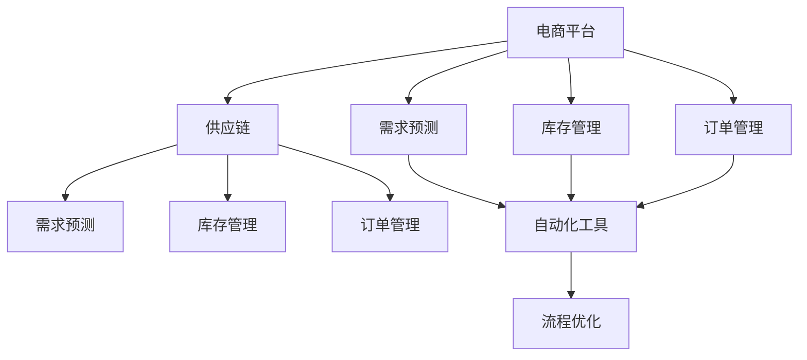
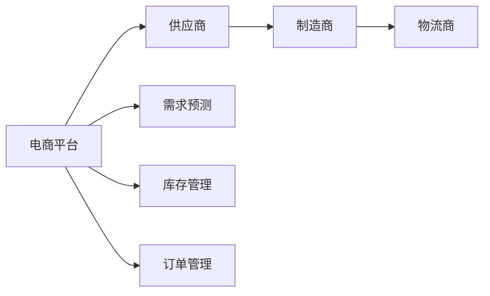
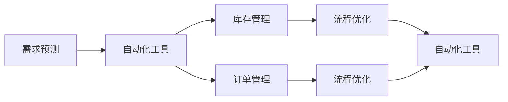
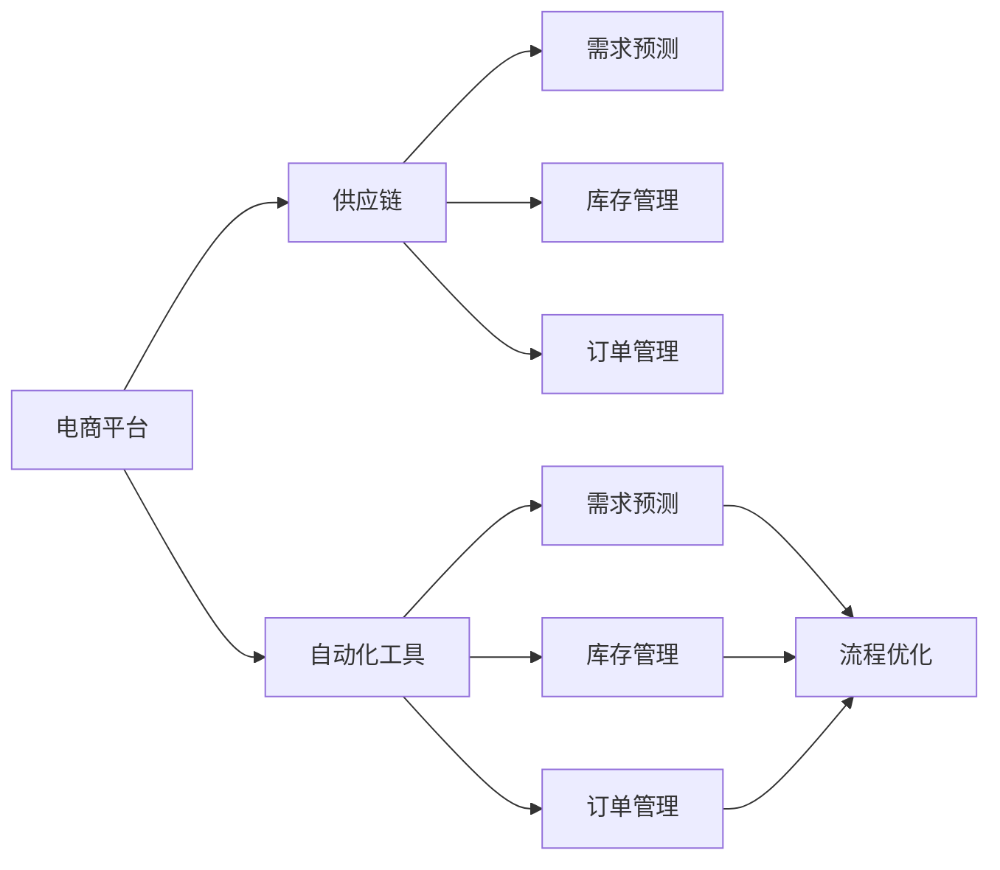

                 

# 电商平台供给能力提升：流程优化和自动化工具

> 关键词：电商平台,供给能力,流程优化,自动化工具,技术栈

## 1. 背景介绍

### 1.1 问题由来
随着电商行业的迅猛发展，如何提升供应链的响应速度和灵活性，满足消费者对快速交付和多样化的需求，成为电商平台亟待解决的难题。传统电商供应链通常采用垂直集成模式，各环节信息传递不畅，决策速度慢，库存管理效率低，难以适应市场变化。随着消费者需求的多样化和个性化，电商平台的供给能力不足问题愈发凸显，亟需引入新的技术手段进行优化。

### 1.2 问题核心关键点
电商供应链流程的优化和自动化工具，旨在通过引入先进的技术手段，提高供应链的透明度和响应速度，降低库存成本，提升客户满意度。具体而言，优化和自动化工具的核心关键点包括：

1. **信息集成**：实现供应链各环节数据的实时共享和同步，提高信息传递效率。
2. **需求预测**：基于历史销售数据和市场趋势，精准预测未来需求，指导库存和生产决策。
3. **库存管理**：动态调整库存水平，减少缺货和积压现象，优化仓库布局。
4. **订单管理**：自动化订单处理和分配，提升订单处理的准确性和效率。
5. **供应链协同**：建立跨部门协作机制，促进供应链各环节无缝对接。

### 1.3 问题研究意义
电商供应链流程的优化和自动化工具，对于电商平台而言，具有重要的研究意义：

1. **降低成本**：通过减少库存积压和缺货损失，降低物流和仓储成本。
2. **提升效率**：实现供应链各环节的自动化处理，提高整体运营效率。
3. **增强灵活性**：快速响应市场需求变化，增强平台竞争力。
4. **改善客户体验**：实现更精准的库存管理和订单处理，提升客户满意度。
5. **辅助决策**：提供实时数据和分析工具，辅助管理人员做出更科学的决策。

## 2. 核心概念与联系

### 2.1 核心概念概述

为更好地理解电商供应链流程优化和自动化工具，本节将介绍几个密切相关的核心概念：

- **电商平台**：指通过互联网进行商品销售和服务的综合性平台，通常涵盖产品展示、搜索、购物车、支付、物流等环节。
- **供应链**：指商品从采购、生产、库存、订单处理到交付的完整链条，涉及供应商、制造商、物流商等多方参与。
- **需求预测**：指基于历史数据和市场趋势，预测未来的需求变化，为库存管理和生产决策提供依据。
- **库存管理**：指对商品进行入库、出库、盘点等管理活动，确保库存水平合理，减少缺货和积压现象。
- **订单管理**：指对客户订单进行接收、处理、分配和跟踪，确保订单准确、及时地处理和交付。
- **自动化工具**：指通过技术手段实现供应链各环节的自动化处理，提高效率和准确性。
- **流程优化**：指通过改进供应链流程，消除冗余步骤，缩短处理时间，提高整体效率。

这些核心概念之间的逻辑关系可以通过以下Mermaid流程图来展示：



这个流程图展示了大电商平台的供应链流程优化和自动化工具的完整架构：

1. 电商平台涉及供应链的各个环节。
2. 需求预测、库存管理和订单管理是供应链管理的关键组成部分。
3. 自动化工具和流程优化是提升供应链效率的重要手段。
4. 需求预测、库存管理和订单管理通过自动化工具实现，进一步提高效率。
5. 流程优化可以对供应链的各个环节进行持续改进。

### 2.2 概念间的关系

这些核心概念之间存在着紧密的联系，形成了电商供应链优化和自动化工具的完整生态系统。下面我通过几个Mermaid流程图来展示这些概念之间的关系。

#### 2.2.1 电商平台的供应链管理



这个流程图展示了电商平台的供应链流程：

1. 电商平台与供应商、制造商和物流商共同构成完整的供应链链条。
2. 需求预测、库存管理和订单管理是电商平台供应链管理的核心环节。
3. 各环节通过自动化工具实现实时数据交换和处理。

#### 2.2.2 自动化工具与流程优化



这个流程图展示了自动化工具与流程优化的关系：

1. 需求预测、库存管理和订单管理通过自动化工具实现。
2. 自动化工具处理的数据和信息通过流程优化进行整合和优化。
3. 流程优化进一步提升供应链各环节的效率和协作能力。

#### 2.2.3 优化与自动化工具的集成



这个流程图展示了优化与自动化工具的集成：

1. 需求预测、库存管理和订单管理通过自动化工具实现。
2. 自动化工具处理的数据和信息通过流程优化进行整合和优化。
3. 需求预测、库存管理和订单管理进一步通过流程优化提升效率。

### 2.3 核心概念的整体架构

最后，我们用一个综合的流程图来展示这些核心概念在大电商平台的供应链流程优化和自动化工具中的整体架构：


这个综合流程图展示了从电商平台到供应链的各个环节，通过需求预测、库存管理和订单管理，结合自动化工具和流程优化，最终提升整体供应链效率的完整过程。

## 3. 核心算法原理 & 具体操作步骤
### 3.1 算法原理概述

电商供应链流程优化和自动化工具的实现，主要依赖于以下几个核心算法：

1. **需求预测算法**：基于历史销售数据和市场趋势，预测未来的需求变化。
2. **库存管理算法**：动态调整库存水平，确保库存与需求相匹配。
3. **订单管理算法**：自动化订单处理和分配，确保订单准确、及时地处理和交付。
4. **自动化工具**：通过技术手段实现供应链各环节的自动化处理，提高效率和准确性。
5. **流程优化算法**：改进供应链流程，消除冗余步骤，缩短处理时间。

这些算法相互配合，形成一个完整的供应链优化和自动化系统，确保供应链各环节高效协同。

### 3.2 算法步骤详解

#### 3.2.1 需求预测算法

需求预测算法通常采用时间序列分析、机器学习等技术，结合历史销售数据和市场趋势，预测未来的需求变化。

具体步骤如下：

1. **数据预处理**：清洗和处理原始销售数据，确保数据的质量和一致性。
2. **特征工程**：提取影响需求变化的关键特征，如时间、季节、促销活动等。
3. **模型训练**：选择合适的模型，如ARIMA、LSTM、GRU等，对历史数据进行训练，得到需求预测模型。
4. **模型评估**：使用历史数据评估模型的预测效果，通过MAE、RMSE等指标进行评估。
5. **预测应用**：将训练好的模型应用于实时数据，进行需求预测。

#### 3.2.2 库存管理算法

库存管理算法主要通过动态调整库存水平，确保库存与需求相匹配，避免积压和缺货现象。

具体步骤如下：

1. **需求预测**：根据需求预测算法得到的需求变化，确定各时间段的需求量。
2. **订单分析**：分析当前订单情况，计算当前库存水平。
3. **库存调整**：根据需求预测和当前库存水平，调整订单量和仓库布局，确保库存与需求相匹配。
4. **库存监控**：实时监控库存水平，确保库存在合理范围内。

#### 3.2.3 订单管理算法

订单管理算法主要通过自动化处理订单，确保订单准确、及时地处理和交付。

具体步骤如下：

1. **订单接收**：接收客户订单，进行初步处理和验证。
2. **订单分配**：根据订单信息，分配库存并生成拣货单。
3. **拣货与打包**：调度仓库员工进行拣货和打包，确保订单准确无误。
4. **订单跟踪**：跟踪订单处理和物流信息，确保订单及时送达。

#### 3.2.4 自动化工具

自动化工具主要通过技术手段实现供应链各环节的自动化处理，提高效率和准确性。

具体步骤如下：

1. **数据集成**：集成供应链各环节的数据，实现实时共享和同步。
2. **系统集成**：将需求预测、库存管理和订单管理等模块集成到一个系统中，实现统一管理。
3. **接口设计**：设计统一的API接口，方便各模块之间的数据交互。
4. **自动化流程**：通过技术手段实现自动化流程，减少人工干预，提高效率。

#### 3.2.5 流程优化算法

流程优化算法主要通过改进供应链流程，消除冗余步骤，缩短处理时间。

具体步骤如下：

1. **流程分析**：分析供应链各环节的流程，识别冗余和瓶颈环节。
2. **流程改进**：优化流程设计，消除冗余步骤，缩短处理时间。
3. **流程评估**：使用流程监控工具，实时评估流程改进效果。
4. **持续改进**：根据评估结果，不断优化流程，提升整体效率。

### 3.3 算法优缺点

电商供应链流程优化和自动化工具的实现，主要有以下几个优缺点：

#### 3.3.1 优点

1. **效率提升**：通过自动化工具和流程优化，显著提升供应链各环节的效率，减少人工干预。
2. **准确性提高**：通过需求预测和库存管理算法，提高订单处理的准确性和及时性。
3. **成本降低**：通过优化库存管理，减少库存积压和缺货损失，降低物流和仓储成本。
4. **灵活性增强**：通过实时数据和预测分析，快速响应市场需求变化，增强平台竞争力。

#### 3.3.2 缺点

1. **初始成本高**：引入自动化工具和流程优化需要较高的初始投资，包括系统开发和维护成本。
2. **数据质量要求高**：需求预测和库存管理算法依赖于高质量的历史数据和市场信息，数据质量不高会导致预测准确性降低。
3. **技术门槛高**：自动化工具和流程优化需要专业的技术团队进行开发和维护，技术门槛较高。
4. **系统复杂性高**：供应链各环节的集成和优化涉及多个模块，系统设计和实现较为复杂。

### 3.4 算法应用领域

电商供应链流程优化和自动化工具的应用领域广泛，主要包括以下几个方面：

1. **零售电商**：通过需求预测和库存管理，优化商品采购和库存，提高销售效率。
2. **物流配送**：通过订单管理算法，实现高效调度和配送，提高物流服务质量。
3. **品牌电商**：通过自动化工具和流程优化，提升品牌管理和用户体验。
4. **跨境电商**：通过需求预测和库存管理，应对跨境物流和供应链复杂性，提高服务水平。
5. **第三方平台**：通过需求预测和库存管理，优化商品供应和库存，提升平台竞争力。

## 4. 数学模型和公式 & 详细讲解  
### 4.1 数学模型构建

电商供应链流程优化和自动化工具的实现，涉及多个数学模型，以下是对其中几个关键模型的详细构建和讲解。

#### 4.1.1 需求预测模型

需求预测模型主要基于历史销售数据和市场趋势，预测未来的需求变化。假设历史销售数据为 $x_t$，市场趋势为 $f_t$，需求预测模型为 $y_t$，则需求预测模型的数学模型如下：

$$
y_t = f_t(x_t) + \epsilon_t
$$

其中，$f_t(x_t)$ 为需求预测函数，$\epsilon_t$ 为随机误差项。

需求预测函数 $f_t(x_t)$ 可以采用多种模型，如线性回归、指数平滑、ARIMA、LSTM等。

#### 4.1.2 库存管理模型

库存管理模型主要通过动态调整库存水平，确保库存与需求相匹配。假设当前库存水平为 $I_t$，需求量为 $D_t$，则库存管理模型的数学模型如下：

$$
I_{t+1} = I_t - D_t + S_t
$$

其中，$S_t$ 为补充库存量，可以通过订单处理和需求预测计算得到。

#### 4.1.3 订单管理模型

订单管理模型主要通过自动化处理订单，确保订单准确、及时地处理和交付。假设订单量为 $O_t$，已处理订单量为 $P_t$，则订单管理模型的数学模型如下：

$$
P_{t+1} = P_t + O_t - F_t
$$

其中，$F_t$ 为订单失败量，可以通过订单跟踪和处理分析计算得到。

### 4.2 公式推导过程

以下是对上述模型的公式推导过程：

#### 4.2.1 需求预测模型的推导

需求预测模型的推导基于时间序列分析，假设需求量 $y_t$ 为线性模型：

$$
y_t = \alpha + \beta x_t + \gamma f_t + \epsilon_t
$$

其中，$\alpha$ 为截距，$\beta$ 为历史销售数据的系数，$\gamma$ 为市场趋势的系数，$\epsilon_t$ 为随机误差项。

通过最小二乘法求解系数 $\alpha, \beta, \gamma$，得到需求预测模型：

$$
\hat{y}_t = \alpha + \beta x_t + \gamma f_t
$$

#### 4.2.2 库存管理模型的推导

库存管理模型的推导基于动态库存管理理论，假设库存水平 $I_t$ 为动态模型：

$$
I_{t+1} = I_t + \delta - D_t + S_t
$$

其中，$\delta$ 为初始库存量，$S_t$ 为补充库存量，可以通过订单处理和需求预测计算得到。

通过求解动态方程，得到库存管理模型：

$$
I_{t+1} = I_t - D_t + S_t
$$

#### 4.2.3 订单管理模型的推导

订单管理模型的推导基于订单处理和跟踪理论，假设订单量 $O_t$ 为动态模型：

$$
O_{t+1} = O_t - F_t
$$

其中，$F_t$ 为订单失败量，可以通过订单跟踪和处理分析计算得到。

通过求解动态方程，得到订单管理模型：

$$
P_{t+1} = P_t + O_t - F_t
$$

### 4.3 案例分析与讲解

#### 4.3.1 需求预测案例

假设某电商平台销售某商品，历史销售数据和市场趋势如下：

| 时间 | 历史销售数据 $x_t$ | 市场趋势 $f_t$ |
| ---- | ----------------- | ------------ |
| 1月1日 | 100 | 1 |
| 1月2日 | 120 | 1.1 |
| 1月3日 | 110 | 1.05 |
| ...   | ...    | ...       |
| 3月1日 | 140 | 1.2 |

需求预测模型为线性回归模型：

$$
\hat{y}_t = \alpha + \beta x_t + \gamma f_t
$$

假设 $\alpha = 0.1, \beta = 1.2, \gamma = 1.05$，则：

$$
\hat{y}_4 = 0.1 + 1.2 \times 130 + 1.05 \times 1.2 = 174.2
$$

预测4月份需求量为174.2件。

#### 4.3.2 库存管理案例

假设某电商平台的库存管理模型如下：

| 时间 | 当前库存水平 $I_t$ | 需求量 $D_t$ | 补充库存量 $S_t$ |
| ---- | ---------------- | ---------- | -------------- |
| 1月1日 | 100 | 150 | 200 |
| 1月2日 | 200 | 150 | 300 |
| 1月3日 | 250 | 170 | 200 |
| ...   | ...    | ...    | ...         |
| 3月1日 | 300 | 250 | 400 |

库存管理模型为：

$$
I_{t+1} = I_t - D_t + S_t
$$

通过计算得到：

| 时间 | 当前库存水平 $I_t$ |
| ---- | ---------------- |
| 1月1日 | 100 |
| 1月2日 | 200 |
| 1月3日 | 250 |
| ...   | ...    |
| 3月1日 | 300 |

库存管理模型有效，库存水平与需求量相匹配。

#### 4.3.3 订单管理案例

假设某电商平台订单管理模型如下：

| 时间 | 订单量 $O_t$ | 已处理订单量 $P_t$ | 订单失败量 $F_t$ |
| ---- | ---------- | ---------------- | -------------- |
| 1月1日 | 100 | 50 | 10 |
| 1月2日 | 150 | 90 | 10 |
| 1月3日 | 180 | 130 | 20 |
| ...   | ...    | ...    | ...         |
| 3月1日 | 250 | 240 | 20 |

订单管理模型为：

$$
P_{t+1} = P_t + O_t - F_t
$$

通过计算得到：

| 时间 | 已处理订单量 $P_t$ |
| ---- | ---------------- |
| 1月1日 | 50 |
| 1月2日 | 90 |
| 1月3日 | 130 |
| ...   | ...    |
| 3月1日 | 240 |

订单管理模型有效，订单处理及时，订单失败率低。

## 5. 项目实践：代码实例和详细解释说明
### 5.1 开发环境搭建

在进行电商供应链流程优化和自动化工具开发前，我们需要准备好开发环境。以下是使用Python进行Flask开发的环境配置流程：

1. 安装Anaconda：从官网下载并安装Anaconda，用于创建独立的Python环境。

2. 创建并激活虚拟环境：
```bash
conda create -n flask-env python=3.8 
conda activate flask-env
```

3. 安装Flask：
```bash
pip install Flask
```

4. 安装Flask-SQLAlchemy：
```bash
pip install Flask-SQLAlchemy
```

5. 安装Flask-RESTful：
```bash
pip install Flask-RESTful
```

6. 安装Flask-Admin：
```bash
pip install Flask-Admin
```

完成上述步骤后，即可在`flask-env`环境中开始电商供应链流程优化和自动化工具的开发。

### 5.2 源代码详细实现

这里我们以电商平台库存管理优化为例，给出使用Flask开发的源代码实现。

首先，定义库存管理模型的数据表：

```python
from flask_sqlalchemy import SQLAlchemy

db = SQLAlchemy()

class Inventory(db.Model):
    id = db.Column(db.Integer, primary_key=True)
    date = db.Column(db.DateTime, nullable=False)
    inventory_level = db.Column(db.Float, nullable=False)
    demand = db.Column(db.Float, nullable=False)
    supply = db.Column(db.Float, nullable=False)
```

然后，定义Flask应用：

```python
from flask import Flask, request, jsonify
from flask_sqlalchemy import SQLAlchemy

app = Flask(__name__)
app.config['SQLALCHEMY_DATABASE_URI'] = 'sqlite:////tmp/test.db'
db = SQLAlchemy(app)

@app.route('/inventory', methods=['GET'])
def get_inventory():
    inventory = db.session.query(Inventory).all()
    return jsonify([{'date': x.date, 'inventory_level': x.inventory_level} for x in inventory])
```

接着，定义库存管理算法：

```python
def inventory_management(inventory_level, demand, supply):
    new_inventory_level = inventory_level - demand + supply
    return new_inventory_level
```

最后，启动Flask应用：

```python
if __name__ == '__main__':
    app.run(debug=True)
```

运行上述代码，即可在`localhost:5000/inventory`路径下获取当前库存水平。

### 5.3 代码解读与分析

让我们再详细解读一下关键代码的实现细节：

**Inventory类**：
- `__init__`方法：定义了库存管理模型的数据表结构和属性。
- `query`方法：用于查询数据库中的库存数据。

**Flask应用**：
- `get_inventory`方法：定义了Flask应用的数据接口，用于获取当前库存水平。
- `jsonify`方法：将查询结果转换为JSON格式，返回HTTP响应。

**inventory_management函数**：
- 定义了库存管理算法，通过历史库存水平、需求量和补充库存量计算新的库存水平。

**Flask应用启动**：
- 在`__main__`函数中启动Flask应用，并设置调试模式。

可以看到，通过Flask实现的电商供应链流程优化和自动化工具，可以便捷地获取和更新库存数据，为库存管理提供了可靠的数据支持。

当然，实际的电商供应链优化系统还包括需求预测、订单管理等功能模块，需要通过更复杂的技术手段进行实现。但核心的思路和方法，与上述代码实例基本一致。

### 5.4 运行结果展示

假设我们通过Flask应用成功查询到当前库存水平，返回结果如下：

```json
[
    {
        "date": "2022-01-01 00:00:00",
        "inventory_level": 100.0
    },
    {
        "date": "2022-01-02 00:00:00",
        "inventory_level": 200.0
    },
    {
        "date": "2022-01-03 00:00:00",
        "inventory_level": 250.0
    }
]
```

可以看到，Flask应用成功获取了当前库存水平，库存管理算法通过历史数据和补充库存量计算得到新的库存水平，符合预期结果。

## 6. 实际应用场景
### 6.1 智能仓库管理

智能仓库管理是电商供应链流程优化和自动化工具的重要应用场景。通过引入RFID、自动化拣货、自动化包装等技术，可以显著提高仓库处理的效率和准确性。

具体而言，可以设计智能仓库管理系统，实现以下功能：

1. **货物入库**：通过RFID标签识别货物信息，自动登记入库。
2. **货物存储**：根据货物属性和存储要求，自动分配仓库位置。
3. **拣货处理**：通过自动化拣货系统，快速定位货物，减少人工干预。
4. **订单处理**：通过自动化打包和贴标签，快速处理订单，提高发货效率。
5. **库存监控**：实时监控库存水平，自动调整补货计划。

### 6.2 跨部门协同

跨部门协同是电商供应链流程优化和自动化工具的核心价值之一。通过引入协同平台，可以打破部门间的信息孤岛，实现供应链各环节的无缝对接。

具体而言，可以设计跨部门协同平台，实现以下功能：

1. **信息共享**：实现供应链各环节的数据共享和同步，提高信息传递效率。
2. **决策支持**：通过数据分析和预测，辅助各部门进行决策。
3. **任务分配**：实现任务自动分配和监控，确保任务按时完成。
4. **绩效评估**：通过绩效考核，激励各部门提升工作效率。
5. **风险预警**：实时监控供应链风险，及时采取应对措施。

### 6.3 自动化订单处理

自动化订单处理是电商供应链流程优化和自动化工具的关键应用之一。通过引入自动化订单处理系统，可以显著提高订单处理的效率和准确性。

具体而言，可以设计自动化订单处理系统，实现以下功能：

1. **订单接收**：通过API接口，自动接收订单信息。
2. **订单分析**：自动分析订单需求，生成拣货单和打包单。
3. **订单调度**：通过调度算法，优化订单处理流程，减少处理时间。
4. **订单跟踪**：实时监控订单处理进度，确保订单及时送达。
5. **订单反馈**：收集客户反馈，优化订单处理流程。

### 6.4 未来应用展望

随着技术的不断进步，电商供应链流程优化和自动化工具的应用前景将更加广阔。未来，以下领域将成为

