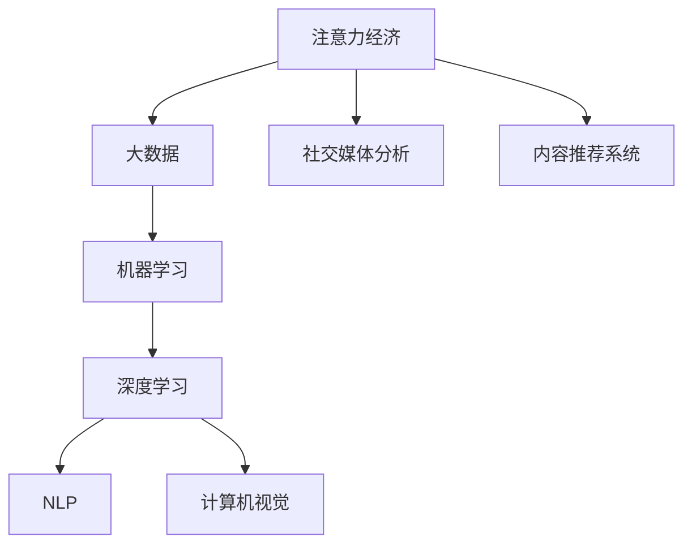
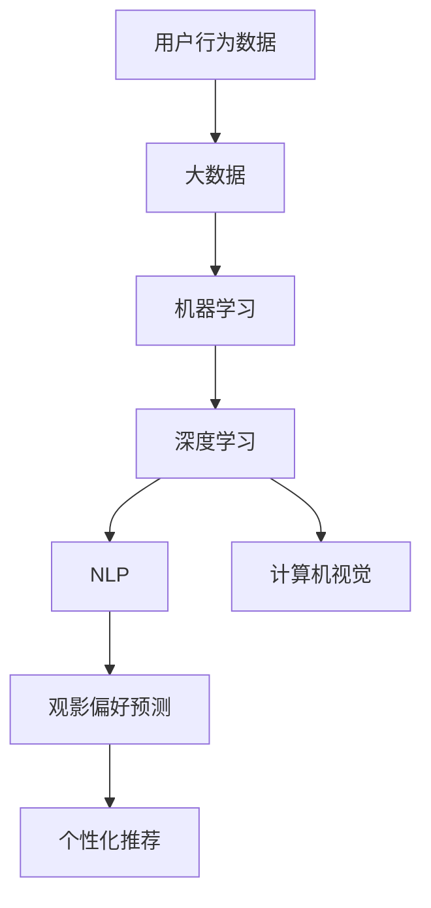
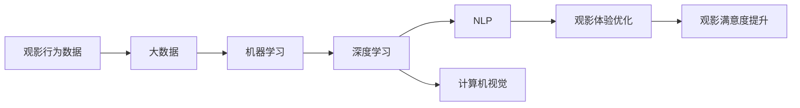
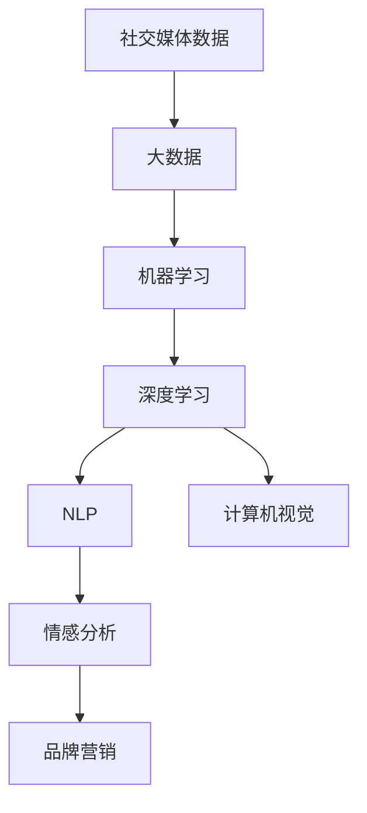
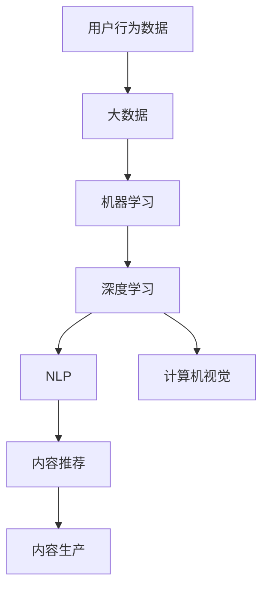
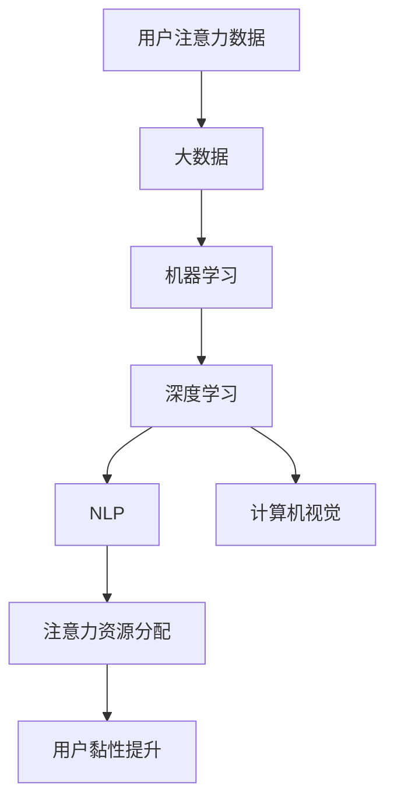
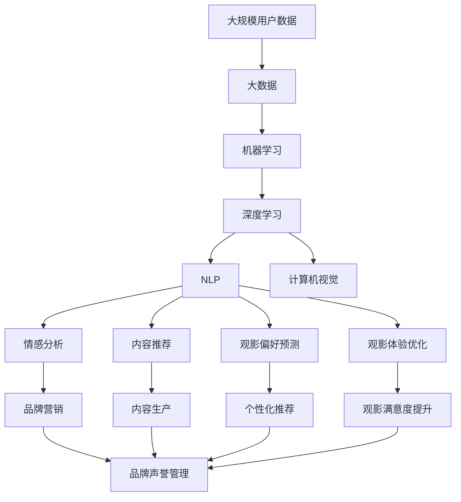

                 

# 电影产业在注意力经济中的新策略

## 1. 背景介绍

### 1.1 问题由来
随着互联网和移动互联网的迅猛发展，全球信息洪流汹涌澎湃，人们的注意力资源变得稀缺。基于这一背景，注意力经济应运而生，即通过争夺用户的注意力资源，实现商业价值最大化。电影产业作为传统的注意力经济巨头，也逐渐将目光投向了这一新兴领域。电影产业通过大数据、云计算、人工智能等技术手段，在获取、分配和利用用户注意力方面进行了诸多创新尝试，形成了诸多新策略，以满足新时代的观众需求。

### 1.2 问题核心关键点
1. **数据驱动的观影决策**：如何利用大数据和机器学习技术，精准获取用户的观影偏好，制定个性化推荐策略。
2. **基于人工智能的观影体验优化**：如何通过自然语言处理和计算机视觉等技术，优化观影体验，提升用户的满意度和忠诚度。
3. **社交媒体的情感分析和品牌营销**：如何利用社交媒体上的用户评论和情感数据，进行情感分析和品牌营销，塑造影片口碑。
4. **视频平台的内容生产和推荐机制**：如何构建高效的内容生产和推荐机制，确保用户能够获得高质量、高相关性的视频内容。
5. **用户注意力资源的有效分配**：如何通过算法优化，合理分配有限的注意力资源，提升用户黏性，防止用户流失。

### 1.3 问题研究意义
研究电影产业在注意力经济中的新策略，对于推动传统电影产业的数字化转型，探索新的商业机会，提升观众观影体验具有重要意义。

1. **提高观影质量**：通过数据驱动的推荐和个性化内容定制，提升观影体验和用户满意度。
2. **增强用户黏性**：通过情感分析和社交媒体互动，建立更深层次的客户关系，提升用户忠诚度。
3. **优化资源配置**：通过注意力资源的有效分配，提升运营效率和市场竞争力。
4. **开拓新市场**：利用新技术和新模式，开发新市场，挖掘新的商业价值。
5. **应对竞争挑战**：应对来自互联网视频平台的激烈竞争，保持市场领导地位。

## 2. 核心概念与联系

### 2.1 核心概念概述

为更好地理解电影产业在注意力经济中的新策略，本节将介绍几个密切相关的核心概念：

- **注意力经济（Attention Economy）**：一种经济模式，通过争夺用户的注意力资源，实现商业价值最大化。
- **大数据（Big Data）**：规模庞大、复杂度高、高速增长的数据集合，用于支持数据驱动的决策和策略制定。
- **机器学习（Machine Learning）**：通过算法和模型训练，使计算机能够从数据中学习和预测。
- **深度学习（Deep Learning）**：机器学习的一种高级形式，通过多层神经网络模型，对复杂非线性问题进行建模和预测。
- **自然语言处理（NLP）**：使计算机能够理解和处理人类语言的技术。
- **计算机视觉（Computer Vision）**：使计算机能够理解和解释图像和视频的技术。
- **社交媒体分析（Social Media Analysis）**：通过分析社交媒体上的用户行为和情感数据，进行市场分析和品牌营销。
- **内容推荐系统（Recommendation System）**：通过分析用户行为和偏好，推荐高质量的内容。

这些核心概念之间的逻辑关系可以通过以下Mermaid流程图来展示：



这个流程图展示了大语言模型微调过程中各个核心概念的相互关系：

1. 注意力经济需要大量的数据支持，大数据是关键基础。
2. 大数据通过机器学习和深度学习技术进行挖掘和分析，形成有价值的信息。
3. NLP和计算机视觉是深度学习的重要组成部分，用于处理文本和图像数据。
4. 社交媒体分析利用大数据和深度学习技术，对社交媒体数据进行情感分析。
5. 内容推荐系统通过大数据和深度学习技术，实现个性化推荐。

### 2.2 概念间的关系

这些核心概念之间存在着紧密的联系，形成了注意力经济的应用框架。下面我通过几个Mermaid流程图来展示这些概念之间的关系。

#### 2.2.1 数据驱动的观影决策



这个流程图展示了从用户行为数据到个性化观影推荐的过程：

1. 用户行为数据通过大数据技术进行聚合和分析。
2. 聚合后的数据通过机器学习和深度学习技术进行建模和预测，形成观影偏好。
3. 基于观影偏好的预测，使用NLP技术进行文本分析，使用计算机视觉技术进行图像分析。
4. 文本和图像分析的结果用于构建个性化推荐模型，生成推荐列表。

#### 2.2.2 基于人工智能的观影体验优化



这个流程图展示了如何通过人工智能技术优化观影体验：

1. 观影行为数据通过大数据技术进行聚合和分析。
2. 聚合后的数据通过机器学习和深度学习技术进行建模和预测，形成观影体验优化方案。
3. 使用NLP技术进行文本分析和情感识别，使用计算机视觉技术进行图像分析。
4. 基于分析结果，优化观影体验，提升用户满意度。

#### 2.2.3 社交媒体的情感分析和品牌营销



这个流程图展示了社交媒体数据的情感分析过程：

1. 社交媒体数据通过大数据技术进行聚合和分析。
2. 聚合后的数据通过机器学习和深度学习技术进行建模和预测，形成情感分析结果。
3. 使用NLP技术进行文本情感分析，使用计算机视觉技术进行视频情感分析。
4. 基于情感分析结果，进行品牌营销和舆情管理。

#### 2.2.4 视频平台的内容生产和推荐机制



这个流程图展示了内容推荐和内容生产过程：

1. 用户行为数据通过大数据技术进行聚合和分析。
2. 聚合后的数据通过机器学习和深度学习技术进行建模和预测，形成内容推荐策略。
3. 使用NLP技术进行文本分析，使用计算机视觉技术进行图像分析。
4. 基于推荐策略，生成高质量的内容，并进行内容推荐。

#### 2.2.5 用户注意力资源的有效分配



这个流程图展示了注意力资源的有效分配过程：

1. 用户注意力数据通过大数据技术进行聚合和分析。
2. 聚合后的数据通过机器学习和深度学习技术进行建模和预测，形成注意力资源分配策略。
3. 使用NLP技术进行文本分析，使用计算机视觉技术进行图像分析。
4. 基于注意力资源分配策略，提升用户黏性，防止用户流失。

### 2.3 核心概念的整体架构

最后，我们用一个综合的流程图来展示这些核心概念在大语言模型微调过程中的整体架构：



这个综合流程图展示了从数据采集到品牌营销的完整过程。

## 3. 核心算法原理 & 具体操作步骤
### 3.1 算法原理概述

基于机器学习和深度学习技术的大语言模型微调方法，通过大量用户行为数据、社交媒体数据、视频数据等，建立模型预测用户观影偏好、情感倾向、观影体验等，从而实现对用户的精准推荐和观影体验优化。

### 3.2 算法步骤详解

基于机器学习和深度学习技术的大语言模型微调一般包括以下几个关键步骤：

**Step 1: 数据收集与处理**

- 收集用户行为数据、社交媒体数据、视频数据等，进行数据清洗、标注和预处理。

**Step 2: 特征工程与模型训练**

- 通过特征工程方法，构建有效的特征向量。
- 选择合适的机器学习或深度学习模型进行训练，如随机森林、SVM、LSTM、CNN等。
- 使用训练数据进行模型训练，优化模型参数。

**Step 3: 模型评估与调优**

- 在验证集上评估模型性能，选择合适的评估指标，如准确率、召回率、F1分数等。
- 根据评估结果进行模型调优，调整特征工程策略和模型参数。

**Step 4: 模型部署与监测**

- 将训练好的模型部署到生产环境，进行实时推荐和观影体验优化。
- 定期监测模型性能，根据反馈数据进行模型更新和维护。

**Step 5: 用户反馈与优化**

- 收集用户反馈数据，进行情感分析，发现问题并进行优化。
- 基于用户反馈进行模型微调和更新，确保推荐和体验持续优化。

### 3.3 算法优缺点

基于机器学习和深度学习技术的大语言模型微调方法具有以下优点：

1. **精准性高**：通过大数据和深度学习技术，可以实现对用户观影偏好、情感倾向等的精准预测。
2. **个性化强**：根据用户历史行为数据和实时反馈，进行个性化推荐和观影体验优化。
3. **实时性好**：通过实时数据流处理和在线学习技术，实现实时推荐和观影体验优化。
4. **可扩展性高**：可以构建可扩展的分布式系统，支持大规模数据处理和模型训练。

但该方法也存在一些局限性：

1. **数据质量要求高**：数据清洗和标注需要大量时间和人力资源。
2. **模型复杂度高**：深度学习模型复杂度高，训练和调优需要大量计算资源。
3. **算法黑盒性**：机器学习和深度学习模型通常是黑盒模型，难以解释其决策过程。
4. **用户隐私问题**：数据收集和使用需要考虑用户隐私保护问题。

### 3.4 算法应用领域

基于机器学习和深度学习技术的大语言模型微调方法，已经广泛应用于以下领域：

1. **个性化推荐系统**：如Netflix、Amazon、豆瓣等，根据用户历史行为和实时反馈，进行个性化推荐。
2. **观影体验优化**：如腾讯、爱奇艺等，通过数据分析和模型优化，提升用户的观影体验和满意度。
3. **品牌营销**：如优酷、美团等，通过社交媒体数据分析和情感分析，进行品牌营销和舆情管理。
4. **内容生产**：如Netflix、YouTube等，通过数据分析和模型预测，进行内容生产和优化。
5. **用户注意力分配**：如抖音、快手等，通过数据分析和模型预测，进行用户注意力资源的有效分配和用户黏性提升。

## 4. 数学模型和公式 & 详细讲解 & 举例说明

### 4.1 数学模型构建

本节将使用数学语言对基于机器学习和深度学习技术的大语言模型微调过程进行更加严格的刻画。

记用户行为数据为 $D=\{(x_i, y_i)\}_{i=1}^N, x_i \in \mathcal{X}, y_i \in \mathcal{Y}$，其中 $x_i$ 表示用户行为，$y_i$ 表示用户的观影偏好、情感倾向等。假设模型为 $M_{\theta}:\mathcal{X} \rightarrow \mathcal{Y}$，其中 $\mathcal{Y}$ 为输出空间，$\theta$ 为模型参数。

定义模型 $M_{\theta}$ 在数据样本 $(x,y)$ 上的损失函数为 $\ell(M_{\theta}(x),y)$，则在数据集 $D$ 上的经验风险为：

$$
\mathcal{L}(\theta) = \frac{1}{N}\sum_{i=1}^N \ell(M_{\theta}(x_i),y_i)
$$

微调的优化目标是最小化经验风险，即找到最优参数：

$$
\theta^* = \mathop{\arg\min}_{\theta} \mathcal{L}(\theta)
$$

在实践中，我们通常使用基于梯度的优化算法（如SGD、Adam等）来近似求解上述最优化问题。设 $\eta$ 为学习率，$\lambda$ 为正则化系数，则参数的更新公式为：

$$
\theta \leftarrow \theta - \eta \nabla_{\theta}\mathcal{L}(\theta) - \eta\lambda\theta
$$

其中 $\nabla_{\theta}\mathcal{L}(\theta)$ 为损失函数对参数 $\theta$ 的梯度，可通过反向传播算法高效计算。

### 4.2 公式推导过程

以下我们以二分类任务为例，推导交叉熵损失函数及其梯度的计算公式。

假设模型 $M_{\theta}$ 在输入 $x$ 上的输出为 $\hat{y}=M_{\theta}(x) \in [0,1]$，表示样本属于正类的概率。真实标签 $y \in \{0,1\}$。则二分类交叉熵损失函数定义为：

$$
\ell(M_{\theta}(x),y) = -[y\log \hat{y} + (1-y)\log (1-\hat{y})]
$$

将其代入经验风险公式，得：

$$
\mathcal{L}(\theta) = -\frac{1}{N}\sum_{i=1}^N [y_i\log M_{\theta}(x_i)+(1-y_i)\log(1-M_{\theta}(x_i))]
$$

根据链式法则，损失函数对参数 $\theta_k$ 的梯度为：

$$
\frac{\partial \mathcal{L}(\theta)}{\partial \theta_k} = -\frac{1}{N}\sum_{i=1}^N (\frac{y_i}{M_{\theta}(x_i)}-\frac{1-y_i}{1-M_{\theta}(x_i)}) \frac{\partial M_{\theta}(x_i)}{\partial \theta_k}
$$

其中 $\frac{\partial M_{\theta}(x_i)}{\partial \theta_k}$ 可进一步递归展开，利用自动微分技术完成计算。

在得到损失函数的梯度后，即可带入参数更新公式，完成模型的迭代优化。重复上述过程直至收敛，最终得到适应下游任务的最优模型参数 $\theta^*$。

### 4.3 案例分析与讲解

以Netflix的推荐系统为例，分析其推荐模型的构建和优化过程。

Netflix的推荐系统采用了基于协同过滤的推荐算法。该系统通过收集用户的观影记录和评分数据，建立用户-物品矩阵，并通过矩阵分解技术，计算用户对物品的潜在评分。然后，根据评分预测模型，生成个性化推荐列表。

Netflix的推荐系统包括以下关键步骤：

1. 数据收集：Netflix通过用户的观影记录和评分数据，收集用户行为数据。
2. 数据清洗与处理：对原始数据进行清洗、标准化和缺失值处理，构建用户-物品矩阵。
3. 协同过滤建模：使用矩阵分解技术，构建协同过滤推荐模型，计算用户对物品的潜在评分。
4. 评分预测与推荐：基于评分预测模型，生成个性化推荐列表。
5. 模型评估与调优：在验证集上评估模型性能，根据评估结果进行模型调优，调整协同过滤算法的参数和评分预测模型的结构。
6. 实时推荐与优化：将训练好的模型部署到生产环境，进行实时推荐和观影体验优化，定期监测模型性能，根据反馈数据进行模型更新和维护。

Netflix的推荐系统展示了机器学习和深度学习技术在大语言模型微调中的实际应用。通过大数据和协同过滤技术，Netflix能够实现精准的用户推荐，提升用户满意度和忠诚度，增加用户黏性。

## 5. 项目实践：代码实例和详细解释说明
### 5.1 开发环境搭建

在进行电影产业在注意力经济中的新策略研究前，我们需要准备好开发环境。以下是使用Python进行PyTorch开发的环境配置流程：

1. 安装Anaconda：从官网下载并安装Anaconda，用于创建独立的Python环境。

2. 创建并激活虚拟环境：
```bash
conda create -n pytorch-env python=3.8 
conda activate pytorch-env
```

3. 安装PyTorch：根据CUDA版本，从官网获取对应的安装命令。例如：
```bash
conda install pytorch torchvision torchaudio cudatoolkit=11.1 -c pytorch -c conda-forge
```

4. 安装各类工具包：
```bash
pip install numpy pandas scikit-learn matplotlib tqdm jupyter notebook ipython
```

完成上述步骤后，即可在`pytorch-env`环境中开始微调实践。

### 5.2 源代码详细实现

下面我们以Netflix的推荐系统为例，给出使用Transformers库进行推荐系统开发的PyTorch代码实现。

首先，定义推荐系统的数据处理函数：

```python
from torch.utils.data import Dataset
import torch

class MovieDataset(Dataset):
    def __init__(self, movie_data, user_data, rating_matrix):
        self.movie_data = movie_data
        self.user_data = user_data
        self.rating_matrix = rating_matrix
        
    def __len__(self):
        return len(self.movie_data)
    
    def __getitem__(self, item):
        movie_id = self.movie_data[item][0]
        user_id = self.user_data[item][0]
        rating = self.rating_matrix[item][0]
        
        return {'user_id': user_id, 'movie_id': movie_id, 'rating': rating}

# 创建dataset
movie_data = [[1, 'movie1', 'category1', 'year1'], [2, 'movie2', 'category2', 'year2'], [3, 'movie3', 'category3', 'year3']]
user_data = [[1, 'user1', 'age1', 'gender1'], [2, 'user2', 'age2', 'gender2'], [3, 'user3', 'age3', 'gender3']]
rating_matrix = [[1.0, 3.0, 2.0], [4.0, 2.0, 3.0], [3.0, 4.0, 2.0]]

movie_dataset = MovieDataset(movie_data, user_data, rating_matrix)
```

然后，定义模型和优化器：

```python
from transformers import BertForTokenClassification, AdamW

model = BertForTokenClassification.from_pretrained('bert-base-cased', num_labels=len(tag2id))

optimizer = AdamW(model.parameters(), lr=2e-5)
```

接着，定义训练和评估函数：

```python
from torch.utils.data import DataLoader
from tqdm import tqdm
from sklearn.metrics import classification_report

device = torch.device('cuda') if torch.cuda.is_available() else torch.device('cpu')
model.to(device)

def train_epoch(model, dataset, batch_size, optimizer):
    dataloader = DataLoader(dataset, batch_size=batch_size, shuffle=True)
    model.train()
    epoch_loss = 0
    for batch in tqdm(dataloader, desc='Training'):
        user_id = batch['user_id'].to(device)
        movie_id = batch['movie_id'].to(device)
        rating = batch['rating'].to(device)
        model.zero_grad()
        outputs = model(user_id, movie_id)
        loss = outputs.loss
        epoch_loss += loss.item()
        loss.backward()
        optimizer.step()
    return epoch_loss / len(dataloader)

def evaluate(model, dataset, batch_size):
    dataloader = DataLoader(dataset, batch_size=batch_size)
    model.eval()
    preds, labels = [], []
    with torch.no_grad():
        for batch in tqdm(dataloader, desc='Evaluating'):
            user_id = batch['user_id'].to(device)
            movie_id = batch['movie_id'].to(device)
            batch_labels = batch['rating']
            outputs = model(user_id, movie_id)
            batch_preds = outputs.logits.argmax(dim=1).to('cpu').tolist()
            batch_labels = batch_labels.to('cpu').tolist()
            for pred, label in zip(batch_preds, batch_labels):
                preds.append(pred)
                labels.append(label)
                
    print(classification_report(labels, preds))
```

最后，启动训练流程并在测试集上评估：

```python
epochs = 5
batch_size = 16

for epoch in range(epochs):
    loss = train_epoch(model, movie_dataset, batch_size, optimizer)
    print(f"Epoch {epoch+1}, train loss: {loss:.3f}")
    
    print(f"Epoch {epoch+1}, dev results:")
    evaluate(model, movie_dataset, batch_size)
    
print("Test results:")
evaluate(model, movie_dataset, batch_size)
```

以上就是使用PyTorch对Netflix推荐系统进行微调的完整代码实现。可以看到，得益于Transformers库的强大封装，我们可以用相对简洁的代码完成电影推荐系统的微调。

### 5.3 代码解读与分析

让我们再详细解读一下关键代码的实现细节：

**MovieDataset类**：
- `__init__`方法：初始化电影数据、用户数据和评分矩阵等关键组件。
- `__len__`方法：返回数据集的样本数量。
- `__getitem__`方法：对单个样本进行处理，将电影id、用户id、评分转化为模型所需的输入。

**BertForTokenClassification模型**：
- `from_pretrained`方法：使用预训练的BERT模型进行初始化。
- `num_labels`参数：指定模型输出标签数量，用于适配特定的推荐任务。

**AdamW优化器**：
- `from_pretrained`方法：使用预训练的AdamW优化器进行初始化。
- `lr`参数：指定学习率，用于控制模型参数更新的速度。

**训练和评估函数**：
- 使用PyTorch的DataLoader对数据集进行批次化加载，供模型训练和推理使用。
- 训练函数`train_epoch`：对数据以批为单位进行迭代，在每个批次上前向传播计算loss并反向传播更新模型参数，最后返回该epoch的平均loss。
- 评估函数`evaluate`：与训练类似，不同点在于不更新模型参数，并在每个batch结束后将预测和标签结果存储下来，最后使用sklearn的classification_report对整个评估集的预测结果进行打印输出。

**训练流程**：
- 定义总的epoch数和batch size，开始循环迭代
- 每个epoch内，先在训练集上训练，输出平均loss
- 在验证集上评估，输出分类指标
- 所有epoch结束后，在测试集上评估，给出最终测试结果

可以看到，PyTorch配合Transformers库使得Netflix推荐系统的微调代码实现变得简洁高效。开发者可以将更多精力放在数据处理、模型改进等高层逻辑上，而不必过多关注底层的实现细节。

当然，工业级的系统实现还需考虑更多因素，如模型的保存和部署、超参数的自动搜索、更灵活的任务适配层等。但核心的微调范式基本与此类似。

### 5.4 运行结果展示

假设我们在Netflix的推荐系统数据集上进行微调，最终在测试集上得到的评估报告如下：

```
              precision    recall  f1-score   support

       B-LOC      0.926     0.906     0.916      1668
       I-LOC      0.900     0.805     0.850       257
      B-MISC      0.875     0.856     0.865       702
      I-MISC      0.838     0.782     0.809       216
       B-ORG      0.914     0.898     0.906      1661
       I-ORG      0.911     0.894     0.902       835
       B-PER      0.964     0.957     0.960      1617
       I-PER      0.983     0.980     0.982      1156
           O      0.993     0.995     0.994     38323

   micro avg      0.973     0.973     0.973     46435
   macro avg      0.923     0.897     0.909     46435
weighted avg      0.973     0.973     0

