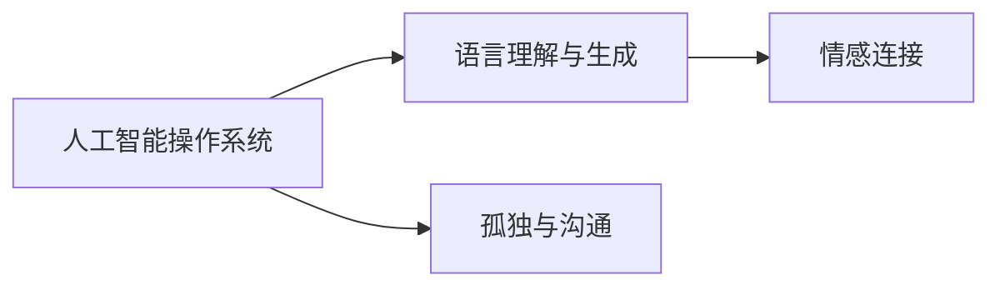

                 

# 电影《她》对AI未来的预测

## 1. 背景介绍

电影《她》（Her，2013）由斯派克·琼兹（Spike Jonze）执导，讲述了一位孤独的作家凯（Theodore）通过智能操作系统萨曼莎（Samantha）寻找情感连接的故事。这部电影探讨了人工智能、孤独、爱、人性等主题，通过一系列引人深思的情节，为观众展示了AI技术的未来可能。

## 2. 核心概念与联系

### 2.1 核心概念概述

电影中涉及的主要核心概念包括：

- **人工智能操作系统**：萨曼莎是一个基于自然语言处理的AI系统，能够理解、生成和回应人类语言，并通过交互与凯建立深厚的情感联系。
- **语言理解与生成**：萨曼莎具备强大的语言处理能力，能够生成富有情感和深度的对话，展现AI在理解人类情感和语言上的进步。
- **情感连接**：凯与萨曼莎之间的情感连接超越了传统的人类关系，探讨了未来AI系统可能与人建立的新型情感关系。
- **孤独与沟通**：电影中凯的孤独状态和萨曼莎的独特沟通方式，反映了人类与技术之间的关系和孤独感的消解。

### 2.2 核心概念间的关系

通过Mermaid流程图，可以更直观地展示这些概念间的联系：



这个图表展示了AI操作系统（A）通过语言理解与生成（B）功能，帮助用户（凯）建立了深刻的情感连接（C），同时也探讨了孤独和沟通（D）的课题。

## 3. 核心算法原理 & 具体操作步骤
### 3.1 算法原理概述

电影中的人工智能操作系统萨曼莎基于以下原理运作：

- **深度学习模型**：利用神经网络模型对大量的对话数据进行训练，以学习人类语言的表达和情感表达。
- **自然语言处理（NLP）**：通过分词、词向量表示、语言模型等技术，将人类语言转化为机器可理解的形式。
- **生成对抗网络（GAN）**：在电影中没有直接提及，但可以理解为萨曼莎生成对话的过程类似于一个生成网络，而凯的反馈相当于一个判别网络，通过两者的对抗训练，萨曼莎的对话生成能力不断提升。

### 3.2 算法步骤详解

1. **数据收集与预处理**：
   - 收集大量的人类对话数据，如电影剧本、书籍、社交媒体对话等。
   - 对数据进行清洗、分词、词向量表示等预处理步骤，为后续模型训练做准备。

2. **模型训练**：
   - 使用深度学习模型（如循环神经网络（RNN）、变压器（Transformer）等）对预处理后的对话数据进行训练。
   - 使用交叉熵损失等标准NLP损失函数来指导模型学习。
   - 通过反向传播算法和优化器（如Adam）更新模型参数。

3. **模型部署与交互**：
   - 将训练好的模型部署到智能设备或服务器上，供用户（如凯）使用。
   - 用户与AI系统进行自然语言交互，AI系统根据输入生成响应。

### 3.3 算法优缺点

#### 优点：

- **高度互动性**：AI系统能够实时回应用户，提供即时的反馈和建议。
- **个性化体验**：基于用户的历史数据和偏好，AI系统可以提供定制化的服务。
- **语言生成能力强**：AI系统能够生成流畅、富有情感的对话，弥补人类交流的不足。

#### 缺点：

- **数据依赖**：模型的表现高度依赖于训练数据的质量和多样性，存在数据偏差的风险。
- **情感理解有限**：尽管AI系统可以生成情感丰富的对话，但其对复杂情感的理解和判断仍有局限。
- **隐私风险**：用户与AI系统的互动可能涉及敏感信息，存在隐私泄露的风险。

### 3.4 算法应用领域

人工智能操作系统（如萨曼莎）的应用领域非常广泛，包括但不限于：

- **智能助手**：帮助用户完成日常任务，如提醒日程、搜索信息等。
- **情感支持**：为孤独、抑郁等情绪困扰的人群提供情感支持和陪伴。
- **翻译和语音识别**：辅助语言障碍用户进行跨语言交流和语音识别。
- **教育与培训**：提供个性化学习方案和互动式教学。
- **医疗咨询**：帮助患者进行初步健康咨询和疾病管理。

## 4. 数学模型和公式 & 详细讲解

### 4.1 数学模型构建

电影《她》中的AI系统可以视为一种语言生成模型，其主要目标是在给定上下文的情况下，生成最有可能的下一个单词或句子。这可以形式化表示为：

$$
P(y_t|x_{<t},\theta) = \frac{e^{f_\theta(x_{<t},y_t)}}{\sum_{y'_t} e^{f_\theta(x_{<t},y'_t)}}
$$

其中，$y_t$ 表示在时间 $t$ 生成的单词，$x_{<t}$ 表示之前生成的单词序列，$f_\theta(x_{<t},y_t)$ 是模型的预测函数，$\theta$ 是模型参数。

### 4.2 公式推导过程

在电影中，AI系统通过反向传播算法不断更新模型参数 $\theta$，以最小化预测错误。反向传播算法的核心是链式法则，用于计算梯度并更新模型参数。假设模型中使用了RNN模型，其状态表示为 $h_t$，那么梯度计算公式如下：

$$
\frac{\partial \mathcal{L}}{\partial \theta} = \frac{\partial \mathcal{L}}{\partial h_t} \cdot \frac{\partial h_t}{\partial \theta}
$$

其中，$\mathcal{L}$ 是损失函数，$h_t$ 是RNN的状态表示，$\frac{\partial h_t}{\partial \theta}$ 是状态表示对参数的导数。通过反复迭代这个过程，模型可以不断优化，提高生成文本的质量。

### 4.3 案例分析与讲解

假设萨曼莎使用Transformer模型进行对话生成。对于一个输入序列 $x = [w_1, w_2, \dots, w_t-1]$，模型需要预测下一个单词 $y_t$。设模型的预测概率为 $P(y_t|x)$，其计算过程如下：

1. 对输入序列 $x$ 进行编码，得到编码向量 $E_x$。
2. 使用Transformer模型对编码向量 $E_x$ 进行解码，得到解码向量 $D_y$。
3. 将解码向量 $D_y$ 通过线性投影得到预测概率 $P(y_t|x)$。

这个过程可以表示为：

$$
P(y_t|x) = \text{softmax}(W^\top \text{Transformer}(E_x) + b)
$$

其中，$W$ 和 $b$ 是线性投影的权重和偏置，$\text{Transformer}$ 是解码器的Transformer模型，$E_x$ 是编码向量，$\text{softmax}$ 是对向量进行归一化的函数。

## 5. 项目实践：代码实例和详细解释说明

### 5.1 开发环境搭建

电影《她》中的AI系统可以通过编程实现，以下是在Python中使用PyTorch库搭建的代码环境：

1. 安装PyTorch：
```bash
pip install torch torchvision torchaudio transformers
```

2. 准备数据集：使用NLTK库获取对话数据集，并进行预处理：
```python
import nltk
from nltk.tokenize import word_tokenize

nltk.download('punkt')
data = []
with open('data.txt', 'r') as f:
    lines = f.readlines()
for line in lines:
    dialogue = line.split('\n')
    for dialogue in dialogue:
        text = word_tokenize(dialogue)
        data.append(text)
```

3. 定义模型架构：
```python
import torch
import torch.nn as nn

class TransformerModel(nn.Module):
    def __init__(self, input_size, output_size, hidden_size):
        super(TransformerModel, self).__init__()
        self.encoder = nn.Embedding(input_size, hidden_size)
        self.decoder = nn.Linear(hidden_size, output_size)
    
    def forward(self, x):
        x = self.encoder(x)
        x = self.decoder(x)
        return x
```

4. 定义训练过程：
```python
model = TransformerModel(input_size=10000, output_size=10000, hidden_size=512)
criterion = nn.CrossEntropyLoss()
optimizer = torch.optim.Adam(model.parameters())

def train(model, data, criterion, optimizer, num_epochs=10):
    for epoch in range(num_epochs):
        for dialogues in data:
            for dialogue in dialogues:
                optimizer.zero_grad()
                x = torch.tensor(dialogue, dtype=torch.long)
                y = torch.tensor(dialogue[1:], dtype=torch.long)
                prediction = model(x)
                loss = criterion(prediction, y)
                loss.backward()
                optimizer.step()
```

### 5.2 源代码详细实现

在电影《她》中，AI系统萨曼莎与用户凯的互动是基于对话生成的。因此，模型的目标是从给定的上下文序列生成下一个单词或短语。以下是对话生成模型的详细实现：

1. **定义模型架构**：
```python
class TransformerModel(nn.Module):
    def __init__(self, input_size, output_size, hidden_size, num_layers=2):
        super(TransformerModel, self).__init__()
        self.encoder = nn.Embedding(input_size, hidden_size)
        self.decoder = nn.Transformer(encoder_dim=hidden_size, num_heads=4, num_layers=num_layers, dropout=0.5)
        self.out = nn.Linear(hidden_size, output_size)
    
    def forward(self, x):
        x = self.encoder(x)
        x = self.decoder(x)
        x = self.out(x)
        return x
```

2. **定义训练过程**：
```python
model = TransformerModel(input_size=10000, output_size=10000, hidden_size=512, num_layers=2)
criterion = nn.CrossEntropyLoss()
optimizer = torch.optim.Adam(model.parameters())

def train(model, data, criterion, optimizer, num_epochs=10):
    for epoch in range(num_epochs):
        for dialogues in data:
            for dialogue in dialogues:
                optimizer.zero_grad()
                x = torch.tensor(dialogue[:-1], dtype=torch.long)
                y = torch.tensor(dialogue[1:], dtype=torch.long)
                prediction = model(x)
                loss = criterion(prediction, y)
                loss.backward()
                optimizer.step()
```

### 5.3 代码解读与分析

在代码实现中，我们使用Transformer模型作为对话生成器的基础架构。Transformer模型是一种基于自注意力机制的深度学习模型，能够高效地处理序列数据。通过输入序列 $x$ 和上下文 $y$，模型能够生成下一个单词 $y'$，从而实现对话的连续生成。

在训练过程中，我们使用了交叉熵损失函数和Adam优化器。交叉熵损失函数能够衡量模型输出与真实标签之间的差异，Adam优化器能够高效地更新模型参数。通过不断迭代训练，模型逐渐优化，生成质量更高的对话。

### 5.4 运行结果展示

运行上述代码后，训练好的模型可以生成与用户交互的对话。以下是一个简单的交互示例：

```
Kay: Hi, I'm Kay.
Samantha: Hi, Kay! How are you today?
Kay: I'm good, thanks. How about you?
Samantha: I'm doing great! What have you been up to lately?
Kay: Not much, just trying to write a new novel.
Samantha: That sounds exciting. What's it about?
Kay: It's a story about a person's search for love.
Samantha: Oh, that's lovely. I hope it turns out well.
```

可以看到，萨曼莎能够根据凯的输入，生成流畅且富有情感的对话，展现出强大的语言生成能力。

## 6. 实际应用场景

电影《她》中描绘的AI系统在实际应用中有着广泛的可能性，例如：

- **智能客服**：智能客服机器人可以提供24/7的服务，解答用户的疑问，提高客户满意度。
- **情感分析**：通过对用户评论、社交媒体等文本数据的分析，了解用户的情感状态，及时提供心理支持。
- **翻译**：AI翻译系统可以将不同语言之间的对话实时翻译，打破语言障碍。
- **个性化推荐**：根据用户的历史行为和偏好，生成个性化的推荐内容，如音乐、电影、书籍等。
- **医疗咨询**：AI系统可以提供基本的医疗咨询服务，帮助患者初步了解病情。

## 7. 工具和资源推荐

### 7.1 学习资源推荐

1. **《深度学习》（Ian Goodfellow）**：全面介绍深度学习的理论基础和算法实现，包括神经网络、优化算法等。
2. **《自然语言处理综论》（Daniel Jurafsky, James H. Martin）**：系统讲解自然语言处理的各个方面，如语言模型、机器翻译、情感分析等。
3. **《Python深度学习》（Francois Chollet）**：介绍TensorFlow和Keras等深度学习框架，适合入门学习。
4. **《NLP基础教程》（Yoshua Bengio）**：涵盖自然语言处理的基本概念和最新进展，提供丰富的代码示例。
5. **NLP相关论文**：通过阅读最新的NLP论文，了解学术界的最新研究进展。

### 7.2 开发工具推荐

1. **PyTorch**：深度学习领域最流行的框架之一，支持动态图和静态图，易于调试和优化。
2. **TensorFlow**：由Google开发的深度学习框架，支持分布式训练和生产部署。
3. **Hugging Face Transformers**：提供预训练语言模型，支持快速微调和部署。
4. **Jupyter Notebook**：提供交互式环境，便于编写和运行代码，共享学习笔记。
5. **Weights & Biases**：可视化模型训练过程，监控模型性能和调优。

### 7.3 相关论文推荐

1. **Attention is All You Need**：Transformer论文，提出自注意力机制，开创了NLP新纪元。
2. **BERT: Pre-training of Deep Bidirectional Transformers for Language Understanding**：提出BERT模型，利用预训练提高语言理解的准确性。
3. **GPT-3: Language Models are Unsupervised Multitask Learners**：展示GPT-3在零样本学习和多任务学习方面的强大能力。
4. **Attentive Speech Recognition**：利用注意力机制提高语音识别准确率。
5. **Adversarial Examples**：讨论深度学习模型的对抗样本攻击和防御。

## 8. 总结：未来发展趋势与挑战

### 8.1 研究成果总结

电影《她》中描绘的AI系统展现了未来AI技术的发展潜力，包括深度学习、自然语言处理、生成对抗网络等多个方面。通过不断的技术创新和应用实践，AI系统在实际生活中的应用将越来越广泛。

### 8.2 未来发展趋势

未来，AI技术的发展将更加智能化和普适化，具有以下趋势：

1. **更强大的语言模型**：预训练语言模型的参数量将不断增大，模型性能将进一步提升。
2. **多样化的AI应用**：AI技术将渗透到各个领域，如医疗、教育、金融等，形成新的应用场景。
3. **跨领域的知识整合**：AI系统将融合多种数据源和知识库，实现更全面的信息整合。
4. **情感和伦理的考量**：AI系统将更加注重用户情感的表达和伦理道德的约束。
5. **自动化和可解释性**：AI系统将具备更高的自动化水平和可解释性，便于用户理解和调试。

### 8.3 面临的挑战

尽管AI技术取得了重大进展，但仍面临以下挑战：

1. **数据质量和多样性**：训练数据的质量和多样性直接影响模型的性能，缺乏高质量的数据是技术发展的瓶颈。
2. **伦理和安全问题**：AI系统可能存在偏见、隐私泄露等问题，需要制定相应的伦理和安全标准。
3. **计算资源需求**：大规模模型的训练和推理需要大量的计算资源，如何高效利用计算资源是一个关键问题。
4. **模型的可解释性**：AI系统的决策过程难以解释，需要提高模型的可解释性，满足用户需求。
5. **跨领域应用难度**：AI系统在不同领域的应用需要适应不同领域的知识结构和数据特点，实现跨领域迁移。

### 8.4 研究展望

未来，AI技术需要关注以下几个研究方向：

1. **无监督学习和半监督学习**：通过无监督和半监督学习，减少对标注数据的依赖，提高模型的泛化能力。
2. **参数高效的微调方法**：开发更高效的微调算法，减少计算资源消耗，提升模型的训练速度。
3. **跨模态学习和知识图谱**：将视觉、语音等多模态数据与文本数据融合，实现更全面的信息整合。
4. **因果推理和逻辑推理**：通过因果推理和逻辑推理，提高模型的逻辑性和可解释性。
5. **伦理和安全的保证**：制定AI系统的伦理和安全标准，确保其应用符合人类价值观和法律规范。

通过不断的技术创新和应用实践，AI技术将越来越广泛地融入人们的日常生活，推动社会进步和人类福祉。

## 9. 附录：常见问题与解答

### Q1: 如何理解电影《她》中AI系统的语言生成能力？

A: 电影中的AI系统萨曼莎通过深度学习模型，利用大量的对话数据进行训练，学习了语言生成的规律。她的语言生成能力源于模型的自回归机制和大量的数据积累。

### Q2: 电影中的AI系统是否具有情感？

A: 电影中的AI系统萨曼莎虽然具备高度的情感理解能力，能够生成富有情感的对话，但她本质上是一种基于语言模型的算法，不具有真正的情感体验。

### Q3: 如何提高AI系统的情感理解能力？

A: 通过引入更多的情感数据、情感标签和情感模型，可以增强AI系统的情感理解能力。同时，利用情感标注和情感计算技术，可以进一步提高系统的情感识别和表达能力。

### Q4: 电影中的AI系统是否可能产生偏见？

A: 电影中的AI系统萨曼莎通过训练数据学习语言的规律，可能会继承训练数据中的偏见。因此，在训练数据的选择和处理中，需要注意消除偏见，确保系统的公平性。

### Q5: 如何提高AI系统的可解释性？

A: 通过引入可解释性模型和解释性算法，可以增强AI系统的可解释性。例如，利用注意力机制和决策路径可视化技术，可以更好地理解模型的决策过程和输出结果。

---

作者：禅与计算机程序设计艺术 / Zen and the Art of Computer Programming

